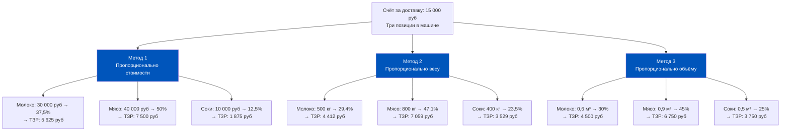
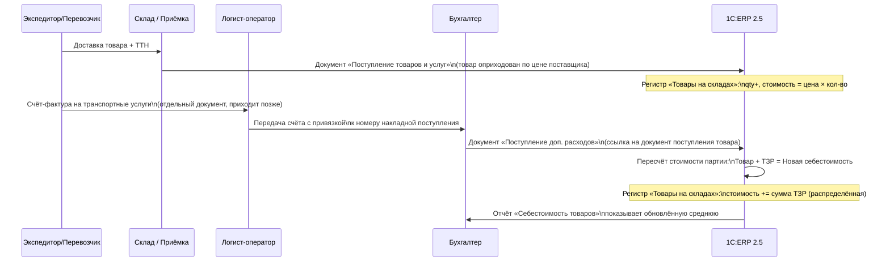
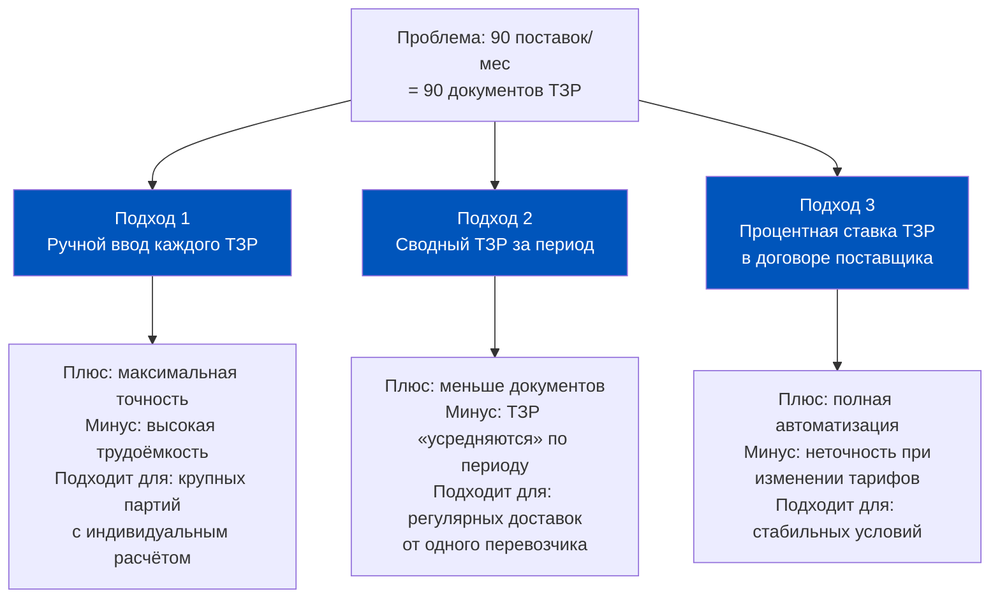
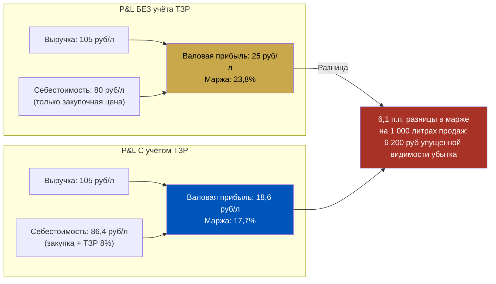
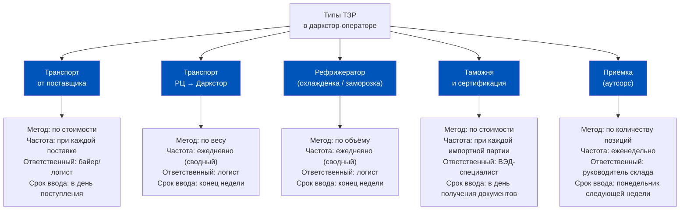
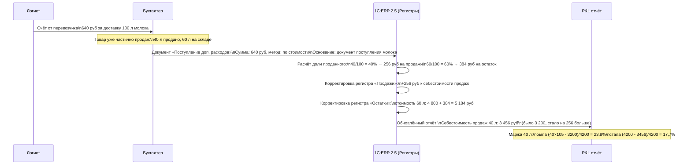

# Неделя 8. День 2. Транспортно-заготовительные расходы: как логистика меняет реальную себестоимость товара

> Поставщик выставил счёт на 1 000 000 рублей. ERP зафиксировала поступление. Вы думаете, что знаете себестоимость этой партии. Но между накладной поставщика и реальной ценой товара на полке существует невидимый зазор — и он называется транспортно-заготовительные расходы.

## Содержание

1. [[#Часть 1. Что такое ТЗР и зачем их включать в себестоимость]]
2. [[#Часть 2. Методы распределения ТЗР в ERP 2.5]]
3. [[#Часть 3. Документооборот ТЗР: от накладной экспедитора до ERP]]
4. [[#Часть 4. ТЗР в Q-com: специфика частых поставок]]
5. [[#Часть 5. Влияние ТЗР на показатели категорий]]
6. [[#Часть 6. Ошибки учёта ТЗР и их последствия]]
7. [[#Часть 7. Архитектурное решение: стандарт ТЗР для даркстора]]

---

## Часть 1. Что такое ТЗР и зачем их включать в себестоимость

Начнём с детективной сцены. Финансовый директор смотрит на P&L за октябрь и видит: маржа по категории «Свежее мясо» — 18%. Байер говорит, что закупает по 600 рублей за килограмм и продаёт по 780. Простая математика: 23% маржи. Откуда взялись 18%?

Ответ — в транспортно-заготовительных расходах, которые либо не были учтены, либо учтены неправильно.

**Определение и состав ТЗР**

Транспортно-заготовительные расходы (ТЗР) — это все затраты, которые организация несёт для того, чтобы товар физически переместился от поставщика на склад и был принят к учёту. В международной терминологии это аналог «landed costs» (расходы на посадку груза).

Состав ТЗР варьируется в зависимости от бизнеса, но типичный набор для российского Q-com-оператора включает:

**Транспортные расходы:**
- Доставка от поставщика до распределительного центра (РЦ)
- Доставка с РЦ на даркстор
- Топливные надбавки и дополнительные тарифы перевозчика
- Аренда рефрижераторного транспорта для скоропортящихся товаров

**Заготовительные расходы:**
- Таможенные пошлины и сборы (для импортных товаров)
- Услуги таможенного брокера
- Страхование груза в пути
- Сертификация и ветеринарный контроль (для продуктов питания)

**Складские расходы при приёмке:**
- Услуги ответственного хранения на промежуточном складе
- Стоимость приёмки (если выполняется внешним провайдером)
- Расходы на переупаковку или перемаркировку

**Правило учёта в ERP 2.5:**

В 1C:ERP 2.5 ТЗР могут учитываться двумя способами:
1. **Включение в себестоимость** — ТЗР распределяются на конкретные номенклатурные позиции и увеличивают их стоимость в регистрах. Это основной и рекомендуемый способ.
2. **Отдельная статья расходов** — ТЗР учитываются как самостоятельная строка в P&L, не привязанная к конкретным позициям.

Первый способ даёт точную маржу по каждому SKU. Второй — проще в администрировании, но скрывает реальную рентабельность позиций.

**Почему «забытые» ТЗР — системная проблема:**

Компании, которые не учитывают ТЗР в себестоимости, систематически завышают маржу по категориям. Они думают, что зарабатывают 23%, а зарабатывают 18%. Разница в 5 п.п. — это не ошибка округления, это стратегическое заблуждение при ценообразовании.

В Q-com, где операционные расходы на последнюю милю уже высоки, такая ошибка может привести к тому, что отдельные категории работают в убыток — а менеджмент об этом не знает.

---

## Часть 2. Методы распределения ТЗР в ERP 2.5

Допустим, перевозчик привёз одну машину с тремя видами товаров: молоко, мясо и соки. Счёт за доставку — 15 000 рублей. Как распределить эти 15 000 между позициями?

В ERP 2.5 существует три метода распределения дополнительных расходов.

Обратите внимание: результат существенно отличается в зависимости от метода. Молоко получит от 4 412 до 5 625 рублей ТЗР — разброс 28%. Для позиции с небольшой маржой это критично.

**Когда выбрать каждый метод:**

**Пропорционально стоимости** — самый распространённый выбор по умолчанию. Логика: дорогой товар «несёт» больше расходов пропорционально своей стоимости. Проблема: дорогой товар не обязательно занимает больше места или весит больше. Мясо стоит дорого и тяжёлое — метод справедлив. Ювелирные украшения стоят дорого и лёгкие — метод несправедлив.

**Пропорционально весу** — лучший выбор для транспортных расходов, где тариф определяется весом груза (большинство наземных перевозчиков). Логика: кто занял больше грузоподъёмности, тот платит больше. Подходит для тяжёлых категорий: овощи, напитки, консервы.

**Пропорционально объёму** — лучший выбор для расходов на хранение и рефрижераторные перевозки, где тариф определяется кубометрами. Молоко в тетрапаках — объёмный товар при относительно небольшом весе.

**Документ «Поступление дополнительных расходов» в ERP 2.5:**

Это ключевой документ для ввода ТЗР. Его поля:

| Поле | Назначение | Примечание |
|------|-----------|------------|
| Документ-основание | Ссылка на поступление товаров | Связывает ТЗР с конкретной партией |
| Контрагент | Поставщик услуги (перевозчик, экспедитор) | Может отличаться от поставщика товара |
| Статья расходов | Классификация ТЗР | Транспорт / Таможня / Хранение |
| Метод распределения | По стоимости / весу / объёму | Выбирается здесь |
| Сумма | Стоимость услуги | В валюте расчётов |
| Период | Когда ТЗР войдут в себестоимость | Должен совпадать с периодом поступления |

Поле «Документ-основание» — критически важное. Без него ERP не знает, к какой партии привязать ТЗР, и не сможет корректно рассчитать себестоимость конкретного поступления.

---

## Часть 3. Документооборот ТЗР: от накладной экспедитора до ERP

Понять, как ТЗР попадают в ERP, можно только проследив полную цепочку документов. В реальном даркстор-операторе эта цепочка выглядит следующим образом:

**Критический момент — временной разрыв:**

Товар приехал в понедельник. Счёт от перевозчика пришёл в пятницу. Бухгалтер ввёл «Поступление доп. расходов» в следующий вторник. С понедельника по вторник ERP работает с заниженной себестоимостью этой партии.

Это нормально — если временной разрыв небольшой (2–5 дней) и если счёт введён до закрытия месяца.

Это проблема — если счёт задержался и попал в следующий месяц. Тогда ТЗР «упадут» в себестоимость следующего периода, хотя товар уже давно продан.

**Сверочный процесс:**

Хорошая практика: сверочная таблица поступлений, по которым ТЗР ещё не введены. В ERP 2.5 это можно реализовать через отчёт по документам поступления без связанных «Поступлений доп. расходов». Бухгалтер-логистик закрывает эту таблицу до конца каждой недели.

---

## Часть 4. ТЗР в Q-com: специфика частых поставок

Q-commerce принципиально отличается от классического ритейла по ритму поставок. Гипермаркет получает поставку от крупного поставщика раз в неделю — один документ, одни ТЗР. Даркстор получает поставки ежедневно, а некоторые категории (свежая выпечка, охлаждённые полуфабрикаты) — дважды в день.

Это означает: вместо 4 документов ТЗР в месяц у вас может быть 60–120.

**Математика накопления:**

Допустим, доставка одной машины из 15 позиций стоит 3 500 рублей. В день — 3 поставки. В месяц — около 90 доставок. Это 315 000 рублей транспортных расходов, которые нужно распределить по 1 350 документам поступления (условно).

Административная нагрузка становится серьёзной проблемой.

**Типичные ТЗР в Q-com по статьям:**

| Статья ТЗР | Частота возникновения | Типичная доля от суммы поставки | Метод распределения |
|------------|----------------------|--------------------------------|---------------------|
| Доставка от РЦ до даркстора | Ежедневно | 3–6% | По весу или объёму |
| Доставка от поставщика до РЦ | 2–5 раз в неделю | 1–3% | По стоимости |
| Рефрижераторная надбавка | Ежедневно (охлаждёнка) | 0,5–1,5% | По объёму |
| Приёмка на РЦ (аутсорс) | Ежедневно | 0,3–0,8% | По количеству позиций |
| Таможня (импорт) | По мере поступления импорта | 5–20% | По стоимости |
| Ветконтроль и сертификация | По мере поступления новых партий | 0,1–0,5% | По количеству |

**Как автоматизировать учёт ТЗР при высокой частоте поставок:**

ERP 2.5 поддерживает несколько подходов к автоматизации:

**Подход 2 (сводный ТЗР) — наиболее распространённый компромисс** в Q-com. Перевозчик выставляет один счёт в конце недели на все поставки за неделю. Бухгалтер создаёт один документ «Поступление доп. расходов» и указывает несколько документов-оснований. ERP распределяет сумму пропорционально выбранному методу по всем связанным поступлениям.

Ограничение: если одна из поставок недели была значительно крупнее остальных, а фактические затраты на неё были ниже средних (например, поставщик сам привёз товар), сводный ТЗР даст некорректное распределение. Это приемлемо для операционного мониторинга, но требует учёта при стратегическом анализе рентабельности категорий.

---

## Часть 5. Влияние ТЗР на показатели категорий

Абстрактные проценты становятся понятными на конкретных числах. Разберём полный расчёт на примере категории «Молочные продукты».

**Базовый пример:**

Молоко закуплено у поставщика по 80 рублей за литр. ТЗР составляют 8% от стоимости закупки.

Фактическая себестоимость: 80 × 1,08 = 86,4 рубля за литр.

Розничная цена: 105 рублей за литр.

Теперь считаем маржу двумя способами:

**Эффект на расчёт наценки и ценообразование:**

Если байер устанавливает наценку на основе закупочной цены без ТЗР, он рассчитывает наценку от 80 рублей. Но реальная база себестоимости — 86,4 рубля. Чтобы получить 20% маржи от реальной себестоимости, цена должна быть:

- Без ТЗР: 80 × 1,25 = 100 рублей (наценка 25% = маржа 20%)
- С ТЗР: 86,4 × 1,25 = 108 рублей

Разница в целевой цене: 8 рублей на литр. На объёме продаж в 10 000 литров в месяц — это 80 000 рублей недополученной прибыли или, что хуже, реальный убыток при установке «правильной» на вид цены.

**Категориальный эффект:**

Влияние ТЗР на разные категории неодинаково. Тяжёлые и объёмные товары с низкой стоимостью за единицу объёма несут пропорционально больше транспортных расходов:

| Категория | Закупочная цена | ТЗР (% от закупки) | Фактическая себестоимость | Наценка без ТЗР выглядит как | Реальная маржа |
|-----------|----------------|---------------------|--------------------------|-------------------------------|----------------|
| Молоко | 80 руб/л | 8% | 86,4 руб/л | 23,8% | 17,7% |
| Мясо охлаждённое | 550 руб/кг | 6% | 583 руб/кг | 20% | 15,1% |
| Соки в ПЭТ | 45 руб/л | 12% | 50,4 руб/л | 22% | 10,7% |
| Кофе молотый | 800 руб/кг | 2% | 816 руб/кг | 18% | 16,7% |
| Свежая выпечка | 60 руб/шт | 10% | 66 руб/шт | 25% | 16,7% |

Соки в ПЭТ — пример категории, которая при неучёте ТЗР будет выглядеть прибыльной, но фактически работает на грани безубыточности.

---

## Часть 6. Ошибки учёта ТЗР и их последствия

В практике Q-com-операторов встречаются три типичные ошибки учёта ТЗР. Каждая имеет свой характерный «почерк» — по которому её можно диагностировать в отчётности.

**Ошибка 1: ТЗР не введены вообще**

Это наиболее распространённая ошибка на старте работы или при смене подрядчика. Компания получает услуги перевозчика, оплачивает счета, но не вводит документы «Поступление доп. расходов» в ERP. Или вводит их как прямые расходы (статья «Транспортные расходы»), не связанные с конкретными поступлениями товаров.

Последствия: P&L показывает завышенную маржу по всем категориям. Транспортные расходы «висят» в отдельной строке операционных расходов и не уменьшают валовую прибыль. При анализе категорий кажется, что молоко приносит 24%, хотя приносит 18%.

Диагностика: сравнить «Транспортные расходы» в P&L с суммой ТЗР, распределённых на себестоимость. Если первое значительно больше второго — ТЗР не привязываются к поступлениям.

**Ошибка 2: ТЗР введены в неправильном периоде**

Товар поступил в октябре. Счёт от перевозчика введён в ноябре. В ERP документ «Поступление доп. расходов» оформлен ноябрём. Результат: в октябре себестоимость занижена, в ноябре — завышена за счёт «чужих» ТЗР.

Это создаёт эффект «пилы» в ежемесячной динамике маржи: октябрь выглядит лучше нормы, ноябрь — хуже. Если это происходит системно, динамика маржи по категориям становится нечитаемой.

Диагностика: если маржа категории колеблется на 3–5 п.п. от месяца к месяцу при стабильных закупочных ценах — скорее всего, дело в переходящих ТЗР.

**Ошибка 3: Неверный метод распределения**

ТЗР вводятся корректно и вовремя, но метод распределения выбран неподходящий. Например, для рефрижераторной доставки выбран метод «по стоимости» вместо «по объёму». В результате дорогое мясо несёт непропорционально большую долю транспортных расходов, а дешёвые соки — непропорционально малую.

Последствия более тонкие: общая себестоимость не искажена (все ТЗР распределены), но распределение между категориями некорректное. Управленческие решения о категориальном миксе принимаются на основе неверных данных.

Диагностика: сравнить долю ТЗР в себестоимости по категориям с физическими характеристиками товаров (вес, объём). Если доля ТЗР у тяжёлых объёмных товаров ниже, чем у лёгких дорогих — метод подобран неверно.

**Сводная таблица ошибок:**

| Ошибка | Признак в отчётности | Последствие для решений | Сложность исправления |
|--------|---------------------|------------------------|----------------------|
| ТЗР не введены | Завышена маржа всех категорий, «транспортные расходы» в операционных | Неверное ценообразование | Высокая (ретроввод) |
| Неверный период | Пила в динамике маржи по месяцам | Ложные выводы о трендах | Средняя (корректировка) |
| Неверный метод | Перекос рентабельности между категориями | Неверный ассортиментный микс | Средняя (перенастройка) |

---

## Часть 7. Архитектурное решение: стандарт ТЗР для даркстора

К этому моменту у нас есть полное понимание механики ТЗР. Осталось превратить понимание в операционный стандарт.

**Рекомендации по настройке ERP:**

Первое: создайте справочник статей дополнительных расходов с явным разделением по типам. Не «Транспортные расходы» единой строкой, а «Транспорт от поставщика», «Транспорт РЦ-даркстор», «Рефрижераторная надбавка», «Таможня», «Сертификация». Это позволит анализировать структуру ТЗР по типам и видеть, какая составляющая растёт.

Второе: для каждой статьи ТЗР зафиксируйте метод распределения по умолчанию. Это исключит ситуацию, когда разные бухгалтеры применяют разные методы к одному и тому же типу расходов.

Третье: настройте контроль документооборота. Документ «Поступление доп. расходов» должен создаваться не позже, чем через 5 рабочих дней после поступления товара и в том же отчётном месяце.

**Стандарт ТЗР для типового даркстора:**

**Итоговый чеклист: стандарт учёта ТЗР для PM**

- [ ] Все типы ТЗР описаны в справочнике статей расходов ERP
- [ ] Для каждого типа ТЗР зафиксирован метод распределения и ответственный
- [ ] Срок ввода ТЗР — не позже 5 рабочих дней и в рамках отчётного месяца
- [ ] Существует еженедельная сверка: поступления без привязанных ТЗР
- [ ] После закрытия каждого месяца анализируется доля ТЗР в себестоимости по категориям
- [ ] Байеры знают фактическую себестоимость (с ТЗР) и используют её в ценообразовании
- [ ] Метод распределения ТЗР проверяется на соответствие физическим характеристикам товаров раз в квартал

**Финальный вывод:**

ТЗР — это невидимый налог на перемещение товара, который всегда существует, но не всегда учитывается. В Q-com, где поставки ежедневные и многочисленные, административная нагрузка по учёту ТЗР высока. Именно поэтому многие операторы выбирают упрощение — сводный документ раз в неделю или процентную ставку по умолчанию.

Это допустимо. Но только если упрощение сделано осознанно, задокументировано и регулярно проверяется на адекватность. Упрощение, превратившееся в игнорирование — это путь к систематически неверному P&L и управленческим решениям на ложных данных.

PM, который понимает, как ТЗР течёт от накладной экспедитора до строки «Себестоимость продаж» в P&L, может задать правильные вопросы финансовому директору, байерам и логистам. И получить от них не «у нас всё правильно», а конкретный ответ: какой метод, за какой период, кто ответственный, когда последний раз проверялось.

**Кейс: как неучтённые ТЗР разрушили ценообразование в категории «Напитки»**

Разберём показательную ситуацию. Q-com оператор запустил собственный импорт соков из Армении. Байер согласовал закупочную цену: 42 рубля за литр. Розничная цена установлена 68 рублей — расчётная маржа 38,2%. Категория «выстрелила»: хорошие продажи, довольные клиенты.

Через два месяца финансист открыл закрытый P&L и обнаружил, что категория «Импортные соки» показала маржу 11,4%. Байер в недоумении: «Я считал 38%».

Детективный разбор:

Первый пропущенный слой: таможенные расходы. Пошлина 5% + НДС на таможне + сборы = 15% от контрактной стоимости. Байер считал от контрактной цены CIF (стоимость + страховка + фрахт до границы), но не включал таможню. Фактическая цена после таможни: 42 × 1,15 = 48,3 рубля.

Второй пропущенный слой: логистика внутри страны. Доставка от таможенного склада до РЦ + от РЦ до даркстора: 4,2 рубля за литр. Итого: 48,3 + 4,2 = 52,5 рубля.

Третий пропущенный слой: потери при транспортировке и бой стеклотары. Статистически 3% объёма списывалось. Реальная стоимость продаваемого литра: 52,5 / 0,97 = 54,1 рубля.

Расчётная маржа при цене 68 рублей: (68 − 54,1) / 68 = 20,4%. Не 38%, не 11%. Где остальные 9%?

Четвёртый слой: промо-скидки и возвраты, которые уменьшали выручку. Это уже не ТЗР, но принцип тот же — неучтённые элементы искажают итог.

Итог: байер принял верное решение о запуске категории, но с неверными данными о себестоимости. Если бы ТЗР были учтены с первого дня, цена была бы установлена на уровне 72–75 рублей — и категория всё равно была бы конкурентоспособной при реальной марже 28–30%.

**Глубокий взгляд: как ERP хранит и пересчитывает ТЗР**

Для понимания механики важно проследить, что именно происходит в регистрах ERP 2.5, когда вводится документ «Поступление доп. расходов».

До ввода ТЗР:
- Регистр «Товары на складах»: 100 л молока, стоимость 8 000 руб (80 руб/л)
- Документ поступления: привязан к партии, стоимость зафиксирована

После ввода ТЗР (640 рублей = 8% от стоимости, метод «по стоимости»):
- Регистр «Товары на складах»: 100 л молока, стоимость 8 640 руб (86,4 руб/л)
- В партии создаётся запись о дополнительных расходах: 640 руб, статья «Транспорт»
- Средневзвешенная для этой номенклатуры пересчитывается с учётом новой стоимости партии

Если к моменту ввода ТЗР часть товара уже продана:
- Допустим, из 100 л уже продано 40 л (на момент ввода ТЗР)
- ERP распределит ТЗР пропорционально: 40% (256 руб) — на уже проданный товар, 60% (384 руб) — на остаток
- ТЗР на проданный товар скорректируют себестоимость продаж ретроспективно — в рамках текущего месяца

Это важный нюанс: ТЗР влияют не только на стоимость текущего остатка, но и на себестоимость уже совершённых продаж. Именно поэтому своевременность ввода ТЗР критична — чем раньше, тем точнее текущий P&L.

**Стратегические выводы: ТЗР как инструмент категориального менеджмента**

Большинство компаний воспринимают ТЗР как бухгалтерскую обязанность: надо учесть, потому что того требуют правила. Но зрелая операционная модель использует данные о ТЗР как стратегический инструмент.

Первое применение: **сравнительный анализ поставщиков**. Два поставщика предлагают молоко по одинаковой цене. Но один находится в 30 км от даркстора, другой — в 200 км, и привозит реже, крупными партиями. Анализ ТЗР по каждому поставщику покажет реальную разницу в landed cost — и это может изменить решение о предпочтительном контрагенте.

Второе применение: **оптимизация логистических маршрутов**. Если ТЗР по категории «Свежая выпечка» составляют 15% (из-за ежедневных небольших поставок от 5 пекарен), это сигнал к пересмотру логистической схемы: консолидированный хаб, молочная кухня при РЦ, или укрупнение партий.

Третье применение: **ценовые переговоры с поставщиками**. Поставщик, который доставляет сам («самовывоз»), фактически берёт на себя ваши ТЗР. Это можно монетизировать в переговорах: «мы готовы работать по цене X, если вы обеспечиваете доставку до наших дверей, иначе нам нужна скидка Y на ваши транспортные расходы».

Четвёртое применение: **портфельные решения**. Категория с высокой долей ТЗР и небольшой маржой — кандидат на исключение из ассортимента или на перевод к поставщику с меньшими транспортными издержками.

**Связь с темой Дня 1: ТЗР и средневзвешенная себестоимость**

ТЗР не существуют в вакууме — они непосредственно влияют на средневзвешенную себестоимость, которую мы разбирали в Day 1. Каждый введённый документ «Поступление доп. расходов» изменяет стоимость конкретной партии в регистре и тем самым сдвигает среднюю по SKU.

Это означает, что все проблемы с точностью ТЗР (несвоевременность, неверный метод, пропуски) транслируются в проблемы с точностью средневзвешенной — и далее в неточность P&L по категориям.

Система точна ровно настолько, насколько точны её входные данные. ТЗР — один из ключевых входных потоков данных о себестоимости.

**Резюме урока в пяти тезисах:**

Первый тезис: ТЗР — это не дополнительная строчка в P&L. Это часть себестоимости каждой номенклатурной позиции. Компания, которая не учитывает ТЗР в себестоимости, систематически завышает маржу по всем категориям.

Второй тезис: в ERP 2.5 ТЗР вводятся через документ «Поступление доп. расходов», обязательно привязанный к документу-основанию (конкретной поставке). Без привязки — ТЗР не влияют на себестоимость SKU.

Третий тезис: метод распределения ТЗР (по стоимости, весу, объёму) существенно влияет на себестоимость конкретных позиций. Неверный метод перераспределяет рентабельность между категориями, не искажая общий итог.

Четвёртый тезис: в Q-com с ежедневными поставками сводный еженедельный документ ТЗР — допустимый компромисс, если вводится в том же отчётном месяце. ТЗР следующего месяца за товар текущего — это уже ошибка периода.

Пятый тезис: неучтённые ТЗР создают управленческие иллюзии. Байер думает, что категория зарабатывает 24%, хотя зарабатывает 17%. На основании этой иллюзии принимаются решения о ценообразовании, развитии ассортимента и переговорах с поставщиками.

**Контрольные вопросы для самопроверки:**

Перед тем как перейти к уроку Day 3, проверьте понимание ключевых концепций. Это вопросы уровня Middle PM — те, на которые вы должны отвечать без подсказок на совещании с финансовым директором.

1. Что такое ТЗР? Перечислите не менее пяти типичных составляющих ТЗР для российского Q-com оператора.
2. Чем «Поступление доп. расходов» отличается от простой записи расхода в статью «Транспорт»? Какой из вариантов влияет на себестоимость SKU?
3. Поставщик привёз три категории товара в одной машине. Счёт за доставку — 12 000 рублей. Какой метод распределения вы выберете и почему? Как изменится ваш ответ, если речь идёт о рефрижераторной доставке охлаждённого мяса?
4. Счёт от перевозчика за доставки первой половины октября пришёл 3 ноября и был введён в ERP ноябрём. Как это повлияет на P&L октября и ноября?
5. Байер говорит: «Молоко даёт 24% маржи». Вы знаете, что ТЗР на молоко составляют 8%. Какова реальная маржа, и что нужно изменить в ценообразовании, чтобы сохранить целевую маржу 20%?
6. Назовите три признака того, что в вашей ERP ТЗР учитываются неправильно или неполно.
7. Почему для Q-com оператора с ежедневными поставками сводный ТЗР за неделю — допустимый компромисс, а не ошибка?

**Глоссарий ключевых терминов урока:**

| Термин | Определение в контексте ERP 2.5 |
|--------|--------------------------------|
| ТЗР (транспортно-заготовительные расходы) | Все затраты, связанные с доставкой и приёмкой товара от поставщика до склада |
| Landed cost | Международный эквивалент ТЗР — полная стоимость товара с учётом всех логистических издержек |
| Поступление доп. расходов | Документ ERP 2.5, связывающий сумму ТЗР с конкретным документом поступления товара |
| Метод распределения | Правило, по которому общая сумма ТЗР делится между позициями поставки (по стоимости, весу, объёму) |
| Сводный ТЗР | Один документ «Поступление доп. расходов», охватывающий несколько документов поступления за период |
| Документ-основание | Поле в «Поступлении доп. расходов», ссылающееся на документ поступления товара. Обязательно для корректного учёта |
| Временной разрыв ТЗР | Период между фактическим поступлением товара и вводом связанных ТЗР в ERP |

**Мост к следующему уроку:**

В Day 3 мы перейдём к теме казначейства и управления денежными потоками в ERP 2.5. Если себестоимость отвечает на вопрос «во что нам обошёлся этот товар», то казначейство отвечает на вопрос «когда именно деньги покинули наш счёт и вернулись обратно».

Ключевое соединение: ТЗР — это не просто строчка в P&L. Это ещё и платёж, который нужно планировать в cash flow. Перевозчик выставил счёт — у вас 14 дней по договору на оплату. Значит, деньги уйдут через две недели после того, как товар уже продан. Это создаёт временной разрыв, который нужно учитывать при управлении оборотным капиталом.

Если вы сегодня поняли, как ТЗР влияют на себестоимость — завтра вы поймёте, как они влияют на cash flow. Это два взгляда на одно и то же событие: принятие логистической услуги.

---

← [[Неделя 8 - День 1 - Себестоимость|← День 1]] | [[1c_erp_qcom/README|Оглавление]] | [[Неделя 8 - День 3 - Казначейство и управление кэшем|День 3 →]]
