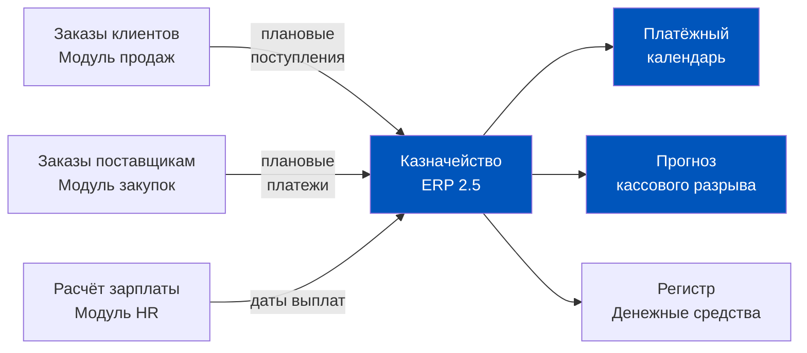
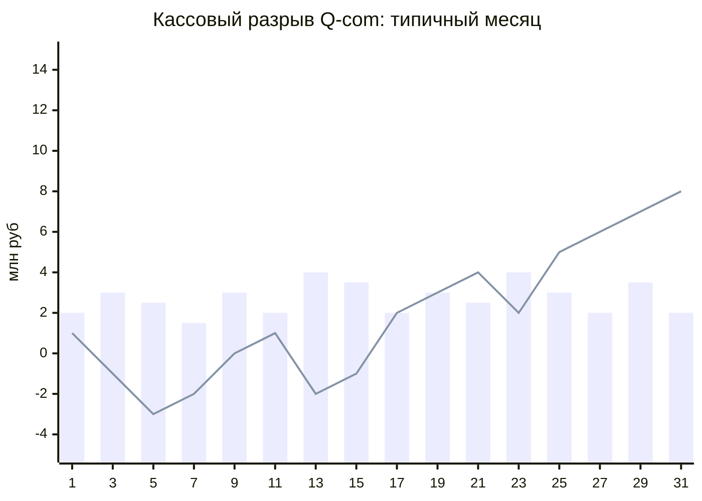
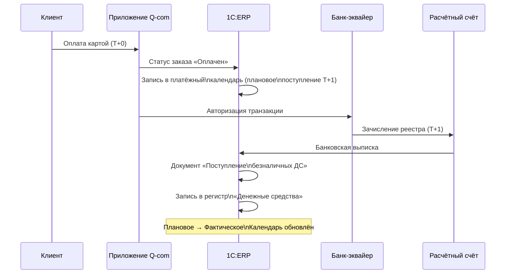
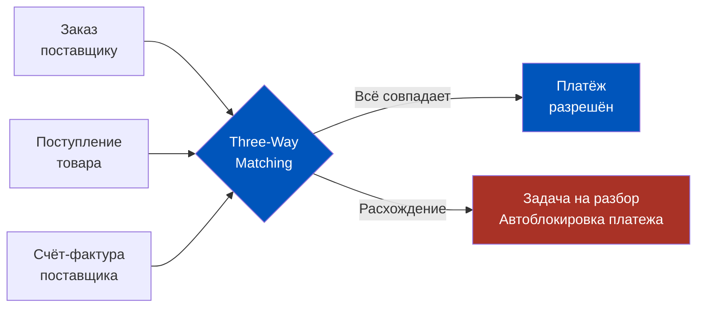
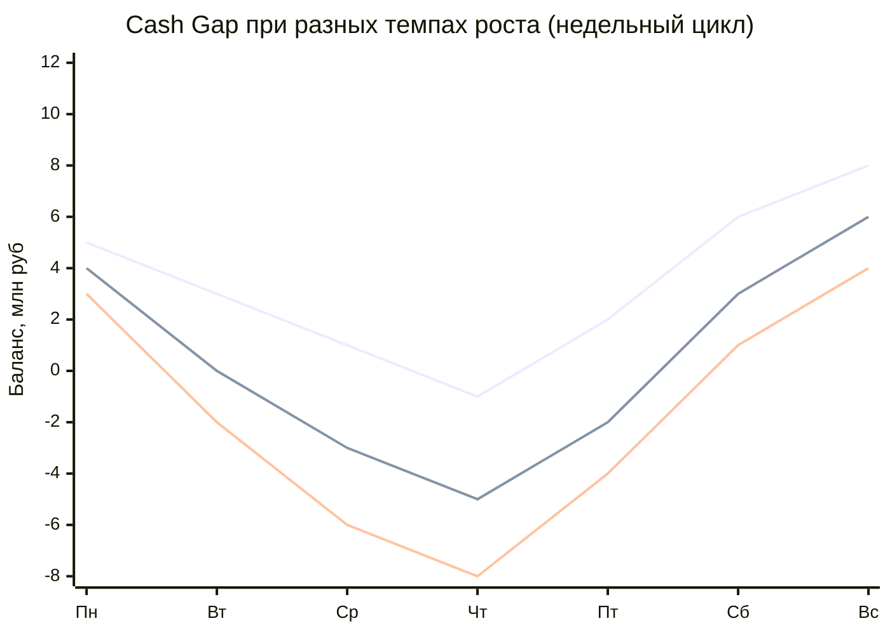
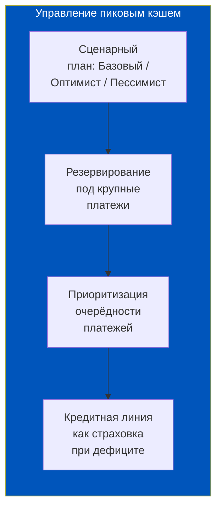
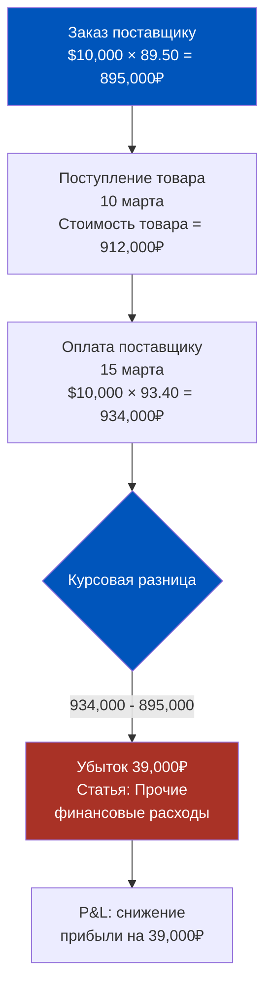
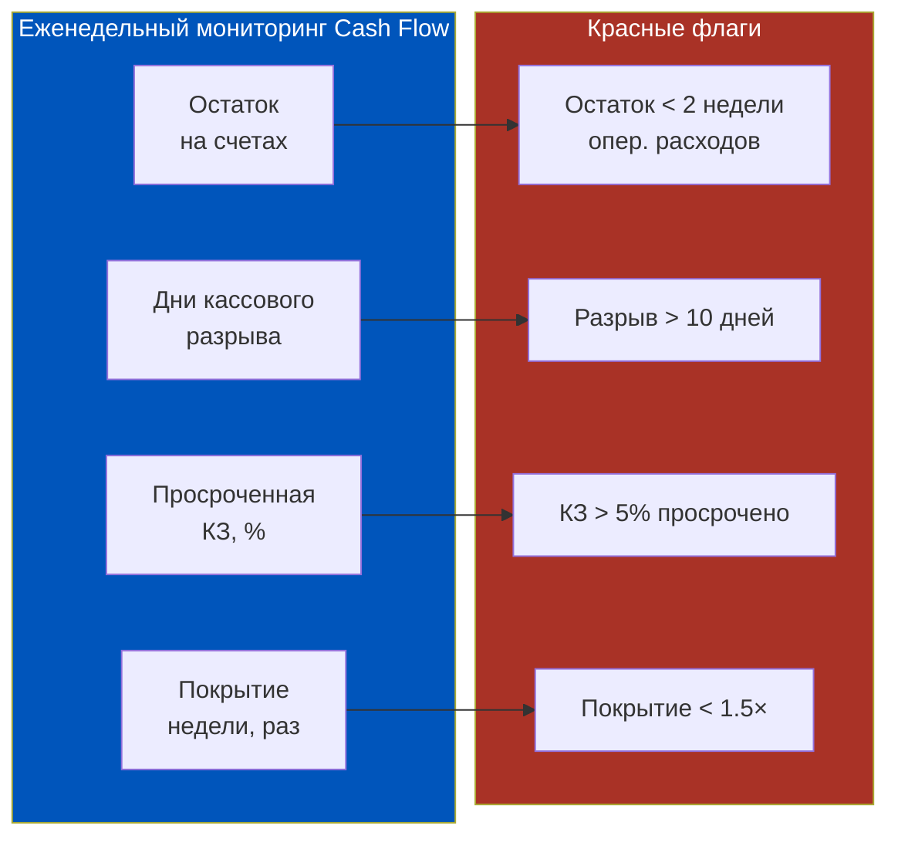
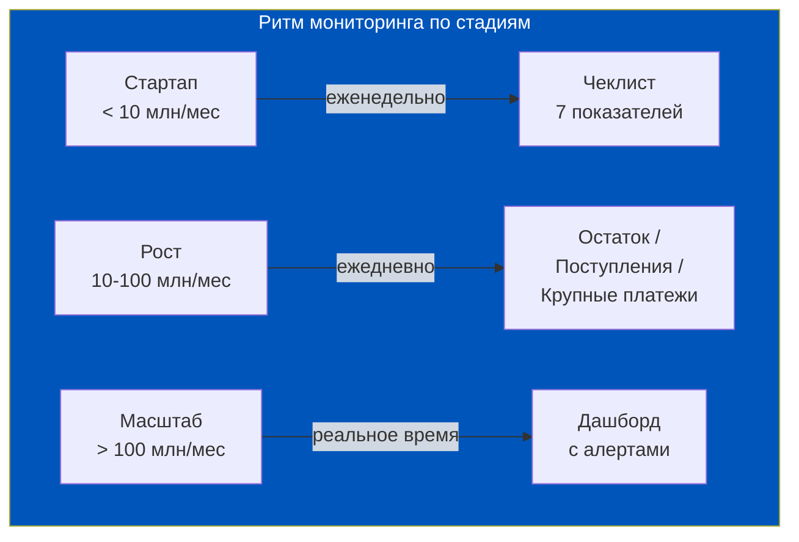
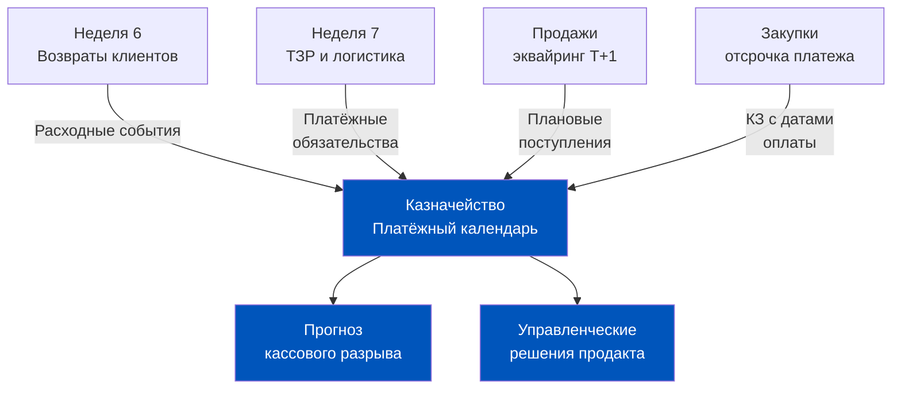

# Казначейство и управление кэшем в 1C:ERP 2.5

> Деньги в Q-commerce движутся быстро: сегодня клиент заплатил картой, завтра деньги упали на счёт, через три дня нужно перевести поставщику за вчерашние товары. Тот, кто не видит этого потока в режиме реального времени, управляет бизнесом вслепую.

## Содержание

1. [[#Часть 1. Казначейство в ERP: зачем продакту понимать движение денег]]
2. [[#Часть 2. Платёжный календарь в 1C:ERP 2.5]]
3. [[#Часть 3. Как ERP 2.5 фиксирует движение денег]]
4. [[#Часть 4. Взаиморасчёты с поставщиками: контроль долгов]]
5. [[#Часть 5. Управление кэшем в пиковые периоды]]
6. [[#Часть 6. Валютные операции и курсовые разницы]]
7. [[#Часть 7. Чеклист продакта: 7 вопросов по здоровью Cash Flow]]

---

## Часть 1. Казначейство в ERP: зачем продакту понимать движение денег

Когда говорят «казначейство», финтех-менеджер думает о банках и деривативах. Продакт Q-commerce должен думать иначе: казначейство — это разница между тем, когда деньги поступают, и тем, когда их нужно отдать. В этой разнице живёт или умирает бизнес быстрой доставки.

**Почему операционный кэш-дефицит — главная угроза Q-com**

Рассмотрим механику: клиент заказал продукты на 3 000 рублей и оплатил картой. Эквайер зачислит деньги на расчётный счёт через 1-2 рабочих дня. Но поставщик уже отгрузил товар, и у него есть отсрочка платежа — допустим, 7 дней. Пока всё хорошо. Теперь умножим: 10 000 заказов в сутки, оборот 30 миллионов в месяц, темп роста 40% месяц к месяцу. При таком росте объём товара, который нужно оплатить поставщикам, растёт быстрее, чем накапливаются деньги на счёте. Это и есть структурный кассовый разрыв быстрорастущего Q-com.

**Три источника Cash Flow в Q-commerce**

Первый и главный источник — **выручка от продаж через эквайринг**. В Q-com практически 100% платежей безналичные: карты, SBP, кошельки. Деньги не мгновенные: от транзакции клиента до поступления на счёт проходит от нескольких часов до двух рабочих дней в зависимости от банка-эквайера и типа платёжного инструмента.

Второй источник — **платежи поставщикам**, но со знаком минус. Это крупнейший отток кэша. Поставщики федеральных брендов дают отсрочку 14-30 дней, локальные производители нередко требуют предоплату или работают по факту. Совокупный объём кредиторской задолженности в растущем Q-com может превышать месячный оборот.

Третий источник — **операционные расходы**: аренда тёмных кухонь и даркстор-помещений, фонд оплаты труда курьеров и комплектовщиков, коммунальные платежи. Они предсказуемы по дате, но именно их регулярность создаёт жёсткие дедлайны в платёжном календаре.

**Почему продакту, а не только финансисту, важно это знать**

Продакт принимает решения, которые напрямую влияют на Cash Flow. Запустить новую категорию товаров с предоплатой поставщику — значит иммобилизовать кэш за 2-3 недели до первых продаж. Поднять средний чек через бандлы — значит ускорить оборот денег. Ввести промо с отсрочкой выплаты промобонуса — значит сдвинуть отток вправо. Каждое продуктовое решение имеет кэш-последствие, и 1C:ERP — инструмент, где это последствие становится видимым.

**Связь операционных процессов с денежными потоками в ERP**

В архитектуре 1C:ERP 2.5 казначейский модуль не изолирован. Он получает данные из трёх смежных контуров:
- Модуль продаж передаёт плановые поступления (заказы, оплаченные клиентами)
- Модуль закупок передаёт плановые платежи (заказы поставщикам с датами оплаты)
- Модуль зарплаты передаёт данные о плановых выплатах персоналу

Именно эта интеграция делает платёжный календарь ERP живым инструментом, а не статичным отчётом.

**Четыре роли, которые видят казначейство по-разному**

Одни и те же данные казначейского модуля читаются четырьмя разными людьми в организации с четырьмя разными целями.

CFO смотрит на казначейство через призму ликвидности и соответствия финансовому плану: хватает ли денег на операционную деятельность, не нарушены ли ковенанты по кредитным договорам.

Финансовый контролер смотрит на корректность документооборота: правильно ли проведены все платежи, нет ли нераспределённых поступлений, закрыты ли все авансы.

Менеджер по закупкам смотрит на взаиморасчёты с поставщиками: кому нужно заплатить в ближайшие 3 дня, у кого заканчивается отсрочка.

Продакт смотрит на казначейство как на обратную связь от операционных решений: как новая категория влияет на денежный поток, где пиковые нагрузки на кэш, какова стоимость быстрого роста в рублях.

Понимание этих четырёх перспектив помогает продакту грамотно ставить задачи финансовой команде и извлекать нужные данные из системы.

---

## Часть 2. Платёжный календарь в 1C:ERP 2.5

Платёжный календарь — это документ-витрина казначейского модуля. Он не хранит данные сам по себе: он агрегирует плановые поступления и расходы из всей системы и выводит их на временной оси. Понять его структуру — значит научиться читать финансовое будущее компании на горизонте 30-90 дней.

**Структура документа «Платёжный календарь»**

Документ организован по строкам и периодам. Каждая строка — это отдельная статья движения денежных средств, привязанная к конкретной организации, расчётному счёту или кассе. Ключевые поля:

- **Дата планируемого движения** — когда ожидается поступление или списание
- **Статья ДДС** (движения денежных средств) — категория: «Поступления от покупателей», «Оплата поставщикам», «Расходы на персонал»
- **Контрагент** — кто платит или кому платят
- **Сумма плановая / фактическая** — план из заказов vs реальные движения
- **Банковский счёт / касса** — куда поступит или откуда спишется
- **Статус** — «Запланировано», «Подтверждено», «Исполнено», «Отменено»
- **Документ-основание** — ссылка на заказ поставщику, заказ клиента или договор

**Плановые поступления: откуда берутся данные**

Когда в модуле продаж создаётся заказ клиента и клиент производит оплату (через эквайринг или по счёту), система автоматически формирует запись в платёжном календаре с датой ожидаемого зачисления. Для эквайринга эта дата рассчитывается как «дата транзакции + N рабочих дней» согласно договору с банком-эквайером.

**Плановые расходы: три категории**

Первая категория — **платежи поставщикам**. Они попадают в календарь при создании заказа поставщику: система берёт дату отгрузки, прибавляет срок отсрочки по договору и ставит дату платежа. Если договор предусматривает частичную предоплату — в календаре появляется два события: предоплата при заказе и остаток при поставке.

Вторая категория — **аренда и коммунальные платежи**. Они планируются через шаблоны повторяющихся платежей. В ERP 2.5 есть механизм «Типовых операций», который автоматически генерирует плановые строки календаря на основе периодических договоров.

Третья категория — **заработная плата**. Даты выплат (аванс и расчёт) приходят из модуля HR. Для Q-com с большой долей сдельных курьеров это особенно чувствительно: объём выплат напрямую зависит от операционной нагрузки предшествующих недель.

**Кассовый разрыв: как его видит ERP**

Кассовый разрыв — это ситуация, когда суммарные расходы в конкретный день или период превышают суммарные поступления плюс остаток на счёте. ERP не просто показывает данные — она подсвечивает строки с отрицательным накопленным балансом.

На графике видна типичная картина: в начале месяца поступления от продаж ещё накапливаются, тогда как платежи поставщикам (крупные, за поставки предыдущей недели) уже наступают. Накопленный баланс проваливается в минус — это и есть кассовый разрыв. К середине месяца ситуация выравнивается, а к концу — накапливается положительный остаток до следующего цикла.

**Управленческий вывод из платёжного календаря**

Продакт, умеющий читать платёжный календарь, может влиять на него через операционные решения: перенести крупный заказ поставщику на три дня вправо, ускорить сбор дебиторской задолженности, договориться об отсрочке арендного платежа. Это не финансовый инжиниринг — это операционное управление кэшем.

**Что происходит с платёжным календарём при отмене заказа**

Сценарий для Q-com типичный: клиент сделал крупный корпоративный заказ на 150 000 рублей, оплатил, эквайринг зафиксирован. В платёжном календаре появилось плановое поступление. Затем клиент отменил заказ — и деньги нужно вернуть. В этот момент в календаре должны произойти два события: отмена планового поступления (или его сторнирование) и появление нового расходного события — «Возврат средств клиенту». Если ERP настроена правильно, все эти изменения происходят автоматически при проведении документа отмены. Если нет — возникает «призрачное» поступление, которое искажает прогноз платёжного календаря.

**Интеграция с бюджетированием: казначейство и финансовый план**

В более зрелых Q-com компаниях платёжный календарь сравнивается с бюджетом. ERP 2.5 поддерживает связку «Бюджет движения денежных средств» (БДДС) и фактический платёжный календарь: каждая статья ДДС имеет плановое значение на месяц, а фактические поступления и выплаты фиксируются как исполнение бюджета. Это позволяет видеть процент исполнения БДДС в режиме реального времени и заблаговременно замечать отклонения — не в конце месяца при закрытии, а на протяжении всего периода.

---

## Часть 3. Как ERP 2.5 фиксирует движение денег

Если платёжный календарь — это прогноз, то документы движения денежных средств — это факт. В 1C:ERP 2.5 есть три базовых типа документов, которые фиксируют реальное движение денег. Понять их логику — значит понять, как система строит картину того, что уже произошло.

**Документ 1: «Поступление безналичных денежных средств»**

Фиксирует любой безналичный приход денег на расчётный счёт: от клиента по эквайрингу, банковский перевод от юридического лица, возврат от поставщика, поступление по СБП. Ключевые реквизиты: дата, расчётный счёт, контрагент, сумма, статья ДДС, документ-основание (заказ клиента или договор). Для наличных поступлений используется отдельный документ — «Приходный кассовый ордер».

Важный нюанс для Q-com: эквайринговые поступления приходят в виде реестра от банка, а не построчно по каждому заказу. Поэтому в ERP обычно создаётся один документ «Поступление безналичных ДС» на дневной реестр банка, который через механизм распределения раскладывается по конкретным заказам.

**Документ 2: «Списание безналичных денежных средств»**

Зеркальный документ: фиксирует любой безналичный отток с расчётного счёта. Платёж поставщику, выплата зарплаты через банк, арендный платёж, оплата эквайринговой комиссии. Структура аналогична документу поступления, но дополнена полем «Получатель» и типом операции. Для выплат из кассы используется «Расходный кассовый ордер».

**Документ 3: «Распоряжение на перемещение денежных средств»**

Служебный документ — для внутренних переводов между счётами и кассами компании. Инкассация (перемещение из кассы даркстора на расчётный счёт), перевод между расчётными счетами в разных банках, пополнение кассы разменными монетами. Не влияет на итоговый баланс денежных средств — только меняет их местоположение внутри компании.

**Регистр «Денежные средства» и его структура**

Все три типа документов при проведении делают записи в регистре накопления «Денежные средства». Это основное хранилище данных казначейского модуля. Измерения регистра:

- Организация
- Расчётный счёт / касса
- Валюта
- Статья ДДС

Ресурс регистра — сумма в рублях и сумма в валюте (для мультивалютных операций). Именно из этого регистра строятся все отчёты: остатки на счетах, обороты за период, анализ движения по статьям.

**Цепочка от продажи до поступления денег**

**Связь документов движения с документами продажи и закупки**

Это ключевая особенность ERP-подхода: документ «Поступление денежных средств» не существует сам по себе. Он всегда связан либо с «Заказом клиента», либо с «Реализацией товаров и услуг», либо с договором. Эта связь позволяет в любой момент ответить на вопрос: «По какому заказу пришли эти деньги?» — и наоборот: «За этот заказ деньги уже получены?»

Аналогично для закупок: «Списание безналичных денежных средств» привязано к «Заказу поставщику» или «Поступлению товаров». Система автоматически закрывает задолженность при проведении платёжного документа, если сумма и контрагент совпадают с документом-основанием.

**Статьи ДДС: архитектурное решение, определяющее качество аналитики**

Статьи движения денежных средств (ДДС) — это аналитический справочник, от качества которого зависит вся управленческая отчётность по кэшу. Правило простое: слишком мало статей — аналитика бесполезна, слишком много — поддержка становится кошмаром. Оптимальная структура для Q-com:

| Группа | Статьи ДДС |
|---|---|
| Поступления от клиентов | Эквайринг / СБП / Наличные / Корпоративные переводы |
| Платежи поставщикам | Продукты питания / Упаковка / Логистика / Прочие товары |
| Операционные расходы | Аренда / ФОТ / Топливо / Коммунальные платежи |
| Финансовые операции | Проценты по кредитам / Комиссии банков / Курсовые разницы |
| Внутренние перемещения | Инкассация / Переводы между счетами |

Каждый документ движения денег обязательно должен иметь статью ДДС — иначе он попадёт в «Прочие» и исчезнет из аналитики. Это организационная задача: обучить команду и настроить обязательное заполнение поля в форме документа.

---

## Часть 4. Взаиморасчёты с поставщиками: контроль долгов

Кредиторская задолженность — это деньги, которые компания должна поставщикам за уже полученный товар. В Q-com эта сумма постоянно растёт вместе с бизнесом, и управлять ею без системы практически невозможно: при 50-100 активных поставщиках помнить, кому сколько и когда — нереалистично.

**Отчёт «Ведомость взаиморасчётов»**

Это главный инструмент контроля задолженности в ERP 2.5. Отчёт строится в разрезе контрагентов и договоров и показывает:
- Сальдо на начало периода (что было должно до)
- Обороты по дебету (что поставщик отгрузил нам в период)
- Обороты по кредиту (что мы заплатили поставщику в период)
- Сальдо на конец периода (итоговая задолженность)

Отчёт читается в двух направлениях. Если сальдо кредиторское (мы должны поставщику) — это нормальная рабочая ситуация при наличии отсрочки. Если сальдо дебиторское (поставщик должен нам) — это либо переплата, либо поставщик должен сделать возврат или допоставку.

**Проблема «просроченной кредиторки» в Q-com**

Просроченная кредиторская задолженность — это когда дата платежа по договору прошла, а оплата ещё не произведена. Для быстрорастущего Q-com это системный риск: в период пиковой нагрузки (праздники, промо-акции) операционная команда сосредоточена на выполнении заказов и может упустить платёжные дедлайны.

Последствия просрочки: штрафные санкции по договору (0,1-0,5% от суммы в день), ухудшение условий сотрудничества, риск остановки поставок критических SKU. Последнее для Q-com особенно болезненно: отсутствие молока или яиц в ассортименте немедленно отражается на конверсии и рейтинге приложения.

**Как ERP сигнализирует о приближении платёжных дат**

| Статус задолженности | Дней до / после срока | Реакция ERP | Действие продакта |
|---|---|---|---|
| Плановая | Более 7 дней | Зелёная строка в календаре | Мониторинг |
| Срочная | 1-7 дней | Жёлтая подсветка, попадает в «Срочные платежи» | Убедиться в наличии кэша |
| Просроченная | 1-30 дней | Красная маркировка, попадает в отчёт «Просроченная КЗ» | Срочная оплата или переговоры |
| Критически просроченная | Более 30 дней | Блокировка создания новых заказов этому поставщику | Эскалация на CFO |

**Автоматические уведомления и блокировки**

В ERP 2.5 можно настроить автоматические уведомления ответственному менеджеру за N дней до истечения срока оплаты. Это делается через механизм бизнес-событий: система отслеживает дату в документе «Заказ поставщику» и генерирует задачу в системе при наступлении условия.

Более жёсткий инструмент — лимиты задолженности. Если кредиторская задолженность по конкретному поставщику превышает установленный лимит, система запрещает создание новых заказов до погашения части долга. В Q-com этот инструмент нужно использовать осторожно: автоматическая блокировка может неожиданно остановить поставку критического товара.

**Отчёт «Анализ взаиморасчётов»: разница с Ведомостью**

Помимо «Ведомости взаиморасчётов» в ERP есть отчёт «Анализ взаиморасчётов» — более детальный инструмент. Он показывает не просто итоговое сальдо, а каждое отдельное обязательство: конкретный счёт, конкретная дата, конкретная сумма остатка долга. Для Q-com с большим числом мелких поставщиков этот отчёт помогает найти «зависшие» обязательства: ситуации, когда поставщик давно закрыт, но в системе до сих пор числится мелкая задолженность. Такие «хвосты» искажают реальную картину КЗ и должны периодически разбираться.

**Трёхстороннее согласование: Invoice Matching в ERP**

В зрелых операциях Q-com применяется практика трёхстороннего согласования (three-way matching): перед оплатой система проверяет соответствие трёх документов — «Заказ поставщику», «Поступление товаров» и «Счёт-фактура поставщика». Оплата возможна только при совпадении всех трёх: заказали именно это, получили именно столько, поставщик выставил именно на такую сумму. Расхождение автоматически блокирует платёж и создаёт задачу на разбор. Это защита от переплат, задвоений и мошенничества со стороны нечестных поставщиков.

---

## Часть 5. Управление кэшем в пиковые периоды

Пиковый период — это не только праздники и акции. В Q-com пиковым может быть каждые выходные, период школьного начала, волна холодов (резкий рост спроса на горячие блюда и напитки). Каждый пик — это ускоренное движение товара и денег одновременно.

**Парадокс быстрорастущего Q-com: чем лучше продажи, тем больше нужно кэша**

Это звучит контринтуитивно, но это фундаментальная истина торгового бизнеса. Рост продаж означает рост закупок. Рост закупок означает рост кредиторской задолженности. Кредиторская задолженность должна быть оплачена через N дней. Если темп роста продаж опережает срок оборачиваемости кредиторской задолженности — компания испытывает постоянный структурный дефицит кэша.

**Расчёт «дней кассового разрыва» из данных ERP**

Дни кассового разрыва (DPO — Days Payable Outstanding минус DSO — Days Sales Outstanding) можно рассчитать напрямую из регистров ERP:

- **DSO** (дни до получения денег от клиента): для Q-com — 1-2 дня (эквайринг)
- **DIO** (дни хранения запасов): средний срок от поступления товара до его продажи
- **DPO** (дни до оплаты поставщику): средний срок отсрочки по договорам

**Кассовый разрыв в днях = DSO + DIO - DPO**

Если поставщики дают 14 дней, товар оборачивается за 3 дня, деньги приходят за 1 день: разрыв = 1 + 3 - 14 = -10 дней. Минус означает отсутствие разрыва — компания получает деньги раньше, чем должна платить. Но если поставщики требуют предоплату (DPO = -3 дня), разрыв = 1 + 3 + 3 = 7 дней. Семь дней операционного оборота нужно финансировать из собственных средств или кредитной линии.

На графике три линии соответствуют трём сценариям: рост 10% в неделю (верхняя), рост 20% (средняя), рост 30% (нижняя). При агрессивном росте кассовый дефицит в середине недели (когда поступают крупные счета поставщиков, а выручка за выходные ещё не зачислена) может достигать 8 миллионов рублей.

**Инструменты управления пиковым кэшем в ERP**

Первый инструмент — **резервирование кэша под пиковые платежи**. В ERP 2.5 можно создать «Резерв денежных средств» — запись в системе, которая блокирует часть остатка на счёте для конкретного платежа. Это предотвращает ситуацию, когда один отдел расходует деньги, зарезервированные другим.

Второй инструмент — **управление очерёдностью платежей**. В платёжном календаре можно установить приоритеты: зарплата и налоги — наивысший приоритет, платежи поставщикам базового ассортимента — высокий, аренда офиса — средний. При дефиците кэша система сначала «проводит» платежи с высшим приоритетом.

Третий инструмент — **сценарное планирование в платёжном календаре**. ERP 2.5 позволяет строить несколько версий платёжного календаря: «Базовый» (текущий план), «Оптимистичный» (все поступления придут вовремя) и «Пессимистичный» (задержки эквайера, просрочки покупателей). Сравнение сценариев показывает, какой «запас прочности» у компании перед пиком.

**Сезонность в Q-com: когда деньги нужны заблаговременно**

Декабрь — это особый кейс для любого Q-com оператора. Предновогодний спрос растёт за две-три недели до 31-го, но поставщики премиальных категорий (алкоголь, деликатесы, кондитерские наборы) требуют предоплату или предзаказ с полной оплатой за месяц. Значит, кэш нужно аккумулировать в ноябре. ERP помогает спланировать этот разрыв через сценарий «декабрьского бюджета»: в платёжный календарь вносятся плановые предоплаты с ноябрьскими датами, и сразу видно, хватает ли текущего остатка или нужна кредитная линия.

Аналогичная логика работает для 8 марта, майских праздников и начала учебного года. Каждый пик требует подготовки за 4-6 недель — и ERP позволяет это моделировать без единой таблицы Excel.

**Операционный лизинг холодильного оборудования: скрытый кэш-поглотитель**

Многие Q-com операторы арендуют холодильное оборудование для дарксторов по договорам операционного лизинга с ежемесячными платежами. Эти платежи предсказуемы, но в период быстрого масштабирования (открытие новых дарксторов) их суммарный объём резко растёт. В ERP они фиксируются как регулярные списания по статье «Аренда оборудования», и их можно отслеживать в динамике: при открытии каждого нового объекта платёжная нагрузка растёт на конкретную сумму в конкретную дату — это видно в платёжном календаре заблаговременно.

---

## Часть 6. Валютные операции и курсовые разницы

Для большинства российских Q-com компаний основные поставки в рублях, но международные поставщики (зарубежные бренды, специализированные продукты, упаковка) могут выставлять счета в USD или EUR. Небольшая доля, но при больших оборотах — значимые суммы.

**Как работает валютный учёт в ERP 2.5**

Система ведёт учёт в функциональной валюте (рубли), но хранит суммы одновременно в валюте обязательства и в рублёвом эквиваленте. При создании «Заказа поставщику» в USD сумма конвертируется в рубли по курсу ЦБ РФ на дату документа. Эта рублёвая сумма фиксируется как оценка обязательства.

**Курсовые разницы: когда они возникают**

Курсовые разницы — это разница между рублёвой оценкой обязательства на дату его возникновения и рублёвой оценкой на дату его погашения. Если курс вырос — курсовая разница отрицательная (убыток), если упал — положительная (доход).

**Числовой пример**

| Событие | Дата | Курс USD | Сумма USD | Сумма RUB |
|---|---|---|---|---|
| Заказ поставщику | 1 марта | 89,50 | $10 000 | 895 000 ₽ |
| Поступление товара | 10 марта | 91,20 | $10 000 | 912 000 ₽ |
| Оплата поставщику | 15 марта | 93,40 | $10 000 | 934 000 ₽ |
| Курсовая разница (убыток) | — | — | — | **39 000 ₽** |

Итого: компания потеряла 39 000 рублей только из-за изменения курса за 14 дней. При ежемесячном объёме валютных закупок в $500 000 это может составить 1-2 миллиона рублей ежемесячных непредсказуемых расходов.

**Как ERP отражает курсовые разницы**

При проведении платёжного документа ERP автоматически рассчитывает курсовую разницу и создаёт дополнительную проводку по статье «Прочие финансовые расходы» или «Прочие финансовые доходы». Эта сумма попадает в P&L и снижает или увеличивает итоговую прибыль периода.

**Что продакт может сделать с этой информацией**

Управление валютным риском — это не задача продакта. Но продакт может учитывать валютный риск при ценообразовании: если значимая часть себестоимости в валюте, розничная цена должна иметь буфер на курсовые колебания. ERP показывает фактическую курсовую разницу за период — это исходные данные для такого расчёта.

**Переоценка валютных обязательств: ежемесячная процедура**

В конце каждого месяца ERP 2.5 выполняет регламентную операцию «Переоценка иностранной валюты». Все незакрытые валютные обязательства (и требования) пересчитываются по курсу ЦБ на последний день месяца. Разница между текущей оценкой и предыдущей — это «нереализованная курсовая разница». Она попадает в P&L как финансовый результат, даже если оплата ещё не произведена.

Для продакта это означает следующее: в отчёте о прибылях и убытках за месяц может появиться крупная строка «курсовые разницы», которая не связана ни с одной конкретной операцией — только с изменением курса. Это не ошибка учёта, это корректное отражение реальной стоимости обязательств на конец периода.

**Хеджирование как инструмент (и почему Q-com его редко использует)**

Теоретически, компания с валютными обязательствами может хеджировать курсовой риск через форварды или валютные опционы. На практике Q-com операторы редко прибегают к этому инструменту: объём валютных закупок обычно невысок (10-15% от общего закупочного оборота), транзакционные издержки хеджирования высоки для небольших сумм, а операционная команда сосредоточена на более насущных проблемах. Управление курсовым риском в большинстве Q-com компаний сводится к оперативному мониторингу курса и ускорению оплаты при неблагоприятной динамике — всё это делается через платёжный календарь ERP.

---

## Часть 7. Чеклист продакта: 7 вопросов по здоровью Cash Flow

Все данные казначейства собираются в единую картину финансового здоровья. Продакту не нужно погружаться в каждый документ — нужно знать 7 ключевых показателей, где их найти в ERP и какие значения говорят о проблеме.

| Показатель | Где в ERP 2.5 | Норма для Q-com | Красный флаг |
|---|---|---|---|
| **Остаток денежных средств** | Отчёт «Денежные средства» → Остатки | ≥ 2 недели операционных расходов | < 1 недели расходов |
| **Дни кассового разрыва** | Расчёт: DSO + DIO − DPO из регистров | < 5 дней | > 14 дней |
| **Доля просроченной КЗ** | Ведомость взаиморасчётов, фильтр «просрочено» | < 2% от общей КЗ | > 5% |
| **Коэффициент покрытия платежей** | Платёжный календарь: поступления / расходы | > 1.5× | < 1.0× |
| **Средний срок оплаты поставщикам** | Аналитика закупок → DPO | 14-30 дней | < 7 дней (давление на кэш) |
| **Скорость зачисления эквайринга** | Отчёт по поступлениям: дата транзакции vs дата зачисления | T+1 рабочий день | T+3 и более |
| **Курсовые разницы за период** | Отчёт по прочим доходам/расходам → Курсовые разницы | < 0.5% от оборота | > 1.5% от оборота |

**Как использовать этот чеклист в работе**

Продакт не должен заходить в ERP ежедневно и проверять каждую строку. Правильная организация работы — настроить автоматические отчёты с рассылкой раз в неделю (или ежедневно в пиковые периоды) и реагировать только на отклонения от норм. ERP 2.5 позволяет настроить рассылку любого отчёта по расписанию — это задача для совместного проекта с финансовым директором.

**Связь чеклиста с продуктовыми решениями**

Каждый из семи показателей является не только индикатором здоровья, но и обратной связью для продуктовых решений. Высокий кассовый разрыв — сигнал пересмотреть условия работы с поставщиками, ввести больше категорий с отсрочкой, переговорить об увеличении кредитного лимита. Медленное зачисление эквайринга — повод переключить часть трафика на СБП. Растущая доля просроченной КЗ в период промо-акций — сигнал, что операционная команда перегружена и нужна автоматизация платёжных напоминаний.

**Частота мониторинга в зависимости от стадии бизнеса**

Стартап с оборотом 5-10 миллионов рублей в месяц может позволить себе еженедельный мониторинг. Компания с оборотом 100+ миллионов в быстром росте — нет. На этой стадии критичные показатели (остаток на счетах, поступления дня, крупные предстоящие платежи) нужно видеть ежедневно. ERP 2.5 предоставляет всё необходимое — задача продакта и CFO — настроить нужный ритм.

**Итоговый вывод: операционные метрики и финансовое здоровье**

Казначейский модуль — это финансовое зеркало операционной деятельности. Каждый заказ клиента, каждая поставка, каждая промо-акция оставляет след в движении денег. Продакт, который видит этот след и умеет интерпретировать его в терминах Cash Flow, принимает качественно более ответственные решения: не только «сколько заказов мы обработали», но и «какова цена этих заказов для финансового здоровья компании».

**Три вопроса для самопроверки**

Перед тем как переходить к следующему уроку, ответьте на три вопроса:

Первый: если средний DPO по вашим поставщикам снизился с 14 до 7 дней (поставщики ужесточили условия), как изменится кассовый разрыв? Ответ: разрыв увеличится на 7 дней операционного оборота. При обороте 1 миллион рублей в сутки — дополнительно нужно 7 миллионов рублей в постоянном обороте.

Второй: в ERP отчёт «Ведомость взаиморасчётов» показывает, что по одному из поставщиков сальдо дебиторское (поставщик должен вам). Что это может означать? Ответ: либо была переплата, либо поставщик должен сделать возврат или допоставку. Требует немедленного разбора — это либо деньги на столе, либо ошибка в учёте.

Третий: CFO говорит, что коэффициент покрытия платежей на следующей неделе составит 0.87. Что это означает для операционной команды? Ответ: расходы превысят поступления. Нужно либо найти источник пополнения кэша (кредитная линия), либо отложить часть некритичных платежей, либо ускорить поступления (договориться о досрочной оплате с крупным корпоративным клиентом).

В Q-commerce, где маржинальность невысока, а темп роста создаёт постоянное давление на кэш, это различие между «операционным продактом» и «бизнес-ориентированным продактом» становится ключевым. ERP 2.5 даёт инструменты. Задача — научиться их читать.

**Разговор с CFO на языке данных ERP**

Большинство продактов испытывают дискомфорт на встречах с финансовым директором: разговор быстро уходит в термины, которые непонятны без финансового образования. Знание казначейского модуля ERP меняет эту динамику. Когда продакт говорит: «По данным платёжного календаря, новая категорийная экспансия создаст кассовый разрыв в 12 миллионов рублей в период с 15 по 28 февраля — вот расчёт на основе DIO 4 дня и DPO 7 дней» — это не просто финансовая грамотность. Это способность влиять на стратегические решения компании.

**Связь казначейства с неделей 6 (возвраты) и неделей 7 (ТЗР)**

Казначейский модуль — финальная точка сборки для многих операционных процессов. Возвраты (Неделя 6) создают расходные события в платёжном календаре: возврат денег клиенту и потенциальный возврат товара поставщику. Транспортно-заготовительные расходы (Неделя 7) создают платёжные обязательства перед транспортными компаниями — они тоже появляются в платёжном календаре с плановыми датами. Продакт, понимающий эти связи, видит не отдельные модули, а единый денежный поток бизнеса.

Продакт, который понимает эти связи и умеет читать их в интерфейсе ERP, становится тем человеком в команде, с которым CFO хочет разговаривать о бизнесе — а не просто получать отчёт о заказах.

Следующий урок (День 4) посвящён эквайрингу — самому главному источнику поступлений в платёжном календаре Q-com. Там мы разберём 54-ФЗ, документ «Операции по платёжным картам» и ежедневную сверку с банком.

---

← [[Неделя 8 - День 2 - Транспортно-заготовительные расходы|← День 2]] | [[1c_erp_qcom/README|Оглавление]] | [[Неделя 8 - День 4 - Эквайринг и чеки|День 4 →]]
