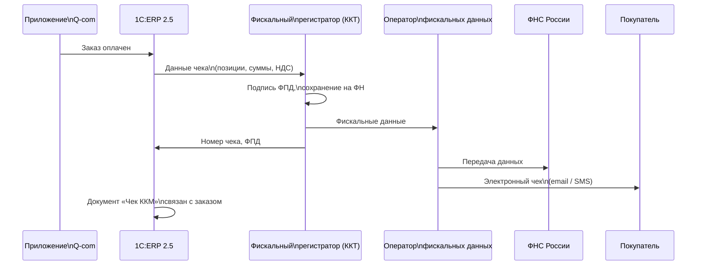
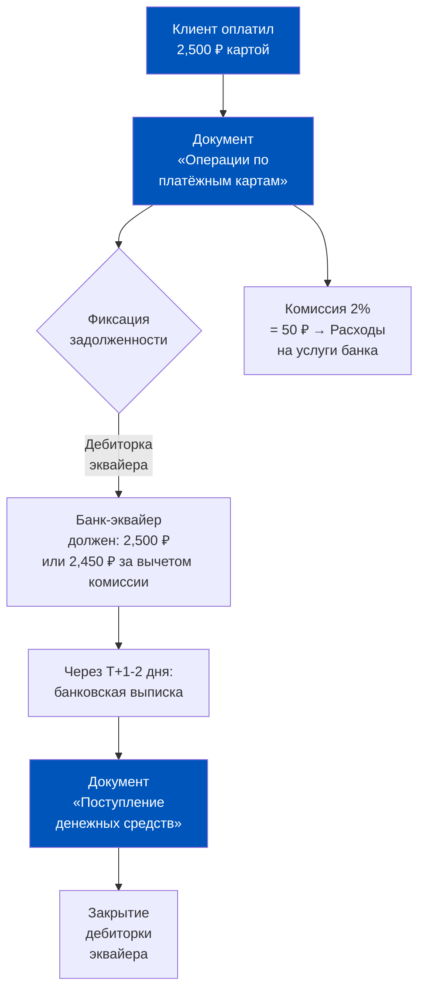
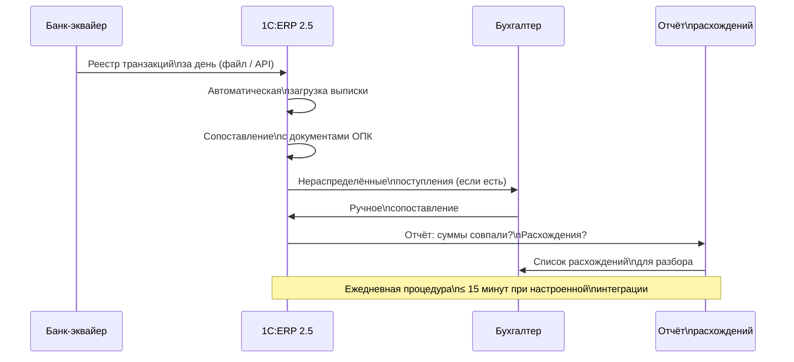
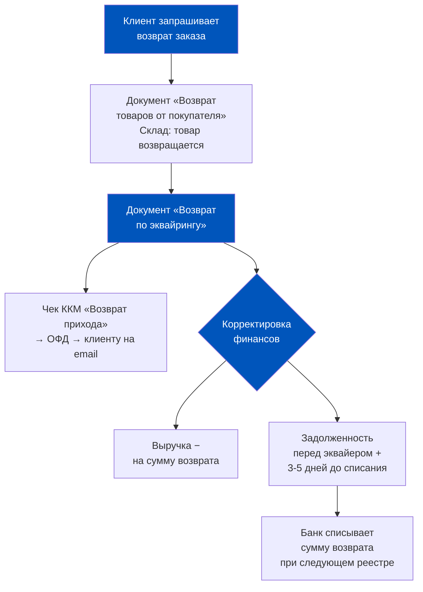
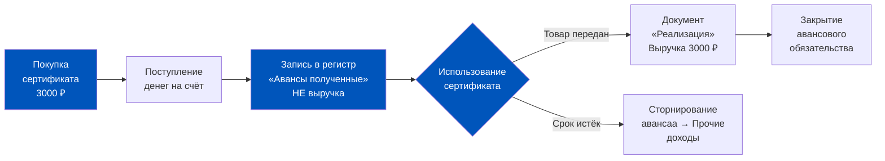
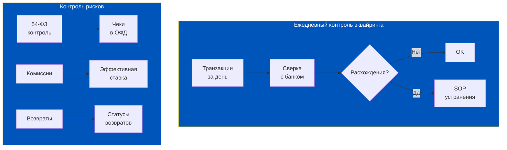
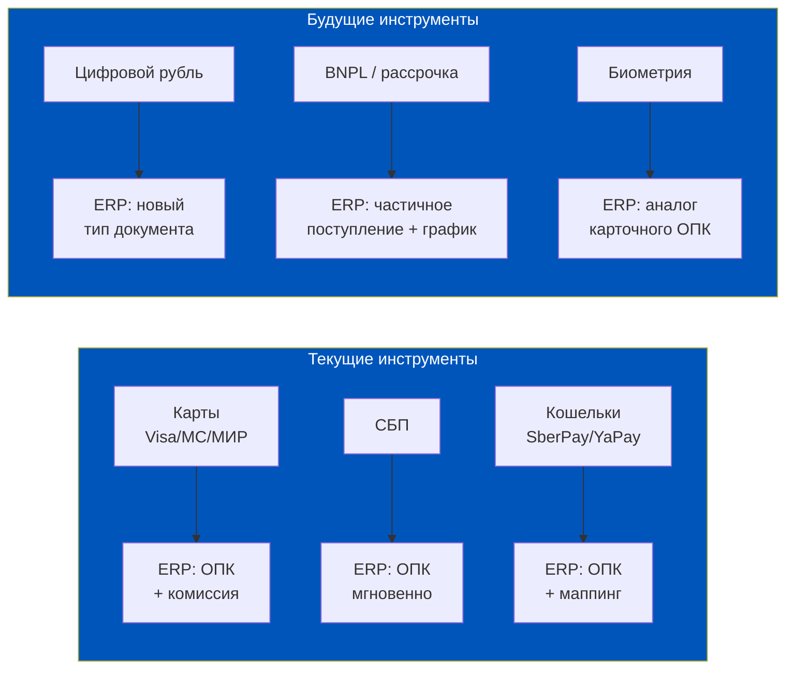

# Эквайринг и чеки: как 1C:ERP 2.5 обслуживает безналичную торговлю

> Когда клиент прикладывает карту к курьерскому терминалу или нажимает «Оплатить» в приложении, запускается цепочка из двенадцати технических событий — и только последнее из них имеет значение для 1C:ERP. Но именно это последнее событие определяет, будет ли у компании выручка, закроется ли долг банка-эквайера и появится ли фискальный чек в ОФД. Разберём каждое звено этой цепочки.

## Содержание

1. [[#Часть 1. 54-ФЗ и онлайн-касса: что должна делать ERP]]
2. [[#Часть 2. Документ «Операции по платёжным картам» в ERP 2.5]]
3. [[#Часть 3. Сверка с банком: ежедневная процедура]]
4. [[#Часть 4. Возвраты эквайринга в ERP]]
5. [[#Часть 5. Аналитика эквайринга как операционная метрика]]
6. [[#Часть 6. Мобильный эквайринг и нестандартные схемы оплаты]]
7. [[#Часть 7. Архитектурное решение: надёжный эквайринг в Q-com]]

---

## Часть 1. 54-ФЗ и онлайн-касса: что должна делать ERP

Федеральный закон 54-ФЗ «О применении контрольно-кассовой техники» — это закон, который полностью переформатировал требования к розничным и онлайн-расчётам в России. Суть его в одной фразе: каждый расчёт с покупателем обязан сопровождаться фискальным чеком, зафиксированным в ОФД (операторе фискальных данных) и доступным покупателю.

**Дистанционная торговля и специфика Q-com**

Для традиционного ритейла 54-ФЗ означал установку онлайн-касс на кассовых узлах. Для дистанционной торговли (а Q-com — это именно дистанционная торговля) картина сложнее. Покупатель не стоит перед кассой. Расчёт происходит при оформлении заказа онлайн, или при вручении курьером, или заранее через приложение. В каждом из этих сценариев закон требует своего.

Сценарий первый: **предоплата в приложении**. Чек должен быть сформирован в момент получения денег — ещё до того, как курьер выехал. Тип документа: «Приход», признак расчёта: «Предоплата» или «Аванс». Затем при фактической передаче товара формируется второй чек с признаком «Зачёт аванса».

Сценарий второй: **оплата при получении** (курьерский терминал). Чек формируется в момент оплаты. Терминал курьера должен быть подключён к фискальному регистратору (физическому или облачному). Тип: «Приход», признак: «Полный расчёт».

Сценарий третий: **постоплата** (клиент оплачивает после доставки через приложение). Чек формируется при получении оплаты. Самый редкий в Q-com сценарий.

**Как 1C:ERP 2.5 формирует фискальные данные**

ERP не является сама по себе кассовым аппаратом. Она — управляющая система, которая формирует данные для передачи на кассовый узел. Цепочка взаимодействия:

1. ERP формирует данные чека: список позиций, суммы, ставки НДС, способ расчёта
2. Данные передаются на кассовый модуль (фискальный регистратор или облачная касса)
3. Кассовый модуль подписывает чек фискальным признаком (ФПД) и сохраняет на фискальном накопителе
4. Данные чека отправляются в ОФД (оператор фискальных данных: ОФД.ру, Платформа ОФД, СКБ Контур и др.)
5. ОФД передаёт данные в ФНС и одновременно отправляет электронный чек покупателю на email или телефон

**Что означает «связь с ОФД» в контексте ERP**

Данные из ОФД — это не просто архив чеков. Это верификация факта расчёта. Если ERP зафиксировала продажу, но в ОФД чека нет — это либо технический сбой (нужно восстановить), либо предмет налоговой проверки. Хорошая практика: регулярная сверка реестра чеков в ERP с реестром в личном кабинете ОФД.

**Облачная касса vs физический фискальный регистратор**

В Q-com существуют два архитектурных подхода к организации кассовой инфраструктуры. Первый: физические POS-терминалы с встроенным или внешним фискальным регистратором в каждом дарксторе и у каждого курьера. Надёжно, но дорого в обслуживании при масштабировании.

Второй: облачная касса (например, Атол Онлайн, МодульКасса, Эвотор Облако). В этом случае в дарксторе или у курьера стоит только терминал сбора данных или смартфон, а фискальный регистратор — в дата-центре и принадлежит поставщику облачного сервиса. ERP взаимодействует с облачной кассой через API: отправляет данные чека, получает обратно номер чека и ФПД.

Для Q-com с быстрым масштабированием облачная касса предпочтительнее: добавить нового курьера — это настройка в личном кабинете, а не логистика физического оборудования. ERP работает с обоими вариантами одинаково: разница только в API-адресе кассового сервиса.

**Тестирование кассовой интеграции перед запуском**

Перед запуском нового даркстора или нового способа оплаты необходим тестовый прогон кассовой интеграции. В тестовой среде ERP прогоняется полный сценарий: создание заказа, оплата тестовой картой, формирование чека, передача в ОФД, получение подтверждения. Только после успешного прохождения всех этапов интеграция считается готовой к промышленной эксплуатации. Этот процесс занимает 2-4 часа при правильной подготовке, но экономит дни разбора инцидентов после боевого запуска с реальными клиентами.

**Ошибки 54-ФЗ, которые дорого обходятся**

Наиболее частые нарушения, которые находит ФНС при проверках Q-com: формирование одного чека на дневной пакет заказов вместо отдельного на каждый расчёт; отсутствие второго чека при зачёте аванса; неверная ставка НДС (в продуктовом ритейле ставки 10% и 20% существуют одновременно); неправильный признак способа расчёта. Штраф по статье 14.5 КоАП — от 75% до 100% суммы расчёта, минимум 30 000 рублей на организацию.

**Проблема смешанных ставок НДС в продуктовом Q-com**

Это отдельная тема, которую продакт должен понимать. Продовольственные товары первой необходимости (хлеб, молоко, яйца, большинство овощей и фруктов) облагаются НДС по ставке 10%. Остальные продукты, алкоголь, готовая еда, непродовольственные товары — по ставке 20%. В одном заказе из 15 позиций могут быть товары с обеими ставками.

ERP формирует чек с разбивкой по ставкам: в каждой строке чека указывается своя ставка НДС для конкретного товара. Это требует, чтобы в карточке каждого SKU в ERP была правильно указана ставка НДС. Ошибка в карточке товара мгновенно становится ошибкой в каждом чеке, где этот товар встречается. При тысячах транзакций в сутки — это тысячи некорректных чеков и потенциальный предмет налоговой проверки.

**Фискальный накопитель (ФН): срок и замена**

Фискальный накопитель — это физическое устройство внутри кассы, которое хранит данные всех чеков в зашифрованном виде. Срок действия ФН — 15 или 36 месяцев в зависимости от модели и режима применения. При замене ФН необходима процедура перерегистрации ККТ в ФНС, которая выполняется через личный кабинет ФНС или через ОФД.

Для Q-com с тысячами транзакций в сутки и сотнями терминалов — замена ФН в плановом порядке становится операционной задачей. ERP не управляет ФН напрямую, но хорошая практика — вести в системе реестр касс с датами окончания срока ФН и автоматическими напоминаниями через механизм задач.

---

## Часть 2. Документ «Операции по платёжным картам» в ERP 2.5

Это документ, в котором 1C:ERP фиксирует факт эквайринговой транзакции. Он занимает промежуточное положение между «продажей» и «поступлением денег»: продажа уже произошла, деньги ещё не на счёте, но право требования к банку-эквайеру уже возникло.

**Структура документа**

Каждый документ «Операции по платёжным картам» содержит:

- **Банк-эквайер** — контрагент, которому возникает задолженность перед компанией
- **Терминал** — идентификатор конкретного POS-терминала или виртуального терминала (для онлайн-платежей)
- **Дата операции** — момент авторизации транзакции клиентом
- **Дата зачисления** — плановая дата поступления денег (рассчитывается автоматически: дата операции + N дней по договору с эквайером)
- **Сумма транзакции** — полная сумма, уплаченная покупателем
- **Комиссия эквайера** — процент или фиксированная сумма согласно тарифу
- **Сумма к зачислению** — сумма транзакции минус комиссия
- **Документ-основание** — ссылка на «Заказ клиента» или «Чек ККМ»
- **Платёжная система** — Visa, Mastercard, МИР, СБП

**Временной разрыв: клиент заплатил, деньги ещё не на счёте**

Это критически важный нюанс для казначейства Q-com. В момент оплаты клиентом ERP создаёт документ «Операции по платёжным картам» и формирует задолженность банка-эквайера перед компанией (дебиторская задолженность по эквайрингу). Деньги физически придут через 1-2 рабочих дня — только тогда будет создан документ «Поступление денежных средств» и задолженность закроется.

В праздничные периоды этот разрыв увеличивается: банки не работают в выходные дни для проведения расчётов, поэтому платежи, авторизованные в субботу и воскресенье, зачисляются только во вторник. При обороте 10 000 заказов в сутки и среднем чеке 2 500 рублей это означает 75 миллионов рублей «в пути» только за три дня длинных выходных.

**Комиссия банка-эквайера: как она учитывается в ERP**

Эквайер переводит на расчётный счёт не полную сумму транзакции, а сумму за вычетом своей комиссии. В ERP 2.5 это отражается двумя способами:

Способ первый (упрощённый): вся сумма транзакции фиксируется как выручка, а комиссия — отдельной строкой как расходы на услуги банка. Разница зачисляется на счёт как «Поступление» со ссылкой на эквайера.

Способ второй (детальный): уже в документе «Операции по платёжным картам» сумма разделяется на выручку и комиссию. Выручка идёт в доходы, комиссия — сразу в расходы. Поступление фиксируется на сумму за вычетом комиссии.

Для большинства Q-com компаний достаточно первого способа — он проще в обслуживании. Второй применяется, когда нужна детальная аналитика рентабельности по каждой транзакции.

**Роль POS-терминала и виртуального терминала**

В ERP каждый терминал — это отдельный аналитический объект. Это позволяет видеть выручку и комиссию в разрезе каждой точки или способа оплаты: курьерские терминалы, касса даркстора, онлайн-платежи через сайт, оплата в приложении. Для Q-com с сотнями курьеров-партнёров это важно: каждый курьерский терминал имеет свой ID и свой реестр транзакций.

**Управление парком курьерских терминалов**

В Q-com с несколькими сотнями активных курьеров парк терминалов — это живой объект управления. Терминалы ломаются, теряются, передаются между курьерами. В ERP правильная практика — вести справочник терминалов с привязкой к ответственному лицу (курьеру или дарксторному менеджеру). При передаче терминала создаётся акт приёма-передачи, и терминал переводится на нового ответственного.

Это важно не только для учёта имущества, но и для контроля транзакций: если на терминале курьера Иванова фиксируются транзакции в тот день, когда Иванов не работал — это либо ошибка учёта, либо предмет служебного расследования. ERP даёт инструмент для такого контроля: аналитика по терминалам с фильтрацией по дате и ответственному.

**Жизненный цикл терминала в ERP**

Каждый терминал проходит через несколько статусов: «Закуплен», «Активирован», «В работе», «На обслуживании», «Списан». Правильное ведение этого справочника позволяет не только контролировать парк, но и планировать расходы: терминалы требуют замены примерно каждые 3-5 лет, и ERP-данные по дате ввода в эксплуатацию помогают спланировать бюджет на обновление. Это маленькая, но типичная точка пересечения операционного продакта и финансового планирования.

**Лимиты транзакций и защита от мошенничества**

Банки-эквайеры и платёжные системы устанавливают лимиты на одну транзакцию: обычно это 150 000 — 300 000 рублей без дополнительной верификации. Заказы выше лимита требуют подтверждения 3D-Secure или разбивки на несколько транзакций. В Q-com такие ситуации редки (средний чек 2 000-4 000 рублей), но корпоративные заказы на офисные обеды или крупные праздничные наборы могут превышать лимит. ERP должна корректно обрабатывать как одну транзакцию на полную сумму, так и разбивку на несколько — с привязкой всех транзакций к одному заказу.

**Chargeback: что это и как ERP реагирует**

Chargeback (принудительный возврат) — это когда держатель карты оспаривает транзакцию в своём банке, и банк инициирует принудительный возврат средств. Для компании это означает: деньги списываются с расчётного счёта без её согласия, плюс штраф от платёжной системы (50-150 долларов за каждый случай). В ERP принудительный возврат фиксируется как уменьшение дебиторки эквайера и выручки — аналогично добровольному возврату, но с дополнительной строкой расходов на штраф. Высокий процент chargeback (более 0,1% от транзакций) — сигнал для платёжной системы, который может привести к повышению тарифа или даже расторжению договора с эквайером.

---

## Часть 3. Сверка с банком: ежедневная процедура

Ежедневная сверка эквайринга — это процедура, которую многие компании недооценивают до первого инцидента. Расхождение в один процент от оборота при обороте 10 миллионов в сутки — это 100 000 рублей, которые либо потеряны, либо учтены дважды. Систематическая сверка — это не бухгалтерская педантичность, это контроль над реальной выручкой.

**Два реестра: от банка и из ERP**

Банк-эквайер ежедневно предоставляет реестр транзакций: список всех авторизованных платежей за день с суммами, временными метками и идентификаторами терминалов. Этот реестр — официальный документ, по которому банк произведёт зачисление.

В ERP за тот же день должны быть зафиксированы документы «Операции по платёжным картам» — с теми же транзакциями. Задача сверки: убедиться, что два реестра совпадают по количеству операций и суммам.

**Типичные источники расхождений**

Первый тип: **транзакция есть в банке, нет в ERP**. Это означает, что где-то в цепочке «касса → ERP» произошёл сбой: терминал не передал данные, интеграция упала, документ не был проведён. Следствие: выручка в ERP занижена, платёжный календарь неточен.

Второй тип: **транзакция есть в ERP, нет в банке**. Это означает, что транзакция была авторизована, но впоследствии банк её отменил (техническая отмена, несостоявшийся платёж). Следствие: выручка в ERP завышена, долг банка-эквайера завышен.

Третий тип: **суммы не совпадают**. Причины: округление, ошибки при ручном вводе, применение неверного тарифа комиссии.

**Автоматическая загрузка банковской выписки**

В ERP 2.5 реализована интеграция с клиент-банком через форматы обмена: 1C-формат выписки, а также прямое API-подключение через банковские сервисы (DirectBank). При настроенной интеграции банковская выписка загружается автоматически по расписанию и создаёт документы «Поступление денежных средств» без участия бухгалтера. Задача сотрудника — только проверить нераспределённые поступления (те, которые система не смогла автоматически сопоставить с заказами).

**Контрольные точки сверки для продакта**

Продакт не делает сверку вручную — это задача финансовой команды. Но продакт должен знать ответы на три вопроса по итогам дня:
- Какой процент транзакций прошёл без расхождений (норма: 99,9%+)?
- Каков суммарный объём нераспределённых поступлений (норма: < 0,1% оборота)?
- Сколько транзакций было технически отменено банком (норма: < 0,05%)?

Отклонение от норм — сигнал к разбору: либо техническая проблема в интеграции, либо проблема на стороне банка.

**Нестандартные ситуации при сверке**

Иногда банк-эквайер присылает реестр с задержкой или в нестандартном формате. В этом случае автоматическая загрузка в ERP не срабатывает, и команда обнаруживает, что за вчерашний день нет подтверждённых поступлений. Это не означает, что деньги пропали — они просто «в пути» и появятся при следующей загрузке реестра. Но в платёжном календаре это создаёт временный разрыв: ожидаемое поступление не закрывается, баланс занижен.

Правильная реакция: не паниковать, не создавать ручные поступления «на глазок», а дождаться официального реестра и провести корректную загрузку. Произвольное создание документов поступления без реестра банка — это прямой путь к расхождениям, которые придётся распутывать при налоговой проверке.

**Работа с несколькими банками-эквайерами одновременно**

Крупные Q-com операторы нередко подключают нескольких эквайеров: основной (для карточных операций) и резервный (для аварийного переключения), отдельный канал для СБП, возможно — зарубежный эквайер для международных карт. В ERP каждый эквайер — это отдельный контрагент с отдельным терминалом и отдельной статьёй ДДС. Это позволяет сравнивать эффективность: скорость зачисления, процент отказов, уровень комиссии — и принимать решения об изменении распределения трафика между эквайерами.

---

## Часть 4. Возвраты эквайринга в ERP

Возврат эквайринга — одна из самых технически сложных операций в Q-com ERP-учёте. Она затрагивает сразу несколько контуров: розничные продажи, складской учёт, кассовые операции и взаиморасчёты с банком. При этом клиент ожидает мгновенного подтверждения, а деньги вернутся на его карту только через 3-5 рабочих дней.

**Что происходит при возврате денег через ту же карту**

С точки зрения платёжной системы, возврат — это новая транзакция со знаком минус: банк-эквайер списывает со счёта компании сумму возврата и зачисляет на карту клиента. Эта операция также проходит через ОФД: закон 54-ФЗ требует формирования кассового чека с признаком «Возврат прихода».

**Документ «Возврат по эквайрингу»**

В 1C:ERP 2.5 возврат эквайринга оформляется документом «Возврат денежных средств» с видом операции «Возврат по платёжной карте». Ключевые поля документа:

- Дата возврата
- Банк-эквайер (тот же, через которого прошла оригинальная транзакция)
- Терминал (для корректной идентификации в реестре банка)
- Сумма возврата (полная или частичная)
- Ссылка на оригинальный документ «Операции по платёжным картам»
- Ссылка на документ «Возврат товаров от покупателя»

**Как ERP корректирует выручку и задолженность банка-эквайера**

При проведении документа «Возврат по эквайрингу» система делает несколько записей:

1. Уменьшает выручку (сторно записи по счёту доходов)
2. Увеличивает задолженность перед банком-эквайером (компания теперь должна банку сумму возврата — банк спишет её при следующем зачислении реестра)
3. Формирует данные для кассового чека «Возврат прихода»
4. Если возврат частичный — корректирует сумму закрытого заказа клиента

**Частичный возврат при замене товара**

В Q-com нередка ситуация: доставлен не тот товар или товар ненадлежащего качества. Клиент хочет не полный возврат денег, а замену товара. В этом случае цепочка сложнее:

1. Создаётся «Возврат товаров от покупателя» на конкретную позицию
2. Создаётся новый «Заказ клиента» на замену (может быть связан с претензией)
3. Если стоимость замены равна стоимости возвращённого товара — перезачёт: возврат денег не нужен
4. Если клиент доплачивает — новая транзакция эквайринга
5. Если компания доплачивает клиенту — частичный возврат по эквайрингу

ERP 2.5 позволяет связать все эти документы в единую цепочку: претензия → возврат → новый заказ → закрытие претензии. Это важно для аналитики: можно видеть реальный процент возвратов по каждой категории товаров и по каждому поставщику.

**Временной лаг и управление ожиданиями**

Клиент нажал «Вернуть деньги» в приложении. Когда придут деньги? Обычно 3-5 рабочих дней — именно столько занимает цикл возврата по карте. Деньги уходят с расчётного счёта компании немедленно при проведении следующего реестра, но банк клиента зачисляет их по своим срокам. ERP отслеживает статус возврата, но не влияет на скорость зачисления на сторону клиента.

**Отчёт «Незакрытые возвраты» и SLA**

Для Q-com с высоким процентом возвратов (сезонные пики, низкое качество ряда поставщиков, ошибки сборки) важен отчёт по незакрытым возвратам. В ERP это строится как список документов «Возврат по эквайрингу» со статусом «Ожидает зачисления» и датой создания. SLA на закрытие возврата — 7 рабочих дней. Всё, что висит дольше — либо технический сбой на стороне банка, либо ошибка в документах (неверный номер карты, неправильный эквайер). Каждый такой случай требует ручного расследования.

**Возврат наличными при безналичной оплате: запрет и его последствия**

Важный нюанс, который нередко становится операционной ловушкой: если клиент оплатил заказ картой, возврат должен быть произведён на ту же карту. Выдать наличные «вместо» безналичного возврата — это нарушение как правил платёжных систем, так и требований 54-ФЗ. ERP не позволяет создать документ «Выдача наличных» с привязкой к исходному эквайринговому платежу — только «Возврат по эквайрингу». Этот технический барьер защищает компанию от операционных ошибок и потенциальных злоупотреблений.

---

## Часть 5. Аналитика эквайринга как операционная метрика

Большинство компаний смотрят на эквайринг как на инфраструктуру: работает — и ладно. Но в эквайринговых данных ERP скрыта ценная операционная аналитика: структура платёжных инструментов, реальная стоимость приёма платежей, качество интеграции.

**Доля эквайринговых продаж в Q-com**

В зрелом Q-com операторе доля безналичных платежей составляет 95-98% от оборота. Это следствие аудитории: молодые городские покупатели практически не используют наличные. Наличные остаются только для специфических сегментов: пожилые покупатели, корпоративные клиенты с лимитами на карту, ситуативные заказы в зонах со слабым покрытием.

Важно понимать, что «безналичные» — это не одно явление. Внутри безналичных платежей идёт постоянная эволюция: доля традиционного картового эквайринга снижается в пользу СБП, а биометрические платежи и NFC-кошельки (SberPay, T-Pay, YaPay) занимают всё большую долю. Каждый тип оплаты имеет свой документ в ERP, свой тариф и свою скорость зачисления.

Из безналичных платежей структура обычно такова: картовый эквайринг (Visa/MC/МИР) — 60-70%, СБП — 20-30%, оплата через Сбербанк онлайн или другие кошельки — 5-10%. Структура меняется в пользу СБП: комиссия ниже (0,4-0,7% vs 1,5-2,5% для карт), скорость зачисления выше.

**Комиссия эквайера как скрытая статья расходов**

При обороте 100 миллионов рублей в месяц и средней эффективной ставке комиссии 1,8% ежемесячные расходы на эквайринг составляют 1,8 миллиона рублей. За год — 21,6 миллиона. Это сравнимо с годовым ФОТ 10 сотрудников. При этом многие продакты и даже операционные директора не знают реальную эффективную ставку: она скрыта в банковских выписках и не видна в основных операционных метриках.

**Как посчитать реальную стоимость эквайринга из данных ERP**

ERP 2.5 позволяет построить отчёт по статье ДДС «Комиссии банков» за любой период. Разделив эту сумму на оборот по эквайрингу за тот же период, получаем **эффективную ставку эквайринга**. Она может отличаться от номинальной ставки по договору из-за: разных тарифов для разных типов карт (corporate cards дороже), минимальной комиссии за транзакцию (невыгодна при мелких чеках), дополнительных сервисных сборов.

| Метрика | Формула | Бенчмарк для Q-com | Красный флаг |
|---|---|---|---|
| **Доля безналичных** | Эквайринг / Общая выручка × 100% | > 95% | < 85% |
| **Эффективная ставка эквайринга** | Комиссии эквайеров / Оборот эквайринга × 100% | 1,2-1,8% | > 2,5% |
| **Стоимость одной транзакции** | Сумма комиссий / Количество транзакций | 35-60 ₽ | > 100 ₽ |
| **Доля СБП в безналичных** | Оборот СБП / Оборот эквайринга × 100% | 20-35% | < 10% (упущенная экономия) |
| **Среднее время зачисления** | Дата зачисления − Дата транзакции | 1 рабочий день | > 2 рабочих дней |
| **Процент технических отказов** | Отменённые транзакции / Все попытки × 100% | < 0,1% | > 0,5% |

**Управленческий вывод по аналитике**

Снижение эффективной ставки эквайринга с 1,8% до 1,4% при обороте 100 млн рублей в месяц экономит 400 000 рублей ежемесячно — это 4,8 миллиона рублей в год. Достигается это переговорами с банком (при росте оборота банки готовы пересматривать тариф), перераспределением трафика в СБП (меньшая комиссия), оптимизацией размера среднего чека (снижает удельные минимальные комиссии). Все исходные данные для этих решений — в ERP.

**Аналитика возвратов через эквайринг**

Данные о возвратах по эквайрингу — это не только финансовая информация. Это операционная диагностика. Высокий процент возвратов по конкретному SKU — сигнал о качестве товара или поставщика. Высокий процент возвратов по конкретному дарксторному узлу — сигнал об ошибках сборки. Высокий процент возвратов в конкретный временной слот — сигнал о перегрузке и спешке в часы пик.

ERP позволяет построить отчёт: «Возвраты по эквайрингу» в разрезе SKU, даркстора, временного слота, типа причины возврата. Этот отчёт должен быть частью еженедельного ревью операционного продакта — наравне с метриками скорости доставки и NPS.

---

## Часть 6. Мобильный эквайринг и нестандартные схемы оплаты

Стандартный картовый эквайринг — только один из способов получения денег в Q-com. Рынок предлагает несколько альтернатив, каждая из которых имеет свою логику в ERP-учёте. Незнание этих логик приводит к тому, что одни платежи «зависают» в неразобранных поступлениях, другие — учитываются как выручка до факта отдачи товара.

**СБП (Система быстрых платежей): чем отличается от картового эквайринга**

СБП — это перевод между банковскими счетами в режиме реального времени через Банк России. В отличие от картового эквайринга, СБП-платёж зачисляется на расчётный счёт компании мгновенно (в течение нескольких секунд), без дневного реестра и без суточного временного лага.

В ERP это означает: документ «Поступление денежных средств» может быть создан автоматически сразу при оплате клиентом, без ожидания банковской выписки следующего дня. При настроенной интеграции с банком через API (DirectBank) это происходит автоматически. Разница важна для платёжного календаря: СБП-выручка доступна в тот же день, картовая — на следующий рабочий день.

Другое отличие: в документах ERP СБП-транзакции идентифицируются через отдельный терминал (виртуальный QR-терминал) и отдельную статью ДДС. Это позволяет видеть СБП как отдельный аналитический объект.

**Кэшбэк и бонусные баллы как метод оплаты**

Многие Q-com операторы запускают программы лояльности: покупки конвертируются в баллы, баллами можно оплатить часть следующего заказа. С точки зрения ERP это нетривиальная ситуация: часть заказа оплачена «живыми» деньгами, часть — виртуальными баллами.

В ERP 2.5 это реализуется через механизм «Виды цен» и «Скидки / надбавки»: баллы учитываются как скидка, уменьшающая сумму к оплате деньгами. Выручка фиксируется на полную сумму заказа, но денежное поступление — только на часть. Разница относится на статью «Расходы по программе лояльности».

Ключевой нюанс: начисленные, но не использованные баллы — это отложенное обязательство компании. В учёте они отражаются как резерв. При масштабе в миллионы участников программы суммарный резерв может быть значимым.

**Подарочные сертификаты: деньги получены, товар ещё не отдан**

Подарочные сертификаты — классический пример «отложенной выручки» (deferred revenue). Клиент заплатил 3 000 рублей за сертификат. С точки зрения 54-ФЗ: нужен чек с признаком «Аванс». С точки зрения ERP-учёта: деньги получены, но выручка ещё не заработана.

В ERP 2.5 продажа сертификата фиксируется как получение аванса: деньги приходят в кассу/на счёт, но выручка не признаётся. Когда владелец сертификата использует его для заказа, создаётся документ «Реализация», который «раскрывает» ранее накопленный аванс как выручку. Если сертификат не использован до срока истечения — аванс сторнируется и относится на прочие доходы.

---

## Часть 7. Архитектурное решение: надёжный эквайринг в Q-com

Эквайринг — это не просто кнопка «Принять оплату». Это инфраструктурный компонент, отказ или деградация которого немедленно останавливает выручку. Продакт, отвечающий за платёжный стек, должен думать о нём как об инженер — через призму отказоустойчивости, мониторинга и процедур восстановления.

**Чеклист: 6 параметров надёжной эквайринговой интеграции**

1. **Резервный канал оплаты**: если основной эквайер недоступен, система должна автоматически предложить СБП или другой способ. Настраивается на стороне платёжного шлюза и отражается в ERP как дополнительный терминал.

2. **Мониторинг транзакций в реальном времени**: дашборд с количеством и суммой транзакций за последние 15 минут. Резкое падение — сигнал о техническом сбое. В ERP настраивается через регламентные задания с автоматическими уведомлениями.

3. **Автоматическая сверка реестров**: ежедневная процедура (см. Часть 3) должна быть автоматизирована. Ручная сверка при объёме 5 000+ транзакций в сутки неприемлема.

4. **Чёткий процесс обработки ошибок**: каждый тип расхождения (транзакция есть в банке, нет в ERP; задвоенный платёж; частичное зачисление) должен иметь задокументированный SOP с ответственным и сроком устранения.

5. **Контроль 54-ФЗ на уровне системы**: ERP должна блокировать проведение документа «Реализация» без связанного кассового чека. Это техническое ограничение предотвращает нарушения, которые не заметит ни один аудитор вручную.

6. **Аудит-трейл всех операций**: каждое изменение в документах эквайринга должно логироваться: кто, когда, что изменил. В ERP 2.5 это штатная функция — журнал регистрации изменений.

**Таблица рисков**

| Риск | Проявление | Настройка ERP | Контроль |
|---|---|---|---|
| **Технический сбой эквайера** | Транзакции авторизуются, но деньги не приходят | Резервный терминал СБП; алерт при отсутствии поступлений > 2 ч | Ежедневная сверка реестров |
| **Задвоение транзакции** | Клиент списан дважды, ERP показывает двойную выручку | Проверка уникальности по ID транзакции при загрузке реестра | Отчёт по дублям |
| **Нарушение 54-ФЗ** | Продажа без чека, штраф ФНС | Блокировка проведения «Реализации» без «Чека ККМ» | Сверка с реестром ОФД |
| **Неверная комиссия** | Завышенное списание комиссии эквайером | Контроль суммы документа «Комиссия» против тарифной таблицы | Ежемесячный отчёт по эффективной ставке |
| **Зависание возвратов** | Клиент ждёт деньги > 10 дней | Авто-уведомление при возврате > 7 дней без подтверждения от банка | Отчёт «Незакрытые возвраты» |
| **Утечка данных** | Компрометация реквизитов карт | ERP не хранит полные номера карт (только маску) — это задача PCI DSS на стороне эквайера | Аудит PCI DSS поставщика |

**Итоговый вывод**

Эквайринг в Q-com — это не просто способ получить деньги. Это инфраструктурный компонент, связывающий клиентский опыт, операционные процессы, финансовый учёт и регуляторное соответствие в единую систему. 1C:ERP 2.5 обеспечивает учётный контур этой системы: фиксирует транзакции, формирует данные для фискального учёта, контролирует взаиморасчёты с банком-эквайером, обеспечивает трейл возвратов.

Продакт, понимающий логику эквайринга в ERP, может принимать более точные решения: оптимизировать микс платёжных инструментов в пользу более дешёвых, настраивать резервные каналы для устойчивости, участвовать в переговорах с банком с позиции знания реальных метрик. Это отличие между «кнопкой в приложении» и «финансовой инфраструктурой бизнеса».

**Переговоры с банком-эквайером: когда и как**

Тариф эквайринга — не фиксированная величина. Большинство банков пересматривают ставки при достижении оборотных порогов или по запросу клиента. Переговорная позиция усиливается, если у вас есть данные: текущая эффективная ставка, структура платёжного микса, оборот по каждому типу карт. Всё это извлекается из аналитики ERP за любой период. Подготовленный к переговорам клиент с детальной аналитикой получает лучшие условия, чем тот, кто просит «снизить процент» без конкретных цифр.

Хорошая практика: перед переговорами с эквайером запросить из ERP отчёт за последние 12 месяцев: оборот эквайринга по месяцам, структура по платёжным системам, эффективная ставка, среднее время зачисления. Это занимает 15 минут, но качественно меняет переговорную позицию.

**Эволюция платёжной инфраструктуры: что будет дальше**

Платёжный ландшафт России меняется быстро. СБП 2.0 добавляет новые сценарии: рекуррентные платежи, оплата по QR-коду без терминала, C2B-переводы. Цифровой рубль — пилотный проект ЦБ — потенциально станет ещё одним способом оплаты с особым учётным статусом. BNPL-сервисы (купи сейчас, плати потом) в виде рассрочки от маркетплейсов и банков уже встраиваются в экосистемы Q-com.

Каждый новый платёжный инструмент потребует своего документа в ERP, своей статьи ДДС, своей процедуры сверки. Продакт, понимающий логику текущей архитектуры, сможет быстро интегрировать новые инструменты — просто потому, что понимает паттерн: транзакция → дебиторка эквайера → поступление → закрытие. Этот паттерн универсален, меняются только участники и тайминги.

**Связь эквайринга с казначейством (День 3) и возвратами (Неделя 6)**

Эквайринг — это точка входа для большей части кэша в Q-com. День 3 этой недели показал, как эти деньги отражаются в платёжном календаре и регистре денежных средств. Неделя 6 показала, как возвраты влияют на складской учёт. Сегодняшний урок замыкает петлю: каждый возврат из Недели 6 порождает «Возврат по эквайрингу» здесь, и этот возврат появляется в платёжном календаре как расходное событие. Три темы — одна связанная система, в которой изменение в любой точке влечёт последствия для двух других.

Продакт, который понимает эти связи и умеет читать их в интерфейсе ERP, становится тем человеком в команде, с которым CFO хочет разговаривать о бизнесе — а не просто получать отчёт о заказах.

**Три вопроса для самопроверки**

Перед переходом к следующему уроку ответьте на три вопроса.

Первый: клиент оплатил заказ на 5 000 рублей картой в субботу вечером. В понедельник утром менеджер говорит, что деньги «не пришли». Что на самом деле происходит и как это выглядит в ERP? Ответ: деньги «в пути» — документ «Операции по платёжным картам» создан, дебиторка эквайера зафиксирована, но документ «Поступление» ещё не сформирован. Зачисление произойдёт в понедельник-вторник после обработки реестра за выходные.

Второй: в отчёте по эффективной ставке эквайринга за месяц цифра составила 2,2% против ожидаемых 1,8%. Назовите три возможные причины. Ответ: высокая доля корпоративных карт с повышенным тарифом; много мелких чеков, по которым применялась минимальная комиссия; банк начислил дополнительный сервисный сбор.

Третий: как правильно отразить в ERP ситуацию, когда клиент оплатил заказ картой, но вы хотите вернуть ему деньги наличными? Ответ: это невозможно и запрещено. Возврат должен быть на ту же карту через документ «Возврат по эквайрингу». Выдача наличных при безналичной оплате — нарушение правил платёжных систем и 54-ФЗ.

**На горизонте: День 5 — Закрытие месяца**

Следующий урок свяжет всё, что изучалось в Неделе 8, в единый процесс: закрытие месяца в ERP. Именно тогда все операции — казначейские, эквайринговые, складские — получают финансовую оценку, формируются проводки и рассчитывается финансовый результат. Казначейские данные, изученные сегодня и вчера, станут входными данными для этого процесса.

Подготовка к закрытию начинается уже сейчас: убедитесь, что все эквайринговые реестры за месяц загружены, все возвраты отражены, сверка с банком проведена. Незакрытые расхождения в последний день месяца — это технический долг, который мешает корректному закрытию периода.

Хорошая новость: при правильно настроенной автоматической сверке и ежедневной процедуре загрузки реестров эквайринговый блок закрывается практически без участия человека. Это и есть цель — автоматизировать рутину, чтобы высвободить время команды на работу с отклонениями и принятие решений.

---

← [[Неделя 8 - День 3 - Казначейство и управление кэшем|← День 3]] | [[1c_erp_qcom/README|Оглавление]] | [[Неделя 8 - День 5 - Закрытие месяца|День 5 →]]
