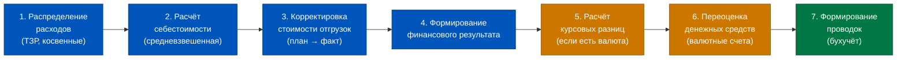
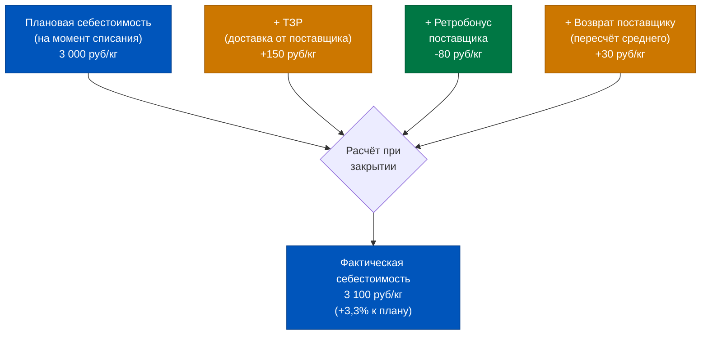
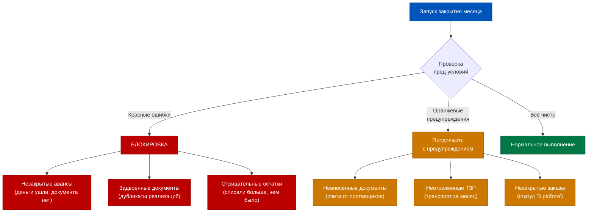
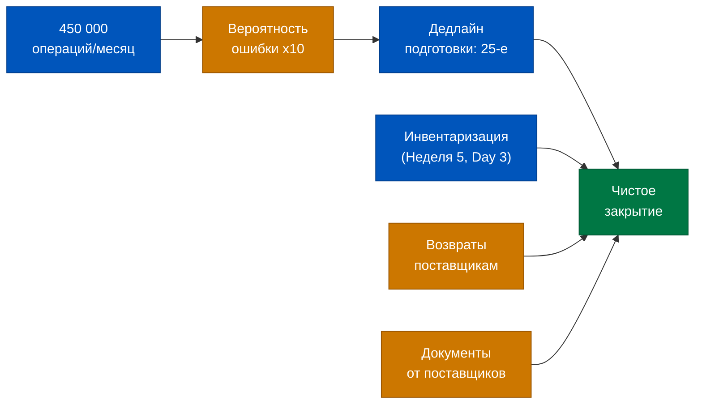
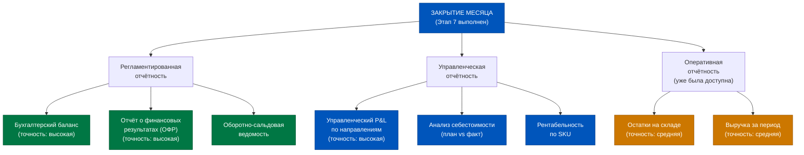
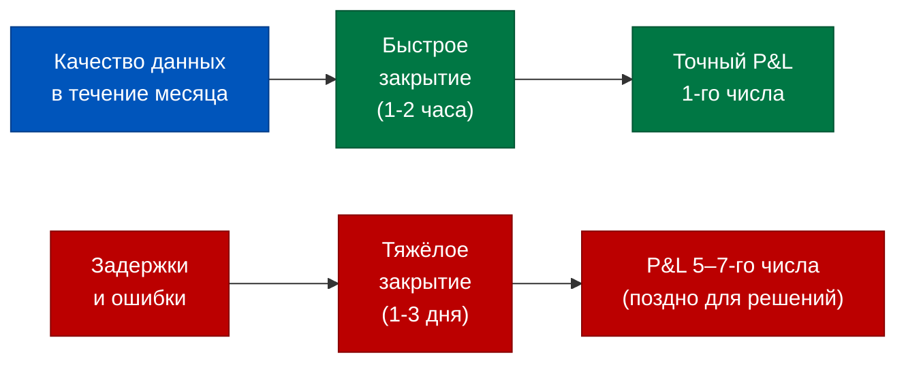

# День 5. Закрытие месяца: момент истины для финансов Q-com

> Закрытие месяца — это не бухгалтерская формальность. Это момент, когда операционный хаос тысяч заказов превращается в единственную финансовую истину. До этой точки любые P&L-цифры — черновик.

## Содержание

1. [[#Часть 1. Что такое «закрытие месяца» и почему это ритуал]]
2. [[#Часть 2. Последовательность операций при закрытии]]
3. [[#Часть 3. Расчёт себестоимости как ключевой этап]]
4. [[#Часть 4. Частые проблемы при закрытии месяца]]
5. [[#Часть 5. Закрытие в Q-com: особые условия]]
6. [[#Часть 6. Отчётность после закрытия: что появляется]]
7. [[#Часть 7. Как продакт помогает закрытию]]

---

## Часть 1. Что такое «закрытие месяца» и почему это ритуал

Представьте, что весь месяц вы снимаете видео. Каждый день — новые кадры: заказы принимаются, товар списывается, деньги приходят и уходят. Регистры ERP фиксируют каждое движение в режиме реального времени, и в любой момент вы можете открыть оперативный отчёт и увидеть «текущую картину». Это удобно. Но это не финальный ответ.

Закрытие месяца — это момент, когда вы нажимаете «стоп» и из отснятого видео делаете одну финальную фотографию. Фотография точная, резкая, достоверная. Видео — живое, но размытое. Фото — статичное, но юридически значимое и финансово точное.

В 1C:ERP 2.5 «закрытие месяца» — это регламентная процедура, которая запускается один раз в конце отчётного периода. Её главная задача — перевести систему из режима «оперативного учёта» в режим «фактического учёта». До этого момента:

- Себестоимость товаров рассчитана **по плановым ценам** — тем, которые вы установили при поступлении или в прайс-листе поставщика
- Финансовый результат (прибыль или убыток) не зафиксирован — он «плавает» в зависимости от незакрытых документов
- Проводки в бухгалтерском учёте **не сформированы** — это принципиальный факт архитектуры ERP 2.5

Последний пункт часто шокирует тех, кто привык к классической бухгалтерии 1С. В ERP 2.5 при проведении документа (скажем, «Реализации товаров») проводки в регистр бухгалтерии не формируются немедленно. Регистры оперативного учёта — да, обновляются мгновенно. Но бухгалтерская проводка — это продукт закрытия месяца. Это осознанное архитектурное решение: разделить оперативный учёт (быстрый, для управления) и регламентированный учёт (точный, для отчётности).

Для продакта в Q-com это означает следующее: если вы в середине месяца открываете «Отчёт о финансовых результатах» и видите там цифры — вы смотрите на черновик. Себестоимость может измениться после того, как бухгалтер отразит ТЗР, возвраты поставщикам и прочие операции, которые «догоняют» основной документооборот. Реальная прибыль станет известна только после закрытия.

Почему это «ритуал»? Потому что в крупных компаниях закрытие месяца — это событие, к которому готовятся недели. Финансовый директор выставляет дедлайны для всех подразделений: «к 25-му числу все документы должны быть в системе». Операционный отдел проверяет незакрытые заказы. Бухгалтерия сверяет авансы. В Q-com этот процесс особенно критичен, потому что объём операций огромный — и каждый незакрытый документ это потенциальная ошибка в финансовом результате.

Закрытие месяца в ERP 2.5 — это не кнопка «сформировать отчёт». Это последовательность из семи взаимозависимых шагов, каждый из которых перестраивает определённый слой данных. И только когда все семь выполнены успешно, система переходит в состояние «месяц закрыт».

---

## Часть 2. Последовательность операций при закрытии

В интерфейсе 1C:ERP 2.5 есть специальный рабочий стол — **«Помощник закрытия месяца»**. Это не просто список задач: это интеллектуальный планировщик, который знает зависимости между этапами и не позволит запустить шаг 5, если не выполнен шаг 3.

Визуально помощник выглядит как горизонтальная лента из блоков. Каждый блок — это этап. Зелёный — выполнен успешно. Красный — есть ошибки. Серый — ещё не запущен. Стрелки между блоками показывают зависимости.

Разберём каждый этап:

**Этап 1: Распределение расходов.** Здесь система берёт все накопленные за месяц транспортно-заготовительные расходы (ТЗР), общепроизводственные и общехозяйственные затраты и распределяет их по объектам учёта (товарам, направлениям деятельности, заказам). Именно здесь стоимость доставки от поставщика «прилипает» к себестоимости конкретных SKU.

**Этап 2: Расчёт себестоимости.** Ключевой этап. ERP 2.5 пересчитывает себестоимость всех списанных товаров с плановых цен на **фактические средневзвешенные**. Алгоритм учитывает все поступления товара за месяц, все списания, возвраты и ТЗР, распределённые на этапе 1.

**Этап 3: Корректировка стоимости отгрузок.** Если в течение месяца товар был реализован по плановой себестоимости, а фактическая оказалась другой — ERP формирует корректирующие записи. Разница между плановой и фактической себестоимостью отражается как отклонение.

**Этап 4: Формирование финансового результата.** Система сводит доходы и расходы по направлениям деятельности и формирует финансовый результат (прибыль/убыток) в разрезе подразделений, каналов продаж, номенклатурных групп.

**Этап 5: Расчёт курсовых разниц.** Если у вас есть операции в иностранной валюте (закупки у иностранных поставщиков, расчёты в USD или EUR), ERP пересчитывает задолженности по курсу на конец месяца и фиксирует курсовые разницы.

**Этап 6: Переоценка денежных средств.** Остатки на валютных счетах переоцениваются по курсу ЦБ на последний день месяца.

**Этап 7: Формирование проводок.** Только на этом финальном этапе все операции месяца «превращаются» в бухгалтерские проводки. Регистр бухгалтерии обновляется. Только теперь можно формировать Бухгалтерский баланс и Отчёт о финансовых результатах в регламентированном учёте.

Критически важно понимать: эти этапы имеют жёсткую зависимость. Нельзя сформировать финансовый результат, не рассчитав себестоимость. Нельзя рассчитать себестоимость, не распределив ТЗР. Система это контролирует — и если вы попробуете нарушить порядок, помощник закрытия просто заблокирует шаг.

Среднее время закрытия месяца в Q-com компании с объёмом 50–100 тысяч заказов в месяц — от 2 до 6 часов вычислений. Это существенная нагрузка на сервер, поэтому обычно закрытие запускают в нерабочее время.

---

## Часть 3. Расчёт себестоимости как ключевой этап

Если первые семь недель этого курса были о том, «как данные попадают в ERP», то расчёт себестоимости при закрытии — это момент, когда ERP из этих данных делает вывод. Это кульминационный расчёт.

В течение месяца каждый раз, когда вы списываете товар (при реализации, при сборке заказа), ERP использует **плановую себестоимость** — ту цену, по которой товар числился в системе на момент операции. Это нужно для оперативности: ждать финальных цифр каждый раз при списании невозможно.

Но плановая цена — это приближение. Реальная себестоимость может отличаться по нескольким причинам:

1. **ТЗР не были распределены в момент поступления** — они пришли позже (например, счёт от транспортной компании пришёл через 2 недели после доставки товара)
2. **Возвраты поставщикам** изменили средневзвешенную цену партии
3. **Скидки по итогам месяца** — ретробонусы от поставщиков, которые корректируют итоговую стоимость закупки
4. **Курсовые разницы** при закупках в валюте

На числовом примере: молоко 3,2% было принято на склад по цене 3 000 руб за условную единицу. В течение месяца было реализовано 500 единиц по плановой себестоимости. Итого списано: 1 500 000 руб.

После закрытия оказалось: ТЗР добавили 75 000 руб, ретробонус от поставщика вернул 40 000 руб, возврат части партии пересчитал средневзвешенную и добавил 15 000 руб. Фактическая себестоимость: 1 550 000 руб. Разница: +50 000 руб (+3,3%).

Это **отклонение плановой от фактической себестоимости** — нормальное явление. В хорошо настроенной системе оно не превышает 5%. Если отклонение стабильно больше 10-15% — это сигнал: либо плановые цены устарели, либо ТЗР систематически отражаются с опозданием.

Для продакта Q-com важно понимать: **unit-экономика в середине месяца — это estimate**. Реальная маржинальность заказа будет известна только после закрытия. Это не повод игнорировать оперативные данные, но повод не принимать стратегические решения на основе непроверенных цифр.

Алгоритм средневзвешенной себестоимости в ERP 2.5 работает так: берётся общая стоимость всех поступлений товара за период (включая остаток на начало) и делится на общее количество. Получается единая «средняя» цена. По ней переоцениваются все списания за месяц. Это принципиально отличается от FIFO или LIFO: нет понятия «партия» — есть только средняя.

---

## Часть 4. Частые проблемы при закрытии месяца

Помощник закрытия месяца в ERP 2.5 использует двухуровневую систему сигналов. Красные ошибки — блокирующие: без их устранения следующий шаг недоступен. Оранжевые предупреждения — некритические: закрытие пройдёт, но результат будет неточным.

**Красная ошибка 1: Незакрытые авансы.** Компания перечислила поставщику предоплату, но поставка товара ещё не отражена. Система видит «деньги ушли» в регистре расчётов, но не видит «товар пришёл». Такой аванс «висит» незакрытым и мешает корректному расчёту финансового результата.

**Красная ошибка 2: Задвоенные документы.** В высоконагруженных системах Q-com иногда происходит техническое дублирование: один и тот же заказ создаётся дважды (сбой интеграции между приложением и ERP). Результат — двойное списание со склада и двойная выручка. ERP 2.5 при закрытии выявляет такие аномалии.

**Красная ошибка 3: Отрицательные остатки.** Классика ERP-операций: товар был реализован, но документ о поступлении этого товара ещё не проведён (или проведён задней датой). В регистре остатков образуется отрицательное значение — физически невозможная ситуация, которая блокирует расчёт средневзвешенной себестоимости.

Как читать отчёт об ошибках: помощник закрытия показывает не просто тип ошибки, но и конкретный документ, склад, номенклатуру. Для каждой ошибки есть ссылка на проблемный объект — можно кликнуть и перейти к исправлению.

**Оранжевые предупреждения** менее драматичны, но системно опаснее. Они не блокируют закрытие, поэтому их часто игнорируют. Но каждое игнорированное предупреждение — это маленькая неточность в финансовом результате. Десять таких предупреждений из месяца в месяц — это систематическое искажение P&L.

Главный инструмент диагностики — **Отчёт о расчёте себестоимости**: он показывает, какие позиции имеют наибольшее отклонение план-факт, и это часто указывает на источник проблем.

---

## Часть 5. Закрытие в Q-com: особые условия

Q-commerce — это специфический контекст для закрытия месяца. Типичный ретейлер проводит 5 000–20 000 операций в месяц. Средний даркстор с покрытием 15 000 заказов в день проводит более 450 000 операций в месяц: каждый заказ — это списание, реализация, эквайринг, начисление бонусов.

Три специфических фактора Q-com, которые усложняют закрытие:

**Фактор 1: Инвентаризация.** Если в течение месяца проводилась инвентаризация (а в Q-com она обычно еженедельная), её результаты должны быть полностью внесены в ERP до закрытия. Излишки и недостачи, выявленные при инвентаризации, влияют на регистр остатков и, соответственно, на расчёт себестоимости. Недовнесённая инвентаризация = неточный расчёт.

**Фактор 2: Высокая частота возвратов.** В Q-com доля возвратов может достигать 8–12% (испорченный товар, ошибки сборки). Каждый возврат должен быть корректно отражён в ERP: и возврат от покупателя, и (если применимо) возврат поставщику. Незакрытые цепочки возврата создают «висячие» обязательства.

**Фактор 3: Задержка документов от поставщиков.** Накладная на товар может приходить в ERP с опозданием на 3–7 дней. В Q-com, где оборачиваемость товара — 3–5 дней, это означает: товар уже продан, а документ поступления ещё не проведён. Нужен строгий контроль дедлайнов для менеджеров по закупкам.

**Чеклист документов к последнему дню месяца:**

| Документ | Ответственный | Дедлайн |
|---|---|---|
| Все приходные накладные | Закупки | 25-е число |
| Акты приёмки от поставщиков | Склад | 25-е число |
| Документы по возвратам поставщикам | Закупки | 27-е число |
| Итоги инвентаризации | Склад | 28-е число |
| Акты по ТЗР (транспорт) | Логистика | 28-е число |
| Закрытые авансовые отчёты | Бухгалтерия | 29-е число |
| Все документы эквайринга | Финансы | 29-е число |

---

## Часть 6. Отчётность после закрытия: что появляется

После успешного закрытия месяца ERP 2.5 переводит весь массив данных из оперативного режима в финальный. Это момент, когда «видео» превращается в «фотографию».

**Три уровня отчётности:**

**Уровень 1: Оперативная отчётность** доступна в течение всего месяца. Это отчёты на основе регистров накопления: движение товаров, расчёты с поставщиками, воронка заказов. Точность — «достаточная для принятия операционных решений», но не финальная.

**Уровень 2: Фактическая (управленческая) отчётность** появляется после закрытия. Главный отчёт — **«Финансовые результаты деятельности»** в разделе «Финансы». Он показывает выручку, себестоимость, валовую прибыль, операционные расходы и чистый финансовый результат в разрезе направлений деятельности. Это и есть управленческий P&L.

Где найти в интерфейсе: раздел «Финансы» → «Финансовый результат» → «Финансовые результаты деятельности». Ключевые параметры отбора: период, организация, направление деятельности.

**Уровень 3: Регламентированная отчётность** — бухгалтерский баланс и ОФР по РСБУ. Формируется в разделе «Регламентированная отчётность». Это документы для налоговой, аудиторов и банков.

Для продакта ежедневная работа — это уровень 1. Для принятия стратегических решений (запустить новый канал, закрыть нерентабельный SKU, пересмотреть договор с поставщиком) — нужен уровень 2. Уровень 3 — это зона ответственности бухгалтерии, но понимать его структуру полезно для коммуникации с финансовым директором.

Важный нюанс: после закрытия месяца система переводит период в статус «Закрыт». Внести изменения в закрытый период можно только через специальные корректирующие документы — это защита целостности данных.

---

## Часть 7. Как продакт помогает закрытию

Закрытие месяца — это не задача бухгалтера. Это результат качества операционных данных за весь месяц. И продакт, который контролирует операционные процессы Q-com, является первой линией защиты от проблем при закрытии.

```mermaid
gantt
    title Дедлайны продакта перед закрытием месяца
    dateFormat  DD
    section Закупки
    Все накладные в ERP          :done, 01, 25d
    ТЗР от транспортных компаний :done, 01, 28d
    section Склад
    Итоги инвентаризаций         :done, 01, 28d
    Возвраты поставщикам         :done, 01, 27d
    section Финансы
    Авансовые отчёты             :done, 01, 29d
    Документы эквайринга         :done, 01, 29d
    section Операции
    Все заказы закрыты/отменены  :crit, 01, 31d
```

Роль продакта в подготовке к закрытию:

**Зона ответственности PM — операционные данные.** Каждый незакрытый заказ в ERP (статус «В обработке» или «В сборке» на последний день месяца) — это потенциальная ошибка при расчёте финансового результата. PM должен следить за тем, чтобы все заказы к концу месяца были переведены в финальный статус.

**Таблица дедлайнов для команды:**

| Операция | Документ в ERP | Дедлайн | Ответственный |
|---|---|---|---|
| Поступление товаров от поставщиков | Приходная накладная | 25-е число | Менеджер по закупкам |
| Возвраты поставщикам | Возврат поставщику | 27-е число | Менеджер по закупкам |
| Инвентаризация склада | Акт инвентаризации | 28-е число | Начальник склада |
| Транспортные услуги (ТЗР) | Поступление услуг | 28-е число | Логист |
| Закрытие всех заказов дня | Реализация товаров | 29-е число | Операционный менеджер |
| Сверка с эквайрингом | Операции по картам | 29-е число | Финансовый менеджер |
| Авансовые отчёты сотрудников | Авансовый отчёт | 30-е число | Все руководители |
| Финальная сверка остатков | Отчёт по остаткам | 31-е число | PM/Аналитик |

**Практика «Pre-close review».** В компаниях с зрелым финансовым менеджментом за 5 дней до конца месяца проводится «предварительное закрытие»: бухгалтерия запускает расчёт себестоимости без формирования проводок, чтобы выявить ошибки заранее. Если PM получает отчёт с предупреждениями — у него есть время исправить ситуацию, не дожидаясь реального закрытия.

Ключевой вывод этой части и всего дня: **закрытие месяца — это экзамен по качеству данных за весь месяц**. Хорошее закрытие — это не волшебство бухгалтера. Это результат правильно настроенных процессов, соблюдения дедлайнов и культуры «документ в ERP в день операции».

---

## Дополнение к Части 2. Как работает Помощник закрытия: технические детали

Помощник закрытия месяца в ERP 2.5 — это не просто красивый интерфейс. За ним стоит система зависимостей, которую важно понимать для диагностики проблем.

Каждый этап закрытия запускает набор регламентных операций, которые в свою очередь работают с конкретными регистрами. Понимание этих связей позволяет быстро локализовать источник ошибки.

**Этап 1 → Регистр ТЗР → Регистр себестоимости товаров.**
При распределении ТЗР система читает все незакрытые записи регистра ТЗР за период, применяет базу распределения (вес, стоимость, объём — в зависимости от настройки) и формирует записи в регистре себестоимости. Если база распределения некорректна (например, указан «по стоимости», а цены в документах не заполнены) — ТЗР не распределятся.

**Этап 2 → Регистр себестоимости → Регистр финансового результата.**
Расчёт средневзвешенной себестоимости — вычислительно самый тяжёлый этап. Алгоритм: для каждой номенклатурной позиции берётся сумма всех поступлений за период (количество × цена), суммируется стоимость остатка на начало, результат делится на суммарное количество. Полученная средняя цена умножается на количество каждого списания — это и есть фактическая себестоимость.

Пример: молоко поступало трижды:
- 100 единиц по 90 руб = 9 000 руб
- 150 единиц по 95 руб = 14 250 руб
- 80 единиц по 88 руб = 7 040 руб

Итого: 330 единиц на 30 290 руб. Средневзвешенная = 30 290 / 330 = **91,79 руб/ед.**

Если за период было списано 280 единиц по плановой цене 90 руб (= 25 200 руб), после пересчёта: 280 × 91,79 = **25 701 руб**. Отклонение +501 руб — это и есть «дельта план-факт», которая корректируется при закрытии.

**Этап 7 → Регистр бухгалтерии.**
Формирование проводок — это не копирование данных из регистров в бухгалтерию. Это трансляция: каждая хозяйственная операция ERP «переводится» на язык плана счетов. Продажа товара → Дт 90.02 Кт 41 (списание себестоимости) + Дт 62 Кт 90.01 (выручка). ТЗР → Дт 44 Кт 76 (транспортные расходы). Настройка этой трансляции называется «Схема корреспонденции счетов» и является задачей бухгалтера, а не продакта.

---

## Дополнение к Части 4. Диагностика ошибок: практический гайд

Когда вы открываете помощник закрытия и видите красный блок — первое движение не «позвонить в 1С» и не «попросить бухгалтера разобраться». Первое движение — прочитать сообщение об ошибке.

Сообщения об ошибках в ERP 2.5 имеют структуру:
- **Тип ошибки** (незакрытый аванс, отрицательный остаток, дублирование)
- **Объект** (конкретный документ, номенклатура, контрагент)
- **Период** (дата, когда возникла проблема)
- **Рекомендованное действие** (что нужно исправить)

Три наиболее частые ошибки в Q-com и как их диагностировать:

**Отрицательные остатки по SKU.**

Симптом: при расчёте себестоимости система сообщает об отрицательных остатках по позиции X на складе Y в дату Z.

Причина: документ реализации проведён раньше документа поступления. Такое бывает при задержке накладных от поставщика или при некорректном указании даты в документе.

Диагностика: открыть «Анализ движения товаров» по конкретной номенклатуре и складу — хронологически посмотреть все приходы и расходы. Найти момент, когда остаток ушёл в минус. Исправить дату документа поступления или создать корректирующий документ.

**Незакрытые авансы поставщикам.**

Симптом: в отчёте по расчётам с контрагентами висит «Аванс выданный» без привязки к накладной.

Причина: перечислена предоплата (документ «Списание с расчётного счёта» с операцией «Оплата поставщику»), но документ поступления товара не создан или создан на другого контрагента.

Диагностика: открыть «Расчёты с поставщиками» → найти строки с остатком на счёте 60.02 → проверить наличие соответствующего поступления. Если поставка была — создать недостающий документ. Если поставки не было — отозвать аванс или перенести его.

**Дублирование реализаций.**

Симптом: сумма выручки за период аномально высокая, при инвентаризации склада — расхождение.

Причина: интеграция с приложением создала документ реализации дважды (сбой сети, повторная отправка события).

Диагностика: открыть «Реализации» за период → отсортировать по заказу покупателя → найти заказы с двумя документами реализации → отменить дублирующий документ.

---

## Дополнение к Части 6. Работа с «Финансовыми результатами»: навигация по интерфейсу

После закрытия месяца главный отчёт для продакта — «Финансовые результаты деятельности». Разберём его структуру подробнее.

Путь в интерфейсе: Раздел «Финансы» → «Финансовый результат» → «Финансовые результаты деятельности».

Параметры настройки отчёта, которые важны для продакта Q-com:

**Период.** Выбирайте «Месяц» и проверяйте, что выбран уже закрытый месяц — иначе увидите плановые данные.

**Организация.** Если у вас несколько юридических лиц (например, разные регионы работают на разных ООО), важно выбрать нужную или «Все».

**Направление деятельности.** Ключевой параметр для P&L по каналам. Если оставить «Все» — увидите сводный P&L. Если выбрать конкретный канал — P&L только по нему.

**Детализация по статьям.** Включите эту опцию, чтобы видеть не просто «Операционные расходы», а разбивку: аренда, персонал, логистика и т.д.

Что означают строки отчёта:

- **Выручка** = сумма реализаций (Net Revenue с учётом скидок, но без возвратов — возвраты в отдельной строке)
- **Себестоимость продаж** = фактическая себестоимость (после пересчёта при закрытии)
- **Валовая прибыль** = Выручка – Себестоимость
- **Коммерческие расходы** = прямые расходы на продажи (доставка, промо)
- **Управленческие расходы** = накладные расходы (аренда, административный персонал)
- **Прибыль от продаж** = Валовая прибыль – Коммерческие – Управленческие
- **Прочие доходы/расходы** = курсовые разницы, штрафы, ретробонусы поставщиков
- **Прибыль до налогообложения** = итоговый финансовый результат

Важный нюанс: «Прочие доходы» часто включают ретробонусы поставщиков. Если они существенны (более 1% от выручки), стоит уточнять у бухгалтерии, корректно ли они отражены и за какой период.

---

## Дополнение к Части 7. Культура данных как конкурентное преимущество

Закончим день не чеклистом, а принципом — потому что принципы живут дольше инструкций.

В Q-com есть компании, которые закрывают месяц 1-го числа в 10 утра. Финансовый директор уже в 11:00 имеет P&L на своём экране, а PM может принимать решения на следующий месяц, зная реальные цифры. И есть компании, которые закрывают месяц к 10-му числу следующего месяца — нервно, с исправлениями, с постоянными «а это правильная цифра?».

Разница не в версии ERP. Разница — в культуре данных.

Культура данных — это когда каждый человек в операционной цепочке понимает: то, что он вводит в систему сегодня, влияет на финансовый результат компании. Кладовщик, который правильно приходует накладную в день поступления, — это не «технический сотрудник». Это участник финансового процесса.

Продакт, который понимает ERP на уровне этого курса, становится носителем культуры данных. Он объясняет команде, почему дедлайны по документам — не бюрократия. Он видит прямую связь: «документ не внесён → ошибка при закрытии → неточный P&L → неверное решение → потеря денег».

ERP — это инфраструктура. Культура данных — это то, что делает эту инфраструктуру работающей.

---

## Дополнение к Части 3. Почему средневзвешенная — правильный выбор для Q-com

Выбор метода оценки запасов — это не техническая деталь. Это управленческое решение, которое влияет на то, как себестоимость реагирует на изменение закупочных цен.

В ERP 2.5 используется средневзвешенная себестоимость. Почему именно она, а не FIFO?

**FIFO (First In, First Out)** предполагает: первая поступившая партия первой списывается. При росте цен поставщиков FIFO даёт заниженную себестоимость (списываются старые дешёвые партии) и завышенную прибыль. При падении цен — наоборот. Для торговли FMCG со скоропортимыми товарами FIFO интуитивно привлекательна: реально именно старый товар продаётся первым. Но технически отслеживать «какая именно партия была продана» в Q-com с тысячами операций в день — сложно и дорого.

**Средневзвешенная** сглаживает ценовые колебания. Если в один день вы купили молоко по 90 рублей, а через неделю по 95 рублей — себестоимость будет около 92 рублей для всех продаж за период. Это стабилизирует P&L: Gross Margin не скачет от месяца к месяцу из-за разброса в ценах поставок.

Для продакта важно понимать последствие этого выбора: **в ERP нет понятия «партия»**. Есть только «товар на складе со средней ценой». Это означает:

1. Нельзя отследить, по какой именно цене был куплен конкретный проданный товар
2. Ретробонусы от поставщиков влияют на средневзвешенную «задним числом» — при закрытии месяца
3. Возврат дорогой партии снижает среднюю себестоимость — это нужно учитывать при анализе маржи

Для управления свежестью (FEFO — First Expired, First Out) нужна WMS-система поверх ERP: именно она физически контролирует, какой товар отгружается первым. ERP только фиксирует факт списания — физическую очерёдность обеспечивает склад.

---

## Дополнение к Части 5. Инвентаризация и её связь с закрытием: детали

Инвентаризация — это не просто «пересчитали товар». В ERP 2.5 это полноценный документ, который меняет регистры.

Процедура инвентаризации в ERP:

**Шаг 1: Создать документ «Инвентаризация товаров».** Он фиксирует «момент снимка»: система записывает, сколько товара должно быть по данным регистра.

**Шаг 2: Внести фактические данные.** Сотрудники пересчитывают товар на складе и вносят фактические остатки в документ.

**Шаг 3: Провести документ «Оприходование товаров»** (если выявлены излишки) или **«Списание товаров»** (если выявлены недостачи).

Именно шаг 3 критичен для закрытия месяца. Если документы оприходования/списания не проведены — инвентаризация «висит незакрытой», и при расчёте себестоимости возникают расхождения между фактическим остатком и данными регистра.

В Q-com типичная ситуация: еженедельные инвентаризации проводятся быстро (сканирование штрих-кодов), но документы в ERP оформляются с задержкой 2–3 дня. К концу месяца накапливается 3–4 незакрытые инвентаризации. При закрытии месяца — ошибки.

Решение: регламент «инвентаризация проведена в ERP не позднее следующего рабочего дня после физического пересчёта». Контроль этого регламента — задача PM, а не бухгалтерии.

---

## Дополнение: Словарь ключевых терминов дня

Для закрепления — глоссарий понятий, которые прозвучали сегодня:

**Регламентная процедура** — операция в ERP, которая выполняется по расписанию (ежемесячно, ежеквартально) и обрабатывает накопленные данные. Закрытие месяца — главная регламентная процедура.

**Плановая себестоимость** — цена, по которой товар числится в ERP в течение месяца до закрытия. Устанавливается вручную или берётся из последней цены поставки.

**Фактическая себестоимость** — средневзвешенная цена, рассчитываемая при закрытии месяца с учётом всех поступлений, ТЗР и корректировок.

**Помощник закрытия месяца** — рабочее место в ERP 2.5, которое управляет последовательностью этапов закрытия и отображает статус каждого этапа.

**Отклонение план-факт по себестоимости** — разница между плановой и фактической себестоимостью. Норма: до 5%. Выше 10% — сигнал о системной проблеме.

**Корректировка стоимости отгрузок** — этап закрытия, на котором ERP пересчитывает себестоимость уже совершённых продаж с плановых цен на фактические.

**Регламентированная отчётность** — отчётность по РСБУ, формируемая после закрытия месяца для налоговой и государственных органов.

**Управленческая отчётность** — внутренняя отчётность для принятия управленческих решений. Формируется из тех же данных ERP, но в другом разрезе и формате.

---

## Итог дня: 5 вещей, которые вы узнали сегодня

1. Закрытие месяца — это не «нажать кнопку», а семиэтапная регламентная процедура с жёсткими зависимостями между этапами. Этапы нельзя переставить местами.

2. До закрытия любые финансовые данные — черновик. Себестоимость плановая, проводки не сформированы, P&L неточный. После закрытия — финансовая истина.

3. Средневзвешенная себестоимость пересчитывается при каждом закрытии. Отклонение от плановой на 3–5% — норма. Выше 10% — сигнал проблемы.

4. Красные ошибки блокируют закрытие, оранжевые — нет, но систематически искажают P&L. Нельзя игнорировать ни те ни другие.

5. Качество закрытия — это командный результат. Продакт несёт ответственность за полноту операционных данных, бухгалтер — за корректность их обработки.

---

## Практическое задание

Откройте в ERP 2.5 «Помощник закрытия месяца» за последний закрытый период. Найдите:

1. Сколько времени потребовалось на каждый из 7 этапов (если доступна история выполнения)?
2. Были ли при этом закрытии красные ошибки или оранжевые предупреждения? Если да — какие?
3. Каков был процент отклонения фактической себестоимости от плановой в целом по компании?

Если доступа к ERP нет — попробуйте восстановить ответы через беседу с финансовым контроллером или бухгалтером. Вопросы сами по себе демонстрируют уровень вашего понимания процесса и часто удивляют собеседников: «как продакт знает об этих деталях?».

---

← [[Неделя 8 - День 4 - Эквайринг и чеки|← День 4]] | [[1c_erp_qcom/README|Оглавление]] | [[Неделя 8 - День 6 - Построение управленческого P&L|День 6 →]]
