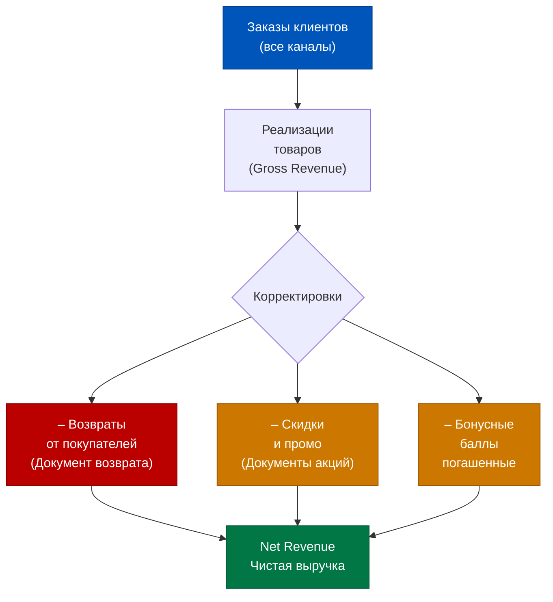
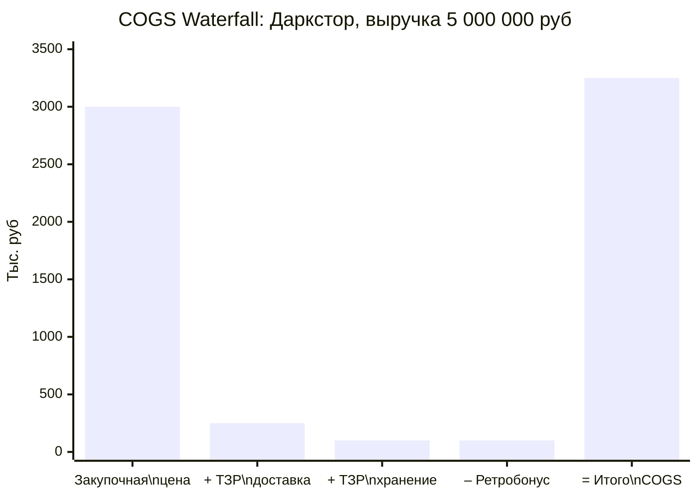
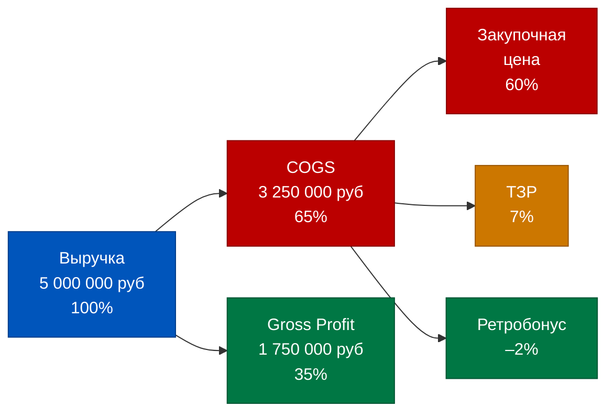
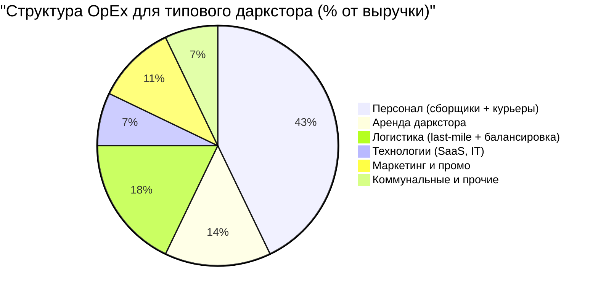
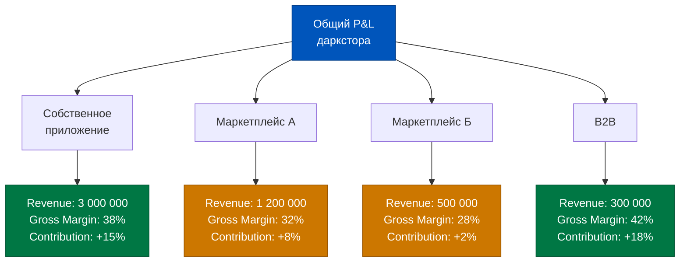
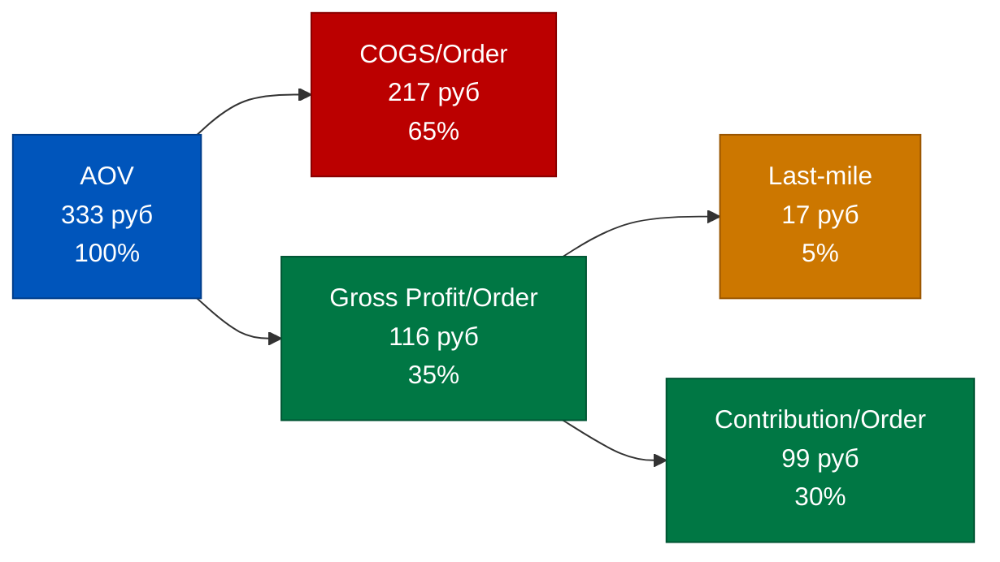
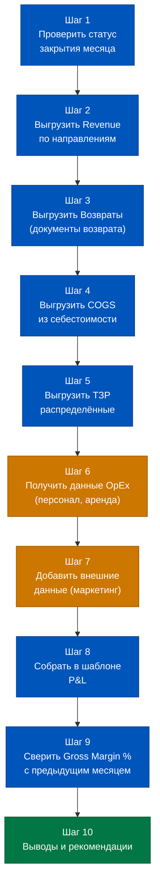
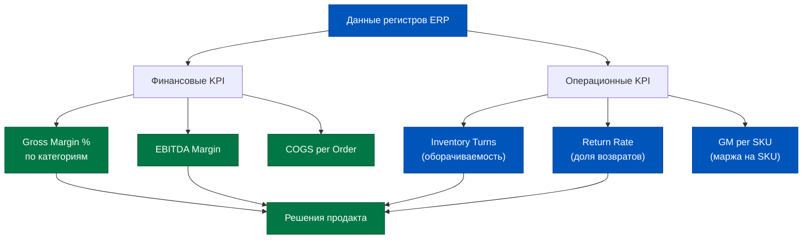

# День 6. Построение управленческого P&L: кейс даркстора

> P&L — это не таблица. Это история о том, как деньги проходят сквозь бизнес: откуда пришли, во что превратились и что осталось. ERP знает эту историю до последней строки.

## Содержание

1. [[#Часть 1. Структура управленческого P&L для Q-com]]
2. [[#Часть 2. Строка Revenue в ERP]]
3. [[#Часть 3. Строка COGS: как считается себестоимость]]
4. [[#Часть 4. Операционные расходы: структура OpEx]]
5. [[#Часть 5. Направления деятельности как инструмент P&L-разрезки]]
6. [[#Часть 6. Unit-экономика даркстора через призму ERP]]
7. [[#Часть 7. Чеклист: «Как построить P&L за 2 часа»]]

---

## Часть 1. Структура управленческого P&L для Q-com

Управленческий P&L — это не то же самое, что бухгалтерский Отчёт о финансовых результатах. У них разные цели. Бухгалтерский ОФР создаётся для налоговой и акционеров: он следует стандартам РСБУ, консервативен и ретроспективен. Управленческий P&L создаётся для менеджеров: он должен отвечать на вопрос «почему мы заработали (или потеряли) именно столько и что с этим делать».

В Q-com структура управленческого P&L имеет специфику. Стандартная модель выглядит так:

```
Revenue (Выручка)
  – Returns (Возвраты)
  – Discounts (Скидки и промо)
= Net Revenue (Чистая выручка)

  – COGS (Себестоимость товаров)
= Gross Profit (Валовая прибыль)
  Gross Margin, %

  – Personnel (Персонал: сборщики, курьеры, склад)
  – Rent (Аренда даркстора)
  – Utilities (Коммунальные услуги)
  – Logistics (ТЗР, балансировка, last-mile)
  – Marketing (Промо, скидки сверх себестоимости)
  – Technology (SaaS, интеграции)
= EBITDA
  EBITDA Margin, %

  – Depreciation & Amortization
= EBIT

  – Interest & Taxes
= Net Profit
```

Теперь ключевой вопрос: **какие строки берутся из ERP, а какие — из внешних источников?**

| Строка P&L | Источник в ERP | Внешний источник |
|---|---|---|
| Revenue | Реализации товаров, документы продаж | — |
| Returns | Возвраты от покупателей | — |
| Discounts | Документы скидок, акции | Данные маркетинга |
| COGS | Расчёт себестоимости (после закрытия) | — |
| Personnel | Табели, зарплатные ведомости | HR-система (частично) |
| Rent | Договора аренды, акты | Договора (1С:Документооборот) |
| Utilities | Счета коммунальных услуг | Счета поставщиков |
| Logistics / ТЗР | Поступления услуг, ТЗР | Договора с курьерами |
| Marketing | Документы промо | CRM, рекламные кабинеты |
| D&A | Регистр амортизации ОС | — |

Из таблицы видно: ERP покрывает примерно 70–80% строк P&L. Остальное приходится вносить вручную или через интеграции. Для продакта это означает: хороший P&L — это не только правильная работа с ERP, но и налаженные каналы получения данных из HR-системы, CRM, рекламных кабинетов.

Принципиальное различие между управленческим и бухгалтерским P&L в том, как группируются расходы. В управленческом P&L расходы группируются по **функциям** (что это даёт бизнесу), а не по **природе** (что это юридически). Аренда склада — это Cost of Operations, а не просто «прочие расходы».

---

## Часть 2. Строка Revenue в ERP

Выручка — самая, казалось бы, простая строка P&L. Но в Q-com с её множеством каналов, скидок и возвратов она требует особого внимания.

В 1C:ERP 2.5 выручка формируется из документов **«Реализация товаров и услуг»**. Каждый заказ клиента, доставленный и оплаченный, создаёт документ реализации. Сумма всех реализаций за период — это брутто-выручка.



**Влияние скидок и промо.** В Q-com скидки бывают двух типов:

1. **Прямые скидки** — снижают цену товара в момент продажи. Они уменьшают выручку немедленно: документ реализации создаётся уже на сниженную сумму.

2. **Промо-акции с компенсацией** — когда поставщик частично компенсирует скидку. В ERP это отражается как отдельный доход от поставщика, который корректирует финансовый результат, но не выручку.

**Разделение по каналам продаж.** ERP 2.5 позволяет разделить выручку по **направлениям деятельности** (о них подробно — в Части 5). Типичная разбивка для Q-com:

- Собственное мобильное приложение
- Маркетплейс (Яндекс Маркет, Самокат и т.д.)
- B2B-заказы (офисы, корпоративные клиенты)

Каждый канал должен быть настроен как отдельное направление деятельности в ERP. Тогда отчёт «Финансовые результаты» покажет выручку по каждому каналу отдельно.

**Практический вопрос: как выручка попадает в ERP из мобильного приложения?** Обычно через интеграцию: заказ создаётся в приложении, передаётся в ERP через API, ERP создаёт Заказ покупателя, после доставки — Реализацию. Качество этой интеграции напрямую влияет на точность строки Revenue в P&L.

Типичная ошибка, которую стоит проверять: в ERP отражены реализации, но возвраты — нет (потому что возвраты обрабатываются вручную с задержкой). Тогда Revenue завышена. Обязательно сверяйте количество возвратов в операционной системе с количеством документов возврата в ERP.

---

## Часть 3. Строка COGS: как считается себестоимость

COGS (Cost of Goods Sold) — себестоимость реализованных товаров — это самая «тяжёлая» строка в P&L даркстора. Типично COGS составляет 60–70% от выручки, а значит, каждый процент точности в этой строке — это сотни тысяч рублей разницы в Gross Profit.

Как уже объяснялось в Дне 5, ERP 2.5 использует **средневзвешенную себестоимость**. При закрытии месяца система пересчитывает все списания по фактической средней цене. COGS в P&L = сумма всех пересчитанных списаний за период.

Но COGS в управленческом P&L включает не только «чистую» себестоимость товара. В неё входят и ТЗР:



Числовой пример для даркстора:

| Компонент COGS | Сумма, руб | % от выручки |
|---|---|---|
| Закупочная стоимость товаров | 3 000 000 | 60,0% |
| + ТЗР: доставка от поставщиков | 250 000 | 5,0% |
| + ТЗР: складская обработка | 100 000 | 2,0% |
| – Ретробонусы поставщиков | -100 000 | -2,0% |
| **Итого COGS** | **3 250 000** | **65,0%** |



Gross Profit в нашем примере: 5 000 000 – 3 250 000 = **1 750 000 руб (35%)**.

35% Gross Margin — это нормальный показатель для Q-com даркстора в продуктовом ритейле. Для сравнения: интернет-магазин электроники работает с 15–20% Gross Margin, специализированный органический фуд-ритейл — 40–50%.

**Как читать строку COGS в отчёте ERP.** После закрытия месяца в разделе «Финансовый результат» → «Финансовые результаты деятельности» строка COGS называется «Себестоимость продаж». Если нужна детализация — открывайте «Анализ себестоимости выпуска» или «Расшифровку себестоимости реализации».

Главная ловушка при анализе COGS: смотреть на неё в абсолютных цифрах, а не в процентах от выручки. Абсолютная COGS всегда растёт при росте оборота. Следите за **Gross Margin %** — именно этот показатель говорит об эффективности закупок и ценообразования.

---

## Часть 4. Операционные расходы: структура OpEx

После Gross Profit начинается зона, которую принято называть «операционными расходами» (OpEx). Здесь — всё, что обеспечивает работу даркстора, но не входит напрямую в стоимость товара.



Разберём каждую статью с точки зрения ERP:

**Персонал.** Самая крупная статья. В ERP 2.5 зарплата и смены отражаются через модуль «Зарплата и управление персоналом» (ЗУП) или через интеграцию с внешней HR-системой. В P&L из ERP попадает: начисленная зарплата + взносы в фонды. Но нужно учитывать, что часть персонала (особенно курьеры) может работать как самозанятые — тогда расходы проходят как «Услуги» через Поступление услуг, а не через ЗУП.

**Аренда.** В ERP фиксируется через ежемесячные акты от арендодателя: Поступление услуг → статья «Аренда». Если аренда с НДС — система автоматически выделяет налог в отдельный регистр.

**Логистика.** Здесь важно разделить два компонента:
1. *ТЗР входящие* (доставка товара от поставщика) — уже включены в COGS
2. *Last-mile логистика* (доставка заказа покупателю) — это уже OpEx

В ERP last-mile логистика отражается через договора с курьерскими сервисами: либо как Поступление услуг (если внешний сервис), либо как расходы на персонал (если собственные курьеры). Для корректного P&L важно не смешивать эти два вида логистических расходов.

**Маркетинг.** Здесь ERP покрывает только часть: скидки и промо, отражённые в документах системы. Расходы на рекламные кабинеты (Яндекс, VK) приходят из внешних систем и вносятся вручную или через интеграцию.

**Итоговая таблица EBITDA для нашего примера:**

| Строка | Сумма, руб | % от выручки |
|---|---|---|
| Net Revenue | 5 000 000 | 100% |
| COGS | 3 250 000 | 65% |
| **Gross Profit** | **1 750 000** | **35%** |
| Персонал | 600 000 | 12% |
| Аренда | 200 000 | 4% |
| Логистика last-mile | 250 000 | 5% |
| Технологии | 100 000 | 2% |
| Маркетинг | 150 000 | 3% |
| Коммунальные | 100 000 | 2% |
| **Итого OpEx** | **1 400 000** | **28%** |
| **EBITDA** | **350 000** | **7%** |

7% EBITDA Margin — это «точка безубыточности» для Q-com. Зрелые операторы нацеливаются на 10–15%.

---

## Часть 5. Направления деятельности как инструмент P&L-разрезки

Направления деятельности в ERP 2.5 — это аналитический инструмент, который позволяет получить P&L не только по всему бизнесу, но и по отдельным его «срезам». Мы упоминали этот механизм на Неделе 1 Day 2, теперь рассмотрим его на практике финансового анализа.

Настройка: в разделе «НСИ» → «Направления деятельности» создаются аналитические группировки. Для Q-com типичная структура:

- Направление 1: Собственное мобильное приложение
- Направление 2: Маркетплейс А (Яндекс Маркет)
- Направление 3: Маркетплейс Б (другие платформы)
- Направление 4: B2B-заказы

Когда каждый документ реализации привязан к конкретному направлению деятельности, отчёт «Финансовые результаты деятельности» автоматически строит P&L по каждому каналу.



Числовой пример P&L по трём каналам:

| Канал | Revenue, руб | Gross Margin | Contribution Margin | Вывод |
|---|---|---|---|---|
| Собственное приложение | 3 000 000 | 38% | +15% | Основной драйвер прибыли |
| Маркетплейс А | 1 200 000 | 32% | +8% | Нормальный |
| Маркетплейс Б | 500 000 | 28% | +2% | На грани |
| B2B | 300 000 | 42% | +18% | Высокомаржинальный |

Что такое **Contribution Margin** в контексте направлений? Это Gross Profit минус прямые операционные расходы, которые можно атрибутировать конкретному каналу (маркетинг канала, особые условия доставки, комиссии маркетплейса).

Практический вывод: маркетплейс А даёт 24% выручки, но только 14% прибыли. Собственное приложение даёт 60% выручки и 65% прибыли. Это аргумент в пользу инвестиций в удержание пользователей в собственном канале — именно такой вывод ERP даёт продакту на языке цифр.

**Ограничение:** направления деятельности работают корректно только если все документы правильно заполнены. Если менеджер при создании реализации «забыл» выбрать направление — эта сумма попадёт в «Нераспределённые», и P&L по каналам будет неполным. Контроль заполнения обязательного реквизита «Направление деятельности» должен быть настроен на уровне системы.

---

## Часть 6. Unit-экономика даркстора через призму ERP

P&L на уровне даркстора — это стратегическая картина. Но для операционных решений продакту нужна **unit-экономика**: метрики на уровне одного заказа, одного SKU, одного покупателя.

ERP 2.5 позволяет вычислить ключевые unit-метрики из данных регистров:

**AOV (Average Order Value) — средний чек:**
```
AOV = Net Revenue / Количество заказов
    = 5 000 000 / 15 000 = 333 руб
```

Данные для расчёта: Net Revenue из «Финансовых результатов», количество заказов из «Анализа продаж» → группировка по документам.

**COGS per Order — себестоимость среднего заказа:**
```
COGS/Order = COGS / Количество заказов
           = 3 250 000 / 15 000 = 217 руб
```

**Gross Profit per Order — валовая прибыль с заказа:**
```
GP/Order = AOV – COGS/Order = 333 – 217 = 116 руб (35%)
```

**Contribution per Order — вклад заказа после прямых операционных расходов:**
```
Contribution/Order = GP/Order – (Last-mile logistics / Orders)
                   = 116 – (250 000 / 15 000) = 116 – 17 = 99 руб
```



Связь unit-экономики с операционными решениями:

**SKU-count и Fill Rate.** Если Fill Rate падает (больше заказов с незакрытыми позициями), часть выручки теряется на субституции или отменах. ERP видит это в «Анализе выполнения заказов»: сколько позиций было заменено, сколько отменено. Каждые 1% Fill Rate — это примерно 0.5% потери в Revenue.

**OTDR (On-Time Delivery Rate) и Contribution.** Просроченные доставки ведут к возвратам и компенсациям. В ERP это отражается как возвраты от покупателей: рост строки Returns снижает Net Revenue и, следовательно, Contribution per Order.

**Оборачиваемость и COGS.** Чем выше оборачиваемость SKU, тем свежее средневзвешенная себестоимость — и тем точнее она отражает текущие рыночные цены. Низкооборачиваемые позиции «несут» старые цены в своей себестоимости, что может искажать маржинальность категории.

Для продакта unit-экономика из ERP — это не просто аналитика. Это инструмент принятия решений: стоит ли добавлять SKU в ассортимент, нужно ли пересматривать условия с конкретным поставщиком, оправдана ли доставка маленьких заказов.

---

## Часть 7. Чеклист: «Как построить P&L за 2 часа»

Теория — хорошо. Практика — лучше. Вот пошаговый алгоритм построения управленческого P&L из данных ERP 2.5 после закрытия месяца.



**Детальная таблица: каждый шаг с отчётом ERP:**

| Строка P&L | Отчёт в ERP 2.5 | Поля | Формула |
|---|---|---|---|
| Gross Revenue | Финансы → Финансовые результаты деятельности | Выручка, период, направление | Сумма реализаций |
| Returns | Продажи → Анализ возвратов покупателей | Сумма возврата, период | –Сумма возвратных документов |
| Net Revenue | Расчёт | | Gross Revenue – Returns |
| COGS (товары) | Финансы → Себестоимость продаж | Себестоимость, период | Сумма фактической себестоимости |
| ТЗР в COGS | Финансы → Анализ ТЗР | Распределённые ТЗР, период | Сумма ТЗР на реализованные товары |
| Gross Profit | Расчёт | | Net Revenue – COGS – ТЗР |
| Персонал | Зарплата → Свод начислений | Начислено, период | Зарплата + взносы |
| Аренда | Закупки → Поступление услуг | Статья = Аренда, период | Сумма актов аренды |
| Логистика | Закупки → Поступление услуг | Статья = Логистика, период | Сумма курьерских услуг |
| Маркетинг | Закупки + внешние данные | Статья = Маркетинг, период | ERP + рекламные кабинеты |
| EBITDA | Расчёт | | Gross Profit – OpEx |

**Типичные ошибки при сборке P&L:**

1. **Не проверить статус закрытия** (шаг 1) — если месяц не закрыт, COGS будет по плановым ценам
2. **Забыть возвраты** — Revenue без вычета возвратов завышена
3. **Смешать ТЗР входящие и исходящие** — первые входят в COGS, вторые в OpEx
4. **Использовать данные разных систем за разные даты** — ERP на 1-е число, зарплата на 3-е, реклама на 5-е

**Итоговый вывод дня.** ERP — это не «программа для бухгалтерии». Это операционная память бизнеса, которая при правильной настройке выдаёт управленческий P&L с точностью, недостижимой при ручном учёте. Продакт, который умеет читать ERP, не ждёт P&L от финансистов — он строит его сам за 2 часа и принимает решения на 30 дней раньше конкурентов.

---

## Дополнение к Части 3. Анализ Gross Margin по категориям

Валовая прибыль на уровне всего даркстора — 35% — это агрегированная цифра. Под ней скрывается большой разброс: разные категории товаров имеют принципиально разную маржинальность.

Типичный профиль маржинальности по категориям Q-com:

| Категория | Gross Margin | Ключевые факторы |
|---|---|---|
| Фреш (молоко, яйца) | 18–22% | Низкая наценка, высокий оборот |
| Мясо и птица | 25–30% | Средняя наценка, потери при хранении |
| Овощи и фрукты | 30–40% | Высокая наценка, высокие потери |
| Бакалея | 28–35% | Средняя наценка, минимальные потери |
| Алкоголь | 25–30% | Ограниченная наценка (регулирование) |
| Снеки и кондитерка | 35–45% | Высокая наценка, долгий срок годности |
| Готовая еда | 50–65% | Собственное производство, высокая добавленная стоимость |
| Бытовая химия | 20–25% | Низкая наценка, высокая конкуренция |

Как получить этот разрез из ERP: в отчёте «Финансовые результаты деятельности» добавить группировку по «Номенклатурной группе». Номенклатурные группы должны соответствовать категориям — это настраивается в справочнике номенклатуры.

Практический вывод для ассортиментной стратегии: категория «Готовая еда» даёт в 2–3 раза больше маржи на рубль выручки, чем «Фреш». Если Fill Rate по готовой еде падает — потери для P&L непропорционально велики. Именно поэтому в Q-com дарксторах готовая еда — приоритетная категория для обеспечения наличия.

---

## Дополнение к Части 5. Настройка направлений деятельности: практика

Направления деятельности работают корректно только при правильной настройке. Разберём технические детали, которые важны для продакта — не для того, чтобы самому настраивать, а чтобы правильно ставить задачу внедренцу или бухгалтеру.

В ERP 2.5 направления деятельности работают в двух режимах:

**Режим 1: Распределение.** Все расходы и доходы сначала попадают в «общий котёл», а потом распределяются по направлениям деятельности по заданным базам (пропорционально выручке, прямым расходам и т.д.). Этот режим проще в настройке, но даёт менее точные данные — распределение всегда условно.

**Режим 2: Обособленный учёт.** Каждая операция сразу привязывается к конкретному направлению деятельности. Точнее, но требует дисциплины: каждый документ должен иметь заполненный реквизит «Направление деятельности».

Для Q-com рекомендуется режим 2 (обособленный учёт) — потому что каналы продаж имеют принципиально разную экономику и «усреднение» через распределение скроет важные различия.

Контрольная точка для продакта: запустить отчёт «Реализации» за период с группировкой по «Направлению деятельности» и проверить, нет ли строки «Не указано» или пустых значений. Если есть — значит, часть документов создаётся без привязки к каналу, и P&L по каналам будет неполным.

---

## Дополнение к Части 6. Расчёт ключевых KPI из данных ERP

Помимо базовых unit-метрик (AOV, COGS per Order), из данных ERP можно рассчитать ряд операционных KPI, которые обычно считаются «отдельно от финансов».

**Gross Margin per SKU.** Эффективная метрика для решений об ассортименте:
```
GM per SKU = (Цена продажи – Фактическая себестоимость) / Цена продажи × 100%
```
Данные: «Анализ продаж» с колонками «Выручка» и «Себестоимость» в разрезе номенклатуры.

**Inventory Turns (оборачиваемость запасов):**
```
Inventory Turns = COGS за период / Средний остаток по себестоимости
```
Данные: COGS из «Финансовых результатов», средний остаток из «Остатков товаров» (начало + конец периода / 2). Для Q-com нормальное значение: 20–30 оборотов в год (товар обновляется каждые 12–18 дней).

**Return Rate (доля возвратов):**
```
Return Rate = Сумма возвратов / Gross Revenue × 100%
```
Данные: «Анализ возвратов» / «Анализ реализаций». В Q-com норма: до 5%. Выше 8% — сигнал проблем с качеством или сборкой.



Связь KPI с операционными решениями:

- **Inventory Turns < 15** для скоропортимых товаров → риск списаний → нужно сократить страховой запас или пересмотреть минимальный заказ
- **Return Rate > 8%** → проверить причины возвратов: ошибки сборки, качество товара, описание в приложении
- **Gross Margin per SKU < 15%** при высокой доле в выручке → потенциальная «ловушка выручки»: продаём много, зарабатываем мало

ERP даёт эти данные. Интерпретация и решение — за продактом.

---

## Дополнение к Части 1. Как управленческий P&L отличается от бюджета

Управленческий P&L — это факт. Бюджет — это план. Разница между ними — это «план-факт анализ», один из главных инструментов финансового управления.

В ERP 2.5 существует возможность загрузить бюджет (плановые показатели) и автоматически сравнить его с фактическими данными регистров. Это делается через «Бюджетирование» — отдельный модуль ERP, который позволяет:

1. Создать плановые показатели: выручка по каналам, COGS по категориям, OpEx по статьям
2. Привязать план к направлениям деятельности и периодам
3. После закрытия месяца — автоматически сформировать план-факт отчёт

Для продакта план-факт особенно ценен в начале квартала: вы видите, где бизнес опередил план, а где — отстал. Это основа для принятия корректирующих решений.

Типичные отклонения в Q-com и их интерпретация:

- **Выручка ниже плана >5%** → провал Fill Rate или OTDR, или промо сработало хуже ожиданий
- **COGS выше плана >3%** → ТЗР оказались больше прогнозных, или поставщики повысили цены
- **Персонал выше плана >10%** → переработки из-за непредвиденного роста объёма заказов
- **Gross Margin ниже плана >2 п.п.** → ценовое давление или неоптимальный ассортимент-микс

Продакт, который умеет интерпретировать эти отклонения — это не просто «читатель отчётов». Это человек, который превращает финансовые данные в операционные гипотезы и проверяет их на следующий месяц.

---

## Дополнение к Части 4. Полный пример P&L для двух дарксторов

Управленческий P&L становится особенно полезным при сравнении нескольких операционных единиц. Сравним два условных даркстора одной сети:

| Показатель | Даркстор А (центр) | Даркстор Б (спальный район) |
|---|---|---|
| Заказов в месяц | 18 000 | 12 000 |
| Net Revenue | 6 300 000 руб | 3 600 000 руб |
| COGS | 4 095 000 руб (65%) | 2 520 000 руб (70%) |
| Gross Profit | 2 205 000 руб (35%) | 1 080 000 руб (30%) |
| Персонал | 756 000 руб (12%) | 468 000 руб (13%) |
| Аренда | 315 000 руб (5%) | 144 000 руб (4%) |
| Логистика last-mile | 315 000 руб (5%) | 216 000 руб (6%) |
| Прочий OpEx | 252 000 руб (4%) | 180 000 руб (5%) |
| Итого OpEx | 1 638 000 руб (26%) | 1 008 000 руб (28%) |
| **EBITDA** | **567 000 руб (9%)** | **72 000 руб (2%)** |

Что видит продакт из этого сравнения:

Даркстор Б в спальном районе имеет в 2 раза меньше оборота и маржу EBITDA почти на грани нулевой. Ключевые проблемы по данным ERP:

1. **COGS 70% vs 65%** → у Б хуже ассортимент-микс (больше низкомаржинальных категорий) или хуже условия закупок
2. **Логистика 6% vs 5%** → более длинные маршруты доставки в спальном районе
3. **AOV ниже** (300 руб у Б vs 350 руб у А) → меньше готовой еды в заказах

Вывод для продакта: инвестировать в категорию готовой еды в дарксторе Б (это поднимет GM) и пересмотреть маршруты доставки (это снизит логистику).

Всё это видно только тогда, когда P&L строится в разрезе направлений деятельности — по каждому дарксторту отдельно. Без направлений деятельности вы видите только сводный P&L сети и не понимаете, какая операционная единица «тянет вниз».

---

← [[Неделя 8 - День 5 - Закрытие месяца|← День 5]] | [[1c_erp_qcom/README|Оглавление]] | [[Неделя 8 - День 7 - Будущее ERP|День 7 →]]
