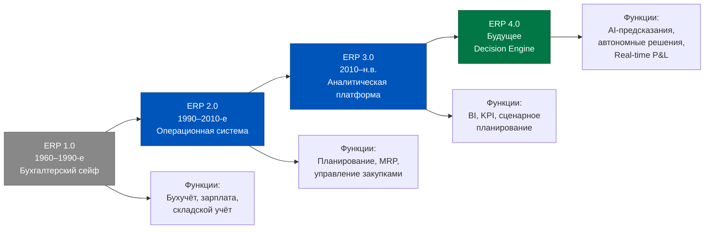
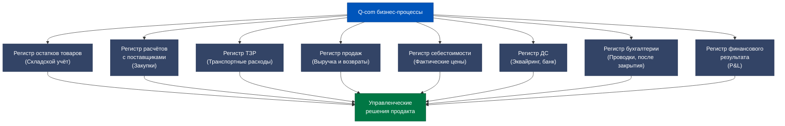
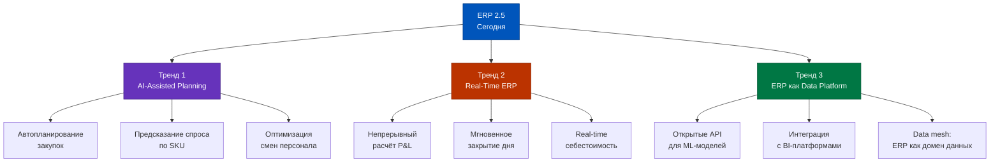
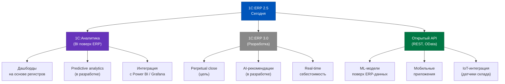
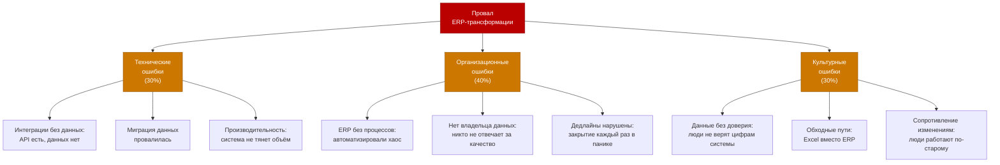
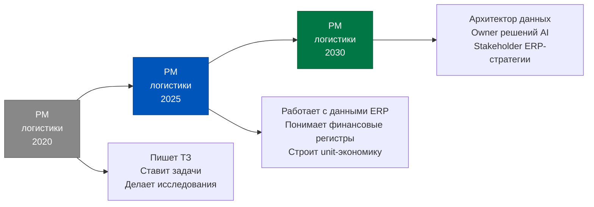
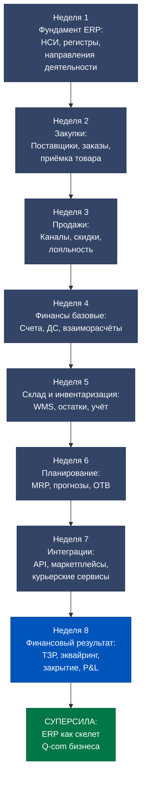
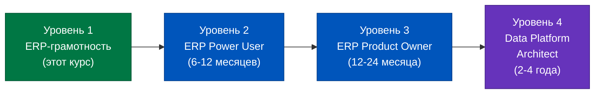

# День 7. От учётной системы к Decision Engine: финальный манифест

> Восемь недель назад ERP казалась вам «чёрным ящиком». Сегодня вы видите скелет бизнеса — регистры, потоки данных, логику закрытия. Теперь посмотрим, куда этот скелет движется.

## Содержание

1. [[#Часть 1. Взгляд назад: ERP как «бухгалтерский сейф» (до 2010-х)]]
2. [[#Часть 2. ERP как операционная память: синтез 8 недель]]
3. [[#Часть 3. Куда движется ERP: три мегатренда]]
4. [[#Часть 4. 1C:ERP на пути к Decision Engine]]
5. [[#Часть 5. Что сломается по дороге]]
6. [[#Часть 6. Роль продакта в эпоху «умного ERP»]]
7. [[#Часть 7. Финальный синтез: манифест продакта с ERP-суперсилой]]

---

## Часть 1. Взгляд назад: ERP как «бухгалтерский сейф» (до 2010-х)

Есть хорошая история о том, как возникли ERP-системы. В 1960-х годах первые компьютеры в бизнесе использовались для одного: автоматизации расчёта зарплаты. Затем — для учёта запасов. Затем — для бухгалтерии. Каждая задача требовала отдельной программы, и к 1970-м годам крупная производственная компания имела десятки разрозненных «учётных» систем, которые не разговаривали между собой.

Идея ERP — Enterprise Resource Planning — родилась как ответ на этот хаос. Объединить всё в одну систему: склад, производство, финансы, кадры, закупки. Данные вводятся один раз — и автоматически распространяются по всем модулям.

Но в первые десятилетия эта идея реализовывалась преимущественно в **учётной парадигме**. ERP была, по сути, большим цифровым сейфом: туда складывали факты о том, что произошло. Продали — записали. Купили — записали. Выплатили — записали. Сейф хранил историю. Вопрос «что делать дальше» оставался за пределами его компетенции.

В России 1С прошла этот же путь. Первая версия — «1С: Бухгалтерия» 1991 года — была буквально электронным аналогом бухгалтерских книг. Версии 7.5, 7.7 добавили торговлю и зарплату, но концепция оставалась той же: инструмент для отражения фактов, а не для управления будущим.

Переход от ERP 1.0 к ERP 2.0 произошёл с распространением MRP (Material Requirements Planning) — когда система научилась не только фиксировать движение товаров, но и планировать потребности в закупках на основе производственных планов. Это был принципиальный сдвиг: ERP перестала быть зеркалом прошлого и начала смотреть в будущее.

В России этот переход пришёлся на 2000-е годы. Появление «1С: Управление производственным предприятием» (УПП) в 2004 году, а затем «1С: ERP Управление предприятием 2.0» в 2013 году ознаменовало выход за пределы чистой бухгалтерии.

ERP 2.5, с которой мы работали восемь недель — это зрелая реализация концепции ERP 2.0 с элементами ERP 3.0. Она умеет не только фиксировать факты, но и строить аналитику, управлять финансовым результатом по направлениям деятельности, планировать потребности в товаре.

Но самый интересный вопрос: что такое ERP 4.0 — Decision Engine? И как к нему прийти?

Студент в начале курса видел ERP как «чёрный ящик»: данные туда входят, отчёты оттуда выходят, а что происходит внутри — загадка. Восемь недель спустя картина изменилась: вы знаете регистры, понимаете потоки данных, можете объяснить, почему себестоимость появляется только после закрытия месяца. Это фундамент. Теперь давайте построим на нём взгляд в будущее.

Главное, что изменилось в ERP за последние 10 лет: она перестала быть системой «одного направления». Раньше данные шли в ERP → там хранились → из ERP выходили в отчёт. Сегодня ERP — это узел в экосистеме: данные приходят из десятков источников (приложения, IoT-датчики, маркетплейсы), обрабатываются в ERP и уходят в десятки назначений (аналитические платформы, ML-модели, операционные дашборды).

---

## Часть 2. ERP как операционная память: синтез 8 недель

Восемь недель назад мы начали с вопроса: «Что такое ERP для продакта в Q-com?». Мы дали предварительный ответ: операционная память бизнеса. Теперь, пройдя весь курс, давайте наполним этот ответ конкретным содержанием.

Каждое движение в Q-com оставляет след в системе регистров ERP. Регистр — это не просто таблица. Это хронограф событий, который знает: что произошло, когда, с каким объектом, в каком количестве, по какой цене.

За 8 недель мы изучили, как работают ключевые регистры:

Вот восемь ключевых регистров ERP 2.5 и бизнес-процессы Q-com, которые они обслуживают:

**Регистр 1: Остатки товаров.** Это сердце складского учёта. Каждое поступление, списание, перемещение, инвентаризация — всё отражается здесь. Именно из него берётся информация о Fill Rate, out-of-stock, излишках. Мы изучали его в неделях 2 и 5.

**Регистр 2: Расчёты с контрагентами.** Хранит историю всех взаиморасчётов с поставщиками и покупателями: авансы, накладные, оплаты, кредит-ноты. Основа для управления дебиторской и кредиторской задолженностью. Неделя 3.

**Регистр 3: ТЗР.** Специализированный регистр транспортно-заготовительных расходов. Накапливает расходы на доставку товара и распределяет их на себестоимость при закрытии месяца. Неделя 8, день 2.

**Регистр 4: Продажи.** Детализированная история реализаций: документ, покупатель, товар, количество, цена, скидка, направление деятельности. Основа для анализа выручки и unit-экономики.

**Регистр 5: Себестоимость.** Самый «тяжёлый» расчётный регистр. Хранит плановую и фактическую себестоимость каждой позиции. Формируется при закрытии месяца.

**Регистр 6: Денежные средства.** Движение по расчётным счетам и кассе, включая эквайринг. Неделя 8, день 4.

**Регистр 7: Бухгалтерия.** Единственный регистр, который формируется только после закрытия месяца. Содержит проводки по всем счетам плана счетов — это основа регламентированной отчётности.

**Регистр 8: Финансовый результат.** Сводный регистр доходов и расходов в разрезе направлений деятельности. Источник управленческого P&L.

Понимание этих восьми регистров — это то, чего нет в должностной инструкции продакта логистики Q-com. Но именно оно позволяет вам задавать правильные вопросы на встречах с финансовым директором, формулировать корректные требования к аналитическим инструментам и понимать, почему «цифры не сходятся».

За 8 недель мы прошли путь от «ERP — это черный ящик» до «ERP — это карта бизнеса с GPS-навигацией». Теперь посмотрим, каким будет следующее поколение этой карты.

---

## Часть 3. Куда движется ERP: три мегатренда

История технологий знает несколько типов трансформаций. Есть эволюционные изменения — когда система делает то же самое, но быстрее или дешевле. И есть революционные — когда система начинает делать принципиально новые вещи. ERP сегодня переживает революционный момент, и он определяется тремя мегатрендами.

**Тренд 1: AI-Assisted Planning.**

Сегодня в ERP 2.5 планирование потребностей — это регламентная задача: планировщик открывает «Помощник планирования закупок», смотрит статистику и принимает решение. Система предоставляет данные, человек принимает решение.

Следующий шаг: система не просто предоставляет данные, а **предлагает решение** с обоснованием. «На основе прогноза спроса на следующую неделю рекомендую заказать у поставщика X 500 единиц SKU Y. Текущий остаток — 80 единиц, прогнозируемый спрос — 420 единиц, страховой запас — 60 единиц.»

Это требует ML-модели прогнозирования спроса, интегрированной с данными ERP. Входные данные: история продаж из регистра продаж, сезонность, остатки, сроки поставки. Выходные данные: рекомендация с вероятностью и диапазоном неопределённости.

Для Q-com этот сценарий особенно ценен, потому что ассортимент даркстора — 3 000–5 000 SKU, и каждый SKU нужно планировать отдельно с учётом скоропортимости. Человек физически не может оптимально управлять таким объёмом вручную.

Аналогичная логика применима к планированию смен: на основе прогноза объёма заказов система рекомендует количество сборщиков и курьеров на каждый временной слот. Расходы на персонал — это 12% выручки даркстора; оптимизация этой статьи на 10% — это 1,2% EBITDA.

**Тренд 2: Real-Time ERP.**

Закрытие месяца — это артефакт архитектуры «батчевой обработки», которая доминировала в IT до 2010-х. Ночью запускается пакетное задание, пересчитывает всё накопленное за день — и утром вы видите обновлённые данные.

Современные технологии (in-memory базы данных, event streaming, микросервисные архитектуры) позволяют делать это непрерывно. SAP HANA, Oracle Cloud ERP — они уже движутся в сторону «perpetual close»: финансовый результат обновляется не раз в месяц, а в режиме реального времени.

Для Q-com это означает: в любой момент дня вы видите актуальный P&L с фактической (не плановой) себестоимостью. Решение «отменить промо-акцию, которая съедает маржу» можно принять не в конце месяца, а сегодня в 14:00.

1С движется в этом направлении медленнее западных конкурентов, но направление задано: технология «Быстрое закрытие» в новых версиях позволяет сократить время закрытия с часов до минут.

**Тренд 3: ERP как Data Platform.**

Самый фундаментальный тренд. ERP перестаёт быть изолированной системой и становится «доменом данных» в архитектуре data mesh.

Что это означает практически: ERP предоставляет свои данные через стандартизированные API всем, кто в них нуждается. ML-модель прогнозирования спроса берёт данные из ERP-регистра продаж напрямую. BI-платформа строит дашборды поверх ERP-данных в реальном времени. Система управления курьерами получает из ERP статус заказов и остатки на складе.

ERP в этой модели — не монолит, который «умеет всё», а надёжный источник операционной правды о бизнесе, к которому подключены специализированные инструменты.

---

## Часть 4. 1C:ERP на пути к Decision Engine

Глобальные тренды — это SAP и Oracle. Но наш курс про 1С, и важно понять: где в этом движении находится 1С:ERP, и что уже доступно сегодня.

**Что уже доступно в ERP 2.5:**

Открытый API на базе OData и REST — это уже реальность. 1С:ERP предоставляет данные через HTTP-сервисы, что позволяет внешним приложениям читать и записывать данные в систему без прямого доступа к базе. Для Q-com это означает: мобильное приложение для курьеров, система управления доставкой, WMS — все они могут обмениваться данными с ERP в реальном времени.

«Монитор руководителя» и «Анализ данных» — встроенные инструменты визуализации, которые строят оперативные дашборды на основе регистров ERP. Не настоящий BI, но достаточно для операционного мониторинга.

**1С:Аналитика** — это отдельный продукт компании 1С, который позиционируется как аналитическая надстройка над ERP. Он позволяет строить сложные отчёты, проводить план-фактный анализ, строить прогнозы на основе исторических данных ERP. По сути — первый шаг к ERP 3.0 в экосистеме 1С.

**Концепция «Цифрового двойника».** Самая интригующая идея в современном ERP-дискурсе: система становится точной цифровой копией физических операций. Каждый товар на складе имеет цифровой двойник в ERP с историей всех движений. Каждый заказ — цифровой след от создания до доставки. Когда цифровой двойник полный и актуальный, менеджер может «запускать» операционные решения сначала в модели, а затем применять их в реальности.

Для Q-com цифровой двойник означает: можно смоделировать «что будет, если мы уберём 200 SKU из ассортимента» — и ERP покажет прогнозный P&L, изменение Fill Rate, нагрузку на склад. Без рисков для реального бизнеса.

**Архитектура зрелой системы «1С ERP + Аналитика + ML»:**

Уровень 1: **1С:ERP** — операционная основа. Хранит регистры, обрабатывает транзакции, формирует финансовый результат.

Уровень 2: **1С:Аналитика + BI** — аналитический слой. Строит дашборды, выявляет паттерны, проводит plan-fact анализ.

Уровень 3: **ML-модели** — предиктивный слой. Прогнозирует спрос, рекомендует закупки, оптимизирует расписание.

Уровень 4: **Decision Engine** — финальная цель. Система не только рекомендует, но и (в определённых рамках) автономно принимает решения: автоматически создаёт заказы поставщикам при достижении точки перезаказа, перераспределяет товар между складами, корректирует смены персонала.

Путь от сегодняшнего ERP 2.5 до Decision Engine — это не вопрос «какой продукт купить». Это вопрос зрелости данных, процессов и организационной культуры.

---

## Часть 5. Что сломается по дороге

Было бы нечестно заканчивать курс на оптимистической ноте, не сказав о реальных трудностях. ERP-трансформации — один из самых рискованных классов IT-проектов. По разным оценкам, от 50 до 70% ERP-внедрений либо проваливаются полностью, либо существенно превышают бюджет и сроки, либо не достигают заявленных целей.

Почему так происходит? Не из-за технологий — современные ERP-платформы вполне надёжны. Ошибки происходят по трём классам причин.

**Класс 1: Технические ошибки.**

«Интеграции без данных» — самая распространённая техническая ошибка. Команда создаёт красивую архитектуру: ERP связана с мобильным приложением, WMS, CRM через API. Но никто не проверил: а данные в этих системах соответствуют ожидаемому формату? Оказывается, в CRM клиент без ИНН, в ERP контрагент требует ИНН. Интеграция «смотрит» друг на друга, но данные не передаются.

Миграция данных — ещё один стандартный риск при переходе с одной ERP на другую. Переносятся тысячи карточек номенклатуры, остатки, договоры. В процессе теряется часть истории, часть данных приходит в некорректном формате. После запуска выясняется, что остатки в системе расходятся с физическими остатками на 15%.

**Класс 2: Организационные ошибки.**

«Автоматизировали хаос» — крылатая фраза в мире ERP. Если до внедрения процесс закупок работал так: «менеджер звонит поставщику, договаривается устно, потом создаёт заказ в системе» — то ERP не исправит этот процесс. Она просто оцифрует хаос. Цифровой хаос не лучше аналогового.

Правильная последовательность: сначала выстроить процесс, потом автоматизировать. ERP — это не инструмент для создания процессов, это инструмент для их масштабирования.

«Нет владельца данных» — ошибка, которая проявляется не сразу, а через 6–12 месяцев. Кто отвечает за то, что все реализации создаются в правильном направлении деятельности? Кто контролирует, что ТЗР отражаются вовремя? Если нет назначенного ответственного — система деградирует, качество данных падает, отчёты перестают быть достоверными.

**Класс 3: Культурные ошибки.**

«Данные без доверия» — самый трудно исправимый класс проблем. Если однажды в системе появились неверные цифры (ошибка миграции, некорректная настройка, ошибка пользователя) — люди запомнят это. «Система показала 500 тысяч прибыли, а на самом деле был убыток» — такую историю рассказывают годами. После этого все ключевые решения принимаются на основе Excel, а ERP становится «системой для бухгалтерии».

«Обходные пути» — прямое следствие потери доверия. Если система неудобна или неточна, люди быстро находят обходные пути: параллельные таблицы, теневой учёт, «личные базы данных». ERP формально работает, но реальные данные — в Excel на рабочем столе менеджера.

**Как PM может стать катализатором успешной трансформации:**

Продакт в Q-com находится в уникальной позиции: он работает на стыке операционных процессов и IT-систем. Именно поэтому PM может быть главным «агентом качества данных»:

1. Требовать, чтобы все операционные события немедленно отражались в ERP (дедлайны Day 5)
2. Контролировать заполнение обязательных реквизитов (направление деятельности, статья затрат)
3. Регулярно сверять данные ERP с физической реальностью (инвентаризации, сверки)
4. Строить P&L из ERP самостоятельно — не ждать финансиста, а показывать своей команде, что данные ERP достоверны

---

## Часть 6. Роль продакта в эпоху «умного ERP»

Профессия «Product Manager» в Q-com логистике претерпевает трансформацию. Пять лет назад PM — это человек, который писал ТЗ, ставил задачи разработчикам, проводил исследования. Сегодня этого недостаточно.

Новый облик PM логистики Q-com в эпоху «умного ERP» — это переход от «постановщика задач» к «архитектору данных». Что это значит на практике?

**Архитектор данных** знает: какие данные нужны для принятия каждого ключевого решения, откуда эти данные берутся (ERP, CRM, внешние сервисы), как обеспечить их качество и своевременность, как выстроить аналитическую архитектуру поверх операционных данных.

**5 ключевых компетенций продакта в Data-driven Q-com:**

**Компетенция 1: ERP-грамотность.** Понимание архитектуры регистров, логики закрытия месяца, структуры P&L в ERP. Именно это вы изучили за 8 недель. Это база.

**Компетенция 2: Финансовая аналитика.** Умение строить P&L, анализировать unit-экономику, интерпретировать отклонения план-факт. Без финансовой грамотности данные ERP — просто цифры.

**Компетенция 3: Data Engineering (базовый уровень).** Понимание того, как данные передаются между системами: API, webhooks, потоковая передача данных. PM не обязан писать код, но обязан понимать, как работают интеграции, и правильно формулировать требования к ним.

**Компетенция 4: ML/AI Product Thinking.** Понимание того, как работают предиктивные модели, какие данные им нужны, как оценивать качество прогнозов. PM должен уметь ставить задачи дата-сайентистам так же чётко, как ставит задачи разработчикам.

**Компетенция 5: Организационный дизайн данных.** Умение выстраивать процессы, обеспечивающие качество данных: дедлайны, роли, контроли. Без этого любая технологическая инвестиция в ERP деградирует за 12 месяцев.

**Карьерный путь продакта с ERP-суперсилой:**

Операционный PM логистики (сейчас) → Старший PM / Head of Operations → **ERP Product Owner** (владелец продукта ERP-системы внутри компании) → **Chief Data Officer** или **VP Operations** → стратегический уровень.

ERP Product Owner — это отдельная роль, которая появляется в Q-com компаниях с оборотом от 1 млрд рублей. Человек, который отвечает за развитие ERP как продукта: ведёт бэклог доработок, управляет интеграциями, обеспечивает качество данных, переводит бизнес-задачи в требования к системе. Это не IT-роль и не бухгалтерская роль — это операционно-продуктовая роль. И именно к ней ведёт понимание ERP на уровне этого курса.

---

## Часть 7. Финальный синтез: манифест продакта с ERP-суперсилой

Мы прошли 56 уроков за 8 недель. Пора свести всё воедино.

**Что студент умел до курса → Что умеет после:**

| До курса | После курса |
|---|---|
| «ERP — это черный ящик, там работает бухгалтерия» | Понимает архитектуру регистров и потоков данных |
| «P&L мне присылает финансист раз в месяц» | Строит управленческий P&L самостоятельно за 2 часа |
| «Себестоимость — это закупочная цена» | Знает, что себестоимость = закупочная цена + ТЗР + пересчёт при закрытии |
| «Закрытие месяца — это бухгалтерская формальность» | Понимает, что это момент появления финальных финансовых данных |
| «Интеграция с маркетплейсом — задача для IT» | Может сформулировать требования к интеграции и оценить её влияние на данные ERP |
| «Fill Rate — операционная метрика» | Видит связь Fill Rate → возвраты → Revenue → COGS → P&L |
| «ТЗР — это что-то про логистику» | Знает, как ТЗР влияют на себестоимость и Gross Margin |
| «Инвентаризация — это пересчёт на складе» | Понимает, как результаты инвентаризации влияют на закрытие месяца |

**Манифест продакта с ERP-суперсилой: 10 принципов:**

**Принцип 1: Данные первичны, мнения вторичны.**
Каждое операционное решение должно быть основано на данных из регистров ERP. Если данных нет — нужно их получить, а не действовать по интуиции.

**Принцип 2: Документ в ERP в день операции.**
Каждая операция (поступление, реализация, возврат, перемещение) должна отражаться в ERP в тот же день. Задержка на 3 дня — это 3 дня неточных данных для всей команды.

**Принцип 3: P&L строю сам.**
Продакт не ждёт, пока финансист пришлёт отчёт. Он умеет построить управленческий P&L из данных ERP самостоятельно и оперировать им в ежедневных решениях.

**Принцип 4: Регистр — источник правды.**
Если данные в ERP и данные в Excel расходятся — правда в регистре ERP (если регистр заполнен корректно). Нужно исправлять Excel, а не оправдывать его.

**Принцип 5: Себестоимость — не константа.**
Себестоимость SKU изменяется при каждом закрытии месяца. Принимать ценовые решения на основе плановой себестоимости середины месяца — значит работать с черновиком.

**Принцип 6: Интеграция — это не «подключить API».**
Качественная интеграция — это ещё и проверка данных, маппинг полей, обработка ошибок, мониторинг. Половина проблем с данными ERP возникает на уровне интеграций.

**Принцип 7: Направления деятельности — ваша P&L-аналитика.**
Правильно настроенные направления деятельности позволяют получить P&L по каждому каналу, подразделению, SKU-группе без дополнительного программирования.

**Принцип 8: Закрытие месяца — командная ответственность.**
Качество закрытия зависит не только от бухгалтерии, но и от всех, кто вводит данные: операционного PM, менеджеров по закупкам, начальника склада. Дедлайны — общие.

**Принцип 9: Unit-экономика — язык операционных решений.**
Каждое операционное решение (добавить SKU, изменить поставщика, запустить промо) должно оцениваться через призму его влияния на Contribution per Order и Gross Margin.

**Принцип 10: ERP — живая система.**
ERP развивается вместе с бизнесом. Справочники устаревают, процессы меняются, появляются новые каналы. Раз в квартал нужно проверять: соответствует ли текущая конфигурация ERP реальным бизнес-процессам?

---

**Заключение.**

Восемь недель назад вы открыли этот курс с вопросом: «Зачем продакту знать ERP?». Сейчас у вас есть ответ — не абстрактный, а конкретный, с именами регистров, логикой закрытия и формулой себестоимости.

ERP — это не программа. Это **слепок реальности бизнеса**, отлитый в данных. Каждое движение товара, каждая оплата поставщику, каждый заказ покупателя — всё это оставляет след в регистрах. Система не знает, что происходит в операционном чате или в голове у директора по закупкам. Она знает только то, что было зафиксировано. И именно поэтому качество данных в ERP — это ответственность каждого, кто участвует в операциях.

Продакт, который умеет читать этот слепок, видит бизнес иначе. Он не спрашивает «почему упала маржа?» — он открывает анализ себестоимости и находит ответ. Он не ждёт конца месяца для принятия решений — он работает с оперативными данными регистров и понимает их точность. Он не объясняет бухгалтеру, «что имел в виду» при заполнении документа — он знает, как ERP использует этот документ.

Это и есть ERP-суперсила.

Q-commerce — одна из самых требовательных операционных сред: миллисекунды доставки, тысячи заказов в день, скоропортимые товары, высокая конкуренция. В этой среде побеждают не те, у кого лучше технологии, а те, у кого лучше данные. И ERP — это фундамент, на котором строятся лучшие данные.

Путь не заканчивается здесь. Это начало.

---

## Расширение к Части 1. Как 1С стала платформой для Q-com

История 1С — это отдельный детективный сюжет в мире корпоративного ПО. Компания, которую основал Борис Нуралиев в 1991 году, начала с дистрибуции компьютерных игр и обучающих программ. Первая «1С: Бухгалтерия» вышла почти случайно — как ответ на запросы нескольких корпоративных клиентов.

То, что произошло дальше, — это история о правильном тайминге. В 1990-е годы российский бизнес остро нуждался в инструментах учёта. Западные ERP (SAP, Oracle) были недоступны по цене и требовали адаптации. 1С предложила решение «для российских реалий»: понятное, относительно дешёвое, хорошо интегрированное с российской бухгалтерской спецификой (РСБУ, НДС, зарплата по российским нормам).

Следующий переломный момент — платформа «1С: Предприятие 8» (2003 год). Это была не просто новая версия бухгалтерии — это была метаплатформа, на которой можно создавать конфигурации любой сложности. «1С: ERP» — это конфигурация на платформе 8.3. Благодаря этой архитектуре 1С смогла очень быстро адаптировать ERP под специфику разных отраслей, включая торговлю, производство, агрохолдинги.

Для Q-com 1С стала де-факто стандартом не потому, что она лучшая ERP в мире. А потому что:

1. **Экосистема партнёров.** В каждом городе России есть десятки компаний-франчайзи 1С, готовых внедрить и настроить систему. Для стартующего даркстора это критично — нет времени на полугодовое внедрение SAP.

2. **Российская специфика.** ЕГАИС для алкоголя, «Честный знак» для маркировки, ФФД для онлайн-касс — всё это поддерживается «из коробки» в 1С, и обновления выходят оперативно при изменениях законодательства.

3. **Стоимость.** Лицензии 1С на порядок дешевле западных конкурентов. Для Q-com компании, которая работает с тонкой маржой, это существенный фактор.

4. **Открытость кода.** 1С позволяет партнёрам и клиентам дорабатывать конфигурации. Это и сила, и слабость: сила — потому что любую уникальную операцию Q-com можно автоматизировать; слабость — потому что сильно доработанная система становится тяжелее в обслуживании.

---

## Расширение к Части 3. Конкретные примеры AI-Assisted Planning уже сегодня

Разговор о «будущем ERP» легко скатывается в абстракцию. Давайте зафиксируем, что конкретно уже работает в российских Q-com компаниях прямо сейчас, пусть и не через встроенный AI в ERP.

**Пример 1: Автозаказ через внешнюю ML-модель.**

Компания строит ML-модель прогнозирования спроса на Python/R (или через AutoML-платформу). Модель получает данные из ERP через OData API: история продаж последних 52 недель, текущие остатки, план промо-акций. Модель формирует рекомендацию по заказу для каждого SKU. Эта рекомендация передаётся обратно в ERP через API и создаёт черновик «Заказа поставщику». Менеджер по закупкам видит готовый список с рекомендованными объёмами — ему остаётся подтвердить или скорректировать.

Результат: время на планирование закупок — с 4 часов до 30 минут. Точность прогноза — на 15–20% выше ручного планирования.

**Пример 2: Дашборд реального времени поверх ERP.**

Компания подключает Power BI или Grafana напрямую к базе данных ERP (или через выгрузки в DWH). Дашборд обновляется каждые 15 минут: выручка за день, топ-100 SKU по выручке, Fill Rate в реальном времени, очередь заказов по статусам. Менеджер видит операционную картину без единого входа в ERP — только через браузер или мобильное приложение.

Это не «умная ERP» — это умная аналитика поверх данных ERP. Но для продакта разница несущественна: важно, что данные есть и они актуальны.

**Пример 3: Автоматическое создание заказов по точке перезаказа.**

В ERP 2.5 есть встроенный механизм «Точка перезаказа» в модуле «Управление запасами». Когда остаток SKU опускается ниже настроенного порога — система автоматически создаёт «Заказ поставщику». Это не AI, но это автономное принятие решения на основе данных — первый шаг к Decision Engine.

Ограничение: система не учитывает сезонность, промо и внешние факторы. Поэтому «точка перезаказа» хорошо работает для стабильных SKU (базовая бакалея), но плохо — для сезонных или промо-зависимых позиций.

---

## Расширение к Части 4. Пример трансформации: гипотетический кейс

Представьте Q-com компанию «ДаркФуд» с тремя дарксторами в Москве, оборотом 150 млн рублей в месяц. В 2022 году они работают на 1С: УТ (Управление торговлей) — это не ERP, а более лёгкая конфигурация. Управленческий P&L строится вручную в Excel, занимает 7–10 дней. Решения по ассортименту принимаются интуитивно.

В 2023 году принимается решение перейти на 1С: ERP 2.5. Внедрение занимает 8 месяцев (стандартный срок для компании такого масштаба). Стоимость: 5 млн рублей (лицензии + работа партнёра + обучение).

Что изменилось после внедрения:

- P&L стал доступен 1-го числа следующего месяца (было 7–10 дней)
- P&L разбит по трём дарксторам и четырём каналам продаж (раньше — только сводный)
- Себестоимость рассчитывается автоматически с учётом ТЗР (раньше — вручную)
- Автозаказ по точке перезаказа для 60% ассортимента (раньше — полностью ручной)
- Fill Rate вырос с 91% до 96% (меньше out-of-stock благодаря автозаказу)

Финансовый результат трансформации: рост EBITDA на 2 процентных пункта (с 5% до 7%) за счёт снижения потерь от out-of-stock и улучшения управления запасами. При обороте 150 млн в месяц это +3 млн рублей EBITDA ежемесячно. Инвестиция в 5 млн окупилась меньше чем за 2 месяца.

Это не реальный кейс — это типовая модель, составленная на основе публичных данных о проектах 1С ERP в российском ритейле. Но математика работает именно так.

---

## Расширение к Части 6. Что читать дальше: карта обучения

Этот курс дал фундамент. Но ERP — это живая экосистема, и продакт, который останавливается на базовом уровне, теряет конкурентное преимущество через 2–3 года. Вот карта развития:

**Уровень 1 (пройден): ERP-грамотность**
- Архитектура регистров
- Логика закрытия месяца
- Управленческий P&L из ERP
- Unit-экономика через ERP-данные

**Уровень 2: ERP Power User**
- Настройка направлений деятельности и аналитики
- Работа с API ERP (OData, REST)
- Создание кастомных отчётов
- Интеграционная архитектура (ERP + WMS + CRM)
- Ресурс: документация ИТС 1С, курсы 1С: Учебный центр

**Уровень 3: ERP Product Owner**
- Управление бэклогом доработок ERP
- Оценка стоимости и сроков доработок
- Управление качеством данных как продуктовой задачей
- Работа с архитектором решений при масштабировании
- Ресурс: сертификация 1С, Infostart.ru, конференции

**Уровень 4: Data Platform Architecture**
- Проектирование DWH поверх данных ERP
- Выбор BI-инструментов (Power BI, Superset, Metabase)
- Архитектура ML-конвейеров на ERP-данных
- Ресурс: книги по Data Engineering, курсы по ML в ритейле

Продакт, прошедший путь до Уровня 3, — это человек, которому предлагают роль Chief Operating Officer или VP Product в Q-com компании. Потому что операционная экспертиза + продуктовое мышление + понимание данных — редкая и ценная комбинация.

---

## Расширение к Части 7. Послесловие: об умении видеть систему

Есть разница между человеком, который *использует* инструмент, и человеком, который *понимает* инструмент. Первый нажимает кнопки и получает результат. Второй знает, почему нажатие этой кнопки даёт именно такой результат, и что произойдёт, если нажать другую кнопку в другом порядке.

За 8 недель вы перешли из первой категории во вторую — применительно к ERP.

Но важнее другое. Умение видеть систему — это не технический навык. Это когнитивная привычка: любое явление в бизнесе воспринимать не как изолированное событие, а как элемент большей системы. Выручка упала — не «что-то пошло не так», а «какой именно регистр покажет мне первопричину». COGS выросла — не «поставщик поднял цены», а «посмотрю на расчёт средневзвешенной и ТЗР за период».

Эта привычка системного мышления — самое ценное, что можно вынести из курса по ERP. Потому что системы будут меняться. 1С эволюционирует. Может быть, через 10 лет Q-com будет работать на принципиально другой платформе. Но логика «операция → регистр → отчёт → решение» останется неизменной. Данные первичны. Система — это способ их организовать. Продакт — это тот, кто умеет переводить данные в решения.

Восемь недель назад вы смотрели на ERP как на чёрный ящик. Сегодня вы видите скелет. Завтра — по мере работы в реальных проектах — вы начнёте видеть, как этот скелет дышит. И это уже не курс. Это опыт.

Добро пожаловать в профессию продакта, который понимает операционную реальность своего бизнеса.

---

## Расширение к Части 2. Детальная карта регистров: что вы теперь умеете читать

Чтобы финальный синтез был не абстрактным, а конкретным — разберём каждый из 8 регистров с точки зрения того, какие бизнес-вопросы он позволяет ответить:

**Регистр 1: Остатки товаров**

Вопросы, на которые отвечает: сколько товара X сейчас на складе Y? Когда он поступил? Когда его нужно списать? Какие позиции в out-of-stock?

Отчёты: «Ведомость по товарам на складах», «Анализ остатков», «Товары с истекающим сроком годности» (если настроена серийная аналитика).

Как использует PM: мониторинг Fill Rate, принятие решений о дозаказе, планирование инвентаризаций.

**Регистр 2: Расчёты с контрагентами**

Вопросы: сколько мы должны поставщику X? Когда нужно заплатить? Есть ли просроченная задолженность? Какой кредитный лимит использован?

Отчёты: «Расчёты с контрагентами», «Долги покупателей», «Сроки оплаты поставщикам».

Как использует PM: контроль DPO (Days Payable Outstanding), переговоры об отсрочке платежа, управление кассовым разрывом.

**Регистр 3: ТЗР**

Вопросы: сколько стоила доставка товара X от поставщика Y? Как ТЗР распределились по SKU? Какова доля логистики в себестоимости?

Отчёты: «Анализ транспортно-заготовительных расходов».

Как использует PM: оценка влияния изменения поставщика на итоговую себестоимость, обоснование консолидации закупок для снижения ТЗР.

**Регистр 4: Продажи**

Вопросы: сколько заказов в день? Какие SKU топ-100 по выручке? Какая доля продаж через каждый канал? Как изменилась доля категории?

Отчёты: «Анализ продаж», «Продажи по периодам», «ABC-анализ товаров».

Как использует PM: ассортиментный анализ, оценка промо, выявление сезонности по SKU.

**Регистр 5: Себестоимость**

Вопросы: какова реальная стоимость проданного товара X за месяц? Где наибольшее отклонение плановой себестоимости от фактической? Какова маржа по SKU?

Отчёты: «Расшифровка себестоимости реализации», «Анализ себестоимости».

Как использует PM: принятие решений о ценообразовании, выявление SKU с нулевой или отрицательной маржой.

**Регистр 6: Денежные средства**

Вопросы: каков остаток на счёте? Сколько поступило от эквайринга? Каков кассовый поток за неделю?

Отчёты: «Денежные средства», «Платёжный календарь», «Движение ДС».

Как использует PM: мониторинг ликвидности, планирование крупных платежей поставщикам.

**Регистр 7: Бухгалтерия**

Вопросы: каков оборот по счёту 41 (товары)? Какова сумма на счёте 90 (продажи)? Как выглядит проводка конкретной операции?

Отчёты: «Оборотно-сальдовая ведомость», «Анализ счёта».

Как использует PM: сверка управленческих данных с бухгалтерскими, коммуникация с финансовым директором.

**Регистр 8: Финансовый результат**

Вопросы: какова прибыль даркстора за месяц? Как она распределена по каналам? Где маржа выше/ниже плана?

Отчёты: «Финансовые результаты деятельности», «Валовая прибыль».

Как использует PM: управленческий P&L, принятие стратегических решений об ассортименте и каналах.

---

## Расширение к Части 5. Культурный аспект трансформации: история из практики

Одна из самых поучительных историй о провале ERP-трансформации — это не история о технических ошибках. Это история о доверии.

Представьте: компания успешно внедрила ERP. Данные стали точнее. Закрытие месяца — быстрее. Но финансовый директор продолжает вести параллельный учёт в Excel. Почему?

Полгода назад при первом закрытии месяца в новой системе ERP показала прибыль 8 млн рублей. Финансовый директор знал, что реально прибыль должна быть около 5 млн. Выяснилось: при миграции данных были некорректно перенесены остатки — несколько партий товара попали в систему по нулевой цене. Себестоимость оказалась заниженной.

Ошибку исправили. Но психологический след остался: «система ошиблась один раз — значит, может ошибиться снова». С тех пор финансовый директор каждый месяц перепроверял P&L из ERP в Excel. На это уходило 3 дня.

Что нужно было сделать по-другому? Инвестировать в доверие: провести серию «контрольных сверок» после исправления ошибки, показав месяц за месяцем, что данные ERP совпадают с Excel-проверкой. Выстроить прозрачность: объяснить, какие именно настройки были изменены и почему ошибка не повторится.

Доверие к данным строится медленно и разрушается быстро. Это урок не только про ERP — это урок про работу с любым источником данных.

---

## Расширение к Части 6. Компетенция «ERP Product Owner»: что это значит на практике

Роль ERP Product Owner — не очевидная позиция, и многие компании приходят к ней не сразу. Обычно это происходит так: сначала ERP ведёт IT-директор («это IT-система»). Затем — финансовый директор («это про учёт»). Потом, когда система разрастается до 10–15 интеграций и 50 кастомных доработок, кто-то наконец понимает: нужен отдельный человек, который управляет ERP как продуктом.

Что делает ERP Product Owner:

**Управляет бэклогом.** Собирает запросы на доработку от всех подразделений (склад хочет новый отчёт, финансы — новый разрез P&L, закупки — интеграцию с новым поставщиком), приоритизирует по бизнес-ценности и стоимости разработки.

**Оценивает доработки.** Умеет отличить «нужна новая кнопка в форме» (2 часа работы) от «нужна перестройка модуля закупок» (200 часов). Для этого нужно понимать архитектуру ERP — именно то, что даёт этот курс.

**Управляет качеством данных.** Разрабатывает и контролирует регламенты: кто, когда и как вводит данные в ERP. Инициирует настройку валидаций и проверок в системе, чтобы минимизировать ошибки ввода.

**Является мостом между бизнесом и IT.** Переводит бизнес-задачу («нам нужен P&L по каждому дарксторту») в техническое требование («настроить направления деятельности, добавить обязательный реквизит в документ реализации, настроить отчёт»).

**Управляет релизами.** Координирует обновления ERP: когда выходит новая версия 1С, оценивает, какие доработки нужно переписать, какие новые функции можно использовать.

Это полноценная продуктовая роль, только «продукт» — внутренний, а «пользователи» — сотрудники компании. Все принципы продуктового мышления работают здесь: понимание болей пользователей, метрики использования, итеративное развитие.

---

## Расширение к Части 3. Real-Time ERP: что это значит технически и почему важно для Q-com

Понятие «real-time ERP» легко звучит как маркетинговый лозунг. Давайте разберём, что конкретно меняется при переходе от «батчевой» обработки к потоковой — и почему это особенно критично именно для Q-com.

В классической архитектуре (ERP 2.5 сегодня) цикл данных выглядит так:

Операция → Запись в регистр → Ночная обработка → Обновление агрегатов → Доступность в отчётах

Время от операции до видимости в аналитике: от нескольких минут (оперативные регистры) до нескольких недель (финансовый результат — только после закрытия месяца).

В «real-time» архитектуре:

Операция → Событие в шину данных → Немедленная обработка → Обновление всех агрегатов

Время от операции до видимости: секунды.

Для Q-com разница критична по нескольким причинам:

**Мгновенный расчёт маржи заказа.** В real-time ERP каждый принятый заказ немедленно показывает прогнозную маржу: на основе актуальной себестоимости SKU и применённых скидок система рассчитывает Contribution per Order в момент принятия заказа. Это позволяет системе автоматически отклонять убыточные промо-заказы или предупреждать о них.

**Непрерывный P&L.** Вместо ожидания конца месяца финансовый директор видит P&L, который обновляется каждые 15 минут. Если в среду выручка отстаёт от плана — у него есть 3 недели, чтобы скорректировать ситуацию. Не 3 дня в следующем месяце.

**Немедленное обнаружение аномалий.** Если вдруг 5% заказов за последние 30 минут приходят от одного IP-адреса — это может быть мошенничество. Real-time ERP видит это немедленно. Батчевая обработка увидит только завтра утром.

Путь к real-time для компаний на 1С: это не «купить ERP 4.0». Это архитектурное решение: выстроить шину данных (Kafka, RabbitMQ), подключить к ней события от 1С через механизм HTTP-сервисов, и строить real-time аналитику на стороне BI-платформы. 1С при этом остаётся «источником правды», а real-time дашборд — это «стекло», через которое смотрят на данные.

---

## Расширение к Части 4. Что такое «Цифровой двойник» в Q-com: конкретный пример

Абстрактное понятие «цифровой двойник» легче понять через конкретный пример.

Представьте коробку с молоком на полке даркстора. Физический объект. Что знает о нём цифровой двойник в ERP?

- **Дата производства** (если включена серийная аналитика): когда произведён
- **Партия поставки**: когда и от какого поставщика пришёл
- **Стоимость**: закупочная цена + распределённые ТЗР = фактическая себестоимость
- **Местоположение**: склад, зона, ячейка (если интегрирована WMS)
- **История движений**: поступление → размещение → резервирование под заказ → сборка → реализация
- **Прогнозируемое время до реализации**: на основе ABC-анализа спроса

Это и есть цифровой двойник: не «товар на складе», а полная история объекта с момента поступления до момента продажи.

Для продакта Q-com цифровой двойник — это инструмент управления потерями. Если система видит, что молоко X истекает через 2 дня, а прогнозный спрос на эту SKU — 5 единиц в день, а остаток — 50 единиц — значит, 40 единиц будут списаны. Система может автоматически создать «акцию» на этот товар или сигнализировать менеджеру.

Это не фантастика — это функция, которая реализуется через комбинацию ERP (данные о себестоимости и остатках), WMS (данные о сроках годности) и простой ML-модели (прогноз спроса). Всё это существует уже сегодня, просто не всегда интегрировано.

---

## Расширение к Части 7. Таблица: 56 уроков курса — что узнали на каждой неделе

Завершая курс, полезно увидеть всю карту знаний в компактном формате. Вот что было изучено за 8 недель:

| Неделя | Тема | Ключевые концепции | Связь с P&L |
|---|---|---|---|
| 1 | Фундамент ERP | НСИ, регистры, направления деятельности | Настройка P&L-разрезов |
| 2 | Закупки | Заказы поставщикам, приёмка, ценообразование | COGS — закупочная основа |
| 3 | Продажи | Каналы, скидки, возвраты, лояльность | Revenue и Returns |
| 4 | Финансы базовые | Счета, ДС, взаиморасчёты, авансы | Ликвидность и DPO |
| 5 | Склад | WMS, инвентаризация, остатки, FEFO | Точность COGS |
| 6 | Планирование | MRP, OTB, прогнозирование спроса | COGS прогнозный |
| 7 | Интеграции | API, маркетплейсы, курьеры, кассы | Полнота Revenue |
| 8 | Финрезультат | ТЗР, эквайринг, закрытие месяца, P&L | Весь P&L итогом |

Каждая из 8 недель — это один слой понимания того, как операционная реальность Q-com отражается в финансовом результате. Неделя 1 дала язык. Недели 2–7 дали конкретные бизнес-процессы. Неделя 8 показала, как всё это складывается в единую финансовую картину.

---

## Финальное практическое задание курса

Это задание не проверяется и не оценивается. Но именно оно превращает знание в компетенцию.

**Задание: «Построить P&L вашего бизнеса из данных ERP за последний закрытый месяц»**

Шаги:

1. Убедиться, что последний месяц закрыт в ERP (все 7 этапов помощника закрытия)
2. Открыть «Финансовые результаты деятельности» — сохранить сводный P&L
3. Добавить разрез по направлениям деятельности (каналы продаж)
4. Дополнить данными из внешних источников (зарплата, реклама)
5. Рассчитать Contribution per Order для каждого канала
6. Найти одно неочевидное наблюдение, которое меняет ваш взгляд на бизнес

Если у вас пока нет доступа к реальной ERP — смоделируйте этот P&L в Excel, используя числовые примеры из этого урока. Сам процесс построения важнее, чем наличие реальных данных.

Когда вы завершите это задание — вы не просто «прошли курс по ERP». Вы стали продактом, который умеет превращать операционные данные в управленческие решения.

**Это и есть суперсила.**

---

## Расширение к Части 5. Три кейса провалов: чему учат неудачи

Лучшие уроки часто приходят не от успехов, а от провалов. Вот три типичных сценария, которые повторяются из проекта в проект — каждый из них иллюстрирует один из трёх классов ошибок.

**Кейс 1: «Автоматизировали хаос» (организационная ошибка)**

Сеть дарксторов решила автоматизировать процесс закупок через ERP. Внедрили автоматические заказы поставщикам на основе точки перезаказа. Через месяц — склады затоварены одними позициями, другие в out-of-stock.

Проблема: точку перезаказа настраивали по «интуиции» — взяли среднее за последние 3 месяца без учёта сезонности и промо-эффектов. Процесс планирования закупок был неорганизован ещё до автоматизации. ERP просто масштабировала этот хаос.

Что нужно было сделать: сначала выстроить процесс — зафиксировать принципы планирования, настроить базовые параметры (дни поставки, страховой запас), обучить менеджеров. Потом автоматизировать.

**Кейс 2: «Интеграция без данных» (техническая ошибка)**

Компания интегрировала ERP с маркетплейсом: заказы должны были автоматически создаваться в ERP при поступлении с платформы. Интеграция заработала технически, но через неделю выяснилось: половина заказов создаётся с пустым полем «Склад» — а значит, списание товара не происходит.

Проблема: разработчик интеграции не проверил, все ли обязательные поля ERP передаются из маркетплейса. Маркетплейс не передавал склад, потому что для него это не нужный параметр. ERP создавала документы, но они были «некомплектными».

Что нужно было сделать: разработать детальный маппинг полей с обеих сторон перед началом разработки, включить автоматическую валидацию при создании документа, настроить мониторинг «документов с ошибками».

**Кейс 3: «Excel vs ERP» (культурная ошибка)**

Крупная Q-com компания внедрила ERP с модулем P&L. Но коммерческий директор продолжал работать в Excel: брал выгрузки из ERP и вручную «поправлял» цифры, добавляя «поправочные коэффициенты» на основе собственного опыта. Его Excel и ERP-отчёт расходились каждый месяц.

Проблема: коммерческий директор не доверял некоторым статьям ERP — считал, что «маркетинговые расходы отражены неполностью». Он был прав: часть рекламных бюджетов действительно не вносилась в ERP. Но вместо того чтобы исправить проблему, он создал параллельный учёт.

Что нужно было сделать: устранить первопричину — настроить интеграцию рекламных кабинетов с ERP, чтобы расходы на рекламу попадали в систему автоматически. Тогда доверие к ERP-данным восстановится, и Excel станет ненужным.

---

## Расширение к Части 2. Хроника Q-com через призму регистров: полный день даркстора

Чтобы почувствовать, как регистры ERP «дышат» в режиме реального дня — проследим за 24 часами работы даркстора через призму регистров:

**06:00 — Поступление товара от поставщика**
Регистр остатков: +150 кг молока, +80 кг куриного филе
Регистр расчётов: увеличивается кредиторская задолженность перед поставщиком

**08:00 — Открытие даркстора, первые заказы**
Регистр продаж: первые реализации дня
Регистр остатков: первые списания
Регистр ДС: первые эквайринговые транзакции

**12:00 — Пиковый обеденный трафик**
Регистр продаж: 200–300 реализаций в час
Регистр остатков: активное движение по топ-SKU

**15:00 — Инвентаризация «spot-check»**
Кладовщик сканирует 20 случайных позиций, данные вносятся в документ «Инвентаризация»
Если выявлено расхождение — создаётся документ «Списание» или «Оприходование»

**18:00 — Приходят акты от транспортных компаний**
Менеджер по закупкам вносит акт в ERP: Поступление услуг → статья «Транспортные расходы»
Регистр ТЗР: новая запись, которая будет распределена при закрытии месяца

**21:00 — Вечерний пик, промо-акция**
Регистр продаж: реализации со скидкой 20% на категорию «Выпечка»
ERP автоматически фиксирует скидку как отдельную строку в документе реализации

**23:00 — Закрытие смены**
Старший смены закрывает все заказы дня: переводит незавершённые в статус «Выполнен» или «Отменён»
Регистр продаж: дневной итог «кристаллизуется»

За 24 часа даркстор сгенерировал тысячи записей в регистрах ERP. К концу месяца их будет 450 000+. И всё это будет обработано за несколько часов при закрытии месяца — и превратится в несколько строк управленческого P&L.

Вот что значит «ERP как слепок реальности бизнеса».

---

← [[Неделя 8 - День 6 - Построение управленческого P&L|← День 6]] | [[1c_erp_qcom/README|Оглавление]] | [[1c_erp_qcom/README|Оглавление курса]]
