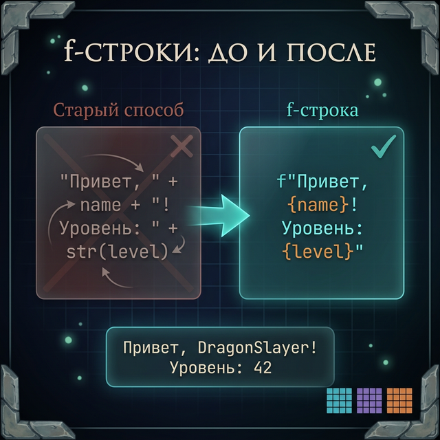
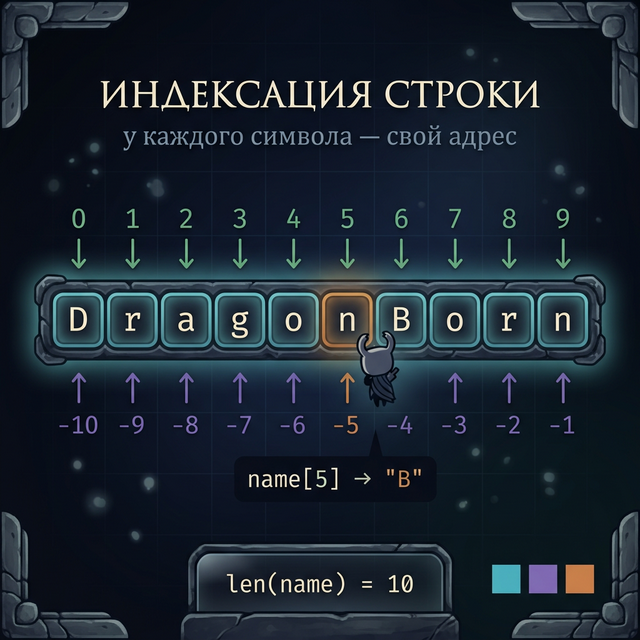
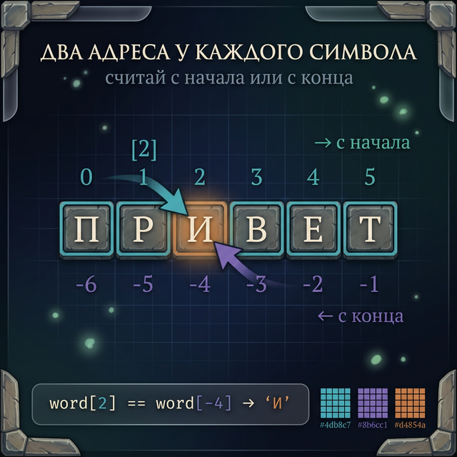
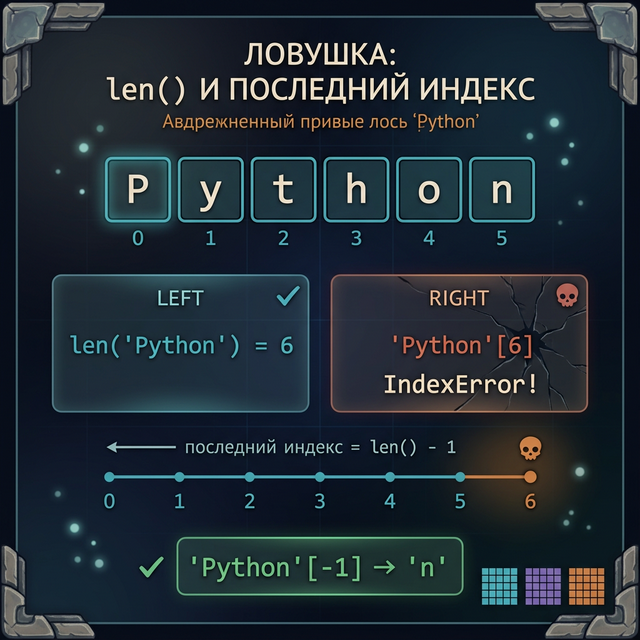
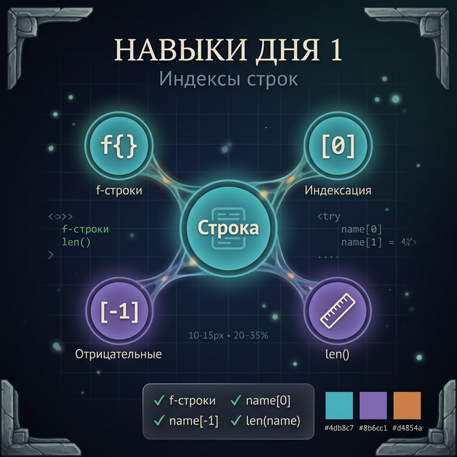

# Day 1: Индексы — каждый символ имеет адрес

> **Новые концепции сегодня:** индексация `[0]`, отрицательные индексы `[-1]`, функция `len()`, f-строки (базовые)
>
> **Время:** ~35 минут (теория + практика)

---

## Часть 1. Зачем нужны индексы?

### Аналогия: координаты в Minecraft

Представь мир Minecraft. Каждый блок в нём имеет координаты — числа, по которым ты его находишь. Если друг говорит: «Приди на координаты 100, 64, -200 — я построил дом», ты точно знаешь, куда идти. Координаты — это адрес блока.

Строка в Python работает точно так же. Каждый символ в строке — это «блок», и у каждого блока есть свой номер. Этот номер называется **индекс**.

Возьмём слово `"Привет!"` и разберём его по символам:

```
Строка:   П  р  и  в  е  т  !
Индексы:  0  1  2  3  4  5  6
```

Семь символов — семь индексов. Обрати внимание: нумерация начинается **с нуля**, а не с единицы. Первый символ `П` имеет индекс `0`, второй `р` — индекс `1`, и так далее.

### Зачем это нужно на практике?

Индексы — это не абстрактная теория. Вот реальные ситуации, где они нужны:

1. **Игровой чат**: игрок отправляет сообщение, и тебе нужно узнать первый символ — это команда `/` или обычный текст? Без индексов ты не сможешь это проверить.
2. **Планировщик задач**: нужно показать аватарку пользователя — первую букву его имени.
3. **Валидация данных**: проверить, что никнейм не начинается с цифры.
4. **Разбор файлов**: определить расширение файла по последним символам имени.

Все эти задачи решаются одним приёмом — доступом к символу по индексу.

---

## Часть 2. f-строки: удобный вывод

Прежде чем углубляться в индексы, познакомимся с одним приёмом, который мы будем использовать весь курс — **f-строки**. Это способ вставлять переменные прямо внутрь текста. Без этого приёма нам будет неудобно показывать результаты работы кода.

### Старый способ: склейка через `+`

Раньше ты, возможно, писал так:

```python
name = "Steve"
print("Привет, " + name + "!")    # Привет, Steve!
```

Это работает, но неудобно — много кавычек, плюсов, легко забыть пробел или восклицательный знак. А если нужно вставить несколько переменных — код превращается в кашу.

### Новый способ: f-строки

С f-строками всё проще. Поставь букву `f` перед кавычками, а переменные оберни в фигурные скобки `{}`:

```python
name = "Steve"
print(f"Привет, {name}!")    # Привет, Steve!
```

Python увидит букву `f`, найдёт `{name}`, подставит значение переменной `name` — и выведет `"Привет, Steve!"`. Всё в одной строке, без плюсов.

### Несколько переменных сразу

Можно вставлять сколько угодно переменных:

```python
player = "Alex"
level = 15
server = "EU-West"
print(f"Игрок {player}, уровень {level}, сервер {server}")
```

**Вывод:**
```
Игрок Alex, уровень 15, сервер EU-West
```

### Выражения внутри `{}`

Внутри `{}` можно писать не только переменные, но и **вычисления** — любые выражения Python:

```python
hp = 85
max_hp = 100
print(f"HP: {hp}/{max_hp}")          # HP: 85/100
print(f"Осталось: {max_hp - hp}")    # Осталось: 15
```

Python сначала вычисляет `max_hp - hp` (получает `15`), а потом вставляет результат в строку.

### Частая ошибка: забыл букву `f`

Главное — не забудь букву `f` перед кавычками! Без неё Python не видит фигурные скобки как «вставку» и выводит их буквально:

```python
name = "Steve"
print("Привет, {name}!")     # Привет, {name}!  ← НЕ работает!
print(f"Привет, {name}!")    # Привет, Steve!    ← Работает!
```

Если видишь в выводе `{name}` вместо значения — проверь, есть ли буква `f`.

В Day 5 мы изучим продвинутые возможности f-строк (выравнивание, форматирование чисел), а пока нам достаточно базовой вставки переменных.



---

## Часть 3. Индексация: достаём символ по номеру

### Как работает `[0]`

Чтобы достать символ из строки, напиши имя переменной, а в квадратных скобках — номер символа (индекс):

```python
строка[индекс]
```

Давай попробуем:

```python
nickname = "Dragonborn"
print(nickname[0])   # D — первый символ
print(nickname[1])   # r — второй символ
print(nickname[5])   # n — шестой символ
```

Запусти этот код у себя. Видишь? `nickname[0]` — это `D`, потому что нумерация начинается с нуля.

Разберём строку `"Dragonborn"` по индексам:

```
Строка:   D  r  a  g  o  n  b  o  r  n
Индексы:  0  1  2  3  4  5  6  7  8  9
```

10 символов — индексы от 0 до 9. Чтобы получить любой символ, просто укажи его номер в квадратных скобках.



### Почему с нуля, а не с единицы?

Представь, что ты стоишь у начала лестницы. Ты ещё не поднялся — ты на **нулевой** ступеньке. Поднялся на одну — первая. В программировании так же: индекс показывает, **на сколько шагов ты отошёл от начала**.

Это не причуда Python — почти все языки программирования считают с нуля: C, Java, JavaScript, Go. Minecraft тоже: высота `y=0` — это самый нижний уровень мира (bedrock), а не первый.

> **Запомни**: первый символ → индекс `0`, второй → `1`, третий → `2` и так далее. Поначалу непривычно, но через пару дней станет автоматическим.

### Пошаговый разбор: что происходит при `nickname[3]`?

```python
nickname = "Dragonborn"
print(nickname[3])
```

1. Python смотрит на переменную `nickname` — это строка `"Dragonborn"`
2. Видит `[3]` — значит, нужен символ с индексом 3
3. Отсчитывает: 0 → `D`, 1 → `r`, 2 → `a`, 3 → `g`
4. Возвращает `"g"`
5. `print()` выводит `g` на экран

Всё просто: квадратные скобки + число = конкретный символ.

### Пример: проверяем команду в игровом чате

В чате RPG-игры игрок может написать обычное сообщение или команду. Команды всегда начинаются с `/`. Как отличить одно от другого? Проверить первый символ!

```python
message = "/attack skeleton"

if message[0] == "/":
    print("Это команда!")
else:
    print("Это обычное сообщение")
```

**Вывод:**
```
Это команда!
```

Разберём, что произошло:
1. `message` содержит `"/attack skeleton"`
2. `message[0]` — это `"/"` (первый символ)
3. Мы сравниваем: `"/" == "/"` → `True`
4. Python выполняет блок `if` и печатает `"Это команда!"`

Одна строка — `message[0]` — и мы уже знаем, что это команда. Попробуй заменить `"/attack skeleton"` на `"Привет всем!"` и запусти снова — теперь сработает `else`.

### Пример: первая буква имени в планировщике

Ты делаешь планировщик задач и хочешь показать аватарку пользователя — первую букву его имени (как в Gmail или Telegram, когда нет фото):

```python
username = "Мурад"
avatar = username[0]
print(f"[{avatar}] Задача: купить молоко")
```

**Вывод:**
```
[М] Задача: купить молоко
```

Здесь `username[0]` достаёт первый символ `"М"`, а f-строка вставляет его в квадратные скобки.

### Пример: определяем тип оружия в инвентаре

В игре оружие может быть обычным или магическим. Магическое начинается с `+`:

```python
weapon1 = "+5 Fire Sword"
weapon2 = "Iron Shield"

print(f"Оружие 1: первый символ '{weapon1[0]}' — {'магическое!' if weapon1[0] == '+' else 'обычное'}")
print(f"Оружие 2: первый символ '{weapon2[0]}' — {'магическое!' if weapon2[0] == '+' else 'обычное'}")
```

**Вывод:**
```
Оружие 1: первый символ '+' — магическое!
Оружие 2: первый символ 'I' — обычное
```

### Попробуй сам (мини-эксперимент)

Открой Python и попробуй:

```python
game = "Minecraft"
print(game[0])    # Какой символ?
print(game[4])    # А этот?
print(game[8])    # И этот?
```

Прежде чем запустить — попробуй угадать результат, сверяясь со схемой:

```
M  i  n  e  c  r  a  f  t
0  1  2  3  4  5  6  7  8
```

<quiz>
Q: Какой индекс у первого символа строки в Python?
A: 1
A: 0
A: -1
C: 0
E: В Python нумерация всегда начинается с нуля.

Q: Что выведет `"Minecraft"[0]`?
A: M
A: i
A: Ошибку
C: M
E: Индекс 0 — это первый символ строки.

Q: Что делает f-строка `f"HP: {hp}"`?
A: Выводит текст «HP: {hp}» буквально
A: Вставляет значение переменной hp в строку
A: Создаёт новую переменную hp
C: Вставляет значение переменной hp в строку
E: Буква f перед кавычками и фигурные скобки {} позволяют вставлять переменные в текст.
</quiz>

---

## Часть 4. Отрицательные индексы: считаем с конца

### Аналогия: Dark Souls — последний костёр

В Dark Souls ты часто хочешь вернуться к **последнему** костру — не первому, а именно последнему, самому свежему. Тебе не важно, сколько костров было до него — тебе нужен именно **последний**.

В Python для этого есть **отрицательные индексы**. Вместо того чтобы считать с начала строки, ты считаешь **с конца**:

```python
boss_name = "Nameless King"
print(boss_name[-1])   # g — последний символ
print(boss_name[-2])   # n — предпоследний символ
print(boss_name[-3])   # i — третий с конца
```

### Как это устроено: два адреса у каждого символа

Вот полная карта индексов для строки `"Nameless King"`:

```
Строка:   N  a  m  e  l  e  s  s     K  i  n  g
Индексы:  0  1  2  3  4  5  6  7  8  9  10 11 12
Отриц.:  -13-12-11-10 -9 -8 -7 -6 -5 -4 -3 -2 -1
```

У каждого символа **два адреса**:
- **Положительный** (слева направо): 0, 1, 2, 3...
- **Отрицательный** (справа налево): -1, -2, -3...

Ключевые значения:
- `-1` — это **всегда** последний символ (в данном случае `g`)
- `-2` — предпоследний (`n`)
- Самый первый символ можно достать и как `[0]`, и как `[-13]`



### Зачем это удобно?

Представь: у тебя есть строка, и ты не знаешь её длину. Тебе нужен последний символ. Без отрицательных индексов пришлось бы писать:

```python
word = "Minecraft"
last = word[len(word) - 1]    # Длинно и неудобно
```

С отрицательными индексами — одно движение:

```python
word = "Minecraft"
last = word[-1]               # Просто и понятно!
```

Обе записи дают `"t"`, но `-1` — короче и читается лучше.

### Пример: проверяем расширение файла

Допустим, у тебя есть название файла сохранения в игре, и ты хочешь проверить его расширение:

```python
save_file = "world_save.dat"
last_char = save_file[-1]
print(f"Последний символ: {last_char}")
```

**Вывод:**
```
Последний символ: t
```

Можно проверить последние 4 символа — это `.dat`:

```python
save_file = "world_save.dat"
print(save_file[-4])   # .
print(save_file[-3])   # d
print(save_file[-2])   # a
print(save_file[-1])   # t
```

Если последние 4 символа — `.dat`, значит это файл данных. Если `.png` — картинка. И так далее.

### Пример: Монополия — последняя клетка

Представь, что ты делаешь Монополию в консоли. Поле — это строка из символов, и тебе нужно узнать, что на последней клетке:

```python
board = "СБТНСБТНСБТНСБТНСБТНСБТНСБТНСБТНСБТНСБ"
# С = Старт, Б = Бизнес, Т = Тюрьма, Н = Налог

print(f"Первая клетка: {board[0]}")     # С
print(f"Последняя клетка: {board[-1]}")  # Б
print(f"Предпоследняя: {board[-2]}")     # С
```

### Пример: последний ход игрока

В текстовой RPG ты записываешь действия игрока как строку. Чтобы узнать последнее действие:

```python
actions = "ААЗЛАА"
# А = атака, З = защита, Л = лечение

print(f"Последнее действие: {actions[-1]}")  # А (атака)
print(f"Предпоследнее: {actions[-2]}")       # А (атака)
print(f"Третье с конца: {actions[-3]}")      # Л (лечение)
```

---

## Часть 5. len() — узнаём длину строки

### Аналогия: сколько блоков в постройке?

В Minecraft, когда ты строишь стену, тебе важно знать её длину — сколько блоков ты поставил. Функция `len()` делает то же самое для строки: считает **количество символов**.

```python
weapon_name = "Diamond Sword"
length = len(weapon_name)
print(f"Длина названия: {length} символов")
```

**Вывод:**
```
Длина названия: 14 символов
```

`len` — это сокращение от английского слова **length** (длина). Ты передаёшь строку в скобках, а `len()` возвращает число — количество символов в ней.

### Ещё несколько примеров

```python
print(len("Hi"))           # 2
print(len("Dark Souls"))   # 10 (пробел тоже считается!)
print(len(""))             # 0 — пустая строка
print(len("A"))            # 1
```

Обрати внимание: `len("Dark Souls")` — это `10`, а не `9`. Потому что пробел между словами — это тоже символ. Он невидимый, но занимает место, как невидимый блок барьера в Minecraft.

### Важная ловушка: len() и индексы (ошибка на миллион!)

Строка `"Diamond Sword"` содержит 14 символов. Кажется логичным, что последний индекс — `14`? **Нет!** Последний индекс — `13`. Потому что нумерация начинается с нуля!

```python
weapon_name = "Diamond Sword"
print(len(weapon_name))     # 14
print(weapon_name[13])      # d (последний символ)
# print(weapon_name[14])    # ОШИБКА! IndexError!
```

Разберём на схеме:

```
Строка:   D  i  a  m  o  n  d     S  w  o  r  d
Индексы:  0  1  2  3  4  5  6  7  8  9  10 11 12 13
                                                 ↑
                                           последний = 13
Длина = 14 символов
```

**Правило**: последний символ всегда имеет индекс `len(строка) - 1`. Или, что проще, используй `строка[-1]`.

Это одна из самых частых ошибок у начинающих — она называется **off-by-one error** (ошибка на единицу). Запомни схему:

```
Длина = 14
Последний индекс = 13 (= длина - 1)
Или просто: [-1]
```



### Пример: проверка длины никнейма

В MMORPG часто есть ограничение на длину никнейма — не больше 16 символов:

```python
nickname = "xXx_DragonSlayer_xXx"
max_length = 16

if len(nickname) > max_length:
    print(f"Никнейм слишком длинный! {len(nickname)} символов, максимум {max_length}")
else:
    print(f"Никнейм принят: {nickname}")
```

**Вывод:**
```
Никнейм слишком длинный! 20 символов, максимум 16
```

### Пример: планировщик — обрезаем длинный заголовок

В планировщике задач нужно показывать список — и если заголовок слишком длинный, он сломает таблицу:

```python
task = "Подготовить презентацию по математике за третью четверть"

if len(task) > 30:
    print(f"Задача: {task[0]}...{task[-1]} ({len(task)} симв.)")
else:
    print(f"Задача: {task}")
```

**Вывод:**
```
Задача: П...ь (55 симв.)
```

*(Позже, когда мы изучим срезы, ты сможешь обрезать строку красиво — `task[:30] + "..."`. Это в Day 2!)*

### Пример: пустая строка

```python
empty = ""
print(len(empty))   # 0
print(len(" "))      # 1 — пробел тоже символ!
print(len("  "))     # 2 — два пробела = два символа
```

Пробел — это полноценный символ. Он невидимый, но он есть. Как невидимый блок в Minecraft — ты его не видишь, но он занимает место.

<quiz>
Q: Что выведет `"Hello"[-1]`?
A: H
A: o
A: Ошибку
C: o
E: Отрицательный индекс -1 — это всегда последний символ строки.

Q: Сколько символов в строке `"Dark Souls"`? (используй `len()`)
A: 9
A: 10
A: 11
C: 10
E: Пробел тоже считается символом, поэтому 10, а не 9.

Q: Какой последний допустимый индекс у строки длиной 5?
A: 5
A: 4
A: -1
C: 4
E: Нумерация с нуля, поэтому для длины 5 последний индекс = 4 (или -1).
</quiz>

---

## Часть 6. Подводные камни

### Камень 1: IndexError — выход за границы

Если попросить символ по индексу, которого не существует, Python **не угадает** и не вернёт пустоту. Он выдаст ошибку:

```python
name = "Link"
print(name[10])   # IndexError: string index out of range
```

Строка `"Link"` содержит 4 символа (индексы 0, 1, 2, 3). Индекса `10` не существует — Python скажет: «Ты вышел за пределы» (`string index out of range`).

Вот как это выглядит в терминале:

```
Traceback (most recent call last):
  File "game.py", line 2, in <module>
    print(name[10])
IndexError: string index out of range
```

Не пугайся таких сообщений — Python просто говорит тебе, **что пошло не так** и **в какой строке кода**. Это помогает найти ошибку.

**Как защититься**: проверяй длину перед доступом по индексу.

```python
name = "Link"
index = 10

if index < len(name):
    print(name[index])
else:
    print(f"Индекс {index} не существует, в строке всего {len(name)} символов")
```

**Вывод:**
```
Индекс 10 не существует, в строке всего 4 символов
```

### Камень 2: строки нельзя менять

В Python строки — **неизменяемые** (immutable). Ты можешь **прочитать** символ по индексу, но не можешь его **заменить**:

```python
name = "Zeldo"
# Хотим исправить на "Zelda"
# name[4] = "a"   # TypeError: 'str' object does not support item assignment
```

Если раскомментировать строку `name[4] = "a"`, Python выдаст ошибку `TypeError`. Он говорит: «Строки так не работают — ты не можешь поменять один символ внутри».

Это как таблички на стенах в Dark Souls — ты можешь их прочитать, но не можешь переписать. Если нужно «изменить» строку, ты создаёшь **новую** строку (научимся это делать в Day 3 с методом `replace()`).

### Камень 3: пробел — это символ

Многие новички думают, что пробел — это «ничего». Но для Python пробел — это полноценный символ с индексом, как любая буква:

```python
message = "Hello World"
print(message[5])   # " " — это пробел!
print(len("A B"))   # 3, не 2
```

Разберём `"Hello World"`:

```
Строка:   H  e  l  l  o     W  o  r  l  d
Индексы:  0  1  2  3  4  5  6  7  8  9  10
                        ↑
                   пробел! Индекс 5
```

Пробел стоит на позиции 5 и занимает место, как любой другой символ. `len("A B")` = 3, потому что строка содержит три символа: `A`, пробел, `B`.

> **Совет**: если когда-нибудь получишь неожиданный результат при работе со строками — проверь, не забыл ли ты про пробелы. Это одна из самых частых причин багов.

---

## Часть 7. Практика — теперь ты!

### Задание 1: Первый и последний (разминка)

Напиши программу, которая:
1. Просит пользователя ввести любое слово
2. Выводит первый символ
3. Выводит последний символ
4. Выводит длину слова

**Ожидаемый результат:**
```
Введи слово: Minecraft
Первый символ: M
Последний символ: t
Длина: 9 символов
```

<details>
<summary>Подсказка</summary>

Используй `input()` для ввода, `[0]` для первого символа, `[-1]` для последнего, `len()` для длины.

</details>

<details>
<summary>Решение</summary>

```python
word = input("Введи слово: ")
print(f"Первый символ: {word[0]}")
print(f"Последний символ: {word[-1]}")
print(f"Длина: {len(word)} символов")
```

</details>

---

### Задание 2: Определитель команд (игровой чат)

В чате RPG-игры есть три типа сообщений:
- Команда — начинается с `/`
- Шёпот — начинается с `@`
- Обычное сообщение — всё остальное

Напиши программу, которая определяет тип сообщения.

**Ожидаемый результат:**
```
Введи сообщение: /heal warrior
Тип: КОМАНДА

Введи сообщение: @mage Осторожно, босс рядом!
Тип: ШЁПОТ

Введи сообщение: Всем привет!
Тип: ОБЫЧНОЕ СООБЩЕНИЕ
```

<details>
<summary>Подсказка</summary>

Проверь `message[0]` — если `/`, то команда; если `@`, то шёпот; иначе — обычное.

</details>

<details>
<summary>Решение</summary>

```python
message = input("Введи сообщение: ")

if message[0] == "/":
    print("Тип: КОМАНДА")
elif message[0] == "@":
    print("Тип: ШЁПОТ")
else:
    print("Тип: ОБЫЧНОЕ СООБЩЕНИЕ")
```

</details>

---

### Задание 3: Валидатор никнейма (MMORPG)

В MMORPG никнейм должен соответствовать правилам:
- Длина от 3 до 16 символов
- Не начинается с цифры (первый символ не должен быть `0`-`9`)

Напиши программу, которая проверяет никнейм.

**Ожидаемый результат:**
```
Введи никнейм: Pro
Никнейм "Pro" принят!

Введи никнейм: AB
Ошибка: слишком короткий (2 символа, минимум 3)

Введи никнейм: 123Player
Ошибка: никнейм не может начинаться с цифры
```

<details>
<summary>Подсказка 1</summary>

Оператор `in` проверяет, есть ли символ внутри строки: `"a" in "abc"` → `True`. Используй его: `nickname[0] in "0123456789"` — вернёт `True`, если первый символ — цифра.

</details>

<details>
<summary>Подсказка 2</summary>

Проверяй условия по порядку: сначала длину, потом первый символ.

</details>

<details>
<summary>Решение</summary>

```python
nickname = input("Введи никнейм: ")

if len(nickname) < 3:
    print(f"Ошибка: слишком короткий ({len(nickname)} символа, минимум 3)")
elif len(nickname) > 16:
    print(f"Ошибка: слишком длинный ({len(nickname)} символов, максимум 16)")
elif nickname[0] in "0123456789":
    print("Ошибка: никнейм не может начинаться с цифры")
else:
    print(f'Никнейм "{nickname}" принят!')
```

</details>

---

### Задание 4: Карточка персонажа (мини-проект)

Создай программу, которая принимает имя персонажа и его класс, а потом выводит красивую карточку:

**Ожидаемый результат:**
```
Имя персонажа: Артас
Класс: Рыцарь Смерти

=== КАРТОЧКА ПЕРСОНАЖА ===
Имя: Артас
Класс: Рыцарь Смерти
Инициалы: А.Р.
Имя (длина): 5 букв
Класс (длина): 13 букв
Первый символ имени: А
Последний символ класса: и
=============================
```

<details>
<summary>Подсказка</summary>

«Инициалы» — это первая буква имени + точка + первая буква класса + точка. Используй `name[0]` и `char_class[0]`.

</details>

<details>
<summary>Решение</summary>

```python
name = input("Имя персонажа: ")
char_class = input("Класс: ")

print()
print("=== КАРТОЧКА ПЕРСОНАЖА ===")
print(f"Имя: {name}")
print(f"Класс: {char_class}")
print(f"Инициалы: {name[0]}.{char_class[0]}.")
print(f"Имя (длина): {len(name)} букв")
print(f"Класс (длина): {len(char_class)} букв")
print(f"Первый символ имени: {name[0]}")
print(f"Последний символ класса: {char_class[-1]}")
print("=============================")
```

</details>

---

## Часть 8. Итоги дня

Сегодня ты получил четыре навыка:

| Навык | Синтаксис | Что делает |
|:------|:----------|:-----------|
| Индексация | `строка[0]` | Достаёт символ по номеру (с нуля!) |
| Отрицательные индексы | `строка[-1]` | Достаёт символ с конца |
| Длина строки | `len(строка)` | Возвращает количество символов |
| f-строки | `f"текст {переменная}"` | Вставляет переменные в строку |

**Главные правила:**
- Нумерация начинается с 0, не с 1
- Последний индекс = `len(строка) - 1`, или просто `[-1]`
- Пробел — это тоже символ
- Если выйдешь за границы — `IndexError`
- Строку нельзя изменить по индексу (она неизменяемая)
- `in` проверяет, содержится ли символ в строке: `"a" in "abc"` → `True`



**Завтра:** научимся вырезать кусочки строки — **срезы**. Сможешь взять любой фрагмент: первые 5 символов, последние 3, каждый второй, или даже развернуть строку задом наперёд.
