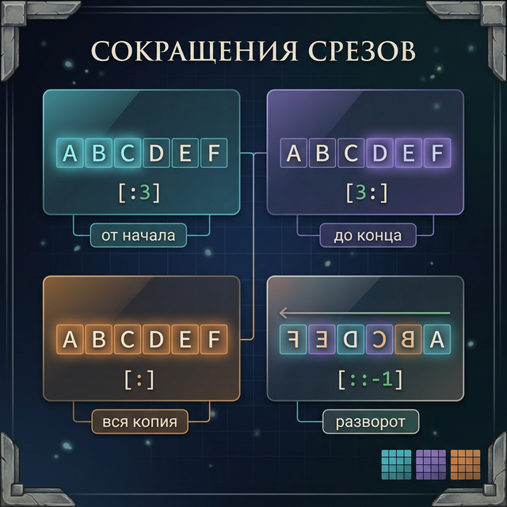
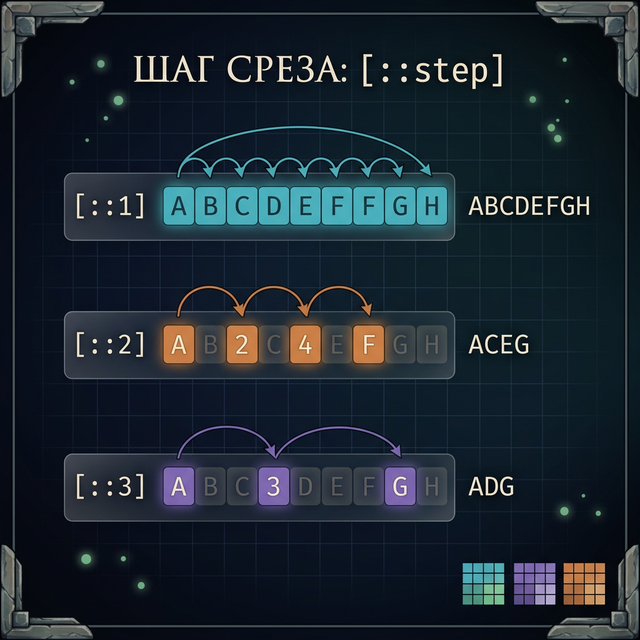
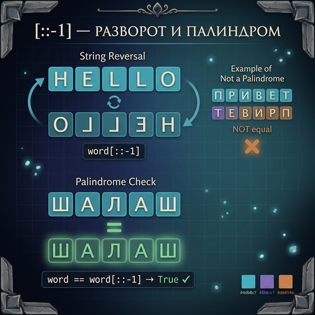
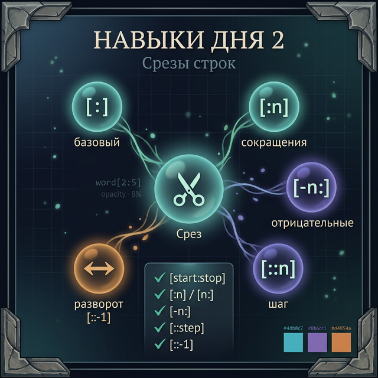

# Day 2: Срезы — вырезаем кусок строки

> **Новые концепции сегодня:** `[start:stop]`, `[start:stop:step]`, `[::-1]` (разворот)
>
> **Время:** ~35 минут (теория + практика)

---

## Часть 1. Зачем нужны срезы?

### Аналогия: вырезаем участок карты Minecraft

Вчера ты научился доставать **один** символ по индексу — как смотреть один блок на карте. Но что если тебе нужен целый участок? Допустим, ты хочешь вырезать фрагмент карты от координаты 10 до координаты 20 — не один блок, а целый кусок.

Срезы (slices) — это способ вырезать **часть строки**. Не один символ, а несколько подряд.

Зачем это нужно на практике? Вот три реальные задачи:

1. **Игровой чат**: игрок написал `/attack skeleton` — тебе нужно отделить команду `/attack` от цели `skeleton`
2. **MMORPG**: из строки `"[Гильдия] Рыцарь_Тьмы: Кто в рейд?"` нужно вытащить тег `[Гильдия]`
3. **Планировщик**: показать только первые 20 символов длинного заголовка задачи

Вчера ты мог достать только по одному символу. Сегодня — целые фрагменты.

---

## Часть 2. Базовый срез: `[start:stop]`

### Как это работает

Срез записывается в квадратных скобках с двоеточием: `строка[start:stop]`.

- `start` — с какого индекса начинаем (включительно)
- `stop` — на каком заканчиваем (**не включая** этот индекс!)

Представь это как ножницы: ты говоришь Python «вырежи мне кусок строки, начиная с позиции `start` и заканчивая **прямо перед** позицией `stop`».

```python
weapon = "Diamond Sword"
print(weapon[0:7])    # Diamond
print(weapon[8:13])   # Sword
```

#### Что происходит, когда Python видит `weapon[0:7]`? Пошагово:

1. Python смотрит на строку `"Diamond Sword"` и нумерует каждый символ (начиная с 0)
2. Видит `start=0` — значит, начинаем с самого первого символа (`D`)
3. Видит `stop=7` — значит, заканчиваем **перед** символом с индексом 7 (это пробел ` `)
4. Собирает все символы с индексами 0, 1, 2, 3, 4, 5, 6 — получается `"Diamond"`
5. Возвращает новую строку `"Diamond"`

Давай разберём на схеме:

```
Строка:  D  i  a  m  o  n  d     S  w  o  r  d
Индексы: 0  1  2  3  4  5  6  7  8  9  10 11 12
         |                    |
     start=0              stop=7
         └────── [0:7] ──────┘  → "Diamond"

Берём:   ✓  ✓  ✓  ✓  ✓  ✓  ✓  ✗
```

Символ с индексом 7 (пробел) **не попадает** в результат — это главное правило срезов.

![Анатомия среза [start:stop]](day_2/day_2_slice_anatomy.png)

А вот как выглядит второй срез — `weapon[8:13]`:

```
Строка:  D  i  a  m  o  n  d     S  w  o  r  d
Индексы: 0  1  2  3  4  5  6  7  8  9  10 11 12
                                  |              |
                              start=8         stop=13
                                  └── [8:13] ───┘  → "Sword"

Берём:   ✗  ✗  ✗  ✗  ✗  ✗  ✗  ✗  ✓  ✓  ✓  ✓  ✓
```

Обрати внимание: `stop=13`, но в строке только 13 символов (индексы 0–12). Python не ругается — он просто берёт все символы до конца. Об этом подробнее будет в разделе про подводные камни.

#### Попробуй сам

Попробуй в консоли:
```python
game = "Dark Souls III"
print(game[0:4])    # Что получится?
print(game[5:10])   # А тут?
print(game[11:14])  # И тут?
```

Перед запуском попробуй угадать результат! Нарисуй строку на бумаге и пронумеруй символы — это реально помогает.

### Почему `stop` не включается?

Это правило кажется странным, но оно удобное. У него есть две суперсилы:

**Суперсила 1:** длина среза всегда равна `stop - start`:

```python
word = "Minecraft"
chunk = word[0:5]       # "Minec" — 5 символов (5 - 0 = 5)
print(len(chunk))       # 5
```

Это как линейка: расстояние от 0 до 5 — это 5 сантиметров. Не 6, а именно 5. Удобно считать в голове!

**Суперсила 2:** два среза без «дырки» стыкуются идеально:

```python
word = "Minecraft"
first_half = word[0:5]    # "Minec"
second_half = word[5:9]   # "raft"
print(first_half + second_half)  # "Minecraft" — ничего не потерялось!
```

```
M  i  n  e  c  r  a  f  t
0  1  2  3  4  5  6  7  8
└──── [0:5] ────┘
                └──── [5:9] ────┘
            Стык ↑ — ни дырки, ни дубля!
```

Видишь? Первый срез заканчивается на 5, второй начинается с 5. Символ с индексом 5 попадает **только** во второй срез. Если бы `stop` включался, символ `c` (индекс 4) и `r` (индекс 5) перепутались бы.

Это как нарезать торт: если ты режешь от 0 до 5, а потом от 5 до 9, весь торт покрыт — ни кусочка не пропало и ничего не задвоилось.

### Пример: вырезаем тег из чата MMORPG

В чате MMORPG сообщения выглядят так: `[Гильдия] Рыцарь: текст`. Вырежем тег:

```python
message = "[Воины] Артас: Всем привет!"
tag = message[0:7]       # "[Воины]"
print(f"Тег: {tag}")
```

**Вывод:**
```
Тег: [Воины]
```

Разбор по шагам:

```
[  В  о  и  н  ы  ]     А  р  т  а  с  ...
0  1  2  3  4  5  6  7  8  9  ...
└────── [0:7] ──────┘
```

Python берёт символы с индексами 0, 1, 2, 3, 4, 5, 6 — получается `"[Воины]"`. Символ с индексом 7 (пробел) не включается.

### Пример: обрезаем заголовок в планировщике

Представь, ты делаешь приложение-планировщик для школы. Названия задач могут быть длинными, и в списке нужно показать только первые 25 символов, чтобы всё помещалось на экране:

```python
task = "Подготовить презентацию по биологии за третью четверть"
short = task[0:25]
print(f"Задача: {short}...")
```

**Вывод:**
```
Задача: Подготовить презентацию ...
```

Это реальный приём! Так работают мессенджеры, когда показывают превью длинного сообщения — берут первые N символов и добавляют `...`.

### Пример: вырезаем урон в Dark Souls

Допустим, игра хранит лог боя как строку, и тебе нужно вытащить числа:

```python
battle_log = "DMG:0450 HP:1200"
damage = battle_log[4:8]     # "0450"
health = battle_log[12:16]   # "1200"
print(f"Урон: {damage}, Здоровье: {health}")
```

```
D  M  G  :  0  4  5  0     H  P  :  1  2  0  0
0  1  2  3  4  5  6  7  8   9  10 11 12 13 14 15
            └── [4:8] ──┘            └── [12:16] ┘
```

---

## Часть 3. Сокращения: пропускаем start или stop

Ты можешь заметить, что писать `word[0:5]` немного избыточно — зачем писать `0`, если и так понятно, что начинаем с начала? Создатели Python подумали так же и сделали удобные сокращения.

### Пропускаем `start` — срез от начала

Если не указать `start`, Python начинает с самого начала (с индекса 0):

```python
boss = "Nameless King"
print(boss[:8])     # "Nameless" — то же, что boss[0:8]
```

**Почему это удобно?** Когда тебе нужны «первые N символов», не нужно писать `0` — просто `[:N]`. Это читается почти как на английском: «возьми до восьмого».

```
N  a  m  e  l  e  s  s     K  i  n  g
0  1  2  3  4  5  6  7  8  9  10 11 12
└────────── [:8] ──────────┘
   (от начала до stop=8)
```

Ещё примеры:

```python
game = "The Elder Scrolls V: Skyrim"
print(game[:3])     # "The"  — первые 3 символа
print(game[:15])    # "The Elder Scrol" — первые 15 символов
```

### Пропускаем `stop` — срез до конца

Если не указать `stop`, Python идёт до самого конца строки:

```python
boss = "Nameless King"
print(boss[9:])     # "King" — от индекса 9 до конца
```

**Почему это удобно?** Тебе не нужно знать длину строки! Просто говоришь: «начни с 9-го и возьми всё до конца».

```
N  a  m  e  l  e  s  s     K  i  n  g
0  1  2  3  4  5  6  7  8  9  10 11 12
                              └── [9:] ──────┘
                              (от start=9 до конца)
```

Ещё примеры:

```python
spell = "fireball_level_5"
print(spell[9:])    # "level_5" — всё после "fireball_"
```

### Пропускаем оба — копия строки

А что будет, если не указать ни `start`, ни `stop`? Python возьмёт от начала до конца — то есть всю строку целиком. Получается полная копия:

```python
boss = "Nameless King"
copy = boss[:]      # "Nameless King" — полная копия
print(copy)
```

Зачем это нужно? Пока что это может казаться бесполезным, но в будущем (когда ты будешь работать со списками) это пригодится для создания независимой копии данных.

### Шпаргалка по сокращениям

```
Полная запись         Сокращение       Что значит
─────────────         ──────────       ──────────
word[0:5]         →   word[:5]         «Первые 5 символов»
word[5:len(word)] →   word[5:]         «Всё начиная с 5-го»
word[0:len(word)] →   word[:]          «Вся строка целиком»
```



### Пример: отделяем команду от аргумента в RPG-чате

Представь, ты делаешь текстовую RPG. Игрок вводит команду вроде `/heal warrior`. Тебе нужно разделить её на две части — саму команду и цель:

```python
message = "/heal warrior"

# Команда — от начала до пробела (допустим, мы знаем что пробел на позиции 5)
command = message[:5]    # "/heal"
target = message[6:]     # "warrior"

print(f"Команда: {command}")
print(f"Цель: {target}")
```

**Вывод:**
```
Команда: /heal
Цель: warrior
```

Разбор:
```
/  h  e  a  l     w  a  r  r  i  o  r
0  1  2  3  4  5  6  7  8  9  10 11 12
└──── [:5] ─────┘     └──── [6:] ─────┘
    "/heal"     пробел    "warrior"
```

*(Позже, в Day 4, мы узнаем про `split()` — тогда не нужно будет считать позицию пробела руками.)*

### Пример: вырезаем расширение файла сохранения

```python
filename = "world_save.dat"
name = filename[:10]     # "world_save"
extension = filename[10:]  # ".dat"
print(f"Имя: {name}, расширение: {extension}")
```

Опять работает принцип стыковки: `[:10]` + `[10:]` = вся строка!

### Пример: превью сообщений в Minecraft-чате

Представь, ты делаешь мод для Minecraft, где в боковой панели показываются сокращённые сообщения чата:

```python
msg1 = "Кто хочет пойти копать алмазы в пещере?"
msg2 = "Привет"

preview1 = msg1[:15]   # "Кто хочет пойти"
preview2 = msg2[:15]   # "Привет" — строка короче 15, и это ОК!

print(f"[Чат] {preview1}...")
print(f"[Чат] {preview2}")
```

Обрати внимание: `msg2[:15]` не вызовет ошибку, хотя в `"Привет"` всего 6 символов. Python просто вернёт всю строку.

#### Попробуй сам

```python
inventory = "sword:shield:potion:bow"
# Попробуй вырезать первый предмет (до 5-го символа)
# Попробуй вырезать всё, что после первого двоеточия (с 6-го символа)
print(inventory[:5])
print(inventory[6:])
```

<quiz>
Q: Что выведет `"Minecraft"[0:4]`?
A: Mine
A: Minec
A: Min
C: Mine
E: Срез [0:4] берёт символы с индексами 0, 1, 2, 3 — итого 4 символа.

Q: Что означает `boss[:5]`?
A: Символы с 5-го до конца
A: Первые 5 символов (с начала до индекса 4)
A: 5-й символ
C: Первые 5 символов (с начала до индекса 4)
E: Если start не указан, Python начинает с самого начала (индекс 0).

Q: Включается ли stop в результат среза `[start:stop]`?
A: Да, включается
A: Нет, не включается
A: Зависит от строки
C: Нет, не включается
E: В Python stop никогда не включается в результат. Это правило действует всегда.
</quiz>

---

## Часть 4. Отрицательные индексы в срезах

Вчера ты узнал, что отрицательные индексы считают символы с конца строки: `-1` — последний, `-2` — предпоследний и так далее. Хорошая новость: в срезах они работают точно так же!

**Зачем это нужно?** Часто тебе нужны «последние N символов» или «всё, кроме последних N». С отрицательными индексами тебе не нужно знать длину строки — ты просто говоришь «отсчитай с конца».

Давай разберём на знакомом примере:

```python
boss = "Abyss Watchers"
```

Вот как выглядят оба направления индексов для этой строки:

```
Символы:           A   b   y   s   s       W   a   t   c   h   e   r   s
Индексы (→):       0   1   2   3   4   5   6   7   8   9  10  11  12  13
Индексы (←):     -14 -13 -12 -11 -10  -9  -8  -7  -6  -5  -4  -3  -2  -1
```

Теперь смотри, как работают срезы:

```python
# Последние 8 символов
print(boss[-8:])      # "Watchers"

# Все, кроме последних 9
print(boss[:-9])      # "Abyss"

# С третьего от конца до конца
print(boss[-3:])      # "ers"
```

#### Разбор `boss[-8:]` пошагово:

1. Python видит `start=-8` — это значит «начни с 8-го символа с конца»
2. 8-й с конца — это `W` (индекс 6, он же -8)
3. `stop` не указан — значит, идём до конца строки
4. Берём: `W`, `a`, `t`, `c`, `h`, `e`, `r`, `s` → `"Watchers"`

```
A   b   y   s   s       W   a   t   c   h   e   r   s
0   1   2   3   4   5   6   7   8   9  10  11  12  13
                       -8  -7  -6  -5  -4  -3  -2  -1
                        └────────── [-8:] ──────────┘
                              "Watchers"
```

#### Разбор `boss[:-9]` пошагово:

1. `start` не указан — начинаем с начала строки
2. Python видит `stop=-9` — это значит «остановись за 9 символов до конца»
3. 9-й с конца — это пробел ` ` (индекс 5, он же -9)
4. Берём всё **до** этой позиции: `A`, `b`, `y`, `s`, `s` → `"Abyss"`

```
A   b   y   s   s       W   a   t   c   h   e   r   s
0   1   2   3   4   5   6   7   8   9  10  11  12  13
                   -9
└──── [:-9] ──────┘
      "Abyss"
```

#### Попробуй сам

```python
game = "Elden Ring"
# Попробуй угадать результат, прежде чем запускать:
print(game[-4:])    # ???
print(game[:-5])    # ???
print(game[-7:-2])  # ???
```

Подсказка: нарисуй строку с двумя рядами индексов (положительные сверху, отрицательные снизу) — и всё станет понятно.

### Пример: убираем расширение файла (универсально)

Вместо того чтобы считать позицию точки руками, используем отрицательный индекс:

```python
save_file = "player_data.json"
name_only = save_file[:-5]     # "player_data" — убрали ".json" (5 символов)
print(name_only)
```

Почему это лучше, чем `save_file[0:11]`? Потому что `[:-5]` работает с **любым** именем файла, если расширение `.json` (5 символов). А `[0:11]` работает только для файла с именем ровно в 11 символов:

```python
# [:-5] работает для ЛЮБОГО имени — нужно знать только длину расширения
file1 = "player_data.json"
file2 = "a.json"
file3 = "super_long_save_file_name.json"

print(file1[:-5])   # "player_data"
print(file2[:-5])   # "a"
print(file3[:-5])   # "super_long_save_file_name"
```

### Пример: последние 3 хода в настольной игре

Представь, ты делаешь Монополию и записываешь ходы как строку символов:

```python
moves = "ННКПННКПН"  # Н=налог, К=карточка, П=покупка
last_three = moves[-3:]
print(f"Последние 3 хода: {last_three}")
```

**Вывод:**
```
Последние 3 хода: КПН
```

### Пример: инвентарь Dark Souls — последний предмет

Допустим, ты хранишь краткие коды предметов в строке, по 2 символа на каждый:

```python
inventory = "SWSHPTEL"  # SW=sword, SH=shield, PT=potion, EL=elixir
last_item = inventory[-2:]   # "EL" — последний предмет
first_item = inventory[:2]   # "SW" — первый предмет
print(f"Первый: {first_item}, Последний: {last_item}")
```

```
S  W  S  H  P  T  E  L
0  1  2  3  4  5  6  7
                  -2 -1
└[:2]┘              └[-2:]┘
"SW"                 "EL"
```

### Комбинация отрицательных start и stop

Можно использовать отрицательные индексы и для `start`, и для `stop` одновременно. Это вырезает «кусок из середины, отсчитывая с конца»:

```python
status = "HP:100 MP:050 LVL:42"
# Вырежем "MP:050" — с 7-го до 13-го символа (или с -13 до -7)
mp_part = status[-13:-7]
print(mp_part)    # "MP:050"
```

```
H  P  :  1  0  0     M  P  :  0  5  0     L  V  L  :  4  2
0  1  2  3  4  5  6   7  8  9 10 11 12  13 14 15 16 17 18 19
                    -13 -12-11-10 -9 -8  -7  -6 -5 -4 -3 -2 -1
                     └──── [-13:-7] ────┘
                           "MP:050"
```

---

## Часть 5. Шаг: `[start:stop:step]`

До сих пор мы вырезали **подряд идущие** символы. Но что если тебе нужен каждый второй символ? Или каждый третий? Для этого существует третий параметр среза — **шаг** (step).

Полный синтаксис среза: `строка[start:stop:step]`

- `start` — откуда начинаем
- `stop` — где заканчиваем (не включая)
- `step` — через сколько символов прыгаем

### Берём каждый N-й символ

По умолчанию шаг = 1 (берём каждый символ подряд). Если указать шаг 2, Python будет «прыгать» через один символ:

```python
alphabet = "ABCDEFGHIJ"
print(alphabet[::2])     # "ACEGI" — каждый второй (шаг 2)
print(alphabet[::3])     # "ADGJ" — каждый третий (шаг 3)
print(alphabet[1::2])    # "BDFHJ" — каждый второй, начиная с индекса 1
```

#### Что происходит, когда Python видит `alphabet[::2]`? Пошагово:

1. `start` не указан — начинаем с начала (индекс 0)
2. `stop` не указан — идём до конца
3. `step=2` — берём символ, потом перепрыгиваем один, берём следующий, перепрыгиваем...
4. Индексы, которые попадают: 0, 2, 4, 6, 8
5. Символы: `A`, `C`, `E`, `G`, `I` → `"ACEGI"`

```
A  B  C  D  E  F  G  H  I  J
0  1  2  3  4  5  6  7  8  9

Шаг 2:
A  .  C  .  E  .  G  .  I  .
↑     ↑     ↑     ↑     ↑
✓  ✗  ✓  ✗  ✓  ✗  ✓  ✗  ✓  ✗   → "ACEGI"
```

А вот что делает `alphabet[1::2]` — то же самое, но стартуем с индекса 1:

```
A  B  C  D  E  F  G  H  I  J
0  1  2  3  4  5  6  7  8  9

Шаг 2, старт с 1:
.  B  .  D  .  F  .  H  .  J
   ↑     ↑     ↑     ↑     ↑
✗  ✓  ✗  ✓  ✗  ✓  ✗  ✓  ✗  ✓   → "BDFHJ"
```

Видишь? С шагом 2 и стартом 0 мы получаем «чётные» позиции, а со стартом 1 — «нечётные». Вместе они покрывают всю строку!



#### Попробуй сам

```python
numbers = "0123456789"
print(numbers[::2])    # Угадай: какие цифры будут?
print(numbers[1::2])   # А эти?
print(numbers[::4])    # Каждый четвёртый?
print(numbers[2:8:3])  # С 2-го по 7-й, каждый третий?
```

Последний пример — самый хитрый. Разбор:
```
0  1  2  3  4  5  6  7  8  9
         ↑        ↑
         2  .  .  5  .  .  (8 — не включается, так как stop=8)
```
Индексы: 2, 5 → символы: `"25"`

### Пример: чётные и нечётные символы

Шаг полезен для «разделения» закодированных данных. Представь, что буквы и разделители чередуются:

```python
code = "H_e_l_l_o"
letters = code[::2]      # "Hello" — каждый второй (только буквы)
separators = code[1::2]  # "____" — каждый второй, начиная с 1 (только подчёркивания)
print(letters)
print(separators)
```

```
H  _  e  _  l  _  l  _  o
0  1  2  3  4  5  6  7  8

[::2]  → H  .  e  .  l  .  l  .  o  → "Hello"
[1::2] → .  _  .  _  .  _  .  _  .  → "____"
```

### Пример: координаты в Minecraft

Допустим, координаты записаны в строке с разделителями, и каждая координата — один символ:

```python
coords = "X3Y7Z2"  # X=3, Y=7, Z=2
labels = coords[::2]    # "XYZ" — каждая вторая (только буквы)
values = coords[1::2]   # "372" — каждая вторая, начиная с 1 (только цифры)
print(f"Оси: {labels}")
print(f"Значения: {values}")
```

### Разворот строки: `[::-1]`

Самый мощный трюк: шаг `-1` разворачивает строку задом наперёд:

```python
word = "Python"
print(word[::-1])    # "nohtyP"
```

#### Как это работает? Пошагово:

1. `start` не указан, `stop` не указан — значит, берём всю строку
2. `step=-1` — означает «двигайся в обратную сторону, по одному символу»
3. Python начинает с **последнего** символа и идёт к **первому**

```
P  y  t  h  o  n
0  1  2  3  4  5

Шаг -1 (обратное направление):
n  o  h  t  y  P
5  4  3  2  1  0    → "nohtyP"

   ←  ←  ←  ←  ←   направление движения
```

Важный момент: когда шаг отрицательный, Python автоматически «переключает» значения по умолчанию:
- `start` по умолчанию = последний символ (а не первый)
- `stop` по умолчанию = до самого начала (а не до конца)

Вот почему `[::-1]` разворачивает всю строку — это сокращение от `[последний:до_начала:-1]`.

```python
boss_name = "Sif"
reversed_name = boss_name[::-1]
print(reversed_name)   # "fiS"
```

#### Другие отрицательные шаги

`-1` — это не единственный отрицательный шаг! `-2` означает «иди назад, перепрыгивая через один»:

```python
alphabet = "ABCDEFGHIJ"
print(alphabet[::-1])    # "JIHGFEDCBA" — полный разворот
print(alphabet[::-2])    # "JHFDB" — каждый второй, задом наперёд
print(alphabet[8:2:-1])  # "IHGFED" — от индекса 8 до 3, назад
```

Разбор `alphabet[8:2:-1]`:
```
A  B  C  D  E  F  G  H  I  J
0  1  2  3  4  5  6  7  8  9
         ↑stop              ↑start (идём назад)
         |← ← ← ← ← ← ←← |
            D  E  F  G  H  I
```
Индексы: 8, 7, 6, 5, 4, 3 (stop=2 не включается!) → `"IHGFED"`

### Пример: проверка палиндрома

Палиндром — слово, которое читается одинаково в обе стороны (как «шалаш» или «мадам»). Проверить это с помощью `[::-1]` — одна строка:

```python
word = "шалаш"
if word == word[::-1]:
    print(f'"{word}" — палиндром!')
else:
    print(f'"{word}" — не палиндром')
```

**Вывод:**
```
"шалаш" — палиндром!
```

Давай разберём, почему это работает:
```
Оригинал: ш  а  л  а  ш
Разворот: ш  а  л  а  ш
          ✓  ✓  ✓  ✓  ✓  → одинаковые! Палиндром!

Оригинал: P  y  t  h  o  n
Разворот: n  o  h  t  y  P
          ✗                → разные! Не палиндром.
```

Попробуй с другими словами: `"мадам"`, `"казак"`, `"Python"`.



### Пример: секретное сообщение в квесте

В текстовом квесте NPC оставил зашифрованную записку — текст задом наперёд:

```python
encrypted = "!адебоп яантеркеС"
decrypted = encrypted[::-1]
print(f"Расшифровка: {decrypted}")
```

**Вывод:**
```
Расшифровка: Секретная победа!
```

### Пример: простой шифр для игрового чата

Вот идея для мини-проекта: шифровать сообщения, записывая каждый второй символ, потом оставшиеся. Расшифровка — обратный процесс:

```python
# Шифруем: берём чётные позиции, потом нечётные
message = "Встречаемся у башни"
part1 = message[::2]    # Чётные: "Всечемяубшн"
part2 = message[1::2]   # Нечётные: "тралс  ай"
encrypted = part1 + "|" + part2
print(f"Зашифровано: {encrypted}")
```

#### Попробуй сам

Попробуй развернуть своё имя:
```python
name = "ТвоёИмя"  # Подставь своё имя
print(name[::-1])
print(name[::2])   # Каждый второй символ
print(name[::-2])  # Каждый второй, задом наперёд
```

<quiz>
Q: Что выведет `"Python"[::-1]`?
A: Python
A: nohtyP
A: Ошибку
C: nohtyP
E: Шаг -1 разворачивает строку задом наперёд.

Q: Что выведет `"ABCDEFGH"[::2]`?
A: ABCD
A: BDFH
A: ACEG
C: ACEG
E: Шаг 2 берёт каждый второй символ, начиная с индекса 0: A, C, E, G.

Q: Как проверить, является ли слово палиндромом?
A: word == word[0]
A: word == word[::-1]
A: len(word) == len(word[::-1])
C: word == word[::-1]
E: Палиндром читается одинаково в обе стороны, поэтому сравниваем слово с его разворотом.
</quiz>

---

## Часть 6. Подводные камни

Срезы — штука мощная, но есть несколько моментов, которые могут сбить с толку. Давай разберём каждый.

### Камень 1: выход за границы — НЕ ошибка

Помнишь, вчера мы выяснили, что обращение к несуществующему индексу вызывает ошибку `IndexError`?

```python
word = "Hi"
# print(word[10])   # IndexError! Индекса 10 нет!
```

Так вот, со срезами это **не работает**! Срезы **никогда** не вызывают ошибку при выходе за границы:

```python
word = "Hi"
print(word[0:100])   # "Hi" — Python просто берёт, что есть
print(word[50:100])  # "" — пустая строка, не ошибка
```

**Почему так?** Python рассуждает так: «Ты попросил символы с 0 по 100? Ок, у меня есть только 2 символа — держи эти два. Ты попросил с 50 по 100? У меня столько нет — держи пустую строку». Никакой паники, никаких ошибок.

**Почему это удобно?** Представь, ты делаешь превью сообщений в чате:

```python
# Не нужно проверять длину строки!
msg1 = "Привет, как дела?"
msg2 = "Ок"

# Оба работают без ошибок:
print(msg1[:10])   # "Привет, ка"
print(msg2[:10])   # "Ок" — строка короче 10, и это нормально!
```

Без этого свойства пришлось бы каждый раз писать проверку `if len(msg) > 10`. А так — просто `msg[:10]` и всё.

#### Попробуй сам

```python
tiny = "AB"
print(tiny[0:1000])   # Что будет?
print(tiny[-1000:])   # А тут?
print(tiny[999:1000]) # И тут?
```

Ни одна из этих строк не вызовет ошибку!

### Камень 2: `start` >= `stop` — пустая строка

Если начало среза больше или равно концу, Python возвращает пустую строку (при положительном шаге):

```python
word = "Minecraft"
print(word[5:3])    # "" — пустая строка
print(word[5:5])    # "" — тоже пустая
```

**Почему?** Python думает: «Ты хочешь символы от позиции 5 до позиции 3? Но 5 уже дальше, чем 3! Мне некуда идти вперёд — отдаю пустую строку».

Это как если бы тебе сказали: «Иди от 5-го дома до 3-го, двигаясь вперёд». Ты не сможешь — 3-й дом уже позади!

```
M  i  n  e  c  r  a  f  t
0  1  2  3  4  5  6  7  8
               ↑stop  ↑start
               3      5
               ← нельзя идти назад при step=1!
```

Это частая ошибка начинающих. Если ты получаешь пустую строку там, где ожидал текст, проверь: может, ты перепутал `start` и `stop`?

```python
# Неправильно:
name = "Creeper"
print(name[5:2])     # "" — пусто! start > stop

# Правильно:
print(name[2:5])     # "eep"
```

**Важно:** это правило действует только при **положительном** шаге. С отрицательным шагом (`step=-1`) всё наоборот — `start` должен быть **больше** `stop`, потому что мы идём в обратную сторону:

```python
name = "Creeper"
print(name[5:2:-1])  # "epe" — от индекса 5 к индексу 3, шаг назад
```

### Камень 3: срез создаёт НОВУЮ строку

Срез не меняет оригинальную строку — он создаёт новую. Оригинал остаётся нетронутым:

```python
original = "Dark Souls"
piece = original[5:]
print(original)    # "Dark Souls" — не изменился!
print(piece)       # "Souls" — новая строка
```

**Почему это важно?** Новички иногда думают, что срез «отрезает» кусок от строки, и оригинал укорачивается. Нет! Строки в Python вообще нельзя изменить (они **неизменяемые**, immutable). Срез всегда создаёт новый объект.

Представь это как фотокопию: ты копируешь часть документа, но оригинал остаётся на месте.

```python
hp_bar = "##########"     # 10 единиц HP
damage_taken = hp_bar[:7] # Копируем первые 7 символов в новую строку
print(hp_bar)             # "##########" — оригинал цел!
print(damage_taken)       # "#######" — новая строка
```

#### Попробуй сам

```python
boss = "Ornstein and Smough"
part = boss[0:8]
print(boss)     # Что выведет? Изменился ли boss?
print(part)     # А тут?
```

### Камень 4: пустая строка — это тоже строка

Когда срез возвращает пустую строку `""`, это не ошибка и не `None`. Это полноценная строка, просто в ней ноль символов:

```python
word = "test"
empty = word[2:2]
print(empty)          # "" (ничего не видно, но строка есть)
print(type(empty))    # <class 'str'>
print(len(empty))     # 0
```

Это важно понимать, потому что пустая строка ведёт себя как «ложь» в условиях:

```python
result = word[10:20]  # ""
if result:
    print("Что-то нашли!")
else:
    print("Пусто!")   # ← Сработает это
```

---

## Часть 7. Практика — теперь ты!

### Задание 1: Разделитель названий (разминка)

Напиши программу, которая берёт название босса из Dark Souls и выводит:
- Первое слово (первые N символов до пробела)
- Последнее слово

Для `"Abyss Watchers"`:
```
Первое слово: Abyss
Последнее слово: Watchers
```

<details>
<summary>Подсказка</summary>

Используй `boss[:5]` и `boss[6:]`. Посчитай позицию пробела руками — в Day 4 мы научимся делать это автоматически с `split()`.

</details>

<details>
<summary>Решение</summary>

```python
boss = "Abyss Watchers"
first_word = boss[:5]
last_word = boss[6:]
print(f"Первое слово: {first_word}")
print(f"Последнее слово: {last_word}")
```

</details>

---

### Задание 2: Цензура в чате

В игровом чате нужно скрыть ник игрока — показать только первые 2 и последние 2 символа, а середину заменить на звёздочки.

Для `"DragonSlayer"`:
```
Скрытый ник: Dr********er
```

<details>
<summary>Подсказка</summary>

Возьми `nick[:2]` и `nick[-2:]`. Середина — это `"*" * (len(nick) - 4)`.

</details>

<details>
<summary>Решение</summary>

```python
nick = "DragonSlayer"
hidden = nick[:2] + "*" * (len(nick) - 4) + nick[-2:]
print(f"Скрытый ник: {hidden}")
```

</details>

---

### Задание 3: Палиндром-чекер

Напиши программу, которая спрашивает у пользователя слово и проверяет, является ли оно палиндромом. Программа должна игнорировать регистр (заглавные/строчные).

Примеры палиндромов: `шалаш`, `Мадам`, `КАЗАК`, `Анна`.

```
Введи слово: Мадам
"Мадам" — палиндром!

Введи слово: Python
"Python" — не палиндром
```

<details>
<summary>Подсказка</summary>

Преобразуй слово в нижний регистр через `.lower()` перед сравнением. Мы ещё не проходили `.lower()` детально (это Day 3), но пока просто используй: `word.lower()` — это превращает `"Мадам"` в `"мадам"`.

</details>

<details>
<summary>Решение</summary>

```python
word = input("Введи слово: ")
clean = word.lower()

if clean == clean[::-1]:
    print(f'"{word}" — палиндром!')
else:
    print(f'"{word}" — не палиндром')
```

</details>

---

### Задание 4: Дешифратор NPC (мини-проект)

В текстовом квесте NPC оставляет три записки. Каждая зашифрована по-своему:
1. Текст задом наперёд
2. Читать каждый второй символ (шаг 2)
3. Первые 5 символов — ключ, остальное — мусор

Напиши программу, которая расшифровывает все три:

```python
note_1 = "!адебоп яоВ"
note_2 = "Кхлоюрчо !ш"
note_3 = "Выход к а р г у н"
```

Ожидаемый результат:
```
Записка 1: Вой победа!
Записка 2: Ключ!
Записка 3: Выход
```

<details>
<summary>Подсказка</summary>

1. `note_1[::-1]`
2. `note_2[::2]`
3. `note_3[:5]`

</details>

<details>
<summary>Решение</summary>

```python
note_1 = "!адебоп яоВ"
note_2 = "Кхлоюрчо !ш"
note_3 = "Выход к а р г у н"

print(f"Записка 1: {note_1[::-1]}")
print(f"Записка 2: {note_2[::2]}")
print(f"Записка 3: {note_3[:5]}")
```

</details>

---

## Часть 8. Итоги дня

Сегодня ты получил мощный инструмент — срезы:

| Синтаксис | Что делает | Пример (`s = "Dark Souls"`) |
|:----------|:-----------|:----------------------------|
| `s[0:4]` | Символы от 0 до 3 | `"Dark"` |
| `s[:4]` | От начала до 3 | `"Dark"` |
| `s[5:]` | От 5 до конца | `"Souls"` |
| `s[-5:]` | Последние 5 | `"Souls"` |
| `s[::2]` | Каждый второй | `"Dr ol"` |
| `s[::-1]` | Разворот | `"sluoS kraD"` |

**Главные правила:**
- `stop` не включается в результат
- Выход за границы — не ошибка (просто берёт, что есть)
- Срез создаёт новую строку, оригинал не меняется
- `[::-1]` — быстрый способ развернуть строку




**Завтра:** методы строк — встроенные инструменты для работы с текстом. `strip()`, `lower()`, `replace()`, `find()` — и строки станут по-настоящему послушными.
