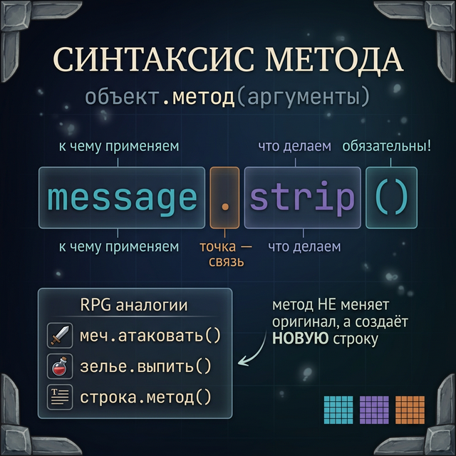
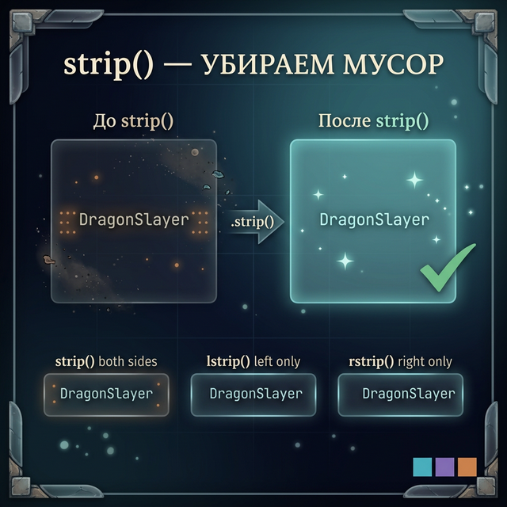
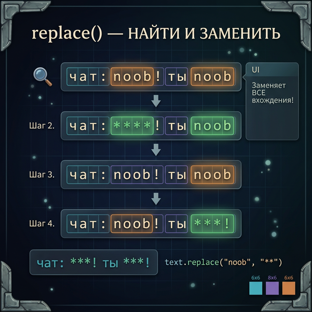
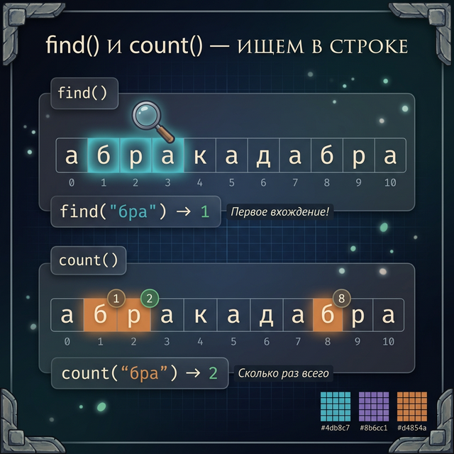
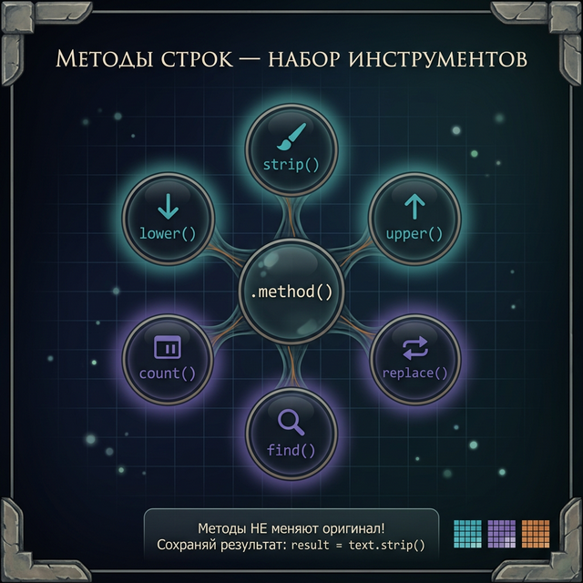

# Day 3: Методы строк — встроенные инструменты

> **Новые концепции сегодня:** `strip()`, `lower()`/`upper()`, `replace()`, `find()`/`count()`
>
> **Время:** ~40 минут (теория + практика)

---

## Часть 1. Что такое метод?

### Аналогия: инструменты в инвентаре Minecraft

В Minecraft у каждого предмета есть действия: мечом можно атаковать, киркой — копать, факелом — освещать. Ты не вызываешь действие отдельно — ты применяешь его **к конкретному предмету**: `меч.атаковать()`, `кирка.копать()`.

В Python строки работают так же. У каждой строки есть встроенные инструменты — **методы**. Вызываешь их через точку:

```python
name = "  Dark Souls  "
clean_name = name.strip()
print(clean_name)    # "Dark Souls"
```

### Как читать синтаксис с точкой

Давай разберём строчку `name.strip()` по частям:

```
name  .  strip  ()
 │    │    │     │
 │    │    │     └── скобки — «выполни это действие»
 │    │    └──────── имя метода — «какой инструмент применить»
 │    └───────────── точка — «применить к тому, что слева»
 └────────────────── объект — «к чему применяем» (наша строка)
```

Точка — это как стрелочка: она говорит Python «возьми то, что слева, и примени к нему то, что справа». Без точки Python не поймёт, **чей** это метод.

Вот ещё примеры, чтобы привыкнуть к записи через точку:

```python
game = "Minecraft"
print(game.upper())     # "MINECRAFT" — game ТОЧКА upper()
print(game.lower())     # "minecraft" — game ТОЧКА lower()
print(game.count("i"))  # 1 — game ТОЧКА count("i")
```

Каждый раз мы обращаемся к строке `game` и просим её выполнить действие. Это похоже на отправку сообщения: «Эй, строка `game`, сделай себя в верхнем регистре!»



### Скобки обязательны!

Даже если метод не принимает аргументов, скобки нужны всегда. Без скобок Python не выполнит метод, а просто покажет информацию о нём:

```python
name = "Dark Souls"
print(name.lower())    # "dark souls" — метод ВЫПОЛНИЛСЯ
print(name.lower)      # <built-in method lower of str> — это НЕ вызов, а ссылка на метод
```

Скобки `()` — это как нажатие кнопки «ОК». Без них ты просто смотришь на кнопку, но не нажимаешь.

### Методы НЕ меняют оригинал

`strip()` — это метод, который вызывается **на строке** `name`. Точка — это как «применить инструмент к предмету».

Ключевое: метод **не меняет** исходную строку (помнишь — строки неизменяемые?). Он создаёт **новую**:

```python
name = "  Dark Souls  "
clean_name = name.strip()
print(name)          # "  Dark Souls  " — оригинал не изменился!
print(clean_name)    # "Dark Souls" — это новая строка
```

Представь: метод `strip()` — это как фотофильтр. Когда ты накладываешь фильтр на фото в Instagram, оригинал остаётся. Фильтр создаёт **копию** с изменениями. Так и метод строки — он не трогает оригинал, а возвращает новую строку.

### Цепочка методов

Раз каждый метод возвращает **новую строку**, ты можешь вызвать на ней ещё один метод — и так далее, как цепочка:

```python
name = "  DARK SOULS  "
result = name.strip().lower()
print(result)    # "dark souls"
```

Что здесь происходит, шаг за шагом:
1. `name` — это `"  DARK SOULS  "`
2. `name.strip()` — убрали пробелы, получилось `"DARK SOULS"` (новая строка)
3. `"DARK SOULS".lower()` — привели к нижнему регистру, получилось `"dark souls"` (ещё одна новая строка)
4. Результат сохранён в `result`

> **Попробуй сам:** Открой Python и попробуй вызвать метод `upper()` на строке `"hello"`. Затем попробуй вызвать `upper` без скобок. Видишь разницу?

---

## Часть 2. strip() — убираем мусор по краям

### Проблема: лишние пробелы

Когда игрок вводит текст, он часто добавляет случайные пробелы — нечаянно нажал пробел перед текстом или после. Человек этого не замечает, но для Python `"secret"` и `"  secret  "` — это **две совершенно разные строки**. И это ломает проверки:

```python
answer = input("Введи пароль: ")  # Пользователь вводит "  secret  "

if answer == "secret":
    print("Доступ открыт!")
else:
    print("Неверный пароль!")    # Сработает это — из-за пробелов!
```

Представь: ты играешь в Dark Souls, вводишь код от сундука — и ничего не происходит. А всё потому, что ты случайно нажал пробел перед кодом. Обидно, правда?

### Решение: strip()

`strip()` решает эту проблему — убирает пробелы (и другие невидимые символы) с обоих концов строки:

```python
dirty = "   secret   "
clean = dirty.strip()
print(f"'{dirty}' → '{clean}'")
```

**Вывод:**
```
'   secret   ' → 'secret'
```

Давай разберём пошагово, что делает Python, когда видит `dirty.strip()`:

1. Берёт строку `"   secret   "`
2. Смотрит на начало — видит пробелы, убирает их
3. Смотрит на конец — видит пробелы, убирает их
4. Середину **не трогает** — пробелы внутри строки остаются!
5. Возвращает новую строку `"secret"`



Вот наглядная иллюстрация:

```
До:    [   ][   ][   ][ s ][ e ][ c ][ r ][ e ][ t ][   ][   ][   ]
        ^^^  ^^^  ^^^                                  ^^^  ^^^  ^^^
        убрать!                                        убрать!

После: [ s ][ e ][ c ][ r ][ e ][ t ]
```

### Важно: пробелы ВНУТРИ строки не убираются

`strip()` работает только по краям! Пробелы между словами остаются:

```python
text = "   Dark   Souls   "
print(text.strip())    # "Dark   Souls" — пробелы внутри остались!
```

Это логично — если бы `strip()` убрал все пробелы, мы бы получили `"DarkSouls"`, а это совсем не то, что нужно.

### Что такое «невидимые символы»?

`strip()` убирает не только пробелы. Он убирает все так называемые **пробельные символы** (whitespace):

- Обычный пробел `' '`
- Табуляция `'\t'` (когда нажимаешь Tab)
- Перенос строки `'\n'` (когда нажимаешь Enter)
- Возврат каретки `'\r'` (часто встречается в файлах из Windows)

```python
messy = "\n\t  Dark Souls  \n\t"
clean = messy.strip()
print(f"'{clean}'")    # 'Dark Souls' — убраны все невидимки!
```

В реальной жизни это важно: когда ты читаешь данные из файла или из интернета, строки часто содержат `\n` на конце. `strip()` помогает от них избавиться.

### strip() с аргументом

Можно указать, какие конкретно символы убирать:

```python
text = "***Dark Souls***"
print(text.strip("*"))       # "Dark Souls" — убрали звёздочки с обеих сторон
```

Когда ты передаёшь аргумент в `strip()`, он убирает **каждый** из указанных символов по краям (а не подстроку целиком):

```python
text = "=-=Minecraft=-="
print(text.strip("=-"))     # "Minecraft" — убрали и «=», и «-» по краям
```

Python смотрит на каждый символ с края: «Это `=`? Убираю. Это `-`? Убираю. Это `M`? Не в списке — останавливаюсь.»

### Родственники: lstrip() и rstrip()

Иногда нужно убрать мусор только с одной стороны:

```python
text = "   Dark Souls   "
print(text.lstrip())    # "Dark Souls   " — убрали только СЛЕВА (left)
print(text.rstrip())    # "   Dark Souls" — убрали только СПРАВА (right)
print(text.strip())     # "Dark Souls"   — убрали С ОБЕИХ сторон
```

`l` — от слова **left** (левый), `r` — от слова **right** (правый).

### Пример: очистка ввода в чате MMORPG

Представь, что ты пишешь чат для MMORPG. Игроки вводят команды, но кто-то обязательно поставит лишний пробел:

```python
command = input("Команда: ")       # Игрок вводит "  /heal  "
command = command.strip()          # "/heal" — чисто!

if command[0] == "/":
    print(f"Выполняю команду: {command}")
```

Без `strip()` программа увидела бы `" "` вместо `"/"` на первой позиции — и не распознала бы команду.

### Пример: планировщик — очистка названия задачи

В планировщике задач пользователь может ввести задачу с лишними пробелами. Если не почистить, в списке задач будет неаккуратно:

```python
task = input("Новая задача: ")     # "  купить молоко  "
task = task.strip()                # "купить молоко"
print(f"Добавлено: {task}")
```

### Пример: Monopoly — ввод количества игроков

```python
players_input = input("Сколько игроков? ")    # "  4  "
players_input = players_input.strip()          # "4"
players = int(players_input)                   # 4 — теперь можно конвертировать в число
print(f"Начинаем игру на {players} игроков!")
```

Без `strip()` функция `int("  4  ")` на самом деле тоже сработала бы (Python умный), но это не всегда так с другими преобразованиями. Привычка чистить ввод — признак хорошего программиста.

> **Попробуй сам:** Создай строку `"\t\n  Привет!  \n\t"` и примени к ней `strip()`. Убедись, что невидимые символы исчезли. Потом попробуй `lstrip()` и `rstrip()` — посмотри, в чём разница.

---

## Часть 3. lower() и upper() — регистр

### Проблема: «да», «Да», «ДА» — это одно и то же?

Для человека — да. Для Python — нет:

```python
print("Да" == "да")    # False
print("Да" == "ДА")    # False
print("да" == "дА")    # False
```

Python сравнивает строки **побуквенно**, и для него заглавная «Д» и строчная «д» — это совершенно разные символы. Это как в реальной жизни: «А» и «а» выглядят похоже, но это разные буквы, у них разные коды внутри компьютера.

Это создаёт проблемы. Игрок в RPG вводит «да» или «Да» или «ДА» — и программа должна понять, что это один и тот же ответ. Без специального инструмента тебе пришлось бы проверять все варианты:

```python
# Так писать ОЧЕНЬ неудобно — и это ещё не все варианты!
if answer == "да" or answer == "Да" or answer == "ДА" or answer == "дА":
    print("Идём дальше!")
```

### Решение: lower() и upper()

`lower()` превращает **все** буквы в строке в строчные (маленькие). `upper()` — наоборот, в заглавные (большие):

```python
word = "Dark Souls"
print(word.lower())    # "dark souls" — всё в нижний регистр
print(word.upper())    # "DARK SOULS" — всё в верхний регистр
```

Что происходит внутри `lower()` пошагово:

```
Исходная строка: D  a  r  k     S  o  u  l  s
                 │  │  │  │  │  │  │  │  │  │
lower():         d  a  r  k     s  o  u  l  s
                 ↑              ↑
          была заглавная   была заглавная
          стала строчная   стала строчная
```

Буквы, которые уже строчные, не меняются. Пробелы, цифры и знаки препинания тоже не меняются — `lower()` работает только с буквами.

```python
text = "Игрок #1: 100 HP!!!"
print(text.lower())    # "игрок #1: 100 hp!!!" — цифры и знаки не изменились
print(text.upper())    # "ИГРОК #1: 100 HP!!!" — только буквы стали заглавными
```

### Идея: приводим к одному регистру перед сравнением

Вместо того чтобы проверять все варианты написания, мы приводим ввод к одному регистру и сравниваем только с одним вариантом:

```python
answer = input("Продолжить? (да/нет): ")

if answer.lower() == "да":
    print("Идём дальше!")
elif answer.lower() == "нет":
    print("До свидания!")
```

Теперь не важно, напишет ли игрок `"Да"`, `"да"`, `"ДА"` или даже `"дА"` — `lower()` превратит всё в `"да"`.

Давай проследим это на примере:

```python
# Пользователь ввёл "ДА"
answer = "ДА"
answer.lower()    # → "да"
"да" == "да"      # → True — сравнение сработало!

# Пользователь ввёл "дА"
answer = "дА"
answer.lower()    # → "да"
"да" == "да"      # → True — тоже сработало!
```

Можно использовать `upper()` вместо `lower()` — результат будет тот же, главное сравнивать в одинаковом регистре:

```python
if answer.upper() == "ДА":    # Тоже работает!
    print("Идём дальше!")
```

Обычно используют `lower()` — просто по привычке, строчные буквы проще читать.

### Пример: поиск игрока в Dark Souls (нечувствительный к регистру)

В играх часто нужно искать по имени, и игрок не должен угадывать регистр:

```python
player_name = "Chosen Undead"
search = input("Поиск: ")

if search.lower() == player_name.lower():
    print(f"Найден: {player_name}")
else:
    print("Игрок не найден")
```

Обрати внимание: мы вызываем `lower()` на **обеих** строках — и на поисковом запросе, и на имени игрока. Это важно! Если привести к нижнему регистру только одну строку, сравнение может не сработать.

### Пример: выбор класса в Minecraft

```python
print("Выбери класс: Воин, Маг, Лучник")
choice = input("Твой выбор: ")
choice = choice.strip().lower()    # очищаем и приводим к нижнему регистру

if choice == "воин":
    print("Ты выбрал воина! +10 к силе")
elif choice == "маг":
    print("Ты выбрал мага! +10 к магии")
elif choice == "лучник":
    print("Ты выбрал лучника! +10 к ловкости")
else:
    print("Неизвестный класс!")
```

Теперь игрок может написать «ВОИН», «Воин», «воин», «  Воин  » — всё будет работать.

### Пример: калькулятор — команда «выход»

```python
command = input("Введи выражение (или 'выход'): ")

if command.strip().lower() == "выход":
    print("Калькулятор закрыт")
```

Заметь: `.strip().lower()` — можно **цеплять** методы друг за другом. Сначала убрали пробелы, потом привели к нижнему регистру.

Это стандартный приём для обработки пользовательского ввода. Запомни эту комбинацию — будешь использовать её постоянно:

```python
user_input = input("...").strip().lower()
```

### Пример: верификация ответа в Monopoly

```python
print("Вы попали на чужую территорию!")
answer = input("Платить аренду? (да/нет): ").strip().lower()

if answer == "да":
    print("Вы заплатили 500 монет")
elif answer == "нет":
    print("Вы отказались! Идёте в тюрьму!")
else:
    print("Не понял ответа, повторите")
```

> **Попробуй сам:** Создай переменную `name = "dARk sOuLs"`. Примени к ней `lower()`, потом `upper()`. Затем попробуй `name.lower() == "dark souls"` — убедись, что результат `True`. А теперь попробуй сравнить `name == "dark souls"` без `lower()` — видишь разницу?

<quiz>
Q: Что делает `"  hello  ".strip()`?
A: Убирает все пробелы из строки
A: Убирает пробелы с обоих концов строки
A: Убирает только левый пробел
C: Убирает пробелы с обоих концов строки
E: strip() убирает пробелы (и невидимые символы) только по краям, не внутри строки.

Q: `"Да" == "да"` — это True или False?
A: True
A: False
C: False
E: Python различает регистр. «Да» и «да» — разные строки. Используй .lower() для сравнения.

Q: Что делает цепочка `name.strip().lower()`?
A: Сначала приводит к нижнему регистру, потом убирает пробелы
A: Сначала убирает пробелы по краям, потом приводит к нижнему регистру
A: Убирает пробелы и делает первую букву заглавной
C: Сначала убирает пробелы по краям, потом приводит к нижнему регистру
E: Методы выполняются слева направо: сначала strip(), потом lower().
</quiz>

---

## Часть 4. replace() — замена текста

### Аналогия: «Найти и заменить» в текстовом редакторе

Ты наверняка использовал Ctrl+H в Google Docs или Word — «Найти и заменить». `replace()` делает то же самое для строки в Python.

```python
text = "Я люблю Dark Souls"
new_text = text.replace("Dark Souls", "Minecraft")
print(new_text)    # "Я люблю Minecraft"
```

### Синтаксис

```python
строка.replace(что_искать, на_что_заменить)
```

`replace()` принимает ровно два аргумента:
1. **Что искать** — подстрока, которую нужно найти
2. **На что заменить** — подстрока, на которую заменяем

### Как Python выполняет replace() — пошагово

Давай разберём, что происходит внутри:

```python
text = "Я люблю Dark Souls"
result = text.replace("Dark Souls", "Minecraft")
```

1. Python берёт строку `"Я люблю Dark Souls"`
2. Проходит по ней слева направо, ища `"Dark Souls"`
3. Находит `"Dark Souls"` на позиции 8
4. Создаёт **новую** строку, в которой `"Dark Souls"` заменено на `"Minecraft"`
5. Возвращает `"Я люблю Minecraft"`
6. Оригинальная строка `text` **не изменилась** (помнишь правило?)



### replace() заменяет ВСЕ вхождения

Это важно понимать: `replace()` заменяет не первое найденное, а **все**:

```python
chat = "лол, это лол, реально лол"
clean = chat.replace("лол", "ха-ха")
print(clean)    # "ха-ха, это ха-ха, реально ха-ха"
```

Визуально:

```
До:    "лол, это лол, реально лол"
        ^^^      ^^^           ^^^
        1-е      2-е           3-е вхождение

После: "ха-ха, это ха-ха, реально ха-ха"
```

Все три `"лол"` заменились на `"ха-ха"`.

### Замена на пустую строку — это удаление!

Полезный трюк: если заменить что-то на пустую строку `""`, это по сути **удаляет** найденный текст:

```python
text = "Dark---Souls"
clean = text.replace("-", "")
print(clean)    # "DarkSouls" — все дефисы удалены
```

Это как ластик: «замени дефис на ничего» = «сотри дефис».

### Пример: цензура в игровом чате

```python
message = "Ты нуб и играешь как нуб"
censored = message.replace("нуб", "***")
print(censored)    # "Ты *** и играешь как ***"
```

### Пример: исправление опечатки в имени персонажа

Помнишь, в Day 1 мы узнали, что строку нельзя изменить по индексу? `replace()` — это способ «изменить» строку (на самом деле — создать новую):

```python
name = "Zeldo"
fixed = name.replace("o", "a")
print(fixed)    # "Zelda"
```

Но будь осторожен! `replace()` заменяет **все** вхождения буквы:

```python
name = "Hollow Knight"
result = name.replace("l", "r")
print(result)    # "Horrow Knight" — обе буквы "l" заменились!
```

Если в строке несколько одинаковых букв, заменятся все. Иногда это не то, что нужно. (Как заменить только одно вхождение — узнаем в Камне 2, часть 6.)

### Пример: смена оружия в Dark Souls

Представь инвентарь персонажа в виде строки (упрощённо):

```python
inventory = "меч, щит, меч, зелье"
new_inventory = inventory.replace("меч", "копьё")
print(new_inventory)    # "копьё, щит, копьё, зелье" — оба меча стали копьями!
```

### Пример: форматирование номера в планировщике

```python
phone = "+7 (999) 123-45-67"
digits_only = phone.replace(" ", "").replace("(", "").replace(")", "").replace("-", "")
print(digits_only)    # "+79991234567"
```

Здесь мы цепочкой убрали все лишние символы. Разберём пошагово:

```python
phone = "+7 (999) 123-45-67"

# Шаг 1: убираем пробелы
step1 = phone.replace(" ", "")       # "+7(999)123-45-67"

# Шаг 2: убираем открывающую скобку
step2 = step1.replace("(", "")       # "+7999)123-45-67"

# Шаг 3: убираем закрывающую скобку
step3 = step2.replace(")", "")       # "+7999123-45-67"

# Шаг 4: убираем дефисы
step4 = step3.replace("-", "")       # "+79991234567"
```

В цепочке это выглядит компактнее, но работает точно так же — каждый `replace()` берёт результат предыдущего и применяет свою замену.

### Пример: шаблон сообщения в MMORPG

`replace()` отлично подходит для шаблонов — строк с «заглушками», которые заменяются на реальные значения:

```python
template = "[PLAYER] нанёс [DAMAGE] урона монстру [MONSTER]!"
message = template.replace("[PLAYER]", "DragonSlayer")
message = message.replace("[DAMAGE]", "150")
message = message.replace("[MONSTER]", "Дракон")
print(message)    # "DragonSlayer нанёс 150 урона монстру Дракон!"
```

> **Попробуй сам:** Создай строку `"Minecraft Minecraft Minecraft"` и замени в ней `"Minecraft"` на `"Terraria"`. Потом попробуй заменить `"craft"` на `"CRAFT"` — заметь, что `replace()` ищет подстроку внутри слов тоже! Результат будет `"MineCRAFT MineCRAFT MineCRAFT"`.


---

## Часть 5. find() и count() — ищем в строке



### find() — где находится подстрока?

`find()` возвращает **индекс** (позицию) первого вхождения подстроки. Если подстрока не найдена, возвращает `-1`.

```python
quest = "Найди ключ в подземелье"
position = quest.find("ключ")
print(position)    # 6 — слово "ключ" начинается с индекса 6
```

Давай проверим это визуально. Помнишь индексацию строк из Day 1?

```
Индексы: 0  1  2  3  4  5  6  7  8  9  10 11 12 ...
Буквы:   Н  а  й  д  и     к  л  ю  ч     в     ...
                           ↑
                     индекс 6 — здесь начинается "ключ"
```

`find()` вернул `6`, потому что буква `к` из слова `ключ` стоит на позиции `6`.

### Что значит «вернул -1»?

Если подстрока не найдена, `find()` не выдаёт ошибку (это было бы неудобно). Вместо этого он возвращает специальное значение `-1`:

```python
quest = "Найди ключ в подземелье"
position = quest.find("меч")
print(position)    # -1 — слово "меч" не найдено
```

Почему именно `-1`? Потому что `-1` — это число, которое **никогда** не может быть настоящим индексом. Нормальные индексы начинаются с `0`, поэтому `-1` однозначно говорит: «не нашёл».

Это позволяет легко проверять, нашлось ли что-то:

```python
pos = text.find("ключ")

if pos != -1:
    print(f"Найдено на позиции {pos}!")
else:
    print("Не найдено!")
```

### find() находит ПЕРВОЕ вхождение

Если подстрока встречается несколько раз, `find()` вернёт позицию **первого**:

```python
text = "меч и меч и меч"
pos = text.find("меч")
print(pos)    # 0 — нашёл самый первый "меч"
```

```
Индексы: 0  1  2  3  4  5  6  7  8  9  10 11 12 13 14
Буквы:   м  е  ч     и     м  е  ч     и     м  е  ч
         ↑              (пропущен)         (пропущен)
    find вернёт 0
```

### Пример: парсинг команды в RPG

Вот реальное применение `find()` — разбор команды в чате RPG. Идея: найти пробел, и всё до пробела — это команда, всё после — аргумент.

```python
message = "/attack skeleton"

# Находим позицию пробела
space_pos = message.find(" ")

if space_pos != -1:
    command = message[:space_pos]      # "/attack"
    argument = message[space_pos + 1:] # "skeleton"
    print(f"Команда: {command}")
    print(f"Аргумент: {argument}")
else:
    print(f"Команда без аргумента: {message}")
```

**Вывод:**
```
Команда: /attack
Аргумент: skeleton
```

Разберём пошагово:

```
"/attack skeleton"
  0123456789...

space_pos = find(" ") → 7 (пробел на позиции 7)

message[:7]     → "/attack"    — всё ДО пробела
message[7 + 1:] → "skeleton"   — всё ПОСЛЕ пробела (8 и дальше)
```

Заметь, как `find()` работает в связке со срезами — `find()` находит позицию, срезы вырезают нужные части. Это очень мощная комбинация!

### Пример: определение формата файла

```python
filename = "screenshot_dark_souls.png"
dot_pos = filename.find(".")

if dot_pos != -1:
    extension = filename[dot_pos + 1:]    # "png"
    print(f"Формат файла: {extension}")
else:
    print("У файла нет расширения")
```

### Пример: есть ли ключевое слово в задаче?

```python
task = "Купить молоко и хлеб в магазине"

if task.find("купить") != -1 or task.find("Купить") != -1:
    print("Это задача-покупка!")
```

Лучше так (используя `lower()` из Части 3):

```python
task = "Купить молоко и хлеб в магазине"

if task.lower().find("купить") != -1:
    print("Это задача-покупка!")
```

Видишь, как методы дополняют друг друга? `lower()` приводит к одному регистру, а `find()` ищет подстроку. Вместе они делают поиск нечувствительным к регистру.

---

### count() — сколько раз встречается?

Если `find()` отвечает на вопрос «**где** находится?», то `count()` отвечает на вопрос «**сколько раз** встречается?»

```python
text = "Minecraft — это мир блоков. В Minecraft можно строить. Minecraft бесконечен."
mc_count = text.count("Minecraft")
print(f"Minecraft упомянут {mc_count} раз")    # 3
```

`count()` проходит по всей строке и считает, сколько раз подстрока встречается:

```
"Minecraft — это мир блоков. В Minecraft можно строить. Minecraft бесконечен."
 ^^^^^^^^^                     ^^^^^^^^^                 ^^^^^^^^^
 раз!                          два!                      три!

count("Minecraft") → 3
```

Если подстрока не найдена, `count()` возвращает `0` (а не `-1`, как `find()`):

```python
text = "Dark Souls"
print(text.count("Minecraft"))    # 0 — не найдено ни разу
```

### count() считает БЕЗ перекрытий

Важный нюанс: `count()` считает **непересекающиеся** вхождения:

```python
text = "ааа"
print(text.count("аа"))    # 1, а не 2!
```

Python нашёл `"аа"` на позиции 0, отсчитал и перешёл на позицию 2. На позиции 1 он не ищет, потому что позиция 1 уже была частью предыдущего найденного вхождения.

### Пример: статистика чата

```python
chat_log = "лол хаха лол лол круто лол"
lol_count = chat_log.count("лол")
print(f'Слово "лол" встречается {lol_count} раз')    # 4
```

### Пример: анализ лога Dark Souls

```python
log = "Вы погибли. Вы погибли. Босс повержен! Вы погибли."
deaths = log.count("Вы погибли")
victories = log.count("Босс повержен")
print(f"Смертей: {deaths}")     # 3
print(f"Побед: {victories}")    # 1
print(f"Соотношение: {deaths}:{victories}")  # 3:1 — типичный Dark Souls!
```

### Пример: подсчёт гласных

```python
name = "Nameless King"
vowel_count = 0
for vowel in "aeiouyAEIOUY":
    vowel_count = vowel_count + name.count(vowel)
print(f"Гласных в '{name}': {vowel_count}")    # 4
```

Здесь мы перебираем каждую гласную букву и считаем, сколько раз она встречается в строке. `count()` делает этот подсчёт простым — без него пришлось бы вручную проходить по каждой букве строки.

> **Попробуй сам:** Создай строку `"абракадабра"`. Используй `find("а")` — он вернёт `0` (первая буква). Теперь используй `count("а")` — сколько букв «а» в этом слове? Затем попробуй `find("з")` — убедись, что вернётся `-1`.

<quiz>
Q: Что выведет `"кот".replace("о", "а")`?
A: кот
A: кат
A: Ошибку
C: кат
E: replace() заменяет все вхождения «о» на «а», создавая новую строку «кат».

Q: Что вернёт `"Привет мир".find("мир")`?
A: True
A: 7
A: -1
C: 7
E: find() возвращает индекс (позицию) первого вхождения. Слово «мир» начинается с индекса 7.

Q: Что вернёт `find()`, если подстрока не найдена?
A: 0
A: False
A: -1
C: -1
E: Если подстрока не найдена, find() возвращает -1 (не ошибку, а специальное значение).
</quiz>

---

## Часть 6. Подводные камни

Эти ошибки делают даже опытные программисты. Запомни их — и сэкономишь себе часы отладки.

### Камень 1: методы НЕ меняют оригинал

Это **самая частая** ошибка при работе со строками. Настолько частая, что её стоит повторить трижды.

Неправильно:

```python
name = "  Dark Souls  "
name.strip()           # Результат никуда не сохранён!
print(name)            # "  Dark Souls  " — пробелы на месте
```

Что здесь произошло? `strip()` **выполнился** и **создал** новую строку `"Dark Souls"`. Но мы её никуда не положили! Она просто исчезла, как если бы ты приготовил еду и забыл поставить тарелку — еда упала на пол.

Правильно:

```python
name = "  Dark Souls  "
name = name.strip()    # Сохраняем результат обратно!
print(name)            # "Dark Souls"
```

Это правило работает для **всех** строковых методов:

```python
# НЕПРАВИЛЬНО — результат теряется:
message = "привет"
message.upper()         # "ПРИВЕТ" создалось и пропало
message.replace("п", "П")  # тоже пропало
print(message)          # "привет" — ничего не изменилось!

# ПРАВИЛЬНО — сохраняем результат:
message = "привет"
message = message.upper()
print(message)          # "ПРИВЕТ"
```

Почему так? Потому что строки **неизменяемые** (immutable). Метод не может изменить существующую строку — он может только создать новую. А новую строку нужно куда-то положить (сохранить в переменную).

### Камень 2: replace() заменяет ВСЁ

```python
text = "карта мира, карта сокровищ, карта игрока"
result = text.replace("карта", "план")
print(result)    # "план мира, план сокровищ, план игрока" — заменились ВСЕ
```

Иногда это неожиданно. Ты хотел заменить только первую «карту», а заменились все три.

Есть решение — третий аргумент `replace()`, который ограничивает количество замен:

```python
text = "карта мира, карта сокровищ, карта игрока"
result = text.replace("карта", "план", 1)    # заменить только 1 раз
print(result)    # "план мира, карта сокровищ, карта игрока"
```

Число `1` в конце говорит: «замени максимум 1 вхождение». Можно поставить `2`, `3` и так далее.

Ещё один подвох — `replace()` ищет подстроку **внутри слов** тоже:

```python
text = "Картофель на карте"
result = text.replace("карт", "план")
print(result)    # "Планофель на плане" — упс!
```

Python нашёл `"карт"` внутри слова «Картофель» (точнее, не нашёл, потому что «К» заглавная, а искали строчную «к»). Но вот так:

```python
text = "картофель на карте"
result = text.replace("карт", "план")
print(result)    # "планофель на плане" — replace не понимает границ слов!
```

`replace()` не знает, что такое «слово» — он просто ищет последовательность символов. Будь внимателен!

### Камень 3: replace() чувствителен к регистру

```python
text = "Dark Souls — это dark souls"
result = text.replace("dark", "DARK")
print(result)    # "Dark Souls — это DARK souls"
```

Заменилось только `"dark"` с маленькой буквы. `"Dark"` с большой буквы не тронуто — для `replace()` это разные строки.

Если нужно заменить независимо от регистра, можно сначала привести к одному регистру:

```python
text = "Dark Souls — это dark souls"
result = text.lower().replace("dark", "***")
print(result)    # "*** souls — это *** souls"
```

Но осторожно: после `lower()` весь текст станет строчным.

### Камень 4: find() vs `in`

Помнишь оператор `in` из Day 1? Для простой проверки «есть или нет» он проще:

```python
text = "Dark Souls"

# Способ 1: find (возвращает число)
if text.find("Souls") != -1:
    print("Найдено!")

# Способ 2: in (возвращает True/False) — проще!
if "Souls" in text:
    print("Найдено!")
```

Оба способа работают, но `in` читается как обычный английский: «if "Souls" in text» — «если "Souls" в тексте». Это понятнее, чем `find() != -1`.

**Когда использовать что:**
- Нужно только узнать, **есть** ли подстрока → используй `in`
- Нужно узнать, **где именно** находится подстрока (позиция) → используй `find()`

```python
text = "Найди ключ в подземелье"

# Просто проверить — есть ли "ключ"?
if "ключ" in text:
    print("Ключ есть!")

# Узнать, ГДЕ именно находится "ключ"?
pos = text.find("ключ")
print(f"Ключ на позиции {pos}")    # 6
```

### Камень 5: find() и отрицательные индексы

Не путай `-1` от `find()` с индексом `-1` (последний символ строки):

```python
text = "Dark Souls"

# find() вернул -1 — значит НЕ НАЙДЕНО
pos = text.find("xyz")
print(pos)         # -1 — это не индекс, а сигнал «не найдено»

# Индекс -1 — это последний символ
print(text[-1])    # "s" — последний символ строки
```

Если ты случайно используешь результат `find()` как индекс, когда подстрока не найдена, получишь не ошибку, а неправильный результат:

```python
text = "Dark Souls"
pos = text.find("xyz")    # -1 (не найдено!)
print(text[pos])           # "s" — это text[-1], последний символ! Не то, что ты ожидал.
```

Поэтому **всегда проверяй** результат `find()` перед использованием:

```python
pos = text.find("xyz")
if pos != -1:
    print(f"Нашёл на позиции {pos}: {text[pos]}")
else:
    print("Не найдено!")
```

---

## Часть 7. Практика — теперь ты!

### Задание 1: Очистка ввода (разминка)

Напиши программу, которая:
1. Просит ввести имя персонажа
2. Убирает лишние пробелы
3. Приводит к нижнему регистру
4. Выводит результат

```
Введи имя:    dARK kNIGHT
Очищенное имя: dark knight
```

<details>
<summary>Подсказка</summary>

Используй `strip()` и `lower()` — цепочкой: `name.strip().lower()`.

</details>

<details>
<summary>Решение</summary>

```python
name = input("Введи имя: ")
clean = name.strip().lower()
print(f"Очищенное имя: {clean}")
```

</details>

---

### Задание 2: Цензор чата

Напиши цензор для игрового чата. Программа заменяет список «плохих» слов на звёздочки. Плохие слова: `"нуб"`, `"читер"`, `"бот"`.

```
Сообщение: Ты нуб и читер, иди играй бот
Цензура: Ты *** и ***, иди играй ***
```

<details>
<summary>Подсказка</summary>

Используй `.lower()` для поиска и `.replace()` для замены. Но есть нюанс: `replace()` чувствителен к регистру. Для простоты приведи всё к нижнему регистру.

</details>

<details>
<summary>Решение</summary>

```python
message = input("Сообщение: ")
result = message.lower()
result = result.replace("нуб", "***")
result = result.replace("читер", "***")
result = result.replace("бот", "***")
print(f"Цензура: {result}")
```

</details>

---

### Задание 3: Статистика сообщения

Напиши программу, которая анализирует введённое сообщение и выводит:
- Длину (без учёта пробелов по краям)
- Количество пробелов внутри
- Количество восклицательных знаков
- Сообщение в верхнем регистре

```
Сообщение: Привет мир! Как дела!
Длина: 21
Пробелов: 3
Восклицательных знаков: 2
Крик: ПРИВЕТ МИР! КАК ДЕЛА!
```

<details>
<summary>Решение</summary>

```python
message = input("Сообщение: ")
clean = message.strip()

print(f"Длина: {len(clean)}")
print(f"Пробелов: {clean.count(' ')}")
print(f"Восклицательных знаков: {clean.count('!')}")
print(f"Крик: {clean.upper()}")
```

</details>

---

### Задание 4: Парсер команд RPG (мини-проект)

Напиши парсер команд для RPG-чата. Программа принимает сообщение и:
- Очищает от пробелов по краям
- Определяет, это команда (начинается с `/`) или обычное сообщение
- Если команда — выделяет имя команды и аргумент (через `find()` и срезы)
- Показывает результат

```
Введи сообщение:   /attack skeleton

Тип: КОМАНДА
Команда: /attack
Аргумент: skeleton

Введи сообщение: Всем привет!

Тип: СООБЩЕНИЕ
Текст: Всем привет!
Длина: 12 символов
```

<details>
<summary>Подсказка</summary>

1. `strip()` для очистки
2. Проверь `message[0] == "/"` для определения типа
3. `find(" ")` найдёт позицию пробела — используй её для среза
4. Если пробел не найден (`find()` вернул `-1`), команда без аргумента

</details>

<details>
<summary>Решение</summary>

```python
message = input("Введи сообщение: ")
message = message.strip()

if len(message) == 0:
    print("Пустое сообщение!")
elif message[0] == "/":
    print()
    print("Тип: КОМАНДА")

    space_pos = message.find(" ")
    if space_pos != -1:
        command = message[:space_pos]
        argument = message[space_pos + 1:]
        print(f"Команда: {command}")
        print(f"Аргумент: {argument}")
    else:
        print(f"Команда: {message}")
        print("Аргумент: нет")
else:
    print()
    print("Тип: СООБЩЕНИЕ")
    print(f"Текст: {message}")
    print(f"Длина: {len(message)} символов")
```

</details>

---

## Часть 8. Итоги дня



Сегодня ты получил четыре инструмента для работы со строками:

| Метод | Что делает | Пример |
|:------|:-----------|:-------|
| `strip()` | Убирает пробелы по краям | `"  hi  ".strip()` → `"hi"` |
| `lower()` / `upper()` | Меняет регистр | `"Hi".lower()` → `"hi"` |
| `replace(a, b)` | Заменяет `a` на `b` | `"кот".replace("о","а")` → `"кат"` |
| `find(x)` | Позиция `x` в строке (или `-1`) | `"привет".find("вет")` → `3` |
| `count(x)` | Сколько раз `x` встречается | `"абаба".count("а")` → `3` |

**Главные правила:**
- Методы **не меняют** оригинал — нужно сохранять результат: `s = s.strip()`
- Методы можно **цеплять**: `s.strip().lower().replace("а", "о")`
- Для проверки «есть или нет» используй `in`, для позиции — `find()`

**Завтра:** `split()` и `join()` — превращаем строку в список слов и обратно. Это откроет совершенно новый уровень работы с текстом.
