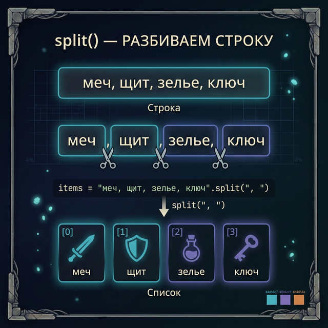
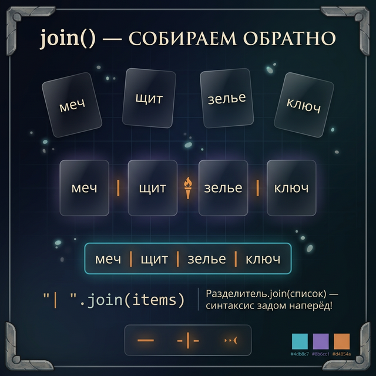
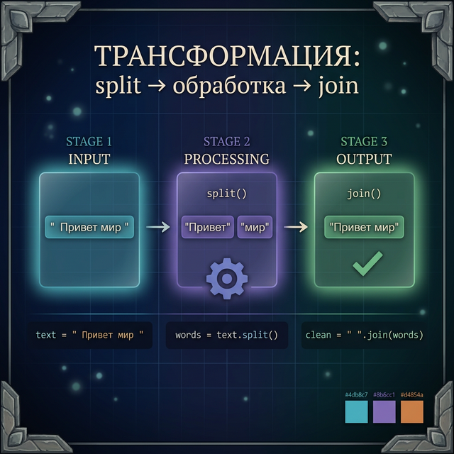
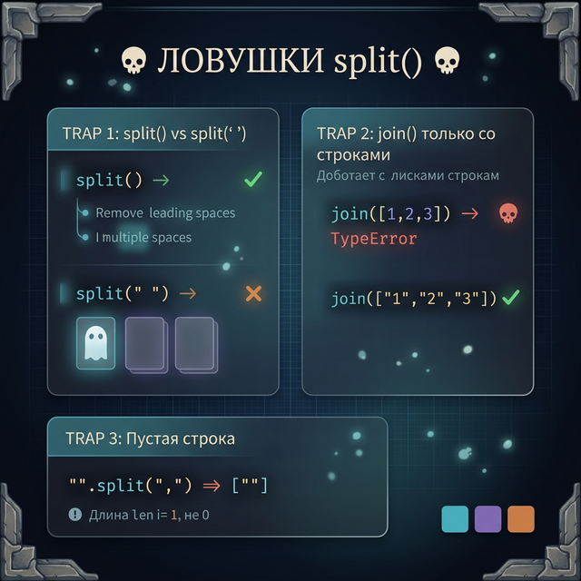

# Day 4: split и join — строка ↔ список слов

> **Новые концепции сегодня:** `split()`, `join()`, базовый парсинг текста
>
> **Время:** ~40 минут (теория + практика)

---

## Часть 1. Зачем разбивать строку на части?

### Аналогия: разобрать сундук на предметы

В RPG ты находишь сундук. Внутри — список предметов: `"меч, щит, зелье, ключ"`. Это одна строка. Но чтобы работать с каждым предметом отдельно (показать в инвентаре, проверить наличие, удалить), нужно **разобрать** строку на отдельные элементы.

Представь это так:

```
Сундук (одна строка):
╔══════════════════════════════╗
║  "меч, щит, зелье, ключ"    ║
╚══════════════════════════════╝
          │ split(",")
          ▼
Инвентарь (список):
┌──────┐ ┌──────┐ ┌───────┐ ┌──────┐
│ меч  │ │ щит  │ │ зелье │ │ ключ │
└──────┘ └──────┘ └───────┘ └──────┘
  [0]      [1]      [2]       [3]
```

Пока предметы «слиплись» в одной строке — ты не можешь с ними нормально работать. Это как если бы в Minecraft все предметы лежали в одной ячейке инвентаря — ты не мог бы выбрать конкретный предмет, удалить его или переложить.

`split()` — это инструмент, который разбирает строку на список отдельных кусочков. Каждый кусочек становится самостоятельным элементом, с которым можно работать отдельно.

### Почему это так важно?

Практически все данные, которые получает программа, приходят **в виде строк**:
- Пользователь вводит текст с клавиатуры — это строка
- Данные из файла — это строка
- Сообщение в чате — это строка
- Команда в консоли игры — это строка

Но внутри этих строк часто спрятано **несколько значений**, разделённых каким-то символом (пробелом, запятой, двоеточием). И чтобы добраться до каждого значения, строку нужно **разбить** на части.

Зачем это нужно — конкретные примеры:
- **Игровой чат**: разобрать `"/attack skeleton sword"` на команду и аргументы
- **Лог Minecraft**: разобрать `"[12:05] Steve joined the game"` на время, ник, действие
- **Планировщик**: разобрать `"купить: молоко, хлеб, яйца"` на отдельные покупки
- **Dark Souls**: разобрать строку с характеристиками `"HP:500 STR:40 DEX:30"` на отдельные параметры
- **MMORPG торговля**: разобрать `"Diamond Sword|500 gold|Steve"` — предмет, цена, продавец
- **Простой калькулятор**: разобрать `"25 + 17"` на числа и операцию

Без `split()` тебе пришлось бы вручную искать позиции разделителей через `find()`, вырезать куски через срезы... Мы так делали на Day 3, и это было **мучительно**. Сегодня всё станет намного проще!

---

## Часть 2. split() — разбиваем строку

### Базовый split() без аргументов

Без аргументов `split()` разбивает строку по пробелам:

```python
sentence = "Dark Souls is hard"
words = sentence.split()
print(words)    # ['Dark', 'Souls', 'is', 'hard']
```

Что здесь происходит шаг за шагом:

1. Python берёт строку `"Dark Souls is hard"`
2. Находит все пробелы в строке
3. «Разрезает» строку в этих местах
4. Каждый кусочек кладёт в отдельную ячейку списка
5. Возвращает готовый список

Визуально это выглядит так:

```
Строка:
"Dark Souls is hard"
  ^^^^  ^^^^^  ^^  ^^^^
   │      │    │    │
   ▼      ▼    ▼    ▼
['Dark', 'Souls', 'is', 'hard']
   [0]     [1]    [2]    [3]
```

Обрати внимание: пробелы **исчезли** — они были «ножницами», по которым Python резал строку. В результате остаются только сами слова.

Результат — **список** (list). Список — это коллекция элементов в квадратных скобках. Мы подробно изучим списки в Week 2, но сейчас достаточно знать:
- Элементы в списке нумеруются с 0 (как символы в строке)
- Доступ по индексу: `words[0]` → `'Dark'`
- `len(words)` → `4` (количество элементов)

```python
words = "Dark Souls is hard".split()
print(words[0])      # 'Dark'
print(words[-1])     # 'hard'
print(len(words))    # 4
```

> **Попробуй сам:** Открой Python и напиши `"Minecraft is awesome".split()`. Какой элемент будет по индексу `[1]`? А по `[-1]`? Проверь свою догадку!



### split() умнее, чем кажется

`split()` без аргументов убирает **любое количество** пробелов — одинарные, двойные, тройные:

```python
messy = "  Dark   Souls    is   hard  "
words = messy.split()
print(words)    # ['Dark', 'Souls', 'is', 'hard'] — чисто!
```

Посмотри, что происходит:

```
Исходная строка (куча лишних пробелов):
"  Dark   Souls    is   hard  "
        │ split()  (без аргументов — умный режим!)
        ▼
['Dark', 'Souls', 'is', 'hard']

Пробелы в начале?  ── Убраны!
Пробелы в конце?   ── Убраны!
Двойные пробелы?   ── Убраны!
Тройные пробелы?   ── Тоже убраны!
```

Это очень удобно — не нужно беспокоиться о лишних пробелах в пользовательском вводе. Представь, что пользователь случайно нажал пробел два раза или поставил пробелы в начале. `split()` всё равно всё разберёт правильно.

> **Попробуй сам:** Попробуй `"   hello     world   ".split()`. А теперь попробуй `"   hello     world   ".split(" ")` — с аргументом. Видишь разницу? Мы поговорим об этом подробнее в «Подводных камнях».

### split() с разделителем

А что если слова разделены не пробелами, а, например, запятыми? Или двоеточиями? Тогда нужно сказать `split()`, по какому символу разбивать — передать **разделитель** как аргумент:

```python
inventory = "меч,щит,зелье,ключ"
items = inventory.split(",")
print(items)    # ['меч', 'щит', 'зелье', 'ключ']
```

Шаг за шагом:

```
"меч,щит,зелье,ключ"
    ^   ^     ^        ← Python находит все запятые
    │   │     │
    ▼   ▼     ▼        ← «Разрезает» строку в этих местах
['меч', 'щит', 'зелье', 'ключ']
```

Разделитель может быть **любым** символом или даже несколькими символами:

```python
log_line = "12:05:30"
parts = log_line.split(":")
print(parts)    # ['12', '05', '30']
```

```python
# Разделитель из нескольких символов тоже работает!
data = "Steve -> Alex -> Zombie"
parts = data.split(" -> ")
print(parts)    # ['Steve', 'Alex', 'Zombie']
```

```python
# Характеристики персонажа Dark Souls, разделённые вертикальной чертой
stats = "HP:1000|STR:40|DEX:25|END:30"
params = stats.split("|")
print(params)   # ['HP:1000', 'STR:40', 'DEX:25', 'END:30']
```

> **Попробуй сам:** Придумай строку, где данные разделены символом `";"` (точкой с запятой). Разбей её с помощью `split(";")` и выведи каждый элемент.

### Пример: парсинг команды RPG (теперь правильно!)

В Day 3 мы парсили команду через `find()` и срезы. С `split()` это намного проще:

```python
message = "/attack skeleton sword"
parts = message.split()

command = parts[0]       # "/attack"
target = parts[1]        # "skeleton"
weapon = parts[2]        # "sword"

print(f"Команда: {command}")
print(f"Цель: {target}")
print(f"Оружие: {weapon}")
```

Давай пройдём по шагам, что делает Python:

```
Шаг 1: Берём строку "/attack skeleton sword"
Шаг 2: split() находит пробелы:
        "/attack skeleton sword"
                ^        ^
Шаг 3: Разрезает на 3 части:
        ['/attack', 'skeleton', 'sword']
            [0]        [1]        [2]
Шаг 4: Достаём элементы по индексам:
        parts[0] → '/attack'
        parts[1] → 'skeleton'
        parts[2] → 'sword'
```

Сравни с вчерашним решением через `find()` — `split()` делает код намного чище. Вместо 5-6 строк с поиском позиций и срезами — одна строка `split()` и всё готово!

### Пример: лог Minecraft

```python
log = "[12:05] Steve joined the game"

# Разбиваем по пробелу
parts = log.split()
# parts = ['[12:05]', 'Steve', 'joined', 'the', 'game']

time = parts[0]       # '[12:05]'
player = parts[1]     # 'Steve'
action = parts[2]     # 'joined'

# Убираем скобки из времени с помощью strip (Day 3)
time = time.strip("[]")

print(f"Время: {time}, Игрок: {player}, Действие: {action}")
```

**Вывод:**
```
Время: 12:05, Игрок: Steve, Действие: joined
```

### Пример: список покупок в планировщике

```python
shopping = input("Что купить (через запятую): ")
# Пользователь вводит: "молоко, хлеб, яйца, сыр"

items = shopping.split(",")
print(f"Всего позиций: {len(items)}")

for i in range(len(items)):
    clean_item = items[i].strip()    # Убираем пробелы вокруг
    print(f"  {i + 1}. {clean_item}")
```

Обрати внимание на `strip()` — когда пользователь вводит `"молоко, хлеб, яйца"`, после запятой обычно стоит пробел. При `split(",")` этот пробел попадёт в элемент: `' хлеб'` вместо `'хлеб'`. Поэтому мы используем `strip()`, чтобы убрать пробелы по краям каждого элемента.

```
"молоко, хлеб, яйца, сыр"
       │ split(",")
       ▼
['молоко', ' хлеб', ' яйца', ' сыр']   ← пробелы прилипли!
       │ strip() для каждого
       ▼
['молоко', 'хлеб', 'яйца', 'сыр']      ← чисто!
```

**Вывод:**
```
Всего позиций: 4
  1. молоко
  2. хлеб
  3. яйца
  4. сыр
```

### split() с ограничением количества разбиений

Иногда ты не хочешь разбивать строку на **все** части — нужно сделать только один или два «разреза». Для этого у `split()` есть второй аргумент — **максимальное количество разбиений**:

```python
message = "/say Привет всем в чате!"
parts = message.split(" ", 1)    # Разбиваем только по первому пробелу
# parts = ['/say', 'Привет всем в чате!']

command = parts[0]    # '/say'
text = parts[1]       # 'Привет всем в чате!' — остаток целиком
print(f"Команда: {command}")
print(f"Текст: {text}")
```

Что здесь произошло:

```
"/ say Привет всем в чате!"
      ^
      │  split(" ", 1) — только ОДИН разрез!
      ▼
['/say', 'Привет всем в чате!']
  [0]            [1]

Без ограничения split() разрезал бы ВСЁ:
['/say', 'Привет', 'всем', 'в', 'чате!']  ← фраза разрушена!
```

Это полезно, когда аргумент команды — это целое предложение с пробелами. Ещё один пример:

```python
# В MMORPG: команда шёпота другому игроку
whisper = "/whisper DragonSlayer99 Привет! Идёшь на босса сегодня?"
parts = whisper.split(" ", 2)    # Два разреза = три части
# ['/whisper', 'DragonSlayer99', 'Привет! Идёшь на босса сегодня?']

cmd = parts[0]       # '/whisper'
target = parts[1]    # 'DragonSlayer99'
msg = parts[2]       # 'Привет! Идёшь на босса сегодня?'
```

> **Попробуй сам:** Напиши строку `"имя:фамилия:возраст:город:страна"` и разбей её `split(":", 2)`. Сколько элементов получится? Какой будет третий элемент?

<quiz>
Q: Что выведет `"Dark Souls is hard".split()`?
A: ['Dark Souls is hard']
A: ['Dark', 'Souls', 'is', 'hard']
A: ['D', 'a', 'r', 'k', ...]
C: ['Dark', 'Souls', 'is', 'hard']
E: split() без аргументов разбивает строку по пробелам на отдельные слова.

Q: Как получить третий элемент из `parts = "a,b,c".split(",")`?
A: parts[3]
A: parts[2]
A: parts[-1]
C: parts[2]
E: Нумерация с нуля: parts[0]="a", parts[1]="b", parts[2]="c".

Q: Чем отличается `split()` от `split(" ")`?
A: Ничем, это одно и то же
A: split() без аргументов убирает лишние пробелы, split(" ") — нет
A: split(" ") быстрее
C: split() без аргументов убирает лишние пробелы, split(" ") — нет
E: split() «умный» — игнорирует лишние пробелы. split(" ") буквально делит по каждому пробелу.
</quiz>

---

## Часть 3. join() — собираем обратно

### Обратная операция

`split()` разбирает строку на список. `join()` делает обратное — собирает список обратно в строку, вставляя между элементами **разделитель** (клей).

```python
words = ['Dark', 'Souls', 'is', 'hard']
sentence = " ".join(words)
print(sentence)    # "Dark Souls is hard"
```

Визуально:

```
Список:
['Dark', 'Souls', 'is', 'hard']
   │        │       │      │
   ▼        ▼       ▼      ▼
  Dark  +  Souls  +  is  +  hard
       " "      " "     " "        ← клей: пробел
   ════════════════════════════
   "Dark Souls is hard"
```

### Почему синтаксис «задом наперёд»?

Синтаксис `join()` поначалу кажется необычным и сбивает с толку. Давай разберёмся:

```python
"разделитель".join(список)
```

Многие ожидают что-то вроде `список.join("разделитель")`, но в Python сделано наоборот. Почему?

Потому что `join()` — это метод **строки**, а не списка. Разделитель — это строка, и именно она «знает», как склеить элементы. Подумай об этом так: **клей** (разделитель) выполняет действие склеивания. Ты же не говоришь «кирпичи, склейтесь цементом» — ты говоришь «цемент, склей эти кирпичи».

```python
# Читай это так:
" ".join(words)
# "Пробел, склей эти слова!"

", ".join(items)
# "Запятая с пробелом, склей эти элементы!"

"-".join(parts)
# "Дефис, склей эти части!"
```

Да, это нужно просто **запомнить**. Через пару дней привыкнешь, и это будет казаться естественным.



### Разные разделители

Самое крутое в `join()` — ты можешь использовать **любой** разделитель:

```python
items = ['меч', 'щит', 'зелье']

print(", ".join(items))      # "меч, щит, зелье"
print(" | ".join(items))     # "меч | щит | зелье"
print(" → ".join(items))     # "меч → щит → зелье"
print("".join(items))        # "мечщитзелье" — без разделителя
print("\n".join(items))      # каждый элемент на новой строке
```

Давай подробнее разберём последние два:

```
"".join(['меч', 'щит', 'зелье'])

Клей = "" (пустая строка, т.е. ничего)
меч + "" + щит + "" + зелье = "мечщитзелье"
Элементы просто «склеиваются» без зазоров.
```

```
"\n".join(['меч', 'щит', 'зелье'])

Клей = "\n" (перенос строки)
Результат:
меч
щит
зелье
Каждый элемент оказался на новой строке!
```

> **Попробуй сам:** Создай список `['H', 'e', 'l', 'l', 'o']` и собери его в слово с помощью `"".join(...)`. А теперь попробуй собрать через `"-"` — что получится?

### Пример: красивый инвентарь RPG

```python
inventory = ['Diamond Sword', 'Iron Shield', 'Health Potion', 'Golden Key']

print("=== ИНВЕНТАРЬ ===")
print(" | ".join(inventory))
print(f"Всего предметов: {len(inventory)}")
```

**Вывод:**
```
=== ИНВЕНТАРЬ ===
Diamond Sword | Iron Shield | Health Potion | Golden Key
Всего предметов: 4
```

### Пример: меню выбора в Dark Souls

Представь, что ты делаешь текстовую RPG и хочешь показать игроку варианты действий:

```python
actions = ['Атаковать', 'Защититься', 'Использовать предмет', 'Убежать']
menu = " / ".join(actions)
print(f"Что делать? {menu}")
```

**Вывод:**
```
Что делать? Атаковать / Защититься / Использовать предмет / Убежать
```

### Пример: хлебные крошки в планировщике

Навигация типа «Главная > Проекты > Python > Задача 5»:

```python
path = ['Главная', 'Проекты', 'Python', 'Задача 5']
breadcrumbs = " > ".join(path)
print(breadcrumbs)
```

**Вывод:**
```
Главная > Проекты > Python > Задача 5
```

### Пример: координаты Minecraft

Собираем координаты в читаемый формат:

```python
coords = ['100', '-64', '250']
print("Позиция: " + ", ".join(coords))         # Позиция: 100, -64, 250
print("Позиция: X=" + " Y=".join(coords[:1]) + " ... ")  # Не очень удобно...

# Лучше так — join для красивого вывода:
labels = ['X', 'Y', 'Z']
result = []
for i in range(len(labels)):
    result.append(labels[i] + "=" + coords[i])
print(" | ".join(result))   # X=100 | Y=-64 | Z=250
```

> **Попробуй сам:** Создай список из 3-4 любимых игр и выведи их через `join()` тремя способами: через запятую, через ` / ` и каждую на новой строке (`\n`).

---

## Часть 4. split() + join() = трансформация текста

Когда ты комбинируешь `split()` и `join()`, ты получаешь мощный инструмент для **трансформации** текста. Общий паттерн такой:

```
Исходная строка
      │ split(старый_разделитель)
      ▼
   [список]
      │ join(новый_разделитель)
      ▼
Новая строка
```

Ты как бы «разбираешь» строку на кирпичики и «собираешь» их обратно, но уже по-другому. Давай рассмотрим несколько примеров.

### Пример: нормализация пробелов

Пользователь ввёл текст с кучей лишних пробелов. Как привести к нормальному виду?

```python
messy = "  Dark    Souls    III   is    hard  "

# split() уберёт все лишние пробелы
words = messy.split()
# words = ['Dark', 'Souls', 'III', 'is', 'hard']

# join() соберёт обратно с одинарными пробелами
clean = " ".join(words)
print(clean)    # "Dark Souls III is hard"
```

Шаг за шагом:

```
"  Dark    Souls    III   is    hard  "
                │ split()
                ▼
['Dark', 'Souls', 'III', 'is', 'hard']
                │ " ".join(...)
                ▼
"Dark Souls III is hard"

Было:  куча лишних пробелов
Стало: ровно по одному пробелу между словами
```

Или в одну строку:

```python
clean = " ".join(messy.split())
```

Эта конструкция `" ".join(text.split())` настолько полезна, что её стоит **запомнить как рецепт** — ты будешь пользоваться ей постоянно.

### Пример: замена разделителя в CSV

Данные в игре хранятся через запятую, а нужно через табуляцию:

```python
csv_line = "Steve,100,64,-200,Diamond Sword"
tsv_line = "\t".join(csv_line.split(","))
print(tsv_line)
# Steve	100	64	-200	Diamond Sword
```

```
"Steve,100,64,-200,Diamond Sword"
         │ split(",")   — разобрали по запятым
         ▼
['Steve', '100', '64', '-200', 'Diamond Sword']
         │ "\t".join(...)  — собрали через табуляцию
         ▼
"Steve\t100\t64\t-200\tDiamond Sword"
```

Ещё пример — из формата `path/to/file` в `path > to > file`:

```python
file_path = "games/dark_souls/saves/slot1"
breadcrumb = " > ".join(file_path.split("/"))
print(breadcrumb)   # "games > dark_souls > saves > slot1"
```

### Пример: подсчёт слов в сообщении

```python
message = "Привет! Как дела? Кто хочет в рейд?"
word_count = len(message.split())
print(f"Слов в сообщении: {word_count}")    # 7
```

Здесь `split()` делает список слов, а `len()` считает, сколько элементов в списке. Просто и элегантно!

### Пример: создание slug для URL

На веб-сайтах заголовки превращают в URL-адреса (slug): `"Dark Souls III"` → `"dark-souls-iii"`:

```python
title = "Dark Souls III"
slug = "-".join(title.lower().split())
print(slug)    # "dark-souls-iii"
```

Разберём цепочку по шагам — Python выполняет её **изнутри наружу**:

```
Шаг 1: title = "Dark Souls III"
Шаг 2: title.lower() → "dark souls iii"
Шаг 3: "dark souls iii".split() → ['dark', 'souls', 'iii']
Шаг 4: "-".join(['dark', 'souls', 'iii']) → "dark-souls-iii"
```

### Пример: реверс слов в предложении

Иногда нужно перевернуть порядок слов (например, для анаграмм в игре):

```python
phrase = "You Died"
words = phrase.split()          # ['You', 'Died']
words_reversed = words[::-1]    # ['Died', 'You'] (срез наоборот)
result = " ".join(words_reversed)
print(result)    # "Died You"
```

> **Попробуй сам:** Возьми строку `"Minecraft;Terraria;Dark Souls;Elden Ring"`, разбей по `";"` и собери обратно через `" и "`. Что получится?



<quiz>
Q: Что выведет `" ".join(['A', 'B', 'C'])`?
A: ABC
A: A B C
A: A, B, C
C: A B C
E: join() собирает список в строку, вставляя разделитель (пробел) между элементами.

Q: Как нормализовать строку `"  hi   world  "` — убрать лишние пробелы?
A: text.strip()
A: text.replace(" ", "")
A: " ".join(text.split())
C: " ".join(text.split())
E: split() разбивает по пробелам (убирая лишние), join(" ") собирает обратно с одинарными пробелами.

Q: Что делает `"-".join("Dark Souls".lower().split())`?
A: dark-souls
A: Dark-Souls
A: dark souls
C: dark-souls
E: lower() → «dark souls», split() → ['dark', 'souls'], join("-") → «dark-souls». Это создание slug!
</quiz>

---

## Часть 5. Подводные камни

Эти ошибки делают **все** новички. Прочитай внимательно — сэкономишь себе кучу времени на отладке.

### Камень 1: split() с аргументом НЕ убирает лишние пробелы

Это самый коварный камень. `split()` ведёт себя **по-разному** в зависимости от того, передал ты аргумент или нет:

```python
# split() без аргументов — умный, убирает лишние пробелы
"a  b  c".split()       # ['a', 'b', 'c']

# split(" ") с аргументом — тупой, разбивает буквально по каждому пробелу
"a  b  c".split(" ")    # ['a', '', 'b', '', 'c'] — пустые строки!
```

Что происходит с `split(" ")`? Python буквально режет строку в каждом месте, где стоит пробел:

```
"a  b  c"
  ^^  ^^     ← 4 пробела = 4 разреза

Результат разрезов:
'a' | '' | 'b' | '' | 'c'
     ^^          ^^
     Между двумя пробелами подряд — пустая строка!

Итого: ['a', '', 'b', '', 'c']
```

А `split()` без аргументов работает по-другому — он рассматривает **любую группу** пробелов как один разделитель:

```
"a  b  c"
  ^^  ^^     ← Группы пробелов = один разделитель

Результат: ['a', 'b', 'c']  ← Чисто!
```

**Правило:** если разделитель — пробел, **почти всегда** используй `split()` без аргументов. Используй `split(" ")` только если тебе действительно нужно различать одинарные и двойные пробелы (это бывает очень редко).

> **Попробуй сам:** Сравни результаты `"  hello  world  ".split()` и `"  hello  world  ".split(" ")`. Посчитай количество элементов в каждом списке!

### Камень 2: join() работает только со строками

```python
numbers = [1, 2, 3]
# ", ".join(numbers)    # TypeError! Числа — не строки
```

Если ты попробуешь это сделать, Python выдаст ошибку:
```
TypeError: sequence item 0: expected str instance, int found
```

Python говорит: «Я ожидал строку, а нашёл число (int)!» Это логично — `join()` склеивает **строки**, а числа — это не строки.

Решение — сначала превратить каждое число в строку с помощью `str()`:

```python
# Правильно: сначала превратить числа в строки
numbers = [1, 2, 3]
numbers_str = []
for n in numbers:
    numbers_str.append(str(n))

result = ", ".join(numbers_str)
print(result)    # "1, 2, 3"
```

```
[1, 2, 3]                     ← числа (int)
    │ str() для каждого
    ▼
['1', '2', '3']               ← строки (str)
    │ ", ".join(...)
    ▼
"1, 2, 3"                     ← одна строка
```

`str(n)` превращает число в строку. `append()` добавляет элемент в список — подробнее в Week 2. Главное запомни: **`join()` работает только со строками**.

> **Попробуй сам:** Создай список `[10, 20, 30]` и попробуй сделать `" + ".join(...)`. Получишь ошибку. Теперь исправь код, чтобы получилось `"10 + 20 + 30"`.

### Камень 3: пустая строка при split

```python
text = ""
parts = text.split(",")
print(parts)       # [''] — список с одной пустой строкой, а не пустой список!
print(len(parts))  # 1, а не 0
```

Это частая ловушка! Кажется, что если строка пустая, то и список должен быть пустым `[]`. Но нет — `split(",")` возвращает **список с одной пустой строкой** `['']`.

```
""             ← пустая строка
  │ split(",")
  ▼
['']           ← НЕ пустой список! В нём один элемент — пустая строка ""
len([''])  →  1

Ожидали:
[]             ← пустой список
len([])    →  0
```

Почему так? Потому что Python считает: «Я разбил строку по запятым и получил одну часть — саму строку (пусть и пустую)». Это как если бы ты разрезал пустой лист бумаги ножницами — у тебя всё равно останется один (пустой) кусок.

**Исключение:** `split()` без аргументов с пустой строкой ведёт себя «правильнее»:

```python
"".split()     # [] — пустой список!
"".split(",")  # [''] — список с пустой строкой
```

Это ещё одна причина, почему `split()` без аргументов «умнее».



---

## Часть 6. Практика — теперь ты!

### Задание 1: Подсчёт слов (разминка)

Напиши программу, которая спрашивает предложение и выводит количество слов.

```
Введи предложение: Dark Souls is really hard
Количество слов: 5
```

<details>
<summary>Решение</summary>

```python
sentence = input("Введи предложение: ")
words = sentence.split()
print(f"Количество слов: {len(words)}")
```

</details>

---

### Задание 2: Инвентарь из строки

Игрок вводит предметы через запятую. Программа выводит пронумерованный список:

```
Введи предметы (через запятую): меч, щит, зелье HP, ключ от башни
=== ИНВЕНТАРЬ ===
  1. меч
  2. щит
  3. зелье HP
  4. ключ от башни
Всего: 4 предмета
```

<details>
<summary>Подсказка</summary>

Используй `split(",")` для разбиения. Не забудь `strip()` для каждого элемента — после запятой часто есть пробел.

</details>

<details>
<summary>Решение</summary>

```python
raw = input("Введи предметы (через запятую): ")
items = raw.split(",")

print("=== ИНВЕНТАРЬ ===")
for i in range(len(items)):
    clean = items[i].strip()
    print(f"  {i + 1}. {clean}")

print(f"Всего: {len(items)} предмета")
```

</details>

---

### Задание 3: Парсер лога Minecraft

Дан лог из нескольких строк (каждая строка — одно событие). Разбери каждую строку и выведи красиво.

```python
log = "[12:05] Steve joined the game;[12:06] Alex found diamond;[12:08] Steve killed Zombie"
```

Ожидаемый результат:
```
Событие 1: Время=12:05, Игрок=Steve, Действие=joined the game
Событие 2: Время=12:06, Игрок=Alex, Действие=found diamond
Событие 3: Время=12:08, Игрок=Steve, Действие=killed Zombie
```

<details>
<summary>Подсказка</summary>

1. `split(";")` — разбей лог на отдельные события
2. Для каждого события: `split(" ", 2)` — разбей на 3 части (время, ник, остальное)
3. Время: `strip("[]")` — убери квадратные скобки

</details>

<details>
<summary>Решение</summary>

```python
log = "[12:05] Steve joined the game;[12:06] Alex found diamond;[12:08] Steve killed Zombie"

events = log.split(";")

for i in range(len(events)):
    parts = events[i].strip().split(" ", 2)
    time = parts[0].strip("[]")
    player = parts[1]
    action = parts[2]
    print(f"Событие {i + 1}: Время={time}, Игрок={player}, Действие={action}")
```

</details>

---

### Задание 4: Генератор slug (мини-проект)

Напиши программу, которая превращает заголовок статьи в URL-slug:
- Убирает пробелы по краям
- Приводит к нижнему регистру
- Заменяет пробелы на дефисы
- Убирает знаки препинания (`.`, `!`, `?`, `,`)

```
Введи заголовок: Как Победить Босса в Dark Souls III!
Slug: как-победить-босса-в-dark-souls-iii
```

<details>
<summary>Подсказка</summary>

1. `strip()` → `lower()` → `replace()` для знаков препинания → `split()` → `"-".join()`

</details>

<details>
<summary>Решение</summary>

```python
title = input("Введи заголовок: ")
clean = title.strip().lower()
clean = clean.replace(".", "")
clean = clean.replace("!", "")
clean = clean.replace("?", "")
clean = clean.replace(",", "")
slug = "-".join(clean.split())
print(f"Slug: {slug}")
```

</details>

---

## Часть 7. Итоги дня

Сегодня ты узнал две мощные операции:

| Метод | Что делает | Пример |
|:------|:-----------|:-------|
| `split()` | Строка → список слов | `"a b c".split()` → `['a', 'b', 'c']` |
| `split(",")` | Строка → список по разделителю | `"a,b,c".split(",")` → `['a', 'b', 'c']` |
| `split(" ", 1)` | Разбить только по первому пробелу | `"a b c".split(" ", 1)` → `['a', 'b c']` |
| `" ".join(list)` | Список → строка через пробел | `" ".join(['a','b'])` → `"a b"` |
| `",".join(list)` | Список → строка через запятую | `",".join(['a','b'])` → `"a,b"` |

**Главные правила:**
- `split()` без аргументов — умный (убирает лишние пробелы)
- `split(",")` с аргументом — буквальный (разбивает как есть)
- `join()` — обратная операция к `split()`
- `" ".join(text.split())` — быстрый способ нормализовать пробелы

**Завтра:** f-строки — красивый и мощный способ форматирования вывода. Научимся выравнивать текст, вставлять переменные и делать таблицы в консоли.
