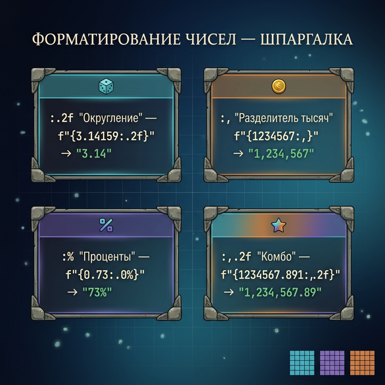
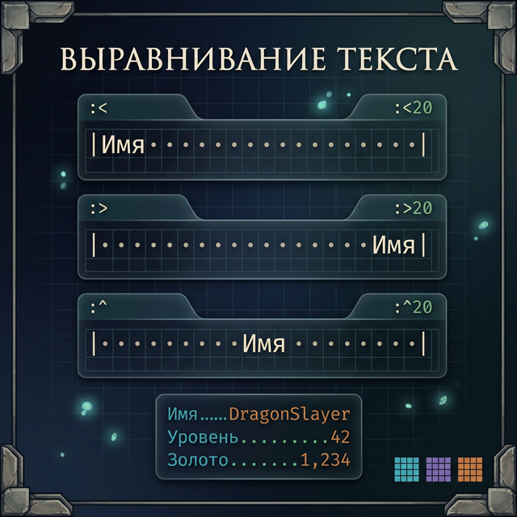
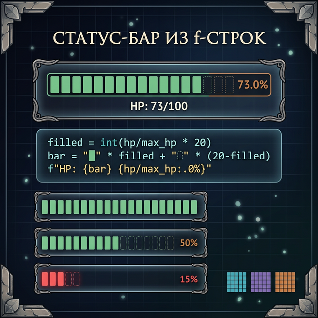
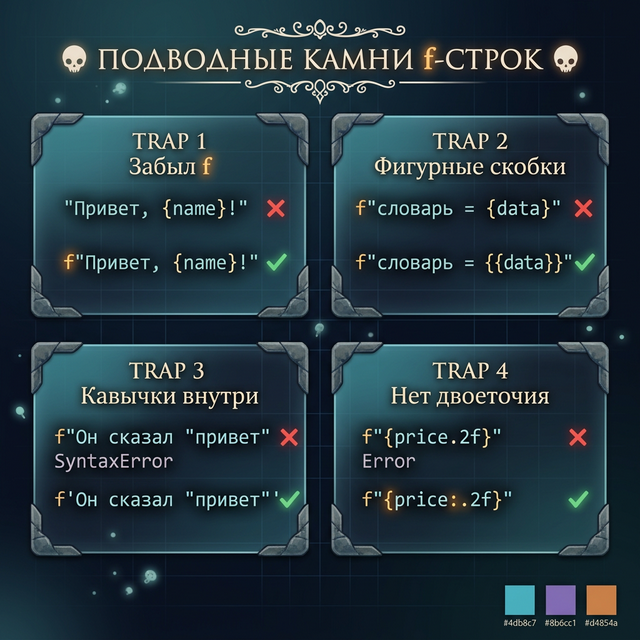

# Day 5: f-строки — продвинутое форматирование

> **Новые концепции сегодня:** вставка выражений в f-строки, форматирование чисел (`.2f`, `:,`), выравнивание текста (`:<`, `:>`, `:^`)
>
> **Время:** ~35 минут (теория + практика)

---

## Часть 1. Что мы уже знаем и куда идём

В Day 1 мы познакомились с f-строками — способом вставлять переменные в текст через `f"..."` и `{}`:

```python
name = "Steve"
print(f"Привет, {name}!")    # Привет, Steve!
```

Этого достаточно для простого вывода: вставили переменную, получили текст. Но представь, что ты делаешь таблицу рекордов RPG. Тебе нужно, чтобы имена и числа стояли ровными столбцами. Или ты считаешь процент здоровья — и получаешь `41.269841269841265%` вместо красивого `41.3%`.

Для всего этого f-строки имеют **форматирование** — специальный синтаксис после двоеточия `:` внутри `{}`. Сегодня мы разберём три суперспособности:

1. **Выражения** внутри `{}` — вычисления, вызовы методов
2. **Форматирование чисел** — округление, разделители тысяч
3. **Выравнивание текста** — ровные столбцы и таблицы

---

## Часть 2. Базовые f-строки

### Вставка переменных (повторение)

Напомним базу. В f-строке `{}` заменяется на значение переменной:

```python
boss = "Nameless King"
attempts = 47
print(f"Босс: {boss}")
print(f"Попыток: {attempts}")
print(f"Я умер от {boss} {attempts} раз")
```

**Вывод:**
```
Босс: Nameless King
Попыток: 47
Я умер от Nameless King 47 раз
```

Можно вставлять сколько угодно переменных — каждая пара `{}` будет заменена.

### Вставка выражений

А вот что делает f-строки по-настоящему мощными: внутри `{}` можно писать **любые выражения** Python — не только имена переменных, но и вычисления:

```python
hp = 85
max_hp = 100
print(f"HP: {hp}/{max_hp}")
print(f"Процент: {hp / max_hp * 100}%")
print(f"Осталось: {max_hp - hp} HP")
```

**Вывод:**
```
HP: 85/100
Процент: 85.0%
Осталось: 15 HP
```

Что произошло в строке `f"Процент: {hp / max_hp * 100}%"`? Python:
1. Увидел `{hp / max_hp * 100}`
2. Вычислил: `85 / 100 * 100` = `85.0`
3. Вставил результат в строку: `"Процент: 85.0%"`

Ты можешь писать внутри `{}` что угодно: сложение, вычитание, умножение, деление, сравнения — всё, что возвращает значение.

### Вызов методов внутри f-строки

Можно даже вызывать методы строк и функции прямо внутри `{}`:

```python
name = "dark souls"
print(f"Игра: {name.upper()}")
print(f"Длина: {len(name)} символов")
print(f"Первая буква: {name[0].upper()}")
```

**Вывод:**
```
Игра: DARK SOULS
Длина: 10 символов
Первая буква: D
```

Здесь `{name.upper()}` вызывает метод `upper()` на строке `name` и вставляет результат. А `{len(name)}` вызывает функцию `len()` и вставляет число `10`.

### Пример: карточка персонажа

Комбинируем всё вместе — переменные, выражения, f-строки:

```python
name = "Chosen Undead"
level = 42
hp = 850
stamina = 120

print(f"=== {name} ===")
print(f"Уровень: {level}")
print(f"HP: {hp}")
print(f"Выносливость: {stamina}")
print(f"Всего очков: {hp + stamina}")
```

**Вывод:**
```
=== Chosen Undead ===
Уровень: 42
HP: 850
Выносливость: 120
Всего очков: 970
```

Обрати внимание на `{hp + stamina}` — Python вычислил `850 + 120 = 970` и вставил результат.

### Попробуй сам

Открой Python и поэкспериментируй:

```python
a = 10
b = 3
print(f"{a} + {b} = {a + b}")
print(f"{a} * {b} = {a * b}")
print(f"{a} / {b} = {a / b}")
```

Что получится при делении? Число будет не очень красивым — `3.3333333333333335`. Дальше мы научимся его округлять!

---

## Часть 3. Форматирование чисел

### Проблема: некрасивые числа

Дробные числа в Python часто выглядят ужасно:

```python
print(10 / 3)    # 3.3333333333333335
print(100 / 7)   # 14.285714285714286
```

Показывать пользователю `3.3333333333333335` — плохо. В игре процент здоровья должен быть `41.3%`, а не `41.269841269841265%`. Для этого в f-строках есть **формат округления**.

### Округление дробных чисел

Внутри `{}` после **двоеточия** можно указать формат. Для дробных чисел это `.Nf`, где `N` — количество знаков после точки:

```python
damage = 156.7891
print(f"Урон: {damage}")        # 156.7891 — некрасиво
print(f"Урон: {damage:.1f}")    # 156.8 — один знак после точки
print(f"Урон: {damage:.2f}")    # 156.79 — два знака
print(f"Урон: {damage:.0f}")    # 157 — без дробной части (округлено)
```

Давай разберём запись `{damage:.2f}`:

```
{damage  :  .2  f}
   │     │  │   │
   │     │  │   └── f = float (дробное число)
   │     │  └────── .2 = два знака после точки
   │     └───────── : = начало формата (отделяет значение от настроек)
   └─────────────── переменная, которую форматируем
```

Ключевой символ — **двоеточие `:`**. Всё до двоеточия — это значение, всё после — формат отображения.

### Пример: процент здоровья

```python
hp = 73
max_hp = 100
percent = hp / max_hp * 100
print(f"Здоровье: {percent:.1f}%")    # "Здоровье: 73.0%"
```

```python
hp = 234
max_hp = 567
percent = hp / max_hp * 100
print(f"Здоровье: {percent:.1f}%")    # "Здоровье: 41.3%"
```

### Попробуй сам

Поэкспериментируй с разным количеством знаков:

```python
pi = 3.141592653589793
print(f"pi = {pi:.0f}")    # 3 — целое число
print(f"pi = {pi:.1f}")    # 3.1
print(f"pi = {pi:.2f}")    # 3.14
print(f"pi = {pi:.4f}")    # 3.1416 (округлено!)
print(f"pi = {pi:.10f}")   # 3.1415926536
```

Заметь: Python **округляет** последний знак по правилам математики (5 и выше → вверх).

### Разделители тысяч

Большие числа трудно читать: `1000000` — это миллион или сто тысяч? Непонятно! В f-строках можно добавить разделители тысяч:

```python
gold = 1234567
print(f"Золота: {gold}")          # 1234567 — трудно прочитать
print(f"Золота: {gold:,}")        # 1,234,567 — сразу видно: миллион с хвостиком
print(f"Золота: {gold:_}")        # 1_234_567 — через подчёркивание
```

Формат `:,` — просто двоеточие и запятая. Python сам расставит запятые через каждые 3 цифры.

### Пример: Монополия — баланс игрока

```python
balance = 15750
print(f"Баланс: ${balance:,}")    # "Баланс: $15,750"
```

### Пример: Dark Souls — урон и HP

```python
boss_hp = 18750
player_damage = 1234
hits_needed = boss_hp / player_damage

print(f"HP босса: {boss_hp:,}")
print(f"Твой урон: {player_damage:,}")
print(f"Ударов нужно: {hits_needed:.1f}")
```

**Вывод:**
```
HP босса: 18,750
Твой урон: 1,234
Ударов нужно: 15.2
```

### Комбинирование форматов

Можно комбинировать разделители тысяч с округлением:

```python
price = 1234567.891
print(f"Цена: {price:,.2f}")    # "Цена: 1,234,567.89"
```

Порядок: сначала разделитель `,`, потом округление `.2f`.



<quiz>
Q: Что выведет `f"{3.14159:.2f}"`?
A: 3.14159
A: 3.14
A: 3.1
C: 3.14
E: .2f означает «дробное число (float), 2 знака после точки». Число округляется до 3.14.

Q: Как отформатировать число 1000000 с разделителями тысяч?
A: f"{1000000:.2f}"
A: f"{1000000:,}"
A: f"{1000000:>10}"
C: f"{1000000:,}"
E: Формат :, добавляет запятые как разделители тысяч: 1,000,000.

Q: Можно ли вставлять выражения внутрь f-строки?
A: Нет, только переменные
A: Да, любые выражения Python
A: Только числа
C: Да, любые выражения Python
E: Внутри {} можно писать вычисления, вызовы методов и любые выражения: f"{2 + 2}", f"{name.upper()}".
</quiz>

---

## Часть 4. Выравнивание текста

### Зачем нужно выравнивание?

Представь таблицу рекордов в игре. Без выравнивания:

```
1. Steve - 15000
2. Alex - 8500
3. DragonSlayer2007 - 125000
```

Числа «прыгают», читать неудобно. С выравниванием:

```
1. Steve              -  15,000
2. Alex               -   8,500
3. DragonSlayer2007   - 125,000
```

### Синтаксис выравнивания

После двоеточия `:` указываем **направление** и **ширину поля**:

```python
name = "Steve"
print(f"|{name}|")           # |Steve|          — без выравнивания
print(f"|{name:<20}|")       # |Steve               | — влево, ширина 20
print(f"|{name:>20}|")       # |               Steve| — вправо, ширина 20
print(f"|{name:^20}|")       # |       Steve        | — по центру, ширина 20
```

Разберём запись `{name:<20}`:

```
{name  :  <  20}
  │    │  │   │
  │    │  │   └── ширина поля = 20 символов
  │    │  └────── < = прижать текст к левому краю
  │    └───────── : = начало формата
  └────────────── переменная
```

Три направления выравнивания:
- `<` — **влево** (текст слева, пробелы справа) — по умолчанию для строк
- `>` — **вправо** (пробелы слева, текст справа) — по умолчанию для чисел
- `^` — **по центру** (пробелы с обеих сторон)

Ширина `20` означает: результат займёт ровно 20 символов. Если текст короче — остальное заполнится пробелами. Если текст длиннее 20 символов — он не обрежется, а просто выйдет за пределы.



### Заполнение символом

Вместо пробелов можно заполнять любым символом:

```python
title = "DARK SOULS"
print(f"{title:=^30}")     # ==========DARK SOULS==========
print(f"{title:-^30}")     # ----------DARK SOULS----------
print(f"{title:*^30}")     # **********DARK SOULS**********
```

### Пример: таблица рекордов RPG

```python
print(f"{'ТАБЛИЦА РЕКОРДОВ':=^40}")
print(f"{'Имя':<20} {'Очки':>10}")
print(f"{'-' * 31}")
print(f"{'DragonSlayer':.<20} {'15,000':>10}")
print(f"{'Steve':.<20} {'8,500':>10}")
print(f"{'Alex':.<20} {'3,200':>10}")
```

**Вывод:**
```
============ТАБЛИЦА РЕКОРДОВ============
Имя                       Очки
-------------------------------
DragonSlayer........     15,000
Steve...............      8,500
Alex................      3,200
```

### Пример: статус-бар здоровья

```python
hp = 65
max_hp = 100
bar_length = 20

filled = int(hp / max_hp * bar_length)
empty = bar_length - filled

bar = "█" * filled + "░" * empty
print(f"HP [{bar}] {hp}/{max_hp}")
```

**Вывод:**
```
HP [█████████████░░░░░░░] 65/100
```



### Пример: расписание в планировщике

```python
print(f"{'ЗАДАЧА':<30} {'СТАТУС':>10}")
print(f"{'-' * 41}")
print(f"{'Купить молоко':<30} {'Готово':>10}")
print(f"{'Сделать домашку по матем.':<30} {'В работе':>10}")
print(f"{'Почитать Python':<30} {'Не начато':>10}")
```

**Вывод:**
```
ЗАДАЧА                              СТАТУС
-----------------------------------------
Купить молоко                       Готово
Сделать домашку по матем.         В работе
Почитать Python                   Не начато
```

<quiz>
Q: Что делает `f"{name:<20}"`?
A: Обрезает строку до 20 символов
A: Выравнивает текст влево в поле шириной 20 символов
A: Добавляет 20 пробелов слева
C: Выравнивает текст влево в поле шириной 20 символов
E: < означает «выравнивание влево», 20 — ширина поля. Пустое место заполняется пробелами справа.

Q: Как заполнить пустое пространство символом `=` при центрировании?
A: f"{text:=^30}"
A: f"{text:^30=}"
A: f"{text:=30}"
C: f"{text:=^30}"
E: Символ заполнения ставится перед знаком выравнивания: =^30 — заполнить «=», центрировать, ширина 30.
</quiz>

---

## Часть 5. Подводные камни

### Камень 1: не забудь букву `f`

Самая частая ошибка новичков — забыть букву `f` перед кавычками:

```python
name = "Steve"
print("Привет, {name}!")     # "Привет, {name}!" — без f фигурные скобки выводятся буквально!
print(f"Привет, {name}!")    # "Привет, Steve!" — с f всё работает
```

Почему это коварная ошибка? Потому что **Python не выдаёт ошибку**. Код работает, просто выводит не то, что ты хотел. Строка без `f` — это обычная строка, и `{name}` — просто текст.

**Как заметить?** Если в выводе видишь фигурные скобки — первым делом проверь, есть ли `f` перед кавычками.

### Камень 2: фигурные скобки внутри f-строки

Что если ты хочешь вывести сами символы `{` и `}`? Например, объяснить, как выглядит словарь в Python?

Если просто написать `{`, Python подумает, что ты начинаешь вставку переменной, и выдаст ошибку. Решение — **удвоить скобки**:

```python
print(f"Словарь в Python: {{}}")    # "Словарь в Python: {}"
print(f"Множество: {{1, 2, 3}}")    # "Множество: {1, 2, 3}"
```

Логика: `{{` — это «экранированная» скобка, Python понимает, что ты хочешь вывести символ `{`, а не начать вставку.

**Когда это пригодится?** Когда будешь объяснять кому-то Python или выводить JSON-подобные данные.

### Камень 3: кавычки внутри f-строки

Если f-строка обёрнута в двойные кавычки `"`, внутри `{}` **нельзя** использовать такие же двойные кавычки — Python запутается, где заканчивается строка:

```python
items = ['меч', 'щит']
print(f"Первый предмет: {items[0]}")    # ✅ Работает — нет конфликта кавычек
# print(f"Предмет: {"меч"}")            # ❌ ОШИБКА! Python видит конец строки на второй "
```

**Правило:** если f-строка в двойных кавычках — внутри `{}` используй одинарные, и наоборот:

```python
name = "Steve"
print(f"Привет, {name.replace('e', 'a')}")    # ✅ Одинарные внутри двойных
```

### Камень 4: форматирование без двоеточия

Частая ошибка — забыть двоеточие перед форматом:

```python
x = 3.14159
# print(f"Число: {x.2f}")     # ❌ ОШИБКА! Python ищет атрибут .2f у числа
print(f"Число: {x:.2f}")      # ✅ Правильно — двоеточие отделяет значение от формата
```

**Запомни:** двоеточие `:` — обязательный разделитель между переменной и форматом. Без него Python пытается прочитать `.2f` как атрибут объекта и выдаёт `AttributeError`.



---

## Часть 6. Практика — теперь ты!

Пришло время собрать всё вместе. В каждом задании тебе понадобятся разные навыки из сегодняшнего урока: вставка выражений, форматирование чисел и выравнивание. Задания идут от простого к сложному.

### Задание 1: Визитка персонажа (разминка)

Напиши программу, которая спрашивает имя, класс и уровень персонажа, и выводит красивую визитку:

```
Имя: Артас
Класс: Рыцарь Смерти
Уровень: 80

╔══════════════════════╗
║     Артас            ║
║     Рыцарь Смерти    ║
║     Уровень: 80      ║
╚══════════════════════╝
```

<details>
<summary>Подсказка</summary>

Используй `f"{значение:^20}"` для центрирования. Рамку можно сделать из символов `╔`, `═`, `╗`, `║`, `╚`, `╝`.

</details>

<details>
<summary>Решение</summary>

```python
name = input("Имя: ")
char_class = input("Класс: ")
level = input("Уровень: ")

width = 24
print(f"╔{'═' * width}╗")
print(f"║{name:^{width}}║")
print(f"║{char_class:^{width}}║")
print(f"║{f'Уровень: {level}':^{width}}║")
print(f"╚{'═' * width}╝")
```

</details>

---

### Задание 2: Таблица инвентаря

У тебя есть инвентарь (строка через запятую). Выведи его в виде таблицы с номерами:

```python
inventory = "Diamond Sword, Iron Shield, Health Potion, Golden Key, Magic Ring"
```

Ожидаемый результат:
```
╔════╦════════════════════╗
║  # ║ Предмет            ║
╠════╬════════════════════╣
║  1 ║ Diamond Sword      ║
║  2 ║ Iron Shield        ║
║  3 ║ Health Potion      ║
║  4 ║ Golden Key         ║
║  5 ║ Magic Ring         ║
╚════╩════════════════════╝
```

<details>
<summary>Подсказка</summary>

Используй `split(",")` для разбиения, `strip()` для очистки пробелов, `f"{i:>2}"` для номера и `f"{item:<18}"` для имени предмета.

</details>

<details>
<summary>Решение</summary>

```python
inventory = "Diamond Sword, Iron Shield, Health Potion, Golden Key, Magic Ring"
items = inventory.split(",")

print(f"╔════╦{'═' * 20}╗")
print(f"║{'#':^4}║{'Предмет':<20}║")
print(f"╠════╬{'═' * 20}╣")

for i in range(len(items)):
    item = items[i].strip()
    print(f"║{i + 1:>3} ║ {item:<19}║")

print(f"╚════╩{'═' * 20}╝")
```

</details>

---

### Задание 3: Статус-бар босса (мини-проект)

Напиши программу, которая показывает статус-бар здоровья босса. Пользователь вводит текущее и максимальное HP, программа рисует бар:

```
Имя босса: Nameless King
Текущее HP: 3500
Максимальное HP: 8000

╔══════════════════════════════╗
║      Nameless King           ║
║  HP [████████░░░░░░░░░░░░]   ║
║     3,500 / 8,000 (43.8%)   ║
╚══════════════════════════════╝
```

<details>
<summary>Подсказка</summary>

1. Процент: `hp / max_hp * 100`
2. Заполненная часть: `int(hp / max_hp * bar_length)` — символ `█`
3. Пустая часть: `bar_length - filled` — символ `░`
4. Форматирование: `{hp:,}` для разделителя тысяч, `{percent:.1f}` для процента

</details>

<details>
<summary>Решение</summary>

```python
boss = input("Имя босса: ")
hp = int(input("Текущее HP: "))
max_hp = int(input("Максимальное HP: "))

bar_length = 20
filled = int(hp / max_hp * bar_length)
empty = bar_length - filled
bar = "█" * filled + "░" * empty
percent = hp / max_hp * 100

width = 32
print(f"╔{'═' * width}╗")
print(f"║{boss:^{width}}║")
print(f"║{'HP [' + bar + ']':^{width}}║")

stats = f"{hp:,} / {max_hp:,} ({percent:.1f}%)"
print(f"║{stats:^{width}}║")
print(f"╚{'═' * width}╝")
```

</details>

---

## Часть 7. Итоги дня

Сегодня ты научился делать красивый вывод с помощью f-строк. Давай соберём все инструменты в одну шпаргалку:

### Шпаргалка: все форматы f-строк

| Синтаксис | Что делает | Пример | Результат |
|:----------|:-----------|:-------|:----------|
| `f"{x}"` | Вставить переменную | `f"HP: {hp}"` | `HP: 85` |
| `f"{x + y}"` | Вставить выражение | `f"Всего: {10 + 5}"` | `Всего: 15` |
| `f"{x:.2f}"` | Округлить до N знаков | `f"{3.14159:.2f}"` | `3.14` |
| `f"{x:.0f}"` | Дробное → целое | `f"{3.7:.0f}"` | `4` |
| `f"{x:,}"` | Разделители тысяч | `f"{1000000:,}"` | `1,000,000` |
| `f"{x:,.2f}"` | Тысячи + округление | `f"{1234.5678:,.2f}"` | `1,234.57` |
| `f"{x:<20}"` | Выравнивание влево | `f"{'hi':<10}"` | `hi________` |
| `f"{x:>20}"` | Выравнивание вправо | `f"{'hi':>10}"` | `________hi` |
| `f"{x:^20}"` | По центру | `f"{'hi':^10}"` | `____hi____` |
| `f"{x:=^20}"` | Заполнение символом | `f"{'hi':=^10}"` | `====hi====` |

*(подчёркивания `_` в таблице обозначают пробелы)*

### Общий синтаксис формата

Все форматы записываются по одной схеме:

```
{переменная:заполнитель выравнивание ширина ,разделитель .точность тип}
```

Не нужно запоминать всё сразу! Главное — помни, что **двоеточие `:` отделяет переменную от формата**, и что самые полезные форматы:
- `.2f` — округление
- `,` — тысячи
- `<20` / `>20` / `^20` — выравнивание

### Главные правила

1. **Не забывай `f`** — без буквы `f` перед кавычками `{name}` выведется буквально
2. **Двоеточие обязательно** — `{x:.2f}`, а не `{x.2f}`
3. **Внутри `{}` — любые выражения** — `{a + b}`, `{name.upper()}`, `{len(items)}`
4. **Удвой скобки для вывода** — `{{` выведет `{`, `}}` выведет `}`
5. **Кавычки не должны конфликтовать** — если строка в `"`, внутри `{}` используй `'`

### Что мы теперь умеем (Week 1, Days 1–5)

За пять дней ты освоил мощный набор инструментов для работы со строками:

| День | Чему научился | Суперспособность |
|:-----|:-------------|:-----------------|
| Day 1 | Индексация | Доставать любой символ: `s[0]`, `s[-1]` |
| Day 2 | Срезы | Вырезать кусок строки: `s[2:5]`, `s[::-1]` |
| Day 3 | Методы | Трансформировать строку: `strip()`, `replace()`, `find()` |
| Day 4 | split/join | Разбирать и собирать текст: `split()`, `join()` |
| Day 5 | f-строки | Красиво выводить: `{x:.2f}`, `{x:>20}` |

**Завтра:** практикум! Собираем парсер игрового чата — всё, что мы учили за неделю, в одном проекте. Это будет твой первый настоящий проект, где все 5 дней знаний работают вместе.
