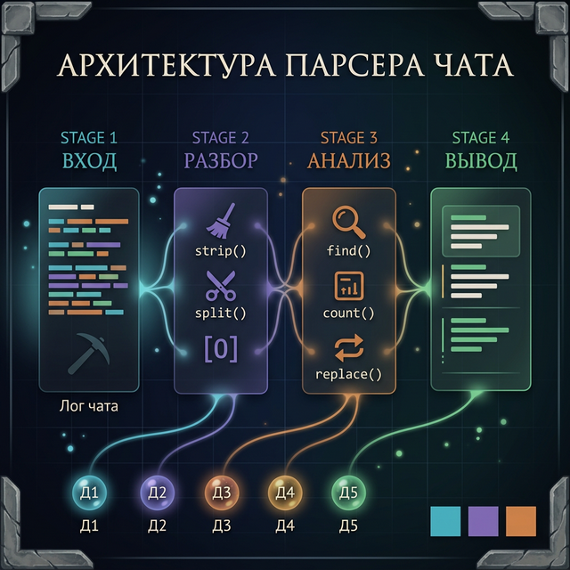
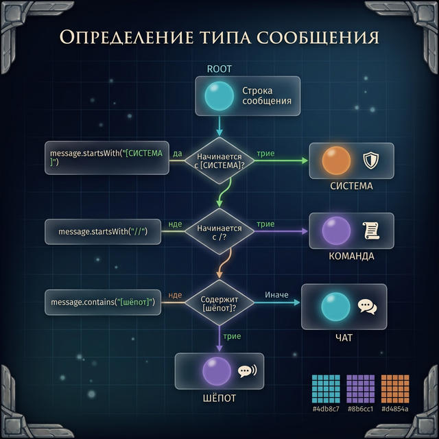
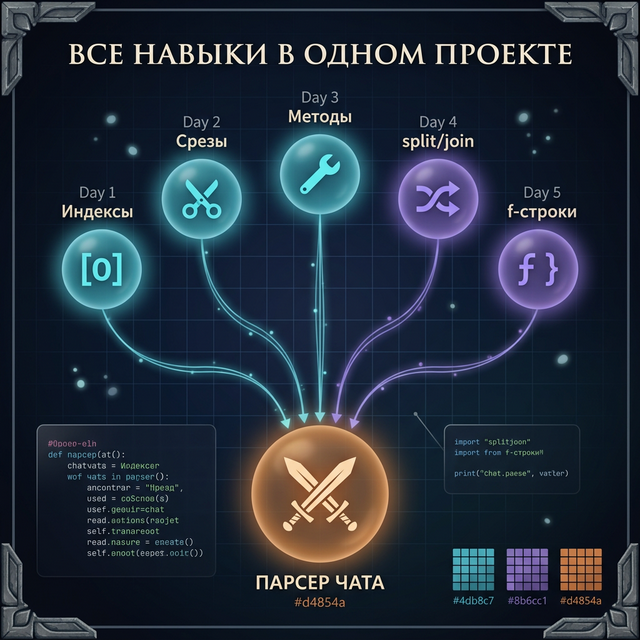

# Day 6: Практикум — парсер игрового чата

> **Сегодня:** применяем всё, что узнали за неделю, в одном проекте
>
> **Время:** ~45 минут

### Зачем этот урок?

За последние 5 дней ты изучил кучу отдельных инструментов: срезы, `split()`, `find()`, f-строки... Но изучать молоток, отвёртку и пилу по отдельности — это одно. А **собрать из досок полку** — совсем другое.

Сегодня ты собираешь полку. Ты возьмёшь **все навыки недели** и объединишь их в один настоящий проект — парсер игрового чата. Это не учебное упражнение — это реальная задача, с которой сталкиваются разработчики моддингового инструментария.

---

## Часть 1. Задача

### Контекст

Представь, что ты разрабатываешь мод для Minecraft или другой игры. Тебе нужно анализировать лог чата — файл, в котором записаны все сообщения игроков.

**Что такое лог?** Это как история чата: каждое действие записывается в файл строчка за строчкой. Серверы Minecraft ведут такие логи, чтобы администраторы могли потом проверить — кто что писал, кто использовал команды, кто кого убил.

**Что такое парсер?** Слово «parse» (англ.) означает «разбирать по частям». Парсер — это программа, которая берёт сырой текст и превращает его в структурированные данные. Примеры парсеров вокруг тебя:
- Браузер **парсит** HTML-код и показывает красивую страницу
- Minecraft **парсит** команду `/tp Steve 100 64 -200` и понимает: «телепортировать Steve на координаты 100, 64, -200»
- Discord **парсит** сообщение `@everyone` и понимает, что нужно уведомить всех

Вот пример лога. Обрати внимание: тройные кавычки `"""` позволяют записать строку на нескольких строках — это удобно для длинных текстов.

```python
chat_log = """[12:05] <Steve> Привет всем!
[12:06] <Alex> Привет! Кто хочет в шахту?
[12:06] * Steve нашёл алмаз
[12:07] <Notch> /tp Steve 100 64 -200
[12:08] <Alex> лол лол лол
[12:08] <Steve> @Alex Иду к тебе!
[12:09] * Alex убит Creeper
[12:10] <Steve> /help
[12:11] <Notch> Всем хорошей игры!"""
```

Давай разберёмся, что здесь записано. Каждая строка лога имеет определённую структуру:

```
Тип 1 — Обычное сообщение:
[12:05] <Steve> Привет всем!
│    │  │     │ └── Текст сообщения
│    │  │     └──── Закрывающая скобка ника
│    │  └────────── Ник игрока
│    └───────────── Закрывающая скобка времени
└────────────────── Время

Тип 2 — Системное событие:
[12:06] * Steve нашёл алмаз
│    │  │ │     │
│    │  │ │     └── Что произошло
│    │  │ └──────── Ник игрока
│    │  └────────── Звёздочка = системное событие
│    └───────────── Закрывающая скобка
└────────────────── Время

Тип 3 — Команда (текст начинается с /):
[12:07] <Notch> /tp Steve 100 64 -200

Тип 4 — Шёпот (текст начинается с @):
[12:08] <Steve> @Alex Иду к тебе!
```

### Что нужно сделать

Написать парсер, который:
1. Разбивает лог на отдельные строки
2. Для каждой строки определяет тип (сообщение, системное событие, команда, шёпот)
3. Извлекает время, автора и текст
4. Считает статистику: кто сколько сообщений написал, сколько команд, сколько системных событий
5. Выводит красивый отчёт

### Что ты используешь из этой недели

| День | Навык | Как используется |
|:-----|:------|:-----------------|
| Day 1 | Индексация, `len()` | Проверка первого символа, длина сообщений |
| Day 2 | Срезы | Вырезание времени, ника |
| Day 3 | `strip()`, `lower()`, `find()`, `count()`, `replace()` | Очистка, поиск, подсчёт |
| Day 4 | `split()`, `join()` | Разбиение строк на части |
| Day 5 | f-строки, выравнивание | Красивый вывод отчёта |

**Другими словами:** ни один день не был лишним. Каждый навык пригодится.



---

## Часть 2. Пошаговое решение

Мы не будем писать весь парсер сразу — это слишком сложно. Вместо этого мы пойдём **шаг за шагом**: сначала сделаем что-то простое, проверим, а потом добавим следующий кусок.

Это называется **инкрементальная разработка** — так работают профессиональные программисты. Никто не пишет 50 строк кода сразу — пишут по 5 строк, проверяют, потом ещё 5.

### Шаг 1: Разбиваем лог на строки

**Зачем?** Лог — это один большой текст. Чтобы анализировать каждое сообщение, нам нужно сначала разделить его на отдельные строки. Это как разрезать длинную ленту на карточки — с каждой карточкой удобнее работать.

```python
chat_log = """[12:05] <Steve> Привет всем!
[12:06] <Alex> Привет! Кто хочет в шахту?
[12:06] * Steve нашёл алмаз
[12:07] <Notch> /tp Steve 100 64 -200
[12:08] <Alex> лол лол лол
[12:08] <Steve> @Alex Иду к тебе!
[12:09] * Alex убит Creeper
[12:10] <Steve> /help
[12:11] <Notch> Всем хорошей игры!"""

lines = chat_log.strip().split("\n")
print(f"Всего строк в логе: {len(lines)}")
```

**Что делает Python пошагово?**

```
1. chat_log.strip()
   Убирает пробелы и переносы строк в начале и конце текста.
   Зачем? Тройные кавычки """ могут добавить лишний
   перенос строки в начале — strip() его уберёт.

2. .split("\n")
   Разрезает текст по символу переноса строки \n.
   Каждая строка лога становится отдельным элементом списка.

   До split:    "строка1\nстрока2\nстрока3"
   После split: ["строка1", "строка2", "строка3"]

3. len(lines)
   Считает, сколько элементов в списке = сколько строк в логе.
```

**Вывод:**
```
Всего строк в логе: 9
```

> **Попробуй сам:** Добавь строку `print(lines[0])` после split. Что выведет Python? А `print(lines[-1])`? Попробуй угадать, потом проверь.

### Шаг 2: Извлекаем время из каждой строки

**Зачем?** Время — это первое, что нам нужно из каждой строки. Зная формат `[ЧЧ:ММ]`, мы можем точно вырезать его срезом.

Время всегда в формате `[ЧЧ:ММ]` — первые 7 символов:

Давай посмотрим на индексы символов в строке:

```
Строка:  [ 1 2 : 0 5 ]   < S t  e  v  e  >     П  р  и  ...
Индекс:  0 1 2 3 4 5 6 7  8 9 10 11 12 13 14 15 16 17 18 ...
         ↑               ↑ ↑
     скобка [         скобка ]

line[1:6] → "12:05"    (символы с индекса 1 по 5)
line[8:]  → "<Steve> Привет всем!"   (всё начиная с индекса 8)
```

**Почему `[1:6]`, а не `[0:7]`?** Потому что нам не нужны сами квадратные скобки `[` и `]` — только время внутри них.

**Почему `[8:]`?** После `]` идёт пробел (индекс 7), а после пробела — содержимое сообщения (индекс 8).

```python
for line in lines:
    time = line[1:6]    # Берём "12:05" (без скобок)
    rest = line[8:]     # Всё после "] "
    print(f"Время: {time} | Остаток: {rest}")
```

**Вывод:**
```
Время: 12:05 | Остаток: <Steve> Привет всем!
Время: 12:06 | Остаток: <Alex> Привет! Кто хочет в шахту?
Время: 12:06 | Остаток: * Steve нашёл алмаз
...
```

> **Попробуй сам:** Что будет, если написать `line[0:7]` вместо `line[1:6]`? Попробуй и посмотри разницу.

### Шаг 3: Определяем тип сообщения

**Зачем?** Мы хотим обрабатывать разные типы сообщений по-разному. Чтобы посчитать команды — нужно знать, где команда. Чтобы посчитать системные события — нужно их отличить. А для этого надо определить тип каждой строки.

**Как мы определяем тип?** Смотрим на **первый символ** после времени:

```
rest = "<Steve> Привет всем!"    →  rest[0] == "<"  →  сообщение игрока
rest = "* Steve нашёл алмаз"     →  rest[0] == "*"  →  системное событие
```

Если это сообщение игрока (`<Ник> текст`), дальше смотрим на **первый символ текста**:

```
text = "Привет всем!"             →  обычный ЧАТ
text = "/tp Steve 100 64 -200"    →  text[0] == "/"  →  КОМАНДА
text = "@Alex Иду к тебе!"        →  text[0] == "@"  →  ШЁПОТ
```

Вот дерево решений нашего парсера:

```
Строка лога
│
├── rest начинается с "*"?
│   └── ДА → тип: СИСТЕМА
│         └── Формат: "* Ник действие"
│
├── rest начинается с "<"?
│   └── ДА → это сообщение игрока
│         └── Текст начинается с "/" → КОМАНДА
│         └── Текст начинается с "@" → ШЁПОТ
│         └── Иначе                  → ЧАТ
│
└── Ничего не подошло?
    └── тип: НЕИЗВЕСТНО
```

Теперь код. Давай разберём каждую ветку:

```python
for line in lines:
    time = line[1:6]
    rest = line[8:]

    if rest[0] == "*":
        msg_type = "СИСТЕМА"
        # Формат: "* Ник действие"
        parts = rest[2:].split(" ", 1)
        author = parts[0]
        if len(parts) > 1:
            text = parts[1]
        else:
            text = ""
    elif rest[0] == "<":
        # Формат: "<Ник> текст"
        close_bracket = rest.find(">")
        author = rest[1:close_bracket]
        text = rest[close_bracket + 2:]

        if text[0:1] == "/":
            msg_type = "КОМАНДА"
        elif text[0:1] == "@":
            msg_type = "ШЁПОТ"
        else:
            msg_type = "ЧАТ"
    else:
        msg_type = "НЕИЗВЕСТНО"
        author = "?"
        text = rest

    print(f"[{time}] {msg_type:>8} | {author:<10} | {text}")
```

Здесь много нового — давай разберём каждую ветку подробно.

**Ветка `rest[0] == "*"` (системное событие):**

```
rest = "* Steve нашёл алмаз"

Шаг 1: rest[2:] → "Steve нашёл алмаз"
        (пропускаем "* " — звёздочку и пробел)

Шаг 2: "Steve нашёл алмаз".split(" ", 1)
                                      ↑
                      Этот параметр означает:
                      "раздели максимум 1 раз"

        Результат: ["Steve", "нашёл алмаз"]

        Без параметра 1 было бы:
        ["Steve", "нашёл", "алмаз"]  ← текст разбился бы

Шаг 3: parts[0] → "Steve"     ← это автор
        parts[1] → "нашёл алмаз"  ← это текст
```

**Почему `split(" ", 1)`, а не просто `split(" ")`?** Потому что текст действия может содержать пробелы: «нашёл алмаз» — это два слова. Если разделить без ограничения, текст разобьётся на куски. С параметром `1` мы делим строку **только по первому пробелу**.

**Ветка `rest[0] == "<"` (сообщение игрока):**

```
rest = "<Steve> Привет всем!"

Шаг 1: rest.find(">") → 6
        Ищем позицию закрывающей скобки ">"
        < S t e v e >
        0 1 2 3 4 5 6

Шаг 2: rest[1:6] → "Steve"
        Вырезаем ник: от символа после "<" до символа перед ">"

Шаг 3: rest[6 + 2:] → rest[8:] → "Привет всем!"
        Пропускаем "> " (закрывающую скобку + пробел)
```

**Зачем `find(">")`?** Потому что у разных игроков ники разной длины: `<Alex>` — 6 символов, `<Steve>` — 7, `<Notch>` — 7. Мы не можем просто написать `rest[1:5]` — это подойдёт только для 4-буквенных ников. `find(">")` находит скобку **независимо от длины ника**.

**Почему `text[0:1]`, а не `text[0]`?**

Это **безопасный срез** — важный приём, который спасает от ошибки:

```
text = ""         (пустая строка — такое может быть!)

text[0]   → IndexError!  Программа упадёт с ошибкой
text[0:1] → ""           Вернёт пустую строку — без ошибки
```

Если текст пустой, `text[0]` вызовет ошибку `IndexError`, потому что нет нулевого символа. А срез `text[0:1]` безопасно вернёт пустую строку. Это как спросить «дай мне первую конфету из пустой коробки» — индексация скажет «ОШИБКА!», а срез просто протянет тебе пустую руку.

**Форматирование вывода: `{msg_type:>8}` и `{author:<10}`:**

```
f"[{time}] {msg_type:>8} | {author:<10} | {text}"

{msg_type:>8}  →  выравнивание ВПРАВО в поле шириной 8
     "ЧАТ"    →  "      ЧАТ"    (5 пробелов + ЧАТ)
  "СИСТЕМА"    →  " СИСТЕМА"     (1 пробел + СИСТЕМА)

{author:<10}   →  выравнивание ВЛЕВО в поле шириной 10
    "Steve"    →  "Steve     "   (Steve + 5 пробелов)
     "Alex"    →  "Alex      "   (Alex + 6 пробелов)
```

Это нужно, чтобы столбцы не прыгали и таблица была ровной.

**Вывод:**
```
[12:05]      ЧАТ | Steve      | Привет всем!
[12:06]      ЧАТ | Alex       | Привет! Кто хочет в шахту?
[12:06]  СИСТЕМА | Steve      | нашёл алмаз
[12:07]  КОМАНДА | Notch      | /tp Steve 100 64 -200
[12:08]      ЧАТ | Alex       | лол лол лол
[12:08]    ШЁПОТ | Steve      | @Alex Иду к тебе!
[12:09]  СИСТЕМА | Alex       | убит Creeper
[12:10]  КОМАНДА | Steve      | /help
[12:11]      ЧАТ | Notch      | Всем хорошей игры!
```

Видишь, как красиво выстроились столбцы? Это заслуга выравнивания в f-строках.



> **Попробуй сам:** Измени ширину выравнивания — поставь `{msg_type:>12}` вместо `{msg_type:>8}`. Что изменится? А если `{author:<5}`?

### Шаг 4: Считаем статистику

**Зачем?** Парсер, который просто переформатирует текст, — это полезно, но мало. Администратор сервера хочет видеть **итоги**: сколько было сообщений? Кто самый активный? Сколько команд использовали? Это и есть статистика.

**Идея подсчёта по игрокам через строку:** Мы ещё не знаем словари (это тема следующих недель), поэтому используем хитрый трюк — собираем все ники в одну строку через запятую, а потом считаем, сколько раз каждый ник встречается.

```
Проход по циклу:
  Строка 1: author = "Steve"  → player_messages = "Steve,"
  Строка 2: author = "Alex"   → player_messages = "Steve,Alex,"
  Строка 4: author = "Notch"  → player_messages = "Steve,Alex,Notch,"
  Строка 5: author = "Alex"   → player_messages = "Steve,Alex,Notch,Alex,"
  ...и так далее

Потом: "Steve,Alex,Notch,Alex,...".count("Steve,") → 3
       "Steve,Alex,Notch,Alex,...".count("Alex,")  → 2
```

**Почему `count("Steve,")` с запятой, а не просто `count("Steve")`?** Потому что без запятой `count` может найти «Steve» внутри другого ника — например, если бы был игрок «SteveWarrior», слово «Steve» нашлось бы и в нём. Запятая работает как **разделитель**, гарантируя точный подсчёт.

```python
total_messages = 0
total_commands = 0
total_system = 0
total_whispers = 0
player_messages = ""    # Будем хранить ники через запятую для подсчёта

for line in lines:
    time = line[1:6]
    rest = line[8:]

    if rest[0] == "*":
        total_system = total_system + 1
        parts = rest[2:].split(" ", 1)
        author = parts[0]
    elif rest[0] == "<":
        close_bracket = rest.find(">")
        author = rest[1:close_bracket]
        text = rest[close_bracket + 2:]

        if text[0:1] == "/":
            total_commands = total_commands + 1
        elif text[0:1] == "@":
            total_whispers = total_whispers + 1
        else:
            total_messages = total_messages + 1

        player_messages = player_messages + author + ","

# Подсчёт сообщений по игрокам
print(f"\n{'СТАТИСТИКА':=^40}")
print(f"Сообщений в чате: {total_messages}")
print(f"Команд: {total_commands}")
print(f"Системных событий: {total_system}")
print(f"Шёпотов: {total_whispers}")
print(f"Всего записей: {len(lines)}")

# Кто сколько раз написал?
print(f"\n{'ПО ИГРОКАМ':=^40}")
for player in ["Steve", "Alex", "Notch"]:
    count = player_messages.count(player + ",")
    print(f"  {player:<15} {count} сообщений")
```

**Что делает `{'СТАТИСТИКА':=^40}`?**

```
{ 'СТАТИСТИКА' : = ^ 40 }
  │              │ │  │
  │              │ │  └── общая ширина: 40 символов
  │              │ └───── ^ = по центру
  │              └─────── = = заполнить символом "="
  └────────────────────── текст

Результат: "===============СТАТИСТИКА==============="
           |<------------ 40 символов ----------->|
```

**Вывод:**
```
===============СТАТИСТИКА===============
Сообщений в чате: 4
Команд: 2
Системных событий: 2
Шёпотов: 1
Всего записей: 9

==============ПО ИГРОКАМ================
  Steve           3 сообщений
  Alex            2 сообщений
  Notch           2 сообщений
```

**Проверка: всё сходится?**

```
Сообщений: 4 (ЧАТ) + 2 (КОМАНДА) + 1 (ШЁПОТ) + 2 (СИСТЕМА) = 9
Всего записей: 9  ✓

По игрокам: 3 + 2 + 2 = 7  (а не 9, потому что
системные события не считаются в player_messages —
мы добавляем ник только в ветке elif rest[0] == "<")
```

> **Попробуй сам:** Можешь ли ты модифицировать код так, чтобы системные события тоже считались в `player_messages`? Подсказка: нужно добавить одну строку в ветке `if rest[0] == "*"`.

### Шаг 5: Цензура (бонус)

**Зачем?** На игровых серверах часто нужно фильтровать нежелательные слова. Администраторы создают списки запрещённых слов и заменяют их на звёздочки. Мы сделаем простейшую версию такого фильтра.

Добавим цензуру слова «лол» и выведем очищенный лог:

```python
print(f"\n{'ОЧИЩЕННЫЙ ЛОГ':=^40}")

for line in lines:
    clean = line.replace("лол", "***")
    print(clean)
```

**Что делает Python:**

```
Было:   "[12:08] <Alex> лол лол лол"
                        ↓   ↓   ↓
replace("лол", "***")  каждое "лол" → "***"
                        ↓   ↓   ↓
Стало:  "[12:08] <Alex> *** *** ***"
```

`replace()` заменяет **все** вхождения, а не только первое — поэтому все три «лол» стали «***».

> **Попробуй сам:** Что будет, если в сообщении написано «ЛОЛ» (большими буквами)? Заменит ли `replace("лол", "***")` его? Подсказка: Python различает регистр. Как можно это исправить? (Вспомни `.lower()` из Дня 3.)

---

## Часть 3. Полный код проекта

Вот весь парсер целиком — собери его в один файл и запусти:

Прежде чем просто копировать, попробуй **собрать его сам** из частей выше. Открой пустой файл `chat_parser.py` и добавляй блоки по одному, запуская после каждого. Если что-то не работает — сравни с кодом ниже.

```
Структура полного кода:

┌─────────────────────────────────┐
│  1. Данные (chat_log)           │  ← Входные данные
├─────────────────────────────────┤
│  2. Переменные-счётчики         │  ← Подготовка к подсчёту
├─────────────────────────────────┤
│  3. Цикл: разбор каждой строки │  ← Основная логика
│     ├── определить тип          │
│     ├── извлечь автора и текст  │
│     ├── обновить счётчики       │
│     ├── применить цензуру       │
│     └── напечатать строку       │
├─────────────────────────────────┤
│  4. Вывод статистики            │  ← Результаты
└─────────────────────────────────┘
```

```python
# === ПАРСЕР ИГРОВОГО ЧАТА ===

chat_log = """[12:05] <Steve> Привет всем!
[12:06] <Alex> Привет! Кто хочет в шахту?
[12:06] * Steve нашёл алмаз
[12:07] <Notch> /tp Steve 100 64 -200
[12:08] <Alex> лол лол лол
[12:08] <Steve> @Alex Иду к тебе!
[12:09] * Alex убит Creeper
[12:10] <Steve> /help
[12:11] <Notch> Всем хорошей игры!"""

lines = chat_log.strip().split("\n")

# --- Статистика ---
total_chat = 0
total_commands = 0
total_system = 0
total_whispers = 0
player_messages = ""

# --- Разбор и вывод ---
print(f"{'РАЗБОР ЛОГА':=^50}")
print(f"{'Время':<8} {'Тип':>8} | {'Автор':<12} | Текст")
print("-" * 50)

for line in lines:
    time = line[1:6]
    rest = line[8:]

    if rest[0] == "*":
        msg_type = "СИСТЕМА"
        parts = rest[2:].split(" ", 1)
        author = parts[0]
        if len(parts) > 1:
            text = parts[1]
        else:
            text = ""
        total_system = total_system + 1
    elif rest[0] == "<":
        close_bracket = rest.find(">")
        author = rest[1:close_bracket]
        text = rest[close_bracket + 2:]

        if text[0:1] == "/":
            msg_type = "КОМАНДА"
            total_commands = total_commands + 1
        elif text[0:1] == "@":
            msg_type = "ШЁПОТ"
            total_whispers = total_whispers + 1
        else:
            msg_type = "ЧАТ"
            total_chat = total_chat + 1

        player_messages = player_messages + author + ","
    else:
        msg_type = "???"
        author = "?"
        text = rest

    # Цензура
    text = text.replace("лол", "***")

    print(f"[{time}] {msg_type:>8} | {author:<12} | {text}")

# --- Итоговая статистика ---
print(f"\n{'СТАТИСТИКА':=^50}")
print(f"  {'Сообщений в чате:':<25} {total_chat}")
print(f"  {'Команд:':<25} {total_commands}")
print(f"  {'Системных событий:':<25} {total_system}")
print(f"  {'Шёпотов:':<25} {total_whispers}")
print(f"  {'Всего записей:':<25} {len(lines)}")

print(f"\n{'ПО ИГРОКАМ':=^50}")
for player in ["Steve", "Alex", "Notch"]:
    count = player_messages.count(player + ",")
    bar = "█" * count + "░" * (5 - count)
    print(f"  {player:<15} [{bar}] {count}")
```

**Что делает визуальная шкала в конце?**

```
bar = "█" * count + "░" * (5 - count)

Если count = 3:
  "█" * 3  → "███"
  "░" * 2  → "░░"
  Итого:     "███░░"

Если count = 2:
  "█" * 2  → "██"
  "░" * 3  → "░░░"
  Итого:     "██░░░"

Результат:
  Steve           [███░░] 3
  Alex            [██░░░] 2
  Notch           [██░░░] 2
```

Это простая **гистограмма** (bar chart) прямо в консоли. Программисты часто используют такие приёмы для визуализации данных без графических библиотек.

<quiz>
Q: Что делает `line[1:6]` для строки `"[12:05] <Steve> Привет!"`?
A: [12:05]
A: 12:05
A: [12:0
C: 12:05
E: Индексы 1-5 — это символы между квадратными скобками: «12:05» (без самих скобок).

Q: Как разбить лог на отдельные строки?
A: log.split(" ")
A: log.split("\n")
A: log.split(",")
C: log.split("\n")
E: Каждая строка лога отделена переносом строки \n. split("\n") разбивает текст на отдельные строки.

Q: Зачем используется `text[0:1]` вместо `text[0]` при проверке?
A: Это одно и то же
A: text[0] вызовет ошибку на пустой строке, а text[0:1] вернёт пустую строку
A: text[0:1] быстрее
C: text[0] вызовет ошибку на пустой строке, а text[0:1] вернёт пустую строку
E: Срез безопасен — для пустой строки вернёт "", а индексация выдаст IndexError.
</quiz>

---

## Часть 4. Задания для самостоятельной работы

Ты разобрал готовый парсер — отлично! Теперь пора **написать свой код**. Каждое задание добавляет к парсеру новую возможность. Делай их по порядку — каждое следующее чуть сложнее предыдущего.

### Задание 1: Добавь свои строки в лог

**Зачем?** Когда ты пишешь программу, важно проверять её на **разных данных**, а не только на одном примере. Вдруг парсер сломается на длинном нике? Или на пустом сообщении?

Добавь в `chat_log` ещё 3-5 строк и убедись, что парсер правильно их обрабатывает. Попробуй добавить:
- Сообщение нового игрока
- Системное событие (начинается с `*`)
- Команду

**Подсказки для тестирования:**
- Попробуй игрока с коротким ником (2 буквы) и длинным (15 букв)
- Попробуй команду с длинным текстом
- Попробуй системное событие без текста после ника (например, `* Steve disconnected`)

### Задание 2: Самое длинное сообщение

**Зачем?** На сервере бывает полезно знать, кто пишет самые длинные сообщения — может, это спамер. Или наоборот — самый активный помощник.

**Идея решения:**

```
Представь, что ты ищешь самого высокого человека в комнате.
Ты запоминаешь первого и считаешь его "самым высоким".
Потом идёшь дальше — если следующий выше, запоминаешь его.
И так до конца. В итоге у тебя — самый высокий.

То же самое с текстом:
  Текущий рекорд: ""  (пустая строка, длина 0)

  Строка 1: "Привет всем!"  (12 символов > 0) → новый рекорд!
  Строка 2: "Привет! Кто хочет в шахту?" (27 > 12) → новый рекорд!
  Строка 3: "нашёл алмаз" (11 < 27) → не рекорд
  ...и так далее
```

Добавь в парсер поиск самого длинного сообщения в чате. Выведи автора, длину и текст.

<details>
<summary>Подсказка</summary>

Заведи переменные `longest_text = ""` и `longest_author = ""`. В цикле сравнивай `len(text) > len(longest_text)`.

</details>

<details>
<summary>Решение</summary>

Добавь перед циклом:
```python
longest_text = ""
longest_author = ""
```

Внутри цикла, после определения `text`:
```python
if len(text) > len(longest_text):
    longest_text = text
    longest_author = author
```

После цикла:
```python
print(f"\nСамое длинное сообщение:")
print(f"  Автор: {longest_author}")
print(f"  Длина: {len(longest_text)} символов")
print(f"  Текст: {longest_text}")
```

</details>

### Задание 3: Поиск по нику

**Зачем?** Администратор сервера получил жалобу на игрока. Ему нужно быстро найти все сообщения этого игрока и проверить, что он писал. Фильтрация по нику — базовая функция любого лог-анализатора.

**Как это должно работать:**

```
Введите ник для поиска: Steve

Сообщения игрока Steve:
  [12:05] Привет всем!
  [12:06] нашёл алмаз
  [12:08] @Alex Иду к тебе!
  [12:10] /help
```

Добавь возможность искать все сообщения конкретного игрока. Спроси ник у пользователя через `input()` и выведи только его строки.

**Подсказка к реализации:** тебе понадобится пройти по логу **ещё раз** (второй цикл `for`), и в каждой строке проверить, совпадает ли автор с тем, что ввёл пользователь.

<details>
<summary>Подсказка</summary>

После основного цикла добавь `input()` для поиска, затем ещё один цикл, в котором проверяй `author.lower() == search.lower()`.

</details>

### Задание 4: Свой лог (мини-проект)

**Зачем?** До сих пор ты работал с **чужим** форматом. Но настоящий программист может придумать **свой** формат и написать парсер для него. Это задание — первый шаг к самостоятельному проектированию.

Придумай свой игровой лог (другая игра — Dark Souls, MMORPG, настолка) и напиши парсер для него. Формат может быть любым, например:

```
[Round 1] Warrior attacks Dragon → 25 dmg
[Round 1] Dragon attacks Warrior → 40 dmg
[Round 2] Warrior uses Health Potion → +50 HP
```

**План действий:**
1. Придумай формат лога (какие данные в каждой строке?)
2. Напиши 8-10 строк примера
3. Определи, что нужно извлечь (кто атакует, сколько урона, что использует)
4. Напиши парсер по шагам — как мы делали выше
5. Добавь статистику (кто нанёс больше урона? Сколько раундов было?)

---

## Часть 5. Итоги дня

Сегодня ты собрал настоящий парсер, используя **все навыки недели**:

| Навык | Где использовался |
|:------|:-----------------|
| `[1:6]` — срезы | Вырезали время из строки |
| `find(">")` — поиск | Нашли конец ника |
| `split("\n")` — разбиение | Разбили лог на строки |
| `split(" ", 1)` — ограниченный split | Отделили ник от действия |
| `strip()` — очистка | Убрали лишние пробелы |
| `replace()` — замена | Цензура слов |
| `count()` — подсчёт | Статистика по игрокам |
| `f"{x:<15}"` — выравнивание | Красивая таблица |
| `[0:1]` — безопасный срез | Проверка первого символа без IndexError |

Вот как все навыки связались в одном проекте:

```
       Входной текст (лог)
              │
              ▼
     ┌── strip() + split("\n") ──┐
     │   Разбили на строки       │
     └───────────┬───────────────┘
                 │
     ┌───────────▼───────────────┐
     │   Цикл по строкам:       │
     │                           │
     │   line[1:6]  → время      │  ← Срезы (Day 2)
     │   find(">")  → конец ника │  ← Поиск (Day 3)
     │   rest[0]    → тип        │  ← Индексация (Day 1)
     │   split(" ", 1) → части   │  ← Разбиение (Day 4)
     │   replace()  → цензура    │  ← Замена (Day 3)
     │   count()    → статистика │  ← Подсчёт (Day 3)
     │                           │
     └───────────┬───────────────┘
                 │
     ┌───────────▼───────────────┐
     │   f-строки с выравн.      │  ← F-строки (Day 5)
     │   Красивый отчёт          │
     └───────────────────────────┘
```

Ты написал ~50 строк кода, который делает реальную работу. Это уровень — не «Hello World», а парсер данных.



**Завтра:** лонгрид — как текст хранят Minecraft, Telegram и Spotify. Отдыхаем от кода и узнаём, как строки работают в реальном мире.
