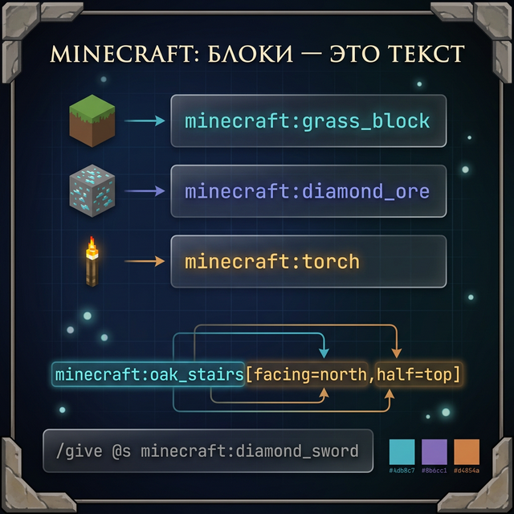
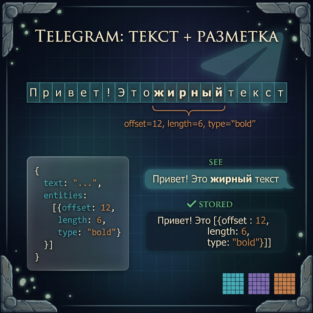
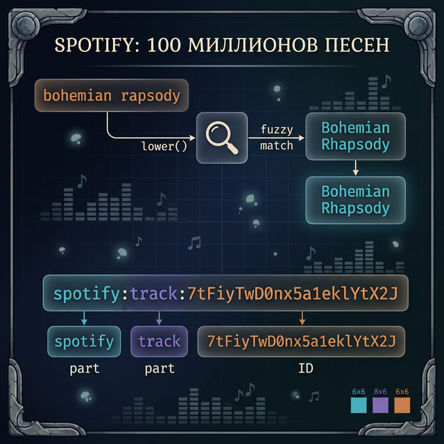
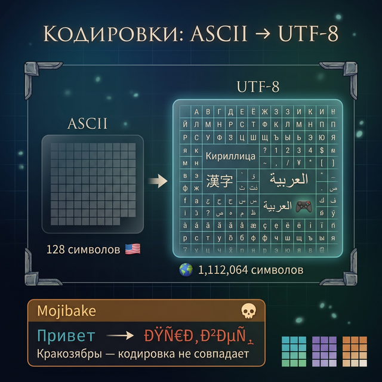

# Day 7: Как текст хранят Minecraft, Telegram и Spotify

> **Сегодня:** отдыхаем от кода. Читаем, как строки работают в реальных продуктах.
>
> **Время:** ~20 минут чтения

---

## Кейс 1. Minecraft: каждый блок — это текст

### Как устроен мир Minecraft внутри

Когда ты ставишь блок в Minecraft, игра запоминает его. Но как? Мир Minecraft — это миллиарды блоков. Каждый блок хранится как текстовая строка.

До версии 1.13 блоки хранились как числа: камень = 1, земля = 3, алмазная руда = 56. Но числа неудобны — попробуй запомнить, что `162` — это акациевое бревно. Поэтому Mojang перешла на текстовые идентификаторы:

```
minecraft:stone
minecraft:dirt
minecraft:diamond_ore
minecraft:acacia_log
```

Каждый ID — строка. И внутри этой строки есть структура:
- `minecraft` — пространство имён (namespace), до двоеточия
- `diamond_ore` — имя блока, после двоеточия

Если бы ты парсил ID блока на Python (а ты уже умеешь!):

```python
block_id = "minecraft:diamond_ore"
parts = block_id.split(":")
namespace = parts[0]    # "minecraft"
name = parts[1]         # "diamond_ore"
```

> **А ты знал?** В Minecraft существует более **900 уникальных текстовых ID** блоков. Это значит, что при каждом сохранении мира игра записывает миллионы строк на диск. Один чанк (16x16x384 блоков) может содержать до **98 304** блоков — и каждый из них привязан к текстовому ID!

### Свойства блоков — ещё больше текста

Но одного ID мало. У блоков есть **свойства** (block states). Например, лестница может быть повёрнута на восток, а дверь — открыта или закрыта. Minecraft хранит это так:

```
minecraft:oak_door[facing=east,half=lower,open=true]
```

Видишь структуру? Тут сразу несколько операций со строками:
1. Сначала `split("[")` — отделить ID блока от свойств
2. Потом `split(",")` — разделить свойства
3. Потом `split("=")` — разделить ключ и значение

На Python это выглядит так:

```python
full_id = "minecraft:oak_door[facing=east,half=lower,open=true]"

# Шаг 1: отделяем свойства
block_part = full_id.split("[")[0]       # "minecraft:oak_door"
props_part = full_id.split("[")[1][:-1]  # "facing=east,half=lower,open=true"

# Шаг 2: разбиваем свойства
props = props_part.split(",")
# ["facing=east", "half=lower", "open=true"]

# Шаг 3: достаём значение
for prop in props:
    key, value = prop.split("=")
    print(f"{key} -> {value}")
```

Ты уже знаешь `split()` из Day 4 — видишь, как одна функция решает кучу задач?

### Команды в Minecraft — тот же парсинг

Когда ты пишешь `/tp Steve 100 64 -200` в чате Minecraft, игра делает ровно то же, что ты делал вчера в практикуме:

1. `split(" ")` — разбивает на части
2. `parts[0]` → `/tp` — определяет команду
3. `parts[1]` → `Steve` — цель
4. `parts[2:5]` → координаты

Ты уже умеешь делать то, что делает Minecraft под капотом.



А вот более сложный пример — команда выдачи предмета:

```
/give @p minecraft:diamond_sword{display:{Name:'{"text":"Excalibur"}'}} 1
```

Тут строки вложены внутрь строк! JSON внутри NBT-формата внутри команды. Парсер Minecraft должен аккуратно разобрать каждый уровень вложенности, не перепутав кавычки. Это как русская матрёшка, только из текста.

> **А ты знал?** Команда `/say` в Minecraft берёт **всё после пробела** как одну строку. Это аналог того, что в Python можно сделать с помощью `split(" ", 1)` — помнишь параметр `maxsplit` из Day 4?

```python
command = "/say Привет всем игрокам на сервере!"
parts = command.split(" ", 1)
cmd = parts[0]      # "/say"
message = parts[1]  # "Привет всем игрокам на сервере!"
```

### Чанки и координаты

Мир Minecraft разделён на чанки — участки 16×16 блоков. Координаты чанка вычисляются из координат блока делением на 16. Имя чанка можно представить как строку:

```
r.0.0.mca    — файл региона (32×32 чанков)
r.-1.2.mca   — другой файл
```

Точка — разделитель. `split(".")` — и у тебя есть все части.

```python
filename = "r.-1.2.mca"
parts = filename.split(".")
prefix = parts[0]     # "r"
x = parts[1]          # "-1"
z = parts[2]          # "2"
ext = parts[3]        # "mca"

print(f"Регион: x={x}, z={z}")  # "Регион: x=-1, z=2"
```

> **А ты знал?** Один файл региона `.mca` содержит данные о **1024 чанках** (32x32). При генерации нового мира Minecraft создаёт десятки таких файлов, и их имена — это строки, из которых игра вычисляет, какие чанки где лежат. Мир размером 30 миллионов блоков в каждую сторону может породить тысячи файлов!

### Цвета в чате Minecraft — тоже строки

В Java-версии Minecraft текст в чате и на табличках поддерживает **коды форматирования** с символом `\u00A7` (символ параграфа):

```
§aЗелёный текст
§bГолубой текст
§lЖирный текст
§oКурсив
```

Структура: `§` + код цвета + текст. Это похоже на то, как Telegram хранит entities, только здесь разметка вставлена прямо в строку.

В Bedrock Edition (версия для телефонов) используется JSON для форматирования:

```json
{"text": "Привет, ", "extra": [{"text": "мир", "bold": true, "color": "gold"}]}
```

Две версии одной игры — два подхода к хранению текста!

---

## Кейс 2. Telegram: сообщения как строки с разметкой

### Как Telegram хранит сообщения

Каждое сообщение в Telegram — это строка текста плюс метаданные. Когда ты отправляешь сообщение с жирным текстом или ссылкой, Telegram не хранит HTML-теги внутри текста. Вместо этого он хранит **offset и length** — те самые индексы, которые ты изучил в Day 1.

Допустим, ты отправил: «Привет, **мир**!»

Telegram хранит это так:
```
text: "Привет, мир!"
entities: [
  {type: "bold", offset: 8, length: 3}
]
```

`offset: 8` — это индекс, с которого начинается жирный текст.
`length: 3` — длина жирного фрагмента.

На Python это:
```python
text = "Привет, мир!"
bold_start = 8       # offset
bold_length = 3      # length
bold_text = text[bold_start : bold_start + bold_length]
print(bold_text)     # "мир"
```

Срез! Ты это проходил в Day 2.

### Несколько entities одновременно

А что если в сообщении есть и жирный, и курсивный, и ссылка? Telegram хранит **массив** entities:

```
text: "Скачай Python с python.org проект"
entities: [
  {type: "bold",      offset: 7,  length: 6},
  {type: "url",       offset: 16, length: 10},
  {type: "italic",    offset: 0,  length: 6}
]
```

На Python мы можем «подсветить» все entity:

```python
text = "Скачай Python с python.org проект"
entities = [
    {"type": "bold",   "offset": 7,  "length": 6},
    {"type": "url",    "offset": 16, "length": 10},
    {"type": "italic", "offset": 0,  "length": 6},
]

for e in entities:
    fragment = text[e["offset"] : e["offset"] + e["length"]]
    print(f'{e["type"]}: "{fragment}"')
```

```
bold: "Python"
url: "python.org"
italic: "Скачай"
```

Видишь — срезы (Day 2) и f-строки (Day 5) работают вместе!



> **А ты знал?** Telegram обрабатывает более **150 миллиардов** сообщений в месяц. Каждое из них — строка, которую нужно сохранить, проиндексировать и доставить. Если бы каждое сообщение занимало в среднем 100 символов, то за месяц Telegram обрабатывает примерно **15 триллионов символов**. Это как если бы вся библиотека Конгресса США (самая большая в мире) была перепечатана 500 тысяч раз.

### Стикеры: строки-идентификаторы

Каждый стикерпак в Telegram имеет текстовый идентификатор:

```
https://t.me/addstickers/DarkSoulsStickers
```

Если бы тебе нужно было достать имя пакета из ссылки:

```python
url = "https://t.me/addstickers/DarkSoulsStickers"
pack_name = url.split("/")[-1]    # "DarkSoulsStickers"
```

`split("/")` разбивает по слешам, `[-1]` берёт последний элемент.

А вот что происходит, когда ты **делишься ссылкой** на канал. Telegram парсит разные форматы:

```python
# Все эти ссылки ведут на одно и то же:
links = [
    "https://t.me/durov",
    "https://telegram.me/durov",
    "t.me/durov",
    "@durov",
]

# Telegram должен из каждой вытащить username "durov"
# Для последней — это просто:
username = "@durov".lstrip("@")    # "durov"

# Для остальных — split и [-1]:
username = "https://t.me/durov".split("/")[-1]  # "durov"
```

Помнишь `strip()` и `lstrip()` из Day 3? Вот они в деле!

### Поиск по чату

Когда ты ищешь сообщение в Telegram, приложение использует те же операции, что ты изучил:
- `message.lower().find(query.lower())` — поиск без учёта регистра
- `message.count(word)` — подсчёт упоминаний

Но есть нюанс. Представь, ты ищешь слово «кот». Найдётся ли оно в слове «котлета»? Да! Потому что `"котлета".find("кот")` вернёт `0`. Telegram учитывает это и использует более умный поиск, который проверяет **границы слов**. Мы тоже можем написать простой вариант:

```python
message = "Мой кот любит котлеты"
query = "кот"

words = message.lower().split()
# ["мой", "кот", "любит", "котлеты"]

# Точное совпадение целого слова:
if query in words:
    print("Найдено как отдельное слово!")
```

### Telegram Bot API — строки повсюду

Если ты когда-нибудь захочешь создать бота в Telegram (а на Python это довольно просто!), ты будешь работать со строками постоянно. Вот как выглядит команда боту:

```python
message = "/weather Москва"
if message.startswith("/"):
    parts = message.split(" ", 1)
    command = parts[0]   # "/weather"
    args = parts[1] if len(parts) > 1 else ""  # "Москва"
    print(f"Команда: {command}, аргумент: {args}")
```

`startswith()` — из Day 3, `split()` — из Day 4, f-строки — из Day 5. Всё, что ты учил на этой неделе!

<quiz>
Q: Как Telegram хранит жирный текст в сообщении?
A: Оборачивает текст в HTML-теги
A: Хранит отдельно текст и «entities» с offset и length
A: Заменяет буквы на жирный шрифт Unicode
C: Хранит отдельно текст и «entities» с offset и length
E: Telegram использует индексы (offset) и длину (length) — те же концепции, что индексация и len() в Python.

Q: Как достать имя стикерпака из ссылки `"https://t.me/addstickers/MyPack"`?
A: url.split("/")[0]
A: url.split("/")[-1]
A: url[-6:]
C: url.split("/")[-1]
E: split("/") разбивает по слешам, [-1] берёт последний элемент — «MyPack».
</quiz>

---

## Кейс 3. Spotify: 100 миллионов песен — и все нужно найти

### Как Spotify ищет музыку

Когда ты вводишь «dark souls» в поиск Spotify, приложение должно найти совпадения среди 100+ миллионов треков. Каждый трек — это набор строк: название, исполнитель, альбом.

Первый шаг поиска — **нормализация текста**:

```python
query = "  Dark  SOULS  "
normalized = " ".join(query.strip().lower().split())
# "dark souls"
```

Это ровно то, что ты делал с `strip()`, `lower()`, `split()` и `join()`!

Давай разберём по шагам, что здесь происходит:

```
Исходный запрос:  "  Dark  SOULS  "
                   ^^              ^^  — лишние пробелы по краям
                        ^^^^           — разный регистр
                       ^^              — двойной пробел

После strip():   "Dark  SOULS"     — убрали пробелы по краям
После lower():   "dark  souls"     — привели к нижнему регистру
После split():   ["dark", "souls"] — разбили (лишние пробелы исчезли!)
После join():    "dark souls"      — собрали обратно чисто
```

> **А ты знал?** Spotify обрабатывает более **4 миллиардов** поисковых запросов в месяц. И каждый запрос проходит через нормализацию. Если бы хотя бы один из этих шагов (`strip`, `lower`, `split`, `join`) занимал лишнюю миллисекунду, суммарно это было бы **46 лишних дней** вычислений в месяц!

### Нечёткий поиск

Но Spotify не просто сравнивает строки — он ищет **похожие**. Если ты написал «drak souls» (с опечаткой), Spotify всё равно найдёт «Dark Souls».

Один из алгоритмов — подсчёт общих символов. На Python:

```python
query = "drak"
candidate = "dark"

common = 0
for char in query:
    if char in candidate:
        common = common + 1

similarity = common / max(len(query), len(candidate))
print(f"Похожесть: {similarity:.0%}")    # "Похожесть: 100%"
```

Все символы `d`, `r`, `a`, `k` есть в обоих словах — просто в другом порядке.

Есть ещё один способ — посчитать количество **общих пар соседних символов** (это называется «биграммы»):

```python
def bigrams(word):
    """Все пары соседних букв"""
    pairs = []
    for i in range(len(word) - 1):
        pairs.append(word[i:i+2])
    return pairs

print(bigrams("dark"))    # ["da", "ar", "rk"]
print(bigrams("drak"))    # ["dr", "ra", "ak"]
# Общие: нет совпадений! Значит, "drak" и "dark" —
# перестановка букв, а не похожие слова
```

Spotify комбинирует разные алгоритмы, чтобы покрыть максимум ситуаций: опечатки, перестановки, пропущенные буквы.

### URI — уникальный адрес всего

В Spotify **каждый объект** имеет текстовый идентификатор — URI (Uniform Resource Identifier):

```
spotify:track:6rqhFgbbKwnb9MLmUQDhG6
spotify:album:1DFixLWuPkv3KT3TnV35m3
spotify:artist:0YC192cP3KPCRWx8zr8MfZ
spotify:playlist:37i9dQZF1DXcBWIGoYBM5M
```

Видишь структуру? Три части, разделённые двоеточием:

```python
uri = "spotify:track:6rqhFgbbKwnb9MLmUQDhG6"
parts = uri.split(":")
service = parts[0]     # "spotify"
obj_type = parts[1]    # "track"
obj_id = parts[2]      # "6rqhFgbbKwnb9MLmUQDhG6"

print(f"Это {obj_type} с ID {obj_id}")
# "Это track с ID 6rqhFgbbKwnb9MLmUQDhG6"
```

Точно так же, как ID блоков в Minecraft (`minecraft:stone`), только здесь три части вместо двух. `split(":")` работает одинаково везде!



> **А ты знал?** ID трека вроде `6rqhFgbbKwnb9MLmUQDhG6` — это строка из 22 символов в формате Base62 (буквы a-z, A-Z и цифры 0-9). Такая система позволяет закодировать **3.4 x 10^39** уникальных треков. Это больше, чем количество атомов в человеческом теле!

### Названия плейлистов

Когда ты создаёшь плейлист, Spotify генерирует URL из названия — тот самый «slug», который ты делал в задании Day 4:

```python
playlist = "Мои любимые треки 2024!"
slug = "-".join(playlist.lower().replace("!", "").split())
# "мои-любимые-треки-2024"
```

### Тексты песен: синхронизация по времени

Когда Spotify показывает тексты песен (lyrics), каждая строчка привязана к моменту времени. Формат выглядит примерно так:

```
[00:12.34] Never gonna give you up
[00:15.67] Never gonna let you down
[00:18.90] Never gonna run around
```

Это текстовый формат LRC. Если бы ты парсил его на Python:

```python
line = "[00:12.34] Never gonna give you up"

# Разделяем метку времени и текст
time_part = line[1:9]        # "00:12.34" — срез! (Day 2)
lyric = line[11:]            # "Never gonna give you up"

# Разбираем время
minutes = time_part.split(":")[0]    # "00"
seconds = time_part.split(":")[1]    # "12.34"

print(f"На {minutes}:{seconds} — {lyric}")
```

Срезы (Day 2) + split (Day 4) + f-строки (Day 5) = парсер текстов песен!

<quiz>
Q: Какой первый шаг делает Spotify при поиске?
A: Сравнивает строки побуквенно
A: Нормализует текст: strip(), lower(), split()+join()
A: Ищет точное совпадение в базе
C: Нормализует текст: strip(), lower(), split()+join()
E: Перед поиском текст очищается и приводится к единому формату — те же методы, что мы изучали!

Q: Как Minecraft хранит тип блока с версии 1.13?
A: Как число (камень = 1)
A: Как текстовую строку (minecraft:stone)
A: Как картинку
C: Как текстовую строку (minecraft:stone)
E: Mojang перешла на текстовые ID вида «namespace:name», потому что они понятнее числовых кодов.
</quiz>

---

## Кейс 4. Бонус: кодировки — почему текст иногда ломается

### Кракозябры

Ты наверняка видел такое: `привет` вместо `привет`. Это **кракозябры** — текст, открытый в неправильной кодировке.

Компьютер не понимает буквы — он хранит числа. Кодировка — это таблица, которая говорит: «число 1055 = буква П». Если программа использует неправильную таблицу, она читает числа, но подставляет не те буквы.

Вот как это выглядит «изнутри»:

```
Слово "Привет" в UTF-8 — это байты:
208 159 | 209 128 | 208 184 | 208 178 | 208 181 | 209 130
  П     |   р     |   и     |   в     |   е     |   т

Если открыть те же байты как Windows-1252 (латиница):
Ð     Ÿ | Ñ     € | Ð     ¸ | Ð     ² | Ð     µ | Ñ     ‚
       "привет"
```

Одни и те же числа — разные таблицы — разные буквы!

> **А ты знал?** Слово «кракозябры» — чисто русское название для искажённого текста. В английском такие ошибки называют **mojibake** (от японского "moji" — символ и "bake" — трансформация). А ещё бывает **tofu** — когда вместо символа показывается пустой квадратик, потому что шрифт не содержит нужного символа.

### ASCII: 128 символов, только английский

Первая кодировка — ASCII (1963 год). В ней всего 128 символов: английские буквы, цифры, знаки препинания. Русских букв нет.

> **Бонус** (запоминать не нужно): в Python можно узнать номер символа функцией `ord()`, а по номеру получить символ через `chr()`. Это просто для любопытства:

```python
print(ord("A"))     # 65
print(ord("Z"))     # 90
print(chr(65))      # "A"
print(chr(90))      # "Z"
```

Любопытный факт: между `A` (65) и `Z` (90) ровно 25 позиций — все 26 букв идут подряд. Поэтому `ord("B") - ord("A")` = 1. Эту особенность используют для шифрования текста! Например, знаменитый **шифр Цезаря** сдвигает каждую букву на N позиций:

```python
# Простой шифр Цезаря (сдвиг на 3)
letter = "A"
code = ord(letter) + 3
secret = chr(code)
print(f"{letter} -> {secret}")   # "A -> D"
```

Юлий Цезарь использовал этот шифр для военных сообщений больше 2000 лет назад — и в его основе лежат те же операции со строками!

### UTF-8: все языки мира

Сегодня стандарт — UTF-8. Он может хранить любой символ: русский, китайский, арабский, даже эмодзи.

```python
print(ord("П"))      # 1055
print(ord("🎮"))     # 127918
print(chr(127918))   # "🎮"
```

Эти функции нам не понадобятся в курсе — они здесь, чтобы показать, что за каждой буквой стоит число.

Интересный факт: символы из разных языков занимают **разное количество байт** в UTF-8:

```
"A"   — 1 байт   (английская буква)
"П"   — 2 байта  (русская буква)
"中"  — 3 байта  (китайский иероглиф)
"🎮"  — 4 байта  (эмодзи)
```

Вот почему `len("Hello")` = 5 (5 символов = 5 байт), но в памяти `"Привет"` занимает 12 байт, хотя `len("Привет")` = 6. Python считает символы, а не байты — и это правильно!

Вот почему в Python при работе с файлами важно указывать кодировку `encoding='utf-8'` — это мы подробно разберём в Week 4, когда будем читать и записывать файлы.



### Факт-бомба

Эмодзи — это обычные символы Unicode, как буквы. Когда ты отправляешь 🗡️ в Telegram, по сети летит число `128481`. Получатель превращает его обратно в картинку меча. Строки — это числа, притворяющиеся текстом.

А вот ещё кое-что невероятное: некоторые эмодзи **состоят из нескольких символов**, склеенных специальным невидимым символом ZWJ (Zero Width Joiner). Например:

```
👨 + ZWJ + 💻 = 👨‍💻  (мужчина за компьютером)
🏳️ + ZWJ + 🌈 = 🏳️‍🌈  (радужный флаг)
```

Это как `join()`, только для эмодзи! В Python:

```python
family = "👨‍👩‍👧‍👦"
print(len(family))  # 11 (!)
# Потому что это 4 эмодзи + 3 невидимых склеивающих символа + кое-что ещё
```

Одна «картинка» — а внутри строка из 11 символов. Строки полны сюрпризов!

---

## Итоги: строки — это суперсила

На этой неделе ты изучил 6 инструментов для работы со строками. Вот как они используются в реальных продуктах:

| Что ты изучил | Minecraft | Telegram | Spotify |
|---|---|---|---|
| **Индексация** (Day 1) | Первый символ команды `/` | Offset в entities | URI: тип объекта |
| **Срезы** (Day 2) | Свойства блоков `[...]` | Вырезать жирный текст | Метка времени в LRC |
| **Методы** (Day 3) | `.startswith("/")` для команд | `.lower()` для поиска | `.strip()` для запросов |
| **Split/Join** (Day 4) | Парсинг `namespace:name` | Разбор ссылок `t.me/...` | Нормализация запросов |
| **F-строки** (Day 5) | Вывод координат | Формат сообщений | Показ результатов |
| **Парсинг** (Day 6) | Лог сервера | Лог чата | Тексты песен |

Все эти компании решают одни и те же задачи теми же инструментами, что ты уже знаешь. Просто в другом масштабе.

---

## Что дальше?

На этой неделе ты освоил работу со строками — первым типом данных. Ты можешь:

- Доставать символы по индексу
- Вырезать фрагменты срезами
- Очищать, искать, заменять текст методами
- Разбивать и собирать строки с `split()` и `join()`
- Красиво выводить данные с f-строками
- Парсить реальные данные (лог чата)

**На следующей неделе** — **списки**. Если строка — это последовательность символов, то список — это последовательность **чего угодно**: чисел, строк, других списков. Инвентарь RPG, таблица рекордов, колода карт — всё это списки.
