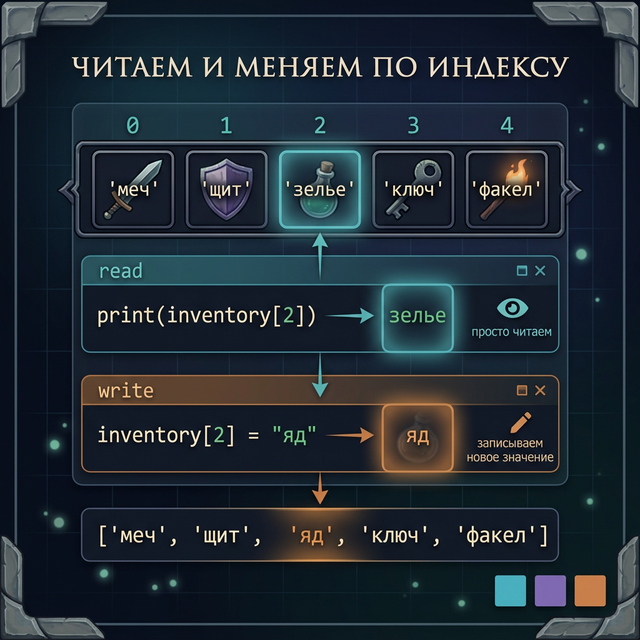
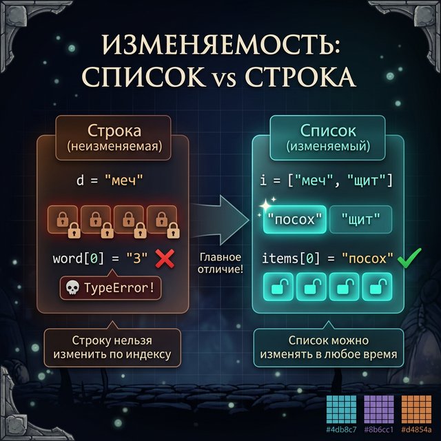
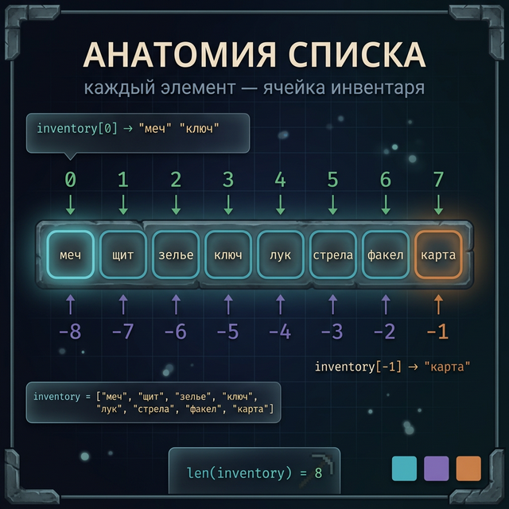
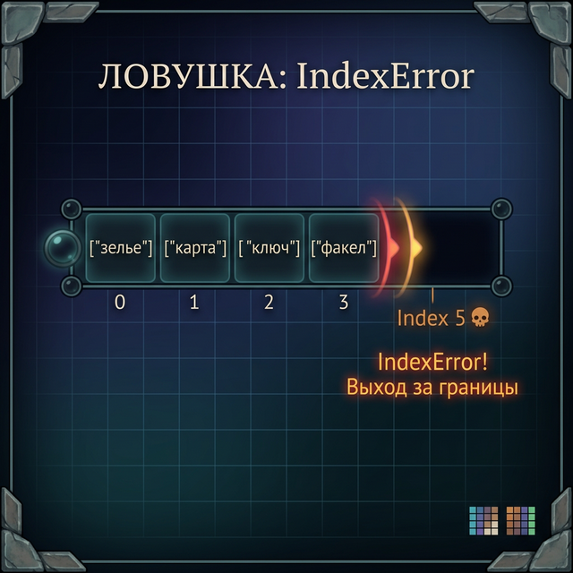
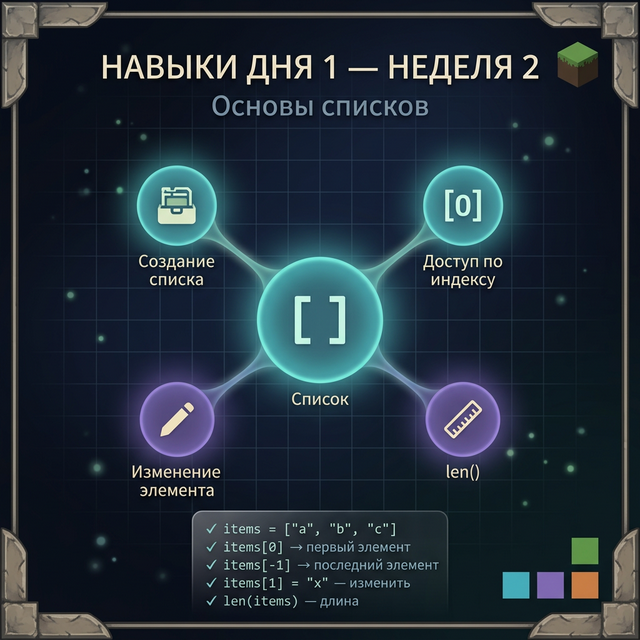

# Day 1: Список — инвентарь персонажа

> **Новые концепции сегодня:** создание списка `[]`, доступ по индексу `list[i]`, изменение элемента `list[i] = value`, `len()` для списка
>
> **Время:** ~35 минут (теория + практика)

---

## Часть 1. Зачем нужны списки?

### Аналогия: инвентарь в Minecraft

Открой инвентарь в Minecraft. Там не одна ячейка — там 36 слотов. В каждом слоте — предмет. Когда ты подбираешь новый ресурс, он занимает следующую свободную ячейку. Ты можешь посмотреть любой слот, поменять предметы местами, выбросить ненужное.

Строка в Python — это тоже набор символов. Но у строки есть ограничение: **её нельзя изменить**. Помнишь из Week 1? `name[0] = "A"` вызывает `TypeError`. Строка — это витрина в музее: можешь смотреть, но трогать запрещено.

**Список** (`list`) работает как инвентарь: ты можешь добавлять предметы, удалять их, заменять один на другой. И в отличие от строки, которая хранит только символы, список может хранить **что угодно** — числа, строки, другие списки.

### Где списки встречаются в реальных программах?

1. **Игры**: список предметов в инвентаре, список врагов на уровне, очередь событий
2. **Чаты**: история сообщений — это список строк
3. **Рейтинги**: таблица рекордов — список игроков, отсортированный по очкам
4. **Интернет-магазин**: список товаров в корзине, список заказов

Без списков программа умеет работать только с одним значением за раз. Со списками — с целой коллекцией.

---

## Часть 2. Создание списка

### Квадратные скобки — крафт-рецепт инвентаря

Список создаётся в квадратных скобках `[]`. Элементы разделяются запятыми:

```python
inventory = ["меч", "щит", "зелье", "факел"]
```

Вот что происходит внутри Python:

```
inventory:  ["меч", "щит", "зелье", "факел"]
Индексы:      0       1       2        3
```

Четыре элемента — четыре индекса, от 0 до 3. Точно как в строках, только вместо символов — целые предметы.

### Список может хранить разные типы

```python
hero_stats = ["Артас", 15, 850, True]
# Имя (строка), уровень (int), HP (int), жив ли (bool)
```

Это работает! Python не требует, чтобы все элементы были одного типа. Хотя на практике обычно хранят что-то одно — или все числа, или все строки.

### Пустой список

```python
loot = []    # пустой инвентарь — только начали игру
```

Пустой список — это не ошибка. Это как пустой рюкзак в начале игры. Потом мы научимся добавлять в него предметы.

### Попробуй сам: создай свой инвентарь

```python
my_inventory = ["кирка", "древесина", "камень"]
print(my_inventory)
```

**Вывод:**
```
['кирка', 'древесина', 'камень']
```

Python выводит список вместе со скобками и кавычками — чтобы ты видел, что это именно список, а не просто текст.

<quiz>
Q: Как создать пустой список в Python?
A: list()
A: []
A: {}
C: []
E: Квадратные скобки [] создают пустой список. {} — это словарь (изучим в Week 3).

Q: Может ли список одновременно хранить строки и числа?
A: Нет, только одного типа
A: Да, любые типы вместе
A: Только числа и строки
C: Да, любые типы вместе
E: Список в Python может хранить элементы любых типов одновременно.
</quiz>

---

## Часть 3. Доступ по индексу — достаём предмет из инвентаря

### Синтаксис такой же, как у строк

Ты уже умеешь обращаться к символам строки по индексу: `"Minecraft"[0]` → `"M"`. У списков — тот же синтаксис:

```python
inventory = ["меч", "щит", "зелье", "факел"]
print(inventory[0])    # меч
print(inventory[2])    # зелье
print(inventory[-1])   # факел (последний)
```

**Вывод:**
```
меч
зелье
факел
```

Разберём карту индексов:

```
Список:   "меч"  "щит"  "зелье"  "факел"
Индексы:    0      1       2         3
Отриц.:    -4     -3      -2        -1
```

Всё то же самое, что со строками: нумерация с нуля, отрицательные индексы считают с конца.

### Пример: достаём оружие из слота

```python
weapons = ["кинжал", "лук", "посох", "двуручный меч"]

equipped = weapons[0]
print(f"Экипировано: {equipped}")

best_weapon = weapons[-1]
print(f"Лучшее оружие: {best_weapon}")
```

**Вывод:**
```
Экипировано: кинжал
Лучшее оружие: двуручный меч
```

### Пошаговый разбор: что происходит при `weapons[2]`?

```python
weapons = ["кинжал", "лук", "посох", "двуручный меч"]
print(weapons[2])
```

1. Python смотрит на переменную `weapons` — это список из 4 элементов
2. Видит `[2]` — нужен элемент с индексом 2
3. Отсчитывает: 0 → `"кинжал"`, 1 → `"лук"`, 2 → `"посох"`
4. Возвращает строку `"посох"`
5. `print()` выводит её на экран

Всё точно как со строками, только вместо символа — целый элемент.



### Пример: система инвентаря в RPG

```python
inventory = ["зелье здоровья", "факел", "верёвка", "карта"]

print(f"Слот 1: {inventory[0]}")
print(f"Слот 4: {inventory[3]}")
print(f"Последний предмет: {inventory[-1]}")
print(f"Всего предметов: {len(inventory)}")
```

**Вывод:**
```
Слот 1: зелье здоровья
Слот 4: карта
Последний предмет: карта
Всего предметов: 4
```

<quiz>
Q: Что выведет `["яблоко", "банан", "вишня"][1]`?
A: яблоко
A: банан
A: вишня
C: банан
E: Индекс 1 — второй элемент (нумерация с нуля).

Q: Что выведет `["огонь", "вода", "земля"][-1]`?
A: огонь
A: вода
A: земля
C: земля
E: Индекс -1 — всегда последний элемент списка.
</quiz>

---

## Часть 4. Изменение по индексу — главное отличие от строк

### Строка vs список: витрина vs инвентарь

Помнишь, мы говорили, что строку нельзя изменить по индексу? С **списком всё иначе**:

```python
# Строка — нельзя изменить:
name = "Zeldo"
# name[4] = "a"   # TypeError! Строки неизменяемы

# Список — можно изменить:
inventory = ["меч", "щит", "зелье", "факел"]
inventory[2] = "мегазелье"    # Заменяем зелье на мегазелье
print(inventory)
```

**Вывод:**
```
['меч', 'щит', 'мегазелье', 'факел']
```

Элемент с индексом 2 изменился. Остальные остались на месте.



### Это очень мощно

Представь: ты делаешь игру, где у персонажа есть слоты брони. Игрок нашёл лучший шлем:

```python
armor = ["кожаный шлем", "кольчуга", "кожаные штаны", "кожаные сапоги"]
print(f"До: {armor[0]}")

armor[0] = "железный шлем"   # Надели лучший шлем
print(f"После: {armor[0]}")
print(armor)
```

**Вывод:**
```
До: кожаный шлем
После: железный шлем
['железный шлем', 'кольчуга', 'кожаные штаны', 'кожаные сапоги']
```

### Пример: система HP в бою

В текстовой RPG у каждого игрока есть HP. После боя нужно обновить значение:

```python
players_hp = [100, 85, 60, 40]
# Игрок с индексом 2 получил 20 урона
players_hp[2] = players_hp[2] - 20
print(players_hp)
```

**Вывод:**
```
[100, 85, 40, 40]
```

`players_hp[2] = players_hp[2] - 20` читается так: «возьми текущее значение элемента 2, вычти 20, запиши результат обратно в элемент 2».

### Попробуй сам

```python
scores = [150, 200, 320, 80]
print(f"До: {scores}")
scores[0] = 999       # Новый рекорд первого игрока!
print(f"После: {scores}")
```

Прежде чем запустить — угадай результат.

<quiz>
Q: Чем список отличается от строки при работе с индексами?
A: У списка индексы начинаются с 1
A: В список нельзя попасть по отрицательному индексу
A: Элемент списка можно изменить по индексу, символ строки — нет
C: Элемент списка можно изменить по индексу, символ строки — нет
E: Списки изменяемы (mutable), строки — нет (immutable). Это фундаментальное различие.
</quiz>

---

## Часть 5. len() для списка

### Длина списка — количество элементов

`len()` работает с любой последовательностью — строкой, списком, и другими типами, которые мы изучим позже:

```python
inventory = ["меч", "щит", "зелье", "факел"]
print(len(inventory))    # 4
```

`len()` возвращает **количество элементов**, а не количество символов. В нашем списке 4 элемента — функция вернёт 4.

### Пример: проверяем, не переполнен ли инвентарь

```python
inventory = ["меч", "щит", "зелье", "факел", "ключ"]
max_slots = 5

print(f"Занято слотов: {len(inventory)} из {max_slots}")

if len(inventory) >= max_slots:
    print("Инвентарь полон! Выброси что-нибудь.")
else:
    print(f"Свободно слотов: {max_slots - len(inventory)}")
```

**Вывод:**
```
Занято слотов: 5 из 5
Инвентарь полон! Выброси что-нибудь.
```

### Ловушка: len() и последний индекс

Та же ловушка, что и со строками. Список из 4 элементов имеет индексы 0, 1, 2, 3 — а не 0, 1, 2, 4!

```python
inventory = ["меч", "щит", "зелье", "факел"]
print(len(inventory))      # 4
print(inventory[3])        # факел — последний элемент
# print(inventory[4])      # IndexError! Выход за границы
```

**Правило**: последний элемент имеет индекс `len(список) - 1`. Или используй `[-1]`.



---

## Часть 6. Подводные камни

### Камень 1: IndexError — выход за границы

Точно как со строками. Если индекс больше `len(список) - 1`, Python выбросит ошибку:

```python
heroes = ["Маг", "Воин", "Лучник"]
print(heroes[5])   # IndexError: list index out of range
```

```
Traceback (most recent call last):
  File "game.py", line 2, in <module>
    print(heroes[5])
IndexError: list index out of range
```

**Как защититься**: проверяй длину перед обращением к индексу.

```python
heroes = ["Маг", "Воин", "Лучник"]
index = 5

if index < len(heroes):
    print(heroes[index])
else:
    print(f"Нет героя с индексом {index}")
```



### Камень 2: Список и строка выглядят похоже, но ведут себя по-разному

```python
text = "меч"         # строка — неизменяемая
items = ["меч"]      # список из одного элемента — изменяемый

# text[0] = "М"      # ошибка!
items[0] = "топор"   # OK!
print(items)
```

Обращай внимание на кавычки и скобки: `"меч"` — строка, `["меч"]` — список.

### Камень 3: список и строка с одинаковым содержимым — не одно и то же

```python
string_version = "Minecraft"
list_version = ["M", "i", "n", "e", "c", "r", "a", "f", "t"]

print(type(string_version))   # <class 'str'>
print(type(list_version))     # <class 'list'>
```

Это разные типы данных, хотя и содержат одни буквы. `type()` — полезная функция, которая показывает тип переменной.

---

## Часть 7. Практика — теперь ты!

### Задание 1: Инвентарь (разминка)

Создай список из 5 предметов снаряжения RPG-персонажа. Выведи:
- первый предмет
- последний предмет
- третий предмет
- количество предметов

**Ожидаемый результат:**
```
Первый предмет: шлем
Последний предмет: сапоги
Третий предмет: перчатки
Всего предметов: 5
```

<details>
<summary>Подсказка</summary>

Используй `gear[0]`, `gear[-1]`, `gear[2]`, `len(gear)`.

</details>

<details>
<summary>Решение</summary>

```python
gear = ["шлем", "нагрудник", "перчатки", "штаны", "сапоги"]

print(f"Первый предмет: {gear[0]}")
print(f"Последний предмет: {gear[-1]}")
print(f"Третий предмет: {gear[2]}")
print(f"Всего предметов: {len(gear)}")
```

</details>

---

### Задание 2: Апгрейд брони

У персонажа комплект брони из 4 частей. Он нашёл новый шлем и новые сапоги. Замени соответствующие элементы в списке и выведи итоговый комплект.

**Исходный комплект:** `["кожаный шлем", "кольчуга", "кожаные штаны", "кожаные сапоги"]`

**После апгрейда:**
```
Было: ['кожаный шлем', 'кольчуга', 'кожаные штаны', 'кожаные сапоги']
Стало: ['железный шлем', 'кольчуга', 'кожаные штаны', 'железные сапоги']
```

<details>
<summary>Подсказка</summary>

Измени элементы с индексами 0 и 3 через присваивание `armor[0] = "новое значение"`.

</details>

<details>
<summary>Решение</summary>

```python
armor = ["кожаный шлем", "кольчуга", "кожаные штаны", "кожаные сапоги"]
print(f"Было: {armor}")

armor[0] = "железный шлем"
armor[3] = "железные сапоги"

print(f"Стало: {armor}")
```

</details>

---

### Задание 3: Валидатор инвентаря

Напиши программу-валидатор инвентаря. Она получает список предметов и:
- Выводит количество предметов
- Проверяет: если инвентарь пустой — выводит «Инвентарь пуст»
- Если предметов больше 10 — «Инвентарь переполнен»
- Иначе — «Инвентарь в порядке»

**Ожидаемый результат:**
```
Предметов в инвентаре: 3
Инвентарь в порядке
```

<details>
<summary>Подсказка</summary>

Используй `len(inventory)` и цепочку `if / elif / else`.

</details>

<details>
<summary>Решение</summary>

```python
inventory = ["меч", "щит", "зелье"]

count = len(inventory)
print(f"Предметов в инвентаре: {count}")

if count == 0:
    print("Инвентарь пуст")
elif count > 10:
    print("Инвентарь переполнен")
else:
    print("Инвентарь в порядке")
```

</details>

---

### Задание 4: Таблица рекордов (мини-проект)

Создай программу, которая:
1. Хранит список из 5 имён игроков
2. Хранит список из 5 очков (те же позиции, что и имена)
3. Выводит красивую таблицу: место, имя, очки
4. Находит и выводит игрока с первым местом (индекс 0)

**Ожидаемый результат:**
```
=== ТАБЛИЦА РЕКОРДОВ ===
Место 1: Dragonborn — 9500 очков
Место 2: DarkLord — 8200 очков
Место 3: Shadowhunter — 6800 очков
Место 4: IronForge — 5100 очков
Место 5: NightWalker — 3300 очков
=========================
Чемпион: Dragonborn с 9500 очками!
```

<details>
<summary>Подсказка</summary>

Два отдельных списка: `names = [...]` и `scores = [...]`. Выводи каждую строку через f-строку с `names[i]` и `scores[i]`.

</details>

<details>
<summary>Решение</summary>

```python
names = ["Dragonborn", "DarkLord", "Shadowhunter", "IronForge", "NightWalker"]
scores = [9500, 8200, 6800, 5100, 3300]

print("=== ТАБЛИЦА РЕКОРДОВ ===")
print(f"Место 1: {names[0]} — {scores[0]} очков")
print(f"Место 2: {names[1]} — {scores[1]} очков")
print(f"Место 3: {names[2]} — {scores[2]} очков")
print(f"Место 4: {names[3]} — {scores[3]} очков")
print(f"Место 5: {names[4]} — {scores[4]} очков")
print("=========================")
print(f"Чемпион: {names[0]} с {scores[0]} очками!")
```

</details>

---

## Часть 8. Итоги дня

| Навык | Синтаксис | Что делает |
|:------|:----------|:-----------|
| Создание списка | `items = ["а", "б", "в"]` | Список из нескольких элементов |
| Доступ по индексу | `items[0]`, `items[-1]` | Достаёт элемент по номеру |
| Изменение элемента | `items[2] = "новое"` | Заменяет элемент (в отличие от строк!) |
| Длина списка | `len(items)` | Количество элементов |

**Главные правила:**
- Нумерация с нуля: первый элемент → индекс `0`
- `list[-1]` — всегда последний элемент
- `list[i] = value` — можно менять (строки — нельзя!)
- Если выйдешь за границы — `IndexError`
- `len(список) - 1` — индекс последнего элемента

> [!IMPORTANT] Ключевое отличие от строк
> Строки **неизменяемы** — ты можешь только читать символы. Списки **изменяемы** — ты можешь менять любой элемент прямо по индексу. Это делает списки гораздо мощнее для хранения данных, которые меняются в ходе игры или программы.



**Завтра:** научимся **добавлять и удалять** предметы из списка — `append()`, `insert()`, `remove()`, `pop()`. Инвентарь станет живым!

---

← [[Week 1 - Day 7 - Rest\|День 7 Нед.1]] | [[python_basics/README\|Оглавление]] | [[Week 2 - Day 2 - List Modification\|День 2]] →
