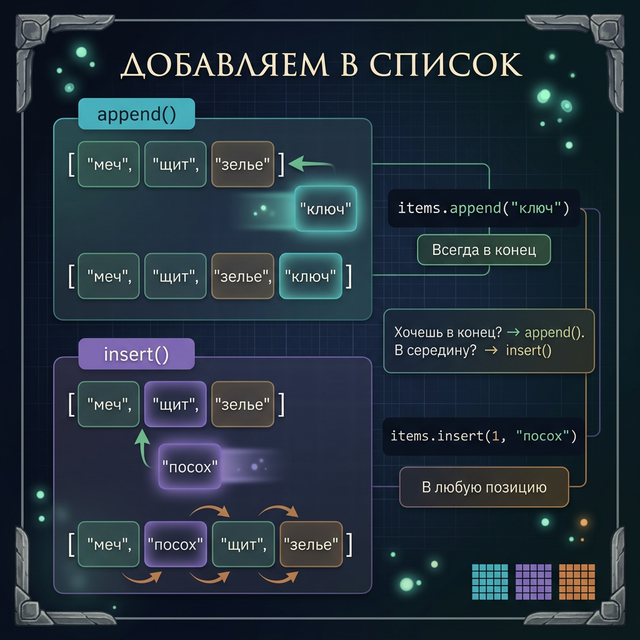
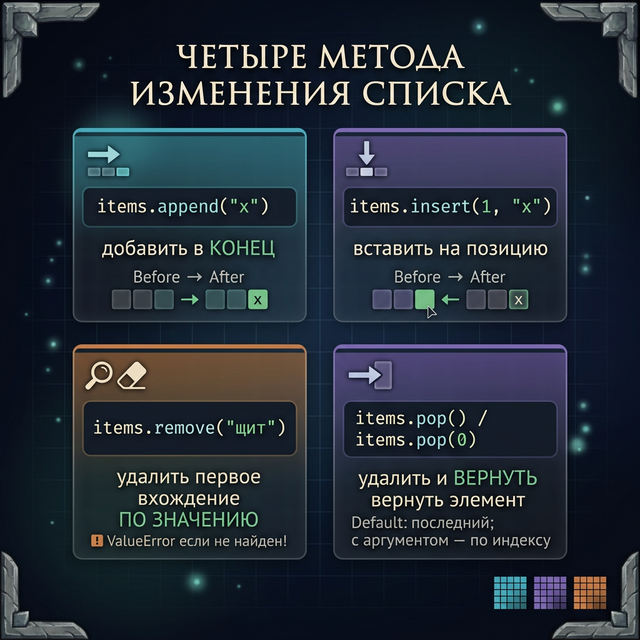
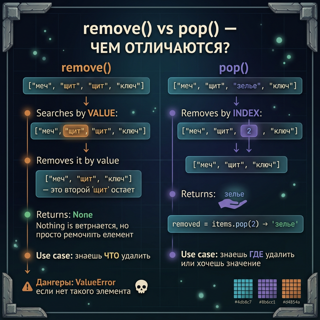
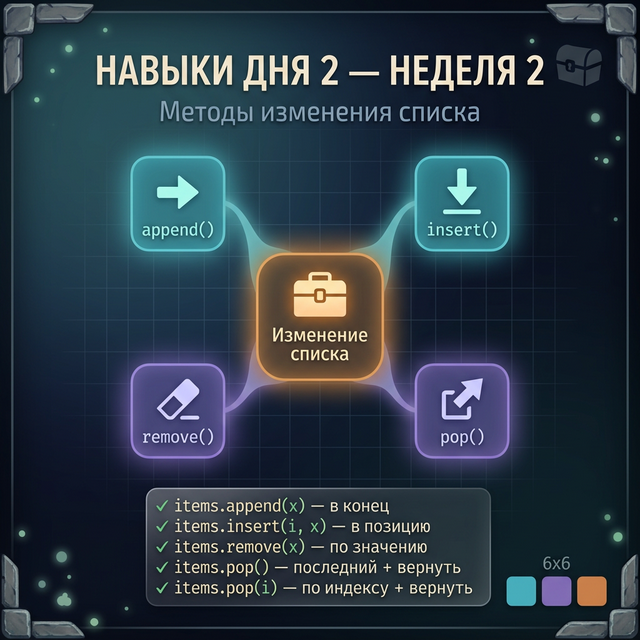

# Day 2: Живой инвентарь — добавляем и удаляем

> **Новые концепции сегодня:** `append()`, `insert()`, `remove()`, `pop()`
>
> **Время:** ~35 минут (теория + практика)

---

## Часть 1. Список, который умеет расти

### Аналогия: инвентарь в реальной игре

Вчера мы создавали список как статичный инвентарь — и уже умеем менять элементы по индексу. Но настоящий инвентарь живёт: ты подбираешь новые предметы, продаёшь старые, выбрасываешь ненужное.

В Terraria каждый раз, когда ты ломаешь дерево или убиваешь слайма, предмет **добавляется** в инвентарь. Когда ты крафтишь или продаёшь — **исчезает**. Список это умеет, а строка — нет.

Сегодня изучим четыре метода, которые делают список «живым»:
- `append()` — добавить в конец (как подобрать предмет)
- `insert()` — вставить в нужное место (как переложить предмет в слот)
- `remove()` — удалить по значению (как выбросить конкретный предмет)
- `pop()` — удалить по индексу (как взять предмет из слота)

---

## Часть 2. append() — добавить в конец

### Самый популярный метод списков

`append` переводится как «прикрепить в конец». Именно это он и делает: добавляет один элемент в **конец** списка.

```python
inventory = ["меч", "щит"]
inventory.append("зелье")
print(inventory)
```

**Вывод:**
```
['меч', 'щит', 'зелье']
```

Разберём пошагово:
1. Список `inventory` содержит 2 элемента: `"меч"` (индекс 0), `"щит"` (индекс 1)
2. `.append("зелье")` добавляет `"зелье"` в конец
3. Теперь список содержит 3 элемента, `"зелье"` получает индекс 2

### Синтаксис: метод вызывается через точку

```python
список.append(новый_элемент)
```

Это **метод** — функция, которая «принадлежит» списку. Помнишь `"текст".upper()` из Week 1? Здесь то же самое, только для списка.

### Пример: подбираем лут после боя

```python
loot = []    # Пустой лут в начале боя

# Победили монстра — он дропнул предметы
loot.append("золотая монета")
loot.append("коготь дракона")
loot.append("зелье маны")

print(f"Лут: {loot}")
print(f"Предметов: {len(loot)}")
```

**Вывод:**
```
Лут: ['золотая монета', 'коготь дракона', 'зелье маны']
Предметов: 3
```

Начали с пустого списка, добавили 3 предмета — список вырос до 3 элементов.

### Пример: добавляем игрока в очередь

В онлайн-игре игроки встают в очередь на матч. Каждый новый игрок добавляется в конец:

```python
queue = ["Alex", "Steve"]
queue.append("Creeper_Slayer")
queue.append("DiamondMiner99")
print(f"Очередь: {queue}")
print(f"Следующий: {queue[0]}")
```

**Вывод:**
```
Очередь: ['Alex', 'Steve', 'Creeper_Slayer', 'DiamondMiner99']
Следующий: Alex
```

### Важно: append() добавляет ОДИН элемент

```python
items = ["меч"]
items.append("щит")       # OK — добавляет "щит"
# items.append("А", "Б") # TypeError — нельзя два аргумента
```

Если нужно добавить несколько — вызови `append()` несколько раз (или используй метод `extend()`, который мы упомянем для справки).

<quiz>
Q: Что выведет код: `lst = [1, 2]; lst.append(3); print(lst)`?
A: [1, 2, 3]
A: [3, 1, 2]
A: [1, 2, [3]]
C: [1, 2, 3]
E: append() добавляет элемент в конец списка.

Q: Как правильно добавить "Boss" в конец списка enemies?
A: enemies + "Boss"
A: enemies.append("Boss")
A: append(enemies, "Boss")
C: enemies.append("Boss")
E: append() — это метод списка, вызывается через точку: список.append(элемент).
</quiz>

---

## Часть 3. insert() — вставить в нужное место

### Когда append() не хватает

`append()` всегда добавляет в **конец**. Но что если нужно вставить элемент в середину? Например, в таблице рекордов новый игрок должен встать на **второе место**, сдвинув остальных.

Для этого есть `insert()`:

```python
список.insert(индекс, элемент)
```

Первый аргумент — **куда** вставить (индекс), второй — **что** вставить.

### Пример: новый рекордсмен

```python
leaderboard = ["Dragonborn", "Shadowhunter", "IronForge"]
print(f"До: {leaderboard}")

# Новый игрок пробился на второе место
leaderboard.insert(1, "DarkMage")
print(f"После: {leaderboard}")
```

**Вывод:**
```
До: ['Dragonborn', 'Shadowhunter', 'IronForge']
После: ['Dragonborn', 'DarkMage', 'Shadowhunter', 'IronForge']
```

`insert(1, "DarkMage")` говорит: «поставь `"DarkMage"` на позицию 1». Остальные элементы сдвигаются вправо.

### Визуализация: что происходит внутри

```
До:    ["Dragonborn", "Shadowhunter", "IronForge"]
Инд.:       0              1              2

insert(1, "DarkMage")
           ↓
После: ["Dragonborn", "DarkMage", "Shadowhunter", "IronForge"]
Инд.:       0              1            2              3
```

`"DarkMage"` встал на позицию 1. `"Shadowhunter"` сдвинулся с 1 на 2. `"IronForge"` с 2 на 3.



### insert(0, ...) — добавить в начало

```python
queue = ["Alex", "Steve", "Creeper"]
queue.insert(0, "ADMIN")   # Адмен в начало очереди
print(queue)
```

**Вывод:**
```
['ADMIN', 'Alex', 'Steve', 'Creeper']
```

`insert(0, ...)` — это способ добавить элемент **в начало** списка.

### insert() с большим индексом

Если указать индекс больше длины списка, элемент просто добавится в конец:

```python
items = ["а", "б", "в"]
items.insert(100, "г")   # Индекс больше длины — добавится в конец
print(items)
```

**Вывод:**
```
['а', 'б', 'в', 'г']
```

Это не ошибка, Python просто «достраивает» до конца.

<quiz>
Q: Что выведет: `lst = ["а", "б", "в"]; lst.insert(1, "Х"); print(lst)`?
A: ['Х', 'а', 'б', 'в']
A: ['а', 'Х', 'б', 'в']
A: ['а', 'б', 'Х', 'в']
C: ['а', 'Х', 'б', 'в']
E: insert(1, "Х") вставляет "Х" на позицию 1, сдвигая остальные вправо.
</quiz>

---

## Часть 4. remove() — удалить по значению

### Удаляем конкретный предмет

`remove()` удаляет **первый найденный** элемент с указанным значением:

```python
inventory = ["меч", "щит", "зелье", "щит"]
inventory.remove("щит")    # Удалит первый "щит"
print(inventory)
```

**Вывод:**
```
['меч', 'зелье', 'щит']
```

Первый `"щит"` (индекс 1) удалён. Второй `"щит"` (теперь индекс 2) остался.

### Пример: выбрасываем использованное зелье

```python
inventory = ["меч", "зелье здоровья", "факел", "зелье силы"]
print(f"До: {inventory}")

inventory.remove("зелье здоровья")   # Использовали зелье — убираем из инвентаря
print(f"После: {inventory}")
```

**Вывод:**
```
До: ['меч', 'зелье здоровья', 'факел', 'зелье силы']
После: ['меч', 'факел', 'зелье силы']
```

### Ловушка: ValueError — если элемента нет

```python
inventory = ["меч", "щит"]
inventory.remove("зелье")   # ValueError: list.remove(x): x not in list
```

`remove()` выбросит ошибку, если такого элемента нет. Как защититься:

```python
inventory = ["меч", "щит"]
item_to_remove = "зелье"

if item_to_remove in inventory:
    inventory.remove(item_to_remove)
    print(f"Убрали: {item_to_remove}")
else:
    print(f"Предмета '{item_to_remove}' нет в инвентаре")
```

**Вывод:**
```
Предмета 'зелье' нет в инвентаре
```

Оператор `in` проверяет, есть ли элемент в списке — точно так же, как со строками в Week 1.



---

## Часть 5. pop() — удалить по индексу

### pop() vs remove(): в чём разница?



| | `remove(значение)` | `pop(индекс)` |
|:--|:--|:--|
| Что указываешь | Значение элемента | Индекс элемента |
| Что возвращает | Ничего (`None`) | Удалённый элемент |
| Нет элемента | `ValueError` | `IndexError` |

`pop()` не просто удаляет — он **возвращает** удалённый элемент. Это очень удобно:

```python
inventory = ["меч", "щит", "зелье", "факел"]
removed_item = inventory.pop(2)    # Удаляем элемент с индексом 2

print(f"Удалён: {removed_item}")
print(f"Инвентарь: {inventory}")
```

**Вывод:**
```
Удалён: зелье
Инвентарь: ['меч', 'щит', 'факел']
```

### pop() без аргументов — удаляет последний

Если вызвать `pop()` без аргументов, удалится **последний** элемент:

```python
stack = ["первый", "второй", "третий"]
last = stack.pop()    # Удаляем последний
print(f"Взяли: {last}")
print(f"Стек: {stack}")
```

**Вывод:**
```
Взяли: третий
Стек: ['первый', 'второй']
```

Это классическая структура «стек» (stack): последним зашёл — первым вышел (LIFO). Как стопка тарелок: кладёшь сверху, берёшь тоже сверху.

### Пример: система дропа лута

После боя игрок подбирает предметы по одному. Каждый `pop(0)` берёт первый предмет из кучи лута:

```python
loot_pile = ["золото", "кристалл", "руна", "ключ"]

# Игрок забирает предметы по одному
item1 = loot_pile.pop(0)
item2 = loot_pile.pop(0)

print(f"Подобрал: {item1}, {item2}")
print(f"Осталось: {loot_pile}")
```

**Вывод:**
```
Подобрал: золото, кристалл
Осталось: ['руна', 'ключ']
```

<quiz>
Q: Чем pop() отличается от remove()?
A: pop() удаляет первый элемент, remove() — последний
A: pop() принимает индекс и возвращает элемент, remove() принимает значение
A: pop() — для строк, remove() — для списков
C: pop() принимает индекс и возвращает элемент, remove() принимает значение
E: pop(i) удаляет элемент по индексу и возвращает его. remove(v) удаляет первый элемент с указанным значением, ничего не возвращая.

Q: Что выведет: `lst = [10, 20, 30]; x = lst.pop(); print(x)`?
A: 10
A: 20
A: 30
C: 30
E: pop() без аргументов удаляет и возвращает последний элемент.
</quiz>

---

## Часть 6. Подводные камни

### Камень 1: remove() удаляет только ПЕРВОЕ вхождение

```python
inventory = ["зелье", "меч", "зелье", "щит", "зелье"]
inventory.remove("зелье")
print(inventory)    # ['меч', 'зелье', 'щит', 'зелье'] — два "зелье" остались!
```

Если нужно удалить **все** зелья — нужно вызывать `remove()` в цикле (изучим завтра).

### Камень 2: pop() смещает индексы

После `pop(i)` все элементы справа сдвигаются. Если ты запомнил индекс элемента до `pop()`, после него он уже может указывать не туда.

```python
items = ["а", "б", "в", "г"]
items.pop(1)     # Удаляем "б"
print(items)     # ['а', 'в', 'г']
# Теперь "в" имеет индекс 1, а не 2!
```

### Камень 3: append() изменяет сам список, не создаёт новый

```python
original = [1, 2, 3]
result = original.append(4)    # Что вернёт append?
print(result)                  # None — append ничего не возвращает!
print(original)                # [1, 2, 3, 4] — список изменился
```

`append()`, `insert()`, `remove()` и `pop(i)` **изменяют список на месте**. Они не создают новый список, а меняют существующий. `pop()` при этом ещё и возвращает удалённый элемент — остальные три возвращают `None`.

---

## Часть 7. Практика — теперь ты!

### Задание 1: Набираем команду (разминка)

Начни с пустого списка `team = []`. Добавь 4 персонажа через `append()`. Выведи итоговый список и количество участников.

**Ожидаемый результат:**
```
Команда: ['Воин', 'Маг', 'Лучник', 'Жрец']
Участников: 4
```

<details>
<summary>Подсказка</summary>

Вызывай `team.append("Имя")` четыре раза, по одному на каждого персонажа.

</details>

<details>
<summary>Решение</summary>

```python
team = []
team.append("Воин")
team.append("Маг")
team.append("Лучник")
team.append("Жрец")

print(f"Команда: {team}")
print(f"Участников: {len(team)}")
```

</details>

---

### Задание 2: Управление инвентарём

У тебя есть инвентарь: `["меч", "щит", "зелье", "факел", "ключ"]`.
Выполни по порядку:
1. Добавь `"карту"` в конец
2. Вставь `"кольцо силы"` на вторую позицию (индекс 1)
3. Удали `"факел"` (по значению)
4. Удали последний предмет через `pop()` и напечатай, что удалили
5. Выведи итоговый инвентарь

<details>
<summary>Подсказка</summary>

Выполняй операции строго по порядку. После `insert()` индексы меняются, поэтому `remove()` надёжнее — он ищет по значению.

</details>

<details>
<summary>Решение</summary>

```python
inventory = ["меч", "щит", "зелье", "факел", "ключ"]

inventory.append("карту")
inventory.insert(1, "кольцо силы")
inventory.remove("факел")
removed = inventory.pop()

print(f"Удалено: {removed}")
print(f"Итоговый инвентарь: {inventory}")
```

</details>

---

### Задание 3: Очередь в матч

Напиши систему очереди для игрового матча:
1. Создай очередь из 3 игроков
2. Добавь нового игрока в конец очереди
3. Добавь VIP-игрока в начало (первым в очереди)
4. Выведи список очереди
5. «Запусти матч» — выведи первого игрока через `pop(0)` и уменьши очередь
6. Выведи обновлённую очередь

**Ожидаемый результат:**
```
Очередь: ['VIP_Boss', 'Alex', 'Steve', 'Creeper', 'NightElf']
В матч идёт: VIP_Boss
Осталось в очереди: ['Alex', 'Steve', 'Creeper', 'NightElf']
```

<details>
<summary>Подсказка</summary>

VIP добавляется через `insert(0, ...)`. Первый игрок достаётся через `pop(0)`.

</details>

<details>
<summary>Решение</summary>

```python
queue = ["Alex", "Steve", "Creeper"]
queue.append("NightElf")
queue.insert(0, "VIP_Boss")

print(f"Очередь: {queue}")

player = queue.pop(0)
print(f"В матч идёт: {player}")
print(f"Осталось в очереди: {queue}")
```

</details>

---

### Задание 4: Система лута (мини-проект)

Создай симулятор подбора лута после победы над боссом:
1. Список лута: `["огненный меч", "щит дракона", "зелье", "рубин", "свиток"]`
2. Проверь безопасным способом: есть ли `"рубин"` в луте? Если да — удали его и напечатай «Подобрал рубин!»
3. Подбери первые два предмета через `pop(0)` и напечатай каждый
4. Выведи что осталось в луте

**Ожидаемый результат:**
```
Подобрал рубин!
Подобрал: огненный меч
Подобрал: щит дракона
Остаток лута: ['зелье', 'свиток']
```

<details>
<summary>Подсказка</summary>

Сначала `remove("рубин")` через проверку `in`, потом два раза `pop(0)`.

</details>

<details>
<summary>Решение</summary>

```python
loot = ["огненный меч", "щит дракона", "зелье", "рубин", "свиток"]

if "рубин" in loot:
    loot.remove("рубин")
    print("Подобрал рубин!")

item1 = loot.pop(0)
item2 = loot.pop(0)

print(f"Подобрал: {item1}")
print(f"Подобрал: {item2}")
print(f"Остаток лута: {loot}")
```

</details>

---

## Часть 8. Итоги дня

| Метод | Синтаксис | Что делает | Возвращает |
|:------|:----------|:-----------|:-----------|
| `append()` | `lst.append(item)` | Добавляет в конец | `None` |
| `insert()` | `lst.insert(i, item)` | Вставляет по индексу | `None` |
| `remove()` | `lst.remove(value)` | Удаляет первое вхождение | `None` |
| `pop()` | `lst.pop(i)` | Удаляет по индексу | Удалённый элемент |

**Правила безопасности:**
- Перед `remove()` — проверяй `if value in list`
- `pop()` без аргументов удаляет **последний** элемент
- `pop(0)` удаляет **первый** элемент
- После удаления/вставки индексы элементов меняются!

> [!TIP] Когда что использовать?
> - Знаешь **значение** → `remove()`
> - Знаешь **позицию** → `pop(i)`
> - Нужен сам удалённый элемент → `pop()`
> - Добавляешь в конец → `append()`
> - Добавляешь в конкретное место → `insert()`



**Завтра:** научимся **перебирать** все элементы списка — `for` и `enumerate`. Сможешь обработать каждый предмет в инвентаре!

---

← [[Week 2 - Day 1 - List Basics\|День 1]] | [[python_basics/README\|Оглавление]] | [[Week 2 - Day 3 - List Iteration\|День 3]] →
