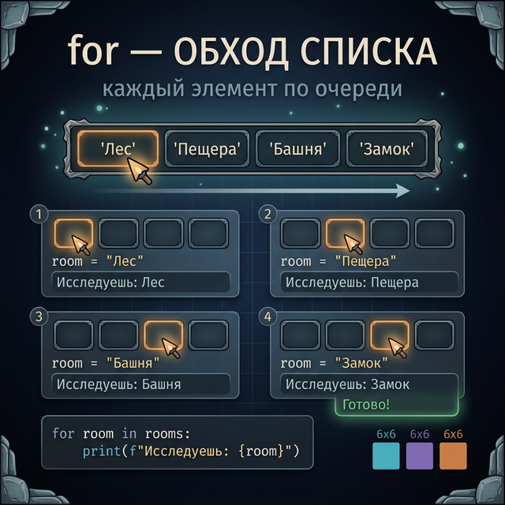
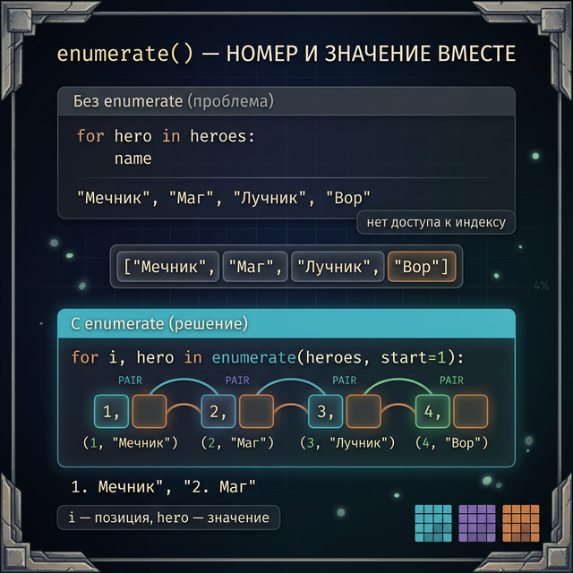
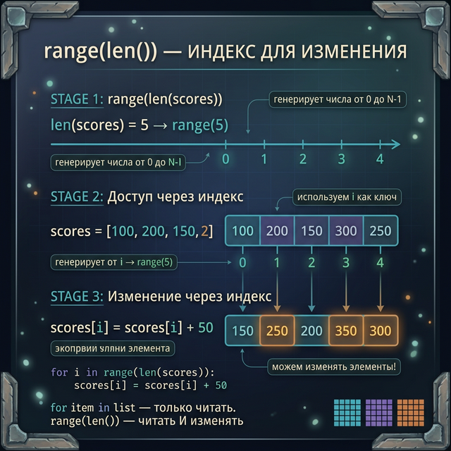
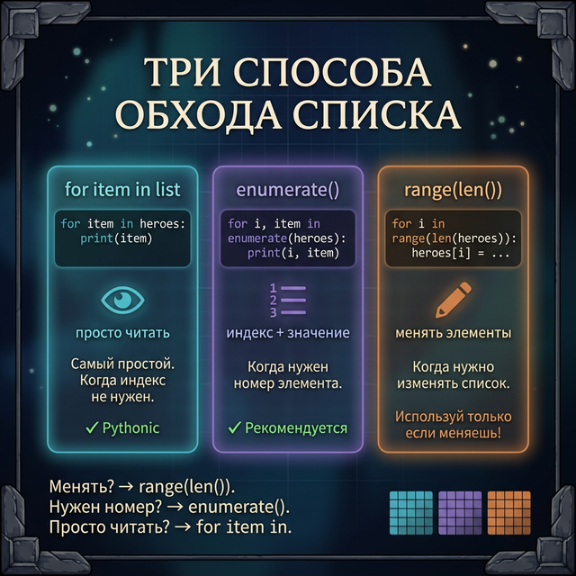
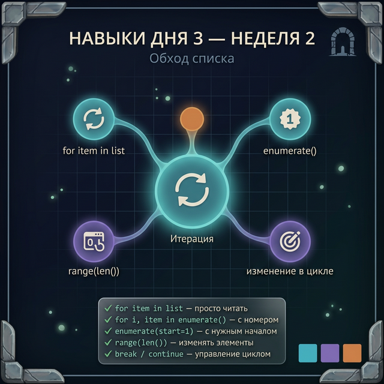

# Day 3: Перебор — обходим каждую клетку карты

> **Новые концепции сегодня:** `for item in list`, `enumerate()`, `range(len())`
>
> **Время:** ~35 минут (теория + практика)

---

## Часть 1. Зачем перебирать список?

### Аналогия: обходим все комнаты подземелья

Представь подземелье из 20 комнат. Ты хочешь проверить каждую — есть ли там монстр. Делать это вручную (`room[0]`, `room[1]`, ..., `room[19]`) — сумасшедшая работа. Тем более, если комнат 1000.

Перебор (итерация) — это способ **автоматически** пройти по всем элементам списка и что-то с каждым сделать: проверить, вывести, изменить, посчитать.

Вчера ты умел:
```python
inventory = ["меч", "щит", "зелье"]
print(inventory[0])    # меч
print(inventory[1])    # щит
print(inventory[2])    # зелье
```

Три строки для трёх предметов. А если предметов 50? Сегодня научимся делать это в одну строку цикла.

---

## Часть 2. for item in list — простой перебор

### Синтаксис

```python
for элемент in список:
    # делаем что-то с элементом
```

Это читается дословно: «для каждого элемента в списке — выполни блок кода».

### Первый пример

```python
inventory = ["меч", "щит", "зелье", "факел"]

for item in inventory:
    print(item)
```

**Вывод:**
```
меч
щит
зелье
факел
```

Python сам идёт по списку слева направо, на каждой итерации присваивает переменной `item` следующий элемент и выполняет тело цикла.

### Пошаговый разбор

```
Итерация 1: item = "меч"   → print("меч")
Итерация 2: item = "щит"   → print("щит")
Итерация 3: item = "зелье" → print("зелье")
Итерация 4: item = "факел" → print("факел")
Цикл завершён.
```



### Название переменной — произвольное

Называй переменную цикла по смыслу:

```python
weapons = ["кинжал", "лук", "посох"]
for weapon in weapons:
    print(f"Оружие: {weapon}")

scores = [150, 320, 80, 420]
for score in scores:
    print(f"Очки: {score}")
```

Имена `weapon` и `score` описывают, что лежит в переменной на каждой итерации. Это делает код читаемым.

### Пример: проверяем инвентарь на опасные предметы

```python
inventory = ["меч", "зелье яда", "факел", "взрывной бочонок", "ключ"]
dangerous = ["зелье яда", "взрывной бочонок"]

print("Проверка инвентаря:")
for item in inventory:
    if item in dangerous:
        print(f"  ⚠ ОПАСНО: {item}")
    else:
        print(f"  ✓ Безопасно: {item}")
```

**Вывод:**
```
Проверка инвентаря:
  ✓ Безопасно: меч
  ⚠ ОПАСНО: зелье яда
  ✓ Безопасно: факел
  ⚠ ОПАСНО: взрывной бочонок
  ✓ Безопасно: ключ
```

### Пример: суммируем очки

```python
scores = [150, 320, 80, 420, 95]
total = 0

for score in scores:
    total = total + score

print(f"Сумма очков: {total}")
```

**Вывод:**
```
Сумма очков: 1065
```

<quiz>
Q: Что выведет код: `for x in [10, 20, 30]: print(x * 2)`?
A: 20 40 60 (в одну строку)
A: 20, 40, 60
A: 20\n40\n60 (каждое с новой строки)
C: 20\n40\n60 (каждое с новой строки)
E: Каждый print() выводит значение на новой строке. x принимает 10, 20, 30 последовательно.

Q: Каким будет значение переменной item на второй итерации: `for item in ["а", "б", "в"]:`?
A: "а"
A: "б"
A: "в"
C: "б"
E: Первая итерация: item="а", вторая: item="б", третья: item="в".
</quiz>

---

## Часть 3. enumerate() — перебор с номером

### Проблема: нам нужен и элемент, и его позиция

Простой `for` даёт тебе элемент, но не его индекс. А что если нужно вывести «Место 1: Dragonborn», «Место 2: Shadowhunter» и так далее?

Можно было бы так (неудобно):

```python
leaderboard = ["Dragonborn", "Shadowhunter", "IronForge"]
i = 0
for player in leaderboard:
    print(f"Место {i + 1}: {player}")
    i = i + 1
```

Но есть лучший способ — `enumerate()`:

### Синтаксис enumerate()

```python
for i, элемент in enumerate(список):
    # i — индекс (0, 1, 2...)
    # элемент — значение
```

`enumerate()` «оборачивает» список, добавляя к каждому элементу его порядковый номер.

### Пример: таблица рекордов

```python
leaderboard = ["Dragonborn", "Shadowhunter", "IronForge", "NightWalker"]

for i, player in enumerate(leaderboard):
    print(f"Место {i + 1}: {player}")
```

**Вывод:**
```
Место 1: Dragonborn
Место 2: Shadowhunter
Место 3: IronForge
Место 4: NightWalker
```

`i` идёт от 0. Мы выводим `i + 1`, чтобы места начинались с 1, а не с 0.

### Что возвращает enumerate() на каждой итерации

```
Итерация 0: i=0, player="Dragonborn"
Итерация 1: i=1, player="Shadowhunter"
Итерация 2: i=2, player="IronForge"
Итерация 3: i=3, player="NightWalker"
```

`for i, player in ...` — это **распаковка**: Python видит пару `(0, "Dragonborn")` и раскладывает её в две переменные `i` и `player`.

### Параметр start — нумерация с нужного числа

```python
items = ["шлем", "броня", "штаны", "сапоги"]

for i, item in enumerate(items, start=1):
    print(f"Слот {i}: {item}")
```

**Вывод:**
```
Слот 1: шлем
Слот 2: броня
Слот 3: штаны
Слот 4: сапоги
```

`enumerate(items, start=1)` начинает счёт с 1 — тогда не нужно писать `i + 1`.

### Пример: находим тяжёлые предметы по позиции

```python
weights = [2, 8, 1, 15, 3]    # вес предметов в кг
items = ["факел", "нагрудник", "кинжал", "двуручный меч", "кольцо"]

for i, weight in enumerate(weights):
    if weight > 5:
        print(f"Слот {i}: {items[i]} ({weight} кг) — тяжёлый предмет!")
```

**Вывод:**
```
Слот 1: нагрудник (8 кг) — тяжёлый предмет!
Слот 3: двуручный меч (15 кг) — тяжёлый предмет!
```

Мы перебираем список весов, получаем индекс `i` и используем его для доступа к `items[i]`.



<quiz>
Q: Что выведет: `for i, v in enumerate(["а","б","в"]): print(i, v)`?
A: 0 а, 1 б, 2 в (в одну строку)
A: 0 а\n1 б\n2 в
A: 1 а\n2 б\n3 в
C: 0 а\n1 б\n2 в
E: enumerate() даёт пары (индекс, значение). Индексы начинаются с 0.

Q: Как вывести нумерацию с 1 через enumerate?
A: enumerate(lst, 0)
A: enumerate(lst, start=1)
A: enumerate(lst) + 1
C: enumerate(lst, start=1)
E: Параметр start задаёт начальное значение счётчика.
</quiz>

---

## Часть 4. range(len()) — когда нужен только индекс

### Третий способ перебора

Иногда нужен именно индекс, а не элемент — например, чтобы изменить каждый элемент списка. `for item in list` даёт копию элемента, изменение которой не меняет список. Для этого используют `range(len())`:

```python
for i in range(len(список)):
    список[i] = новое_значение
```

### Зачем это нужно

```python
hp_list = [100, 75, 90, 50]

# НЕПРАВИЛЬНО — список не изменится:
for hp in hp_list:
    hp = hp - 10     # это локальная копия, не элемент списка

print(hp_list)   # [100, 75, 90, 50] — не изменилось!

# ПРАВИЛЬНО — изменяем через индекс:
for i in range(len(hp_list)):
    hp_list[i] = hp_list[i] - 10

print(hp_list)   # [90, 65, 80, 40] — изменилось!
```



### Пример: урон по всем врагам

В Age of Empires часть атак (например, катапульта) бьёт по всем врагам в зоне. Уменьшим HP каждого на одинаковый урон:

```python
enemy_hp = [200, 150, 300, 80]
splash_damage = 25

print(f"HP до атаки: {enemy_hp}")

for i in range(len(enemy_hp)):
    enemy_hp[i] = enemy_hp[i] - splash_damage

print(f"HP после атаки: {enemy_hp}")
```

**Вывод:**
```
HP до атаки: [200, 150, 300, 80]
HP после атаки: [175, 125, 275, 55]
```

### Сравнение трёх подходов

```python
heroes = ["Маг", "Воин", "Лучник"]

# 1. Простой for — когда нужен только элемент
for hero in heroes:
    print(hero)

# 2. enumerate — когда нужен элемент И его индекс
for i, hero in enumerate(heroes):
    print(f"{i}: {hero}")

# 3. range(len) — когда нужно изменить элементы списка
for i in range(len(heroes)):
    heroes[i] = heroes[i].upper()
print(heroes)   # ['МАГ', 'ВОИН', 'ЛУЧНИК']
```



> [!TIP] Правило выбора
> - Нужен только элемент → `for item in list`
> - Нужен элемент + его номер → `for i, item in enumerate(list)`
> - Нужно изменить сам список → `for i in range(len(list))`

---

## Часть 5. Подводные камни

### Камень 1: изменение списка во время перебора

Добавлять или удалять элементы **внутри** `for item in list` — опасно. Python может пропустить элементы или войти в бесконечный цикл.

```python
items = ["меч", "зелье яда", "щит", "бомба"]

# ОПАСНО: удаляем во время перебора
for item in items:
    if item == "зелье яда":
        items.remove(item)   # непредсказуемо!

print(items)   # Может пропустить элементы
```

Безопасный способ — собрать элементы на удаление, потом удалить:

```python
items = ["меч", "зелье яда", "щит", "бомба"]
to_remove = []

for item in items:
    if item in ["зелье яда", "бомба"]:
        to_remove.append(item)

for item in to_remove:
    items.remove(item)

print(items)   # ['меч', 'щит']
```

### Камень 2: переменная цикла не изменяет список

```python
scores = [100, 200, 300]
for score in scores:
    score = score * 2     # изменяется только локальная переменная!
print(scores)   # [100, 200, 300] — список не изменился
```

Если нужно изменить список — используй `range(len())` и обращайся по индексу.

---

## Часть 6. Практика — теперь ты!

### Задание 1: Инвентарь (разминка)

У тебя список предметов: `["меч", "щит", "зелье", "факел", "ключ"]`.
Выведи каждый предмет в формате «Предмет N: название» (нумерация с 1).

**Ожидаемый результат:**
```
Предмет 1: меч
Предмет 2: щит
Предмет 3: зелье
Предмет 4: факел
Предмет 5: ключ
```

<details>
<summary>Подсказка</summary>

Используй `enumerate(items, start=1)`.

</details>

<details>
<summary>Решение</summary>

```python
items = ["меч", "щит", "зелье", "факел", "ключ"]

for i, item in enumerate(items, start=1):
    print(f"Предмет {i}: {item}")
```

</details>

---

### Задание 2: Подсчёт очков

Список очков пяти игроков: `[340, 120, 890, 455, 230]`.
Найди и выведи:
- Сумму всех очков
- Количество игроков с очками больше 300

**Ожидаемый результат:**
```
Сумма очков: 2035
Игроков с очками > 300: 3
```

<details>
<summary>Подсказка</summary>

Используй две переменные-счётчика: `total = 0` и `high_scorers = 0`. Обновляй их в цикле.

</details>

<details>
<summary>Решение</summary>

```python
scores = [340, 120, 890, 455, 230]
total = 0
high_scorers = 0

for score in scores:
    total = total + score
    if score > 300:
        high_scorers = high_scorers + 1

print(f"Сумма очков: {total}")
print(f"Игроков с очками > 300: {high_scorers}")
```

</details>

---

### Задание 3: Урон по врагам

Список HP врагов: `[100, 50, 200, 75, 150]`. Твой персонаж наносит 30 урона каждому врагу.
Вычти 30 из HP каждого врага (не меньше 0) и выведи результат.

**Ожидаемый результат:**
```
До атаки: [100, 50, 200, 75, 150]
После атаки: [70, 20, 170, 45, 120]
```

<details>
<summary>Подсказка</summary>

Используй `range(len(enemy_hp))` чтобы изменять элементы списка по индексу.

</details>

<details>
<summary>Решение</summary>

```python
enemy_hp = [100, 50, 200, 75, 150]
damage = 30

print(f"До атаки: {enemy_hp}")

for i in range(len(enemy_hp)):
    enemy_hp[i] = enemy_hp[i] - damage

print(f"После атаки: {enemy_hp}")
```

</details>

---

### Задание 4: Красивая таблица рекордов (мини-проект)

Два списка: имена и очки игроков (одного порядка).
Выведи таблицу с нумерацией, отметь игрока с наибольшими очками символом `★`.

```python
names  = ["Dragonborn", "Shadowhunter", "IronForge", "NightWalker", "ChaosLord"]
scores = [9500, 8200, 6800, 9800, 5100]
```

**Ожидаемый результат:**
```
=== ТАБЛИЦА РЕКОРДОВ ===
1. Dragonborn     — 9500 очков
2. Shadowhunter   — 8200 очков
3. IronForge      — 6800 очков
4. NightWalker ★  — 9800 очков
5. ChaosLord      — 5100 очков
```

<details>
<summary>Подсказка</summary>

Сначала найди максимум через обычный цикл (или просто запомни: NightWalker набрал 9800). Потом в основном цикле добавляй `★` если `scores[i]` равен максимуму. Найти максимальный элемент: храни переменную `max_score = scores[0]` и обновляй в цикле.

</details>

<details>
<summary>Решение</summary>

```python
names  = ["Dragonborn", "Shadowhunter", "IronForge", "NightWalker", "ChaosLord"]
scores = [9500, 8200, 6800, 9800, 5100]

# Найдём максимальный результат
max_score = scores[0]
for score in scores:
    if score > max_score:
        max_score = score

# Выводим таблицу
print("=== ТАБЛИЦА РЕКОРДОВ ===")
for i, name in enumerate(names, start=1):
    star = " ★" if scores[i - 1] == max_score else ""
    print(f"{i}. {name}{star} — {scores[i - 1]} очков")
```

</details>

---

## Часть 7. Итоги дня

| Подход | Синтаксис | Когда использовать |
|:-------|:----------|:-------------------|
| Простой for | `for item in lst` | Нужен только элемент |
| enumerate | `for i, item in enumerate(lst)` | Нужен элемент и его индекс |
| range(len) | `for i in range(len(lst))` | Нужно изменить элементы |

**Главные правила:**
- `for item in list` — переменная `item` это **копия** элемента, не сам элемент
- Изменение через `for item in list` НЕ меняет список
- Чтобы изменить — используй `list[i] = ...` через `range(len())`
- Не удаляй элементы из списка, пока итерируешься по нему

> [!TIP] enumerate() — твой лучший друг
> В большинстве случаев, когда кажется, что нужен `range(len())`, подойдёт `enumerate()`. Он чище и безопаснее. `range(len())` нужен только тогда, когда ты реально изменяешь элементы.



**Завтра:** научимся **сортировать** список — `sort()` и `sorted()`. Таблица рекордов станет настоящей: от большего к меньшему!

---

← [[Week 2 - Day 2 - List Modification\|День 2]] | [[python_basics/README\|Оглавление]] | [[Week 2 - Day 4 - Sorting\|День 4]] →
