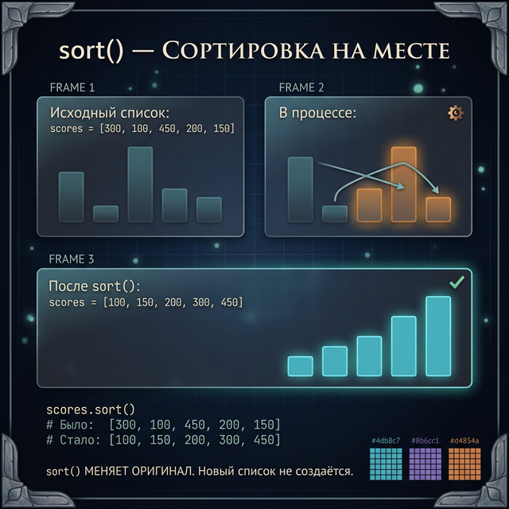
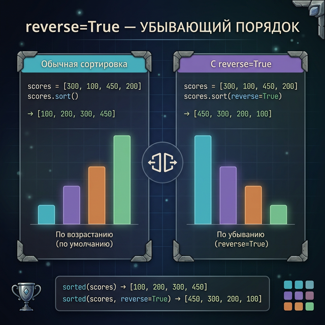
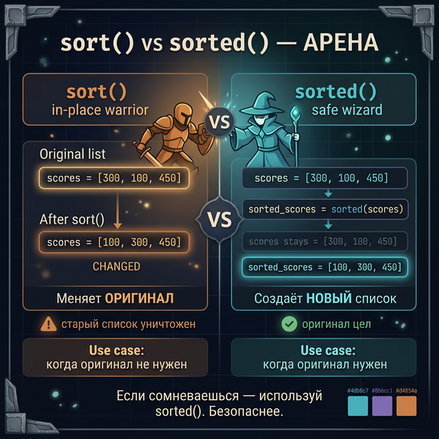
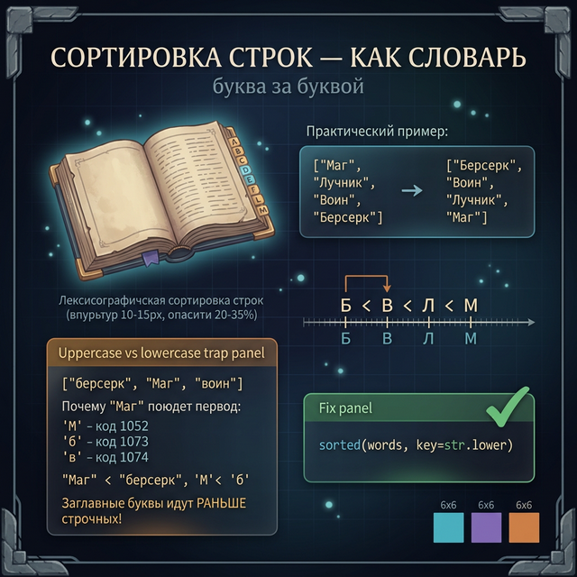
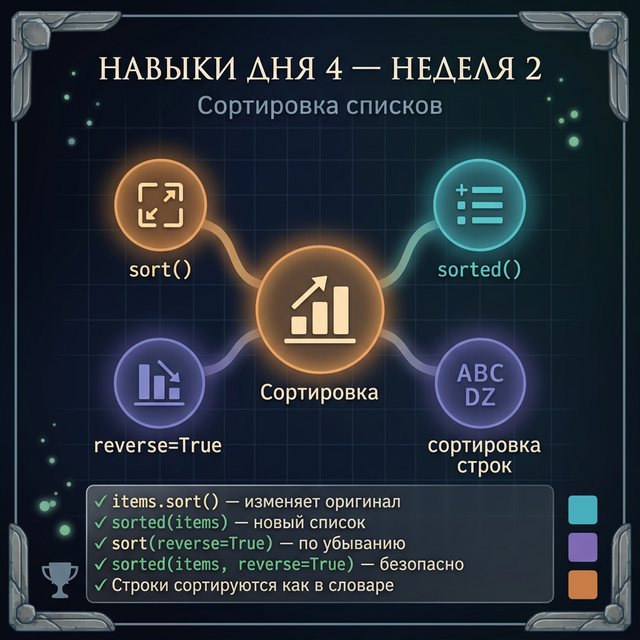

# Day 4: Сортировка — упорядочиваем мир

> **Новые концепции сегодня:** `list.sort()`, `sorted()`, `reverse=True`, сортировка строк по алфавиту
>
> **Время:** ~35 минут (теория + практика)

---

## Часть 1. Зачем нужна сортировка?

### Аналогия: таблица рекордов без сортировки

Представь таблицу рекордов Minecraft-сервера:

```
Игроки: ["Alex", "Steve", "Herobrine", "Notch", "Dream"]
Очки:   [1200, 800, 4500, 3100, 6200]
```

Вот так это выглядит без сортировки — в порядке регистрации игроков. Кто первый? Нужно вручную искать максимум. Неудобно.

Настоящая таблица рекордов в любой игре (CS:GO, Fortnite, Minecraft) сортирует игроков по убыванию очков автоматически. Сортировка — это не просто удобство, это обязательная часть любого рейтинга.

Сегодня изучим два инструмента сортировки: `sort()` и `sorted()`. Они похожи, но у них принципиальное различие — как у «изменить файл» и «создать новый файл».

---

## Часть 2. sort() — сортировка на месте

### Самый прямолинейный способ

`sort()` — это метод списка. Он **изменяет** сам список, переставляя элементы в порядке возрастания:

```python
scores = [1200, 800, 4500, 3100, 6200]
scores.sort()
print(scores)
```

**Вывод:**
```
[800, 1200, 3100, 4500, 6200]
```

Список отсортирован по возрастанию (от меньшего к большему). Исходный порядок уничтожен — список изменён «на месте».



### sort() ничего не возвращает

Частая ошибка новичков:

```python
scores = [1200, 800, 4500]
result = scores.sort()     # Что в result?
print(result)              # None — sort() возвращает None!
print(scores)              # [800, 1200, 4500] — список изменился
```

`sort()`, как `append()` и `remove()`, изменяет список и возвращает `None`. Не присваивай результат переменной — изменения уже в исходном списке.

### reverse=True — сортировка по убыванию

Для таблицы рекордов нам нужно от большего к меньшему:

```python
scores = [1200, 800, 4500, 3100, 6200]
scores.sort(reverse=True)
print(scores)
```

**Вывод:**
```
[6200, 4500, 3100, 1200, 800]
```

`reverse=True` переворачивает порядок — от большего к меньшему.



### Сортировка строк

`sort()` работает и со строками — по алфавиту (а точнее, по ASCII-коду каждой буквы):

```python
heroes = ["Воин", "Архимаг", "Лучник", "Берсерк", "Жрец"]
heroes.sort()
print(heroes)
```

**Вывод:**
```
['Архимаг', 'Берсерк', 'Воин', 'Жрец', 'Лучник']
```

Строки сортируются лексикографически — как в словаре. «А» раньше «Б», «Б» раньше «В» и так далее.

<quiz>
Q: Что вернёт вызов `[3, 1, 2].sort()`?
A: [1, 2, 3]
A: None
A: Ошибку
C: None
E: sort() изменяет список на месте и возвращает None. Сам список [3,1,2] после вызова станет [1,2,3].

Q: Как отсортировать список scores по убыванию?
A: scores.sort(reverse=False)
A: scores.sort(reverse=True)
A: scores.sort(-1)
C: scores.sort(reverse=True)
E: Параметр reverse=True переворачивает порядок сортировки — от большего к меньшему.
</quiz>

---

## Часть 3. sorted() — сортировка с сохранением оригинала

### Главное отличие от sort()

`sorted()` — это **встроенная функция** (не метод), которая возвращает **новый** отсортированный список, не меняя исходный:

```python
original = [1200, 800, 4500, 3100, 6200]
sorted_scores = sorted(original)

print(f"Оригинал:       {original}")
print(f"Отсортированный: {sorted_scores}")
```

**Вывод:**
```
Оригинал:       [1200, 800, 4500, 3100, 6200]
Отсортированный: [800, 1200, 3100, 4500, 6200]
```

Оригинальный список не изменился! Появился новый, отсортированный.

### Когда это важно

Представь: ты хочешь показать таблицу рекордов, но сохранить порядок регистрации игроков для других нужд.

```python
registration_order = ["Alex", "Herobrine", "Steve", "Dream", "Notch"]

# Хотим алфавитный список — но не ломаем порядок регистрации
alphabetical = sorted(registration_order)

print(f"Порядок регистрации: {registration_order}")
print(f"Алфавитный список:   {alphabetical}")
```

**Вывод:**
```
Порядок регистрации: ['Alex', 'Herobrine', 'Steve', 'Dream', 'Notch']
Алфавитный список:   ['Alex', 'Dream', 'Herobrine', 'Notch', 'Steve']
```

Оба списка существуют. `sort()` бы уничтожил исходный порядок.

### sorted() тоже поддерживает reverse=True

```python
scores = [1200, 800, 4500, 3100]
top_scores = sorted(scores, reverse=True)
print(top_scores)
```

**Вывод:**
```
[4500, 3100, 1200, 800]
```



---

## Часть 4. Арена: sort() vs sorted()

Когда что использовать? Вот сравнение на конкретных ситуациях:

| Ситуация | sort() | sorted() |
|:---------|:-------|:---------|
| Нужно отсортировать список навсегда | ✅ | ✅ |
| Нужен новый список, оригинал важен | ❌ | ✅ |
| Сортировать прямо в выражении | ❌ | ✅ |
| Экономия памяти (большой список) | ✅ | ❌ |

### Мини-эксперимент: запусти оба и сравни

```python
data = [5, 2, 8, 1, 9, 3]

# Путь А: sort()
data_a = [5, 2, 8, 1, 9, 3]
data_a.sort()
print(f"sort():   {data_a}")

# Путь Б: sorted()
data_b = [5, 2, 8, 1, 9, 3]
result_b = sorted(data_b)
print(f"sorted(): {result_b}")
print(f"original: {data_b}")
```

**Вывод:**
```
sort():   [1, 2, 3, 5, 8, 9]
sorted(): [1, 2, 3, 5, 8, 9]
original: [5, 2, 8, 1, 9, 3]
```

Результат одинаковый, но поведение разное: `sort()` меняет список, `sorted()` создаёт новый.

### Правило выбора

> [!TIP] Простое правило
> - Тебе важен **только итог** и оригинал не нужен → `sort()`
> - Тебе нужен **и оригинал, и отсортированная копия** → `sorted()`

<quiz>
Q: В чём ключевое отличие sorted() от sort()?
A: sorted() работает только с числами
A: sorted() возвращает новый список, не меняя оригинал
A: sorted() сортирует по убыванию
C: sorted() возвращает новый список, не меняя оригинал
E: sort() — метод списка, изменяет список. sorted() — функция, создаёт новый список.

Q: Что выведет: `lst = [3,1,2]; new = sorted(lst); print(lst)`?
A: [1, 2, 3]
A: [3, 1, 2]
A: None
C: [3, 1, 2]
E: sorted() не меняет оригинальный список. lst остаётся [3,1,2].
</quiz>

---

## Часть 5. Подводные камни

### Камень 1: нельзя смешивать типы при сортировке

```python
mixed = [1, "меч", 3, "щит"]
# mixed.sort()   # TypeError! Нельзя сравнить int и str
```

Python не знает, что больше — число `1` или строка `"меч"`. Убедись, что все элементы одного типа.

### Камень 2: заглавные буквы нарушают алфавит

```python
heroes = ["воин", "Архимаг", "лучник", "Берсерк"]
heroes.sort()
print(heroes)
```

**Вывод:**
```
['Архимаг', 'Берсерк', 'воин', 'лучник']
```

Python сортирует по ASCII-коду. Заглавные буквы (`А` = 192) идут **перед** строчными (`а` = 224) в русском Unicode. Поэтому `"Архимаг"` встаёт раньше `"воин"`.

Если нужна правильная алфавитная сортировка без учёта регистра — используй `key=str.lower`:

```python
heroes = ["воин", "Архимаг", "лучник", "Берсерк"]
heroes.sort(key=str.lower)
print(heroes)
```

**Вывод:**
```
['Архимаг', 'Берсерк', 'воин', 'лучник']
```



> [!NOTE] Параметр key
> `key=str.lower` — это дополнительный параметр сортировки. Python применяет `.lower()` к каждому элементу перед сравнением, но **не меняет сами элементы**. Мы подробно разберём `key=` в Week 5, когда изучим lambda.

### Камень 3: sort() и sorted() — стабильные

«Стабильная сортировка» значит: если два элемента равны, они останутся в том же относительном порядке. Это важно в реальных задачах — например, когда у двух игроков одинаковые очки.

```python
players = [("Alex", 500), ("Steve", 700), ("Dream", 500)]
# Сортировка по очкам: Alex и Dream равны — порядок сохранится
```

---

## Часть 6. Практика — теперь ты!

### Задание 1: Упорядочи очки (разминка)

Дан список очков: `[340, 120, 890, 455, 230, 670]`.
Выведи список в порядке возрастания, а потом в порядке убывания. Не меняй исходный список.

**Ожидаемый результат:**
```
По возрастанию: [120, 230, 340, 455, 670, 890]
По убыванию:   [890, 670, 455, 340, 230, 120]
Оригинал:      [340, 120, 890, 455, 230, 670]
```

<details>
<summary>Подсказка</summary>

Используй `sorted()` дважды — с `reverse=False` (или без него) и с `reverse=True`. Оригинал не изменится.

</details>

<details>
<summary>Решение</summary>

```python
scores = [340, 120, 890, 455, 230, 670]

ascending = sorted(scores)
descending = sorted(scores, reverse=True)

print(f"По возрастанию: {ascending}")
print(f"По убыванию:   {descending}")
print(f"Оригинал:      {scores}")
```

</details>

---

### Задание 2: Алфавитный список

Дан список персонажей в произвольном порядке: `["Жрец", "Воин", "Маг", "Архимаг", "Берсерк", "Лучник"]`.
Отсортируй список по алфавиту (регистр не важен) и выведи с нумерацией.

**Ожидаемый результат:**
```
1. Архимаг
2. Берсерк
3. Воин
4. Жрец
5. Лучник
6. Маг
```

<details>
<summary>Подсказка</summary>

Используй `sorted(classes, key=str.lower)` для корректной сортировки без учёта регистра, затем `enumerate()` для нумерации.

</details>

<details>
<summary>Решение</summary>

```python
classes = ["Жрец", "Воин", "Маг", "Архимаг", "Берсерк", "Лучник"]
sorted_classes = sorted(classes, key=str.lower)

for i, hero_class in enumerate(sorted_classes, start=1):
    print(f"{i}. {hero_class}")
```

</details>

---

### Задание 3: Топ-3 игрока

Дан список очков: `[1200, 800, 4500, 3100, 6200, 2700]`.
Найди и выведи три наибольших результата, не изменяя исходный список.

**Ожидаемый результат:**
```
Топ-3 результата: [6200, 4500, 3100]
Оригинал не изменён: [1200, 800, 4500, 3100, 6200, 2700]
```

<details>
<summary>Подсказка</summary>

Создай отсортированный по убыванию список через `sorted(..., reverse=True)`. Первые три элемента — это `sorted_list[0]`, `sorted_list[1]`, `sorted_list[2]`. (Срезы мы изучим завтра, но можно сделать и через индексы.)

</details>

<details>
<summary>Решение</summary>

```python
scores = [1200, 800, 4500, 3100, 6200, 2700]
sorted_scores = sorted(scores, reverse=True)

top3 = [sorted_scores[0], sorted_scores[1], sorted_scores[2]]
print(f"Топ-3 результата: {top3}")
print(f"Оригинал не изменён: {scores}")
```

</details>

---

### Задание 4: Полная таблица рекордов (мини-проект)

Создай таблицу рекордов из двух списков (имена и очки). Выведи таблицу в двух вариантах:
1. Отсортированный по очкам по убыванию
2. Алфавитный список игроков

```python
names  = ["Shadowhunter", "Alex", "Herobrine", "Dream", "Steve"]
scores = [4500, 1200, 8900, 6200, 3100]
```

**Ожидаемый результат:**
```
=== ПО ОЧКАМ ===
1. Herobrine  — 8900
2. Dream      — 6200
3. Shadowhunter — 4500
4. Steve      — 3100
5. Alex       — 1200

=== ПО АЛФАВИТУ ===
Alex, Dream, Herobrine, Shadowhunter, Steve
```

<details>
<summary>Подсказка 1</summary>

Для сортировки по очкам нужно иметь связку «имя + очки». Создай список пар: `pairs = []`, потом `pairs.append(scores[i])` и `pairs.append(names[i])` в цикле. Или создай через `enumerate`.

</details>

<details>
<summary>Подсказка 2</summary>

Sorted список пар сортируется по первому элементу пары. Если хранить `[очки, имя]` — сортировка будет по очкам.

</details>

<details>
<summary>Решение</summary>

```python
names  = ["Shadowhunter", "Alex", "Herobrine", "Dream", "Steve"]
scores = [4500, 1200, 8900, 6200, 3100]

# Создаём список пар [очки, имя]
pairs = []
for i in range(len(names)):
    pairs.append([scores[i], names[i]])

# Сортируем по очкам (первый элемент пары) по убыванию
pairs.sort(reverse=True)

print("=== ПО ОЧКАМ ===")
for i, pair in enumerate(pairs, start=1):
    print(f"{i}. {pair[1]}  — {pair[0]}")

# Алфавитный список
sorted_names = sorted(names)
print("\n=== ПО АЛФАВИТУ ===")
print(", ".join(sorted_names))
```

</details>

---

## Часть 7. Итоги дня

| Инструмент | Синтаксис | Меняет оригинал | Возвращает |
|:-----------|:----------|:----------------|:-----------|
| `sort()` | `lst.sort()` | ✅ Да | `None` |
| `sort(reverse=True)` | `lst.sort(reverse=True)` | ✅ Да | `None` |
| `sorted()` | `sorted(lst)` | ❌ Нет | Новый список |
| `sorted(reverse=True)` | `sorted(lst, reverse=True)` | ❌ Нет | Новый список |

**Главные правила:**
- `sort()` — меняет список, возвращает `None`
- `sorted()` — создаёт новый список, оригинал не трогает
- `reverse=True` — порядок убывания (от большего к меньшему)
- Нельзя смешивать числа и строки в одном сортируемом списке
- `key=str.lower` — игнорировать регистр при сортировке строк

> [!IMPORTANT] Запомни одним предложением
> `sort()` = «переставь карточки в колоде»; `sorted()` = «сфотографируй колоду в нужном порядке, сама колода не меняется».



**Завтра:** срезы списков — `list[1:4]`, копирование и интересная ловушка, которая ломает программы. Один из самых важных дней недели!

---

← [[Week 2 - Day 3 - List Iteration\|День 3]] | [[python_basics/README\|Оглавление]] | [[Week 2 - Day 5 - List Slicing\|День 5]] →
