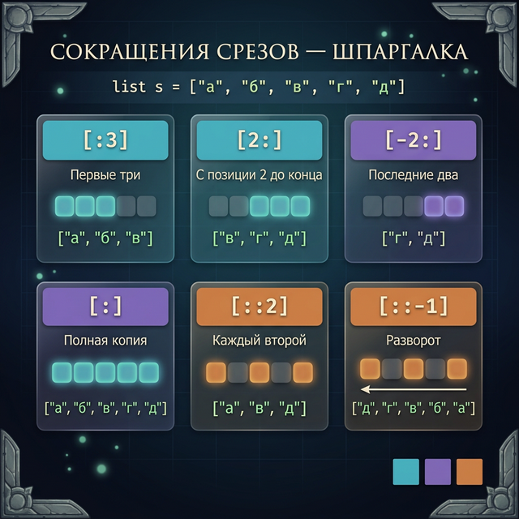
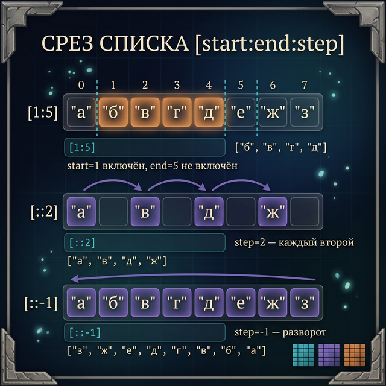
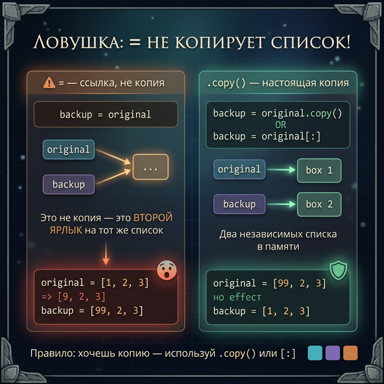
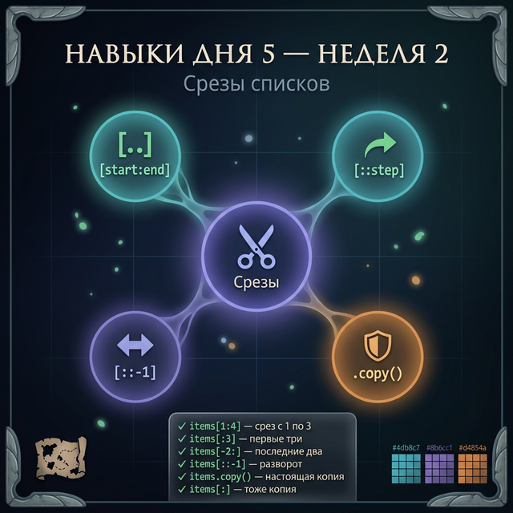

# Day 5: Срезы и копирование — вырезаем и дублируем

> **Новые концепции сегодня:** срезы `list[start:end]`, шаг `list[::step]`, `list.copy()` vs `list2 = list1` (ловушка!)
>
> **Время:** ~35 минут (теория + практика)

---

## Часть 1. Срезы — вырезаем кусок списка

### Аналогия: выбрать несколько слотов инвентаря

В Minecraft ты иногда хочешь взять не весь инвентарь, а только несколько слотов — например, только оружие (слоты 1-3) или только расходники (слоты 7-9). Без срезов пришлось бы выбирать каждый элемент по индексу вручную.

Срезы (slices) — это способ взять **часть** списка за одну операцию. Ты уже видел срезы строк в Week 1 Day 2 — у списков синтаксис точно такой же.

### Синтаксис

```python
список[start:end]       # элементы с индекса start до end (не включая end)
список[start:end:step]  # с шагом step
```

### Первый пример

```python
inventory = ["меч", "щит", "зелье", "факел", "ключ", "карта", "кольцо"]
#             0      1      2        3        4       5       6

weapons = inventory[0:2]    # Элементы 0 и 1
print(weapons)
```

**Вывод:**
```
['меч', 'щит']
```

`inventory[0:2]` — берём от индекса 0 до индекса 2, **не включая** 2. Получаем элементы 0 и 1.

### Полная карта срезов

```python
inventory = ["меч", "щит", "зелье", "факел", "ключ", "карта", "кольцо"]

print(inventory[0:3])    # ['меч', 'щит', 'зелье'] — первые 3
print(inventory[2:5])    # ['зелье', 'факел', 'ключ'] — элементы 2, 3, 4
print(inventory[4:])     # ['ключ', 'карта', 'кольцо'] — с 4 до конца
print(inventory[:3])     # ['меч', 'щит', 'зелье'] — с начала до 3 (не вкл.)
print(inventory[:])      # весь список — копия!
```

**Вывод:**
```
['меч', 'щит', 'зелье']
['зелье', 'факел', 'ключ']
['ключ', 'карта', 'кольцо']
['меч', 'щит', 'зелье']
['меч', 'щит', 'зелье', 'факел', 'ключ', 'карта', 'кольцо']
```



### Срезы с отрицательными индексами

```python
inventory = ["меч", "щит", "зелье", "факел", "ключ", "карта", "кольцо"]

print(inventory[-3:])    # ['ключ', 'карта', 'кольцо'] — последние 3
print(inventory[:-2])    # ['меч', 'щит', 'зелье', 'факел', 'ключ'] — все кроме последних 2
```

**Вывод:**
```
['ключ', 'карта', 'кольцо']
['меч', 'щит', 'зелье', 'факел', 'ключ']
```

### Пример: команда разделилась — берём первую половину

```python
players = ["Alex", "Steve", "Dream", "Notch", "Herobrine", "Skeppy"]
half = len(players) // 2    # //  — целочисленное деление (без остатка)

team_a = players[:half]
team_b = players[half:]

print(f"Команда А: {team_a}")
print(f"Команда Б: {team_b}")
```

**Вывод:**
```
Команда А: ['Alex', 'Steve', 'Dream']
Команда Б: ['Notch', 'Herobrine', 'Skeppy']
```

<quiz>
Q: Что вернёт `[10, 20, 30, 40, 50][1:4]`?
A: [10, 20, 30]
A: [20, 30, 40]
A: [20, 30, 40, 50]
C: [20, 30, 40]
E: [1:4] — элементы с индексами 1, 2, 3. Индекс 4 не включается.

Q: Как получить последние 3 элемента списка любого размера?
A: lst[3:]
A: lst[-3:]
A: lst[:-3]
C: lst[-3:]
E: lst[-3:] — срез от третьего с конца до конца списка.
</quiz>

---

## Часть 2. Шаг среза — берём каждый N-й элемент

### Третий параметр: step

```python
список[start:end:step]
```

`step` — через сколько элементов шагать. `step=2` — каждый второй, `step=3` — каждый третий.

```python
numbers = [0, 1, 2, 3, 4, 5, 6, 7, 8, 9]

print(numbers[::2])     # каждый второй: [0, 2, 4, 6, 8]
print(numbers[1::2])    # каждый второй начиная с 1: [1, 3, 5, 7, 9]
print(numbers[::3])     # каждый третий: [0, 3, 6, 9]
```

**Вывод:**
```
[0, 2, 4, 6, 8]
[1, 3, 5, 7, 9]
[0, 3, 6, 9]
```

### Разворот списка через срез [::-1]

`step=-1` — идём справа налево, то есть разворачиваем список:

```python
levels = [1, 2, 3, 4, 5]
reversed_levels = levels[::-1]
print(reversed_levels)
```

**Вывод:**
```
[5, 4, 3, 2, 1]
```

Это быстрый способ получить перевёрнутый список. Исходный при этом не меняется.

### Пример: история ходов в шахматах

В шахматной программе история ходов хранится как список. `[::-1]` — покажет историю от последнего хода к первому:

```python
moves = ["e2-e4", "e7-e5", "g1-f3", "b8-c6", "f1-c4"]
print(f"Порядок ходов: {moves}")
print(f"В обратном порядке: {moves[::-1]}")
```

**Вывод:**
```
Порядок ходов: ['e2-e4', 'e7-e5', 'g1-f3', 'b8-c6', 'f1-c4']
В обратном порядке: ['f1-c4', 'b8-c6', 'g1-f3', 'e7-e5', 'e2-e4']
```

### Срез создаёт новый список

Важно понимать: срез **не изменяет** исходный список. Он создаёт новый:

```python
full_inventory = ["меч", "щит", "зелье", "факел", "ключ"]
weapons = full_inventory[0:2]

weapons[0] = "НОВЫЙ МЕЧ"   # изменяем только weapons
print(full_inventory)       # оригинал не изменился
print(weapons)
```

**Вывод:**
```
['меч', 'щит', 'зелье', 'факел', 'ключ']
['НОВЫЙ МЕЧ', 'щит']
```



<quiz>
Q: Что выведет `[1,2,3,4,5,6][::-1]`?
A: [1, 2, 3, 4, 5, 6]
A: [6, 5, 4, 3, 2, 1]
A: Ошибку
C: [6, 5, 4, 3, 2, 1]
E: Шаг -1 разворачивает список справа налево.
</quiz>

---

## Часть 3. Копирование списков — главная ловушка Python

### Проблема: list2 = list1 — НЕ копирует список

Вот самая опасная ловушка при работе со списками. Давай посмотрим:

```python
original = ["меч", "щит", "зелье"]
copy = original       # Кажется, мы скопировали?

copy.append("факел")  # Добавляем в "копию"

print(f"original: {original}")
print(f"copy:     {copy}")
```

**Вывод:**
```
original: ['меч', 'щит', 'зелье', 'факел']
copy:     ['меч', 'щит', 'зелье', 'факел']
```

Мы изменили `copy`, а изменился **оба**! Потому что `copy = original` не создаёт новый список — обе переменные указывают на **один и тот же** список в памяти.

### Аналогия: адрес vs квартира

Представь, что список — это квартира. Переменная — это листочек бумаги с адресом квартиры.

```python
original = ["меч", "щит"]    # Квартира на ул. Памяти, д.1
copy = original               # Ещё один листочек с тем же адресом
```

`copy` — это не новая квартира. Это другой листочек с тем же адресом. Когда ты «входишь» через `copy` и ломаешь мебель — мебель сломана и для `original`, потому что это **одна квартира**.

### Как правильно скопировать список

**Способ 1: метод copy()**

```python
original = ["меч", "щит", "зелье"]
proper_copy = original.copy()   # Создаём НОВЫЙ список

proper_copy.append("факел")

print(f"original:     {original}")
print(f"proper_copy:  {proper_copy}")
```

**Вывод:**
```
original:     ['меч', 'щит', 'зелье']
proper_copy:  ['меч', 'щит', 'зелье', 'факел']
```

Теперь это два разных списка. Изменение одного не затрагивает другой.

**Способ 2: срез [:]**

```python
original = ["меч", "щит", "зелье"]
proper_copy = original[:]   # Срез всего списка = копия
```

`original[:]` создаёт новый список с теми же элементами. Работает так же, как `.copy()`.

### Пример: сохраняем состояние инвентаря перед битвой

```python
inventory_before = ["меч", "щит", "5 зелий", "факел"]
inventory_battle = inventory_before.copy()   # Копируем для боя

# В бою теряем зелья и факел
inventory_battle.remove("5 зелий")
inventory_battle.remove("факел")

print(f"До битвы:  {inventory_before}")
print(f"После боя: {inventory_battle}")
```

**Вывод:**
```
До битвы:  ['меч', 'щит', '5 зелий', 'факел']
После боя: ['меч', 'щит']
```

Состояние «до битвы» сохранено. Без `.copy()` оба списка потеряли бы зелья и факел.



<quiz>
Q: Что произойдёт если написать: `b = a; b.append(4)` где a = [1,2,3]?
A: b станет [1,2,3,4], a останется [1,2,3]
A: Оба a и b станут [1,2,3,4]
A: Ошибка — нельзя присваивать списки
C: Оба a и b станут [1,2,3,4]
E: b = a не копирует список. Оба указывают на один объект в памяти.

Q: Как правильно создать независимую копию списка?
A: copy_list = original_list
A: copy_list = original_list.copy()
A: copy_list = copy(original_list)
C: copy_list = original_list.copy()
E: .copy() создаёт новый независимый список с теми же элементами.
</quiz>

---

## Часть 4. Подводные камни

### Камень 1: срез за пределами — не ошибка

Если указать индекс среза за пределами списка, Python не выдаст ошибку — просто вернёт то, что есть:

```python
lst = [1, 2, 3]
print(lst[0:100])    # [1, 2, 3] — не ошибка, просто весь список
print(lst[10:20])    # [] — пустой список
```

Это отличается от обычного индекса `lst[100]` — там будет `IndexError`.

### Камень 2: copy() — поверхностная копия

`.copy()` работает правильно для списков строк и чисел. Но если список содержит **вложенные списки**, они всё равно будут общими:

```python
matrix = [[1, 2], [3, 4]]
copy_matrix = matrix.copy()

copy_matrix[0].append(99)   # Изменяем вложенный список

print(matrix)       # [[1, 2, 99], [3, 4]] — тоже изменился!
print(copy_matrix)  # [[1, 2, 99], [3, 4]]
```

Это называется «поверхностное копирование» (shallow copy). Для наших задач сейчас достаточно — вложенные списки изучим позже.

### Камень 3: step=0 — всегда ошибка

```python
lst = [1, 2, 3]
# lst[::0]   # ValueError: slice step cannot be zero
```

Шаг не может быть нулём — иначе Python будет «идти» на месте бесконечно.

---

## Часть 5. Практика — теперь ты!

### Задание 1: Разделить инвентарь (разминка)

Список предметов: `["меч", "щит", "зелье", "факел", "ключ", "карта", "кольцо", "свиток"]`.
Выведи:
- первые 3 предмета
- последние 3 предмета
- элементы с 3 по 6 (включительно)

<details>
<summary>Подсказка</summary>

Первые 3: `lst[:3]`. Последние 3: `lst[-3:]`. Элементы 3-6 (включительно): `lst[3:7]`.

</details>

<details>
<summary>Решение</summary>

```python
inventory = ["меч", "щит", "зелье", "факел", "ключ", "карта", "кольцо", "свиток"]

print(f"Первые 3: {inventory[:3]}")
print(f"Последние 3: {inventory[-3:]}")
print(f"Элементы 3-6: {inventory[3:7]}")
```

</details>

---

### Задание 2: Чётные и нечётные

Список чисел: `[0, 1, 2, 3, 4, 5, 6, 7, 8, 9]`.
Используй срезы, чтобы получить:
- только чётные числа (0, 2, 4, 6, 8)
- только нечётные числа (1, 3, 5, 7, 9)
- список в обратном порядке

<details>
<summary>Подсказка</summary>

Чётные: `numbers[::2]`. Нечётные: `numbers[1::2]`. Обратный: `numbers[::-1]`.

</details>

<details>
<summary>Решение</summary>

```python
numbers = [0, 1, 2, 3, 4, 5, 6, 7, 8, 9]

print(f"Чётные: {numbers[::2]}")
print(f"Нечётные: {numbers[1::2]}")
print(f"Обратный: {numbers[::-1]}")
```

</details>

---

### Задание 3: Безопасный бэкап

У тебя есть инвентарь персонажа. Создай **независимую** копию перед рискованным заданием. Измени копию (удали 2 предмета, добавь 1 новый). Убедись, что оригинал не изменился.

```python
safe_inventory = ["меч", "щит", "3 зелья", "факел", "амулет", "кольцо"]
```

**Ожидаемый результат:**
```
Оригинал до: ['меч', 'щит', '3 зелья', 'факел', 'амулет', 'кольцо']
После задания: ['меч', 'щит', 'факел', 'амулет', 'кольцо', 'эпический лут']
Оригинал после: ['меч', 'щит', '3 зелья', 'факел', 'амулет', 'кольцо']
```

<details>
<summary>Подсказка</summary>

Используй `.copy()` чтобы создать независимую копию. Потом вызывай методы на копии.

</details>

<details>
<summary>Решение</summary>

```python
safe_inventory = ["меч", "щит", "3 зелья", "факел", "амулет", "кольцо"]
print(f"Оригинал до: {safe_inventory}")

quest_inventory = safe_inventory.copy()
quest_inventory.remove("3 зелья")
quest_inventory.append("эпический лут")

print(f"После задания: {quest_inventory}")
print(f"Оригинал после: {safe_inventory}")
```

</details>

---

### Задание 4: Топ-3 с сохранением (мини-проект)

Список очков игроков (в порядке регистрации): `[3200, 8900, 1500, 6700, 4100, 9500, 2300]`.
Не меняя исходный список:
1. Найди топ-3 результата (наибольшие)
2. Найди трёх аутсайдеров (наименьшие)
3. Выведи оба списка и подтверди, что оригинал не изменился

**Ожидаемый результат:**
```
Оригинал: [3200, 8900, 1500, 6700, 4100, 9500, 2300]
Топ-3: [9500, 8900, 6700]
Аутсайдеры: [1500, 2300, 3200]
Оригинал не изменён: [3200, 8900, 1500, 6700, 4100, 9500, 2300]
```

<details>
<summary>Подсказка</summary>

Используй `sorted()` (не `sort()`!) для создания отсортированных копий. Потом бери срезы: первые 3 для топа, последние 3 для аутсайдеров.

</details>

<details>
<summary>Решение</summary>

```python
scores = [3200, 8900, 1500, 6700, 4100, 9500, 2300]
print(f"Оригинал: {scores}")

sorted_desc = sorted(scores, reverse=True)
sorted_asc = sorted(scores)

top3 = sorted_desc[:3]
bottom3 = sorted_asc[:3]

print(f"Топ-3: {top3}")
print(f"Аутсайдеры: {bottom3}")
print(f"Оригинал не изменён: {scores}")
```

</details>

---

## Часть 6. Итоги дня

| Синтаксис | Что делает |
|:----------|:-----------|
| `lst[start:end]` | Элементы от start до end (не включая end) |
| `lst[:n]` | Первые n элементов |
| `lst[-n:]` | Последние n элементов |
| `lst[::2]` | Каждый второй элемент |
| `lst[::-1]` | Список в обратном порядке |
| `lst.copy()` | Независимая копия списка |
| `lst[:]` | Тоже независимая копия |

**Главные правила:**
- Срез создаёт **новый** список — оригинал не меняется
- `list2 = list1` — НЕ копирование! Обе переменные смотрят на один список
- Для независимой копии: `.copy()` или `[:]`
- Срез за пределами — не ошибка, просто обрезается по реальной длине
- `[::-1]` — быстрый разворот списка

> [!WARNING] Запомни на всю жизнь
> `b = a` для списков — это не копия, это второй ярлык на ту же полку. Изменишь через `b` — изменится и `a`. Всегда используй `.copy()` когда нужна независимость.



**Завтра:** практикум! Собираем всё вместе — таблица рекордов RPG с полным функционалом.

---

← [[Week 2 - Day 4 - Sorting\|День 4]] | [[python_basics/README\|Оглавление]] | [[Week 2 - Day 6 - Practice Leaderboard\|День 6]] →
