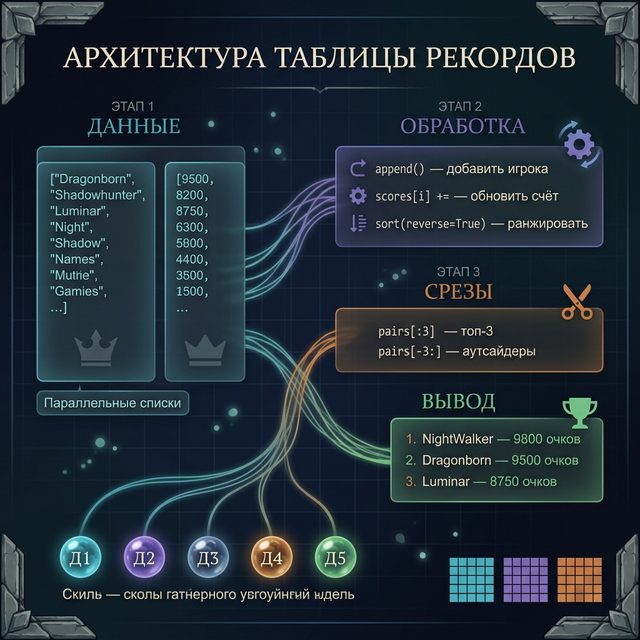
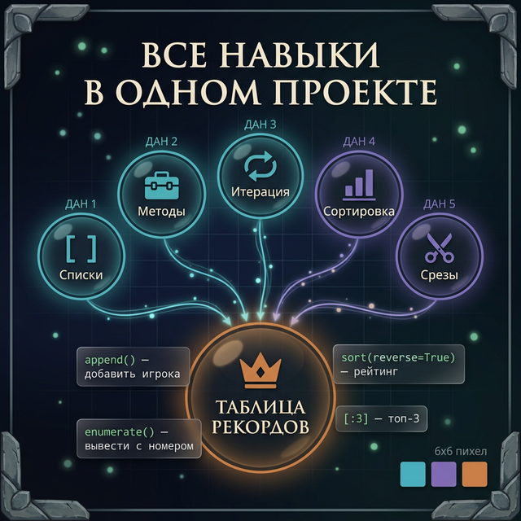

# Day 6: Практикум — таблица рекордов RPG

> **Сегодня:** только практика. Строим настоящую систему рейтинга с нуля.
>
> **Время:** ~45 минут

---

## Часть 1. Что мы строим

За эту неделю ты освоил все ключевые операции со списками:
- **День 1**: создание, доступ, изменение по индексу
- **День 2**: `append()`, `insert()`, `remove()`, `pop()`
- **День 3**: `for`, `enumerate()`, `range(len())`
- **День 4**: `sort()`, `sorted()`, `reverse=True`
- **День 5**: срезы `[start:end:step]`, `.copy()` vs `=`

Сегодня собираем всё это в один проект: **систему таблицы рекордов RPG-сервера**.



Финальная программа умеет:
1. Хранить игроков и их очки
2. Добавлять новых игроков
3. Обновлять счёт после матча
4. Выводить топ-5 и аутсайдеров
5. Искать конкретного игрока

---

## Часть 2. Стартовые данные (каркас)

Начнём с готовых данных и постепенно добавим функциональность. Скопируй этот стартовый код:

```python
# Стартовые данные сервера RPG
names  = ["Dragonborn", "Shadowhunter", "IronForge", "NightWalker",
          "ChaosLord", "StormBringer", "VoidWalker", "Luminar"]
scores = [9500, 8200, 6800, 9800, 5100, 7300, 4400, 8750]
```

Два параллельных списка: `names[i]` и `scores[i]` — это данные одного игрока.

![Параллельные списки — names[i] и scores[i] это данные одного игрока](day_6/day_6_parallel_lists.png)

---

## Часть 3. Задание 1 — вывести текущий рейтинг

**Задача:** вывести всех игроков с их позицией и очками, **отсортированных по убыванию очков**.

**Ожидаемый результат:**
```
=== РЕЙТИНГ СЕРВЕРА ===
 1. NightWalker     — 9800 очков
 2. Dragonborn      — 9500 очков
 3. Luminar         — 8750 очков
 4. Shadowhunter    — 8200 очков
 5. StormBringer    — 7300 очков
 6. IronForge       — 6800 очков
 7. ChaosLord       — 5100 очков
 8. VoidWalker      — 4400 очков
========================
```

<details>
<summary>Подсказка</summary>

Создай список пар `[очки, имя]` через цикл, отсортируй его по убыванию (`sort(reverse=True)`) — пары сортируются по первому элементу. Потом выводи с `enumerate(start=1)`.

</details>

<details>
<summary>Решение</summary>

```python
names  = ["Dragonborn", "Shadowhunter", "IronForge", "NightWalker",
          "ChaosLord", "StormBringer", "VoidWalker", "Luminar"]
scores = [9500, 8200, 6800, 9800, 5100, 7300, 4400, 8750]

# Создаём пары [очки, имя]
pairs = []
for i in range(len(names)):
    pairs.append([scores[i], names[i]])

pairs.sort(reverse=True)

print("=== РЕЙТИНГ СЕРВЕРА ===")
for i, pair in enumerate(pairs, start=1):
    print(f"{i:2}. {pair[1]:<15} — {pair[0]} очков")
print("========================")
```

</details>

---

## Часть 4. Задание 2 — добавить нового игрока

**Задача:** добавить нового игрока `"PhoenixRider"` с `7800` очками. Вывести обновлённый рейтинг.

Новый игрок добавляется в конец обоих списков.

**Ожидаемый результат:**
```
Добавлен: PhoenixRider (7800 очков)
Всего игроков: 9
=== РЕЙТИНГ ПОСЛЕ ДОБАВЛЕНИЯ ===
 1. NightWalker     — 9800 очков
 2. Dragonborn      — 9500 очков
 3. Luminar         — 8750 очков
 4. Shadowhunter    — 8200 очков
 5. PhoenixRider    — 7800 очков
 ...
```

<details>
<summary>Подсказка</summary>

`names.append("PhoenixRider")` и `scores.append(7800)` — добавить в оба списка.

</details>

<details>
<summary>Решение</summary>

```python
# Добавляем нового игрока
new_name = "PhoenixRider"
new_score = 7800

names.append(new_name)
scores.append(new_score)

print(f"Добавлен: {new_name} ({new_score} очков)")
print(f"Всего игроков: {len(names)}")

# Выводим обновлённый рейтинг
pairs = []
for i in range(len(names)):
    pairs.append([scores[i], names[i]])
pairs.sort(reverse=True)

print("=== РЕЙТИНГ ПОСЛЕ ДОБАВЛЕНИЯ ===")
for i, pair in enumerate(pairs, start=1):
    print(f"{i:2}. {pair[1]:<15} — {pair[0]} очков")
```

</details>

---

## Часть 5. Задание 3 — обновить счёт игрока

**Задача:** игрок `"IronForge"` выиграл матч и получил `+1500` очков. Найди его в списке и обнови счёт.

**Ожидаемый результат:**
```
IronForge: 6800 → 8300 очков
```

<details>
<summary>Подсказка</summary>

Найди индекс игрока: используй цикл `for i, name in enumerate(names)` и проверяй `if name == "IronForge"`. Потом обнови `scores[i]`.

</details>

<details>
<summary>Решение</summary>

```python
target = "IronForge"
bonus = 1500

for i, name in enumerate(names):
    if name == target:
        old_score = scores[i]
        scores[i] = scores[i] + bonus
        print(f"{name}: {old_score} → {scores[i]} очков")
```

</details>

---

## Часть 6. Задание 4 — топ-3 и аутсайдеры

**Задача:** вывести топ-3 игроков и 3 игроков с наименьшими очками. Не меняй оригинальные списки.

**Ожидаемый результат:**
```
=== ТОП-3 ===
1. NightWalker  — 9800
2. Dragonborn   — 9500
3. Luminar      — 8750

=== АУТСАЙДЕРЫ ===
1. VoidWalker   — 4400
2. ChaosLord    — 5100
3. StormBringer — 7300
```

<details>
<summary>Подсказка</summary>

Создай список пар, отсортируй: одну копию по убыванию (топ), другую по возрастанию (аутсайдеры). Бери срез `[:3]` у каждой.

</details>

<details>
<summary>Решение</summary>

```python
# Создаём список пар (не меняем оригиналы)
pairs = []
for i in range(len(names)):
    pairs.append([scores[i], names[i]])

top_pairs = sorted(pairs, reverse=True)[:3]
bottom_pairs = sorted(pairs)[:3]

print("=== ТОП-3 ===")
for i, pair in enumerate(top_pairs, start=1):
    print(f"{i}. {pair[1]:<12} — {pair[0]}")

print("\n=== АУТСАЙДЕРЫ ===")
for i, pair in enumerate(bottom_pairs, start=1):
    print(f"{i}. {pair[1]:<12} — {pair[0]}")
```

</details>

---

## Часть 7. Задание 5 — поиск игрока (финальный босс)

**Задача:** программа спрашивает имя игрока и выводит его позицию в рейтинге и очки. Если игрока нет — сообщение об ошибке.

**Ожидаемый результат:**
```
Кого ищем? Luminar
Игрок: Luminar
Очки: 8750
Позиция в рейтинге: 3 из 9
```

```
Кого ищем? GhostPlayer
Игрок "GhostPlayer" не найден на сервере.
```

<details>
<summary>Подсказка 1</summary>

Сначала проверь: `if player_name in names`. Если нет — выводи сообщение об ошибке.

</details>

<details>
<summary>Подсказка 2</summary>

Чтобы найти позицию: создай отсортированный список пар `sorted(pairs, reverse=True)`, потом пройдись по нему с `enumerate` и найди нужное имя.

</details>

<details>
<summary>Решение</summary>

```python
search_name = input("Кого ищем? ")

if search_name not in names:
    print(f'Игрок "{search_name}" не найден на сервере.')
else:
    # Находим очки игрока
    player_index = 0
    for i, name in enumerate(names):
        if name == search_name:
            player_index = i

    player_score = scores[player_index]

    # Определяем позицию в рейтинге
    pairs = []
    for i in range(len(names)):
        pairs.append([scores[i], names[i]])
    pairs.sort(reverse=True)

    position = 1
    for i, pair in enumerate(pairs, start=1):
        if pair[1] == search_name:
            position = i

    print(f"Игрок: {search_name}")
    print(f"Очки: {player_score}")
    print(f"Позиция в рейтинге: {position} из {len(names)}")
```

</details>

---

## Часть 8. Бонус — соберём всё вместе

Если выполнил все 5 заданий — попробуй объединить их в одну программу с меню:

```
=== УПРАВЛЕНИЕ РЕЙТИНГОМ ===
1. Показать рейтинг
2. Добавить игрока
3. Обновить счёт
4. Показать топ-3 и аутсайдеров
5. Найти игрока
0. Выход

Выбор:
```

Это уже настоящая программа с пользовательским интерфейсом!

<details>
<summary>Каркас программы</summary>

```python
names  = ["Dragonborn", "Shadowhunter", "IronForge", "NightWalker",
          "ChaosLord", "StormBringer", "VoidWalker", "Luminar"]
scores = [9500, 8200, 6800, 9800, 5100, 7300, 4400, 8750]

while True:
    print("\n=== УПРАВЛЕНИЕ РЕЙТИНГОМ ===")
    print("1. Показать рейтинг")
    print("2. Добавить игрока")
    print("3. Обновить счёт")
    print("4. Топ-3 и аутсайдеры")
    print("5. Найти игрока")
    print("0. Выход")

    choice = input("Выбор: ")

    if choice == "1":
        pairs = []
        for i in range(len(names)):
            pairs.append([scores[i], names[i]])
        pairs.sort(reverse=True)
        print("\n=== РЕЙТИНГ ===")
        for i, pair in enumerate(pairs, start=1):
            print(f"{i:2}. {pair[1]:<15} — {pair[0]}")

    elif choice == "2":
        new_name = input("Имя: ")
        new_score = int(input("Очки: "))
        names.append(new_name)
        scores.append(new_score)
        print(f"Добавлен: {new_name}")

    elif choice == "3":
        target = input("Имя игрока: ")
        if target in names:
            bonus = int(input("Добавить очков: "))
            for i, name in enumerate(names):
                if name == target:
                    scores[i] = scores[i] + bonus
                    print(f"{target}: теперь {scores[i]} очков")
        else:
            print("Игрок не найден")

    elif choice == "4":
        pairs = []
        for i in range(len(names)):
            pairs.append([scores[i], names[i]])
        top3 = sorted(pairs, reverse=True)[:3]
        bot3 = sorted(pairs)[:3]
        top_names = []
        for p in top3:
            top_names.append(p[1])
        bot_names = []
        for p in bot3:
            bot_names.append(p[1])
        print("Топ:", top_names)
        print("Аутсайдеры:", bot_names)

    elif choice == "5":
        search = input("Имя: ")
        if search in names:
            for i, name in enumerate(names):
                if name == search:
                    print(f"{search}: {scores[i]} очков")
        else:
            print("Не найден")

    elif choice == "0":
        print("До свидания!")
        break
```

</details>

---

## Часть 9. Итоги практикума

Сегодня ты написал программу, которая использует **все** инструменты недели:

| Что использовали | Где |
|:----------------|:----|
| Создание списка | Стартовые данные |
| Доступ по индексу `[i]` | Получение очков игрока |
| `append()` | Добавление игрока |
| `enumerate()` | Вывод рейтинга с нумерацией |
| `for` по списку | Поиск игрока |
| `range(len())` | Изменение очков по индексу |
| `sort()` / `sorted()` | Сортировка рейтинга |
| `reverse=True` | Убывающий порядок |
| срезы `[:3]` | Топ-3 и аутсайдеры |
| `in` | Проверка наличия игрока |



**Завтра:** лонгрид о том, как списки устроены в реальных играх — от Terraria до Pokemon. Без кода, только интересные истории.

---

← [[Week 2 - Day 5 - List Slicing\|День 5]] | [[python_basics/README\|Оглавление]] | [[Week 2 - Day 7 - Rest\|День 7]] →
