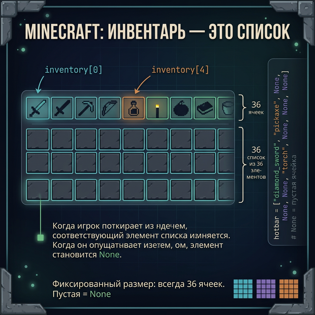
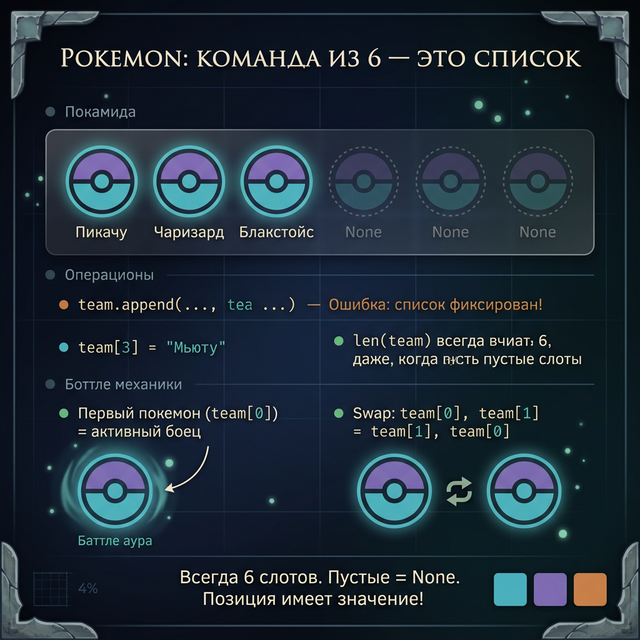
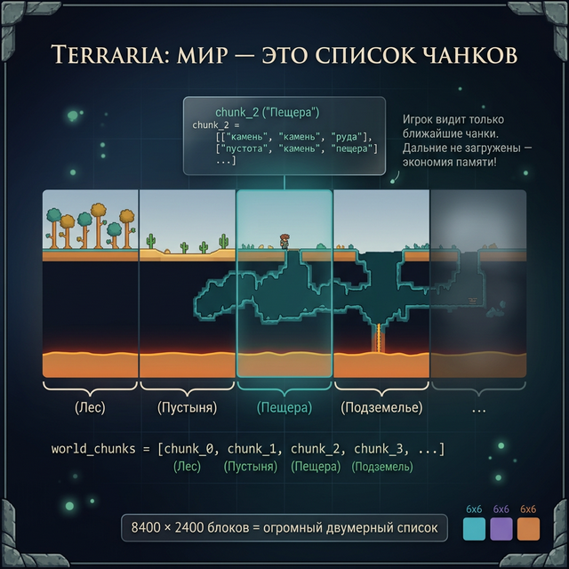
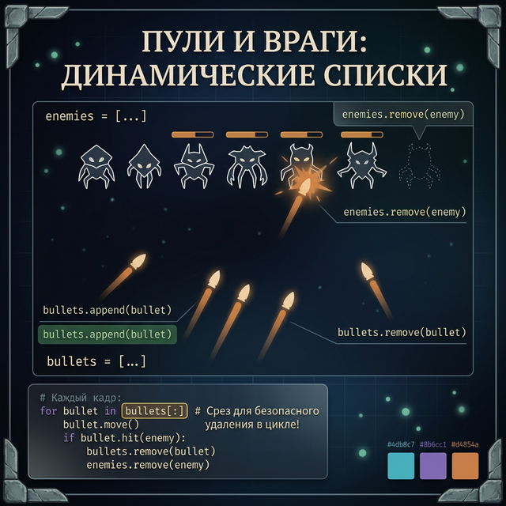
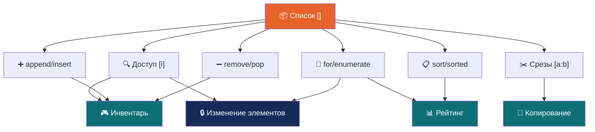

# Day 7: Как списки устроены в реальных играх

> **Сегодня:** никакого нового кода. Только истории о том, как то, что ты изучил за неделю, работает в играх с миллионами игроков.
>
> **Время:** ~60 минут чтения

---

## Часть 1. Введение

Ты провёл неделю, изучая списки. `append()`, `sort()`, срезы, `enumerate()`. На первый взгляд — просто учебные упражнения.

Но каждый раз, когда ты открываешь инвентарь в Minecraft, смотришь на таблицу рекордов в CS:GO или переключаешь Pokemon в своей команде — ты взаимодействуешь со списками. Огромными, сложными, оптимизированными — но списками.

Сегодня разберём четыре реальных кейса из мира игр. В каждом — конкретная проблема, которую список решает, и конкретный момент, когда разработчики обнаружили, что их решение не работает.

Потому что настоящая ценность изучения списков — не в том, чтобы сдать задание. А в том, чтобы понять: когда твой список из 36 слотов превращается в 36 миллионов — что произойдёт, и как это починить.

---

## Часть 2. Кейс 1 — инвентарь Minecraft: 36 слотов и дюп-катастрофа

### Задача, которую решает инвентарь

Инвентарь Minecraft — это 36 слотов: 27 в рюкзаке и 9 на горячей панели. Плюс 4 слота брони и 1 слот в руке. Итого 41 позиция.

В коде Minecraft инвентарь — это просто список:

```python
# Упрощённая версия того, что делает Minecraft
inventory = [None] * 36    # 36 пустых слотов

# Подобрал блок — нашли первый пустой слот
for i in range(len(inventory)):
    if inventory[i] is None:
        inventory[i] = "diamond"
        break
```

Это `for i in range(len())` — именно то, что ты изучил в Day 3.

### Стакинг: почему 64, а не 65?

В Minecraft большинство предметов «стакаются» — объединяются в стопки до 64 штук. Это не магическое число. 64 = 2⁶. В компьютерной памяти числа хранятся в битах, и 6 бит могут хранить числа от 0 до 63 (то есть от 1 до 64 штук). Разработчики Mojang выбрали ограничение, которое идеально ложится в один байт памяти.

Инструменты (меч, кирка) не стакаются — у них есть прочность, дополнительное число, которое нужно хранить. Стак хранит одно число (количество), инструмент — два (тип + прочность). В старом Minecraft это решалось структурой `[item_id, count, damage]` — список из трёх чисел на каждый слот.

### Хотбар — особый срез

Горячая панель (слоты 0–8) — это просто первые девять элементов списка инвентаря. Когда ты нажимаешь клавиши 1–9, игра обращается к `inventory[0]` — `inventory[8]`.

```python
hotbar = inventory[0:9]    # Первые 9 слотов — это и есть хотбар
```

Срез `[0:9]`, который ты изучил в Day 5. В реальном Minecraft это работает именно так.

### Когда инвентарь разросся

Начиная с версии Minecraft 1.9 разработчики столкнулись с проблемой: модификации добавляли сотни новых предметов. Список `[item_id, count, damage]` стал слишком маленьким — не хватало полей для зачарований, пользовательских имён, NBT-данных.

Решение: каждый слот стал не списком из трёх чисел, а полноценным объектом (структурой данных). Это то, что мы изучим в Week 7 — классы. Но в основе по-прежнему список из 36 объектов.

### Провал: дюп-эксплойт и списки

В 2019 году игроки Minecraft обнаружили дюп-эксплойт (дублирование предметов). Суть: при одновременном перемещении предмета между двумя ячейками инвентаря сервер обрабатывал два запроса одновременно. Оба видели один и тот же слот как «занятый нужным предметом» — и каждый создавал копию.

В упрощённом виде:

```python
# Два потока одновременно видят этот инвентарь
inventory = [None, None, "алмазный меч", None]

# Поток A: переместить алмазный меч из слота 2 в слот 0
# Поток B: переместить алмазный меч из слота 2 в слот 1

# Оба читают inventory[2] = "алмазный меч" — ОДНОВРЕМЕННО
# Оба записывают в разные места — и алмаз оказывается в двух слотах
```

Это называется «race condition» — состояние гонки. Разработчики Mojang исправили баг через несколько недель, добавив блокировку (один поток ждёт, пока другой завершит операцию со списком). Но за это время игроки на дюп-серверах накопили сотни алмазов и нарушили экономику целых серверов.

Мораль: даже простой список `inventory[i] = item` может создать катастрофу, если два процесса обращаются к нему одновременно без координации.



---

## Часть 3. Кейс 2 — Pokemon: команда как массив из 6

### Команда из шести

В Pokemon у тебя может быть команда максимум из 6 Pokemon. Не 5, не 7 — именно 6. Это ограничение жёстко вшито в механику: список команды имеет максимальный размер 6.

```python
team = []    # Пустая команда
# Ловишь Pokemon — добавляешь в список
team.append("Bulbasaur")
team.append("Charmander")
# ... и так до 6

if len(team) >= 6:
    print("Команда полна! Pokemon отправлен в PC.")
```

Когда в команде 6 Pokemon и ты поймал нового — он идёт не в команду, а в PC (персональный компьютер в Покецентрах). PC — это тоже список, но почти без ограничений: в современных играх Pokemon PC вмещает 32 ящика по 30 Pokemon каждый = 960 Pokemon.

### Почему именно 6? История ограничения

В Pokemon Red/Blue (1996, Game Boy) ограничение в 6 Pokemon было не дизайнерским решением, а техническим. У Game Boy было 8 килобайт оперативной памяти. Каждый Pokemon требовал около 100 байт для хранения всех данных (вид, уровень, HP, статы, атаки). Команда из 6: 6 × 100 = 600 байт — это 7,3% всей памяти устройства.

Если бы разрешили 10 Pokemon — 1 000 байт. Тогда на другие нужды (карта мира, диалоги, звук) оставалось бы меньше. Разработчики Game Freak выбрали баланс: 6 достаточно для тактической глубины, но не слишком много для памяти.

В современных Pokemon Switch (2022) ограничение осталось 6. Не потому что не хватает памяти — Switch имеет 4 гигабайта ОЗУ. А потому что это стало частью дизайна: тактика, выбор, компромисс.

### Порядок важен

Первый Pokemon в списке (индекс 0) — это тот, кто выходит в бой первым. Если он падает в обморок, игра берёт следующего: `team[1]`, потом `team[2]`, и так далее.

```python
def get_next_pokemon(team):
    for pokemon in team:
        if pokemon["hp"] > 0:
            return pokemon
    return None    # Все Pokemon упали — поражение
```

Сортировка команды имеет реальное тактическое значение — кто пойдёт первым. Опытные игроки вручную переставляют Pokemon в списке (эквивалент `insert()`, `pop()`) перед каждым боем.

### IVs и EVs — скрытые списки

Каждый Pokemon имеет шесть «скрытых» статов: HP, Attack, Defense, Special Attack, Special Defense, Speed. Это шесть чисел, которые хранятся в двух списках: IVs (Individual Values, врождённые) и EVs (Effort Values, полученные в боях).

```python
pikachu_ivs = [31, 24, 18, 25, 20, 31]   # Максимум 31 для каждого
pikachu_evs = [0, 252, 0, 4, 0, 252]      # Максимум 252, сумма ≤ 510
```

Топ-игроки Pokemon тратят часы на получение Pokemon с «идеальными» IVs — все значения 31. Это шесть элементов списка, и игрок хочет `[31, 31, 31, 31, 31, 31]`.

Проверить идеальность — перебрать список и убедиться, что каждый элемент равен 31:

```python
def is_perfect(ivs):
    for iv in ivs:
        if iv < 31:
            return False
    return True

print(is_perfect([31, 31, 31, 31, 31, 31]))    # True — идеал
print(is_perfect([31, 24, 18, 25, 20, 31]))    # False — не идеал
```

Именно `for iv in ivs` — простой перебор из Day 3. Только с очень высокими ставками: шанс поймать Pokemon со всеми 31 IVs — примерно 1 из 1 073 741 824 (2³¹).



---

## Часть 4. Кейс 3 — Terraria: один разработчик, 5 000 предметов, провал и возрождение

### Масштаб задачи

В Terraria больше 5 000 различных предметов — от деревянного меча до Meowmere (легендарный меч, который дропает финальный босс). Полный инвентарь игрока: 50 предметов + 4 брони + 7 аксессуаров + 7 социальных слотов = около 70 слотов активных предметов. Плюс сундуки — каждый сундук хранит до 40 предметов.

Когда игрок открывает сундук, игра читает список из 40 элементов. Когда кладёт предмет — вызывает аналог `list[i] = item`. Когда берёт — `item = list.pop(i)`. Всё то, что ты делал в Day 1 и Day 2.

### История: один разработчик и провал

Terraria вышла в мае 2011 года. Разработал её один человек — Эндрю Спинкс (Redigit). За первую неделю после релиза игру купили 200 000 раз. Это был оглушительный успех.

Но в декабре 2011 года Redigit объявил, что прекращает разработку. Он выгорел: давление со стороны сообщества, семейные обстоятельства, усталость. Последнее крупное обновление (1.1) вышло и стало «финальным».

Игроки были опустошены. Terraria умерла.

Прошло два года. В 2013 году Redigit вернулся. Он нанял команду из 2 человек и выпустил обновление 1.2 — самое масштабное в истории игры. Добавили более 1 000 новых предметов, 100+ врагов, 6 новых боссов. Инвентарная система, которая работала с простыми списками для 500 предметов, теперь должна была обработать 1 500.

Как? Они не меняли базовую структуру — всё ещё список. Просто теперь у каждого слота был идентификатор предмета (число от 1 до 5 000+), а отдельный глобальный список хранил свойства каждого предмета:

```python
# Глобальный список всех предметов (5000+ записей)
all_items = [None] * 5001    # Индекс = ID предмета
all_items[1] = {"name": "Copper Shortsword", "damage": 5}
all_items[65] = {"name": "Meowmere", "damage": 200}

# Инвентарь игрока — только ID, не сами предметы
player_inventory = [0] * 50    # 0 = пусто
player_inventory[0] = 65       # В первом слоте — Meowmere!

# Получить название предмета из инвентаря:
slot_id = player_inventory[0]
print(all_items[slot_id]["name"])    # Meowmere
```

Инвентарь хранит маленькие числа (ID), а не большие объекты. Это в 10 раз экономичнее по памяти. Старый список остался — просто стал умнее.

### Как работает быстрый крафт

В Terraria есть функция «быстрый крафт» — игра автоматически ищет в инвентаре нужные материалы. Как это работает в коде?

```python
recipe = {"wood": 15, "stone": 5}    # Нужно для стола

def can_craft(inventory, recipe):
    for item, count_needed in recipe.items():
        count_in_inventory = 0
        for slot in inventory:
            if slot["name"] == item:
                count_in_inventory = count_in_inventory + slot["count"]
        if count_in_inventory < count_needed:
            return False
    return True
```

Это вложенный цикл — два `for` друг в друге. Внешний идёт по рецепту, внутренний — по всему инвентарю. Ты умеешь и то, и другое.

### Рандомный лут и списки вероятностей

Когда ты убиваешь врага в Terraria, игра берёт список возможного дропа и случайно выбирает из него. Этот список называется «loot table»:

```python
skeleton_loot = [
    ("кость", 100),              # 100% шанс
    ("рыболовный крючок", 3),    # 3% шанс
    ("магический нож", 1),       # 1% шанс
]
```

Каждый элемент — пара: предмет и шанс выпадения. `append()` используется для накопления дропа, `sorted()` — чтобы показывать редкие предметы выше в уведомлениях.



---

## Часть 5. Кейс 4 — таблицы рекордов: от Space Invaders до CS:GO

### Откуда пошли таблицы рекордов

В 1978 году игра Space Invaders стала первой аркадой с таблицей рекордов (high score table). Она хранила 10 лучших результатов — буквально список из 10 чисел в ПЗУ автомата. Когда игрок набирал новый рекорд, программа вставляла его в нужное место и выталкивала последний:

```python
high_scores = [9000, 7500, 6200, 5800, 4100, 3900, 2800, 1700, 1200, 800]

def add_score(scores, new_score):
    scores.append(new_score)          # Добавляем в конец
    scores.sort(reverse=True)         # Сортируем по убыванию
    return scores[:10]                # Оставляем только топ-10

high_scores = add_score(high_scores, 8100)
print(high_scores)
# [9000, 8100, 7500, 6200, 5800, 4100, 3900, 2800, 1700, 1200]
```

Это ровно то, что ты писал в Day 4 и Day 5. Space Invaders делал это 47 лет назад — механика не изменилась.

### CS:GO и система рейтинга Elo

CS:GO использует модифицированную систему рейтинга Elo — ту же, что в шахматах. У каждого игрока есть одно число (рейтинг). После каждого матча оно меняется.

В памяти сервера это выглядит примерно так:

```python
# Рейтинги всех активных игроков
ratings = []    # Список [player_id, rating]

# После матча: победитель получает очки, проигравший теряет
def update_ratings(ratings, winner_id, loser_id, change=25):
    for i in range(len(ratings)):
        if ratings[i][0] == winner_id:
            ratings[i][1] = ratings[i][1] + change
        if ratings[i][0] == loser_id:
            ratings[i][1] = ratings[i][1] - change
```

`range(len())` + изменение по индексу — Day 3 и Day 1 в одном. У CS:GO миллионы активных игроков. Хранить их всех в одном списке и перебирать при каждом матче — невозможно. Поэтому реальный сервер использует базы данных с индексами. Но принцип — тот же список, только оптимизированный.

### Steam и миллионы записей — где список ломается

В Steam таблицы рекордов могут содержать миллионы игроков. Хранить всё в одном списке и сортировать его каждый раз — слишком медленно. Почему?

Представь: у тебя 1 000 000 игроков. `sorted()` на таком списке занимает примерно 0,5 секунды. Если 1000 игроков заканчивают матчи одновременно — сервер должен делать 1000 сортировок в секунду. Это 500 секунд работы CPU в секунду реального времени. Невозможно.

Реальные системы используют специальные структуры данных (деревья, хэш-таблицы), которые ты изучишь в Week 8. Но понимать, **где** список ломается — это первый шаг к выбору правильного инструмента.

### Античит через списки

В некоторых играх античит использует список «подозрительных» действий. Если игрок попадает в список слишком часто — его блокируют. Это называется «rate limiting»:

```python
suspicious_events = []
MAX_EVENTS = 5

def check_player(player_id, events):
    events.append(player_id)
    # Оставляем только последние 100 событий
    if len(events) > 100:
        events.pop(0)    # Удаляем самое старое
    # Считаем, сколько раз этот игрок в последних событиях
    count = 0
    for event in events:
        if event == player_id:
            count = count + 1
    return count > MAX_EVENTS
```

`pop(0)` из Day 2 — удаляем самое старое событие, добавляем новое. Скользящее окно из 100 последних событий. Несложный принцип, но работает в реальных играх.



---

## Часть 6. Рекап недели

| День | Тема | Ключевой инструмент |
|:-----|:-----|:--------------------|
| [[Week 2 - Day 1 - List Basics\|День 1]] | Создание и доступ | `lst[i]`, изменение `lst[i] = val` |
| [[Week 2 - Day 2 - List Modification\|День 2]] | Добавление и удаление | `append()`, `insert()`, `remove()`, `pop()` |
| [[Week 2 - Day 3 - List Iteration\|День 3]] | Перебор | `for`, `enumerate()`, `range(len())` |
| [[Week 2 - Day 4 - Sorting\|День 4]] | Сортировка | `sort()`, `sorted()`, `reverse=True` |
| [[Week 2 - Day 5 - List Slicing\|День 5]] | Срезы и копирование | `lst[a:b]`, `lst[::-1]`, `.copy()` |
| [[Week 2 - Day 6 - Practice Leaderboard\|День 6]] | Практикум | Таблица рекордов RPG |

---

## Часть 7. Карта связей — как инструменты работают вместе



**Связи, которые работают вместе:**
- `enumerate()` + срезы → показать топ-3 с нумерацией
- `sorted()` + `[:3]` → топ-N без изменения оригинала
- `.copy()` + `sort()` → сортировать копию, сохранить оригинал
- `for` + `if` + `append()` → фильтровать элементы
- `range(len())` + `[i] =` → изменить каждый элемент

---

## Часть 8. Пять принципов работы со списками

**1. Список — изменяемый инвентарь.** В отличие от строки, список можно менять: добавлять, удалять, заменять элементы. Это делает его главным инструментом для хранения коллекций, которые живут во времени.

**2. `=` не копирует.** `b = a` для списков — это два ярлыка на одну полку. Изменишь через `b` — изменится `a`. Используй `.copy()` всегда, когда нужна независимость. Minecraft потерял репутацию из-за похожей ошибки (дюп-эксплойт).

**3. sort() меняет, sorted() создаёт.** Это как «отредактировать оригинал» vs «распечатать копию в другом порядке». Рейтинговые системы вроде CS:GO используют `sorted()` — оригинальный список игроков не трогают, создают отсортированную копию для отображения.

**4. enumerate() лучше range(len()).** Если тебе нужны и элемент, и индекс — `enumerate()` чище и безопаснее. `range(len())` нужен только когда реально изменяешь элементы (как при обновлении HP всех врагов или рейтингов всех игроков).

**5. Список — это начало, не конец.** Space Invaders хранил 10 рекордов в списке. Steam имеет миллионы игроков — и там список уже не работает. Знать, когда список подходит, а когда нужна другая структура — это и есть алгоритмическое мышление.

---

## Часть 9. Самодиагностика

Попробуй ответить на вопросы без подглядывания:

**Вопрос 1:** Что выведет этот код?

```python
items = [3, 1, 4, 1, 5, 9, 2, 6]
items.sort()
print(items[:3])
```

> **Ответ:** `[1, 1, 2]` — список отсортирован по возрастанию: `[1,1,2,3,4,5,6,9]`, срез первых трёх.

**Вопрос 2:** Что выведет этот код?

```python
a = [1, 2, 3]
b = a.copy()
b.append(4)
print(len(a), len(b))
```

> **Ответ:** `3 4` — `.copy()` создаёт независимый список. `a` не меняется.

**Вопрос 3:** Как вывести список в обратном порядке, не меняя оригинал?

> **Ответ:** `print(lst[::-1])` — срез с шагом -1 создаёт перевёрнутую копию. Оригинал остаётся нетронутым.

**Вопрос 4:** В чём разница между `remove("меч")` и `pop(0)`?

> **Ответ:** `remove()` ищет по значению, удаляет первое вхождение, ничего не возвращает. `pop(0)` удаляет по индексу, возвращает удалённый элемент.

**Вопрос 5:** Почему опасно изменять список во время `for item in list`?

> **Ответ:** Python может пропустить элементы — итератор цикла не обновляет свою позицию при удалении. Безопасно: сначала собрать элементы для удаления, потом удалить их.

---

## Часть 10. Вопросы для глубокой рефлексии

Нет правильного ответа — думай сам.

**1.** Minecraft ограничивает инвентарь 36 слотами. Pokemon — 6 Pokemon в команде. Оба ограничения технические по происхождению, но сейчас стали частью дизайна. **Как ты думаешь:** если завтра Game Freak выпустит Pokemon с командой из 12 — это сделает игру лучше? Или ограничение в 6 создаёт ценность само по себе?

**2.** Redigit бросил Terraria в 2011, потом вернулся. Его игра прожила дольше большинства проектов огромных студий. **Что, по-твоему, важнее в проекте:** размер команды или желание автора?

**3.** Space Invaders хранил 10 рекордов. CS:GO хранит миллионы. Принцип (список + сортировка) один — но масштаб требует разных инструментов. **Как думаешь:** это честно — сначала учить «неоптимальный» способ (список), а потом говорить, что в реальности всё по-другому?

**4.** Дюп-эксплойт в Minecraft сломал экономику серверов — игроки нечестно получили сотни алмазов. Разработчики Mojang потратили недели на исправление. **Если бы ты был разработчиком:** как бы ты поступил с серверами, где произошёл дюп? Откатил бы состояния игроков назад?

---

## Часть 11. Ошибки новичков

**1. Присвоение вместо копирования**
```python
b = a             # Неправильно — два ярлыка на один список
b = a.copy()      # Правильно — независимая копия
```
Это та же ошибка, что привела к дюп-эксплойту в Minecraft — два «указателя» на один и тот же объект в памяти.

**2. Сохранение результата sort()**
```python
result = scores.sort()    # result = None!
scores.sort()             # Правильно — sort() меняет список на месте
result = sorted(scores)   # Правильно — sorted() возвращает новый список
```

**3. Изменение списка в цикле**
```python
for item in items:        # Опасно — не удаляй элементы в этом цикле!
    items.remove(item)
# Правильно: сначала собери, потом удали отдельным циклом
```

**4. Забыть, что индексы сдвигаются после pop()**
```python
items.pop(2)    # После этого бывший items[3] стал items[2]
# Если ты запомнил индекс до pop() — он уже устарел
```

**5. Смешивать типы при сортировке**
```python
mixed = [1, "меч", 3]
mixed.sort()    # TypeError — числа и строки нельзя сравнить
```

---

## Часть 12. Кинотеатр

Посмотри или послушай — каждый вариант связан с темой недели.

**«Minecraft: The Story of Mojang» (2012, документальный фильм)**
История создания игры с одним из самых сложных инвентарей. Нотч (Маркус Перссон) рассказывает, как делал игру в одиночку. Связь с уроком: 36 слотов инвентаря, хотбар как срез, стакинг как ограничение памяти.

**«Indie Game: The Movie» (2012, Netflix)**
Три независимых разработчика — Фиш, МакМиллен и Северн — создают игры в одиночку. Рядом с историей Redigit из Terraria. Связь с уроком: как маленькие команды строят сложные системы инвентаря и прогресса.

**«Тетрис» (2023, Apple TV+)**
Фильм о создании игры Тетрис, которая попала в ловушку советской бюрократии. Тетрис — это буквально список падающих блоков, проверка совпадений в строках и удаление заполненных. Связь с уроком: `append()`, `remove()`, цикл по строкам.

**«Defiance: How Space Invaders Changed the World» (доступно на YouTube)**
Документальный выпуск BBC о Space Invaders — первой игре с таблицей рекордов. Именно этот список из 10 чисел изменил игровую индустрию навсегда. Связь с уроком: `sort()`, `[:10]`, история самой первой таблицы рекордов.

**GDC Talk: «How (Not) to Make a Roguelike»**
Выступление разработчика о создании процедурно-генерируемых уровней. Лут-таблицы, списки врагов, очереди событий — всё то, что мы разбирали в кейсе Terraria. Доступно на YouTube по запросу «GDC roguelike design».

---

## Часть 13. Книги для тех, кто хочет глубже

- **«Грокаем алгоритмы» — Адитья Бхаргава** (начальный уровень, идеально после этого курса). Объясняет, когда список подходит, а когда нужны другие структуры — именно тот вопрос, который поставил кейс CS:GO.

- **«Python Crash Course» — Эрик Матес** (на английском, есть в русском переводе). Второй взгляд на списки с другими примерами.

- **«Чистый код» — Роберт Мартин** (рановато, но подожди до Week 5). О том, как писать код, который читают другие люди — именно то, что нужно при работе с инвентарными системами в командах.

- **«Game Engine Architecture» — Джейсон Грегори** (университетский уровень, на будущее). Как устроены инвентарные системы, компоненты и данные в профессиональных игровых движках.

- **«Алгоритмы: построение и анализ» — Кормен и др.** (университетский учебник). Если хочешь понять, почему Steam не может сортировать миллионы игроков через `sorted()` и что используют вместо этого.

---

## Часть 14. Тизер следующей недели

**Week 3 — Словари и множества: поиск за мгновение**

Вопрос: у тебя список из 10 000 игроков. Тебе нужно найти одного конкретного. Как быстро это можно сделать?

Со списком — придётся перебирать по одному: 1, 2, 3... до 10 000. В худшем случае — 10 000 шагов. Сортировка не поможет: найти игрока в отсортированном списке всё равно займёт до 13–14 шагов (бинарный поиск — изучим в Week 8).

Есть структура данных, которая находит любого игрока **за один шаг**, неважно, 10 или 10 миллионов записей. Это **словарь** (dict).

В Minecraft словарь хранит позиции блоков в мире: `world[(100, 64, -200)] = "stone"`. В Spotify — треки плейлиста. В Dark Souls — статы каждого врага по его ID. Загадка на неделю: **как структура данных может найти элемент за один шаг, не перебирая все остальные?**

---

← [[Week 2 - Day 6 - Practice Leaderboard\|День 6]] | [[python_basics/README\|Оглавление]] | [[Week 3 - Day 1 - Dict Basics\|День 1 Нед.3]] →
