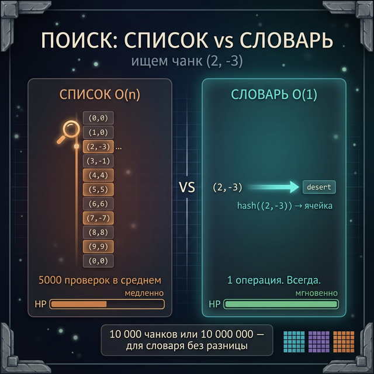
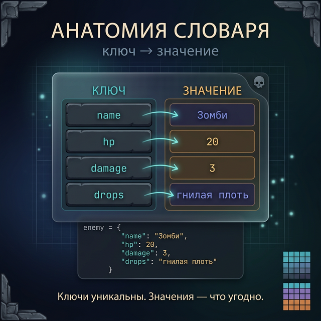
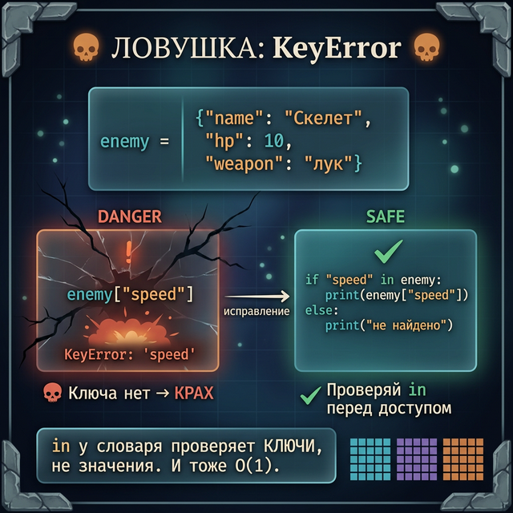
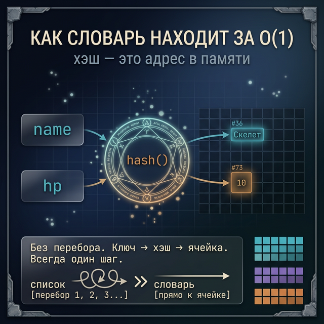
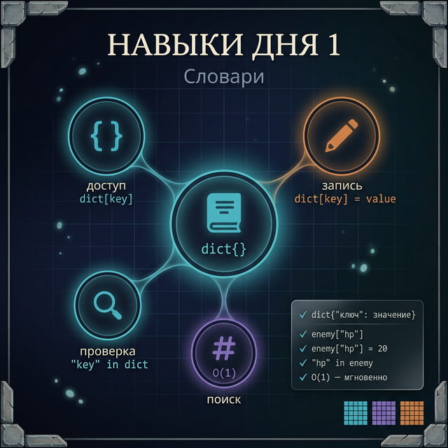

# Day 1: Словари — когда список ищет вечность, словарь находит мгновенно

> **Новые концепции сегодня:** создание словаря `{}`, доступ по ключу `dict[key]`, запись `dict[key] = value`, проверка `in`, ошибка `KeyError`
>
> **Время:** ~40 минут (теория + практика)

---

## Введение: обещание из прошлой недели

В конце Week 2 был такой вопрос: как найти игрока по нику в списке 10 000 игроков?

```python
players = ["Alex", "Steve", "Creeper99", ..., "DragonSlayer"]  # 10 000 имён

# Нужно найти "DragonSlayer"
# Python перебирает список с начала...
# В худшем случае — 10 000 сравнений
```

Это O(n) — скорость зависит от размера списка. Список из 10 000 имён → 10 000 проверок.

**Словарь** находит `"DragonSlayer"` за **1 операцию** — неважно, тысяча там записей или миллион.

Сегодня разбираемся, как это работает и почему.

---

## Часть 1. Список vs Словарь — битва скоростей

### Задача из Minecraft

В Minecraft мир разбит на **чанки** — квадраты 16×16 блоков. У каждого чанка есть координата, и в нём хранятся блоки, мобы, структуры.

Тебе нужно: по координатам чанка (`2, -3`) быстро получить его данные.

**Решение через список:**

```python
chunks_list = [
    {"x": 0, "z": 0, "biome": "plains"},
    {"x": 1, "z": 0, "biome": "forest"},
    {"x": 2, "z": -3, "biome": "desert"},
    # ... ещё 10 000 чанков
]

# Ищем чанк (2, -3)
target = None
for chunk in chunks_list:
    if chunk["x"] == 2 and chunk["z"] == -3:
        target = chunk
        break

# Нашли, но пришлось просмотреть все чанки до него
```

Мир 100×100 чанков — 10 000 записей. В среднем нужно просмотреть 5 000 из них.

**Решение через словарь:**

```python
chunks_dict = {
    (0, 0): "plains",
    (1, 0): "forest",
    (2, -3): "desert",
    # ... ещё 10 000 чанков
}

# Ищем чанк (2, -3)
biome = chunks_dict[(2, -3)]
# → "desert"

# Одна операция. Всегда. Неважно, 10 или 10 000 000 чанков.
```

Именно так устроен реальный Minecraft: мировые данные хранятся в структурах, похожих на словари Python.

---



## Часть 2. Как создать словарь

Словарь — это набор пар **ключ: значение**. Ключи уникальны.

```python
# Пустой словарь
bestiary = {}

# Словарь с данными сразу
enemy = {
    "name": "Зомби",
    "hp": 20,
    "damage": 3,
    "drops": "гнилая плоть"
}

print(enemy)
# → {'name': 'Зомби', 'hp': 20, 'damage': 3, 'drops': 'гнилая плоть'}
```

**Ключи** — любые неизменяемые данные: строки, числа, кортежи. Чаще всего — строки.

**Значения** — что угодно: строки, числа, списки, другие словари.

```python
# Ключи — числа
slot = {0: "меч", 1: "щит", 2: None}

# Ключи — координаты (кортежи)
world = {(0, 64, 0): "stone", (1, 64, 0): "grass"}

# Значения — списки
guild = {"Herobrine": ["меч", "зелье"], "Steve": ["кирка", "факел"]}
```

---



## Часть 3. Доступ по ключу

```python
enemy = {
    "name": "Скелет",
    "hp": 10,
    "weapon": "лук"
}

# Получить значение по ключу
print(enemy["name"])    # → Скелет
print(enemy["hp"])      # → 10
print(enemy["weapon"])  # → лук
```

### Ловушка: KeyError

Если ключа нет — Python бросает ошибку:

```python
print(enemy["speed"])
# → KeyError: 'speed'
```

Это не баг Python — это сигнал: «Ты просишь то, чего нет». Список в такой ситуации выдаёт `IndexError`. Словарь — `KeyError`.

**Как проверить, есть ли ключ:**

```python
if "speed" in enemy:
    print(enemy["speed"])
else:
    print("Атрибут не найден")
# → Атрибут не найден
```

Оператор `in` для словаря проверяет **ключи**, не значения. И делает это тоже за O(1).

```python
print("hp" in enemy)      # → True
print("mana" in enemy)    # → False
print(10 in enemy)        # → False  (10 — это значение, не ключ)
```

---



## Часть 4. Запись и изменение

```python
player = {
    "name": "Alex",
    "level": 1,
    "hp": 20
}

# Изменить существующее значение
player["level"] = 5
print(player["level"])  # → 5

# Добавить новый ключ
player["gold"] = 150
print(player)
# → {'name': 'Alex', 'level': 5, 'hp': 20, 'gold': 150}

print(player)
# → {'name': 'Alex', 'level': 5, 'hp': 20, 'gold': 150}
```

Если ключ уже есть — значение **перезаписывается**. Если нет — создаётся новый ключ. Словарь не позволяет иметь два одинаковых ключа — второй просто заменяет первый.

```python
score = {}
score["Alex"] = 100
score["Alex"] = 200   # перезаписывает предыдущее
print(score["Alex"])  # → 200
```

---

## Часть 5. Почему словарь такой быстрый

Список хранит элементы **по порядку** — чтобы найти нужный, нужно идти от начала.

Словарь хранит элементы **по хэшу** — специальному числу, вычисленному из ключа. Python смотрит на хэш ключа, вычисляет ячейку памяти, и сразу идёт туда. Никакого перебора.

```python
# Так Python "думает" про словарь (упрощённо):
# hash("name") → 482736  → ячейка 36 → "Скелет"
# hash("hp")   → 918273  → ячейка 73 → 10
# Всегда один шаг
```

Это и есть O(1) — **константное время**. Независимо от размера словаря.

<details>
<summary>Когда словарь медленнее списка</summary>

Словарь использует **больше памяти** — хэш-таблица хранит дополнительные данные для быстрого доступа.

Если нужно просто перебрать все элементы по порядку — список чуть эффективнее. Словарь — когда нужен **поиск по ключу**.

</details>

---



## Задания

### Задание 1 — Карточка врага

Создай словарь для врага из Dark Souls — `Хранитель Бездны`:
- HP: 890
- Урон: 47
- Слабость: огонь
- Дроп: Душа Хранителя

Выведи урон и слабость.

<details>
<summary>Ответ</summary>

```python
boss = {
    "name": "Хранитель Бездны",
    "hp": 890,
    "damage": 47,
    "weakness": "огонь",
    "drop": "Душа Хранителя"
}

print(boss["damage"])    # → 47
print(boss["weakness"])  # → огонь
```

</details>

---

### Задание 2 — Обновление данных

Возьми словарь игрока:

```python
player = {
    "name": "Chosen Undead",
    "level": 1,
    "estus": 3,
    "souls": 0
}
```

Напиши код, который:
1. Поднимает уровень до 10
2. Добавляет 1000 душ
3. Проверяет, есть ли ключ `"weapon"`, и если нет — добавляет `"weapon": "Длинный меч"`
4. Выводит итоговый словарь

<details>
<summary>Ответ</summary>

```python
player["level"] = 10
player["souls"] = 1000

if "weapon" not in player:
    player["weapon"] = "Длинный меч"

print(player)
# → {'name': 'Chosen Undead', 'level': 10, 'estus': 3,
#    'souls': 1000, 'weapon': 'Длинный меч'}
```

</details>

---

### Задание 3 — Счётчик фрагов

Напиши программу: игрок называет имена врагов, которых победил. Программа считает, сколько раз встретился каждый враг.

```
Введи врага (или 'стоп'): зомби
Введи врага (или 'стоп'): скелет
Введи врага (или 'стоп'): зомби
Введи врага (или 'стоп'): зомби
Введи врага (или 'стоп'): стоп

Результат:
зомби: 3
скелет: 1
```

**Подсказка:** проверяй `if enemy in kills` — если есть, увеличивай счётчик; если нет, ставь 1.

<details>
<summary>Ответ</summary>

```python
kills = {}

while True:
    enemy = input("Введи врага (или 'стоп'): ")
    if enemy == "стоп":
        break
    if enemy in kills:
        kills[enemy] += 1
    else:
        kills[enemy] = 1

print("\nРезультат:")
for name in kills:
    print(f"{name}: {kills[name]}")
```

</details>

---

### Задание 4 — Мини-проект: база данных чанков

Создай простую базу данных чанков Minecraft.

**ТЗ:**
- Словарь хранит данные о чанках. Ключ — координата `(x, z)`, значение — биом (строка).
- Программа спрашивает координаты и показывает биом.
- Если чанк не изведан — сообщает об этом.

```python
# Стартовые данные
world = {
    (0, 0): "равнина",
    (1, 0): "лес",
    (-1, 0): "пустыня",
    (0, 1): "горы",
    (0, -1): "тайга"
}

# Твой код: спроси x и z, найди биом
```

**Расширение:** добавь команду `"список"` — выводит все известные чанки.

<details>
<summary>Ответ</summary>

```python
world = {
    (0, 0): "равнина",
    (1, 0): "лес",
    (-1, 0): "пустыня",
    (0, 1): "горы",
    (0, -1): "тайга"
}

while True:
    cmd = input("Координаты (x z) или 'список'/'выход': ")
    if cmd == "выход":
        break
    if cmd == "список":
        for coords in world:
            print(f"  {coords}: {world[coords]}")
        continue
    parts = cmd.split()
    x, z = int(parts[0]), int(parts[1])
    if (x, z) in world:
        print(f"Биом: {world[(x, z)]}")
    else:
        print("Этот чанк не изведан")
```

</details>

---



---

<quiz>
[
  {
    "question": "Чем словарь принципиально отличается от списка?",
    "options": [
      "Словарь быстрее по скорости создания",
      "В словаре к элементам обращаются по ключу, а не по индексу",
      "Словарь может хранить только строки",
      "Словарь хранит элементы в порядке добавления (списки — нет)"
    ],
    "answer": 1,
    "explanation": "Главное отличие: в словаре каждый элемент имеет ключ, а доступ идёт по этому ключу — не по порядковому номеру. Это даёт O(1) поиск."
  },
  {
    "question": "Что произойдёт при выполнении кода?\n\n```python\nd = {'a': 1, 'b': 2}\nd['a'] = 99\nprint(d['a'])\n```",
    "options": [
      "Ошибка — нельзя изменить существующий ключ",
      "Выведет 1",
      "Выведет 99",
      "Добавит второй ключ 'a'"
    ],
    "answer": 2,
    "explanation": "Ключи в словаре уникальны. Присваивание по существующему ключу перезаписывает значение. Выведет 99."
  },
  {
    "question": "Как правильно проверить, что ключ 'hp' есть в словаре `enemy`?",
    "options": [
      "if enemy.find('hp')",
      "if 'hp' in enemy",
      "if enemy['hp'] exists",
      "if enemy.has('hp')"
    ],
    "answer": 1,
    "explanation": "Оператор `in` для словаря проверяет наличие ключа. `'hp' in enemy` вернёт True, если ключ 'hp' существует."
  }
]
</quiz>

---

← [Week 2, Day 7 — Лонгрид: списки в играх](../week_2/day_7.md) | [Day 2 — Методы словаря →](day_2.md)
