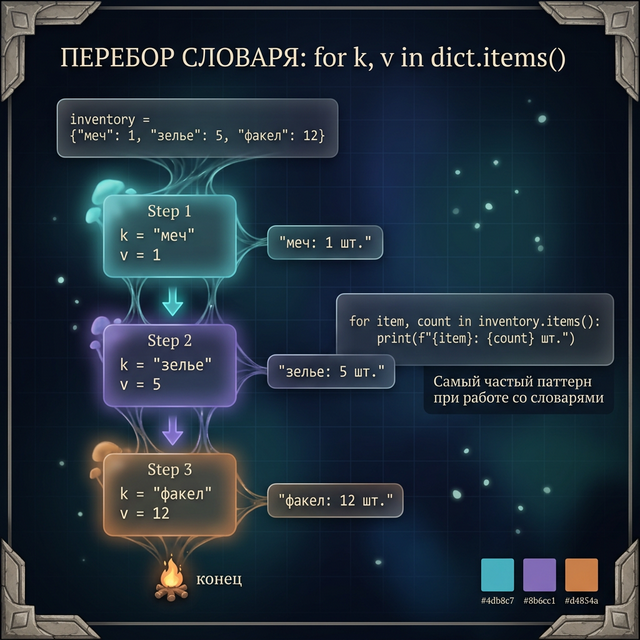
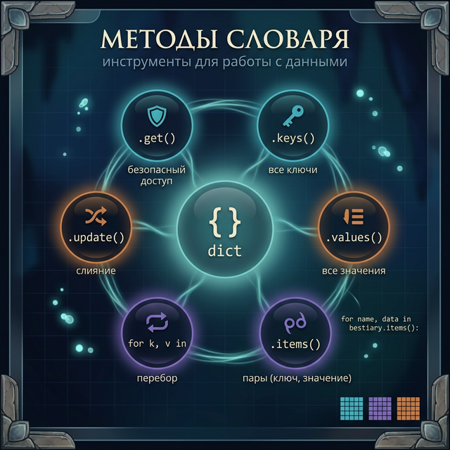
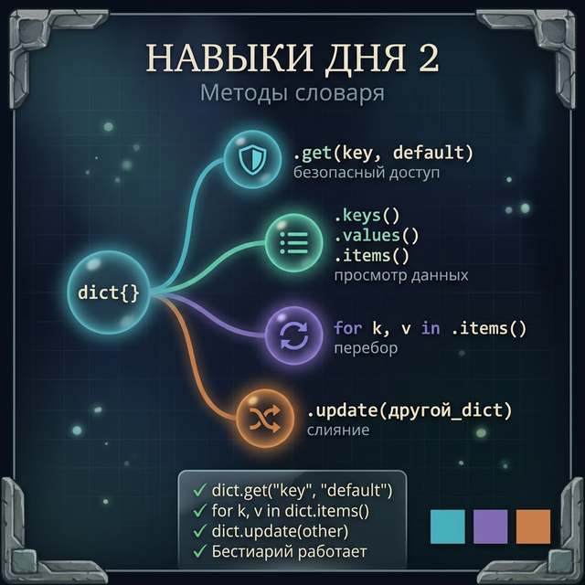

# Day 2: Методы словаря — как работать с данными без KeyError

> **Новые концепции сегодня:** `.get()`, `.keys()`, `.values()`, `.items()`, перебор `for k, v in dict.items()`, `.update()`
>
> **Время:** ~35 минут (теория + практика)

---

## Введение: бестиарий Dark Souls

В Dark Souls каждый враг — отдельная запись в базе данных разработчиков: имя, HP, урон, дроп, слабости. По сути — словарь.

```python
abyss_watcher = {
    "name": "Хранитель Бездны",
    "hp": 890,
    "damage": 47,
    "souls": 1800,
    "weakness": "огонь",
    "phase2": True
}
```

Сегодня мы научимся работать с такими словарями грамотно: читать все данные, перебирать их, обновлять — и не падать с `KeyError`, когда данных нет.

---

## Часть 1. .get() — безопасный доступ

Вчера мы видели: `dict["key"]` выбрасывает `KeyError`, если ключа нет.

`.get()` возвращает значение **или** `None` (или то, что укажешь), если ключ отсутствует.

```python
boss = {
    "name": "Кастет",
    "hp": 350,
    "damage": 22
}

# Небезопасно — KeyError если нет ключа
# print(boss["weakness"])

# Безопасно — возвращает None
print(boss.get("weakness"))       # → None

# Безопасно — возвращает значение по умолчанию
print(boss.get("weakness", "нет слабостей"))  # → нет слабостей
print(boss.get("hp", 0))                       # → 350 (ключ есть, вернёт его)
```

**Когда использовать `.get()`:** когда ключ **может** отсутствовать — настройки, опциональные поля, пользовательский ввод.

**Когда использовать `dict[key]`:** когда ключ **обязан** быть — ты хочешь получить ошибку, если его нет, потому что это было бы логической ошибкой.

---

![Сравнение небезопасного dict[key] и безопасного dict.get() с примером отсутствующего ключа](day_2/day_2_get_safe_access.png)

## Часть 2. .keys(), .values(), .items()

Три метода для получения данных из словаря:

```python
player = {
    "name": "Избранный Мертвец",
    "level": 15,
    "souls": 3400,
    "estus": 5
}

print(player.keys())
# → dict_keys(['name', 'level', 'souls', 'estus'])

print(player.values())
# → dict_values(['Избранный Мертвец', 15, 3400, 5])

print(player.items())
# → dict_items([('name', 'Избранный Мертвец'), ('level', 15), ('souls', 3400), ('estus', 5)])
```

`.items()` возвращает **пары** (ключ, значение) — это самый полезный из трёх.

Все три можно использовать в `for` и в `list()`:

```python
keys_list = list(player.keys())
# → ['name', 'level', 'souls', 'estus']
```

---

## Часть 3. Перебор словаря

### Только ключи (самый простой способ)

```python
inventory = {"меч": 1, "зелье": 5, "факел": 12}

for item in inventory:          # перебирает ключи
    print(item)
# → меч
# → зелье
# → факел
```

### Ключи и значения вместе — .items()

```python
for item, count in inventory.items():
    print(f"{item}: {count} шт.")
# → меч: 1 шт.
# → зелье: 5 шт.
# → факел: 12 шт.
```

Конструкция `for k, v in dict.items()` — **самый частый паттерн** при работе со словарями. Запомни её.

### Только значения

```python
total = 0
for count in inventory.values():
    total += count
print(f"Всего предметов: {total}")  # → Всего предметов: 18
```

---



## Часть 4. .update() — слияние словарей

`.update()` добавляет все пары из одного словаря в другой. Если ключи совпадают — перезаписывает.

```python
base_enemy = {
    "hp": 100,
    "damage": 10,
    "speed": "medium"
}

elite_bonus = {
    "hp": 250,       # перезапишет
    "damage": 30,    # перезапишет
    "armor": 15      # добавит новый ключ
}

base_enemy.update(elite_bonus)
print(base_enemy)
# → {'hp': 250, 'damage': 30, 'speed': 'medium', 'armor': 15}
```

**Сценарий:** загрузить базовые настройки врага и поверх наложить элитный вариант.

---



## Часть 5. Бестиарий — арена методов

Давай построим полноценный бестиарий и потренируем все методы.

```python
bestiary = {
    "зомби":      {"hp": 20,  "damage": 3,  "drop": "гнилая плоть", "rare": False},
    "скелет":     {"hp": 10,  "damage": 2,  "drop": "кости",        "rare": False},
    "крипер":     {"hp": 20,  "damage": 49, "drop": "порох",        "rare": False},
    "иссушитель": {"hp": 300, "damage": 8,  "drop": "звезда Незера","rare": True},
}
```

**Шаг 1 — вывести всех врагов:**

```python
print("--- Список врагов ---")
for name, data in bestiary.items():
    print(f"{name.capitalize()}: {data['hp']} HP")
# → Зомби: 20 HP
# → Скелет: 10 HP
# → Крипер: 20 HP
# → Иссушитель: 300 HP
```

**Шаг 2 — найти самого опасного:**

```python
max_damage = 0
most_dangerous = ""
for name, data in bestiary.items():
    if data["damage"] > max_damage:
        max_damage = data["damage"]
        most_dangerous = name

print(f"Самый опасный: {most_dangerous} ({max_damage} урона)")
# → Самый опасный: крипер (49 урона)
```

**Шаг 3 — показать редкие дропы:**

```python
print("--- Редкие дропы ---")
for name, data in bestiary.items():
    if data["rare"]:
        print(f"{name}: {data['drop']}")
# → иссушитель: звезда Незера
```

---

## Задания

### Задание 1 — Безопасное чтение

```python
character = {
    "name": "Сигмейер",
    "class": "рыцарь",
    "npc": True
}
```

Напиши код, который выводит:
- Класс персонажа
- Его HP (если нет — вывести `"неизвестно"`)
- Есть ли у него квест (ключ `"quest"` — если нет, `"нет квеста"`)

<details>
<summary>Ответ</summary>

```python
print(character.get("class", "неизвестно"))        # → рыцарь
print(character.get("hp", "неизвестно"))           # → неизвестно
print(character.get("quest", "нет квеста"))        # → нет квеста
```

</details>

---

### Задание 2 — Топ игроков

```python
scores = {
    "DragonSlayer": 4500,
    "NightCrawler": 3200,
    "IronGolem":    5100,
    "GhostRider":   2800,
    "SteelWarden":  4900
}
```

Выведи всех игроков в формате `"Место N: Имя — очки"`. Используй `enumerate()` с перебором через `.items()`.

<details>
<summary>Ответ</summary>

```python
for i, (name, score) in enumerate(scores.items(), start=1):
    print(f"Место {i}: {name} — {score}")
```

</details>

---

### Задание 3 — Обновление снаряжения

У игрока базовое снаряжение. Он нашёл артефакт, который меняет некоторые характеристики.

```python
loadout = {
    "weapon": "Длинный меч",
    "armor": "Кожаный доспех",
    "ring": None,
    "shield": "Деревянный щит"
}

artifact_bonus = {
    "weapon": "Великий меч Артериаса",
    "ring": "Кольцо Хавела"
}
```

Примени `artifact_bonus` к `loadout` и выведи итоговое снаряжение в формате `"слот: предмет"`.

<details>
<summary>Ответ</summary>

```python
loadout.update(artifact_bonus)
for slot, item in loadout.items():
    print(f"{slot}: {item}")
# → weapon: Великий меч Артериаса
# → armor: Кожаный доспех
# → ring: Кольцо Хавела
# → shield: Деревянный щит
```

</details>

---

### Задание 4 — Мини-проект: бестиарий с поиском

Создай интерактивный бестиарий из минимум 5 врагов (придумай сам или возьми из Minecraft/Dark Souls).

**Команды:**
- `"кто"` — вывести список всех врагов
- Имя врага — вывести всю его карточку
- `"опасный"` — найти врага с максимальным уроном
- `"выход"` — завершить

**Формат карточки:**
```
=== Крипер ===
HP:     20
Урон:   49
Дроп:   порох
```

<details>
<summary>Подсказка — структура программы</summary>

```python
bestiary = { ... }  # заполни сам

while True:
    cmd = input("Команда: ").lower()
    if cmd == "выход":
        break
    elif cmd == "кто":
        # перебери bestiary и выведи имена
    elif cmd == "опасный":
        # найди максимум по damage
    elif cmd in bestiary:
        # выведи карточку через .items()
    else:
        print("Враг не найден")
```

</details>

---



---

<quiz>
[
  {
    "question": "Что вернёт `boss.get('speed', 'slow')`, если ключа 'speed' нет в словаре `boss`?",
    "options": [
      "None",
      "KeyError",
      "'slow'",
      "False"
    ],
    "answer": 2,
    "explanation": ".get(key, default) возвращает default, если ключ отсутствует. Здесь default = 'slow'."
  },
  {
    "question": "Какой метод даёт одновременно ключ и значение при переборе словаря?",
    "options": [
      ".keys()",
      ".values()",
      ".items()",
      ".pairs()"
    ],
    "answer": 2,
    "explanation": ".items() возвращает пары (ключ, значение). Используется в конструкции `for k, v in dict.items()`."
  },
  {
    "question": "Что произойдёт при `d1.update(d2)`, если в обоих словарях есть одинаковый ключ?",
    "options": [
      "Ошибка — дублирующийся ключ запрещён",
      "Значение из d2 заменит значение из d1",
      "Значение из d1 заменит значение из d2",
      "Создастся список из двух значений"
    ],
    "answer": 1,
    "explanation": ".update() перезаписывает значения: если ключ уже есть в d1, его значение заменяется значением из d2."
  }
]
</quiz>

---

← [Day 1 — Словари: мгновенный поиск](day_1.md) | [Day 3 — Вложенные словари →](day_3.md)
