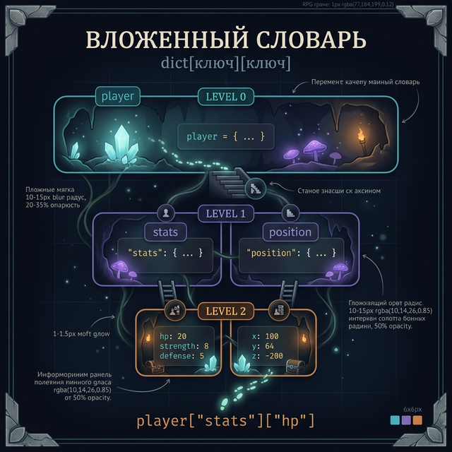
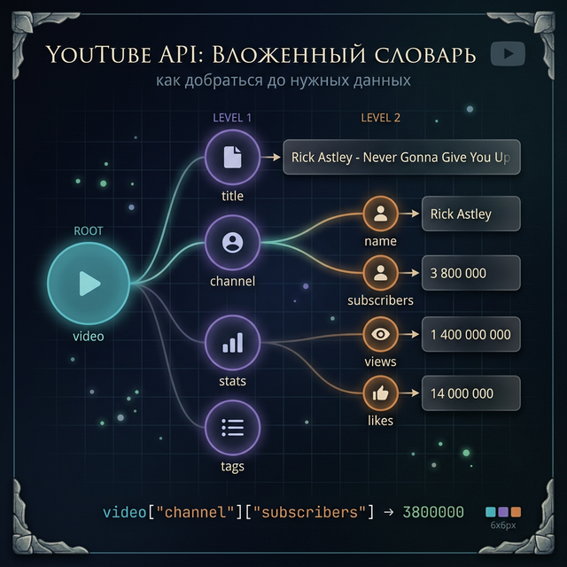
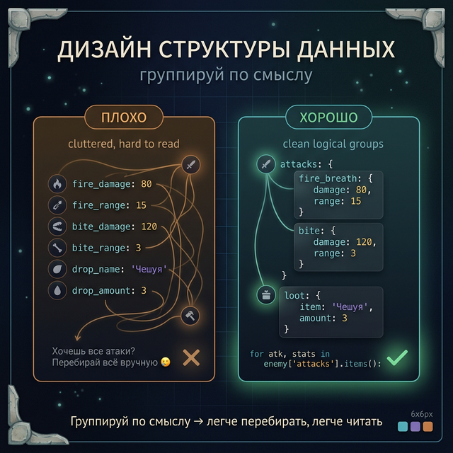
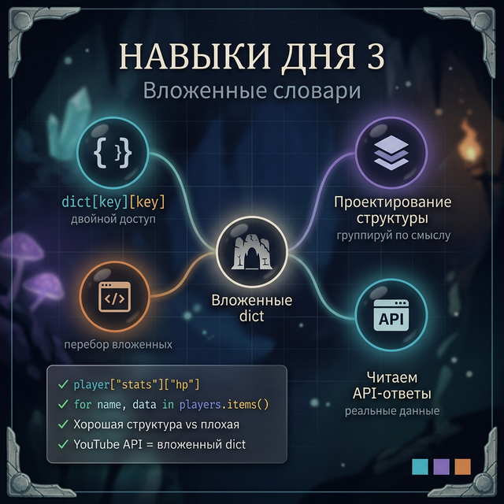

# Day 3: Вложенные словари — строим базы данных

> **Новые концепции сегодня:** словарь внутри словаря, доступ `dict[key][key]`, перебор вложенных структур, проектирование структуры данных
>
> **Время:** ~40 минут (теория + практика)

---

## Введение: YouTube не хранит видео в строках

Когда YouTube отдаёт данные о видео — это не просто строка. Это структура:

```
Видео:
  ID: "dQw4w9WgXcQ"
  Заголовок: "..."
  Автор:
    Имя: "Rick Astley"
    Подписчиков: 3 800 000
    Страна: "UK"
  Статистика:
    Просмотры: 1 400 000 000
    Лайки: 14 000 000
    Комментарии: 2 100 000
  Теги: ["pop", "80s", "rickroll"]
```

Это **вложенная структура** — словарь внутри словаря. В Python (и в реальных API) именно так и хранятся сложные данные.

---

## Часть 1. Словарь внутри словаря

Простой словарь — один уровень:

```python
player = {"name": "Alex", "hp": 20}
```

Вложенный словарь — значение само является словарём:

```python
player = {
    "name": "Alex",
    "stats": {
        "hp": 20,
        "strength": 8,
        "defense": 5
    },
    "position": {
        "x": 100,
        "y": 64,
        "z": -200
    }
}
```

**Доступ:** используем `[]` дважды (или столько раз, сколько уровней):

```python
print(player["name"])               # → Alex
print(player["stats"]["hp"])        # → 20
print(player["stats"]["strength"])  # → 8
print(player["position"]["y"])      # → 64
```

Читай справа налево: сначала берём `player["stats"]` — получаем словарь `{"hp": 20, ...}`. Потом из него берём `["hp"]` — получаем `20`.

---



## Часть 2. Реальный кейс — YouTube API

Вот как выглядит ответ YouTube Data API (упрощённо):

```python
video = {
    "id": "dQw4w9WgXcQ",
    "title": "Rick Astley - Never Gonna Give You Up",
    "channel": {
        "name": "Rick Astley",
        "subscribers": 3_800_000,
        "country": "GB"
    },
    "stats": {
        "views": 1_400_000_000,
        "likes": 14_000_000,
        "comments": 2_100_000
    },
    "tags": ["pop", "80s", "music video"]
}

# Получить название
print(video["title"])
# → Rick Astley - Never Gonna Give You Up

# Получить количество подписчиков канала
print(video["channel"]["subscribers"])
# → 3800000

# Сколько лайков на миллион просмотров?
ratio = video["stats"]["likes"] / video["stats"]["views"] * 1_000_000
print(f"Лайков на млн просмотров: {ratio:.0f}")
# → Лайков на млн просмотров: 10000
```

Именно это делает код, который работает с любым API — Instagram, Spotify, Twitch, Steam. Все они возвращают вложенные словари.

> **Это важно:** в Week 4 мы разберём JSON — формат, который выглядит точь-в-точь как словари Python. Ты уже почти умеешь читать данные из интернета.

---



## Часть 3. Перебор вложенных структур

### Задача: вывести всех игроков и их статы

```python
players = {
    "Chosen_Undead": {
        "level": 25,
        "souls": 15000,
        "covenant": "Воины Солнца"
    },
    "Lautrec": {
        "level": 40,
        "souls": 8000,
        "covenant": "Слуги Алдрика"
    },
    "Siegmeyer": {
        "level": 35,
        "souls": 0,
        "covenant": None
    }
}

for player_name, data in players.items():
    covenant = data.get("covenant", "нет")
    print(f"{player_name} | Ур. {data['level']} | Заветы: {covenant}")
```

```
Chosen_Undead | Ур. 25 | Заветы: Воины Солнца
Lautrec | Ур. 40 | Заветы: Слуги Алдрика
Siegmeyer | Ур. 35 | Заветы: нет
```

### Изменение вложенных данных

```python
# Добавить игроку новое поле во вложенном словаре
players["Chosen_Undead"]["weapon"] = "Меч-бастард +5"

# Создать вложенный словарь для нового игрока
players["Solaire"] = {
    "level": 50,
    "souls": 25000,
    "covenant": "Воины Солнца"
}

print(players["Solaire"]["covenant"])  # → Воины Солнца
```

---

## Часть 4. Дебаг-квест: найди ошибку

Код должен выводить HP каждого босса, но падает. Найди все баги.

```python
bosses = {
    "Margit": {"hp": 3500, "phase": 1},
    "Godrick": {"hp": 9500, "phase": 2},
    "Rennala": {"hp": 8000, "phase": 2},
}

for name in bosses.items():
    print(f"{name}: {bosses[name]['hp']} HP")
```

<details>
<summary>Подсказка 1</summary>
`bosses.items()` возвращает пары (ключ, значение), не просто ключи.
</details>

<details>
<summary>Подсказка 2</summary>
Если в цикле используешь `.items()`, нужно распаковать пару: `for name, data in bosses.items()`.
</details>

<details>
<summary>Ответ и объяснение</summary>

```python
# Ошибка: `.items()` даёт пары (имя, словарь),
# но в цикле написано `for name in` — name получает кортеж ('Margit', {...})

# Исправленный код:
for name, data in bosses.items():
    print(f"{name}: {data['hp']} HP")
# → Margit: 3500 HP
# → Godrick: 9500 HP
# → Rennala: 8000 HP
```

**Защитный приём:** если перебираешь словарь и нужны и ключ, и значение — всегда используй `for k, v in dict.items()`. Если только ключи — просто `for k in dict`.

</details>

---

## Часть 5. Как проектировать структуру

Перед тем как писать код, спроси себя: **какие вопросы мне нужно задавать к этим данным?**

**Плохая структура** (всё в одном уровне):

```python
enemy = {
    "name": "Дракон",
    "hp": 5000,
    "fire_damage": 80,
    "fire_range": 15,
    "bite_damage": 120,
    "bite_range": 3,
    "drop_name": "Чешуя",
    "drop_amount": 3
}

# Хочешь узнать все атаки? Придётся перебирать все ключи вручную
```

**Хорошая структура** (логические группы):

```python
enemy = {
    "name": "Дракон",
    "hp": 5000,
    "attacks": {
        "fire_breath": {"damage": 80, "range": 15},
        "bite":        {"damage": 120, "range": 3}
    },
    "loot": {
        "item": "Чешуя",
        "amount": 3
    }
}

# Теперь легко: перебрать все атаки
for attack_name, stats in enemy["attacks"].items():
    print(f"{attack_name}: {stats['damage']} урона")
```

**Правило:** группируй данные по смыслу. Если несколько ключей описывают одно и то же — они должны быть во вложенном словаре.

---



## Задания

### Задание 1 — Чтение API

```python
stream = {
    "title": "Elden Ring ФИНАЛЬНЫЙ БОСС",
    "streamer": {
        "name": "xQc",
        "followers": 11_500_000,
        "language": "ru"
    },
    "stats": {
        "viewers": 87000,
        "peak_viewers": 120000,
        "duration_hours": 4
    }
}
```

Выведи:
1. Имя стримера
2. Количество зрителей сейчас
3. Среднее зрителей в час (текущие / длительность)

<details>
<summary>Ответ</summary>

```python
print(stream["streamer"]["name"])
# → xQc

print(stream["stats"]["viewers"])
# → 87000

avg = stream["stats"]["viewers"] / stream["stats"]["duration_hours"]
print(f"Среднее в час: {avg:.0f}")
# → Среднее в час: 21750
```

</details>

---

### Задание 2 — Бестиарий второго уровня

Создай вложенный бестиарий из 3 боссов Dark Souls (придумай или используй реальные). У каждого:
- `hp`, `souls` — числа
- `attacks` — вложенный словарь с 2 атаками и их уроном
- `weakness` — строка

Выведи всех боссов и их самую мощную атаку.

<details>
<summary>Структура данных</summary>

```python
bosses = {
    "Гравитас": {
        "hp": 2200,
        "souls": 5000,
        "attacks": {
            "удар кулаком": 45,
            "прыжок сверху": 80
        },
        "weakness": "молния"
    },
    # ... ещё 2 босса
}
```

</details>

<details>
<summary>Ответ — поиск мощнейшей атаки</summary>

```python
for boss_name, data in bosses.items():
    max_dmg = max(data["attacks"].values())
    best_attack = ""
    for atk, dmg in data["attacks"].items():
        if dmg == max_dmg:
            best_attack = atk
    print(f"{boss_name}: лучшая атака — {best_attack} ({max_dmg} урона)")
```

</details>

---

### Задание 3 — Мини-проект: карточка игрока

Напиши программу, которая создаёт карточку игрока из пользовательского ввода.

**Ввод:**
```
Имя: Artorias
Класс: рыцарь
Основное оружие: Меч Артериаса
Вторичное оружие: Щит Артериаса
Сила: 40
Ловкость: 30
```

**Вывод (словарь в виде красивой карточки):**
```
=== КАРТОЧКА ПЕРСОНАЖА ===
Имя: Artorias
Класс: рыцарь
Оружие:
  Основное: Меч Артериаса
  Вторичное: Щит Артериаса
Характеристики:
  Сила: 40
  Ловкость: 30
```

Данные должны храниться в **вложенном словаре** с ключами `"weapons"` и `"stats"`.

<details>
<summary>Ответ</summary>

```python
name = input("Имя: ")
cls = input("Класс: ")
main_weapon = input("Основное оружие: ")
second_weapon = input("Вторичное оружие: ")
strength = int(input("Сила: "))
dexterity = int(input("Ловкость: "))

character = {
    "name": name,
    "class": cls,
    "weapons": {
        "main": main_weapon,
        "secondary": second_weapon
    },
    "stats": {
        "strength": strength,
        "dexterity": dexterity
    }
}

print("\n=== КАРТОЧКА ПЕРСОНАЖА ===")
print(f"Имя: {character['name']}")
print(f"Класс: {character['class']}")
print("Оружие:")
print(f"  Основное: {character['weapons']['main']}")
print(f"  Вторичное: {character['weapons']['secondary']}")
print("Характеристики:")
for stat, value in character["stats"].items():
    names = {"strength": "Сила", "dexterity": "Ловкость"}
    print(f"  {names.get(stat, stat)}: {value}")
```

</details>

---



---

<quiz>
[
  {
    "question": "Как получить значение `'GB'` из структуры:\n```python\nvideo = {'channel': {'country': 'GB'}}\n```",
    "options": [
      "video['country']",
      "video['channel']['country']",
      "video[['channel']['country']]",
      "video.get('channel').get('country')"
    ],
    "answer": 1,
    "explanation": "Сначала берём video['channel'] — получаем словарь {'country': 'GB'}. Потом из него ['country'] — получаем 'GB'. Вариант с двумя .get() тоже работает, но вариант 1 (прямой доступ) — стандартный способ."
  },
  {
    "question": "Что выведет код?\n```python\nd = {'a': {'x': 1}, 'b': {'x': 2}}\nfor k, v in d.items():\n    print(v['x'])\n```",
    "options": [
      "Ошибка — нельзя обращаться к v как к словарю",
      "1\n2",
      "'x'\n'x'",
      "{'x': 1}\n{'x': 2}"
    ],
    "answer": 1,
    "explanation": "v — это значение из словаря d, то есть {'x': 1} и {'x': 2}. v['x'] даст 1 и 2 соответственно."
  },
  {
    "question": "Зачем группировать данные во вложенные словари?",
    "options": [
      "Только для красоты — технически разницы нет",
      "Чтобы не писать длинные имена ключей",
      "Чтобы логически группировать связанные данные и легче перебирать группу",
      "Вложенные словари быстрее плоских"
    ],
    "answer": 2,
    "explanation": "Группировка упрощает работу: легче перебирать все атаки, легче обновить блок характеристик, легче читать код. Технические причины — вторичны."
  }
]
</quiz>

---

← [Day 2 — Методы словаря](day_2.md) | [Day 4 — Множества →](day_4.md)
