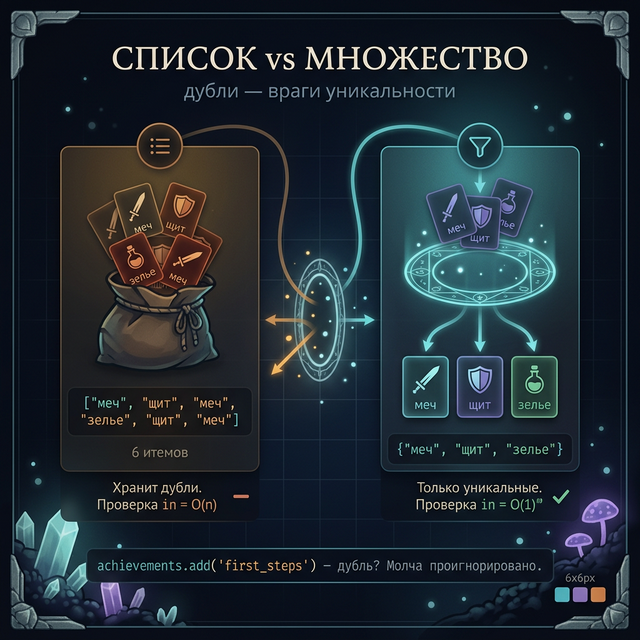
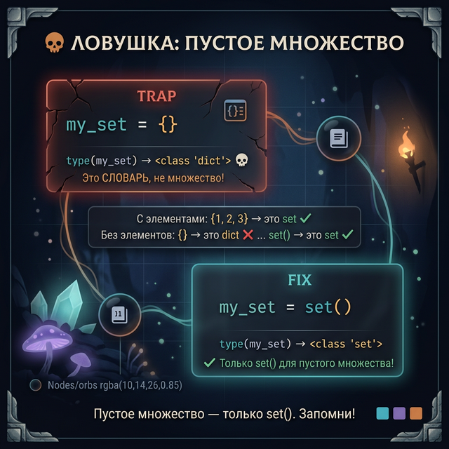
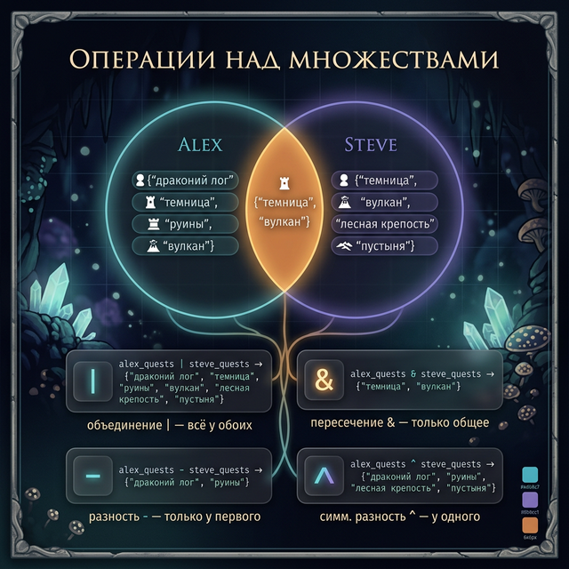
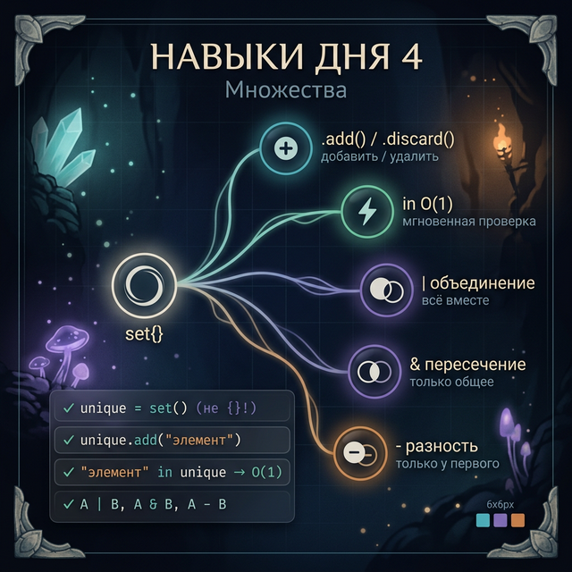

# Day 4: Множества — когда повторения запрещены

> **Новые концепции сегодня:** `set`, `add()`, `discard()`, проверка `in` за O(1), операции `|` `&` `-` `^`
>
> **Время:** ~35 минут (теория + практика)

---

## Введение: задача, которую список решает плохо

Ты разрабатываешь систему достижений для игры. Игрок может получить каждое достижение только **один раз**. Вот наивный способ через список:

```python
achievements = []

def unlock(achievement):
    if achievement not in achievements:   # O(n) — перебираем весь список
        achievements.append(achievement)

unlock("первый враг")
unlock("первый враг")   # дубль — список должен игнорировать
unlock("boss_killed")

print(achievements)
# → ['первый враг', 'boss_killed']
```

Список справляется, но у него два минуса:
1. `if achievement not in achievements` — это O(n), перебирает весь список
2. Мы тратим код на логику «уже есть?»

**Множество** (`set`) решает оба сразу:

```python
achievements = set()

achievements.add("первый враг")
achievements.add("первый враг")   # дубль молча игнорируется
achievements.add("boss_killed")

print(achievements)
# → {'первый враг', 'boss_killed'}   (порядок не гарантирован)
```

Множество **само** отбрасывает дубли. Проверка `in` — O(1), как у словаря.

---



## Часть 1. Создание множества

```python
# Пустое множество — ТОЛЬКО так, не через {}
empty_set = set()

# С элементами — фигурные скобки без ключей
biomes = {"лес", "пустыня", "тундра", "болото"}

# Из списка (убирает дубли автоматически)
loot_drops = ["меч", "щит", "меч", "зелье", "щит", "меч"]
unique_drops = set(loot_drops)
print(unique_drops)
# → {'меч', 'щит', 'зелье'}  (порядок может быть любым)

# Длина
print(len(biomes))  # → 4
```

> **Важно:** `{}` без содержимого создаёт **пустой словарь**, не множество. Для пустого множества — только `set()`.

Элементы множества должны быть **неизменяемыми**: строки, числа, кортежи — OK. Списки — нельзя.

---



## Часть 2. Добавление и удаление

```python
visited_locations = {"Храм Огня", "Катакомбы"}

# Добавить элемент
visited_locations.add("Замок Андор Лондо")
print(visited_locations)
# → {'Храм Огня', 'Катакомбы', 'Замок Андор Лондо'}

# Добавить уже существующий — ничего не произойдёт
visited_locations.add("Храм Огня")
print(len(visited_locations))  # → 3 (не 4)

# Удалить элемент (если нет — KeyError)
visited_locations.remove("Катакомбы")

# Удалить безопасно (если нет — молча пропустить)
visited_locations.discard("Катакомбы")   # нет, но ошибки не будет
visited_locations.discard("Замок Андор Лондо")   # есть — удалит
```

---

## Часть 3. Проверка in — O(1)

Самая частая операция с множеством:

```python
achievements = {"first_blood", "no_damage", "speedrun", "all_bosses"}

# Проверка — мгновенная, независимо от размера множества
print("no_damage" in achievements)      # → True
print("hidden_ending" in achievements)  # → False

# Сравнение с тем же для списка:
achievements_list = list(achievements)
print("no_damage" in achievements_list)  # Тоже работает, но O(n)
```

Если тебе нужно часто проверять «есть ли X в коллекции» — используй множество.

---

## Часть 4. Математика множеств — арена

Вот где множества становятся по-настоящему мощными. Три игрока прошли разные квесты:

```python
alex_quests  = {"драконий лог", "темница", "руины", "вулкан"}
steve_quests = {"темница", "вулкан", "лесная крепость", "пустыня"}
aria_quests  = {"руины", "вулкан", "горный перевал"}
```

### Объединение `|` — всё, что прошёл хоть кто-то

```python
all_quests = alex_quests | steve_quests
print(all_quests)
# → {'драконий лог', 'темница', 'руины', 'вулкан', 'лесная крепость', 'пустыня'}
```

### Пересечение `&` — что прошли ВСЕ

```python
common = alex_quests & steve_quests & aria_quests
print(common)
# → {'вулкан'}   (только вулкан прошли все трое)
```

### Разность `-` — есть у первого, но не у второго

```python
# Что прошёл Alex, но не Steve?
alex_only = alex_quests - steve_quests
print(alex_only)
# → {'драконий лог', 'руины'}
```

### Симметричная разность `^` — у одного, но не у обоих

```python
# Квесты, которые прошёл только Alex ИЛИ только Steve (не оба)
exclusive = alex_quests ^ steve_quests
print(exclusive)
# → {'драконий лог', 'руины', 'лесная крепость', 'пустыня'}
```

<details>
<summary>Бонус: подмножество и надмножество</summary>

```python
beginner = {"темница", "вулкан"}

# Все квесты из beginner есть у Alex?
print(beginner.issubset(alex_quests))    # → True  (beginner ⊆ alex)
print(beginner <= alex_quests)           # → то же самое
```

</details>

---



## Часть 5. Когда что использовать

| Задача | Инструмент |
|:-------|:-----------|
| Хранить уникальные элементы | `set` |
| Быстро проверить «есть ли X» | `set` |
| Найти общие/разные элементы двух групп | `set` операции |
| Нужен порядок элементов | `list` |
| Нужен доступ по индексу | `list` |
| Нужна пара «ключ → значение» | `dict` |

**Правило:** если думаешь «мне нужен список уникальных вещей» — почти всегда это `set`.

---

## Задания

### Задание 1 — Убрать дубли

```python
chat_messages = [
    "DragonSlayer написал сообщение",
    "Creeper99 написал сообщение",
    "DragonSlayer написал сообщение",
    "Steve написал сообщение",
    "Creeper99 написал сообщение",
]
```

Выведи список **уникальных** авторов, которые писали в чате (только имена). Используй множество.

<details>
<summary>Подсказка</summary>
Можно `split()` каждую строку и взять первое слово.
</details>

<details>
<summary>Ответ</summary>

```python
authors = set()
for msg in chat_messages:
    name = msg.split()[0]
    authors.add(name)

print(authors)
# → {'DragonSlayer', 'Creeper99', 'Steve'}
```

</details>

---

### Задание 2 — Анализ дропов

Два игрока фармили мобов:

```python
drops_player1 = {"железо", "уголь", "алмаз", "красная пыль", "железо", "уголь"}
drops_player2 = {"золото", "алмаз", "изумруд", "красная пыль"}
```

Найди и выведи:
1. Ресурсы, которые нашли оба
2. Ресурсы, которые нашёл только первый игрок
3. Все уникальные ресурсы вместе

<details>
<summary>Ответ</summary>

```python
# Если передали как списки с дублями — сначала в set:
p1 = set(drops_player1)
p2 = set(drops_player2)

print("Оба нашли:", p1 & p2)
# → {'алмаз', 'красная пыль'}

print("Только первый:", p1 - p2)
# → {'железо', 'уголь'}

print("Все ресурсы:", p1 | p2)
# → {'железо', 'уголь', 'алмаз', 'красная пыль', 'золото', 'изумруд'}
```

</details>

---

### Задание 3 — Достижения гильдии

```python
required_for_guild = {"boss_slayer", "explorer", "crafter", "trader"}

guild_members = {
    "Alex":  {"boss_slayer", "explorer", "crafter"},
    "Steve": {"boss_slayer", "explorer", "crafter", "trader"},
    "Maria": {"explorer", "trader"},
}
```

Выведи для каждого игрока:
- Какие достижения выполнены
- Каких не хватает для вступления в гильдию

<details>
<summary>Ответ</summary>

```python
for player, achieved in guild_members.items():
    missing = required_for_guild - achieved
    if missing:
        print(f"{player}: не хватает {missing}")
    else:
        print(f"{player}: готов к вступлению!")
# → Alex: не хватает {'trader'}
# → Steve: готов к вступлению!
# → Maria: не хватает {'boss_slayer', 'crafter'}
```

</details>

---

### Задание 4 — Мини-проект: трекер достижений

Напиши программу-трекер достижений для игрока.

**Список всех достижений:**
```python
all_achievements = {
    "first_steps",    # убить первого врага
    "collector",      # собрать 10 видов ресурсов
    "speedrunner",    # пройти игру за 2 часа
    "pacifist",       # пройти без убийств
    "explorer",       # открыть все локации
}
```

**Команды:**
- `unlock <название>` — разблокировать достижение
- `progress` — показать выполнено/осталось/процент
- `missing` — показать только невыполненные
- `выход`

**Формат progress:**
```
Выполнено: 2/5 (40%)
Получено: first_steps, collector
Осталось: speedrunner, pacifist, explorer
```

<details>
<summary>Структура программы</summary>

```python
all_achievements = {...}
unlocked = set()

while True:
    cmd = input("Команда: ").strip()
    if cmd == "выход":
        break
    elif cmd.startswith("unlock "):
        achievement = cmd[7:]
        if achievement in all_achievements:
            unlocked.add(achievement)
            print(f"✅ Получено: {achievement}")
        else:
            print("Такого достижения нет")
    elif cmd == "progress":
        # ...
    elif cmd == "missing":
        missing = all_achievements - unlocked
        # ...
```

</details>

---



---

<quiz>
[
  {
    "question": "Как создать пустое множество в Python?",
    "options": [
      "{}",
      "set()",
      "set{}",
      "[]"
    ],
    "answer": 1,
    "explanation": "`{}` создаёт пустой словарь, не множество. Для пустого множества нужно `set()`. С элементами — {'a', 'b'} работает как множество."
  },
  {
    "question": "Что произойдёт если добавить в множество уже существующий элемент?",
    "options": [
      "Ошибка ValueError",
      "Элемент добавится второй раз",
      "Ничего — множество останется без изменений",
      "Метод add() вернёт False"
    ],
    "answer": 2,
    "explanation": "Множество хранит только уникальные элементы. Попытка добавить дубль молча игнорируется — ни ошибки, ни изменений."
  },
  {
    "question": "Какая операция даёт элементы, которые есть В ОБОИХ множествах?",
    "options": [
      "a | b",
      "a - b",
      "a & b",
      "a ^ b"
    ],
    "answer": 2,
    "explanation": "`a & b` — пересечение: только элементы, присутствующие в обоих. `|` — объединение (всё), `-` — разность (есть в a, нет в b), `^` — симметричная разность (есть только в одном из двух)."
  }
]
</quiz>

---

← [Day 3 — Вложенные словари](day_3.md) | [Day 5 — Структуры вместе →](day_5.md)
