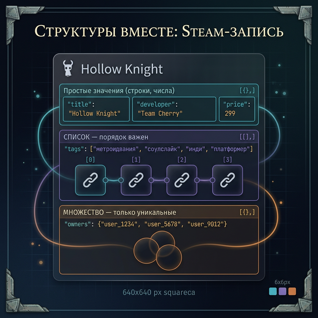
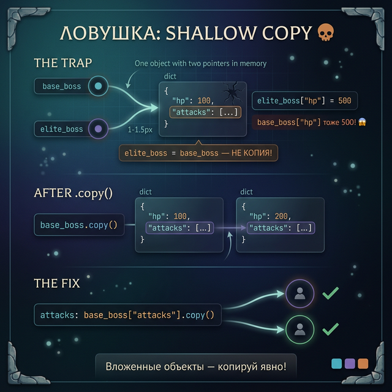
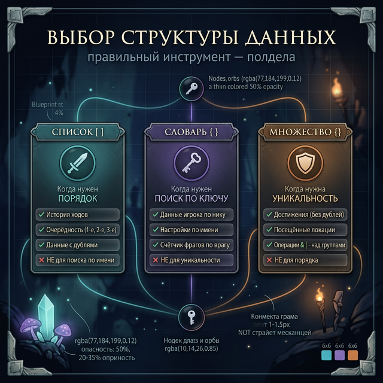
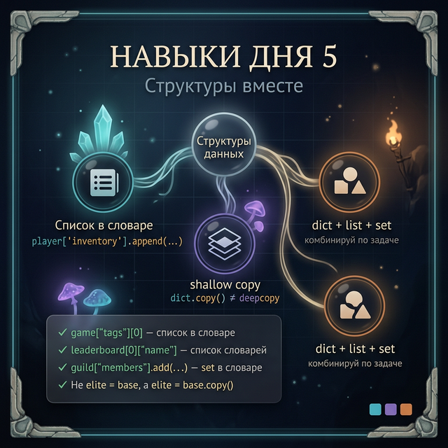

# Day 5: Словари, списки, множества — собираем всё вместе

> **Новые концепции сегодня:** комбинирование структур данных, `dict.copy()` и ловушка shallow copy, выбор правильной структуры
>
> **Время:** ~40 минут (теория + практика)

---

## Введение: реальный код редко использует одну структуру

За неделю ты изучил три инструмента:
- **Список** — упорядоченная коллекция, доступ по индексу
- **Словарь** — пары ключ-значение, мгновенный поиск
- **Множество** — уникальные элементы, математические операции

В реальных программах они работают **вместе**. Посмотри, как выглядит одна запись в базе данных Steam:

```python
game = {
    "title": "Hollow Knight",
    "developer": "Team Cherry",
    "price": 299,
    "tags": ["метроидвания", "соулслайк", "инди", "платформер"],
    "owners": {"user_1234", "user_5678", "user_9012"},
    "reviews": [
        {"user": "user_1234", "score": 10, "text": "Шедевр"},
        {"user": "user_5678", "score": 9,  "text": "Почти идеал"}
    ]
}
```

Словарь содержит список (`"tags"`), множество (`"owners"`), и список словарей (`"reviews"`). Сегодня научимся строить и использовать такие структуры.

---



## Часть 1. Список внутри словаря

Значение словаря — список. Работаешь с ним как с обычным списком:

```python
player = {
    "name": "Hollow Knight",
    "inventory": ["Хрупкое сердце", "Острый тень", "Монетки"],
    "spells": ["Раскол Пустоты", "Взрыв Пустоты"]
}

# Доступ к списку
print(player["inventory"])
# → ['Хрупкое сердце', 'Острый тень', 'Монетки']

# Первый элемент списка
print(player["inventory"][0])
# → Хрупкое сердце

# Добавить в список
player["inventory"].append("Метка охотника")
print(len(player["inventory"]))  # → 4

# Перебрать список
print(f"Заклинания {player['name']}:")
for spell in player["spells"]:
    print(f"  - {spell}")
```

---

## Часть 2. Список словарей

Самая частая структура в реальных приложениях: **список записей**, где каждая запись — словарь.

```python
leaderboard = [
    {"rank": 1, "name": "ShadowBlade", "score": 98500, "deaths": 2},
    {"rank": 2, "name": "VoidRunner",  "score": 87200, "deaths": 5},
    {"rank": 3, "name": "IronWarden",  "score": 76100, "deaths": 12},
]

# Вывести таблицу
for entry in leaderboard:
    print(f"#{entry['rank']} {entry['name']:15} {entry['score']:>8} очков")

# Найти с наименьшим числом смертей
fewest_deaths = leaderboard[0]
for entry in leaderboard:
    if entry["deaths"] < fewest_deaths["deaths"]:
        fewest_deaths = entry
print(f"Чистейшее прохождение: {fewest_deaths['name']}")
```

```
#1 ShadowBlade         98500 очков
#2 VoidRunner          87200 очков
#3 IronWarden          76100 очков
Чистейшее прохождение: ShadowBlade
```

---

## Часть 3. Множество внутри словаря

Используй множество, когда значение — набор уникальных вещей:

```python
guild_registry = {
    "Солнечные Воины": {"Solaire", "Siegward", "Siegmeyer"},
    "Слуги Алдрика":  {"Aldrich", "Lautrec", "Gwyndolin"},
    "Серые Призраки":  {"Chester", "Marvelous Chester"}
}

# Добавить члена гильдии
guild_registry["Солнечные Воины"].add("Вилхельм")

# Проверить членство
if "Solaire" in guild_registry["Солнечные Воины"]:
    print("Solaire в гильдии!")

# Найти пересечение — игроки в нескольких гильдиях (не должно быть!)
sunbros = guild_registry["Солнечные Воины"]
aldrich = guild_registry["Слуги Алдрика"]
double_agents = sunbros & aldrich
if double_agents:
    print(f"Предатели: {double_agents}")
else:
    print("Предателей нет")
```

---

## Часть 4. Ловушка shallow copy — обещание из Week 2

В Week 2, Day 5 была ловушка с копированием списков. Со словарями та же проблема.

### Проблема

```python
base_boss = {
    "hp": 100,
    "attacks": ["удар", "блок"]
}

# Попытка скопировать
elite_boss = base_boss

# Меняем elite_boss...
elite_boss["hp"] = 500
elite_boss["attacks"].append("огненный шар")

print(base_boss["hp"])       # → 500  😱 ИЗМЕНИЛСЯ!
print(base_boss["attacks"])  # → ['удар', 'блок', 'огненный шар']  😱
```

`elite_boss = base_boss` — это **не копия**. Обе переменные указывают на один и тот же словарь в памяти.



### Решение 1: .copy() — поверхностная копия

```python
elite_boss = base_boss.copy()

elite_boss["hp"] = 500          # меняет только elite_boss ✅
print(base_boss["hp"])           # → 100

elite_boss["attacks"].append("огненный шар")   # список НЕ скопирован!
print(base_boss["attacks"])  # → ['удар', 'блок', 'огненный шар']  😱
```

`.copy()` копирует сам словарь, но вложенные объекты (списки, словари) — **нет**. Это и есть **shallow copy** (поверхностная копия).

### Решение 2: полная копия вложенных данных

Если внутри словаря есть списки или другие словари — скопируй их явно:

```python
import copy  # ← скопируй эту строку, мы разберём import в Week 5

elite_boss = copy.deepcopy(base_boss)   # полная копия всего

elite_boss["hp"] = 500
elite_boss["attacks"].append("огненный шар")

print(base_boss["hp"])       # → 100  ✅
print(base_boss["attacks"])  # → ['удар', 'блок']  ✅
```

Пока — запомни правило: **если в словаре есть список или другой словарь, `.copy()` не защитит вложенные данные**.

<details>
<summary>Безопасный способ без import</summary>

Для словарей с одним уровнем вложенности можно скопировать вручную:

```python
elite_boss = {
    "hp": base_boss["hp"],
    "attacks": base_boss["attacks"].copy()   # список копируем отдельно
}
```

Неудобно, но работает без `import`.

</details>

---

## Часть 5. Выбор структуры — арена трёх

Задача: хранить данные об игровой сессии. Что использовать?

| Что хранить | Инструмент | Почему |
|:------------|:-----------|:-------|
| Очки хода (1-й, 2-й, 3-й) | `list` | Порядок важен, возможны дубли |
| Данные о игроке (имя, уровень, HP) | `dict` | Нужен доступ по имени поля |
| Разблокированные карты | `set` | Уникальность, нет порядка |
| История ходов (список словарей) | `list` of `dict` | Порядок + структура каждого хода |
| Статистика по игрокам | `dict` of `dict` | Поиск по нику + вложенные данные |
| Активные эффекты (яд, оглушение) | `set` | Уникальные, нет порядка |

**Вопросы для выбора:**
1. Нужен порядок? → список
2. Нужен доступ по имени/ключу? → словарь
3. Нужна только уникальность? → множество
4. Нужно и то, и другое? → комбинация

---



## Задания

### Задание 1 — Библиотека мира

```python
world_map = {
    "Сумрачный лес": {
        "danger": 3,
        "enemies": ["волк", "паук", "страж"],
        "visited": False
    },
    "Кузница Демонов": {
        "danger": 8,
        "enemies": ["демон огня", "железный голем"],
        "visited": True
    }
}
```

Напиши код, который:
1. Добавляет новую локацию `"Руины Азалота"` (danger: 6, enemies: ["призрак", "скелет"], visited: False)
2. Выводит все непосещённые локации
3. Выводит все локации с уровнем опасности > 5

<details>
<summary>Ответ</summary>

```python
world_map["Руины Азалота"] = {
    "danger": 6,
    "enemies": ["призрак", "скелет"],
    "visited": False
}

print("Не посещены:")
for name, data in world_map.items():
    if not data["visited"]:
        print(f"  - {name}")

print("\nОпасные (>5):")
for name, data in world_map.items():
    if data["danger"] > 5:
        print(f"  - {name} (опасность: {data['danger']})")
```

</details>

---

### Задание 2 — Безопасное клонирование босса

```python
template_boss = {
    "name": "Страж",
    "hp": 200,
    "phases": [1, 2],
    "rewards": ["ключ", "монеты"]
}
```

Создай двух боссов на основе шаблона: `boss_A` и `boss_B`. У `boss_A` HP = 300, у него дополнительная фаза `3`. У `boss_B` HP = 150, у него дополнительная награда `"редкий артефакт"`.

Убедись, что изменения одного **не влияют** на другого и на шаблон.

<details>
<summary>Ответ</summary>

```python
boss_A = {
    "name": template_boss["name"],
    "hp": 300,
    "phases": template_boss["phases"].copy(),
    "rewards": template_boss["rewards"].copy()
}
boss_A["phases"].append(3)

boss_B = {
    "name": template_boss["name"],
    "hp": 150,
    "phases": template_boss["phases"].copy(),
    "rewards": template_boss["rewards"].copy()
}
boss_B["rewards"].append("редкий артефакт")

# Проверка
print(template_boss["phases"])   # → [1, 2] — не изменился
print(boss_A["phases"])          # → [1, 2, 3]
print(boss_B["rewards"])         # → ['ключ', 'монеты', 'редкий артефакт']
print(template_boss["rewards"])  # → ['ключ', 'монеты'] — не изменился
```

</details>

---

### Задание 3 — Мини-проект: RPG-инвентарь

Создай систему инвентаря персонажа с тремя структурами одновременно.

**Структура данных:**
```python
character = {
    "name": "Artorias",
    "level": 42,
    "gold": 1500,
    "equipment": {             # словарь: слот → предмет
        "weapon": "Меч Бездны",
        "armor": "Доспех Рыцаря",
        "ring": None
    },
    "backpack": [              # список: предметы в рюкзаке (с дублями)
        "зелье здоровья",
        "зелье здоровья",
        "Кусок Угля",
        "ключ от темницы"
    ],
    "known_recipes": set()     # множество: известные рецепты крафта
}
```

**Команды программы:**
- `stats` — вывести имя, уровень, золото
- `equipment` — вывести снаряжение
- `backpack` — вывести рюкзак с количеством каждого предмета
- `craft <рецепт>` — добавить рецепт в known_recipes
- `recipes` — вывести все известные рецепты
- `buy <предмет>` — добавить предмет в backpack (если gold >= 100, вычесть 100)
- `выход`

**Для backpack:** при выводе считай количество каждого предмета (используй словарь-счётчик).

<details>
<summary>Подсказка — счётчик предметов</summary>

```python
counter = {}
for item in character["backpack"]:
    if item in counter:
        counter[item] += 1
    else:
        counter[item] = 1
# → {'зелье здоровья': 2, 'Кусок Угля': 1, 'ключ от темницы': 1}
```

</details>

---



---

<quiz>
[
  {
    "question": "Что выведет код?\n```python\na = {'items': [1, 2, 3]}\nb = a.copy()\nb['items'].append(4)\nprint(a['items'])\n```",
    "options": [
      "[1, 2, 3]",
      "[1, 2, 3, 4]",
      "KeyError",
      "TypeError"
    ],
    "answer": 1,
    "explanation": ".copy() делает поверхностную копию словаря — сам словарь b отличается от a, но список внутри — один и тот же объект. Изменение через b['items'].append(4) меняет и a['items']."
  },
  {
    "question": "Какая структура лучше всего подходит для хранения списка рекордов, где важен порядок (1-е, 2-е, 3-е место)?",
    "options": [
      "set — уникальные значения",
      "dict — поиск по ключу",
      "list — порядок важен",
      "list of dict — порядок + данные о каждом игроке"
    ],
    "answer": 3,
    "explanation": "Список словарей (list of dict) — лучший выбор: список хранит порядок (позиция в списке = место), а словарь хранит данные о каждом участнике (имя, очки, дата)."
  },
  {
    "question": "Что значит 'shallow copy' (поверхностная копия)?",
    "options": [
      "Копируется только ссылка на объект, не содержимое",
      "Копируется верхний уровень объекта, но вложенные объекты — нет",
      "Копируется всё, включая вложенные объекты",
      "Создаётся новый объект в другой части памяти"
    ],
    "answer": 1,
    "explanation": "Shallow copy копирует 'оболочку' — сам словарь становится отдельным. Но если значения — это списки или словари, они не копируются: и оригинал, и копия ссылаются на одни и те же вложенные объекты."
  }
]
</quiz>

---

← [Day 4 — Множества](day_4.md) | [Day 6 — Практика →](day_6.md)
