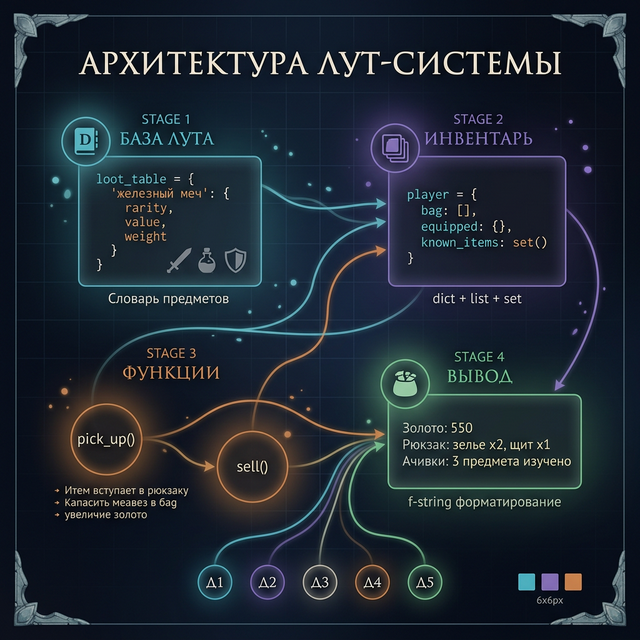
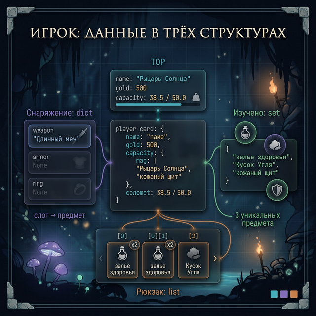

# Day 6: Практика — строим лут-систему для RPG

> **Сегодня:** только практика. Никакого нового материала — только закрепление.
>
> **Время:** ~60 минут

---

Ты изучил три структуры данных за неделю. Пришло время собрать их в настоящий рабочий проект.

Сегодня строим **лут-систему** для RPG: когда враг умирает, он роняет предметы. Игрок их подбирает, хранит в инвентаре, может продавать.

---



## Задание 1 — База данных лута (15 мин)

Создай словарь `loot_table` с данными о 6 предметах. У каждого предмета:
- `rarity` — редкость: `"common"`, `"rare"`, `"legendary"`
- `value` — цена в золоте (int)
- `weight` — вес (float)
- `stackable` — можно ли складывать (bool)

Пример одного предмета:
```python
loot_table = {
    "железный меч": {
        "rarity": "common",
        "value": 50,
        "weight": 4.5,
        "stackable": False
    },
    # ... ещё 5 предметов
}
```

Придумай сам: 3 common, 2 rare, 1 legendary. После создания выведи:
1. Все легендарные предметы
2. Суммарный вес всех предметов
3. Самый дорогой предмет и его цену

---

## Задание 2 — Инвентарь игрока (15 мин)

Создай инвентарь персонажа:

```python
player = {
    "name": "Рыцарь Солнца",
    "gold": 500,
    "capacity": 50.0,          # максимальная грузоподъёмность
    "bag": [],                  # список предметов (с повторами)
    "equipped": {               # снаряжение (слоты)
        "weapon": None,
        "armor": None,
        "ring": None
    },
    "known_items": set()        # множество виденных предметов (для ачивки)
}
```



Напиши функцию `pick_up(player, item_name, loot_table)`:
- Проверяет, есть ли предмет в `loot_table`
- Проверяет, влезет ли по весу (`capacity`)
- Если всё ок — добавляет в `bag`, уменьшает `capacity`, добавляет в `known_items`
- Выводит сообщение о подборе или причину отказа

```python
def pick_up(player, item_name, loot_table):
    if item_name not in loot_table:
        print(f"Предмет '{item_name}' не существует")
        return

    item = loot_table[item_name]
    # твой код: проверка веса и добавление
```

Протестируй: подбери 3-4 предмета, попробуй превысить вместимость.

<details>
<summary>Полное решение pick_up</summary>

```python
def pick_up(player, item_name, loot_table):
    if item_name not in loot_table:
        print(f"Предмет '{item_name}' не существует")
        return

    item = loot_table[item_name]
    weight = item["weight"]

    if weight > player["capacity"]:
        print(f"Не влезает — перегруз! (нужно {weight}, есть {player['capacity']:.1f})")
        return

    player["bag"].append(item_name)
    player["capacity"] -= weight
    player["known_items"].add(item_name)
    print(f"Подобрал: {item_name} ({item['rarity']}, -{weight} кг)")
```

</details>

---

## Задание 3 — Продажа предметов (15 мин)

Напиши функцию `sell(player, item_name, loot_table)`:
- Ищет предмет в `bag` (используй `in`)
- Удаляет **одну копию** из `bag` (`.remove()` удаляет первое совпадение)
- Увеличивает `gold` на `value` предмета
- Возвращает вес предмета в `capacity`
- Если предмета нет в рюкзаке — сообщает об этом

После написания проверь: продай один предмет, убедись что gold увеличился, capacity вернулась.

<details>
<summary>Подсказка — remove()</summary>

```python
bag = ["меч", "зелье", "меч"]
bag.remove("меч")   # удалит ПЕРВОЕ вхождение
print(bag)           # → ["зелье", "меч"]
```

</details>

---

## Задание 4 — Главный цикл игры (15 мин)

Теперь собери всё в интерактивный цикл:

```
=== ЛУТ-СИСТЕМА ===
Доступные команды:
  подобрать <предмет>   — подобрать предмет
  продать <предмет>     — продать предмет
  инвентарь             — показать рюкзак и золото
  экипировать <слот> <предмет>  — надеть предмет
  предметы              — показать всю базу лута
  ачивки                — показать уникальные предметы
  выход
```

**Команда `инвентарь`** выводит:
```
Золото: 550
Вместимость: 38.5/50.0
Снаряжение:
  оружие: железный меч
  броня: —
  кольцо: —
Рюкзак (3 предмета):
  зелье здоровья x2
  кожаный щит x1
```

**Команда `ачивки`** выводит количество уникальных предметов и их список — используй `known_items`.

**Команда `экипировать`**: переносит предмет из bag в equipped[slot]. Слоты: `оружие`/`броня`/`кольцо`.

---

## Бонус — Генератор лута врага

Когда враг умирает, он роняет случайные предметы. Используй эту строку в начале (скопируй, разберём в Week 5):

```python
import random  # скопируй эту строку — разберём import в Week 5
```

Напиши функцию `enemy_drop(enemy_type)`:
- `"зомби"` → роняет 1-2 common предмета (random.choice из common-списка)
- `"рыцарь"` → роняет 1 rare + шанс 20% на legendary
- `"босс"` → гарантированно legendary + 2 rare

```python
def enemy_drop(enemy_type, loot_table):
    dropped = []
    # твой код
    return dropped
```

---

## Чеклист выполнения

- [ ] `loot_table` с 6 предметами трёх редкостей
- [ ] Функция `pick_up` с проверкой веса
- [ ] Функция `sell` с корректным удалением из bag
- [ ] Главный цикл с командами `инвентарь`, `подобрать`, `продать`, `предметы`
- [ ] Команда `ачивки` использует `known_items` (set)
- [ ] **(Бонус)** Функция `enemy_drop`

---

← [Day 5 — Структуры вместе](day_5.md) | [Day 7 — Лонгрид →](day_7.md)
