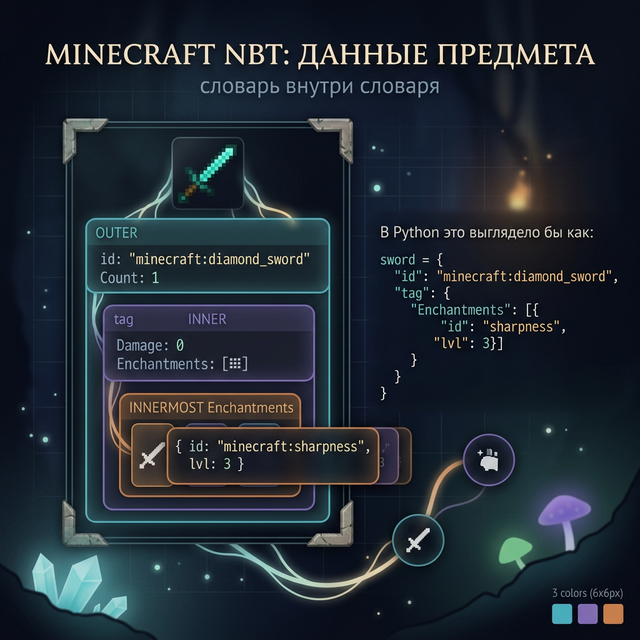
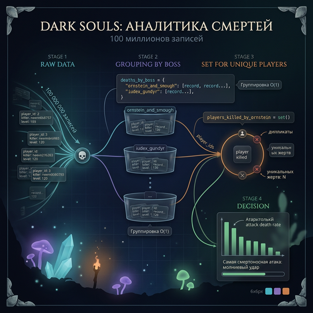

# Day 7: Как устроены данные в реальных играх

> **Сегодня:** никакого нового кода. Только истории о том, как то, что ты изучил за неделю, работает в играх с миллионами игроков.
>
> **Время:** ~60 минут чтения

---

## Введение

Ты провёл неделю, изучая словари, множества и вложенные структуры. Они кажутся учебными абстракциями.

Но каждый раз, когда Minecraft загружает чанк, Dark Souls читает данные босса, или YouTube выдаёт информацию о видео — за этим стоят те же самые структуры, которые ты писал сегодня. Только на порядок сложнее.

Сегодня три кейса. В каждом — конкретная проблема, решение через структуры данных, и момент, когда разработчики обнаруживали, что их решение не масштабируется.

---

## Кейс 1. Minecraft — мир из 60 триллионов блоков

### Задача, которую никто не ожидал

В 2011 году Minecraft стал хитом. И у Нотча возникла проблема: мир должен быть «бесконечным». Каждый блок — это данные: тип, прочность, состояние (горит/не горит). Если хранить всё в трёхмерном массиве — сколько памяти нужно?

Карта 10 000 × 10 000 блоков на 256 высот = **25 миллиардов блоков**. При 2 байта на блок — **50 гигабайт только для одного мира**. В 2011 году обычный компьютер имел 2-4 ГБ RAM.

### Решение: чанки + словарь

Нотч разбил мир на **чанки** 16×16×256 блоков — колонна высотой 256 блоков. Ключ идея: большинство блоков воздух — их не нужно хранить.

```python
# Упрощённая версия хранения мира Minecraft

world = {}  # словарь: координата чанка → данные чанка

def get_chunk(cx, cz):
    """Получить данные чанка. Если нет — создать."""
    key = (cx, cz)
    if key not in world:
        world[key] = generate_chunk(cx, cz)
    return world[key]

def get_block(x, y, z):
    """Получить блок по мировым координатам."""
    cx = x // 16   # координата чанка
    cz = z // 16

    chunk = get_chunk(cx, cz)
    local_x = x % 16  # позиция внутри чанка
    local_z = z % 16

    return chunk.get((local_x, y, local_z), "air")
```

Ключевое: `world.get((cx, cz))` — O(1). Неважно, сколько чанков в мире — 100 или 100 000. Поиск мгновенный.

### Проблема дюпликации — баг в словарях

В 2012 году в Minecraft нашли знаменитый **дюп** (дупликация предметов). Механика: когда игрок открывал сундук у края чанка, клиент и сервер обновляли данные в разное время.

В упрощённом виде:

```python
# Клиент думает, что предмет в чанке A
chunk_a["chest"] = {"items": ["алмаз", "изумруд"]}

# Сервер думает, что предмет в чанке B (он ещё не синхронизирован)
chunk_b["chest"] = {"items": ["алмаз", "изумруд"]}

# Игрок забирает предметы из ОБОИХ — получает два набора
```

Это была ошибка синхронизации словарей между клиентом и сервером. Mojang чинила подобные баги несколько лет. В современном Minecraft — сложная система версионирования данных, чтобы такого не происходило.

### Данные в формате NBT

Реальный Minecraft хранит данные не в Python-словарях, но в формате **NBT** (Named Binary Tag) — это бинарный аналог словаря:

```
TAG_Compound {
  "id": "minecraft:diamond_sword",
  "Count": 1,
  "tag": {
    "Damage": 0,
    "Enchantments": [
      {"id": "minecraft:sharpness", "lvl": 3}
    ]
  }
}
```

Если убрать специфику — это точный аналог Python-словаря с вложенными структурами. Когда ты в Week 4 будешь работать с JSON — ты увидишь тот же паттерн.

---



## Кейс 2. Dark Souls — 100 миллионов смертей и данные каждой

### Игра, которая записывает всё

Dark Souls — серия с репутацией "самая сложная". FromSoftware (создатели) собирают статистику о каждой смерти игрока: где умер, от кого, какой уровень.

На момент 2015 года было записано **более 100 миллионов смертей** от одного только Ornstein and Smough (самый сложный босс первой игры).

### Как хранится запись смерти

```python
# Одна запись о смерти (упрощённо)
death_record = {
    "player_id": "usr_48291734",
    "timestamp": 1623847293,
    "location": {
        "area": "Анор Лондо",
        "x": 127.4,
        "y": 83.0,
        "z": -44.2
    },
    "killer": {
        "type": "boss",
        "id": "ornstein_and_smough",
        "attack": "молниевый удар"
    },
    "player_stats": {
        "level": 42,
        "build": "dex",
        "weapon": "Falchion +10"
    }
}
```

100 миллионов таких записей. Как быстро найти «сколько игроков с уровнем < 30 умерло от Ornstein»?

### Хэш-таблица как словарь по боссу

```python
# Упрощённая версия аналитики

deaths_by_boss = {}  # ключ — id босса, значение — список записей

for record in all_deaths:
    boss_id = record["killer"]["id"]
    if boss_id not in deaths_by_boss:
        deaths_by_boss[boss_id] = []
    deaths_by_boss[boss_id].append(record)

# Теперь запрос — мгновенный:
ornstein_deaths = deaths_by_boss.get("ornstein_and_smough", [])

# Найти смерти игроков ниже 30 уровня
low_level_deaths = []
for d in ornstein_deaths:
    if d["player_stats"]["level"] < 30:
        low_level_deaths.append(d)
```

Без словаря — каждый запрос перебирал бы все 100 миллионов записей. С словарём — сначала мгновенный переход к нужному боссу, потом фильтрация только его записей.



### Множества для уникальных игроков

```python
# Сколько уникальных игроков умерло от Ornstein?

players_killed_by_ornstein = set()

for record in deaths_by_boss["ornstein_and_smough"]:
    players_killed_by_ornstein.add(record["player_id"])

print(f"Уникальных жертв: {len(players_killed_by_ornstein)}")
# Один игрок умирает 50 раз — считается как 1
```

Именно множество решает «уникальных»: неважно, сколько раз один игрок умер — в множестве он один раз.

### Мета-данные для разработки

FromSoftware использует эту статистику для **балансировки**: если 80% игроков умирает от определённой атаки больше 20 раз — скорее всего, атака нечестная. Разработчики получают словарь атак с процентами смертей и принимают решения о патчах.

```python
# Что делает аналитик в FromSoftware (примерно)
attack_death_rate = {}

for record in ornstein_deaths:
    attack = record["killer"]["attack"]
    if attack not in attack_death_rate:
        attack_death_rate[attack] = 0
    attack_death_rate[attack] += 1

# Найти самую смертоносную атаку
most_lethal = max(attack_death_rate, key=attack_death_rate.get)
print(f"Самая смертоносная: {most_lethal}")
```

Ты только что прочитал код, очень похожий на реальный аналитический код в геймдеве.

---

## Кейс 3. YouTube — ответ за 100 миллисекунд

### Проблема масштаба

YouTube обрабатывает **500 часов видео каждую минуту**. Когда ты открываешь страницу видео — за 100 миллисекунд браузер получает: заголовок, автора, количество просмотров, рекомендации, комментарии, данные рекламы.

Это возможно потому, что все эти данные уже подготовлены в структурах — в момент, когда ты нажимаешь «смотреть», большинство данных уже ждёт в кэше.

### YouTube Data API — словарь, который ты видишь

Любой разработчик может подключиться к YouTube API и получить данные о видео. Ответ приходит в JSON — формате, который выглядит как Python-словарь:

```python
# Реальный ответ YouTube API (упрощено)
api_response = {
    "kind": "youtube#video",
    "id": "dQw4w9WgXcQ",
    "snippet": {
        "publishedAt": "2009-10-25T06:57:33Z",
        "channelId": "UCuAXFkgsw1L7xaCfnd5JJOw",
        "title": "Rick Astley - Never Gonna Give You Up",
        "description": "The official video...",
        "channelTitle": "Rick Astley",
        "tags": ["pop", "80s", "rickroll", "music"]
    },
    "statistics": {
        "viewCount": "1421748028",
        "likeCount": "14000000",
        "commentCount": "2100000"
    },
    "contentDetails": {
        "duration": "PT3M33S",
        "definition": "hd",
        "licensedContent": True
    }
}

# Как разработчик работает с этим:
title = api_response["snippet"]["title"]
views = int(api_response["statistics"]["viewCount"])
tags = api_response["snippet"]["tags"]

print(f"Видео: {title}")
print(f"Просмотров: {views:,}")
print(f"Тегов: {len(tags)}")
```

Это вложенный словарь — точно то, что ты изучал в Day 3.

### Множества в рекомендательной системе

Рекомендации на YouTube — одна из самых сложных систем в мире. Но в основе лежит простой принцип пересечений:

```python
# Очень упрощённая версия "похожих видео"
video_tags = {
    "video_A": {"python", "программирование", "туториал"},
    "video_B": {"python", "django", "веб"},
    "video_C": {"java", "программирование", "ООП"},
    "video_D": {"python", "машинное обучение"},
}

def similar_videos(target_id, all_videos, top_n=2):
    target_tags = all_videos[target_id]
    scores = {}

    for vid_id, tags in all_videos.items():
        if vid_id == target_id:
            continue
        # Чем больше общих тегов — тем "похожее" видео
        common = len(target_tags & tags)
        if common > 0:
            scores[vid_id] = common

    # Сортировка по количеству общих тегов
    sorted_videos = sorted(scores, key=scores.get, reverse=True)
    return sorted_videos[:top_n]

print(similar_videos("video_A", video_tags))
# → ['video_B', 'video_C']  (у B — 1 общий тег с A: python; у C — 1: программирование)
```

Реальный алгоритм сложнее в тысячи раз, но операция `&` (пересечение множеств) — в его основе.

---

## Что это всё значит для тебя

За три кейса ты видел:

1. **Minecraft** использует словари для хранения мировых данных — O(1) доступ по координатам чанка
2. **Dark Souls** использует словари для группировки статистики и множества для подсчёта уникальных игроков
3. **YouTube** возвращает вложенные словари через API, а рекомендации строит на пересечениях множеств

Всё это — те же структуры, которые ты изучал всю неделю.

**Следующий шаг:** в Week 4 мы разберём JSON — формат, в котором данные хранятся в файлах и передаются по интернету. Ты уже знаешь, как он выглядит — это словари. Осталось научиться читать и записывать их.

А если тебя интересует, как устроены более сложные структуры данных (деревья, графы, хэш-таблицы изнутри) — это Week 8. Пока — ты знаешь достаточно, чтобы писать настоящий код.

---

## Факт-бомба

Хэш-таблица (механизм, на котором работают словари Python) была изобретена в **1953 году** Хансом Питером Луном в IBM. Изначально для поиска в библиотечных каталогах на перфокартах. Семьдесят лет спустя тот же принцип лежит в основе баз данных, кэш-систем и Python-словарей.

Каждый раз, когда ты пишешь `enemy["hp"]` — ты используешь алгоритм, которому больше 70 лет, и он всё ещё быстрее большинства альтернатив.

---

← [Day 6 — Практика](day_6.md) | [Week 4, Day 1 — Файлы →](../week_4/day_1.md)
