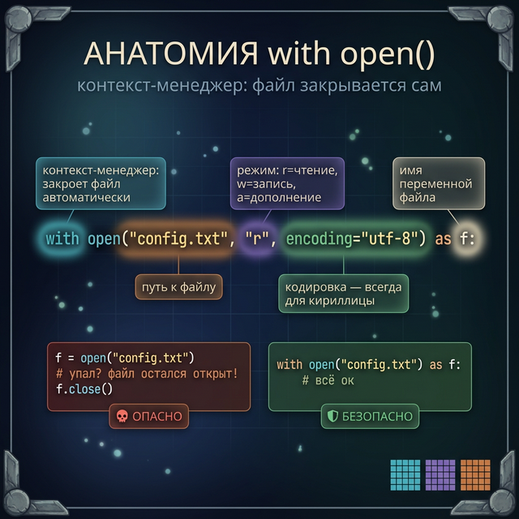
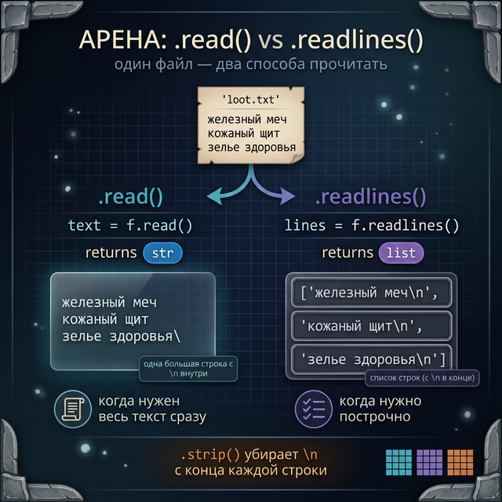
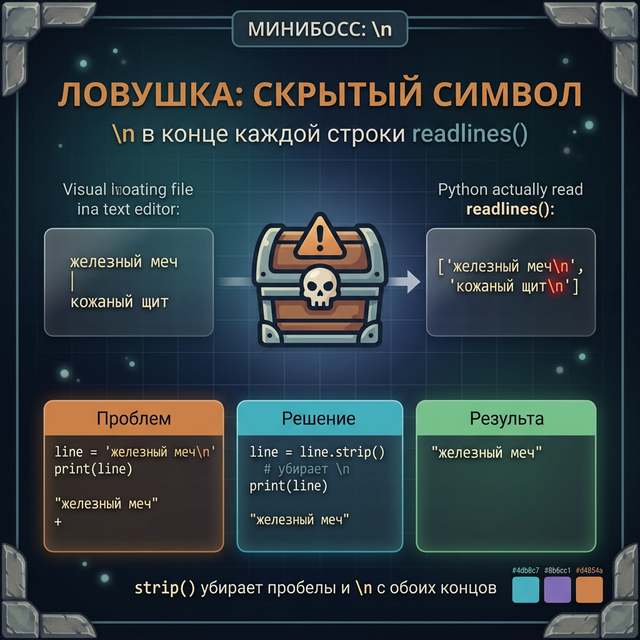
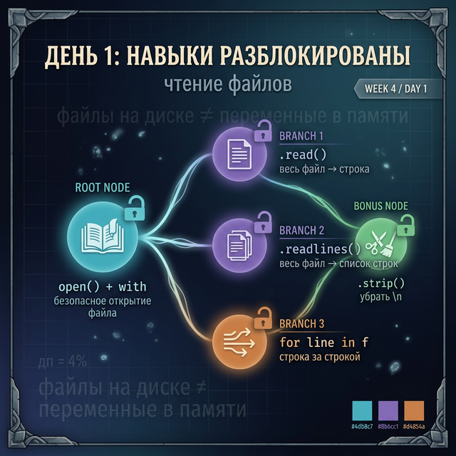

# Day 1: Файлы — данные, которые не исчезают

> **Новые концепции сегодня:** `open()` и `with`, `.read()` / `.readlines()`, перебор строк `for line in f`, режимы `'r'` / `'w'` / `'a'`
>
> **Время:** ~40 минут (теория + практика)

---

## Введение: проблема, которую решают файлы

Всё, что ты делаешь в программе — создаёшь словари, списки, переменные — живёт в оперативной памяти. Закрыл программу — **всё исчезло**.

Minecraft не забывает твой мир между сессиями. Dark Souls сохраняет, где ты умер. Stardew Valley помнит твою ферму через год после последнего запуска.

Это всё — файлы на диске. Сегодня учимся их читать.

---

## Часть 1. open() и with — открываем файл

Чтобы прочитать файл, нужно его сначала открыть:

```python
# Простейший способ открыть файл для чтения
f = open("config.txt", "r", encoding="utf-8")
content = f.read()
f.close()    # ОБЯЗАТЕЛЬНО закрыть!
print(content)
```

Проблема: если программа упадёт между `open()` и `close()` — файл останется открытым. Python решил это через **контекст-менеджер `with`**:

```python
# Правильный способ — with закрывает файл АВТОМАТИЧЕСКИ
with open("config.txt", "r", encoding="utf-8") as f:
    content = f.read()

# Файл уже закрыт — даже если была ошибка внутри with
print(content)
```

`with open(...) as f:` — читай как «открой файл и назови его `f`, а когда выйдешь из блока — закрой автоматически». Всегда используй `with` вместо ручного `close()`.

**Параметры `open()`:**
- Первый аргумент — путь к файлу
- `"r"` — режим (read, чтение) — по умолчанию
- `encoding="utf-8"` — кодировка текста (всегда указывай для кириллицы)



---

## Часть 2. .read() и .readlines() — читаем содержимое

Два основных способа получить содержимое:

```python
# .read() — весь файл как одна строка
with open("loot.txt", encoding="utf-8") as f:
    text = f.read()

print(type(text))   # → <class 'str'>
print(text)
# → железный меч\nкожаный щит\nзелье здоровья\n
```

```python
# .readlines() — список строк (каждая строка = элемент)
with open("loot.txt", encoding="utf-8") as f:
    lines = f.readlines()

print(type(lines))    # → <class 'list'>
print(lines)
# → ['железный меч\n', 'кожаный щит\n', 'зелье здоровья\n']
```

Каждая строка содержит `\n` в конце — символ переноса строки. Чтобы убрать:

```python
clean_lines = []
for line in lines:
    clean_lines.append(line.strip())   # strip() убирает \n и пробелы
print(clean_lines)
# → ['железный меч', 'кожаный щит', 'зелье здоровья']
```





---

## Часть 3. for line in file — читаем построчно

Самый эффективный способ — не загружать весь файл сразу, а читать строку за строкой:

```python
with open("server.properties", encoding="utf-8") as f:
    for line in f:
        line = line.strip()
        if line and not line.startswith("#"):
            print(line)
```

Именно так устроен парсинг конфига Minecraft-сервера: `server.properties` — это текстовый файл, каждая строка — настройка. Игра читает его при старте построчно.

```python
# Парсим config: ключ=значение
config = {}
with open("server.properties", encoding="utf-8") as f:
    for line in f:
        line = line.strip()
        if "=" in line and not line.startswith("#"):
            key, value = line.split("=", 1)
            config[key] = value

print(config.get("max-players", "unknown"))
# → 20
```

`split("=", 1)` — разделяет строку по `=`, но не более 1 раза. Если значение само содержит `=` — не сломается.

---

## Часть 4. Режимы открытия

`open()` принимает режим вторым аргументом:

| Режим | Расшифровка | Что делает |
|:------|:------------|:-----------|
| `'r'` | read | Читать (по умолчанию) |
| `'w'` | write | Создать/перезаписать |
| `'a'` | append | Дописать в конец |
| `'x'` | exclusive | Создать (ошибка если существует) |

Сегодня только `'r'`. Режимы `'w'` и `'a'` — завтра.

```python
# Чтение — файл ДОЛЖЕН существовать
with open("save.txt", "r", encoding="utf-8") as f:
    data = f.read()
```

Если файл не найден — `FileNotFoundError`. Это нормально: файл сейва должен существовать перед загрузкой.

---

## Задания

### Задание 1 — Прочитать и вывести

Создай файл `enemies.txt` с 5 строками (имена врагов, по одному на строку). Напиши программу, которая:
1. Читает файл через `.readlines()`
2. Выводит каждого врага с порядковым номером (используй `enumerate`)

```
1. Зомби
2. Скелет
3. Крипер
...
```

<details>
<summary>Подсказка — создание тестового файла</summary>

Создай файл вручную в Obsidian, или добавь в начало программы:

```python
# Временно — создадим файл для теста
with open("enemies.txt", "w", encoding="utf-8") as f:
    f.write("Зомби\nСкелет\nКрипер\nИссушитель\nЭндермен\n")
```

</details>

<details>
<summary>Ответ</summary>

```python
with open("enemies.txt", encoding="utf-8") as f:
    lines = f.readlines()

for i, line in enumerate(lines, start=1):
    print(f"{i}. {line.strip()}")
```

</details>

---

### Задание 2 — Парсинг конфига

Создай файл `settings.txt`:
```
# Настройки игры
player_name=Hero
max_hp=100
difficulty=hard
language=ru
```

Напиши программу, которая читает файл и строит словарь настроек (пропуская строки с `#`).

<details>
<summary>Ответ</summary>

```python
settings = {}
with open("settings.txt", encoding="utf-8") as f:
    for line in f:
        line = line.strip()
        if line and not line.startswith("#"):
            key, value = line.split("=", 1)
            settings[key] = value

for key, value in settings.items():
    print(f"{key}: {value}")
# → player_name: Hero
# → max_hp: 100
# ...
```

</details>

---

### Задание 3 — Подсчёт статистики

Файл `battle_log.txt` содержит строки вида:
```
Player убил Зомби
Player убил Крипера
Зомби убил Player
Player убил Скелета
```

Напиши программу, которая считает: сколько раз player победил, сколько раз умер.

<details>
<summary>Ответ</summary>

```python
kills = 0
deaths = 0
with open("battle_log.txt", encoding="utf-8") as f:
    for line in f:
        line = line.strip()
        if line.startswith("Player убил"):
            kills += 1
        elif line.endswith("убил Player"):
            deaths += 1

print(f"Побед: {kills}, Смертей: {deaths}")
```

</details>

---

### Задание 4 — Мини-проект: загрузчик инвентаря

Создай файл `inventory.txt`, где каждая строка — предмет и количество через запятую:
```
железный меч,1
зелье здоровья,5
стрелы,64
факел,20
```

Напиши программу, которая:
1. Читает файл и строит словарь `{предмет: количество}`
2. Выводит инвентарь красиво
3. Считает суммарное количество предметов

```
=== ИНВЕНТАРЬ ===
железный меч:    1
зелье здоровья:  5
стрелы:         64
факел:          20
---
Итого предметов: 90
```

<details>
<summary>Ответ</summary>

```python
inventory = {}
with open("inventory.txt", encoding="utf-8") as f:
    for line in f:
        line = line.strip()
        if line:
            name, amount = line.split(",")
            inventory[name] = int(amount)

print("=== ИНВЕНТАРЬ ===")
for item, count in inventory.items():
    print(f"{item:<20} {count:>4}")

total = sum(inventory.values())
print(f"---\nИтого предметов: {total}")
```

</details>

---

<quiz>
[
  {
    "question": "Зачем использовать `with open(...) as f:` вместо просто `open()`?",
    "options": [
      "with работает быстрее",
      "with автоматически закрывает файл даже при ошибке",
      "без with нельзя указать кодировку",
      "with позволяет читать файлы любого размера"
    ],
    "answer": 1,
    "explanation": "Контекст-менеджер with гарантирует закрытие файла в любом случае — даже если внутри блока произошла ошибка. Без этого файл может остаться открытым."
  },
  {
    "question": "Чем .read() отличается от .readlines()?",
    "options": [
      ".read() читает первую строку, .readlines() — все",
      ".read() возвращает строку, .readlines() — список строк",
      ".readlines() работает быстрее для больших файлов",
      "Нет разницы — оба возвращают список"
    ],
    "answer": 1,
    "explanation": ".read() возвращает весь файл как одну строку. .readlines() возвращает список, где каждый элемент — одна строка (с \n в конце)."
  },
  {
    "question": "Почему строки из .readlines() содержат '\\n' в конце?",
    "options": [
      "Это баг Python",
      "\\n — символ переноса строки, который есть в файле после каждой строки",
      "\\n добавляет сам Python для разделения строк",
      "Только если файл открыт в режиме 'r'"
    ],
    "answer": 1,
    "explanation": "\\n — это символ новой строки, который реально хранится в файле. .readlines() возвращает строки как они есть. Используй .strip() чтобы убрать \\n."
  }
]
</quiz>

---



← [Week 3, Day 7 — Лонгрид](../week_3/day_7.md) | [Day 2 — Запись в файлы →](day_2.md)
