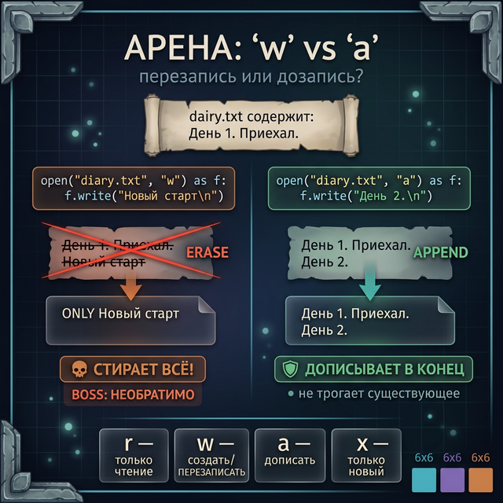
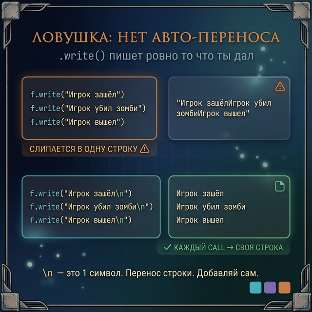
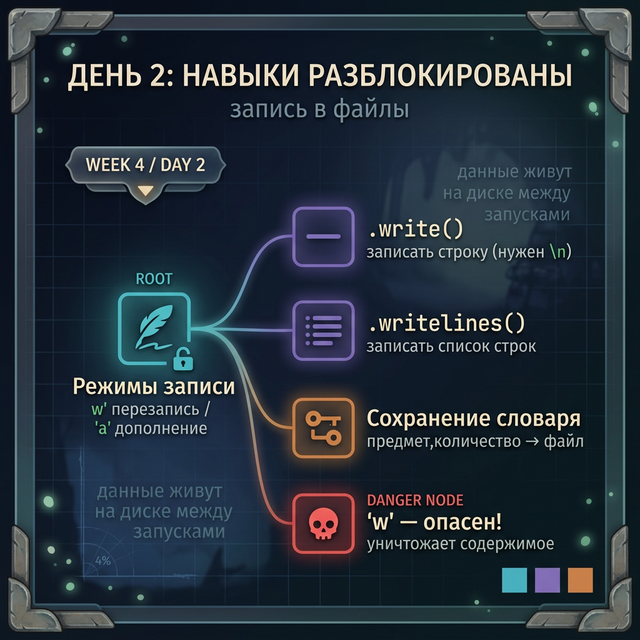

# Day 2: Запись в файл — данные, которые живут после программы

> **Новые концепции сегодня:** режимы `'w'` и `'a'`, `.write()` и `.writelines()`, символ `\n`
>
> **Время:** ~35 минут (теория + практика)

---

## Введение: дневник фермера

В Stardew Valley каждый день — событие. Ты женился, поймал рыбу легендарного размера, продал первый урожай. Эти события должны где-то храниться — не только в памяти игры, но и в истории.

Сегодня научимся **писать** в файлы: создавать, перезаписывать и дописывать. После этого данные программы живут на диске между запусками.

---

## Часть 1. Режим 'w' — создаём и перезаписываем

Вчера мы открывали файл в режиме `'r'` (read). Сегодня — режим `'w'` (write):

```python
# 'w' — создаёт файл если не было, перезаписывает если был
with open("diary.txt", "w", encoding="utf-8") as f:
    f.write("День 1. Приехал на ферму деда.\n")
    f.write("День 2. Посадил первые репы.\n")
    f.write("День 3. Пошёл дождь.\n")
```

После выполнения в папке появится `diary.txt` с тремя строками.

> **Важно:** режим `'w'` **уничтожает** содержимое файла перед записью. Если файл уже существовал — предыдущие данные стёрты. Навсегда.

```python
# Опасность 'w':
with open("diary.txt", "w", encoding="utf-8") as f:
    f.write("Новый старт\n")
# Три строки, которые были — исчезли. Осталась только эта.
```

---

## Часть 2. Режим 'a' — дописываем в конец

Режим `'a'` (append) добавляет текст в конец файла, не трогая существующее:

```python
# Дописываем новые дни в дневник
with open("diary.txt", "a", encoding="utf-8") as f:
    f.write("День 4. Продал репы. Получил 80 монет.\n")
    f.write("День 5. Купил полив. Жизнь стала лучше.\n")
```

Теперь файл содержит все дни. Это именно так работают игровые логи: новые события дописываются в конец, старые сохраняются.

```python
# Сравнение режимов:
# 'r'  — читать (файл должен существовать)
# 'w'  — создать/ПЕРЕЗАПИСАТЬ
# 'a'  — дописать в конец (создаёт если нет, НЕ затирает если есть)
# 'x'  — создать ТОЛЬКО если не существует
```



---

## Часть 3. .write() — пишем строки

`.write()` принимает **строку** и записывает её. Без автоматического `\n`:

```python
with open("log.txt", "w", encoding="utf-8") as f:
    f.write("Игрок зашёл в игру")
    f.write("Игрок убил зомби")
    f.write("Игрок вышел из игры")
```

Результат — всё слеплено в одну строку: `Игрок зашёл в игруИгрок убил зомбиИгрок вышел из игры`.

Нужно самому добавлять `\n`:

```python
events = [
    "Игрок зашёл в игру",
    "Игрок убил зомби",
    "Игрок вышел из игры"
]

with open("log.txt", "w", encoding="utf-8") as f:
    for event in events:
        f.write(event + "\n")
```

Теперь каждое событие — на своей строке.



---

## Часть 4. .writelines() — пишем список строк

`.writelines()` записывает список строк за один вызов. **Тоже без автоматического `\n`**:

```python
inventory_lines = [
    "железный меч,1\n",
    "зелье здоровья,5\n",
    "стрелы,64\n"
]

with open("inventory.txt", "w", encoding="utf-8") as f:
    f.writelines(inventory_lines)
```

Или добавляй `\n` через `join`:

```python
items = ["железный меч", "зелье здоровья", "стрелы"]

with open("inventory.txt", "w", encoding="utf-8") as f:
    f.write("\n".join(items) + "\n")
```

---

## Часть 5. Паттерн: сохранение словаря в текстовый файл

Сохранить словарь `{предмет: количество}` в файл, загрузить обратно — самый базовый «ручной» сейв:

```python
# Сохранение
inventory = {"меч": 1, "зелье": 5, "стрелы": 64}

with open("inventory.txt", "w", encoding="utf-8") as f:
    for item, count in inventory.items():
        f.write(f"{item},{count}\n")
```

```python
# Загрузка
inventory = {}
with open("inventory.txt", encoding="utf-8") as f:
    for line in f:
        item, count = line.strip().split(",")
        inventory[item] = int(count)

print(inventory)
# → {'меч': 1, 'зелье': 5, 'стрелы': 64}
```

Это работает, но неудобно — нужно вручную поддерживать формат. В Day 3 узнаем, как JSON решает эту проблему элегантнее.

---

## Задания

### Задание 1 — Журнал событий

Напиши программу, которая ведёт лог боевых событий.

Программа в цикле спрашивает: «что случилось?». Каждое событие дописывается в `battle_log.txt` (режим `'a'`) с текущим номером события. При вводе `"стоп"` — выходит.

```
Событие: Зомби атаковал
Событие: Игрок выпил зелье
Событие: Зомби умер
Событие: стоп

→ battle_log.txt содержит:
[1] Зомби атаковал
[2] Игрок выпил зелье
[3] Зомби умер
```

<details>
<summary>Ответ</summary>

```python
counter = 1
while True:
    event = input("Событие: ")
    if event == "стоп":
        break
    with open("battle_log.txt", "a", encoding="utf-8") as f:
        f.write(f"[{counter}] {event}\n")
    counter += 1
```

</details>

---

### Задание 2 — Конфиг-менеджер

Напиши программу, которая:
1. Загружает настройки из `settings.txt` (формат `ключ=значение`)
2. Позволяет изменить одну настройку
3. Сохраняет обновлённые настройки обратно в файл

<details>
<summary>Подсказка</summary>

Загрузи в словарь → измени значение → перезапиши файл через `'w'`.

</details>

<details>
<summary>Ответ</summary>

```python
# Загрузка
settings = {}
with open("settings.txt", encoding="utf-8") as f:
    for line in f:
        line = line.strip()
        if "=" in line:
            key, value = line.split("=", 1)
            settings[key] = value

# Изменение
key = input("Какой параметр изменить? ")
if key in settings:
    new_value = input(f"Новое значение для {key}: ")
    settings[key] = new_value

# Сохранение
with open("settings.txt", "w", encoding="utf-8") as f:
    for k, v in settings.items():
        f.write(f"{k}={v}\n")

print("Настройки сохранены.")
```

</details>

---

### Задание 3 — Backup системы

Напиши функцию `backup(source_file, backup_file)`, которая копирует содержимое одного текстового файла в другой. Если файл-источник не найден — выводит сообщение об ошибке.

<details>
<summary>Подсказка</summary>

Прочитай через `.read()`, запиши через `.write()`.

</details>

<details>
<summary>Ответ</summary>

```python
def backup(source_file, backup_file):
    try:
        with open(source_file, encoding="utf-8") as src:
            content = src.read()
        with open(backup_file, "w", encoding="utf-8") as dst:
            dst.write(content)
        print(f"Backup создан: {backup_file}")
    except FileNotFoundError:
        print(f"Файл не найден: {source_file}")

backup("diary.txt", "diary_backup.txt")
```

Здесь используется `try/except` — мы разберём его подробно в Week 6. Пока просто запомни паттерн.

</details>

---

### Задание 4 — Мини-проект: дневник фермера

Напиши интерактивный дневник в стиле Stardew Valley.

**Команды:**
- `запись <текст>` — добавить запись в дневник (с номером дня, режим `'a'`)
- `читать` — вывести весь дневник
- `очистить` — очистить дневник (режим `'w'`)
- `выход`

День автоматически увеличивается при каждой записи. День хранится в самом файле (первая запись = День 1, вторая = День 2...) — или считай через `len(readlines())`.

<details>
<summary>Структура программы</summary>

```python
DIARY_FILE = "farm_diary.txt"

def count_days():
    try:
        with open(DIARY_FILE, encoding="utf-8") as f:
            return len(f.readlines())
    except FileNotFoundError:
        return 0

while True:
    cmd = input("Команда: ").strip()
    if cmd == "выход":
        break
    elif cmd.startswith("запись "):
        text = cmd[7:]
        day = count_days() + 1
        with open(DIARY_FILE, "a", encoding="utf-8") as f:
            f.write(f"День {day}: {text}\n")
        print(f"Записан День {day}")
    elif cmd == "читать":
        # твой код
        pass
    elif cmd == "очистить":
        # твой код
        pass
```

</details>

---

<quiz>
[
  {
    "question": "Какой режим открытия файла нужно использовать, чтобы ДОБАВИТЬ текст в конец, не удаляя существующее?",
    "options": [
      "'w'",
      "'r'",
      "'a'",
      "'x'"
    ],
    "answer": 2,
    "explanation": "Режим 'a' (append) дописывает в конец файла. 'w' перезаписывает файл с нуля. 'r' только для чтения. 'x' создаёт новый файл (ошибка если уже существует)."
  },
  {
    "question": "Что произойдёт при открытии существующего файла в режиме 'w'?",
    "options": [
      "Новые данные добавятся в конец файла",
      "Содержимое файла будет уничтожено и перезаписано",
      "Произойдёт ошибка — файл уже существует",
      "Файл будет скопирован в backup"
    ],
    "answer": 1,
    "explanation": "Режим 'w' создаёт файл заново. Если файл уже существовал — всё его содержимое стирается перед записью. Это необратимо."
  },
  {
    "question": "Почему .write() не добавляет перенос строки автоматически?",
    "options": [
      "Это баг в Python",
      "write() записывает строку точно как есть — без изменений. Разработчик сам решает, нужен ли \\n",
      "Нужно использовать writeline() вместо write() для переносов",
      "\\n нужно добавлять только при открытии в режиме 'a'"
    ],
    "answer": 1,
    "explanation": "write() записывает ровно то, что ты передал. Если нужен перенос строки — добавь \\n явно: f.write(text + '\\n')."
  }
]
</quiz>

---



← [Day 1 — Чтение файлов](day_1.md) | [Day 3 — JSON →](day_3.md)
