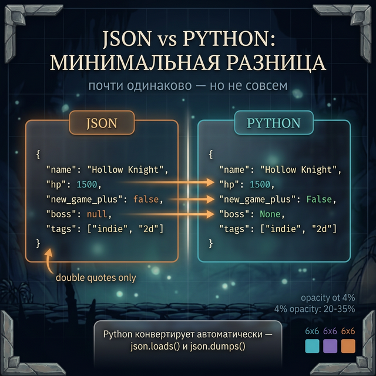
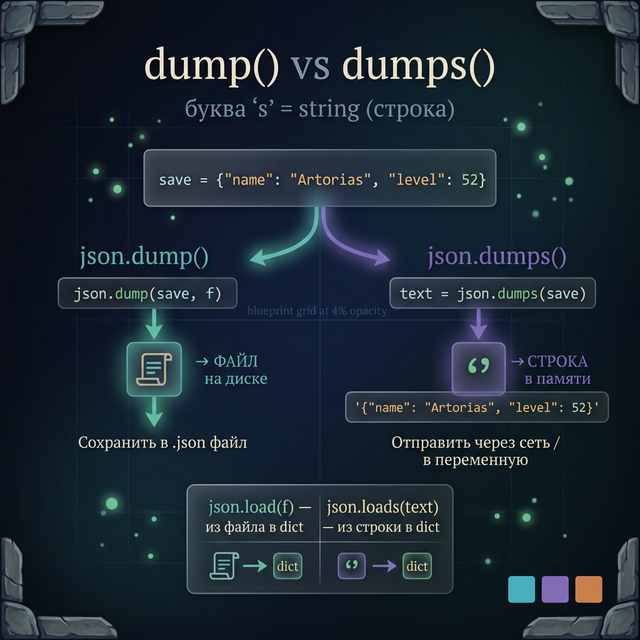
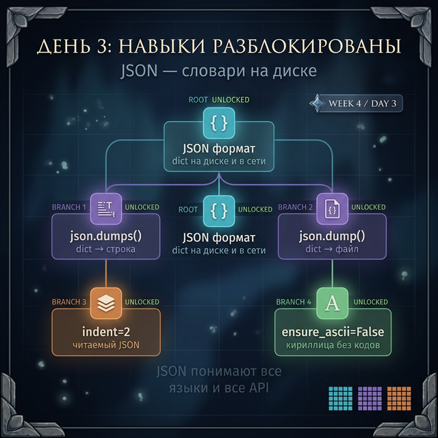

# Day 3: JSON — универсальный язык данных

> **Новые концепции сегодня:** `json.dumps()` / `json.loads()`, `json.dump()` / `json.load()`, параметр `indent`, `encoding="utf-8"`
>
> **Время:** ~40 минут (теория + практика)

---

## Введение: проблема ручного формата

Вчера мы сохраняли словарь вот так:
```
меч,1
зелье,5
стрелы,64
```

А что если значение само содержит запятую? А если словарь вложенный? А если нужно сохранить `True`/`False`? Ручной текстовый формат быстро ломается.

Разработчики давно решили эту проблему — создали **JSON** (JavaScript Object Notation). Это стандарт, который выглядит почти как Python-словарь и понимается любым языком программирования и любым API.

> В Week 3 Day 7 мы видели, как YouTube возвращает данные о видео. Это был JSON. Сегодня научимся его читать и писать.

---

## Часть 1. JSON выглядит как словарь Python

```json
{
  "name": "Hollow Knight",
  "hp": 1500,
  "bosses_defeated": ["Radiance", "Pure Vessel"],
  "geo": 2847,
  "new_game_plus": false
}
```

Сравни с Python-словарём:
```python
{
    "name": "Hollow Knight",
    "hp": 1500,
    "bosses_defeated": ["Radiance", "Pure Vessel"],
    "geo": 2847,
    "new_game_plus": False
}
```

Отличия минимальны: JSON использует `false` вместо `False`, `null` вместо `None`, двойные кавычки обязательны. Python конвертирует автоматически.



---

## Часть 2. json.dumps() и json.loads() — строка ↔ dict

```python
import json   # ← скопируй эту строку — мы разберём import в Week 5
```

**`json.dumps()`** — dict → строка JSON:

```python
import json

save_data = {
    "player": "Избранный Мертвец",
    "level": 42,
    "souls": 150000,
    "covenants": ["Воины Солнца", "Слуги Алдрика"]
}

json_string = json.dumps(save_data)
print(json_string)
# → {"player": "Избранный Мертвец", "level": 42, "souls": 150000, ...}
print(type(json_string))
# → <class 'str'>
```

**`json.loads()`** — строка JSON → dict:

```python
json_string = '{"player": "Alex", "level": 10, "hp": 100}'

data = json.loads(json_string)
print(data["player"])   # → Alex
print(data["level"])    # → 10
print(type(data))       # → <class 'dict'>
```

`dumps` = "dump to string", `loads` = "load from string". Буква `s` = string.

---

## Часть 3. json.dump() и json.load() — файл ↔ dict

Версии без `s` работают напрямую с файлами:

**`json.dump()`** — dict → файл:

```python
import json

save_data = {
    "name": "Серый Принц Зот",
    "geo": 2847,
    "charm_notches": 3,
    "completed_trials": ["Воина", "Завоевателя"]
}

with open("hollow_knight_save.json", "w", encoding="utf-8") as f:
    json.dump(save_data, f, ensure_ascii=False, indent=2)
```

**`json.load()`** — файл → dict:

```python
import json

with open("hollow_knight_save.json", encoding="utf-8") as f:
    save_data = json.load(f)

print(save_data["name"])
# → Серый Принц Зот
print(save_data["completed_trials"])
# → ['Воина', 'Завоевателя']
```



---

## Часть 4. Параметры: indent и ensure_ascii

**`indent`** — делает JSON читаемым:

```python
data = {"hp": 100, "items": ["меч", "щит"]}

# Без indent — компактно, нечитаемо
print(json.dumps(data))
# → {"hp": 100, "items": ["\u043c\u0435\u0447", "\u0449\u0438\u0442"]}

# С indent и ensure_ascii=False — красиво и по-русски
print(json.dumps(data, indent=2, ensure_ascii=False))
# → {
# →   "hp": 100,
# →   "items": [
# →     "меч",
# →     "щит"
# →   ]
# → }
```

- `indent=2` — отступ 2 пробела, файл читаемый
- `ensure_ascii=False` — кириллица сохраняется как кириллица, не как `\uXXXX`

**`encoding="utf-8"`** (W1-06 ✅):

```python
# Всегда указывай encoding при работе с кириллицей
with open("save.json", "w", encoding="utf-8") as f:
    json.dump(data, f, ensure_ascii=False, indent=2)
```

UTF-8 — стандарт кодировки, который поддерживает все языки. Без него русский текст может превратиться в кракозябры на другой платформе.

---

## Часть 5. Вложенные структуры — полный сейв

JSON легко работает с вложенными словарями и списками — всё что ты делал в Week 3:

```python
import json

full_save = {
    "character": {
        "name": "Artorias",
        "level": 52,
        "stats": {"str": 40, "dex": 30, "vit": 25}
    },
    "location": "Лес Арторриаса",
    "inventory": ["Меч Бездны", "Щит Рыцаря"],
    "flags": {
        "boss_artorias_killed": True,
        "new_game_plus": False
    }
}

with open("ds_save.json", "w", encoding="utf-8") as f:
    json.dump(full_save, f, ensure_ascii=False, indent=2)

# Загружаем и используем как обычный Python-словарь
with open("ds_save.json", encoding="utf-8") as f:
    loaded = json.load(f)

print(loaded["character"]["stats"]["str"])  # → 40
print(loaded["flags"]["boss_artorias_killed"])  # → True
```

---

## Задания

### Задание 1 — Конвертация

Дан Python-словарь — данные игрока. Преобразуй его в JSON-строку, выведи на экран. Потом преобразуй обратно и выведи имя игрока.

```python
player = {
    "name": "DragonSlayer",
    "rank": 5,
    "achievements": ["first_blood", "no_damage"],
    "online": True
}
```

<details>
<summary>Ответ</summary>

```python
import json

player = {
    "name": "DragonSlayer",
    "rank": 5,
    "achievements": ["first_blood", "no_damage"],
    "online": True
}

json_str = json.dumps(player, ensure_ascii=False, indent=2)
print(json_str)

loaded = json.loads(json_str)
print(loaded["name"])   # → DragonSlayer
```

</details>

---

### Задание 2 — Сохранение и загрузка

Напиши две функции:
- `save_player(player, filename)` — сохраняет словарь в JSON-файл
- `load_player(filename)` — загружает словарь из JSON-файла и возвращает его

Протестируй: сохрани игрока, измени данные в программе, загрузи из файла — убедись что загрузились оригинальные данные.

<details>
<summary>Ответ</summary>

```python
import json

def save_player(player, filename):
    with open(filename, "w", encoding="utf-8") as f:
        json.dump(player, f, ensure_ascii=False, indent=2)
    print(f"Сохранено в {filename}")

def load_player(filename):
    with open(filename, encoding="utf-8") as f:
        return json.load(f)

player = {"name": "Solaire", "level": 50, "covenant": "Воины Солнца"}
save_player(player, "solaire.json")

player["level"] = 99    # изменяем в программе

loaded = load_player("solaire.json")
print(loaded["level"])   # → 50 (из файла — оригинальное значение)
```

</details>

---

### Задание 3 — Дебаг-квест

Код должен загрузить JSON и вывести имя игрока, но падает. Найди и исправь все ошибки.

```python
import json

json_str = "{'name': 'Steve', 'hp': 100, 'items': ['меч', 'щит']}"

data = json.loads(json_str)
print(data['name'])
```

<details>
<summary>Подсказка 1</summary>
JSON требует двойные кавычки. Одинарные — не JSON-формат, это Python-строка.
</details>

<details>
<summary>Подсказка 2</summary>
Замени одинарные кавычки на двойные. Или создай словарь Python и преобразуй через json.dumps().
</details>

<details>
<summary>Ответ и объяснение</summary>

```python
import json

# Ошибка: одинарные кавычки — не валидный JSON
# json_str = "{'name': 'Steve', ...}"

# Исправление 1 — правильный JSON с двойными кавычками:
json_str = '{"name": "Steve", "hp": 100, "items": ["меч", "щит"]}'

data = json.loads(json_str)
print(data["name"])   # → Steve
```

**Защитный приём:** JSON всегда использует двойные кавычки. Если получаешь данные из внешнего источника — они должны быть в двойных кавычках. При создании строки руками — осторожнее с кавычками.

</details>

---

### Задание 4 — Мини-проект: база данных боссов

Создай JSON-файл `bosses_db.json` с данными 3 боссов Dark Souls (вложенные словари: hp, souls, weakness, drop). Напиши программу-справочник:

- Загружает данные из JSON при старте
- Команда `кто` — список боссов
- Имя босса — его карточка
- `сохранить` — сохраняет текущее состояние в JSON
- `выход`

Добавь возможность помечать боссов как убитых: `убить <имя>` устанавливает `"defeated": true` в данных.

<details>
<summary>Структура JSON</summary>

```json
{
  "Иудекс Гундир": {
    "hp": 1037,
    "souls": 3000,
    "weakness": "молния",
    "drop": "Пепел Пожирателя Богов",
    "defeated": false
  }
}
```

</details>

---

<quiz>
[
  {
    "question": "Чем json.dump() отличается от json.dumps()?",
    "options": [
      "dump() быстрее, dumps() читаемее",
      "dump() пишет в файл, dumps() возвращает строку",
      "dumps() пишет в файл, dump() возвращает строку",
      "Нет разницы — оба делают одно и то же"
    ],
    "answer": 1,
    "explanation": "dump() принимает объект и файловый дескриптор — пишет прямо в файл. dumps() принимает объект и возвращает JSON-строку. Буква 's' = string."
  },
  {
    "question": "Зачем нужен параметр ensure_ascii=False при json.dumps()?",
    "options": [
      "Для ускорения работы с файлами",
      "Чтобы кириллица сохранялась как кириллица, а не как \\uXXXX коды",
      "Чтобы разрешить одинарные кавычки в JSON",
      "Для поддержки чисел с плавающей точкой"
    ],
    "answer": 1,
    "explanation": "По умолчанию json экранирует все не-ASCII символы. ensure_ascii=False отключает это — русский текст сохраняется читаемо."
  },
  {
    "question": "Что вернёт json.loads('{\"hp\": 100, \"alive\": true}')?",
    "options": [
      "Строку с JSON",
      "Python-словарь {'hp': 100, 'alive': True}",
      "Ошибку — JSON-строка не поддерживает true",
      "Python-словарь {'hp': '100', 'alive': 'true'} (всё как строки)"
    ],
    "answer": 1,
    "explanation": "json.loads() конвертирует JSON-строку в Python-объект. JSON true → Python True, JSON null → Python None, JSON числа → Python int/float."
  }
]
</quiz>

---



← [Day 2 — Запись в файлы](day_2.md) | [Day 4 — Система сейвов →](day_4.md)
