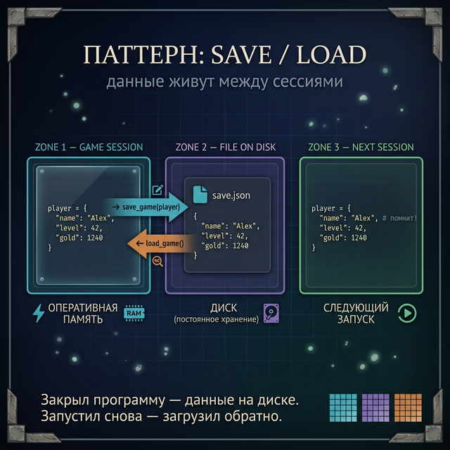
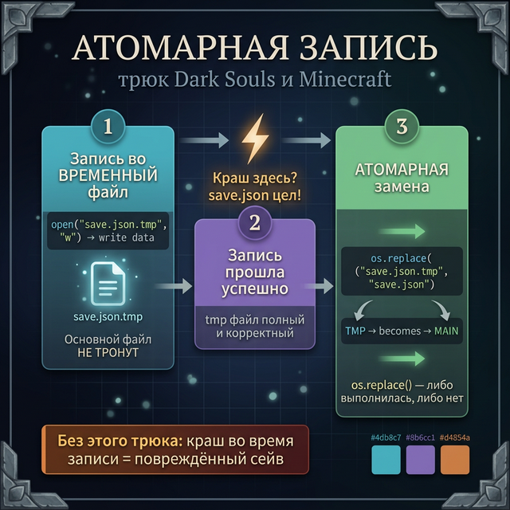
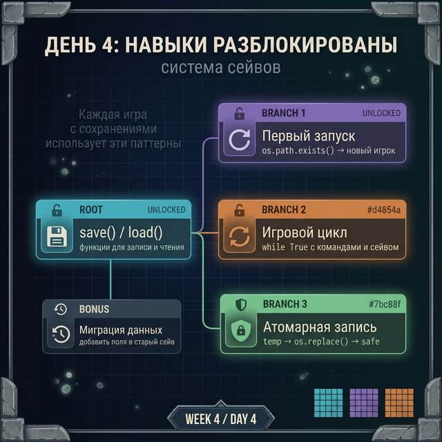

# Day 4: Система сейвов — как хранить состояние игры

> **Новые концепции сегодня:** паттерн `save()` / `load()`, обработка первого запуска, временный файл для атомарной записи
>
> **Время:** ~40 минут (теория + практика)

---

## Введение: что делает Dark Souls при сохранении

В Dark Souls сохранение происходит мгновенно — почти в реальном времени. Каждое действие: убил врага, открыл сундук, умер — записывается в файл `*.sl2`.

Если игру закрыть посередине записи — сейв повреждён. Именно поэтому разработчики придумывают трюки: сначала пишут в временный файл, потом меняют его на основной. Если свет выключился — основной файл не тронут.

Сегодня строим полноценную систему сейвов: save, load, новая игра.

---

## Часть 1. Паттерн: функции save и load

Оберни работу с файлом в функции — это главное правило:

```python
import json   # ← скопируй эту строку — разберём import в Week 5

SAVE_FILE = "game_save.json"

def save_game(game_data):
    """Сохраняет состояние игры в JSON-файл."""
    with open(SAVE_FILE, "w", encoding="utf-8") as f:
        json.dump(game_data, f, ensure_ascii=False, indent=2)
    print("✓ Игра сохранена")

def load_game():
    """Загружает состояние из файла. Возвращает словарь."""
    with open(SAVE_FILE, encoding="utf-8") as f:
        return json.load(f)
```

Использование:

```python
player = {"name": "Alex", "level": 1, "hp": 100, "gold": 0}

save_game(player)   # записывает в файл

# ... потом при следующем запуске:
player = load_game()
print(player["name"])  # → Alex
```



---

## Часть 2. Первый запуск — новая игра

Что если сейв-файл не существует? Это значит — первый запуск, нужно создать нового игрока.

Самый простой способ — проверить, существует ли файл:

```python
import json
import os   # ← скопируй эту строку — разберём import в Week 5

SAVE_FILE = "game_save.json"

def load_or_new_game():
    """Загружает сейв или создаёт нового игрока."""
    if os.path.exists(SAVE_FILE):
        with open(SAVE_FILE, encoding="utf-8") as f:
            data = json.load(f)
        print(f"Добро пожаловать обратно, {data['name']}!")
        return data
    else:
        print("Новая игра. Введи имя персонажа:")
        name = input("> ")
        return {
            "name": name,
            "level": 1,
            "hp": 100,
            "gold": 0,
            "inventory": []
        }
```

`os.path.exists(path)` возвращает `True` если файл/папка существует. Разберём `os` подробно в Day 5.

---

## Часть 3. Игровой цикл с сохранением

Соберём всё вместе — минимальная RPG с настоящими сейвами:

```python
import json
import os

SAVE_FILE = "rpg_save.json"

def save_game(data):
    with open(SAVE_FILE, "w", encoding="utf-8") as f:
        json.dump(data, f, ensure_ascii=False, indent=2)
    print("✓ Сохранено")

def load_game():
    if os.path.exists(SAVE_FILE):
        with open(SAVE_FILE, encoding="utf-8") as f:
            return json.load(f)
    name = input("Новый персонаж, имя: ")
    return {"name": name, "level": 1, "gold": 0, "kills": 0}

player = load_game()
print(f"\n=== {player['name']} | Ур. {player['level']} ===")
```

```python
while True:
    cmd = input("\nДействие: ").strip()
    if cmd == "статы":
        for k, v in player.items():
            print(f"  {k}: {v}")
    elif cmd == "бой":
        player["kills"] += 1
        player["gold"] += 10
        print("Победа! +10 золота")
    elif cmd == "сохранить":
        save_game(player)
    elif cmd == "уровень":
        player["level"] += 1
        print(f"Уровень повышен до {player['level']}!")
    elif cmd == "выход":
        save_game(player)
        break
```

---

## Часть 4. Атомарная запись — трюк разработчиков

Что если программа упадёт посреди записи в файл? Файл окажется повреждён — часть старого, часть нового.

**Профессиональный трюк**: пиши во временный файл, потом переименовывай:

```python
import json
import os

def save_game_safe(data, save_file):
    """Безопасная запись через временный файл."""
    temp_file = save_file + ".tmp"

    # Шаг 1: пишем во временный файл
    with open(temp_file, "w", encoding="utf-8") as f:
        json.dump(data, f, ensure_ascii=False, indent=2)

    # Шаг 2: если запись прошла успешно — заменяем основной файл
    os.replace(temp_file, save_file)
    # os.replace — атомарная операция: либо произошла, либо нет
    print("✓ Сохранено безопасно")
```



`os.replace(src, dst)` — переименовывает файл. На большинстве операционных систем это **атомарная** операция: либо выполняется целиком, либо не выполняется вообще. Если питание отключится в этот момент — основной файл либо старый (целый), либо новый (целый). Никогда — повреждённый.

Так работает большинство серьёзных игр.

---

## Задания

### Задание 1 — Система множественных сейвов

Реализуй функцию `save_game(data, slot)`, где `slot` — номер слота (1, 2, 3). Сохраняет в файл `save_1.json`, `save_2.json` и т.д. Напиши также `load_game(slot)` и `list_saves()` — выводит какие слоты заняты.

<details>
<summary>Ответ</summary>

```python
import json
import os

def save_game(data, slot):
    filename = f"save_{slot}.json"
    with open(filename, "w", encoding="utf-8") as f:
        json.dump(data, f, ensure_ascii=False, indent=2)
    print(f"Слот {slot} сохранён")

def load_game(slot):
    filename = f"save_{slot}.json"
    if os.path.exists(filename):
        with open(filename, encoding="utf-8") as f:
            return json.load(f)
    return None

def list_saves():
    print("Слоты сохранений:")
    for slot in range(1, 4):
        filename = f"save_{slot}.json"
        if os.path.exists(filename):
            data = load_game(slot)
            print(f"  Слот {slot}: {data['name']} (ур. {data['level']})")
        else:
            print(f"  Слот {slot}: пусто")
```

</details>

---

### Задание 2 — Дебаг-квест: найди баги в системе сейвов

Этот код должен сохранять и загружать данные игрока, но работает неправильно. Найди все ошибки.

```python
import json

def save(data):
    f = open("save.json", "w")
    json.dump(data, f)

def load():
    f = open("save.json")
    data = json.loads(f)
    return data

player = {"name": "Тест", "level": 1}
save(player)
loaded = load()
print(loaded["name"])
```

<details>
<summary>Подсказка 1</summary>
Файл открыт, но не закрыт — используй `with`.
</details>

<details>
<summary>Подсказка 2</summary>
`json.loads()` принимает строку. Для файла — `json.load()`.
</details>

<details>
<summary>Ответ</summary>

```python
import json

def save(data):
    # Баг 1: не используется with — файл не закрывается
    # Баг 2: нет encoding="utf-8"
    with open("save.json", "w", encoding="utf-8") as f:
        json.dump(data, f, ensure_ascii=False)

def load():
    with open("save.json", encoding="utf-8") as f:
        # Баг 3: json.loads(f) — loads принимает строку, не файловый объект
        # Нужно json.load(f)
        data = json.load(f)
    return data

player = {"name": "Тест", "level": 1}
save(player)
loaded = load()
print(loaded["name"])   # → Тест
```

</details>

---

### Задание 3 — Миграция сейва

В игре вышел патч — добавлено новое поле `"stamina"`. Старые сейвы его не содержат.

Напиши функцию `migrate_save(data)`, которая получает загруженный словарь и добавляет отсутствующие поля со значениями по умолчанию. Это называется **миграция данных**.

```python
# Старый сейв (без stamina и achievements)
old_save = {"name": "Воин", "level": 15, "hp": 200}

# После migrate_save():
# {"name": "Воин", "level": 15, "hp": 200,
#  "stamina": 100, "achievements": []}
```

<details>
<summary>Ответ</summary>

```python
DEFAULTS = {
    "stamina": 100,
    "achievements": [],
    "playtime_hours": 0
}

def migrate_save(data):
    for key, default_value in DEFAULTS.items():
        if key not in data:
            data[key] = default_value
    return data

old_save = {"name": "Воин", "level": 15, "hp": 200}
migrated = migrate_save(old_save)
print(migrated)
# → {'name': 'Воин', 'level': 15, 'hp': 200,
#    'stamina': 100, 'achievements': [], 'playtime_hours': 0}
```

</details>

---

### Задание 4 — Мини-проект: текстовая RPG с сейвом

Построй мини-RPG с полноценной системой сохранений.

**Состояние персонажа:**
```python
{
    "name": str,
    "level": int,
    "hp": int,
    "max_hp": int,
    "gold": int,
    "kills": int,
    "inventory": list,
    "location": str
}
```

**Команды:**
- `статы` — показать все характеристики
- `бой` — случайный бой: +1 kill, +случайное gold (используй заглушку `random` из Week 3 Day 6, или просто `gold += 15`)
- `лечиться` — восстановить hp до max (стоит 20 gold)
- `инвентарь` — показать предметы
- `купить <предмет>` — добавить в инвентарь (стоит 50 gold)
- `сохранить` — записать в файл
- `выход` — сохранить и выйти

---

<quiz>
[
  {
    "question": "Почему лучше оборачивать save/load в функции, а не писать код напрямую?",
    "options": [
      "Функции работают быстрее",
      "Логика хранится в одном месте — при смене формата меняешь только функцию",
      "Python требует функций для работы с файлами",
      "Только из эстетических соображений"
    ],
    "answer": 1,
    "explanation": "Инкапсуляция: если захочешь перейти с JSON на базу данных — меняешь только функции save() и load(). Остальной код не трогается."
  },
  {
    "question": "Зачем нужна 'атомарная' запись через временный файл?",
    "options": [
      "Для экономии памяти",
      "Чтобы защитить сейв от повреждения при прерывании записи",
      "os.replace() работает быстрее, чем open()",
      "Временный файл шифрует данные"
    ],
    "answer": 1,
    "explanation": "Если запись прервётся (свет, краш), временный файл будет повреждён. Но основной сейв останется нетронутым. os.replace() выполняется атомарно."
  },
  {
    "question": "Что такое 'миграция сейва'?",
    "options": [
      "Перемещение файла в другую папку",
      "Конвертация формата — добавление новых полей в старые сейвы при обновлении игры",
      "Копирование сейва на другое устройство",
      "Удаление устаревших данных из файла"
    ],
    "answer": 1,
    "explanation": "При обновлении игры структура сейва меняется. Старые сейвы не имеют новых полей. Миграция добавляет недостающие поля с дефолтными значениями."
  }
]
</quiz>

---



← [Day 3 — JSON](day_3.md) | [Day 5 — Пути к файлам →](day_5.md)
