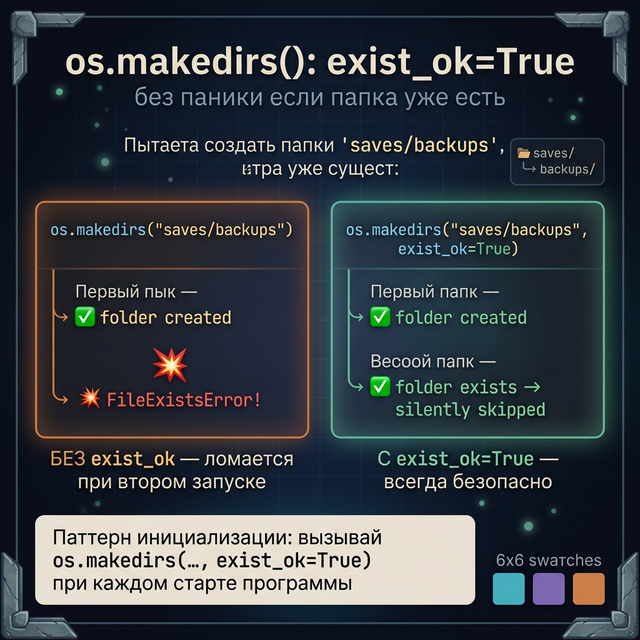

# Day 5: os.path — навигация по файловой системе

> **Новые концепции сегодня:** `os.path.exists()`, `os.path.join()`, `os.listdir()`, `os.makedirs()`
>
> **Время:** ~35 минут (теория + практика)

---

## Введение: проблема жёстких путей

В Day 4 мы писали `"save.json"` — это **относительный путь**: файл создаётся в той же папке, откуда запущена программа. Работает, но хрупко.

В Steam у каждой игры своя папка с сейвами: `C:\Users\Alex\Documents\My Games\DarkSouls\`. Путь **зависит от пользователя и операционной системы**. Нельзя зашить его в код.

Модуль `os` даёт инструменты для безопасной работы с путями на любой платформе.

---

## Часть 1. os.path.exists() — проверить существование

```python
import os   # ← скопируй эту строку — разберём import в Week 5

# Проверить что файл существует
if os.path.exists("save.json"):
    print("Сейв найден — загружаем")
else:
    print("Первый запуск — новая игра")
```

Работает и для файлов, и для папок:

```python
import os

# Файл
print(os.path.exists("game.py"))       # → True (если существует)
print(os.path.exists("missing.txt"))   # → False

# Папка
print(os.path.exists("saves"))         # → True если папка есть

# Уточнённые проверки
print(os.path.isfile("save.json"))     # → True только если это файл
print(os.path.isdir("saves"))          # → True только если это папка
```

---

## Часть 2. os.path.join() — собрать путь из частей

Проблема: на Windows путь выглядит как `saves\slot_1.json`, на Mac/Linux — `saves/slot_1.json`. Разный разделитель!

`os.path.join()` автоматически использует правильный разделитель для текущей системы:

```python
import os

# НЕ делай так — не работает на Windows:
path = "saves/" + "slot_1.json"

# Делай так — работает везде:
path = os.path.join("saves", "slot_1.json")
print(path)
# → saves/slot_1.json  (на Mac/Linux)
# → saves\slot_1.json  (на Windows)
```

```python
# Несколько уровней вложенности:
path = os.path.join("games", "dark_souls", "saves", "save.json")
print(path)
# → games/dark_souls/saves/save.json
```

Всегда используй `os.path.join()` для путей — никогда `"папка/" + "файл"`.


---

## Часть 3. os.listdir() — список файлов в папке

```python
import os

# Все файлы и папки в текущей директории
files = os.listdir(".")
print(files)
# → ['main.py', 'saves', 'config.json', ...]

# Все файлы в папке saves
if os.path.exists("saves"):
    save_files = os.listdir("saves")
    print(save_files)
    # → ['save_1.json', 'save_2.json', 'backup.json']
```

Фильтруй по расширению:

```python
import os

all_files = os.listdir("saves")
json_files = []
for f in all_files:
    if f.endswith(".json"):
        json_files.append(f)

print(json_files)
# → ['save_1.json', 'save_2.json']
```

---

## Часть 4. os.makedirs() — создать папку (и всю цепочку)

```python
import os

# Создать папку "saves" (ошибка если уже есть)
os.mkdir("saves")

# Создать папку и все промежуточные (exist_ok=True — не ругаться если есть)
os.makedirs("games/dark_souls/saves", exist_ok=True)
```

`exist_ok=True` — самый важный параметр: без него падает с ошибкой если папка уже существует. С ним — просто ничего не делает.



**Паттерн инициализации**: при первом запуске создаём структуру папок:

```python
import os

def init_save_dir():
    """Создаёт папку для сейвов если её нет."""
    os.makedirs("saves", exist_ok=True)
    print("Папка saves готова")

def save_game(data, slot):
    init_save_dir()
    path = os.path.join("saves", f"save_{slot}.json")
    # ... запись файла
```

---

## Часть 5. Полная система: папки + проверки + пути

Собираем всё в production-ready менеджер сейвов:

```python
import json
import os

SAVES_DIR = "saves"

def init():
    os.makedirs(SAVES_DIR, exist_ok=True)

def save_path(slot):
    return os.path.join(SAVES_DIR, f"save_{slot}.json")

def save(data, slot):
    init()
    with open(save_path(slot), "w", encoding="utf-8") as f:
        json.dump(data, f, ensure_ascii=False, indent=2)
    print(f"Слот {slot} сохранён")

def load(slot):
    path = save_path(slot)
    if not os.path.exists(path):
        return None
    with open(path, encoding="utf-8") as f:
        return json.load(f)

def list_saves():
    init()
    slots = []
    for i in range(1, 4):
        path = save_path(i)
        if os.path.exists(path):
            slots.append(i)
    return slots
```

---

## Задания

### Задание 1 — Инспектор папки

Напиши программу, которая принимает имя папки и выводит:
1. Существует ли папка
2. Список файлов `.json` в ней
3. Список файлов `.txt` в ней

<details>
<summary>Ответ</summary>

```python
import os

folder = input("Имя папки: ")

if not os.path.exists(folder):
    print("Папка не существует")
else:
    all_files = os.listdir(folder)

    json_files = []
    txt_files = []
    for f in all_files:
        if f.endswith(".json"):
            json_files.append(f)
        elif f.endswith(".txt"):
            txt_files.append(f)

    print(f"JSON файлов: {len(json_files)}")
    for f in json_files:
        print(f"  {f}")

    print(f"TXT файлов: {len(txt_files)}")
    for f in txt_files:
        print(f"  {f}")
```

</details>

---

### Задание 2 — Сканер сейвов

Папка `saves/` содержит файлы `save_1.json`, `save_2.json` и т.д. Напиши функцию `scan_saves(saves_dir)`, которая:
- Находит все `.json` файлы в папке
- Загружает каждый
- Выводит: имя слота, имя персонажа, уровень

```
Сейвы в папке 'saves':
  save_1.json → Artorias (Ур. 52)
  save_2.json → Alex     (Ур. 10)
```

<details>
<summary>Ответ</summary>

```python
import json
import os

def scan_saves(saves_dir):
    if not os.path.exists(saves_dir):
        print("Папка сейвов не найдена")
        return

    print(f"Сейвы в папке '{saves_dir}':")
    for filename in os.listdir(saves_dir):
        if filename.endswith(".json"):
            path = os.path.join(saves_dir, filename)
            with open(path, encoding="utf-8") as f:
                data = json.load(f)
            name = data.get("name", "неизвестно")
            level = data.get("level", "?")
            print(f"  {filename} → {name} (Ур. {level})")

scan_saves("saves")
```

</details>

---

### Задание 3 — Дебаг-квест: почему путь ломается

Код работает на Mac разработчика, но падает на Windows. Найди проблему.

```python
import json
import os

def save_game(data):
    path = "saves/" + "game_" + data["name"] + ".json"
    with open(path, "w", encoding="utf-8") as f:
        json.dump(data, f)

def init_dirs():
    if not os.path.exists("saves"):
        os.mkdir("saves")
    if not os.path.exists("saves/backups"):
        os.mkdir("saves/backups")
```

<details>
<summary>Подсказка</summary>
На Windows разделитель путей — `\`, на Unix — `/`. Жёсткий слэш в строке ломается.
</details>

<details>
<summary>Ответ</summary>

```python
import json
import os

def save_game(data):
    # Баг: "saves/" + ... — слэш зашит в код, падает на Windows
    path = os.path.join("saves", "game_" + data["name"] + ".json")
    with open(path, "w", encoding="utf-8") as f:
        json.dump(data, f, ensure_ascii=False)

def init_dirs():
    # Баг: если "saves" уже есть — os.mkdir упадёт с FileExistsError
    # Баг: "saves/backups" — жёсткий путь
    os.makedirs(os.path.join("saves", "backups"), exist_ok=True)
```

</details>

---

### Задание 4 — Мини-проект: файловый менеджер сейвов

Напиши утилиту командной строки для управления сейвами RPG.

**Команды:**
- `список` — показать все слоты (1-5) с именем персонажа и уровнем
- `создать <слот>` — создать новый сейв в слоте (спросить имя)
- `удалить <слот>` — удалить сейв (`os.remove(path)`)
- `копировать <откуда> <куда>` — скопировать сейв в другой слот
- `выход`

Все файлы хранятся в папке `saves/`, пути строить через `os.path.join()`.

<details>
<summary>Подсказка — удаление и копирование</summary>

```python
import os

# Удалить файл
os.remove(path)

# Содержимое файла скопировать:
with open(src_path, encoding="utf-8") as f:
    data = json.load(f)
with open(dst_path, "w", encoding="utf-8") as f:
    json.dump(data, f, ensure_ascii=False, indent=2)
```

</details>

---

<quiz>
[
  {
    "question": "Почему нужно использовать os.path.join() вместо 'папка/' + 'файл'?",
    "options": [
      "os.path.join() работает быстрее",
      "Разделитель путей разный на Windows (\\) и Unix (/). os.path.join() выбирает правильный автоматически",
      "Конкатенация строк не работает с путями",
      "os.path.join() проверяет что файл существует"
    ],
    "answer": 1,
    "explanation": "На Windows пути выглядят как saves\\save.json, на Mac/Linux — saves/save.json. os.path.join() автоматически использует правильный разделитель для текущей ОС."
  },
  {
    "question": "Зачем нужен exist_ok=True в os.makedirs()?",
    "options": [
      "Чтобы создать только последнюю папку в цепочке",
      "Чтобы не падать с ошибкой если папка уже существует",
      "Чтобы создать файл вместе с папкой",
      "Для рекурсивного создания вложенных папок"
    ],
    "answer": 1,
    "explanation": "Без exist_ok=True функция бросает FileExistsError если папка уже есть. С exist_ok=True — просто ничего не делает. Удобно для инициализации при каждом запуске."
  },
  {
    "question": "Чем os.listdir() отличается от os.path.exists()?",
    "options": [
      "listdir() проверяет файл, exists() проверяет папку",
      "listdir() возвращает список файлов в папке, exists() проверяет существование пути",
      "Нет разницы — оба работают одинаково",
      "exists() быстрее для больших папок"
    ],
    "answer": 1,
    "explanation": "os.listdir(path) возвращает список имён файлов и папок внутри директории. os.path.exists(path) просто проверяет — существует ли указанный путь (файл или папка)."
  }
]
</quiz>

---


← [Day 4 — Система сейвов](day_4.md) | [Day 6 — Практика →](day_6.md)
