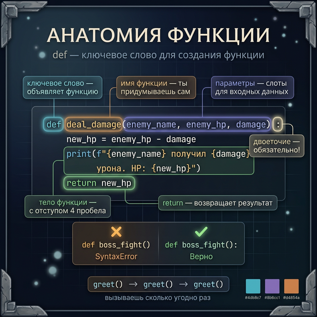
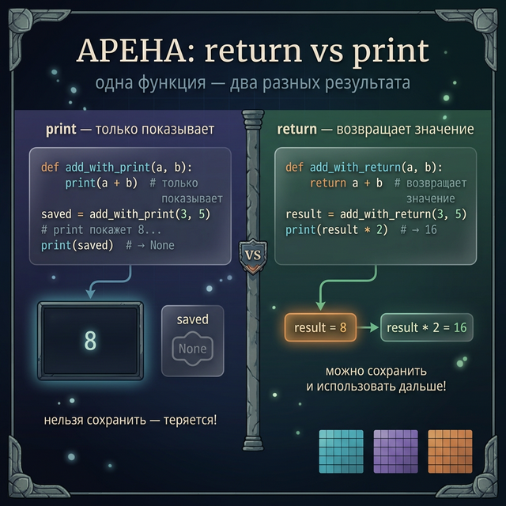
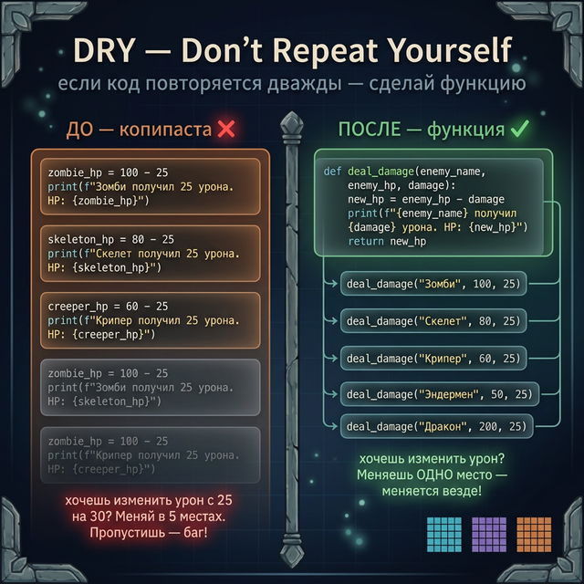
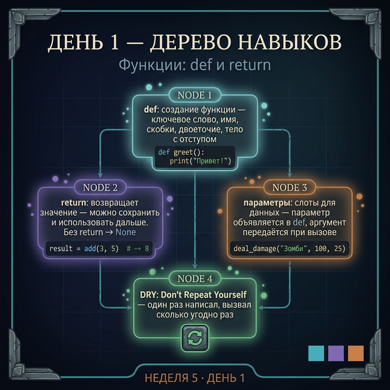

# День 1 — Функции: def и return

## Введение: проблема копипасты

Представь: ты пишешь игру. У тебя пять врагов — зомби, скелет, крипер, эндермен, дракон. Каждому нужно нанести урон и вывести результат.

Вот что происходит без функций:

```python
# БЕЗ функции — пишем одно и то же 5 раз
zombie_hp = 100 - 25
print(f"Зомби получил 25 урона. HP: {zombie_hp}")
# → Зомби получил 25 урона. HP: 75

skeleton_hp = 80 - 25
print(f"Скелет получил 25 урона. HP: {skeleton_hp}")
# → Скелет получил 25 урона. HP: 55

creeper_hp = 60 - 25
print(f"Крипер получил 25 урона. HP: {creeper_hp}")
# → Крипер получил 25 урона. HP: 35

# ... и ещё два раза то же самое
```

Представь, что ты хочешь изменить урон с 25 на 30. Нужно найти и поменять каждую строку. Пропустишь одну — получишь баг.

Программисты это называют **копипаста** — и это плохо.

---

**Аналогия: функция — это рецепт крафта в Minecraft.**

В Minecraft ты не пишешь заново "положи 8 досок по кругу" каждый раз, когда хочешь сундук. Ты один раз знаешь рецепт — и просто крафтишь столько раз, сколько нужно.

Функция — это тот же рецепт. Написал один раз → вызываешь сколько угодно.

---

## Часть 1: def — как объявить функцию

Чтобы создать функцию, используй ключевое слово `def`:

```python
# Синтаксис: def имя_функции():
#                 тело функции (с отступом)

def greet():
    print("Добро пожаловать в данж!")

# Функция определена, но ещё не запущена
# Чтобы запустить — вызови её:
greet()   # → Добро пожаловать в данж!
greet()   # → Добро пожаловать в данж! (снова)
greet()   # → Добро пожаловать в данж! (и ещё раз)
```

Правила синтаксиса:
- `def` — ключевое слово (обязательно)
- `greet` — имя функции (ты придумываешь сам)
- `()` — скобки (обязательны, даже если пусты)
- `:` — двоеточие в конце строки с `def`
- Тело функции — с отступом 4 пробела

Если тело функции пока пустое — используй `pass`:

```python
# pass — заглушка, пока функция не написана
def boss_fight():
    pass   # напишу потом

# Функция существует, но ничего не делает
boss_fight()   # запускается без ошибок
```



---

## Часть 2: return — возврат значения

Функция может **возвращать** результат своей работы. Для этого используется `return`.

Важно понять разницу между `print` и `return`:

```python
def add_with_return(a, b):
    return a + b    # возвращает значение — можно сохранить

def add_with_print(a, b):
    print(a + b)    # только показывает — нельзя сохранить

# С return — результат можно использовать дальше
result = add_with_return(3, 5)   # result = 8
print(result * 2)                # → 16

# С print — результат теряется
saved = add_with_print(3, 5)    # print покажет 8...
print(saved)                    # → None (ничего не вернулось!)
```

`None` — специальное значение Python. Означает "ничего". Функция без `return` всегда возвращает `None`.

```python
def just_prints():
    print("Привет!")   # функция что-то делает...

result = just_prints()   # → Привет! (print сработал)
print(result)            # → None (функция не вернула значение)
```

После `return` функция немедленно заканчивается:

```python
def check_hp(hp):
    if hp <= 0:
        return "Мёртв"   # функция заканчивается здесь
    return "Жив"         # выполняется только если hp > 0

print(check_hp(0))    # → Мёртв
print(check_hp(50))   # → Жив
```



---

## Часть 3: Параметры и аргументы

Функция может принимать данные снаружи. Для этого объявляются **параметры** в скобках.

**Аналогия:** параметр — это слот в инвентаре. Аргумент — конкретный предмет, который ты туда кладёшь.

```python
# name, hp, damage — это ПАРАМЕТРЫ (слоты)
def deal_damage(enemy_name, enemy_hp, damage):
    new_hp = enemy_hp - damage
    print(f"{enemy_name} получил {damage} урона. HP: {new_hp}")
    return new_hp

# "Зомби", 100, 25 — это АРГУМЕНТЫ (конкретные значения)
zombie_hp = deal_damage("Зомби", 100, 25)
# → Зомби получил 25 урона. HP: 75
```

Параметры — это локальные переменные внутри функции. Снаружи они не существуют.

---

## Часть 4: DRY — Don't Repeat Yourself

**DRY** (Не Повторяй Себя) — главный принцип программирования. Если один и тот же код встречается дважды — он должен стать функцией.

Вернёмся к задаче с врагами. Вот как выглядит **правильный** вариант:

```python
# ХОРОШО — функция один раз, вызовы много раз
def deal_damage(enemy_name, enemy_hp, damage):
    new_hp = enemy_hp - damage
    print(f"{enemy_name} получил {damage} урона. HP: {new_hp}")
    return new_hp

zombie_hp = deal_damage("Зомби", 100, 25)
# → Зомби получил 25 урона. HP: 75

skeleton_hp = deal_damage("Скелет", 80, 25)
# → Скелет получил 25 урона. HP: 55

creeper_hp = deal_damage("Крипер", 60, 25)
# → Крипер получил 25 урона. HP: 35
```

Теперь хочешь изменить урон? Меняешь одно место — изменится везде.



---

## Задания

### Задание 1 — Первая функция

Напиши функцию `announce_battle()` без параметров, которая выводит:
```
=== Начало битвы ===
Приготовься к бою!
```

Вызови её три раза.

---

### Задание 2 — return vs print

Напиши функцию `calculate_damage(base_damage, multiplier)`, которая **возвращает** результат `base_damage * multiplier`.

Затем сохрани результат в переменную и используй его в следующем вычислении:
```python
crit_damage = calculate_damage(25, 2)
total = crit_damage + 10    # добавили бонусный урон
print(total)                # → ?
```

---

### Задание 3 — Параметры

Напиши функцию `show_enemy_card(name, hp, level)`, которая выводит:
```
----- Враг -----
Имя: Зомби
HP: 100
Уровень: 3
----------------
```

Вызови функцию для трёх разных врагов.

---

### Задание 4 — Мини-проект: RPG бой

Напиши три функции для простого RPG боя:

1. `is_alive(hp)` — возвращает `True` если `hp > 0`, иначе `False`
2. `attack(attacker_name, target_name, target_hp, damage)` — уменьшает HP цели, выводит сообщение, возвращает новое HP
3. `show_battle_result(hero_hp, enemy_hp)` — выводит, кто победил (у кого HP > 0)

Проведи бой:
```python
hero_hp = 100
goblin_hp = 40

goblin_hp = attack("Герой", "Гоблин", goblin_hp, 25)
goblin_hp = attack("Герой", "Гоблин", goblin_hp, 25)
show_battle_result(hero_hp, goblin_hp)
```

---

<quiz>
[
  {
    "question": "Что выведет этот код?\n\n```python\ndef double(x):\n    return x * 2\n\nresult = double(5)\nprint(result)\n```",
    "options": ["5", "10", "None", "double(5)"],
    "correct": 1,
    "explanation": "Функция double возвращает x * 2, то есть 5 * 2 = 10. Это значение сохраняется в result и выводится."
  },
  {
    "question": "Что такое параметр функции?",
    "options": [
      "Конкретное значение, которое передаётся при вызове",
      "Имя переменной в объявлении функции (слот для данных)",
      "Результат, который функция возвращает",
      "Отступ внутри функции"
    ],
    "correct": 1,
    "explanation": "Параметр — это «слот» в объявлении функции (def f(параметр)). Аргумент — это конкретное значение, которое ты передаёшь при вызове (f(аргумент))."
  },
  {
    "question": "Функция без return возвращает...",
    "options": ["0", "пустую строку \"\"", "None", "ошибку"],
    "correct": 2,
    "explanation": "Любая функция без явного return (или с return без значения) автоматически возвращает None — специальное значение «ничего»."
  }
]
</quiz>

---



← [День 4, Неделя 4](/week_4/day_7) | [День 2 →](/week_5/day_2)
