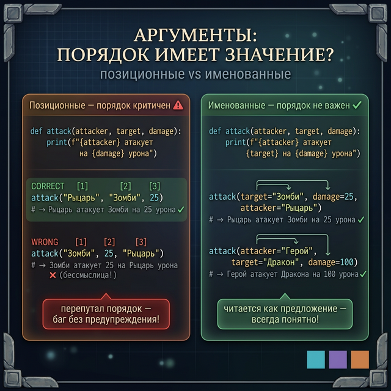
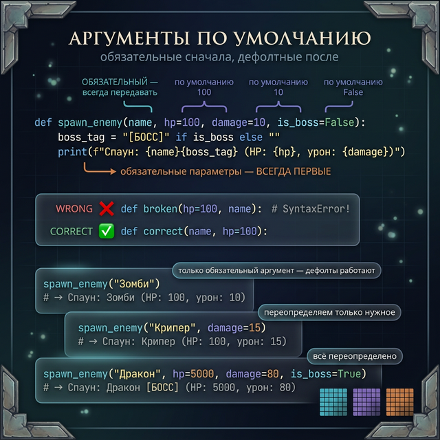
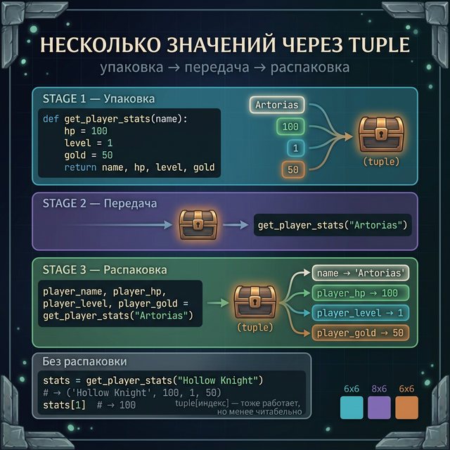
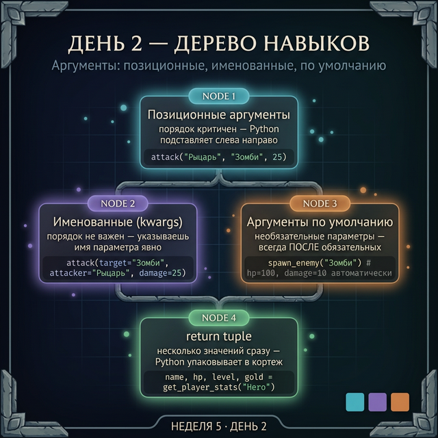

# День 2 — Аргументы: позиционные, именованные, по умолчанию

## Введение: проблема читаемости

Ты уже умеешь создавать функции и передавать аргументы. Но что будет, если аргументов много?

```python
# Что означают эти числа? Непонятно!
create_character("Artorias", 1, 100, 25, True, False, 3)
```

Посмотри на эту строку. Что такое `1`? Что такое `25`? Что такое `True`? Без заглядывания в функцию — загадка.

В Minecraft рецепт крафта визуально понятен — ты видишь, что куда положить. В функции Python нас спасают **именованные аргументы**.

---

## Часть 1: Позиционные аргументы — порядок критичен

Позиционные аргументы передаются просто по порядку. Python сопоставляет их с параметрами слева направо.

```python
def attack(attacker, target, damage):
    print(f"{attacker} атакует {target} на {damage} урона")

attack("Рыцарь", "Зомби", 25)
# → Рыцарь атакует Зомби на 25 урона

attack("Зомби", 25, "Рыцарь")
# → Зомби атакует 25 на Рыцарь урона   (НЕВЕРНО!)
```

Перепутал порядок — получил бессмыслицу. Python не предупредит: он просто подставит `25` на место `target`, и дальше как повезёт.

Чем больше аргументов — тем выше риск ошибиться. Для трёх аргументов ещё терпимо, для семи — уже катастрофа.



---

## Часть 2: Именованные аргументы — порядок не важен

Именованные аргументы (их ещё называют keyword arguments или kwargs) позволяют указать имя параметра явно:

```python
def attack(attacker, target, damage):
    print(f"{attacker} атакует {target} на {damage} урона")

# Именованные — порядок не важен
attack(target="Зомби", damage=25, attacker="Рыцарь")
# → Рыцарь атакует Зомби на 25 урона

# Читается как предложение — сразу понятно что есть что
attack(attacker="Герой", target="Дракон", damage=100)
# → Герой атакует Дракона на 100 урона
```

Можно смешивать: сначала позиционные, потом именованные. Позиционные всегда идут первыми:

```python
# attacker — позиционный, остальные — именованные
attack("Рыцарь", target="Скелет", damage=30)
# → Рыцарь атакует Скелета на 30 урона
```

---

## Часть 3: Аргументы по умолчанию

Иногда один из параметров почти всегда принимает одно и то же значение. Можно задать **значение по умолчанию** — тогда передавать его необязательно.

```python
# hp=100, damage=10, is_boss=False — значения по умолчанию
def spawn_enemy(name, hp=100, damage=10, is_boss=False):
    boss_tag = " [БОСС]" if is_boss else ""
    print(f"Спаун: {name}{boss_tag} (HP: {hp}, урон: {damage})")

spawn_enemy("Зомби")
# → Спаун: Зомби (HP: 100, урон: 10)

spawn_enemy("Крипер", damage=15)
# → Спаун: Крипер (HP: 100, урон: 15)

spawn_enemy("Дракон", hp=5000, damage=80, is_boss=True)
# → Спаун: Дракон [БОСС] (HP: 5000, урон: 80)
```

Правило: параметры с дефолтами всегда стоят **после** параметров без дефолтов.

```python
# НЕВЕРНО — Python не поймёт, где что
def broken(hp=100, name):   # SyntaxError!
    pass

# ВЕРНО — сначала обязательные, потом дефолтные
def correct(name, hp=100):
    pass
```

> **Осторожно:** никогда не используй изменяемый объект (список, словарь) как дефолтный аргумент. Это классическая ловушка Python — поговорим о ней в продвинутом курсе.



---

## Часть 4: return нескольких значений

Что если функция должна вернуть не одно значение, а несколько? Например, имя игрока, его HP и уровень?

Python позволяет вернуть несколько значений сразу — они автоматически упаковываются в **кортеж** (tuple):

```python
def get_player_stats(name):
    hp = 100
    level = 1
    gold = 50
    return name, hp, level, gold   # возвращает кортеж из 4 значений

# Получаем все значения сразу (распаковка кортежа)
player_name, player_hp, player_level, player_gold = get_player_stats("Artorias")

print(player_name)   # → Artorias
print(player_hp)     # → 100
print(player_level)  # → 1
print(player_gold)   # → 50
```

Если нужно просто получить кортеж целиком:

```python
stats = get_player_stats("Hollow Knight")
print(stats)         # → ('Hollow Knight', 100, 1, 50)
print(stats[1])      # → 100  (второй элемент кортежа)
```

Практический пример — функция, которая вычисляет и урон, и остаток HP:

```python
def calculate_hit(attacker_name, target_hp, damage):
    actual_damage = min(damage, target_hp)   # нельзя нанести больше чем есть HP
    remaining_hp = target_hp - actual_damage
    return actual_damage, remaining_hp       # возвращаем оба значения

dealt, left = calculate_hit("Гоблин", 30, 50)
print(f"Нанесено: {dealt}, осталось HP: {left}")
# → Нанесено: 30, осталось HP: 0
```



---

## Задания

### Задание 1 — Найди ошибку

Этот код содержит ошибку с порядком аргументов. Найди и исправь:

```python
def describe_weapon(name, damage, durability):
    print(f"{name}: урон {damage}, прочность {durability}")

describe_weapon(50, "Меч", 100)
```

---

### Задание 2 — Именованные аргументы

Напиши функцию `log_event(event_type, player_name, location, details="нет подробностей")`. Вызови её тремя способами:
1. Все аргументы позиционно
2. Только `event_type` позиционно, остальные именованно
3. С использованием дефолтного значения для `details`

---

### Задание 3 — Дефолтные аргументы

Напиши функцию `create_potion(effect, power=10, duration=30, is_cursed=False)`. Она должна возвращать строку-описание зелья:

```
Зелье [эффект] (сила: [power], длит.: [duration]с) [ПРОКЛЯТО]
```

`[ПРОКЛЯТО]` добавляется только если `is_cursed=True`.

Вызови функцию для:
- Простого зелья лечения (только effect)
- Усиленного зелья скорости (power=50, duration=60)
- Проклятого зелья силы

---

### Задание 4 — Мини-проект: create_character

Напиши функцию `create_character` со следующими параметрами:
- `name` — имя (обязательный)
- `char_class` — класс ("Воин", по умолчанию)
- `hp` — здоровье (100, по умолчанию)
- `attack_power` — сила атаки (15, по умолчанию)

Функция должна **возвращать** кортеж из всех четырёх значений.

Затем напиши функцию `show_character_card(name, char_class, hp, attack_power)`, которая красиво выводит информацию о персонаже.

Используй их вместе:

```python
name, cls, hp, atk = create_character("Siegward", char_class="Рыцарь", hp=200)
show_character_card(name, cls, hp, atk)
```

---

<quiz>
[
  {
    "question": "Что выведет этот код?\n\n```python\ndef info(name, level, hp):\n    print(f\"{name} Ур.{level} HP:{hp}\")\n\ninfo(level=5, name=\"Герой\", hp=150)\n```",
    "options": [
      "Ошибка — нельзя нарушать порядок",
      "Герой Ур.5 HP:150",
      "5 Ур.Герой HP:150",
      "None"
    ],
    "correct": 1,
    "explanation": "Именованные аргументы можно передавать в любом порядке. Python сам сопоставит каждый аргумент с нужным параметром по имени."
  },
  {
    "question": "Какой из вариантов объявления функции правильный?",
    "options": [
      "def f(hp=100, name):",
      "def f(name, hp=100):",
      "def f(=100 hp, name):",
      "def f(name hp=100):"
    ],
    "correct": 1,
    "explanation": "Параметры с дефолтными значениями должны стоять ПОСЛЕ параметров без дефолтов. «def f(hp=100, name)» — SyntaxError, потому что обязательный name стоит после дефолтного hp."
  },
  {
    "question": "Что находится в переменной stats после этого кода?\n\n```python\ndef get_stats():\n    return \"Герой\", 100, 5\n\nstats = get_stats()\n```",
    "options": [
      "\"Герой\"",
      "[\"Герой\", 100, 5]",
      "(\"Герой\", 100, 5)",
      "None"
    ],
    "correct": 2,
    "explanation": "Когда функция возвращает несколько значений через запятую, они автоматически упаковываются в кортеж (tuple). Кортеж отличается от списка тем, что его нельзя изменить."
  }
]
</quiz>

---



← [День 1](/week_5/day_1) | [День 3 →](/week_5/day_3)
