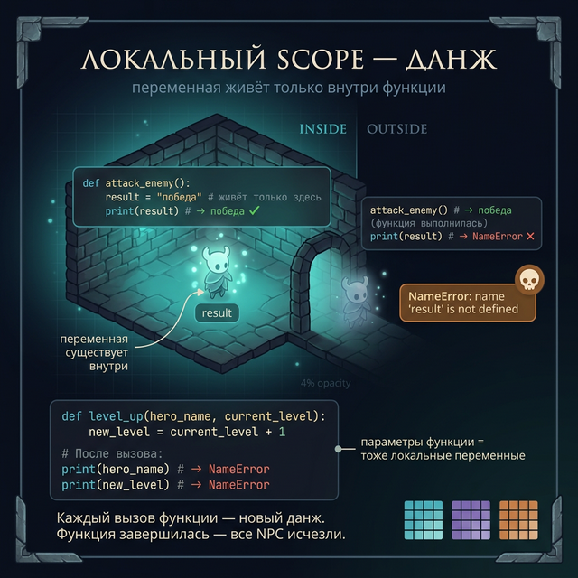
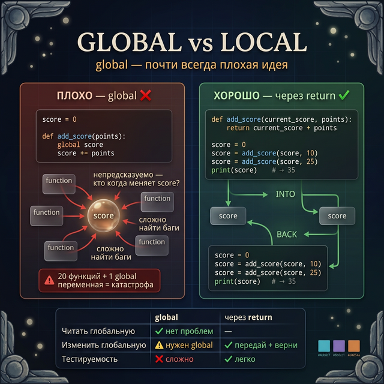
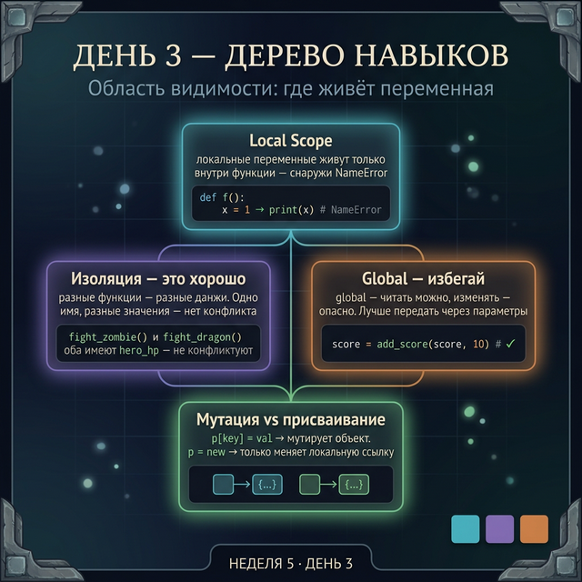

# День 3 — Область видимости: где живёт переменная

## Введение: данж с NPC

Представь данж в Dark Souls. Внутри — монстры, ловушки, сокровища. NPC в данже существуют **только пока ты внутри**. Выходишь из данжа — они исчезают. Снаружи ты не можешь позвать NPC из данжа: они там, а ты здесь.

Переменные внутри функции — точно такие же NPC.

Каждый вызов функции — это вход в новый данж. Внутри создаются переменные. Функция завершается — переменные исчезают. Следующий вызов — снова новый данж, новые переменные с нуля.

Это называется **область видимости** (scope).

---

## Часть 1: Local scope — локальные переменные

Переменная, созданная **внутри** функции — **локальная**. Она видна только изнутри функции. Снаружи — не существует.

```python
def attack_enemy():
    result = "победа"   # локальная — живёт только здесь
    print(result)       # → победа (внутри — всё ок)

attack_enemy()          # → победа

print(result)           # → NameError: name 'result' is not defined
```

Python говорит: "Я не знаю, что такое `result`" — потому что `result` существовала только внутри функции, а теперь функция закончилась.

Параметры функции тоже локальные:

```python
def level_up(hero_name, current_level):
    new_level = current_level + 1    # тоже локальная
    print(f"{hero_name} достиг уровня {new_level}")

level_up("Artorias", 5)   # → Artorias достиг уровня 6

print(hero_name)           # → NameError (параметр = локальная переменная)
print(new_level)           # → NameError
```



---

## Часть 2: Почему локальность — это хорошо

На первый взгляд кажется ограничением. Но на самом деле — это **защита**.

Разные функции могут использовать одно и то же имя переменной без конфликта. Они живут в разных "данжах":

```python
def fight_zombie():
    hero_hp = 100 - 15      # local для этой функции
    print(f"После зомби: {hero_hp}")
    return hero_hp

def fight_dragon():
    hero_hp = 100 - 80      # другой local, независимый!
    print(f"После дракона: {hero_hp}")
    return hero_hp

result_a = fight_zombie()    # → После зомби: 85
result_b = fight_dragon()    # → После дракона: 20
# Два разных hero_hp — не конфликтуют вообще
```

Это делает функции **независимыми**. Ты можешь написать функцию, не беспокоясь о том, какие переменные существуют снаружи.

---

## Часть 3: Global scope — глобальные переменные

Переменная, созданная **вне** всех функций — **глобальная**. Она видна везде в файле.

```python
GAME_VERSION = "1.0"    # глобальная (принято писать заглавными)
MAX_LEVEL = 50          # глобальная

def show_version():
    print(GAME_VERSION)   # читаем глобальную — это ок

show_version()    # → 1.0
print(MAX_LEVEL)  # → 50 (глобальная — видна везде)
```

Читать глобальную изнутри функции можно без объявлений. Но что если хочешь **изменить** глобальную переменную внутри функции?

```python
kill_count = 0   # глобальная

def register_kill_broken():
    kill_count += 1   # Python думает, что это ЛОКАЛЬНАЯ!
                      # UnboundLocalError — ошибка

register_kill_broken()
```

Проблема: когда Python видит `kill_count += 1` внутри функции, он ожидает локальную переменную. Но она не была создана — ошибка.

Чтобы изменить глобальную переменную изнутри функции, нужно объявить `global`:

```python
kill_count = 0

def register_kill():
    global kill_count      # объявляем: эта переменная — глобальная
    kill_count += 1        # теперь меняем глобальную

register_kill()
register_kill()
print(kill_count)    # → 2
```

**Предупреждение: `global` — почти всегда плохая идея.**

Представь: у тебя 20 функций, и несколько из них используют `global score`. Где и когда `score` меняется? Непонятно. Код становится непредсказуемым — баги появляются в неожиданных местах.

Правило: **избегай `global`**. Вместо этого — передавай значение через параметры и возвращай через `return`.

```python
# Плохо (global)
score = 0
def add_score(points):
    global score
    score += points

# Хорошо (через return)
def add_score(current_score, points):
    return current_score + points

score = 0
score = add_score(score, 10)
score = add_score(score, 25)
print(score)    # → 35
```



---

## Часть 4: Мутация vs переприсваивание

Вот где становится интересно. Есть исключение из правила "функция не меняет снаружи".

Словари и списки можно **изменить** внутри функции **без `global`**.

```python
# Мутация словаря — работает БЕЗ global
player = {"name": "Hero", "kills": 0}

def add_kill(p):         # p получает ССЫЛКУ на тот же словарь
    p["kills"] += 1      # меняем содержимое — это мутация

add_kill(player)
add_kill(player)
print(player["kills"])   # → 2 (изменился!)
```

Как это работает? Аналогия с коробкой:

- Переменная `player` — это **коробка** (ссылка). В коробке лежит адрес, где хранится словарь.
- Когда ты передаёшь `player` в функцию, создаётся **новая коробка** `p`. Но в ней тот же адрес — она указывает на тот же словарь.
- `p["kills"] += 1` — ты открываешь коробку, достаёшь словарь и меняешь его содержимое. Изменение видно везде, потому что словарь один.

А вот **переприсваивание** работает иначе:

```python
player = {"name": "Hero", "kills": 0}

def replace_player(p):
    p = {"name": "Ghost", "kills": 999}   # p теперь указывает на НОВЫЙ словарь
    # старый словарь не тронут

replace_player(player)
print(player["name"])   # → Hero (не изменился!)
```

Здесь `p = {...}` создаёт новую коробку, которая указывает на новый словарь. Старый словарь (в `player`) остался нетронутым.

Итого:
- `p["ключ"] = значение` — мутация, меняет исходный объект
- `p = новый_объект` — переприсваивание, исходный объект не трогается

![Мутация vs переприсваивание — аналогия с коробкой: p["kills"] += 1 меняет объект, p = {} меняет только ссылку](day_3/day_3_mutation_vs_reassign.png)

---

## Задания

### Задание 1 — Найди ошибку

Этот код упадёт с ошибкой. Найди причину и исправь — **без использования `global`**:

```python
base_damage = 25

def calculate_crit():
    crit = base_damage * 2   # попытка использовать глобальную
    return crit

def calculate_total():
    total = base_damage + crit   # что здесь не так?
    return total
```

---

### Задание 2 — Локальная изоляция

Напиши две функции:
- `simulate_floor_1()` — создаёт локальную переменную `enemy_count = 3`, возвращает её
- `simulate_floor_2()` — создаёт локальную переменную `enemy_count = 7`, возвращает её

Выведи результаты обеих. Убедись, что они не конфликтуют.

---

### Задание 3 — global с умом

Сейчас код использует `global` — это плохая практика. Перепиши функцию `restore_hp` без `global`, передавая текущий HP как параметр и возвращая новое значение:

```python
# Было (плохо):
hero_hp = 50
def restore_hp(amount):
    global hero_hp
    hero_hp = min(hero_hp + amount, 100)

# Стало (хорошо):
# напиши новую версию функции и вызов
```

---

### Задание 4 — Мини-проект: счётчик убийств через мутацию

Создай словарь статистики и функции для работы с ним — **без единого `global`**:

```python
stats = {
    "kills": 0,
    "deaths": 0,
    "gold": 0
}
```

Напиши функции:
- `register_kill(stats_dict, gold_reward)` — увеличивает `kills` на 1, добавляет `gold_reward` к `gold`
- `register_death(stats_dict)` — увеличивает `deaths` на 1, обнуляет `gold` (смерть — теряешь всё, как в Dark Souls)
- `show_stats(stats_dict)` — красиво выводит статистику

Проведи симуляцию:
```python
register_kill(stats, gold_reward=50)
register_kill(stats, gold_reward=100)
register_kill(stats, gold_reward=75)
register_death(stats)
register_kill(stats, gold_reward=30)
show_stats(stats)
```

Ожидаемый вывод:
```
=== Статистика игрока ===
Убийств: 4
Смертей: 1
Золото: 30
```

---

<quiz>
[
  {
    "question": "Что выведет этот код?\n\n```python\ndef set_name():\n    hero_name = \"Siegward\"\n\nset_name()\nprint(hero_name)\n```",
    "options": [
      "Siegward",
      "None",
      "NameError",
      "пустую строку"
    ],
    "correct": 2,
    "explanation": "hero_name — локальная переменная. Она существует только внутри set_name(). После завершения функции переменная исчезает. print(hero_name) снаружи вызывает NameError."
  },
  {
    "question": "В каком случае изменение переменной внутри функции затронет исходный объект СНАРУЖИ?",
    "options": [
      "Всегда — функции всегда меняют исходные данные",
      "Никогда — функции всегда работают с копией",
      "Когда мутируешь словарь или список (меняешь содержимое, не переменную)",
      "Только при использовании global"
    ],
    "correct": 2,
    "explanation": "Когда ты передаёшь список или словарь в функцию, передаётся ссылка на тот же объект. Мутация (p[\"key\"] = value) меняет сам объект — изменение видно снаружи. Переприсваивание (p = новый_объект) меняет только локальную ссылку — исходный объект не трогается."
  },
  {
    "question": "Почему опытные программисты избегают ключевого слова global?",
    "options": [
      "Оно работает медленнее",
      "Оно делает код непредсказуемым: непонятно, где и когда меняется переменная",
      "Оно запрещено в Python 3",
      "Оно работает только со строками"
    ],
    "correct": 1,
    "explanation": "global делает функцию зависимой от внешнего состояния. Если несколько функций меняют одну глобальную переменную, трудно отследить баги. Лучше передавать данные через параметры и возвращать через return."
  }
]
</quiz>

---



← [День 2](/week_5/day_2) | [День 4 →](/week_5/day_4)
