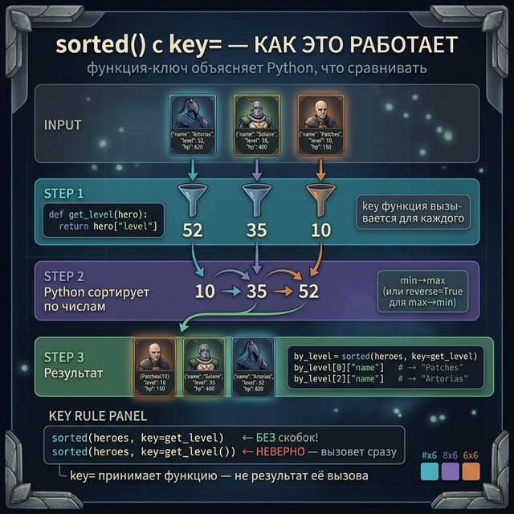
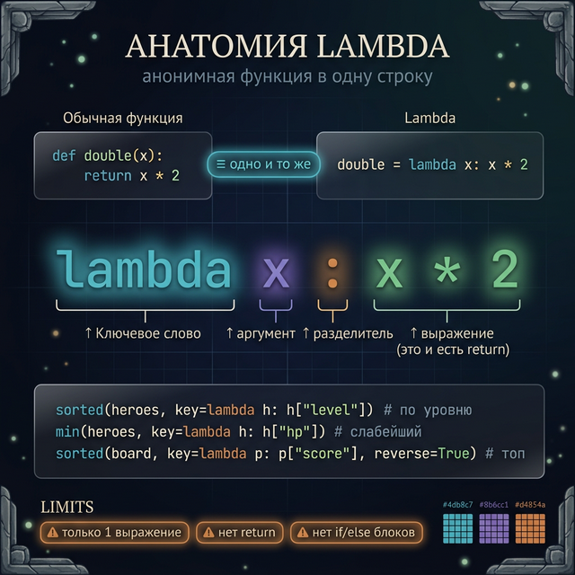
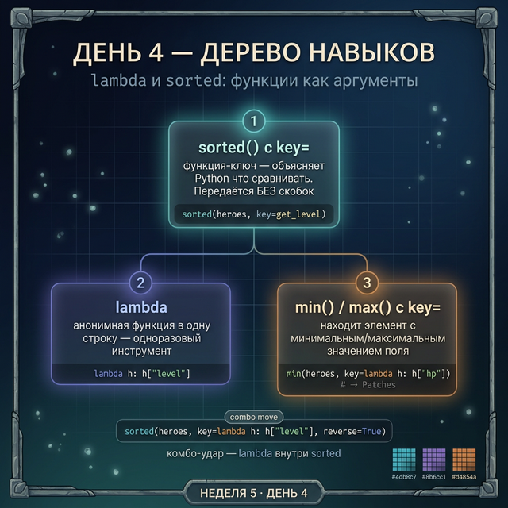

# День 4 — lambda и sorted: функции в одну строку

## Введение: проблема из Week 2

В Week 2 Day 4 мы сортировали список строк — это было просто:

```python
names = ["Zed", "Artorias", "Patches"]
names.sort()   # → ['Artorias', 'Patches', 'Zed'] — всё понятно
```

Но теперь у нас настоящая RPG. У каждого героя есть имя, уровень, очки здоровья. Как отсортировать **список словарей** по уровню? Обычный `sorted()` не знает, куда смотреть.

```python
heroes = [
    {"name": "Artorias", "level": 52, "hp": 620},
    {"name": "Solaire",  "level": 35, "hp": 400},
    {"name": "Patches",  "level": 10, "hp": 150},
]

sorted(heroes)   # → TypeError: '<' not supported between instances of 'dict' and 'dict'
```

Питон растерян: как сравнивать словари? По имени? По уровню? По HP? Нужно **объяснить ему правило**.

---

## Часть 1: Передаём функцию как аргумент

`sorted()` принимает необязательный параметр `key=`. В него передают функцию — она объясняет Питону, **по какому значению сравнивать** каждый элемент.

```python
heroes = [
    {"name": "Artorias", "level": 52, "hp": 620},
    {"name": "Solaire",  "level": 35, "hp": 400},
    {"name": "Patches",  "level": 10, "hp": 150},
]

# Сначала создаём обычную функцию-ключ
def get_level(hero):
    return hero["level"]   # достаём уровень из словаря

# Передаём функцию в sorted — БЕЗ скобок!
by_level = sorted(heroes, key=get_level)

print(by_level[0]["name"])   # → Patches (самый слабый, уровень 10)
print(by_level[2]["name"])   # → Artorias (самый сильный, уровень 52)
```

Обратил внимание? Мы пишем `key=get_level` — без скобок. Мы не вызываем функцию сами, мы **отдаём её** `sorted()`, а он сам будет вызывать для каждого элемента.

Это как в игре передать другу карту и сказать "разберись сам по этим правилам" — не объяснять каждый шаг.



---

## Часть 2: lambda — одноразовый инструмент

Писать отдельную функцию `get_level` ради одной строки — многовато кода. Для таких случаев в Питоне есть **lambda** — анонимная функция в одну строку.

```python
# Обычная функция
def double(x):
    return x * 2

# То же самое — lambda
double = lambda x: x * 2

print(double(5))    # → 10
print(double(21))   # → 42
```

Синтаксис lambda:

```
lambda аргумент: выражение
       ↑           ↑
   что берём   что возвращаем
```

Аналогия: **lambda — это одноразовая отвёртка**. Ты её сделал, один раз использовал — и выбросил. Не нужно давать ей имя и хранить в ящике (в модуле). Именованная функция — это полноценный инструмент со своим местом в наборе.

Важные ограничения lambda:
- Только **одно выражение** — нельзя написать несколько строк
- Нельзя использовать `if/else` как блоки (только тернарный if)
- Нет `return` — результат выражения и есть возвращаемое значение



---

## Часть 3: sorted() с lambda — реальные примеры

Теперь соединяем: используем lambda прямо внутри `sorted()`.

```python
heroes = [
    {"name": "Artorias", "level": 52, "hp": 620},
    {"name": "Solaire",  "level": 35, "hp": 400},
    {"name": "Patches",  "level": 10, "hp": 150},
]

# Сортировка по уровню (по возрастанию)
by_level = sorted(heroes, key=lambda h: h["level"])
print(by_level[0]["name"])   # → Patches

# Сортировка по имени (алфавит)
by_name = sorted(heroes, key=lambda h: h["name"])
print(by_name[0]["name"])    # → Artorias

# Сортировка по HP — по убыванию (reverse=True)
by_hp_desc = sorted(heroes, key=lambda h: h["hp"], reverse=True)
print(by_hp_desc[0]["name"])   # → Artorias (620 HP — первый)
print(by_hp_desc[2]["name"])   # → Patches (150 HP — последний)
```

`reverse=True` просто переворачивает порядок. Удобно когда нужен рейтинг от сильного к слабому.

Ещё пример — таблица лидеров с очками:

```python
leaderboard = [
    {"player": "DarkSoulsFan", "score": 4800, "deaths": 42},
    {"player": "GitGudKid",    "score": 7200, "deaths": 11},
    {"player": "CasualGamer",  "score": 2100, "deaths": 87},
]

# Топ по очкам
top = sorted(leaderboard, key=lambda p: p["score"], reverse=True)
for i, player in enumerate(top, start=1):
    print(f"{i}. {player['player']}: {player['score']} очков")
# → 1. GitGudKid: 7200 очков
# → 2. DarkSoulsFan: 4800 очков
# → 3. CasualGamer: 2100 очков
```

---

## Часть 4: min() и max() с key=lambda

`min()` и `max()` тоже принимают `key=`. Это удобно когда нужен не наименьший/наибольший элемент списка, а **элемент с наименьшим/наибольшим значением поля**.

```python
heroes = [
    {"name": "Artorias", "level": 52, "hp": 620},
    {"name": "Solaire",  "level": 35, "hp": 400},
    {"name": "Patches",  "level": 10, "hp": 150},
]

# Самый слабый герой (минимальный HP)
weakest = min(heroes, key=lambda h: h["hp"])
print(weakest["name"])    # → Patches
print(weakest["hp"])      # → 150

# Самый высокоуровневый
strongest = max(heroes, key=lambda h: h["level"])
print(strongest["name"])  # → Artorias
print(strongest["level"]) # → 52
```

В Dark Souls это был бы выбор первой цели для атаки — всегда бей слабейшего первым.

---

## Задания

### Задание 1 — Таблица рейтинга

Есть список игроков. Выведи топ-3 по очкам (от большего к меньшему).

```python
players = [
    {"name": "Hunter",   "score": 3400, "level": 12},
    {"name": "Mage",     "score": 5600, "level": 18},
    {"name": "Rogue",    "score": 1200, "level": 7},
    {"name": "Paladin",  "score": 4100, "level": 15},
    {"name": "Berserker","score": 6800, "level": 21},
]

# Задача: отсортировать по score (по убыванию) и вывести первые 3
```

<details>
<summary>Подсказка</summary>

Используй `sorted(..., key=lambda p: p["score"], reverse=True)` и срез `[:3]`.

</details>

<details>
<summary>Решение</summary>

```python
players = [
    {"name": "Hunter",   "score": 3400, "level": 12},
    {"name": "Mage",     "score": 5600, "level": 18},
    {"name": "Rogue",    "score": 1200, "level": 7},
    {"name": "Paladin",  "score": 4100, "level": 15},
    {"name": "Berserker","score": 6800, "level": 21},
]

top3 = sorted(players, key=lambda p: p["score"], reverse=True)[:3]
print("Топ-3 игроков:")
for i, p in enumerate(top3, start=1):
    print(f"{i}. {p['name']} — {p['score']} очков")
# → 1. Berserker — 6800 очков
# → 2. Mage — 5600 очков
# → 3. Paladin — 4100 очков
```

</details>

---

### Задание 2 — Найди аутсайдера

Используя тот же список `players`, найди игрока с **минимальным уровнем** и игрока с **максимальным уровнем**. Выведи оба имени.

<details>
<summary>Подсказка</summary>

`min(players, key=lambda p: p["level"])` вернёт словарь целиком — потом достань имя.

</details>

<details>
<summary>Решение</summary>

```python
noob = min(players, key=lambda p: p["level"])
veteran = max(players, key=lambda p: p["level"])

print(f"Новичок: {noob['name']} (уровень {noob['level']})")
print(f"Ветеран: {veteran['name']} (уровень {veteran['level']})")
# → Новичок: Rogue (уровень 7)
# → Ветеран: Berserker (уровень 21)
```

</details>

---

### Задание 3 — Сортировка по нескольким критериям

Есть инвентарь с предметами. Отсортируй сначала по типу (алфавит), затем внутри одного типа — по цене (по убыванию). Вывод: имя и цена.

```python
inventory = [
    {"name": "Меч рыцаря",   "type": "weapon", "price": 500},
    {"name": "Кинжал вора",  "type": "weapon", "price": 200},
    {"name": "Кожаная броня","type": "armor",  "price": 300},
    {"name": "Зелье HP",     "type": "potion", "price": 50},
    {"name": "Стальная броня","type": "armor", "price": 700},
    {"name": "Зелье маны",   "type": "potion", "price": 80},
]
```

Подсказка: `lambda item: (item["type"], -item["price"])` — кортеж сортируется сначала по первому элементу, потом по второму. Минус разворачивает цену без `reverse=True`.

<details>
<summary>Решение</summary>

```python
inventory = [
    {"name": "Меч рыцаря",    "type": "weapon", "price": 500},
    {"name": "Кинжал вора",   "type": "weapon", "price": 200},
    {"name": "Кожаная броня", "type": "armor",  "price": 300},
    {"name": "Зелье HP",      "type": "potion", "price": 50},
    {"name": "Стальная броня","type": "armor",  "price": 700},
    {"name": "Зелье маны",    "type": "potion", "price": 80},
]

sorted_inv = sorted(inventory, key=lambda item: (item["type"], -item["price"]))

for item in sorted_inv:
    print(f"{item['type']:8} | {item['name']:20} | {item['price']} монет")
# → armor    | Стальная броня       | 700 монет
# → armor    | Кожаная броня        | 300 монет
# → potion   | Зелье маны           | 80 монет
# → potion   | Зелье HP             | 50 монет
# → weapon   | Меч рыцаря           | 500 монет
# → weapon   | Кинжал вора          | 200 монет
```

</details>

---

### Задание 4 — Мини-проект: таблица рейтинга

Напиши программу-рейтинг для гильдии. У игроков есть имя, очки, количество смертей и число убийств.

Требования:
- Функция `show_leaderboard(players, sort_by, top_n=5)` — принимает список, ключ сортировки и количество строк
- Поддержи сортировку по `"score"` (по убыванию), `"deaths"` (по возрастанию — меньше смертей = лучше), `"kills"` (по убыванию)
- Внутри используй lambda

<details>
<summary>Подсказка</summary>

Если `sort_by == "deaths"`, то `reverse=False`. Для остальных — `reverse=True`. Используй условие внутри функции.

</details>

<details>
<summary>Решение</summary>

```python
guild = [
    {"name": "Artorias",  "score": 9200, "deaths": 5,  "kills": 312},
    {"name": "Solaire",   "score": 6700, "deaths": 22, "kills": 178},
    {"name": "Patches",   "score": 1100, "deaths": 91, "kills": 34},
    {"name": "Siegmeyer", "score": 4300, "deaths": 40, "kills": 95},
    {"name": "Ornstein",  "score": 8800, "deaths": 8,  "kills": 290},
    {"name": "Smough",    "score": 7500, "deaths": 15, "kills": 220},
]

def show_leaderboard(players, sort_by, top_n=5):
    reverse = sort_by != "deaths"   # смерти: меньше = лучше
    ranked = sorted(players, key=lambda p: p[sort_by], reverse=reverse)
    print(f"\n--- Топ по '{sort_by}' ---")
    for i, p in enumerate(ranked[:top_n], start=1):
        print(f"{i}. {p['name']:12} | score:{p['score']} | deaths:{p['deaths']} | kills:{p['kills']}")

show_leaderboard(guild, "score")
show_leaderboard(guild, "deaths")
show_leaderboard(guild, "kills", top_n=3)
```

</details>

---

## Проверь себя

<quiz>
[
  {
    "question": "Что делает параметр key= в функции sorted()?",
    "options": [
      "Задаёт имя переменной для результата",
      "Указывает функцию, которая извлекает значение для сравнения",
      "Включает сортировку по убыванию",
      "Задаёт начальный элемент"
    ],
    "answer": 1,
    "explanation": "key= принимает функцию. sorted() вызывает её для каждого элемента и сравнивает полученные значения."
  },
  {
    "question": "Что выведет этот код?\n\ndouble = lambda x: x * 2\nprint(double(7))",
    "options": [
      "lambda x: x * 2",
      "7",
      "14",
      "Ошибку — lambda нельзя присваивать"
    ],
    "answer": 2,
    "explanation": "lambda x: x * 2 — это функция, которая умножает аргумент на 2. double(7) = 7 * 2 = 14."
  },
  {
    "question": "Как найти игрока с максимальным количеством очков в списке словарей?",
    "options": [
      "max(players[\"score\"])",
      "max(players, key=lambda p: p[\"score\"])",
      "players.max(\"score\")",
      "sorted(players)[-1]"
    ],
    "answer": 1,
    "explanation": "max() с key= вернёт весь словарь с максимальным значением поля score. Без key= Питон не знает, как сравнивать словари."
  }
]
</quiz>

---



← [День 3 — Рекурсия](day_3.md) | [День 5 — import и модули →](day_5.md)
