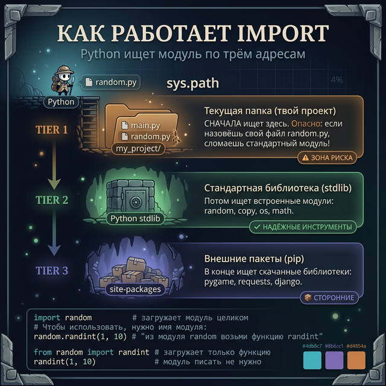
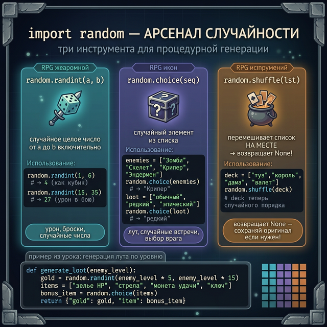
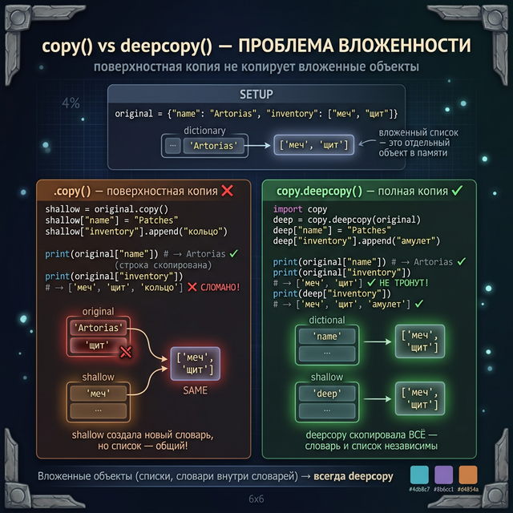
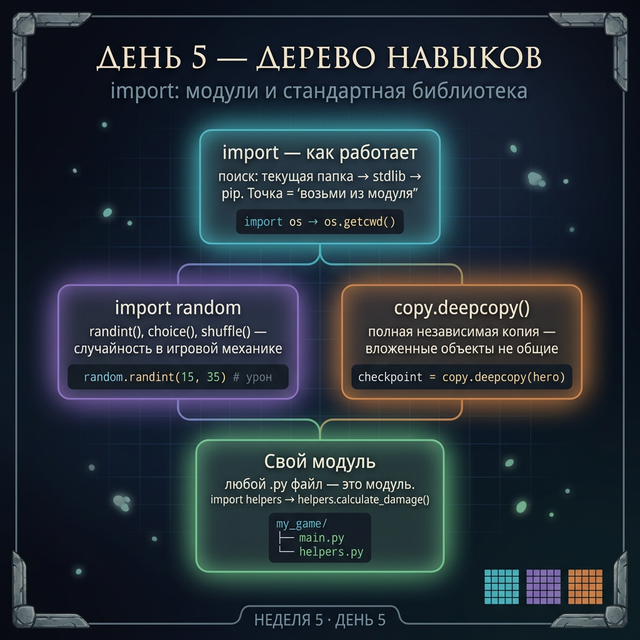

# День 5 — import: модули и стандартная библиотека

## Введение: "позже наступило"

Весь курс мы писали строки вроде:

```python
import json
import os
```

И каждый раз была сноска: *"что это такое — разберём позже"*. Это "позже" — сегодня.

В Week 3 мы копировали `import copy` и `import random`, не понимая механики. В Week 4 — `import json` и `import os`. Пора разобраться раз и навсегда.

**Модуль** — это обычный `.py`-файл с набором функций и переменных. Когда ты пишешь `import random` — Питон ищет файл `random.py`, загружает его и даёт тебе доступ ко всем функциям внутри.

---

## Часть 1: Как работает import

Когда Питон видит `import something`, он ищет `something.py` в нескольких местах по порядку:

1. **Текущая папка** — нет ли файла `something.py` рядом с твоим скриптом?
2. **Стандартная библиотека** — встроенные модули, которые идут вместе с Питоном (`random`, `os`, `json`, `copy`, `math`...)
3. **Установленные пакеты** — то, что ты поставил через `pip install`

```python
import os   # Питон нашёл os.py в стандартной библиотеке

# Теперь можно использовать функции через точку:
current_folder = os.getcwd()
print(current_folder)   # → /Users/murad/my_game  (твоя текущая папка)

files = os.listdir(".")
print(files)   # → ['main.py', 'heroes.json', 'helpers.py']
```

Точка после имени модуля — это "возьми это у модуля". `os.getcwd()` означает "функция `getcwd` из модуля `os`".



---

## Часть 2: import random — генерация случайностей

Закрываем обещание из Week 3! `random` — модуль для всего случайного. В играх это незаменимо: случайный лут, рандомные враги, критические удары.

### random.randint() — случайное целое число

```python
import random

# Случайное число от 1 до 6 (включительно — как кубик)
dice = random.randint(1, 6)
print(dice)   # → 4 (каждый раз разное)

# Случайный урон в бою
damage = random.randint(15, 35)
print(f"Нанесён урон: {damage}")   # → Нанесён урон: 27
```

### random.choice() — случайный элемент из списка

```python
import random

enemies = ["Зомби", "Скелет", "Крипер", "Эндермен"]
enemy = random.choice(enemies)
print(enemy)   # → Крипер (случайный из списка)

loot_types = ["обычный", "редкий", "эпический", "легендарный"]
drop = random.choice(loot_types)
print(f"Выпал {drop} лут!")   # → Выпал редкий лут!
```

### random.shuffle() — перемешать список

```python
import random

deck = ["туз", "король", "дама", "валет", "десятка"]
random.shuffle(deck)   # перемешивает список НА МЕСТЕ (возвращает None!)
print(deck)   # → ['дама', 'туз', 'десятка', 'валет', 'король']

# Внимание: shuffle изменяет оригинальный список
# Если нужно сохранить оригинал — сначала скопируй
```

### Применение в игре

```python
import random

def generate_loot(enemy_level):
    """Генерирует лут в зависимости от уровня врага"""
    gold = random.randint(enemy_level * 5, enemy_level * 15)
    items = ["зелье HP", "стрела", "монета удачи", "ключ"]
    bonus_item = random.choice(items)
    return {"gold": gold, "item": bonus_item}

loot = generate_loot(10)
print(f"Получено: {loot['gold']} золота и {loot['item']}")
# → Получено: 87 золота и зелье HP
```



---

## Часть 3: import copy — deepcopy раз и навсегда

Закрываем обещание из Week 3 Day 5! Тогда мы видели странный баг со словарями. Теперь разберём его полностью.

### Напоминание: проблема shallow copy

```python
# Поверхностная копия словаря (.copy())
original = {"name": "Artorias", "inventory": ["меч", "щит"]}
shallow = original.copy()   # создаём "копию"

shallow["name"] = "Patches"          # меняем строку — оригинал НЕ тронут
shallow["inventory"].append("кольцо")  # меняем список — оригинал СЛОМАН

print(original["name"])       # → Artorias  ✓ строка не тронута
print(original["inventory"])  # → ['меч', 'щит', 'кольцо']  ✗ список испорчен!
```

Почему так? `copy()` копирует словарь, но **вложенный список не копирует** — оба словаря (original и shallow) указывают на **один и тот же список** в памяти.

Представь: ты скопировал записную книжку, но страница с инвентарём — это не отдельная страница, а ссылка на оригинальную. Меняешь в копии — меняется в оригинале.

### deepcopy — полная независимая копия

```python
import copy   # встроенный модуль

original = {"name": "Artorias", "inventory": ["меч", "щит"]}

# deepcopy копирует ВСЁ — словарь и все вложенные объекты
deep = copy.deepcopy(original)

deep["name"] = "Patches"
deep["inventory"].append("амулет")

print(original["name"])       # → Artorias           ✓ не тронут
print(original["inventory"])  # → ['меч', 'щит']     ✓ не тронут!
print(deep["inventory"])      # → ['меч', 'щит', 'амулет']  ✓ только в копии
```

### Когда нужен deepcopy

- Когда у тебя словарь со списками, списками словарей или другими вложенными структурами
- Когда нужно создать "сохранение игры" — точную копию состояния, независимую от будущих изменений
- Когда делаешь "откат" к предыдущему состоянию

```python
import copy

def save_game(hero):
    """Создаёт полную независимую копию состояния героя"""
    return copy.deepcopy(hero)

hero = {"name": "Solaire", "hp": 400, "inventory": ["щит солнца"]}
checkpoint = save_game(hero)   # сохраняем

hero["hp"] = 0
hero["inventory"].append("пепел")  # герой умер

print(f"Текущий HP: {hero['hp']}")            # → 0
print(f"HP в чекпоинте: {checkpoint['hp']}")  # → 400  ✓ сохранение цело
```



---

## Часть 4: Создание своего модуля

Это самая важная идея сегодня: **модуль — это просто файл**. Ты можешь создать свой.

Представь структуру проекта:
```
my_game/
├── main.py       ← главный файл
└── helpers.py    ← наш модуль с вспомогательными функциями
```

### Файл helpers.py

```python
# helpers.py — наш собственный модуль

def calculate_damage(base_damage, level):
    """Урон = базовый + уровень * 2"""
    return base_damage + level * 2

def is_alive(hp):
    """Жив ли персонаж?"""
    return hp > 0

def describe_hero(hero):
    """Текстовое описание героя"""
    status = "жив" if is_alive(hero["hp"]) else "мёртв"
    return f"{hero['name']} (уровень {hero['level']}, HP: {hero['hp']}) — {status}"
```

### Файл main.py

```python
# main.py — импортируем наш модуль

import helpers   # ищет helpers.py в текущей папке

hero = {"name": "Solaire", "level": 35, "hp": 400}

damage = helpers.calculate_damage(10, hero["level"])
print(damage)   # → 80

print(helpers.describe_hero(hero))   # → Solaire (уровень 35, HP: 400) — жив
```

### Альтернатива: from ... import ...

Если не хочешь каждый раз писать `helpers.`, можно импортировать конкретные функции:

```python
from helpers import calculate_damage, is_alive

# Теперь можно без "helpers."
damage = calculate_damage(10, 35)   # → 80
alive = is_alive(400)               # → True
```

Или импортировать всё сразу (делай осторожно — могут быть конфликты имён):

```python
from helpers import *   # все функции из helpers

damage = calculate_damage(10, 35)
```

---

## Задания

### Задание 1 — Случайная встреча

Напиши функцию `random_encounter()`, которая возвращает случайного врага из списка. У каждого врага есть имя, hp, damage. Выведи информацию о встреченном враге.

```python
import random

enemy_templates = [
    {"name": "Зомби",    "hp": 60,  "damage": 8},
    {"name": "Скелет",   "hp": 40,  "damage": 12},
    {"name": "Крипер",   "hp": 30,  "damage": 25},
    {"name": "Эндермен", "hp": 80,  "damage": 15},
]
```

<details>
<summary>Подсказка</summary>

`random.choice(enemy_templates)` вернёт словарь. Но это не копия — лучше сделать `copy.deepcopy()`, чтобы случайно не изменить шаблон.

</details>

<details>
<summary>Решение</summary>

```python
import random
import copy

enemy_templates = [
    {"name": "Зомби",    "hp": 60,  "damage": 8},
    {"name": "Скелет",   "hp": 40,  "damage": 12},
    {"name": "Крипер",   "hp": 30,  "damage": 25},
    {"name": "Эндермен", "hp": 80,  "damage": 15},
]

def random_encounter():
    template = random.choice(enemy_templates)
    enemy = copy.deepcopy(template)   # независимая копия шаблона
    return enemy

enemy = random_encounter()
print(f"Встречен: {enemy['name']}")
print(f"HP: {enemy['hp']}, Урон: {enemy['damage']}")
# → Встречен: Скелет
# → HP: 40, Урон: 12
```

</details>

---

### Задание 2 — Генератор лута

Напиши функцию `generate_loot(floor)`, которая генерирует случайный лут для этажа подземелья. На более глубоких этажах — больше золота и лучше предметы.

Требования:
- Золото: `random.randint(floor * 10, floor * 30)`
- Предмет: из списка (с редкостью — чем глубже, тем чаще "редкий" и "эпический")

<details>
<summary>Подсказка</summary>

Для редкости можно сделать два разных списка предметов и выбирать список в зависимости от этажа. Если `floor >= 5` — из расширенного списка с редкими вещами.

</details>

<details>
<summary>Решение</summary>

```python
import random

def generate_loot(floor):
    gold = random.randint(floor * 10, floor * 30)

    common_items = ["Зелье HP", "Стрелы", "Хлеб", "Факел"]
    rare_items   = ["Меч+1", "Кольцо удачи", "Свиток телепорта", "Элексир"]

    if floor >= 5:
        item_pool = common_items + rare_items   # больше шанс редкого
    else:
        item_pool = common_items

    item = random.choice(item_pool)
    return {"gold": gold, "item": item, "floor": floor}

for f in [1, 3, 7]:
    loot = generate_loot(f)
    print(f"Этаж {loot['floor']}: {loot['gold']} золота, предмет: {loot['item']}")
# → Этаж 1: 24 золота, предмет: Факел
# → Этаж 3: 68 золота, предмет: Зелье HP
# → Этаж 7: 192 золота, предмет: Свиток телепорта
```

</details>

---

### Задание 3 — Свой модуль

Создай файл `game_utils.py` с тремя функциями:
- `roll_dice(sides=6)` — бросок кубика с `sides` гранями
- `is_critical(chance=0.15)` — True если выпало критическое попадание (шанс = chance)
- `clamp(value, min_val, max_val)` — ограничивает значение в диапазоне

Потом импортируй и протестируй каждую.

<details>
<summary>Подсказка</summary>

`random.random()` возвращает число от 0.0 до 1.0. Если оно меньше `chance` — критическое попадание.

</details>

<details>
<summary>Решение: game_utils.py</summary>

```python
# game_utils.py
import random

def roll_dice(sides=6):
    """Бросок кубика. По умолчанию d6."""
    return random.randint(1, sides)

def is_critical(chance=0.15):
    """True с вероятностью chance (от 0.0 до 1.0)"""
    return random.random() < chance

def clamp(value, min_val, max_val):
    """Ограничивает value в диапазоне [min_val, max_val]"""
    return max(min_val, min(value, max_val))
```

```python
# main.py
import game_utils

print(game_utils.roll_dice())      # → 4 (случайное от 1 до 6)
print(game_utils.roll_dice(20))    # → 17 (d20, как в D&D)
print(game_utils.is_critical())    # → False (или True с 15% шансом)
print(game_utils.clamp(150, 0, 100))  # → 100 (не даёт HP выйти за 100)
print(game_utils.clamp(-5, 0, 100))   # → 0   (не даёт HP уйти в минус)
```

</details>

---

### Задание 4 — Мини-проект: Генератор персонажей

Напиши генератор случайных RPG-персонажей. Каждый персонаж уникален: имя, класс, характеристики.

Требования:
- Имена: список из 8+ имён
- Классы: воин, маг, лучник, вор — у каждого свои базовые характеристики
- Случайный разброс ±20% к характеристикам
- Создай 3 случайных персонажа и выведи их, отсортированных по силе

<details>
<summary>Решение</summary>

```python
import random
import copy

names = ["Artorias", "Solaire", "Patches", "Siegmeyer",
         "Ornstein", "Ciaran", "Gough", "Velka"]

class_templates = {
    "Воин":   {"hp": 120, "damage": 15, "defense": 10},
    "Маг":    {"hp": 80,  "damage": 28, "defense": 4},
    "Лучник": {"hp": 95,  "damage": 20, "defense": 6},
    "Вор":    {"hp": 100, "damage": 22, "defense": 5},
}

def generate_character():
    name = random.choice(names)
    char_class = random.choice(list(class_templates.keys()))
    base = copy.deepcopy(class_templates[char_class])

    # Случайный разброс ±20%
    for stat in base:
        variation = random.uniform(0.8, 1.2)
        base[stat] = round(base[stat] * variation)

    return {"name": name, "class": char_class, **base}

party = [generate_character() for _ in range(3)]

# Сортировка по суммарной силе (hp + damage * 3)
def power(hero):
    return hero["hp"] + hero["damage"] * 3

party.sort(key=power, reverse=True)

print("Твоя группа (по силе):")
for i, hero in enumerate(party, 1):
    p = power(hero)
    print(f"{i}. {hero['name']:12} [{hero['class']:8}] "
          f"HP:{hero['hp']:4} | ATK:{hero['damage']:3} | "
          f"DEF:{hero['defense']:3} | Сила:{p}")
```

</details>

---

## Проверь себя

<quiz>
[
  {
    "question": "В каком порядке Питон ищет модуль при import?",
    "options": [
      "pip-пакеты → стандартная библиотека → текущая папка",
      "стандартная библиотека → текущая папка → pip-пакеты",
      "текущая папка → стандартная библиотека → pip-пакеты",
      "В случайном порядке"
    ],
    "answer": 2,
    "explanation": "Питон сначала смотрит в текущую папку (вдруг ты создал свой модуль с таким именем), потом в стандартную библиотеку, потом в установленные пакеты."
  },
  {
    "question": "Зачем нужен copy.deepcopy() если у словаря уже есть метод .copy()?",
    "options": [
      "deepcopy работает быстрее",
      ".copy() создаёт независимую копию только верхнего уровня, вложенные объекты всё равно общие",
      "deepcopy умеет копировать файлы на диске",
      "Разницы нет — они делают одно и то же"
    ],
    "answer": 1,
    "explanation": ".copy() — поверхностная копия: словарь новый, но вложенные списки и словари по-прежнему общие. Изменение вложенного объекта в копии испортит оригинал. deepcopy копирует всё рекурсивно."
  },
  {
    "question": "Что делает random.shuffle(my_list)?",
    "options": [
      "Возвращает новый перемешанный список, оригинал не трогает",
      "Перемешивает список на месте и возвращает None",
      "Возвращает случайный элемент из списка",
      "Сортирует список в случайном порядке и возвращает его"
    ],
    "answer": 1,
    "explanation": "shuffle изменяет список IN-PLACE (на месте) и возвращает None. Если написать new_list = random.shuffle(my_list) — в new_list будет None. Если нужна новая перемешанная версия — сначала скопируй список."
  }
]
</quiz>

---



← [День 4 — lambda и sorted](day_4.md) | [День 6 — Практика: Рогалик →](day_6.md)
