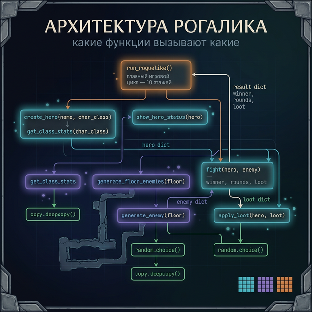
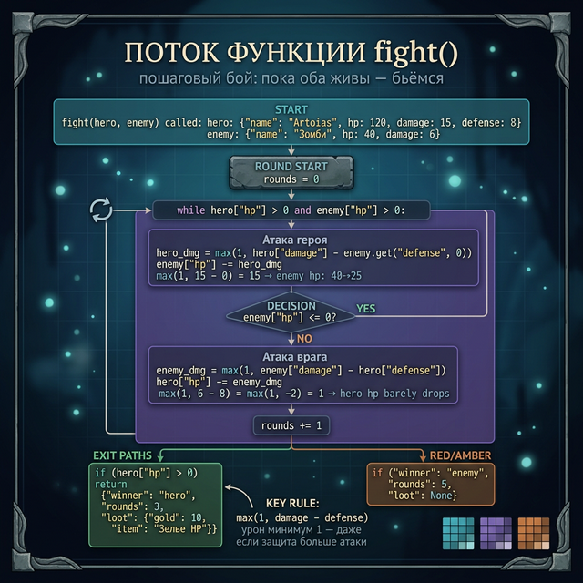

# День 6 — Практика: строим рогалик

## Что строим сегодня

**Roguelike** (рогалик) — жанр игр с процедурной генерацией: каждое прохождение уникально, смерть постоянна, этажи создаются случайно. Nethack, Hades, Dead Cells — всё это рогалики.

Сегодня мы соберём мини-рогалик, используя **всё что изучили за эту неделю**:
- `def` и `return` — функции для каждой механики
- параметры по умолчанию — для гибкости
- `lambda` и `sorted` — для таблицы результатов
- `import random` — для процедурной генерации
- `import copy` — для безопасного клонирования врагов

Полное прохождение займёт примерно час. Каждое задание строится на предыдущем.

---

## Задание 1 — Генератор персонажа (10 мин)

Напиши функции для создания героя. Игрок выбирает имя и класс — всё остальное считается автоматически.

**Что нужно сделать:**

```python
import copy

# Базовые характеристики классов
CLASS_STATS = {
    "воин": {"hp": 120, "max_hp": 120, "damage": 15, "defense": 8},
    "маг":  {"hp": 80,  "max_hp": 80,  "damage": 28, "defense": 3},
    "вор":  {"hp": 100, "max_hp": 100, "damage": 20, "defense": 5},
}

def get_class_stats(char_class):
    # Возвращает копию характеристик класса
    # Используй copy.deepcopy — чтобы не испортить оригинальный словарь
    ...

def create_hero(name, char_class="воин"):
    # Создаёт героя: имя, класс, характеристики, инвентарь, золото, этаж
    ...

# Тест
hero = create_hero("Solaire", "маг")
print(hero)
```

**Ожидаемый вывод:**
```
{
  'name': 'Solaire',
  'class': 'маг',
  'hp': 80,
  'max_hp': 80,
  'damage': 28,
  'defense': 3,
  'inventory': [],
  'gold': 0,
  'floor': 1
}
```

<details>
<summary>Подсказка</summary>

В `get_class_stats` проверь, есть ли такой класс в словаре. Если нет — верни характеристики "воина" по умолчанию. В `create_hero` объедини базовые поля (`name`, `class`, `inventory`...) с характеристиками класса через `{**stats, "name": name, ...}`.

</details>

<details>
<summary>Решение</summary>

```python
import copy

CLASS_STATS = {
    "воин": {"hp": 120, "max_hp": 120, "damage": 15, "defense": 8},
    "маг":  {"hp": 80,  "max_hp": 80,  "damage": 28, "defense": 3},
    "вор":  {"hp": 100, "max_hp": 100, "damage": 20, "defense": 5},
}

def get_class_stats(char_class):
    """Возвращает независимую копию характеристик класса"""
    stats = CLASS_STATS.get(char_class, CLASS_STATS["воин"])
    return copy.deepcopy(stats)

def create_hero(name, char_class="воин"):
    """Создаёт нового героя"""
    stats = get_class_stats(char_class)
    hero = {
        "name": name,
        "class": char_class,
        **stats,          # разворачиваем hp, max_hp, damage, defense
        "inventory": [],
        "gold": 0,
        "floor": 1,
    }
    return hero

# Тест
hero = create_hero("Solaire", "маг")
for key, value in hero.items():
    print(f"  {key}: {value}")
```

</details>



---

## Задание 2 — Генератор врагов через random (15 мин)

Напиши функции для создания случайных врагов. На более глубоких этажах враги должны быть сильнее.

**Что нужно сделать:**

```python
import random
import copy

ENEMY_TEMPLATES = [
    {"name": "Зомби",     "hp": 40,  "damage": 6,  "gold": 10, "xp": 15},
    {"name": "Скелет",    "hp": 30,  "damage": 10, "gold": 15, "xp": 20},
    {"name": "Гоблин",    "hp": 25,  "damage": 8,  "gold": 20, "xp": 18},
    {"name": "Троль",     "hp": 80,  "damage": 14, "gold": 35, "xp": 45},
    {"name": "Дракон",    "hp": 200, "damage": 30, "gold": 100,"xp": 150},
    {"name": "Некромант", "hp": 60,  "damage": 20, "gold": 50, "xp": 80},
]

def generate_enemy(floor=1):
    # Выбирает случайного врага
    # На более глубоких этажах усиливает характеристики (floor * 10% бонус)
    # Важно: deepcopy шаблона, чтобы не менять оригинал
    ...

def generate_floor_enemies(floor):
    # Создаёт список из 3-5 врагов для этажа
    # Количество врагов: random.randint(3, 5)
    ...
```

**Тест:**
```python
enemies = generate_floor_enemies(3)
for e in enemies:
    print(f"{e['name']}: HP={e['hp']}, урон={e['damage']}")
```

<details>
<summary>Подсказка</summary>

Для усиления по этажу: `enemy["hp"] = round(enemy["hp"] * (1 + (floor - 1) * 0.1))`. Это даёт +10% к HP за каждый этаж после первого. Применяй ко всем числовым характеристикам.

</details>

<details>
<summary>Решение</summary>

```python
import random
import copy

ENEMY_TEMPLATES = [
    {"name": "Зомби",     "hp": 40,  "damage": 6,  "gold": 10, "xp": 15},
    {"name": "Скелет",    "hp": 30,  "damage": 10, "gold": 15, "xp": 20},
    {"name": "Гоблин",    "hp": 25,  "damage": 8,  "gold": 20, "xp": 18},
    {"name": "Троль",     "hp": 80,  "damage": 14, "gold": 35, "xp": 45},
    {"name": "Дракон",    "hp": 200, "damage": 30, "gold": 100,"xp": 150},
    {"name": "Некромант", "hp": 60,  "damage": 20, "gold": 50, "xp": 80},
]

def generate_enemy(floor=1):
    """Случайный враг, усиленный по этажу"""
    template = random.choice(ENEMY_TEMPLATES)
    enemy = copy.deepcopy(template)
    bonus = 1 + (floor - 1) * 0.1   # +10% за каждый этаж

    enemy["hp"]     = round(enemy["hp"]     * bonus)
    enemy["damage"] = round(enemy["damage"] * bonus)
    enemy["gold"]   = round(enemy["gold"]   * bonus)
    return enemy

def generate_floor_enemies(floor):
    """Список врагов для этажа"""
    count = random.randint(3, 5)
    return [generate_enemy(floor) for _ in range(count)]

# Тест
enemies = generate_floor_enemies(3)
print(f"Этаж 3 — {len(enemies)} врагов:")
for e in enemies:
    print(f"  {e['name']}: HP={e['hp']}, урон={e['damage']}, золото={e['gold']}")
```

</details>



---

## Задание 3 — Боевая механика (15 мин)

Напиши функции для боя и применения лута.

**Что нужно сделать:**

```python
import random

def fight(hero, enemy):
    """
    Пошаговый бой между героем и врагом.
    Возвращает словарь с результатом:
    {"winner": "hero" или "enemy", "rounds": число, "loot": {...}}

    Механика:
    - Каждый раунд: герой атакует, потом враг (если ещё жив)
    - Урон = damage атакующего - defense защитника (минимум 1)
    - Выводи лог боя: "Раунд 1: Solaire наносит 12 урона. Зомби: 28 HP"
    """
    ...

def apply_loot(hero, loot):
    """
    Применяет лут к герою.
    loot = {"gold": X, "item": "название" или None}
    Добавляет золото, кладёт предмет в инвентарь (если есть)
    """
    ...
```

**Тест:**
```python
hero = create_hero("Artorias", "воин")
enemy = generate_enemy(1)
result = fight(hero, enemy)
print(f"Победил: {result['winner']}, раундов: {result['rounds']}")
```

<details>
<summary>Подсказка</summary>

Цикл `while hero["hp"] > 0 and enemy["hp"] > 0:` — продолжай пока оба живы. Урон: `max(1, attacker["damage"] - defender["defense"])`. Лут из врага: `{"gold": enemy["gold"], "item": None}` — предмет можно добавить потом через random.

</details>

<details>
<summary>Решение</summary>

```python
import random

LOOT_ITEMS = ["Зелье HP", "Зелье маны", "Кинжал", "Кожаный щит", None, None, None]

def fight(hero, enemy):
    """Пошаговый бой. Возвращает результат."""
    rounds = 0
    print(f"\n  ⚔ {hero['name']} vs {enemy['name']} ⚔")

    while hero["hp"] > 0 and enemy["hp"] > 0:
        rounds += 1

        # Атака героя
        hero_dmg = max(1, hero["damage"] - enemy.get("defense", 0))
        enemy["hp"] -= hero_dmg

        if enemy["hp"] <= 0:
            break

        # Атака врага
        enemy_dmg = max(1, enemy["damage"] - hero["defense"])
        hero["hp"] -= enemy_dmg

        if rounds <= 3:   # показываем только первые 3 раунда
            print(f"  Раунд {rounds}: {hero['name']} -{hero_dmg} | "
                  f"{enemy['name']} -{enemy_dmg} | "
                  f"Враг HP: {max(0, enemy['hp'])}")

    if hero["hp"] > 0:
        loot = {
            "gold": enemy["gold"],
            "item": random.choice(LOOT_ITEMS)
        }
        return {"winner": "hero", "rounds": rounds, "loot": loot}
    else:
        return {"winner": "enemy", "rounds": rounds, "loot": None}

def apply_loot(hero, loot):
    """Применяет лут к герою"""
    hero["gold"] += loot["gold"]
    if loot["item"]:
        hero["inventory"].append(loot["item"])
        # Зелье HP — мгновенно лечит
        if loot["item"] == "Зелье HP":
            heal = 30
            hero["hp"] = min(hero["max_hp"], hero["hp"] + heal)
            print(f"  Зелье HP использовано! +{heal} HP")
```

</details>

---

## Задание 4 — Главный цикл (20 мин)

Соберём всё вместе. Герой идёт по этажам, пока не погибнет.

**Что нужно сделать:**

```python
def run_roguelike():
    """Основной игровой цикл"""
    # 1. Выбрать имя и класс (input)
    # 2. Создать героя
    # 3. Цикл этажей:
    #    - Вывести состояние героя (HP, золото, этаж)
    #    - Сгенерировать врагов на этаже
    #    - Сражаться с каждым
    #    - Если герой погиб — game over
    #    - Если все враги побеждены — следующий этаж
    # 4. Показать итоговую статистику

run_roguelike()
```

<details>
<summary>Подсказка</summary>

Восстанавливай часть HP между этажами: `hero["hp"] = min(hero["max_hp"], hero["hp"] + 20)`. Это даёт шанс выжить. Используй `break` для выхода из цикла этажей при гибели героя.

</details>

<details>
<summary>Решение</summary>

```python
def show_hero_status(hero):
    """Выводит текущее состояние героя"""
    hp_bar = "█" * (hero["hp"] // 10) + "░" * ((hero["max_hp"] - hero["hp"]) // 10)
    print(f"\n{'='*50}")
    print(f"  {hero['name']} [{hero['class']}] | Этаж {hero['floor']}")
    print(f"  HP: [{hp_bar}] {hero['hp']}/{hero['max_hp']}")
    print(f"  Золото: {hero['gold']} | Инвентарь: {hero['inventory'] or 'пусто'}")
    print(f"{'='*50}")

def run_roguelike():
    """Основной игровой цикл рогалика"""
    print("=== DUNGEON CRAWLER ===\n")

    name = input("Введи имя героя: ").strip() or "Безымянный"
    print("Выбери класс: воин / маг / вор")
    char_class = input("Класс: ").strip().lower()
    if char_class not in CLASS_STATS:
        char_class = "воин"

    hero = create_hero(name, char_class)
    print(f"\nДобро пожаловать, {hero['name']}! Ты — {hero['class']}.")
    print("Подземелье зовёт...\n")

    max_floor = 10   # подземелье из 10 этажей

    for floor in range(1, max_floor + 1):
        hero["floor"] = floor
        show_hero_status(hero)
        print(f"\n  Этаж {floor}. Слышны шаги врагов...")

        enemies = generate_floor_enemies(floor)
        print(f"  Встречено врагов: {len(enemies)}")

        floor_cleared = True
        for enemy in enemies:
            result = fight(hero, enemy)

            if result["winner"] == "hero":
                loot = result["loot"]
                apply_loot(hero, loot)
                print(f"  Победа! Получено: {loot['gold']} золота"
                      f"{', ' + loot['item'] if loot['item'] else ''}")
            else:
                print(f"\n  {hero['name']} пал в бою на этаже {floor}...")
                floor_cleared = False
                break

        if not floor_cleared:
            break

        if floor < max_floor:
            # Небольшое восстановление между этажами
            regen = 20
            hero["hp"] = min(hero["max_hp"], hero["hp"] + regen)
            print(f"\n  Этаж {floor} пройден! Краткий отдых... +{regen} HP")
        else:
            print(f"\n  {hero['name']} победил всё подземелье!")

    print(f"\n=== КОНЕЦ ИГРЫ ===")
    print(f"  Герой: {hero['name']} [{hero['class']}]")
    print(f"  Достигнут этаж: {hero['floor']}")
    print(f"  Золото: {hero['gold']}")
    print(f"  Инвентарь: {hero['inventory'] or 'пусто'}")

# Запуск
run_roguelike()
```

</details>

---

## Бонус — Таблица рекордов в JSON

Сохраняй результаты каждого прохождения и показывай топ-5 рекордсменов, отсортированных по этажу и золоту.

<details>
<summary>Решение бонуса</summary>

```python
import json
import os

SCORES_FILE = "roguelike_scores.json"

def load_scores():
    """Загружает список рекордов из файла"""
    if os.path.exists(SCORES_FILE):
        with open(SCORES_FILE, "r", encoding="utf-8") as f:
            return json.load(f)
    return []

def save_score(hero):
    """Добавляет результат текущего прохождения"""
    scores = load_scores()
    record = {
        "name":  hero["name"],
        "class": hero["class"],
        "floor": hero["floor"],
        "gold":  hero["gold"],
    }
    scores.append(record)
    with open(SCORES_FILE, "w", encoding="utf-8") as f:
        json.dump(scores, f, ensure_ascii=False, indent=2)
    return record

def show_top_scores(top_n=5):
    """Выводит таблицу рекордов"""
    scores = load_scores()
    if not scores:
        print("Рекордов пока нет.")
        return

    # Сортировка: сначала по этажу, потом по золоту
    top = sorted(scores,
                 key=lambda s: (s["floor"], s["gold"]),
                 reverse=True)[:top_n]

    print("\n=== ТОП РЕКОРДОВ ===")
    for i, s in enumerate(top, 1):
        print(f"  {i}. {s['name']:12} [{s['class']:5}] "
              f"— этаж {s['floor']}, золото {s['gold']}")

# В конце run_roguelike() добавить:
# save_score(hero)
# show_top_scores()
```

</details>

---

## Итог недели

За эту неделю ты написал полноценный мини-рогалик и попутно освоил:

- `def` и `return` — строительные блоки любой программы
- Параметры по умолчанию — гибкость без лишнего кода
- `*args` и `**kwargs` — функции для любого количества аргументов
- Рекурсия — функция, вызывающая саму себя
- `lambda` — анонимные функции для сортировки и фильтрации
- `import random` — случайность как игровая механика
- `import copy` — безопасное клонирование объектов
- Свои модули — организация кода

В Week 6 мы займёмся **файлами и данными**: чтение/запись CSV, работа с JSON на серьёзном уровне, обработка ошибок с `try/except`.

---

← [День 5 — import и модули](day_5.md) | [День 7 — Лонгрид →](day_7.md)
