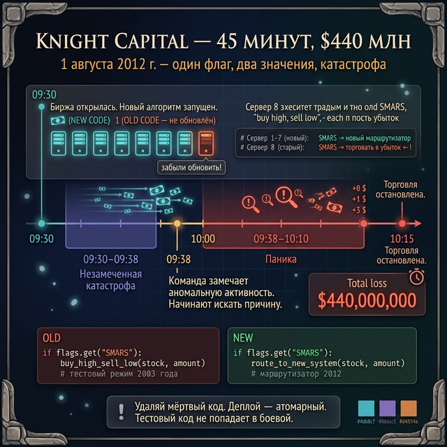
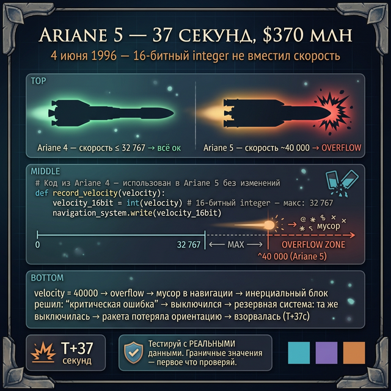
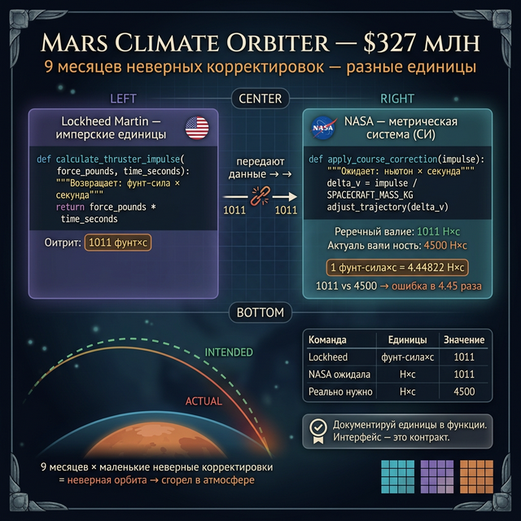

# День 7 — Лонгрид: баги на миллионы

*Примерное время чтения: 50-60 минут*

---

## Введение: цена доверия

На этой неделе мы изучили функции. Ты теперь умеешь делать так: берёшь кусок кода, даёшь ему имя, передаёшь аргументы — и доверяешь ему работу. Вызвал `generate_enemy(5)` — получил врага. Вызвал `fight(hero, enemy)` — получил результат. Ты не думаешь каждый раз, *как именно* это работает внутри. Ты просто доверяешь.

Именно поэтому функции так важны. И именно поэтому они так опасны.

Когда программист пишет функцию, он делает **предположения**: о том, какие данные придут на вход, в каком формате, в каких единицах, в каком диапазоне. Если эти предположения нарушаются — функция делает что-то неожиданное. А если функция управляет торговым роботом, космической ракетой или межпланетным зондом — последствия выходят за рамки сообщения об ошибке в терминале.

Сегодня — три реальные истории. Три функции с нарушенными предположениями. Итог: $1,1 миллиарда убытков, одна сгоревшая ракета и один потерянный марсианский зонд.

---

## Кейс 1: Knight Capital Group (2012)

### Что произошло

1 августа 2012 года, 9:30 утра. Нью-Йоркская фондовая биржа только что открылась. Компания Knight Capital Group — один из крупнейших маркет-мейкеров США — запустила новое программное обеспечение для автоматической торговли акциями.

Через 45 минут компания потеряла **440 миллионов долларов**. За 45 минут.

### Как это случилось

Knight Capital обновляла свой торговый алгоритм. Инженеры разработали новый код и развернули его на 8 серверах. Но на **одном из восьми серверов** обновление не было применено — там остался старый код.

В старом коде была функция с флагом `SMARS` (Supply and Market Router System). Этот флаг в своё время управлял тестовым режимом: когда он был активен, алгоритм намеренно делал невыгодные сделки — покупал дорого, продавал дёшево — чтобы проверить работу системы. Тестовый режим давно убрали из нового кода, но в старом коде флаг остался.

Когда 1 августа запустилось обновление, новый код на 7 серверах использовал флаг `SMARS` для совершенно другой цели. Старый код на 8-м сервере воспринял этот флаг по-старому — как команду "торгуй в убыток".

Вот упрощённая аналогия на Python:

```python
# СТАРЫЙ КОД (на 8-м сервере — не обновили)
def execute_trade(stock, amount, flags):
    if flags.get("SMARS"):
        # В 2003 году: "SMARS включён = тестовый режим, торгуй в убыток"
        buy_high_sell_low(stock, amount)   # намеренно плохая сделка
    else:
        make_profit(stock, amount)

# НОВЫЙ КОД (на 7 серверах)
def execute_trade(stock, amount, flags):
    if flags.get("SMARS"):
        # В 2012 году: "SMARS включён = новый маршрутизатор"
        route_to_new_system(stock, amount)  # нормальная сделка
    else:
        use_old_router(stock, amount)
```

Один флаг. Два разных значения. Два разных сервера. 45 минут.

За это время алгоритм совершил миллионы сделок: покупал акции по рыночной цене и мгновенно продавал дешевле. Каждая сделка приносила небольшой убыток. Миллионы сделок — катастрофический итог.

### Почему не остановили сразу

Первые 8 минут команда наблюдала аномальную активность, не понимая причины. Потом начали искать проблему. Потом — пытаться остановить. В 10:15, через 45 минут после открытия биржи, торговля была остановлена.

Knight Capital не восстановилась. Компания была куплена конкурентом за бесценок.

### Урок: функции с побочными эффектами

```python
# Плохо: функция делает что-то неочевидное в зависимости от флага
def process_order(order, debug_mode=False):
    if debug_mode:
        reverse_order(order)   # в тесте было безвредно, в проде — катастрофа
    else:
        execute_order(order)

# Хорошо: флаги тестирования и боевые флаги — разные
def process_order(order):
    execute_order(order)       # только одно назначение

def test_order_flow(order):    # отдельная функция для тестов
    simulate_order(order)
```

Главные уроки от Knight Capital:
- **Удаляй мёртвый код**. Функция, которую никто не вызывает, но которая по-прежнему живёт в кодовой базе — это бомба замедленного действия.
- **Деплой должен быть атомарным**. Либо все серверы обновлены, либо ни один.
- **Тестовый код не должен попадать в боевой**. Никогда.



---

## Кейс 2: Ariane 5 (1996)

### Что произошло

4 июня 1996 года. Французская Гвиана, космодром Куру. Ракета Ariane 5 поднялась в небо. Через **37 секунд** после старта она взорвалась.

Ракета стоила 370 миллионов долларов. На борту — четыре спутника для изучения магнитного поля Земли, разработка которых заняла 10 лет.

Всё это исчезло через 37 секунд.

### Как это случилось

Ariane 5 была новым поколением ракеты. Предыдущая версия, Ariane 4, успешно летала годами. Инженеры, разрабатывая Ariane 5, решили сэкономить время и использовать часть программного кода от Ariane 4 — он был проверен и надёжен.

В этом коде была функция: она вычисляла горизонтальную скорость ракеты и записывала результат в 16-битное целое число. Для Ariane 4 это работало отлично — горизонтальная скорость ракеты никогда не превышала 32 767 (максимум для 16-битного числа).

Ariane 5 летела **быстрее**. Её горизонтальная скорость превысила 32 767. Функция попыталась записать число ~40 000 в 16-битную переменную.

На языке Ada (на котором был написан код) это называется **integer overflow** — переполнение целого числа. Вместо числа 40 000 система получила мусор. Инерциальный блок навигации решил, что это критическая ошибка, и **выключился**.

Python-аналогия:

```python
# Функция из Ariane 4 — рассчитана на скорость < 32767
def record_velocity(velocity):
    # В Ada: 16-битный integer. Максимум: 32767
    # Если velocity > 32767 → OverflowError → система выключается
    velocity_16bit = int(velocity)   # в реальном коде: принудительное приведение типа
    navigation_system.write(velocity_16bit)

# Ariane 4: всё хорошо
record_velocity(850)    # → 850 ✓

# Ariane 5: скорость выше
record_velocity(37000)  # → OverflowError в Ada
                        # → навигационная система решила: "это катастрофический сбой"
                        # → отключилась
                        # → ракета потеряла управление
                        # → система аварийного подрыва сработала автоматически
```

Когда основная навигационная система выключилась, управление перешло к резервной. Но **резервная система была идентичной копией основной** — и тоже выключилась по той же причине.

Ракета потеряла ориентацию, начала разрушаться от аэродинамических нагрузок, и автоматика её подорвала.

### Почему не проверили заранее

Хороший вопрос. Инженеры проверяли заимствованный код. Но они проверяли его в контексте **Ariane 4** — с данными Ariane 4. Никому не пришло в голову запустить эту функцию с параметрами новой ракеты.

Предположение: "код Ariane 4 — надёжный код". Реальность: надёжный код для одних данных может быть опасным кодом для других.

### Урок: функции должны обрабатывать граничные значения

```python
# Плохо: функция молча ломается на больших числах
def record_velocity(velocity):
    velocity_16bit = velocity   # что будет если velocity > 32767?

# Хорошо: явная проверка и понятная ошибка
MAX_VELOCITY = 32767

def record_velocity(velocity):
    if velocity > MAX_VELOCITY:
        raise ValueError(
            f"Скорость {velocity} превышает максимум {MAX_VELOCITY}. "
            f"Функция не предназначена для Ariane 5."
        )
    navigation_system.write(int(velocity))
```

Главные уроки от Ariane 5:
- **Тестируй функцию с данными той системы, где она будет работать** — не с данными той, откуда ты её взял.
- **Граничные значения — первое что нужно проверить**. Что будет при нуле? При максимуме? При числе чуть больше максимума?
- **Повторное использование кода — не бесплатно**. Заимствуя функцию, ты заимствуешь и все её предположения.



---

## Кейс 3: NASA Mars Climate Orbiter (1999)

### Что произошло

11 декабря 1998 года ракета унесла в космос зонд Mars Climate Orbiter. Задача: провести 9 месяцев в пути, выйти на орбиту Марса и начать изучение его климата.

23 сентября 1999 года зонд вышел на связь в последний раз. Он вошёл в атмосферу Марса под неправильным углом и **сгорел**.

Стоимость миссии: 327 миллионов долларов.

### Как это случилось

За 9 месяцев полёта зонд постоянно корректировал курс с помощью двигателей. Расчёты для коррекции делала программа на Земле.

Программное обеспечение, разработанное командой **Lockheed Martin**, вычисляло данные для управления двигателями и отправляло их на зонд. Конкретно — значение импульса (силы тяги умноженной на время) в единицах **фунт-сила × секунда** (имперская система).

Программное обеспечение NASA, которое принимало эти данные, ожидало их в единицах **ньютон × секунда** (метрическая система).

Одна функция передавала данные. Другая функция принимала. Обе делали своё дело правильно. Проблема: они **молча договорились о разных единицах**.

```python
# Команда Lockheed Martin (imперская система)
def calculate_thruster_impulse(force_pounds, time_seconds):
    """Рассчитывает импульс. Возвращает: фунт-сила × секунда"""
    return force_pounds * time_seconds

# Команда NASA (метрическая система)
def apply_course_correction(impulse):
    """Применяет коррекцию курса. Ожидает: ньютон × секунда"""
    delta_v = impulse / SPACECRAFT_MASS_KG
    adjust_trajectory(delta_v)

# Что происходило 9 месяцев:
impulse = calculate_thruster_impulse(1011, 1.0)
# → 1011 фунт×с = ~4500 Н×с (настоящее значение)

apply_course_correction(1011)
# ↑ думает, что это 1011 Н×с
# ↑ реальное значение: 4500 Н×с
# ↑ ошибка в 4.45 раза — каждая коррекция неправильная
```

Каждый раз, когда зонд корректировал курс, поправка была неправильной. 9 месяцев маленьких неправильных поправок накапливались. К моменту прибытия на орбиту ошибка была достаточно большой, чтобы отправить зонд в атмосферу вместо орбиты.

### Почему не обнаружили

Обе функции работали правильно в изоляции. Тесты проходили. Данные передавались. Никакой ошибки компилятор не выдавал — потому что числа оставались числами, просто числами в разных мирах.

Инженеры в обеих командах знали, в каких единицах работает их код. Никто не спросил, в каких единицах работает код соседней команды. Предположение: "раз мы работаем вместе — мы используем одни единицы". Реальность: нет.

### Правильное решение: документировать контракт функции

```python
# Плохо: функция умалчивает об единицах
def apply_course_correction(impulse):
    delta_v = impulse / SPACECRAFT_MASS_KG
    adjust_trajectory(delta_v)

# Хорошо: единицы — часть контракта функции
def apply_course_correction(impulse_newton_seconds: float) -> None:
    """
    Применяет коррекцию курса на основе импульса двигателей.

    Аргументы:
        impulse_newton_seconds: импульс в ньютон-секундах (СИ).
                                НЕ в фунт-силах × секунды!

    Если данные приходят в имперских единицах — конвертируй перед вызовом:
        newton_seconds = pound_force_seconds * 4.44822
    """
    delta_v = impulse_newton_seconds / SPACECRAFT_MASS_KG
    adjust_trajectory(delta_v)
```

Главные уроки от Mars Orbiter:
- **Интерфейс функции — это контракт**. Что ты принимаешь? В каких единицах? Что возвращаешь? Что ожидает вызывающий?
- **Документируй предположения явно**. Особенно всё, что не видно из кода: единицы измерения, форматы, допустимые диапазоны.
- **На стыке команд — повышенная опасность**. Каждый знает свою часть. Никто не знает интерфейс между частями так же хорошо.



---

## Общий урок: функция — это обещание

Смотри на все три катастрофы:

| Катастрофа | Потери | Нарушенное предположение |
|---|---|---|
| Knight Capital | $440 млн | "Старый флаг уже не активен" |
| Ariane 5 | $370 млн | "Данные будут в том же диапазоне" |
| Mars Orbiter | $327 млн | "Единицы измерения совпадают" |

Ни в одном случае проблема не была в логике функции. Логика работала правильно — для тех данных, которые имел в виду автор. Проблема была в **предположениях** — молчаливых договорённостях, которые не были нигде записаны.

Функция — это обещание. Она говорит: "дай мне вот это — я верну вот то". Если это обещание нигде не зафиксировано, рано или поздно кто-то нарушит его по незнанию.

Нарушенный контракт функции может стоить 1,1 миллиарда долларов.

---

## Что это значит для твоего кода

Ты пишешь не торговых роботов и не навигацию ракет. Но привычки формируются сейчас.

### Проверяй граничные значения

```python
def calculate_damage(base_damage, level):
    """Урон = базовый + уровень * 2"""
    return base_damage + level * 2

# Что будет при уровне 0?
calculate_damage(10, 0)    # → 10 — окей

# При отрицательном уровне?
calculate_damage(10, -5)   # → 0 — сомнительно, но не сломано

# При уровне 1000?
calculate_damage(10, 1000) # → 2010 — boss-убийца? или это ошибка?
```

Добавь проверку, если диапазон важен:

```python
def calculate_damage(base_damage, level):
    """
    Урон = базовый + уровень * 2.
    level: от 1 до 100.
    """
    if level < 1 or level > 100:
        raise ValueError(f"Уровень должен быть от 1 до 100, получен: {level}")
    return base_damage + level * 2
```

### Документируй что ожидаешь

```python
# Плохо: что такое "данные"? что возвращает?
def process(data):
    return data["hp"] - data["damage"]

# Хорошо: контракт явный
def calculate_remaining_hp(hero: dict, enemy_damage: int) -> int:
    """
    Вычисляет оставшиеся HP после удара врага.

    hero: словарь с ключом "hp" (текущие очки здоровья)
    enemy_damage: урон врага в целых единицах, >= 0
    Возвращает: оставшиеся HP (минимум 0)
    """
    remaining = hero["hp"] - enemy_damage
    return max(0, remaining)   # HP не уходит в минус
```

### Тестируй с реальными данными

Ariane 5 сгорела потому, что функцию тестировали с данными Ariane 4. Тест показал "всё хорошо" — но данные были неправильными.

```python
def test_calculate_damage():
    # Обычный случай
    assert calculate_damage(10, 5) == 20

    # Граничные значения
    assert calculate_damage(10, 1) == 12    # минимальный уровень
    assert calculate_damage(10, 100) == 210  # максимальный уровень

    # Что при нарушении контракта?
    try:
        calculate_damage(10, 0)   # уровень 0 — не должно быть
        print("ОШИБКА: должно было выбросить исключение!")
    except ValueError:
        print("Правильно: уровень 0 отклонён")

test_calculate_damage()
```

---

## Факт-бомба напоследок

После катастрофы Ariane 5 исследовательская комиссия провела анализ. Они выяснили: функция, которая сломалась, была помечена как "не критическая" — поэтому её не защитили обработчиком ошибок. Логика была такой: "если она сломается, это не важно".

Оказалось — важно.

Одна "некритическая" функция. $370 миллионов.

В программировании нет "некритичного" кода — есть код, о котором ты ещё не знаешь, что он критичный.

---

## Для тех, кто хочет узнать больше

Все три истории подробно задокументированы:

- **Knight Capital**: SEK official report "Findings Regarding the Market Events of August 1, 2012"
- **Ariane 5**: European Space Agency official inquiry board report "ARIANE 5 Flight 501 Failure" (1996) — полный отчёт опубликован и доступен в интернете
- **Mars Climate Orbiter**: NASA official report "Mars Climate Orbiter Mishap Investigation Board Phase I Report" (1999)

Все три — бесплатные, публичные, на английском. Если когда-нибудь захочешь почитать первоисточники.

---

← [День 6 — Практика: Рогалик](day_6.md) | [Неделя 6 — Файлы и данные →](../week_6/day_1.md)
