# 🔄 Week 2 - Day 5: Cash Conversion Cycle — Пульс Денежного Потока

> **Executive Summary**:
> Три дня мы собирали пазл: DIO — сколько дней товар лежит (Day 2), DSO — сколько дней нам должны (Day 4), DPO — сколько дней мы тянем с оплатой (Day 4). Сегодня мы **объединим** всё в одну формулу — **Cash Conversion Cycle (CCC)**. Это *главная метрика финансового здоровья бизнеса*: сколько дней ваши деньги «заморожены» между моментом оплаты поставщику и моментом получения денег от клиента. Если CCC < 0 — вы зарабатываете деньги **до того**, как платите за товар.
>
> **Ключевые компетенции:**
> * Формула CCC = DIO + DSO − DPO.
> * Визуализация Cash Gap на временной шкале.
> * Бенчмарки CCC по отраслям.
> * Рычаги управления CCC.
> * Кейс: Dell — компания, которая изобрела отрицательный CCC.
> * Кейс: Amazon — как финансировать империю чужими деньгами.
>
> **Время чтения**: ~60 минут.

---

## 📑 Оглавление

1. [[#Часть 1. Hook — Два Брата, Одна Идея, Разная Судьба]]
2. [[#Часть 2. Origin Story — Как CCC Стал Ключевой Метрикой]]
3. [[#Часть 3. Формула CCC]]
4. [[#Часть 4. Визуализация — Карта Денежного Потока]]
5. [[#Часть 5. Бенчмарки CCC]]
6. [[#Часть 6. Три Рычага Управления CCC]]
7. [[#Часть 7. Кейс — Dell: Пионер Отрицательного CCC]]
8. [[#Часть 8. Кейс — Amazon: Повелитель Чужих Денег]]
9. [[#Часть 9. Real-Time CCC и Fintech]]
10. [[#Часть 10. Психология — Illusion of Profitability]]
11. [[#Часть 11. Практикум]]
12. [[#Часть 12. FAQ]]
13. [[#Часть 13. Глоссарий]]

---

## Часть 1. Два Брата, Одна Идея, Разная Судьба

Два брата — Артём и Данил — открыли одинаковые интернет-магазины электроники. Одинаковый ассортимент. Одна ниша. Одинаковый стартовый капитал: 200 тыс. долл.

**Артём** (умный финансист):
- Нашёл поставщика с **net 45** (оплата через 45 дней).
- Продаёт товар в среднем за **15 дней** (DIO = 15).
- Клиенты платят сразу (DSO = 0).
- **CCC = 15 + 0 − 45 = -30 дней.** 🤑

Артём получает деньги от покупателей **за 30 дней до того**, как платит поставщику. Каждый цикл продажи **генерирует** свободный кэш. За год он открыл 3 магазина. К третьему году — 12.

**Данил** (великий маркетолог):
- Нашёл дешевле поставщика, но условия **prepaid** (предоплата!).
- Продаёт товар за **20 дней** (DIO = 20).
- Клиенты платят сразу (DSO = 0).
- **CCC = 20 + 0 − 0 = +20 дней.** 😰

Данил должен **заплатить за товар до того**, как его продаст. Каждый рублёвый рост требует больше оборотного капитала. За год он взял кредит. К третьему году — на грани банкротства, несмотря на более дешёвый товар.

**Мораль**: Цена товара — не всё. **Условия оплаты** определяют, растёт ваш бизнес или задыхается.

---

## Часть 2. Как ССС Стал Ключевой Метрикой

### Проблема: «Рост Убивает»

В 1980-х годах финансовое сообщество осознало парадокс: **быстрорастущие** компании банкротились чаще, чем стагнирующие. Почему?

Потому что рост требует **опережающих инвестиций**: нужно купить больше товара, нанять больше людей, арендовать больше площадей — **до того**, как продажи принесут деньги. Это называется **Overtrading** (перетрейдинг) — и мы разберём его завтра в [[Week 2 - Day 6 - Case Cash Gap\|Day 6]].

### Решение: Cash Conversion Cycle (1980-е)

В 1980-х финансисты формализовали метрику **CCC** — Cash Conversion Cycle. Она ответила на простой вопрос: *«Сколько дней деньги «заморожены» внутри операционного цикла?»*

CCC стал стандартом для:
- **CFO**: Управление оборотным капиталом и ликвидностью.
- **Инвесторов**: Оценка реального финансового здоровья (в отличие от «бумажной прибыли» в P&L).
- **Банков**: Определение кредитного лимита и условий.

### Момент Прорыва: Dell (1996)

В 1996 году **Michael Dell** показал миру, что CCC может быть **отрицательным** — и это не аномалия, а стратегия. Мы расскажем об этом в Части 7.

---

## Часть 3. Формула CCC

$$ CCC = DIO + DSO - DPO $$

Расшифровка:
- **DIO** — Days Inventory Outstanding: сколько дней товар **лежит** на складе.
- **DSO** — Days Sales Outstanding: сколько дней **клиент должен** нам деньги.
- **DPO** — Days Payable Outstanding: сколько дней **мы должны** поставщику.

![[ccc_timeline.png|1200]]

### Интерпретация

| CCC | Значение | Следствие |
| -- | -- | -- |
| **> 30 дней** | 🔴 Длиння заморозка. Деньги «застряли» | Нужен значительный оборотный капитал или кредиты |
| **10–30 дней** | 🟡 Норма для многих бизнесов | Управляемо, но оптимизация возможна |
| **0–10 дней** | 🟢 Короткий цикл. Деньги возвращаются быстро | Минимальная потребность в оборотном капитале |
| **< 0 дней** | 💎 Святой Грааль. Бизнес **генерирует** кэш | Финансирование за счёт поставщиков. Можно расти без кредитов |

### Пример: Магазин «Velvet»

Данные из предыдущих уроков:
- DIO: 217 дней (из [[Week 2 - Day 2 - Inventory and Turnover\|Day 2]]).
- DSO: 0 (B2C, клиенты платят на кассе).
- DPO: 30 дней (стандартные условия).

$$ CCC = 217 + 0 − 30 = +187 \text{ дней} $$

**187 дней.** Шесть месяцев. Деньги Velvet «заморожены» на полгода. Каждый рубль, вложенный в товар, возвращается к вам через полгода. Чтобы расти — нужен огромный капитал. Это **катастрофа** для Fashion ритейлера.

---

## Часть 4. Визуализация — Карта Денежного Потока

### CCC > 0: Положительный Цикл (Проблема)

```mermaid
gantt
    title CCC = +25 дней (Типичный B2B дистрибьютор)
    dateFormat X
    axisFormat %d

    section Товар
    Закупка товара       :milestone, 0, 0
    Товар на складе (DIO=30) : active, 0, 30
    Продажа              :milestone, 30, 30

    section Клиент
    Ожидание оплаты (DSO=15) : active, 30, 45
    Деньги получены           :milestone, 45, 45

    section Поставщик
    Оплата поставщику (DPO=20) :crit, 20, 20

    section Cash Gap
    ДЕНЬГИ ЗАМОРОЖЕНЫ (25 дней) :crit, 20, 45
```

**Красная зона** (день 20 → день 45): вы уже заплатили поставщику, но деньги от клиента ещё не пришли. 25 дней дефицита.

### CCC < 0: Отрицательный Цикл (Суперсила)

```mermaid
gantt
    title CCC = -25 дней (Супермаркет)
    dateFormat X
    axisFormat %d

    section Товар
    Закупка товара       :milestone, 0, 0
    Товар на полке (DIO=20) : active, 0, 20
    Продажа              :milestone, 20, 20

    section Клиент
    Клиент платит сразу (DSO=0) : 20, 20
    Деньги получены           :milestone, 20, 20

    section Поставщик
    Оплата поставщику (DPO=45) :crit, 45, 45

    section Free Cash
    ДЕНЬГИ НА ВАШЕМ СЧЕТУ (25 дней) :done, 20, 45
```

**Зелёная зона** (день 20 → день 45): деньги от покупателя УЖЕ у вас, а поставщику вы платите только на 45-й день. 25 дней — деньги работают на вас.

---

## Часть 5. Бенчмарки CCC

| Компания / Тип | DIO | DSO | DPO | **CCC** | Комментарий |
| -- | -- | -- | -- | -- | -- |
| 🍏 **Apple** | 9 | 28 | 64 | **-27** | Получает деньги за месяц до оплаты |
| 🛒 **Walmart** | 25 | 4 | 40 | **-11** | Классический negative CCC |
| 🛍 **Amazon** | 20 | 12 | 72 | **-40** | Рекордно отрицательный среди крупных |
| 🏪 **Costco** | 29 | 4 | 30 | **+3** | Почти ноль. Быстрая оплата = лучшие цены |
| 👗 **Zara (Inditex)** | 33 | 15 | 50 | **-2** | Легко отрицательный — fast fashion engine |
| 👔 **H&M** | 90 | 8 | 30 | **+68** | Медленный Turnover = длинный CCC |
| 🚗 **Автодилер** | 60 | 10 | 30 | **+40** | Дорогой товар, длинный DIO |
| 🏗 **Строительная компания** | 120 | 90 | 45 | **+165** | Кошмар: всё медленно |

> [!IMPORTANT] Паттерн
> Все «великие» ритейлеры мира — Walmart, Amazon, Costco, Apple — имеют CCC около **нуля или отрицательный**. Это не совпадение. Это — результат десятилетий целенаправленной оптимизации DIO, DSO и DPO.

---

## Часть 6. Три Рычага Управления CCC

### Рычаг 1: Снижение DIO (Ускорить Оборот Товара)

Как? Инструменты из [[Week 2 - Day 2 - Inventory and Turnover\|Day 2]]:
- Меньше SKU, чаще заказы (модель Zara).
- Маrkdown на Dead Stock (не ждать).
- AI Demand Forecasting → меньше затоваривания.
- Cross-docking (товар проезжает через склад, не задерживаясь).

**Эффект**: DIO с 60 → 30 дней = CCC уменьшается на 30 дней.

### Рычаг 2: Снижение DSO (Быстрее Собирать Деньги)

Как? (Для B2B): Инструменты из [[Week 2 - Day 4 - AP and AR\|Day 4]]:
- Скидки за раннюю оплату (2/10 net 30).
- Факторинг / Reverse Factoring.
- Строгая Collection Policy.
- Предоплата для ненадёжных клиентов.

**Эффект**: DSO с 45 → 20 дней = CCC уменьшается на 25 дней.

### Рычаг 3: Увеличение DPO (Тянуть с Оплатой Дольше)

Как?:
- Переговоры с поставщиками (net 30 → net 60).
- Supply Chain Finance (Reverse Factoring).
- Масштаб = рычаг (чем вы крупнее, тем больше DPO можете просить).
- Консолидация поставщиков (один крупный поставщик вместо десяти мелких = лучшие условия).

**Эффект**: DPO с 30 → 60 дней = CCC уменьшается на 30 дней.

### Комбинированный Эффект

Компания до оптимизации: DIO 60 + DSO 30 − DPO 20 = **CCC +70 дней**.
После:
- DIO 40 (−20)
- DSO 15 (−15)
- DPO 45 (+25)
- **CCC = 40 + 15 − 45 = +10 дней**. Сокращение на **60 дней!**

Это = **высвобождение оборотного капитала**. Если Revenue = 10 млн долл./год:
- CCC 70 дней → заморожено ~1,9 млн долл.
- CCC 10 дней → заморожено ~274 тыс. долл.
- **Высвободилось 1,6 млн долл.** — без кредитов, без увольнений.

---

## Часть 7. Кейс — Dell: Пионер Отрицательного CCC

### Контекст

1984 год. 19-летний студент **Michael Dell** основывает Dell Computer в общежитии Техасского университета. Его идея проста: **продавать компьютеры напрямую покупателям** (Direct Model), минуя розничные магазины и дистрибьюторов.

### Почему Direct Model = Отрицательный CCC

Традиционная модель (Compaq, HP, IBM):
1. Фабрика производит компьютеры → **60 дней** на складе фабрики.
2. Отгружает дистрибьютору → **30 дней** на складе дистрибьютора.
3. Дистрибьютор отгружает ритейлеру → **45 дней** на полке Best Buy.
4. Покупатель приходит в магазин и покупает.
- **Суммарный DIO: 135 дней.** Компьютер устаревает, пока ждёт.

Dell:
1. Покупатель заходит на dell.com и оплачивает (DSO = **0**).
2. Dell собирает компьютер из компонентов **под заказ** (DIO = **6 дней**).
3. Dell платит поставщикам компонентов через **36 дней** (DPO).
- **CCC = 6 + 0 − 36 = -30 дней.**

### Что Это Значит На Практике

Dell получает деньги от покупателя **за 30 дней до того**, как платит Intel за процессор, Samsung за RAM, Seagate за жёсткий диск. Каждый компьютер, собранный и проданный, **генерирует** свободный кэш.

В 1996-2000 годах Dell рос на 50%+ в год — **без привлечения внешнего капитала**. Рост полностью финансировался отрицательным CCC. Конкуренты (Compaq, Gateway) привлекали кредиты и акционерный капитал — и теряли маржу на процентах.

### 6 Ключевых Наблюдений

1. **CCC = −30 дней.** Каждый день — 40+ млн долл. свободного кэша в обороте (при Revenue ~50 млрд долл.).

2. **Build-to-Order.** Нет готового товара на складе → нет DIO → нет риска устаревания. Компьютер устаревает быстро (цикл 6–12 месяцев). Dell не несёт этот риск — покупатель **уже заплатил**.

3. **Нет ритейлера.** Нет розничной наценки (15–25%). Dell может предложить **ниже цену** при **той же марже**. Или ту же цену при **выше марже**.

4. **Переговорная сила с поставщиками.** Dell — крупнейший покупатель процессоров Intel, памяти Samsung. DPO 36 дней — результат масштаба.

5. **Customization.** Покупатель выбирает конфигурацию: RAM, диск, экран. Это не только удобство — это **отсутствие прогноза спроса**. Dell не угадывает, какие конфигурации будут популярны — покупатель сам решает.

6. **Модель разрушилась.** К 2010-м Dell потерял позиции: рынок перешёл к смартфонам и планшетам, где Direct Model не работает (нужны магазины для «потрогать»). Dell ушёл в B2B (серверы, облачная инфраструктура), где негативный CCC по-прежнему актуален.

---

## Часть 8. Кейс — Amazon: Повелитель Чужих Денег

### Контекст

Amazon (2023): Revenue 575 млрд долл. Net Income 30 млрд долл. Но главная сила Amazon — не прибыль. Это **Cash Flow**.

### CCC Amazon

| Метрика | Значение |
| -- | -- |
| DIO | 20 дней |
| DSO | 12 дней |
| DPO | 72 дня |
| **CCC** | **-40 дней** |

Amazon получает деньги от покупателей **за 40 дней до того**, как платит продавцам/поставщикам. При Revenue 575 млрд долл. это:

$$ \text{Free Float} = \frac{575 \times 40}{365} \approx 63 \text{ млрд долл.} $$

**63 млрд долл.** чужих денег постоянно в обороте. Бесплатно. Без процентов.

### Как Amazon Использует Free Float

1. **AWS.** Amazon инвестировал free float в Amazon Web Services. AWS сегодня = 91 млрд долл. Revenue, 36 млрд долл. Operating Income. Облачная инфраструктура, построенная на деньгах поставщиков.

2. **Fulfillment Network.** 175+ Fulfillment Centers. 60+ млрд долл. инвестиций в логистику. Финансируется операционным Cash Flow (не кредитами).

3. **Prime.** Amazon Prime (200M+ подписчиков) — **Deferred Revenue** (14,2 млрд долл.). Подписчик платит 139 долл./год вперёд. Amazon использует эти деньги немедленно.

4. **Marketplace.** Amazon Marketplace (60%+ продаж) — Amazon не покупает товар. Продавцы несут Inventory Risk. Amazon только берёт 15–20% комиссию. DIO для marketplace = **0**.

### Урок

Amazon годами показывал минимальную чистую прибыль. Инвесторы терпели, потому что видели: **Free Cash Flow** растёт каждый год. P&L говорил: «Прибыли почти нет.» Cash Flow Statement говорил: «30–50 млрд долл. свободного кэша в год.» Инвесторы верили Cash Flow — и были правы.

---

## Часть 9. Real-Time CCC и Fintech

### Проблема: CCC Считали Раз в Квартал

Исторически CCC рассчитывали по квартальным отчётам. Это как смотреть на спидометр машины раз в час: вы видите среднюю скорость, но пропускаете опасные моменты.

### Real-Time Treasury Management

Современные ERP и Treasury Management Systems позволяют видеть **компоненты CCC в реальном времени**:
- DIO обновляется ежедневно (продажи вчера → пересчёт средних).
- DSO трекается по каждому клиенту (кто тянет? кто платит вовремя?).
- DPO мониторится по каждому поставщику (кому скоро платим?).

CFO может увидеть: «Сегодня CCC = +5 дней. Вчера был −2. Причина: крупный клиент задерживает оплату на 500 тыс. долл.» → Немедленное действие.

### Fintech и Embedded Finance

1. **Instant Payments**: BNPL (Buy Now Pay Later) для B2B — Stripe, Klarna, AfterPay предлагают мгновенную оплату продавцу, а покупатель платит частями. DSO → 0 для продавца.

2. **Supply Chain Finance Platforms**: C2FO, Taulia, PrimeRevenue — маркетплейсы, где покупатели предлагают раннюю оплату со скидкой, а поставщики выбирают условия. Настоящий **аукцион** на условия оплаты.

3. **Blockchain для Trade Finance**: Contour, Marco Polo — блокчейн-платформы для Letter of Credit. Время обработки: с 5–10 дней до **24 часов**. Это ускоряет DSO в международной торговле.

---

## Часть 10. Психология — Illusion of Profitability

### Наблюдение

**Illusion of Profitability** (Иллюзия Прибыльности) — когнитивная ловушка, при которой предприниматели приравнивают **P&L-прибыль к реальным деньгам**.

### Как Это Убивает

Стартап показывает:
- Revenue: 1 млн долл./месяц. ✅
- Net Margin: 10%. ✅
- P&L-прибыль: 100 тыс. долл./месяц. ✅

Основатель: «Мы зарабатываем 100 тыс. долл./месяц! Пора расширяться!»

Но CCC = +60 дней. Это значит:
- 1 млн долл. Revenue × (60/30) = **2 млн долл.** замороженного рабочего капитала.
- Расширение (удвоение Revenue до 2 млн долл.) требует **ещё 2 млн долл.** оборотного капитала.
- Итого нужно: 4 млн долл. На счету: 300 тыс. долл. Кредит? Инвесторы?

P&L говорит: «Всё хорошо.» Cash Flow говорит: «Вы на грани.» P&L — мнение бухгалтера. Cash — факт.

> [!CAUTION] Правило
> **Никогда** не принимайте решение о расширении бизнеса, глядя только на P&L. Всегда считайте CCC и потребность в Working Capital. Рост **убивает** компании с длинным CCC.

---

## Часть 11. Практикум

### Задание 1: Базовый CCC

Компания «QuickFashion» (онлайн-магазин одежды):
- DIO: 45 дней.
- DSO: 2 дня (e-commerce, мгновенная оплата).
- DPO: 35 дней.

1. CCC?
2. Это хорошо или нужно улучшить?
3. Какой рычаг самый мощный?

> **Самопроверка:**
> 1. CCC = 45 + 2 − 35 = **+12 дней**.
> 2. Для e-commerce fashion — приемлемо, но не идеально. Zara (offline!) имеет CCC ≈ -2.
> 3. **Снижение DIO** — самый мощный: если DIO с 45 → 30 дней (оптимизация ассортимента, быстрее markdown), CCC станет -3 дня. DSO уже почти ноль, DPO сложно увеличить без масштаба.

### Задание 2: Кофейня (Из Прошлых Дней)

Кофейня «BrewBar»:
- Кофе зерно лежит 7 дней (DIO = 7).
- Гости платят картой, деньги приходят завтра (DSO = 1).
- Поставщику платим раз в месяц (DPO = 30).

1. CCC?
2. Что это значит?
3. Что произойдёт, если поставщик перейдёт на предоплату (DPO = 0)?

> **Самопроверка:**
> 1. CCC = 7 + 1 − 30 = **-22 дня**.
> 2. Кофейня получает деньги за 22 дня до оплаты. Идеальный бизнес: высокая маржа + отрицательный CCC.
> 3. CCC = 7 + 1 − 0 = **+8 дней**. Переход с −22 до +8 — потеря **30 дней** свободного кэша. При Revenue 50 тыс. долл./месяц это ~50 тыс. долл. замороженного капитала. Стоит бороться за net 30.

### Задание 3: Влияние Роста

Компания «TechGrow» (B2B дистрибьютор):
- Revenue: 1 млн долл./месяц. Рост: 20%/месяц.
- CCC: +40 дней.

1. Сколько оборотного капитала нужно сегодня?
2. Сколько через 3 месяца (Revenue = 1,73 млн долл.)?
3. Откуда взять разницу?

> **Самопроверка:**
> 1. WC = 1 млн × (40/30) = **1,33 млн долл.**
> 2. Revenue через 3 месяца: 1 млн × 1,2³ = 1,73 млн долл. WC = 1,73 млн × (40/30) = **2,3 млн долл.**
> 3. Дополнительная потребность: 2,3 млн − 1,33 млн = **970 тыс. долл.** за 3 месяца. При Net Margin 8%: прибыль за 3 месяца = 1 млн × 3 мес. × 1,1 (средний) × 8% = ~264 тыс. долл. Дефицит: **706 тыс. долл.** Нужен кредит, инвестиции или оптимизация CCC.

### Задание 4: Оптимизация CCC

Та же «TechGrow». Текущий: DIO 35 + DSO 25 − DPO 20 = CCC +40.

Предложите план оптимизации до CCC ≤ 15:
- Какие рычаги? На сколько сдвинуть каждый?

> **Один из вариантов:**
> - DIO: 35 → 25 (оптимизация ассортимента, AutoReplenishment): −10.
> - DSO: 25 → 15 (скидка 2/10 net 30, факторинг крупных AR): −10.
> - DPO: 20 → 35 (переговоры, консолидация поставщиков): +15.
> - **Новый CCC = 25 + 15 − 35 = +5 дней.** С +40 до +5 = высвобождение ~780 тыс. долл. рабочего капитала.

---

## Часть 12. FAQ

**Q1: Может ли CCC быть слишком отрицательным?**
Теоретически — чем отрицательнее, тем больше свободных денег. Практически — слишком агрессивное растягивание DPO портит отношения с поставщиками и может привести к отказу в поставках. Баланс важен.

**Q2: CCC для бизнеса без товара (SaaS, консалтинг)?**
DIO ≈ 0 (нет физического товара). CCC = DSO − DPO. Если клиенты платят предоплату (DSO = 0, или даже отрицательный — Deferred Revenue) → CCC сильно отрицательный. Поэтому SaaS-компании с annual prepaid — машины по генерации кэша.

**Q3: Как CCC связан с Working Capital?**
Напрямую. Потребность в Working Capital ≈ Revenue × (CCC / 365). CCC +60 дней при Revenue 10 млн долл. = 1,64 млн долл. замороженного капитала. CCC −30 дней = 822 тыс. долл. **свободного** капитала.

**Q4: Warren Buffett смотрит на CCC?**
Косвенно — да. Buffett ищет компании с **predictable, strong Free Cash Flow**. Отрицательный CCC — один из источников стабильного FCF. See's Candies (компания Buffett'а) имеет CCC ~-10 дней: клиенты платят сразу, а поставщикам платят через 30+ дней.

**Q5: Как COVID-19 повлиял на CCC?**
COVID удлинил CCC почти везде: (1) DIO вырос (дистрибьюторы не могли продать), (2) DSO вырос (клиенты задерживали оплату), (3) DPO вырос (все старались тянуть). Компании с изначально отрицательным CCC (Amazon, Walmart) пережили кризис легко. Остальные — привлекали экстренные кредиты.

---

## Часть 13. Глоссарий

| Термин | Определение | Где подробнее |
| -- | -- | -- |
| **CCC** | Cash Conversion Cycle = DIO + DSO − DPO. Дни заморозки капитала | [[#Часть 3. Формула CCC]] |
| **DIO** | Days Inventory Outstanding. Дни хранения товара | [[Week 2 - Day 2 - Inventory and Turnover]] |
| **DSO** | Days Sales Outstanding. Дни ожидания оплаты от клиентов | [[Week 2 - Day 4 - AP and AR]] |
| **DPO** | Days Payable Outstanding. Дни до оплаты поставщикам | [[Week 2 - Day 4 - AP and AR]] |
| **Overtrading** | Рост, убивающий бизнес из-за дефицита оборотного капитала | [[#Часть 2. Origin Story — Как CCC Стал Ключевой Метрикой]] |
| **Negative CCC** | CCC < 0: бизнес получает деньги до оплаты товара | [[#Часть 3. Формула CCC]] |
| **Free Float** | Свободные деньги, доступные благодаря отрицательному CCC | [[#Часть 8. Кейс — Amazon: Повелитель Чужих Денег]] |
| **Direct Model** | Продажа напрямую покупателю, минуя посредников (Dell) | [[#Часть 7. Кейс — Dell: Пионер Отрицательного CCC]] |
| **Cross-Docking** | Товар проходит через склад без хранения | [[#Часть 6. Три Рычага Управления CCC]] |
| **Build-to-Order** | Производство только после получения заказа (нет DIO) | [[#Часть 7. Кейс — Dell: Пионер Отрицательного CCC]] |

---

> В [[Week 2 - Day 6 - Case Cash Gap\|Day 6]] мы разберём **кейс «Кассовый Разрыв»** — парадокс, при котором прибыльный, быстрорастущий бизнес умирает от нехватки денег. Это самый практический урок недели: симуляция реального кризиса с тремя рычагами спасения.

---

← [[Week 2 - Day 4 - AP and AR\|День 4]] | [[retail_finance/README\|Оглавление]] | [[Week 2 - Day 6 - Case Cash Gap\|День 6]] →
