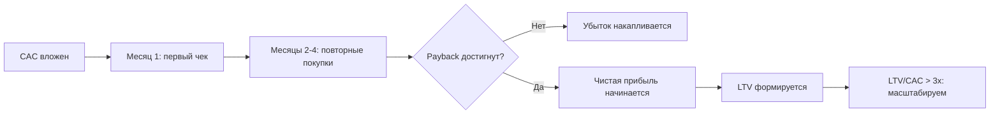

# День 2. Парадокс Матраса — Юнит-экономика и Долгий Роман с Клиентом

> [!abstract] Executive Summary
> **Цель урока:** Понять, почему выручка лжёт, а юнит-экономика говорит правду — и научиться считать CAC, LTV и Payback Period на реальных кейсах.
>
> **Компетенции:** Расчёт CAC и LTV; правило 3:1; анализ когорт; диагностика плохой юнит-экономики до масштабирования.
>
> **Ключевой вопрос:** Casper и Warby Parker — оба D2C, оба в Instagram, оба с венчурными деньгами. Почему один стоит миллиарды, а другой едва вышел на IPO с убытком?

## Оглавление

- [[#Часть 1. Смерть в мягкой упаковке — Почему Casper не стал Amazon]]
- [[#Часть 2. История вопроса — Как появилась юнит-экономика]]
- [[#Часть 3. Анатомия клиента — CAC, LTV и Payback Period]]
- [[#Часть 4. Матрица выживания — Правило 3:1 и когортный анализ]]
- [[#Часть 5. Ловушка первой продажи — Психология удержания]]
- [[#Часть 6. Практикум — Триаж D2C-стартапа]]
- [[#Часть 7. Глоссарий и FAQ]]

---

## Часть 1. Смерть в мягкой упаковке — Почему Casper не стал Amazon

2014 год. Нью-Йорк. Двое предпринимателей везут матрас в коробке на лифте в лофт на Манхэттене. Это не просто матрас — это революция. **Casper** только что поднял $1,85 млн seed-раунд с оценкой «следующий Amazon». Модель простая: покупаешь матрас онлайн, он приезжает в компактной коробке, разворачивается у тебя дома. Без посредников, без магазинов, без наценки дилера.

Через два года выручка — $100M. Инвесторы счастливы. Журнал TIME называет Casper «лучшим изобретением года».

Через семь лет — **банкротство**.

Что пошло не так? Ответ не в матрасе. Ответ в одной цифре: **CAC = $300**.

Чтобы привлечь одного покупателя матраса, Casper тратил $300 на рекламу — подкасты, Instagram, outdoor, Google. Матрас стоил $1,000. Маржа после производства и доставки — около $400. Казалось бы: $400 − $300 = $100 прибыли с клиента. Отличный бизнес?

Нет. Потому что матрас покупают **один раз в десять лет**.

$100 прибыли за десять лет — это $10 в год с клиента. При маркетинговом бюджете в $100M+ и отрицательном FCF каждый квартал — это не бизнес, это медленное кровотечение. Casper масштабировал не прибыль — он масштабировал убыток.

#### Эффект очков

Warby Parker начинал в то же время, в той же Instagram-эстетике, с теми же венчурными деньгами. CAC — примерно те же $300-400. Но **очки покупают каждые 1,5-2 года**. Клиент теряет, ломает, меняет оправу под новый образ. Warby Parker отправлял 5 оправ на дом бесплатно (Home Try-On программа) — и каждый второй пробник превращался в покупку, а каждая покупка — в возврат через 18 месяцев.

LTV клиента Warby Parker за 5 лет: $95 × 3 покупки × 60% маржа = **$171**.
Payback Period: $300 CAC / ($95 × 60% / 12 мес) = **6,3 месяца**.

LTV клиента Casper за те же 5 лет: практически нулевой (второй матрас не нужен).
Payback Period: **никогда** — если CAC $300, а прибыль за 5 лет $100.

> [!IMPORTANT] Принцип Одного Свидания
> Если ваш бизнес строится на том, что клиент купит у вас один раз — вы строите не бизнес, а маркетинговую воронку с отрицательным ROI. Долгосрочная юнит-экономика работает только в «долгом романе» с клиентом, который возвращается снова и снова.

Это и есть **Парадокс Матраса**: бизнес выглядит огромным снаружи (выручка $500M, инвесторы, пресс) и умирает изнутри (CAC > LTV на горизонте реального срока службы продукта).

---

## Часть 2. История вопроса — Как появилась юнит-экономика

В 1960-х в США ритейл был простым. Продавец в универмаге знал: купил за 50 центов, продал за доллар. Маржа 50%. Вот и вся финансовая модель.

С появлением первых торговых сетей — Sears, Kmart, Woolworth — начался масштаб. Появились рекламные бюджеты, программы лояльности, кредитные карты магазинов. И возник вопрос, на который никто не умел ответить: **сколько стоит один новый покупатель?**

Первыми задали этот вопрос не ритейлеры, а **страховые компании** в 1970-х. Они посчитали: один новый клиент, привлечённый через агента, стоит $X. Этот клиент будет платить страховку Y лет, принося Z маржи в год. Если Z × Y > X — агент окупился. Если нет — надо менять либо агента, либо продукт.

Это была первая примитивная модель LTV/CAC.

В 1990-х **телекоммуникационные компании** (AT&T, Sprint) перевели этот принцип в digital: стоимость привлечения абонента vs. Average Revenue Per User (ARPU) на контракте. Именно там появился термин **Payback Period** — за сколько месяцев клиент «отбивает» затраты на своё привлечение.

В 2000-х e-commerce взял эту методологию и сделал её **центральным языком венчурного капитала**. Теперь каждый стартап обязан показать инвестору LTV/CAC ratio. Если меньше 1 — разговор окончен. Если больше 3 — добро пожаловать в следующий раунд.

**Почему старый подход «маржа с единицы товара» ломался при масштабе?**

В маленьком магазине вы знаете клиентов в лицо. Вы интуитивно чувствуете, кто «ваш» покупатель. При 1,000 магазинах и онлайн-трафике в 10M визитов/мес эта интуиция исчезает. Остаются только цифры — и они должны рассказывать правду о каждом потраченном долларе на маркетинг.

> [!CAUTION] Анти-пример: Groupon (2011)
> В 2011 году Groupon был крупнейшим IPO после Google: $700M при оценке $13B. Модель: купоны со скидкой 50%. Малый бизнес привлекает клиентов. CAC малого бизнеса на Groupon = ~$30 на покупателя купона. Но эти покупатели никогда не возвращались без скидки. LTV = 0. Groupon масштабировал не удержание — он масштабировал одноразовые транзакции. Через год акции упали с $20 до $2.

---

## Часть 3. Анатомия клиента — CAC, LTV и Payback Period

Давайте разберём три переменные, которые решают судьбу любого ритейл-бизнеса.

### 3.1 CAC — Customer Acquisition Cost

**Иллюзия маркетолога:** «Наш CAC — $15. Мы потратили $15,000 на таргет и получили 1,000 кликов».

**Реальность CFO:** CAC — это ВСЕ расходы, связанные с привлечением нового клиента, делённые на количество НОВЫХ клиентов — не кликов, не визитов, не лидов, а тех, кто КУПИЛ.

$$CAC = \frac{\text{Маркетинг} + \text{Продажи} + \text{Пробники} + \text{Зарплата SMM-команды}}{\text{Количество новых покупателей}}$$

**Пример на трёх уровнях масштаба:**

| Уровень | Маркетинговый бюджет | Новых клиентов | Реальный CAC |
|:--------|:---------------------|:---------------|:-------------|
| Один SKU (лосьон) | $500/мес Instagram | 50 первых покупок | $10 |
| Один магазин | $15,000/мес (таргет + промоутеры + акции) | 300 новых | $50 |
| Сеть 100 магазинов | $2M/мес (TV + digital + листовки) | 20,000 новых | $100 |

**Ловушка масштаба:** При росте бизнеса CAC растёт быстрее, чем аудитория — «дешёвые» клиенты из близкого окружения заканчиваются первыми, и приходится тратить больше на каждого следующего.

**«Что если»**: Casper в 2019 году поднял TV-рекламу. CAC вырос с $300 до $500+. При той же марже $400 — каждый новый клиент стал приносить убыток $100 в первый год.

### 3.2 LTV — Lifetime Value

**Иллюзия менеджера:** «Наш средний чек $200. Каждый клиент приносит $200 маржи».

**Реальность:** Один визит — это ещё не LTV. LTV — это ВЕСЬ доход от клиента за ВСЁ время, пока он с вами, с учётом маржи и вероятности повторных покупок.

$$LTV = \text{Средний чек} \times \text{Частота покупок/год} \times \text{Маржа \%} \times \text{Срок жизни клиента (лет)}$$

**Три сценария для клиента кофейни:**

| Сценарий | Чек | Раз/мес | Маржа | Лет | LTV |
|:---------|:----|:--------|:------|:----|:----|
| Случайный гость | $5 | 1 | 60% | 0.5 | $18 |
| Постоянный клиент | $5 | 20 | 60% | 3 | $1,080 |
| Лояльный (+ рефералы) | $8 | 25 | 60% | 5 | $3,000 |

Для постоянного клиента кофейни: CAC $5 (один бесплатный латте) → LTV $1,080 → LTV/CAC = **216:1**. Это не маркетинг — это машина по печатанию денег.

**Граничный случай:** Если Churn Rate = 100%/год (никто не возвращается), LTV = одна покупка. Бизнес не существует — он лишь иллюзия.

### 3.3 Payback Period — Срок окупаемости клиента

**Конфликт двух менеджеров в одной переговорке:**

— Коммерческий директор: «Наш CAC вырос до $150! Это катастрофа, рубим маркетинг!»
— CFO: «Подождите. Клиент делает покупки на $80/мес с маржой 40% = $32/мес. Payback Period = $150 / $32 = **4,7 месяца**. При среднем сроке жизни клиента 3 года — это отличный показатель. Не рубим».

$$Payback\ Period = \frac{CAC}{\text{Средний чек} \times \text{Маржа\%} \times \text{Частота/мес}}$$

**Бенчмарки по индустриям (2024):**

| Индустрия | Средний Payback Period | Оценка |
|:----------|:----------------------|:-------|
| Продуктовый ритейл (Costco, Walmart) | 2-4 месяца | Отлично ✅ |
| Fashion (Zara, H&M) | 4-8 месяцев | Хорошо ✅ |
| Электроника (Best Buy) | 10-18 месяцев | Приемлемо ⚠️ |
| Матрасы, мебель (Casper, IKEA) | 3-10 лет | Критично 🚨 |

---

## Часть 4. Матрица выживания — Правило 3:1 и когортный анализ

### 4.1 Золотое правило инвесторов

Венчурный капитал имеет эмпирическое правило, проверенное на тысячах компаний:

| LTV/CAC | Интерпретация | Что делать |
|:--------|:--------------|:-----------|
| < 1 | Каждый клиент приносит убыток | Стоп. Пересмотр модели. |
| 1 – 2 | Едва выходим в ноль | Риск. Малейший рост CAC = убыток |
| 2 – 3 | Рабочая модель | Масштабируем осторожно |
| > 3 | Сильная юнит-экономика | Масштабирование оправдано |
| > 10 | Почти монополия | Редкость (Starbucks loyalty: ~15x) |

### 4.2 Когортный анализ — рентген бизнеса

Самая распространённая ошибка — считать LTV по «среднему клиенту». Реальность: клиенты, привлечённые в разные периоды, ведут себя по-разному.

**Cohort** — группа клиентов, совершивших первую покупку в один период.

| Когорта | Клиентов | Вернулись М+1 | Вернулись М+3 | Вернулись М+12 |
|:--------|:---------|:--------------|:--------------|:---------------|
| Январь 2023 | 500 | 220 (44%) | 140 (28%) | 80 (16%) |
| Июль 2023 | 500 | 275 (55%) | 180 (36%) | 110 (22%) |
| Январь 2024 | 500 | 310 (62%) | 215 (43%) | — |

Что видно? Retention улучшается от когорты к когорте. Это значит: продукт стал лучше, или канал привлечения изменился, или программа лояльности заработала. Без когортного анализа вы этого не увидите — усреднение скрывает тренд.

**Без когортного анализа:** «У нас retention 35% — норм».
**С когортным анализом:** «Наши клиенты Q1-2023 уходят (16%), а клиенты Q1-2024 остаются (43%). Что изменилось в июне 2023?»

> [!TIP] Вопрос для самодиагностики
> Какой процент клиентов прошлого года совершил хотя бы одну покупку в этом году? Это и есть ваш реальный Retention Rate. Если вы не знаете эту цифру — у вас нет юнит-экономики, есть только иллюзия роста.

---

## Часть 5. Ловушка первой продажи — Психология удержания

### 5.1 Churn Rate — тихий убийца LTV

**Churn Rate** — процент клиентов, прекративших покупки за период.

$$Churn\ Rate = \frac{\text{Клиентов в начале периода} - \text{Клиентов в конце}}{\text{Клиентов в начале}} \times 100\%$$

При Churn Rate 5%/мес: через 12 месяцев осталось 54% клиентов.
При Churn Rate 10%/мес: через 12 месяцев — 28% клиентов.
При Churn Rate 20%/мес: через 12 месяцев — 7% клиентов. **Это мертворождённый бизнес**.

Снижение Churn Rate на 5% (с 15% до 10%) увеличивает LTV в **1,5-2 раза** — это сильнейший рычаг в юнит-экономике.

### 5.2 Dollar Shave Club — учебник по юнит-экономике

2012 год. Майкл Дубин снимает видео за $4,500 о доставке бритв по подписке. Видео набирает 12,000 заказов за первые 48 часов.

**Структура юнит-экономики:**

| Метрика | Значение | Как достигнуто |
|:--------|:---------|:---------------|
| CAC | ~$10 | Вирусное видео: стоимость распределена на 25M просмотров |
| Средний чек/мес | $7,50 | 3 тарифных плана: $1, $6, $9 |
| Маржа | ~35% | Контракт с бразильским производителем напрямую |
| Срок жизни подписчика | 14 месяцев | Churn ~7%/мес |
| **LTV** | **$36,75** | $7.50 × 35% × 14 мес |
| **LTV/CAC** | **3.67x** | Правило 3:1 — выполнено ✅ |

В 2016 году Unilever купил Dollar Shave Club за **$1 миллиард** при выручке $150M и 3M подписчиков. Вирусный маркетинг снизил CAC до $10. Подписная модель обеспечила предсказуемый LTV. Вместе — победная юнит-экономика.

### 5.3 Психология удержания: почему клиенты уходят

Нейроэкономист Дэниел Канеман назвал это **«Эффектом знакомости»**: мы доверяем тому, что видели раньше. Когда продукт приносит ожидаемый результат каждый раз — клиент остаётся. Когда продукт удивляет неприятно — уходит.

**Как Warby Parker боролся с оттоком:**
1. **Home Try-On**: 5 оправ бесплатно домой → Reciprocity Bias (Чалдини): получив что-то бесплатно, люди чувствуют обязательство купить
2. **Eye Exam App**: Мобильное приложение для проверки зрения → создаёт повод вернуться каждые 12 месяцев
3. **Персонализация**: «Вам понравились оправы в стиле ретро — смотрите нашу новую коллекцию»

**Результат:** Retention Rate Warby Parker на уровне 40% через год vs. Casper ~10%.

> [!TIP] Самодиагностика
> Почему ваши клиенты уходят после первой покупки? Вы опрашивали ушедших? Если нет — вы управляете бизнесом вслепую. Exit survey из 3 вопросов даст вам дорожную карту удержания.

---

## Часть 6. Практикум — Триаж D2C-стартапа

Вы — финансовый директор стартапа **EcoBox** (экологичная бытовая химия по подписке). Перед вами данные за Q3:

**Исходные данные:**
- Маркетинговый бюджет: $180,000
- Зарплата команды по привлечению: $45,000
- Новых подписчиков: 3,000
- Средняя выручка с одной коробки: $55
- COGS + логистика: $32
- Средний срок жизни подписчика: 8 месяцев
- Churn Rate: 12%/мес

**Шаг 1. CAC:**
$$CAC = \frac{180{,}000 + 45{,}000}{3{,}000} = \frac{225{,}000}{3{,}000} = \mathbf{\$75}$$

**Шаг 2. Маржа с продажи:**
$$Маржа = \$55 - \$32 = \$23 \quad (41{,}8\%)$$

**Шаг 3. LTV:**
$$LTV = \$55 \times 41{,}8\% \times 8 = \$23 \times 8 = \mathbf{\$184}$$

**Шаг 4. LTV/CAC:**
$$LTV/CAC = \frac{184}{75} = \mathbf{2{,}45x}$$

**Шаг 5. Payback Period:**
$$Payback = \frac{75}{23} = \mathbf{3{,}26\ месяца}$$

**Вердикт CFO:**

LTV/CAC = 2,45x — **ниже порога 3x**. Payback Period 3,26 мес — хороший. Но Churn 12%/мес критически высокий: через 6 месяцев у вас останется 47% подписчиков.

**Что делать:** Не масштабировать маркетинг. Сначала снизить Churn до 5-7%/мес через улучшение продукта. При Churn 5%/мес LTV вырастет до ~$300, LTV/CAC = 4x → тогда масштабируем.

**Сценарий «Что если»:** Если снизить CAC до $50 (через реферальную программу), при текущем LTV = $184:
$$LTV/CAC = 184/50 = 3{,}68x \quad \checkmark$$

Рефералы решают проблему быстрее, чем оптимизация продукта.

---

## Часть 7. Глоссарий и FAQ

### Ключевые термины

| Термин | Определение | Контекст в P&L |
|:-------|:------------|:---------------|
| **CAC** | Стоимость привлечения одного нового покупателя | Marketing + Sales / New Customers |
| **LTV** | Суммарная маржа от клиента за всё время | Чек × Частота × Маржа% × Срок жизни |
| **Payback Period** | Срок, за который клиент «отбивает» CAC | CAC / (Чек × Маржа% × Частота/мес) |
| **Churn Rate** | % клиентов, прекративших покупки за период | Ключевой рычаг LTV |
| **Cohort** | Группа клиентов первой покупки в один период | Позволяет видеть реальный retention |
| **LTV/CAC Ratio** | Соотношение ценности клиента к стоимости привлечения | <1=катастрофа; 1-3=работает; >3=масштабируем |
| **Retention Rate** | % клиентов, вернувшихся за следующей покупкой | 100% - Churn Rate |

### Часто задаваемые вопросы

**Q: Почему нельзя просто смотреть на общую прибыль?**

Общая прибыль может быть положительной, пока вы сжигаете деньги инвесторов на маркетинг. Юнит-экономика показывает, что произойдёт, когда инвесторские деньги закончатся. Casper имел положительную выручку все 7 лет — и всё равно обанкротился, потому что каждый клиент обходился дороже, чем приносил за время жизни.

**Q: Что если у нас только разовые покупки — как считать LTV?**

Даже при разовых покупках важно считать реферальный LTV (клиент приводит друзей), вероятность повторной покупки через N лет и Cross-sell (матрас → подушки → постельное бельё). Если вообще нет повторных покупок — нужен принципиально другой CAC (в 3-5 раз ниже) или маржа 60%+.

**Q: Как считать LTV, если бизнесу меньше года?**

Используйте Retention Rate после 30/60/90 дней как предиктор. Если 40% клиентов вернулись на 90-й день — это хороший сигнал. Также используйте данные аналогичных компаний как бенчмарк. Не ждите 3 года — принимайте решения на основе ранних сигналов.

**Q: Чем отличается LTV от ARPU?**

ARPU (Average Revenue Per User) — средний доход в период (месяц/квартал) без учёта маржи. LTV — это совокупный доход за ВСЁ время жизни клиента С учётом маржи. ARPU — это снимок, LTV — это весь фильм.

> [!TIP] Тизер Дня 3
> Casper знал свой LTV на уровне бизнеса. Но он не знал, сколько зарабатывает каждый отдельный магазин «внутри четырёх стен» — без корпоративных аллокаций. Как разделить P&L корпорации и P&L одного магазина? И почему директор флагманского Lululemon зарабатывает для компании больше, чем весь маркетинговый бюджет конкурента?
> Завтра — **4-Wall Economics**: почему магазин — это отдельный бизнес, а Corporate Allocation Death Spiral убивает прибыльные точки. → [[Week 3 - Day 3 - 4-Wall Economics|День 3]]

---

← [[Week 3 - Day 1 - LFL analysis|День 1]] | [[retail_finance/README|Оглавление]] | [[Week 3 - Day 3 - 4-Wall Economics|День 3]] →
