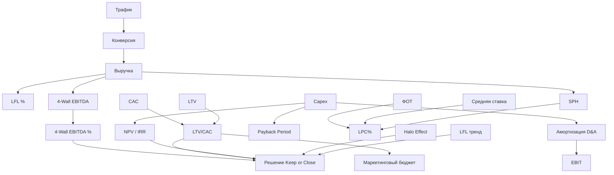

# Week 3 - Day 7: Архитектура Ритейл-Мышления — Великие Машины

> [!abstract] Executive Summary
> **Цель урока**: через разбор пяти великих ритейл-машин синтезировать знания всей недели в единую систему координат. Увидеть, как IKEA, Zara, H&M, Amazon и McDonald's применяли — каждый по-своему — те же инструменты, которые вы изучали в Days 1-6.
>
> **Компетенции**:
> - Видеть бизнес-модель через финансовые линзы: LFL, Unit Economics, 4-Wall, Capex/Opex, Staff KPIs
> - Выявлять «скрытые механизмы» успеха, которые не очевидны без финансового образования
> - Применять 5 Ментальных Моделей ритейл-лидера в ежедневных решениях
> - Формировать личный Action Plan внедрения знаний недели
>
> **Время чтения**: ~120 минут (лонгрид)

---

## Оглавление

- [[#Часть 1. Кейс IKEA — Великий Парадокс Дешевизны]]
- [[#Часть 2. Кейс Zara/Inditex — Машина Скорости]]
- [[#Часть 3. Кейс H&M — Когда Объём Становится Ловушкой]]
- [[#Часть 4. Кейс Amazon — Ритейл-Философия Безоса]]
- [[#Часть 5. Кейс McDonald's — Великая Афера с Недвижимостью]]
- [[#Часть 6. Атлас Метрик Недели 3]]
- [[#Часть 7. Глоссарий и FAQ]]

---

## Часть 1. Кейс IKEA — Великий Парадокс Дешевизны

### 1.1 Загадка, Которая Не Даёт Покоя

Почему самая прибыльная мебельная компания в мире заставляет своих покупателей самостоятельно везти мебель на крыше машины, самостоятельно собирать её шестигранным ключиком и при этом благодарить за «доступность»?

Ответ — в финансовой архитектуре, которую создал Ингвар Кампрад, и которую большинство людей принимают как должное, не понимая, насколько она гениальна.

### 1.2 История: От Велосипедного Предпринимателя до Глобальной Империи

Ингвар Кампрад начал продавать товары по каталогу в 1943 году в Швеции, когда ему было 17 лет. Имя IKEA — акроним: **I**ngvar **K**amprad **E**lmtaryd (его ферма) **A**gunnaryd (его деревня).

Мебель IKEA появилась в 1948 году. И с первых дней Кампрад думал как финансист, а не как дизайнер.

**Ключевой момент 1953 года**: конкурент пытался заставить поставщиков не продавать Кампраду материалы. IKEA ответила революционным ходом — начала разрабатывать **эксклюзивные дизайны**, которые могли производить только она. Первый принцип финансового успеха: контроль над цепочкой стоимости.

**Момент 1956 года — изобретение плоской упаковки:**

Сотрудник IKEA Гиллис Лундгрен разбирал стол для фотографии каталога. Стол не влезал в машину. Гиллис снял ножки. И подумал: «А почему бы не продавать мебель уже без ножек?»

Так родилась flat-pack концепция. Но это был не просто дизайн — это была **финансовая революция**.

### 1.3 Flat-Pack: Финансовая Анатомия

Что меняет плоская упаковка в unit-экономике?

**Расходы на логистику (традиционная мебель):**

Шкаф размером 200×100×60 см. В контейнере помещается 8 единиц. Стоимость доставки из Польши: $2,400. Стоимость на шкаф: **$300**.

**Расходы на логистику (flat-pack, IKEA PAX):**

Тот же шкаф в разобранном виде — плоские коробки 200×60×8 см. В контейнере помещается 64 единицы. Стоимость доставки: $2,400. Стоимость на шкаф: **$37.50**.

Разница: $262.50 на единицу. При объёмах IKEA (200M+ единиц в год) — это $52+ млрд ежегодной экономии на логистике.

**Расходы на склад:**

Традиционная мебель занимает в 8 раз больше складского объёма. Это означает:
- В 8 раз больше площадь склада (Capex или высокая аренда)
- В 8 раз больше погрузчиков и оборудования
- В 8 раз выше риск повреждения при хранении

Flat-pack превращает склад IKEA в финансовую машину высокой эффективности.

### 1.4 Самосборка: Когда Покупатель Платит за Работу

Самосборка — не просто «экономия на монтажниках». Это перераспределение расходов с компании на покупателя.

**Что «оплачивает» покупатель, собирая сам:**
- 45-90 минут своего времени на сборку среднего изделия
- Бензин на поездку в IKEA (они специально строят магазины за городом — дешевле земля)
- Доставку домой (отдельная платная услуга)

**Что это означает финансово для IKEA:**
- Нулевые расходы на монтаж (традиционно 15-25% цены изделия)
- Нулевые расходы на доставку «последней мили» (покупатель сам)
- Нулевые возвраты по причине «неправильно собрали» — сам собрал, сам виноват

При средней цене изделия $150:
- Традиционный конкурент: $150 − $37 (доставка + монтаж) = $113 реальная маржа
- IKEA: $150 − $0 (покупатель доставляет сам) = $150 реальная маржа

### 1.5 Ресторан IKEA: Когда Еда — Это Маркетинговый Расход

«Шведские фрикадельки в IKEA» — одна из самых известных бизнес-историй. Кажется странным: зачем мебельной компании ресторан?

**Финансовая логика:**

Средний визит в IKEA — 2.5-3 часа. Это в 3-5 раз дольше обычного магазина. Причина: лабиринтная планировка + ресторан + шведский магазин у выхода.

Ресторан IKEA:
- Ежегодная выручка: ~$2B (более 800 ресторанов)
- Маржа ресторана: ~15-20%
- Но главная функция — **удерживать покупателя в здании на 60+ дополнительных минут**

Исследования IKEA показали: каждые 30 дополнительных минут в магазине увеличивают средний чек на 7-12%. При среднем чеке $230 и трафике 800M визитов в год:
- 60 дополнительных минут = +14-24% к чеку
- Эффект для выручки: $230 × 14% × 800M = **$25.8 млрд дополнительной выручки** от удержания трафика через ресторан

Ресторан — это самый прибыльный маркетинговый расход в истории ритейла.

### 1.6 INGKA Holding: Когда Мебельный Бизнес — Это Фасад

За операционным бизнесом IKEA скрывается финансовая структура, которая делает компанию практически неуничтожимой.

**INGKA Holding** (нидерландская холдинговая компания):
- Владеет 75%+ магазинов IKEA
- Стоимость портфеля недвижимости: $50+ млрд
- Ежегодный доход от аренды и управления недвижимостью: $3-4 млрд

**Interogo Foundation** (лихтенштейнский фонд):
- Владеет торговой маркой IKEA
- Получает роялти ~3% от всей выручки IKEA
- Активы: $36+ млрд

**Результат**: реальные «деньги» IKEA находятся в двух юрисдикциях с минимальным налогообложением. Операционный бизнес «платит» фонду и холдингу роялти и аренду, оставляя налогооблагаемую прибыль минимальной.

> [!IMPORTANT] Финансовый Инсайт IKEA
> IKEA — это не просто «дешёвая мебель». Это многоуровневая финансовая машина: логистическая оптимизация (flat-pack) + перекладывание труда на покупателя (самосборка) + маркетинговый рычаг (ресторан) + налоговая оптимизация (фонды) + недвижимость как актив (INGKA). Каждый элемент в отдельности кажется незначительным. Вместе они дают EBITDA margin ~15% при обороте $45+ млрд.

---

## Часть 2. Кейс Zara/Inditex — Машина Скорости

### 2.1 Эффект «Свежести»: Финансовая Логика Fast Fashion

В 1975 году Амансио Ортега открыл первый магазин Zara в Ла-Корунье, Испания. К 2022 году Inditex (материнская компания Zara) стала крупнейшей fashion-группой мира по выручке, обогнав H&M и Gap.

Секрет — в том, что Ortega понял раньше всех: **в моде скорость важнее цены**.

**Традиционная модель fashion-ритейла (до Zara):**

1. Дизайн-команда разрабатывает коллекцию за 6-9 месяцев до сезона
2. Производство размещается в Азии (дёшево, но долго: 3-6 месяцев)
3. Товар приходит раз в сезон: 2 основные коллекции в год
4. Товар лежит на полках весь сезон, распродаётся со скидкой 50-70%

**Проблема**: за 9 месяцев ожидания модный тренд успевает родиться, стать мейнстримом и умереть. В итоге 30-40% сезонного ассортимента продаётся в убыток.

**Модель Zara:**

1. Дизайн → производство → магазин за **2-3 недели**
2. Производство преимущественно в Испании, Португалии, Марокко — дороже, но быстро
3. Новые модели поступают **дважды в неделю** в каждый магазин
4. Маленькие партии → почти не остаётся остатков

### 2.2 Unit Economics Zara: Скорость как Финансовый Рычаг

**Традиционный fashion-ритейл:**

| Метрика | Значение |
|:--------|:---------|
| Gross Margin | 55% |
| Распродажи (остатки) | 30% ассортимента по -60% |
| Реальная Gross Margin (с учётом распродаж) | 38-42% |
| Оборачиваемость запасов | 2-3 раза в год |

**Zara:**

| Метрика | Значение |
|:--------|:---------|
| Gross Margin | 52% (чуть ниже — производство дороже) |
| Распродажи | 15-18% ассортимента по -20-30% |
| Реальная Gross Margin (с учётом распродаж) | **46-48%** |
| Оборачиваемость запасов | **8-10 раз в год** |

Более низкая номинальная маржа × высокая оборачиваемость = более высокая реальная маржа и возврат на капитал.

**Формула капиталоэффективности:**

$$ROIC = \frac{\text{Gross Margin \%} \times \text{Оборачиваемость запасов}}{\text{Capex / Выручка}}$$

Zara: 48% × 9 = 4.32 против конкурента 40% × 2.5 = 1.0 → Zara в 4 раза эффективнее «работает» с капиталом.

### 2.3 «Дефицит как Стратегия»: Психология Scarcity

Маленькие партии создают дефицит. Дефицит создаёт срочность.

Покупатель Zara знает: если не купить сейчас — через неделю этого не будет. Эта психологическая механика:
- Повышает конверсию (меньше «подумаю и вернусь»)
- Снижает price sensitivity (покупают даже если дорого — «последний экземпляр»)
- Увеличивает частоту визитов (заходят 2-3 раза в неделю — а вдруг что-то новое)

**Финансовый эффект:**
- Среднее число визитов в год: Zara — 17 визитов, конкурент — 4 визита
- При конверсии 20% и среднем чеке $60: 17 × 20% × $60 = $204/клиент vs 4 × 20% × $60 = $48/клиент
- **LTV покупателя Zara в 4.25 раза выше**, чем у среднего fashion-ритейлера

### 2.4 Вертикальная Интеграция: Почему Inditex Не Отдаёт Производство

Большинство конкурентов производят 100% в Азии (Bangladesh, Vietnam, China). Zara — только 57%. Остальное — Испания, Португалия, Марокко, Турция.

**Почему это финансово оправдано:**

| Параметр | Азия | Испания/Марокко |
|:---------|:-----|:----------------|
| Себестоимость единицы | -40% vs Европа | Стандарт |
| Скорость цикла | 90-120 дней | 15-21 день |
| Минимальный заказ | 5,000-10,000 ед. | 300-500 ед. |
| Риск остатков | Высокий (большие партии) | Низкий (маленькие партии) |

**Ключевой вывод**: более дорогое европейское производство окупается за счёт:
- Снижения остатков: -15% объёма остатков × 30% средней стоимости = -4.5% выручки «сожжено» в распродажах
- Возможности реагировать на тренды за 2 недели, а не 4 месяца

**Математика:**

При выручке $30B:
- Экономия на азиатском производстве: $30B × 8% разницы = $2.4B/год
- Потери от остатков (азиатская модель): $30B × 12% дополнительных распродаж × 40% скидка = $1.44B/год
- **Чистое преимущество Zara от вертикальной интеграции**: $2.4B − $1.44B = $960M/год — ради этого стоит «переплачивать» за европейское производство

> [!IMPORTANT] Инсайт Zara
> Быстрое производство — это не просто логистика. Это финансовая стратегия, которая радикально меняет unit economics за счёт снижения остатков и повышения оборачиваемости капитала.

---

## Часть 3. Кейс H&M — Когда Объём Становится Ловушкой

### 3.1 H&M vs Zara: Близнецы или Антиподы?

На поверхности H&M и Zara очень похожи: fast fashion, глобальные сети, демократичные цены. Но финансовые модели — принципиально разные.

**H&M выбрала противоположную стратегию:**
- Производство — 100% в Азии (дешевле)
- Дизайн — планируется за 6-8 месяцев
- Партии — большие (экономия на масштабе)
- Коллекции — 2-4 основных + коллаборации со знаменитостями

**Логика звучит разумно**: производить в Азии в 2 раза дешевле → более низкие цены → больше клиентов → больше выручки.

### 3.2 Проблема Инвентаря: Как Объём Стал Проблемой

С 2015 года H&M попала в системный кризис, который называют «Inventory Crisis».

**Механика проблемы:**

1. H&M заказывает крупные партии в Бангладеш за 6 месяцев до начала сезона
2. Модный тренд за 6 месяцев меняется (например, пастельные тона популярны весной → к осени уже нет)
3. Приходит огромная партия «не трендовых» вещей
4. H&M вынуждена снижать цены: скидки 50-70%, а часть товара вообще сжигать или утилизировать

**Финансовые потери H&M от инвентарного кризиса 2017-2019:**

| Год | Непроданные запасы | Потери от списаний |
|:----|:-------------------|:-------------------|
| 2017 | $4B | ~$400M |
| 2018 | $4.3B (рекорд) | ~$600M |
| 2019 | $3.6B | ~$450M |

**2018 год**: фотография склада H&M в Южной Африке с горами нераспроданной одежды облетела весь мир. PR-катастрофа и финансовая катастрофа одновременно.

### 3.3 Структурный Анализ: Почему H&M Не Может «Стать Zara»

Казалось бы, решение очевидно: H&M должна перенести производство в Европу и ускорить цикл. Почему же этого не происходит?

**Проблема 1: Масштаб делает разворот невозможным.**

H&M работает с 1,000+ фабриками в Азии. Перевод производства в Европу:
- Потребует 5-7 лет для выстраивания производственных отношений
- Увеличит себестоимость на 30-40%
- Заставит повысить цены, что противоречит позиционированию H&M как «самого доступного»

**Проблема 2: Бизнес-модель встроена в инфраструктуру.**

H&M инвестировала миллиарды в азиатскую производственную инфраструктуру: фабрики, контракты, логистические узлы. Это Sunk Cost в чистом виде — уйти означает списать эти инвестиции.

**Проблема 3: Маркетинговая модель требует больших объёмов.**

Коллаборации H&M со знаменитостями (Karl Lagerfeld, Alexander Wang, Versace) работают только с большими объёмами — маленькие партии не создают «ажиотажный спрос» на весь мир одновременно.

### 3.4 H&M Ответ: Диверсификация Брендов

Вместо трансформации H&M пошла на **диверсификацию**:
- **COS** — более медленный и качественный сегмент (небольшие партии, более высокие цены)
- **& Other Stories** — дизайнерский сегмент
- **Monki, Weekday** — молодёжные суббренды

Логика: пусть каждый бренд занимает свою нишу, а H&M остаётся «объёмным» лидером.

**LFL сравнение 2019-2023:**

| Компания | LFL тренд | Gross Margin тренд |
|:---------|:----------|:-------------------|
| Zara/Inditex | +5% до +12% | Стабильно 57-58% |
| H&M Group | -2% до +4% (нестабильно) | Падает: 54% → 51% |

> [!NOTE] Урок для Ритейл-Аналитика
> H&M и Zara — наглядный пример того, что одна и та же категория (fast fashion) может иметь принципиально разную финансовую судьбу в зависимости от выбора производственной модели. Экономия на производстве ($) часто обходится дороже потерь от нераспроданных запасов ($$).

---

## Часть 4. Кейс Amazon — Ритейл-Философия Безоса

### 4.1 Amazon через Призму Недели 3

Большинство людей воспринимают Amazon как IT-компанию. Безос смотрел на это иначе: «Мы — сервисная компания, которая использует технологии как инструмент».

Разберём Amazon через каждую метрику Недели 3.

**LFL (Day 1)**: Amazon годами не открывал физических точек. Весь их рост был «чистым» LFL внутри существующих категорий: Книги → Электроника → Всё остальное → Облачные сервисы. Это идеальная LFL-история — рост без разбавления.

**Unit Economics (Day 2)**: Безос понял, что привлечение клиента онлайн (CAC) стоит дорого. Решение — **Amazon Prime**. Клиент платит $139/год и получает бесплатную доставку + контент + скидки. Его LTV взлетает: первый год — 2-3 покупки/мес, второй год — 5-7 покупок/мес. CAC окупается за 3-4 месяца вместо 12.

**4-Wall Economics (Day 3)**: Amazon Fresh и Whole Foods стали лабораторией 4-Wall. Когда Amazon купил Whole Foods в 2017 году за $13.7B, они превратили магазины в **Dark Stores** — пункты сборки онлайн-заказов. Каждая физическая точка получила двойной доход: розничные продажи + сборочный центр для Prime-доставки. 4-Wall EBITDA стала положительной за счёт синергии.

**Capex/Opex (Day 4)**: Amazon выбрала Asset-Light по максимуму. Вместо покупки грузовиков — сеть партнёров-перевозчиков. Вместо покупки серверов для себя — создание AWS, превратив инфраструктурный Capex в источник дохода для других. Сегодня AWS приносит ~70% операционной прибыли Amazon при 12% выручки.

**Staff KPIs (Day 5)**: В распределительных центрах — полная автоматизация и максимальный контроль SPH (через Kiva-роботов скорость сборки заказа выросла на 300%). В офисах и AWS — «дорогие эксперты» по модели Best Buy.

### 4.2 «Flywheel»: Как Amazon Победил Всех Остальных

Джефф Безос нарисовал на салфетке в 2001 году схему, которую назвал «Flywheel» («Маховик»):

```
Низкие цены → Больше трафика → Больше продавцов → Больше выбора → Лучший опыт → Больше трафика → ... (бесконечный цикл)
```

Финансовая суть маховика:
- Каждый новый продавец платит Amazon комиссию 8-20%
- Этот доход снижает нагрузку на собственную маржу Amazon
- Amazon может держать цены ниже конкурентов и зарабатывать на инфраструктуре, а не на товаре

**2022 год: Amazon Marketplace (комиссии продавцов)**: $117B выручки
**2022 год: Amazon Retail (собственные продажи)**: $64B выручки

Amazon зарабатывает больше как «платформа для других продавцов», чем на собственных продажах.

### 4.3 Amazon Go: Финансовый Эксперимент Без Checkout

В 2018 году Amazon открыла Amazon Go — магазин без касс и без очередей. Камеры и AI отслеживают, что вы берёте с полки, и списывают деньги автоматически при выходе.

**Финансовая логика:**

| Параметр | Обычный продуктовый | Amazon Go |
|:---------|:--------------------|:----------|
| LPC% (персонал) | 12-15% | ~4-6% (только склад + охрана) |
| Throughput (покупок/час) | 80-120 | 200-300 |
| Средний чек | $18 | $10 (меньше — быстрее выбирают) |
| Конверсия (без очереди) | 65% | 95%+ |

Отсутствие кассиров снижает LPC% вдвое. Скорость обслуживания позволяет обслужить в 2-3 раза больше клиентов. Недостаток — маленький чек (формат для быстрых покупок, не для закупки на неделю).

### 4.4 Уязвимость Amazon: Где Заканчивается «Маховик»?

Amazon кажется непобедимым. Но есть три структурных ограничения:

1. **Маржинальность ритейла**: Amazon Retail теряет деньги — субсидируется AWS и Marketplace
2. **Физический ритейл не масштабируется как онлайн**: каждая физическая точка — это Capex и операционная сложность
3. **Доверие покупателей к качеству**: на Marketplace можно купить подделку или некачественный товар — это давит на NPS и LTV

> [!NOTE] Ключевой Вывод
> Amazon — это не ритейл. Это инфраструктурная компания, которая использует ритейл как троянского коня. AWS — настоящий бизнес. Marketplace — настоящий бизнес. Amazon Prime — настоящий бизнес. Amazon Store — это дверь, через которую покупатель входит в экосистему.

---

## Часть 5. Кейс McDonald's — Великая Афера с Недвижимостью

### 5.1 «McDonald's — не ресторан. Это компания недвижимости»

В 1959 году финансовый директор McDonald's Гарри Зоннеборн сказал слова, которые стали легендой:

> «Мы занимаемся не продажей гамбургеров. Мы занимаемся недвижимостью. Гамбургеры — лишь способ, которым мы платим за нашу недвижимость».

Это не метафора. Это буквальное описание бизнес-модели.

### 5.2 Архитектура Дохода McDonald's

McDonald's зарабатывает деньги тремя способами:

**Способ 1: Роялти с франчайзи (3-5% выручки)**

Около 93% ресторанов McDonald's — это франшизы. Франчайзи платят:
- Первоначальный взнос: $45,000
- Роялти: 4% выручки ежемесячно
- Маркетинговый взнос: 4% выручки

При среднем ресторане McDonald's $3.2M выручки/год:
- Роялти: $3.2M × 4% = $128,000/год
- 40,000 ресторанов × $128,000 = **$5.12B/год** только роялти

Для McDonald's это почти чистая маржа: операционных расходов минимум.

**Способ 2: Аренда (ключевой механизм)**

McDonald's Corporation покупает или арендует землю и здания. Затем сдаёт их обратно франчайзи по более высокой ставке. Разница — доход McDonald's.

Механика:
- McDonald's арендует участок за $8,000/мес у землевладельца
- Строит ресторан (Capex $1.5M)
- Сдаёт в субаренду франчайзи за $15,000-$20,000/мес
- Разница: $7,000-$12,000/мес = $84,000-$144,000/год на один ресторан чистого дохода

Масштаб: 13,000+ рестораны в США на условиях «Real Estate» системы McDonald's.

**Финансовый результат 2022 года:**

| Источник дохода | Выручка | Операционная маржа |
|:----------------|:--------|:------------------|
| Роялти от франчайзи | $9.7B | ~83% |
| Доходы от аренды | $8.2B | ~60% |
| Собственные рестораны | $2.3B | ~15% |
| **Итого** | **$23.2B** | **~46%** |

**46% операционная маржа** — в 3-5 раз выше, чем у типичного ресторанного оператора.

### 5.3 McDonald's vs Burger King: Почему Одна Модель Выиграла

Burger King выбрал другой путь: они франшизировали рестораны, но **не контролировали недвижимость**. Франчайзи сами находили помещения, сами договаривались об аренде.

Результат:
- McDonald's контролирует **местоположение** каждого ресторана (лучшие угловые участки)
- McDonald's получает доход от **двух источников** (роялти + аренда) вместо одного
- McDonald's может «выгнать» плохого франчайзи — потому что здание принадлежит McDonald's, а не франчайзи
- McDonald's имеет рычаг давления на франчайзи через угрозу не продлить аренду

### 5.4 4-Wall Economics McDonald's: Когда Ресторан — Это Генератор Трафика для Недвижимости

Классическая 4-Wall модель говорит: «магазин должен зарабатывать в своих стенах». McDonald's инвертировал эту логику:

Для McDonald's Corporation важна не прибыль **ресторана**, а прибыль **объекта недвижимости**.

Даже если ресторан-франчайзи зарабатывает скромные 5-10% маржи на продаже гамбургеров — McDonald's Corporation зарабатывает 60-80% маржи на аренде этому же ресторану.

**Unit Economics одного объекта McDonald's:**

| Кто | Выручка | Маржа | Прибыль |
|:----|:--------|:------|:--------|
| Франчайзи (ресторан) | $3.2M | 6-8% | $192K-$256K |
| McDonald's Corp (аренда) | $192K (аренда) | 65% | $125K |
| McDonald's Corp (роялти) | $128K | 83% | $106K |
| McDonald's Corp (итого) | $320K | 72% | **$231K** |

McDonald's зарабатывает $231K с одного ресторана — почти столько же, сколько сам франчайзи, при этом не несёт операционных рисков ресторанного бизнеса.

> [!IMPORTANT] Главный Инсайт McDonald's
> McDonald's создал идеальную ритейл-машину: франчайзи несут операционный риск, McDonald's владеет активами и получает predictable, high-margin денежные потоки. Это квинтэссенция Asset-Heavy / Operation-Light стратегии.

---

## Часть 6. Атлас Метрик Недели 3

### 6.1 Сводная Таблица: От Атома до Галактики

| Уровень | Метрика | Формула | Что показывает | Норма |
|:--------|:--------|:--------|:---------------|:------|
| **Сеть** | LFL % | (Выручка текущий − прошлый год) / прошлый год | Органический рост без новых точек | > 0% |
| **Клиент** | CAC | Маркетинг $ / Новые клиенты | Стоимость привлечения одного клиента | Зависит от LTV |
| **Клиент** | LTV | Маржа × Частота × Срок | Суммарная прибыль с клиента за жизнь | LTV/CAC > 3 |
| **Клиент** | Payback CAC | CAC / (Маржа 1 покупки) | Срок окупаемости привлечения клиента | < 12 мес |
| **Магазин** | 4-Wall EBITDA | Выручка − Прямые расходы | «Чистая» прибыль точки без аллокаций | > 0 |
| **Магазин** | 4-Wall EBITDA % | 4-Wall EBITDA / Выручка | Рентабельность в стенах | 15-25% |
| **Магазин** | Выручка/кв.м | Выручка / Площадь | Эффективность торговой площади | Категорийно |
| **Инвестиции** | Payback Capex | Capex / 4-Wall EBITDA | Срок окупаемости инвестиций | < 3 лет |
| **Инвестиции** | NPV | Σ (CF_t / (1+r)^t) − I_0 | Создаёт ли проект ценность | > 0 |
| **Инвестиции** | IRR | Ставка при NPV=0 | «Доходность» проекта | > WACC |
| **Персонал** | SPH | Выручка / Чел-часы | Производительность рабочего времени | Растёт |
| **Персонал** | LPC % | ФОТ / Выручка × 100% | Доля персонала в выручке | 8-18% |
| **Инвентарь** | Оборачиваемость | Выручка / Средний запас | Скорость «превращения» товара в деньги | Растёт |

### 6.2 Как Пять Компаний Использовали Эти Метрики

| Компания | Главная метрика успеха | Финансовое решение, изменившее всё |
|:---------|:-----------------------|:-----------------------------------|
| **IKEA** | Выручка/кв.м + Оборачиваемость | Flat-pack: логистическая революция снизила Capex склада |
| **Zara** | Оборачиваемость инвентаря | Европейское производство: -остатки, +оборачиваемость |
| **H&M** | LPC%, Объём | Азиатское производство → ловушка инвентаря |
| **Amazon** | LTV/CAC (Prime) + ROIC (AWS) | Prime создал лучший LTV в истории ритейла |
| **McDonald's** | 4-Wall EBITDA недвижимости | Контроль арендных активов → 46% операционная маржа |

### 6.3 Карта Связей: Как Метрики Влияют Друг на Друга



### 6.4 Пять Ментальных Моделей Ритейл-Лидера

Эти модели позволяют принимать решения быстро, без таблиц — когда нужен ответ «здесь и сейчас».

**Ментальная Модель 1: «Дырявое Ведро»**

Бесполезно лить воду (Трафик / CAC / Маркетинг), если в дне дырки (Высокий Churn / Низкий сервис / Плохая конверсия).

Применение: прежде чем увеличивать маркетинговый бюджет, проверь LTV/CAC. Если CAC > 50% от LTV — чини дыры (повышай Retention), не наполняй ведро активнее.

**Ментальная Модель 2: «Локомотив и Вагоны»**

Магазины — это локомотив. Корпоративный офис — это вагоны. Если локомотив не тянет — не добавляй вагонов (не расширяй штат HQ).

Применение: рост корпоративных аллокаций при падающих магазинах — это смерть. Каждое новое рабочее место в офисе должно быть оплачено ростом доходов точек.

**Ментальная Модель 3: «Бетон и Маневренность»**

Чем больше у тебя Capex в конкретных стенах — тем меньше ты ритейлер и тем больше ты игрок в недвижимость. Выбери свой путь. Нельзя быть одновременно IKEA (владеет и выигрывает) и Sears (владеет и проигрывает).

Применение: перед каждым Capex-решением задай вопрос: «Мы принимаем это решение как ритейлеры или как инвесторы в недвижимость? Соответствует ли это нашей стратегии?»

**Ментальная Модель 4: «Одиссея Лида»**

Каждый клик по рекламе — это инвестиция с ожидаемым IRR. Если CAC × (1 − LTV/CAC) > 0 — ты субсидируешь Google, а не строишь бизнес.

Применение: смотри на маркетинг как на Capex, а не как на Opex. Если IRR маркетинга (прибыль с привлечённого клиента / стоимость привлечения) < 20% — пересматривай каналы.

**Ментальная Модель 5: «Правило Хирурга»**

Закрытие убыточного магазина — как ампутация. Больно, выглядит как неудача. Но если не действовать — гангрена убьёт весь организм.

Применение: прежде чем «пожалеть» убыточную точку, посчитай: сколько денег здоровые магазины ежемесячно «жертвуют» на поддержание этой. Это деньги, которые могли бы пойти на развитие.

---

### 6.5 Квиз: Проверь Себя

**Вопрос 1:**
У магазина LFL = -8% за год. Что вы исследуете в первую очередь?

a) Сокращаем персонал — высокий LPC%
b) Смотрим LFL конкурентов в районе — возможно, рынок упал, а магазин «выглядит» хуже нормы
c) Немедленно закрываем — LFL отрицательный

**Ответ**: b) LFL нужно сравнивать с рыночным контекстом. Если рынок упал на -15%, то -8% — это победа. Если рынок вырос на +5%, то -8% — это катастрофа.

---

**Вопрос 2:**
LTV/CAC = 1.8. Что это означает?

a) Хороший показатель: LTV больше CAC
b) Критический сигнал: на каждый вложенный $1 в привлечение мы получаем $1.80 возврата, что покрывает CAC, но почти не даёт маржи на операции
c) Приемлемо для ритейла

**Ответ**: b) Норма LTV/CAC ≥ 3. При 1.8 — вы практически не зарабатываете после маркетинговых затрат. Нужно либо снижать CAC (менять каналы), либо увеличивать LTV (повышать Retention и средний чек).

---

**Вопрос 3:**
NPV нового магазина = -$50,000. Стоит ли его открывать?

a) Нет — NPV отрицательный, проект уничтожает ценность
b) Зависит от Halo Effect: если новый магазин усилит онлайн-продажи в районе на $200K/год при 20% онлайн-марже = +$40K/год → скорректированный NPV становится положительным
c) Да — $50K это незначительная сумма

**Ответ**: b) В ритейле чистый финансовый NPV магазина — не единственный критерий. Нужно учитывать полный экономический вклад (4-Wall + Halo Effect). Это не оправдание для убыточных магазинов, но это критерий для флагманов.

---

**Вопрос 4:**
У Costco LPC% = 10%, у Sam's Club = 12%, но средняя зарплата в Costco на 57% выше. Как это возможно?

a) Ошибка в данных — так не бывает
b) Costco компенсирует высокую зарплату за счёт высокого SPH: при выручке на сотрудника $650K/год против $280K у Sam's Club — даже дорогой сотрудник «стоит» меньший процент выручки
c) Costco скрывает реальные расходы на персонал

**Ответ**: b) LPC% = средняя ставка / SPH. Если SPH в 2.3 раза выше — более высокая зарплата всё равно занимает меньшую долю выручки.

---

**Вопрос 5:**
McDonald's зарабатывает 46% операционной маржи. Обычный ресторан зарабатывает 5-10%. В чём секрет?

a) McDonald's продаёт более дорогие гамбургеры
b) McDonald's — это компания недвижимости и роялти, а не ресторанный оператор: основной доход — аренда и франчайзинговые платежи с гораздо более высокой маржой, чем операционный ресторанный бизнес
c) McDonald's сокращает расходы на персонал через автоматизацию

**Ответ**: b) 91% доходов McDonald's Corporation — это роялти (83% маржа) и аренда (60% маржа). Операционный ресторанный бизнес — только 10% выручки и <15% маржи. Зоннеборн был прав: это компания недвижимости.

---

### 6.6 Вопросы для Рефлексии

1. **Личный инсайт**: Какой кейс из пяти (IKEA / Zara / H&M / Amazon / McDonald's) вы не ожидали увидеть в «другом свете»? Что именно вас удивило?

2. **Применение**: Возьмите компанию, с которой вы работаете или знаете. Какую из пяти Ментальных Моделей ей сейчас не хватает больше всего?

3. **Слабое звено**: Из шести метрик Атласа — LFL, LTV/CAC, 4-Wall EBITDA, Payback Capex, SPH, LPC% — какую вы контролируете наименее точно в своей работе?

4. **Первый шаг**: Что конкретно вы сделаете в понедельник, опираясь на знания этой недели? Один конкретный вопрос коллеге, одна метрика, которую вы попросите считать иначе?

---

### 6.7 Типичные Ошибки Ритейл-Менеджеров

Неделя 3 учит не только тому, «что делать правильно», но и тому, каких ошибок избегать.

| Ошибка | Почему возникает | Правильное решение |
|:-------|:-----------------|:-------------------|
| «Оставим убыточный магазин — мы вложили столько денег» | Sunk Cost Fallacy | Анализировать только будущие CF, не прошлые |
| «Снизим зарплаты — снизим LPC%» | Видит Opex, не видит SPH | Повышать SPH через обучение, не снижать знаменатель |
| «Откроем больше магазинов — вырастет выручка» | Путает рост выручки и рост прибыли | Считать NPV каждой точки до открытия |
| «Переводим всё производство в Азию — дешевле» | Видит себестоимость, не видит инвентарный риск | Считать «Total Cost of Inventory», включая остатки |
| «Закрываем флагман — убыточен» | Не считает Halo Effect | Считать Total Contribution = 4-Wall + Halo |
| «EBITDA растёт — всё хорошо» | Не смотрит на LFL | EBITDA может расти за счёт новых точек при умирающем same-store |

---

### 6.7.1 Антология Ошибок: Разбор Конкретных Ситуаций

**Ошибка «Снизим зарплаты — снизим LPC%»: Как это выглядит в цифрах**

Директор магазина получает задание: снизить LPC% с 15% до 12%. Он режет зарплаты на 20%.

Что происходит в течение 6 месяцев:
- Ключевые сотрудники уходят (текучка растёт с 25% до 65%)
- Новые сотрудники с меньшим опытом → конверсия падает с 18% до 13%
- SPH падает: выручка снижается на 20%, а ФОТ снизился только на 20% → LPC% не изменился
- Итоговый LPC% = (старый ФОТ × 80%) / (старая выручка × 80%) = 15% → эффект нулевой

Директор сэкономил на зарплатах $80,000 в год. Потерял на выручке $400,000 в год. ROI его «оптимизации»: -400%.

**Ошибка «Откроем больше точек — вырастет EBITDA»: Ловушка Роста**

Сеть с 50 магазинами и EBITDA $5M (10% margin). CEO объявляет: открываем ещё 20 магазинов за 2 года.

При хаотичном расширении:
- 12 из 20 новых магазинов открываются в локациях с LFL потенциалом -5% (рынок уже насыщен)
- Capex на открытие: $600K × 20 = $12M → амортизация +$1.2M/год
- Корпоративные расходы растут: +$2M/год на управление расширенной сетью
- 12 слабых точек дают в сумме -$360K/год 4-Wall EBITDA

Итог: EBITDA упало с $5M до $1.44M, долговая нагрузка выросла на $12M. «Рост» уничтожил компанию.

Правильный подход: открывать только магазины с NPV > $0 и IRR > 20%. Даже если это означает открывать 5 магазинов вместо 20.

---

### 6.8 Библиотека Недели: Книги для Углублённого Изучения

| # | Книга | Автор | О чём | Связь с Неделей 3 |
|:--|:------|:------|:------|:-----------------|
| 1 | **The Good Jobs Strategy** | Zeynep Ton | Почему «дорогой» персонал дешевле в долгосрочном периоде | Day 5: Staff KPIs, Good Jobs Strategy |
| 2 | **Inditex: The Story of Zara** | Covadonga O'Shea | Биография Амансио Ортеги и создание fast-fashion empire | Day 7: Кейс Zara |
| 3 | **The Messy Middle** | Scott Belsky | Как выживать и принимать сложные решения в условиях неопределённости | Day 6: Keep or Close |
| 4 | **The Everything Store** | Brad Stone | Биография Amazon и Джеффа Безоса — как строилась ритейл-империя | Day 7: Кейс Amazon |
| 5 | **Confessions of the Pricing Man** | Hermann Simon | Как ценообразование определяет прибыльность ритейла | Весь курс: маржинальность |

---

### 6.9 Кино для Вдохновения

| # | Фильм / Сериал | Год | О чём | Финансовый урок |
|:--|:--------------|:----|:------|:----------------|
| 1 | **The Founder** | 2016 | История McDonald's от бюргерной к глобальной империи | Недвижимость как настоящий бизнес McDonald's |
| 2 | **Moneyball** | 2011 | Как данные побеждают интуицию в бейсболе | Метрики вместо «чуйки» |
| 3 | **Too Big to Fail** | 2011 | Финансовый кризис 2008 — как умирают «слишком большие» | Sunk Cost и запоздалые решения |
| 4 | **Barbarians at the Gate** | 1993 | LBO RJR Nabisco — как корпоративная жадность разрушает ценность | Capex, долг, инвестиционные решения |
| 5 | **The Big Short** | 2015 | Финансовый кризис 2008 глазами тех, кто его предсказал | Видеть то, что другие игнорируют |
| 6 | **Halt and Catch Fire** (сериал) | 2014-2017 | Технологическая революция 80-90-х и борьба за выживание компаний | LFL: как изменения рынка убивают старые бизнесы |
| 7 | **Air** | 2023 | Как Nike создала Jordan Brand — ставка на человека | LTV клиента через бренд-лояльность |

---

### 6.9.1 Итоговая Рефлексия: Ваши Три Победы Недели

Прежде чем перейти к Неделе 4, сделайте одно упражнение.

Запишите три вещи:

**1. «Самый неочевидный инсайт»:**
Что из материала Недели 3 противоречило вашему интуитивному пониманию до начала курса? Почему именно это оказалось удивительным?

Примеры от прошлых студентов:
- «Я не знал, что Costco с более высокими зарплатами имеет более низкий LPC%, чем конкуренты»
- «Не подозревал, что McDonald's — это на 70% компания недвижимости»
- «IFRS 16 превратил аренду в долг — это меняет всё, как мы смотрим на "лёгкие" ритейлеры»

**2. «Одна привычка, которую я меняю»:**
Какое управленческое решение вы принимали «по старому» до этого курса, и которое теперь будете принимать иначе?

**3. «Один вопрос, который я задам коллеге или финансисту»:**
Конкретный вопрос, который вы можете задать уже на следующей неделе, опираясь на знания курса. Не «расскажи мне про NPV», а «покажи мне NPV наших последних пяти открытий с учётом реального Capex и 4-Wall EBITDA за первые 24 месяца».

---

### 6.10 Неделя 4: Стратегия и Бюджетирование — Что Дальше?

На следующей неделе мы поднимемся на уровень выше: от анализа прошлого — к планированию будущего.

**Day 1 — Zero-Based Budgeting:**
Почему бюджетирование «от достигнутого» (% роста к прошлому году) — это путь к накоплению неэффективности. Как нулевое бюджетирование (каждая статья расхода обосновывается заново) изменило P&G и Kraft Heinz.

**Day 2 — Scenario Planning:**
Как выжить, если выручка упадёт на 30%? Как не упустить возможность, если вырастет на 200%? Построим три сценария (Pessimistic / Base / Optimistic) для ритейл-бизнеса.

**Day 3 — Rolling Forecast:**
Почему статичный годовой бюджет устаревает через 3 месяца и как скользящий прогноз делает компанию более адаптивной.

**Day 4 — Strategic Pivot:**
Кейсы Netflix vs Blockbuster, Apple vs Nokia. Когда финансовые данные говорят: «Пора менять всё».

**Day 5 — Capital Allocation:**
Как CEO распределяет капитал между органическим ростом, M&A и дивидендами — и почему неправильное распределение убивает даже прибыльные компании.

**Тизер Day 1 Недели 4:**

Представьте: сейчас ноябрь. Завтра вы должны прийти на совещание по бюджету следующего года. Финансист спрашивает: «Какой рост закладываем?» Большинство менеджеров отвечают: «Ну, в этом году было +5%, давайте +7%». Это и есть «бюджет от достигнутого» — самая опасная форма бюджетирования в ритейле. Почему? Потому что вы тиражируете прошлые неэффективности. Если в этом году вы зря тратили $200K на неработающий канал, на следующий год вы закладываете $214K (+7%) туда же. В Day 1 Недели 4 мы уничтожим эту привычку навсегда.

**Ваш Action Plan на Неделю:**

1. **Триаж LFL** (сегодня-завтра): Выберите 3 своих худших точки по LFL. Проверьте, падает ли рынок вместе с ними или они падают на фоне растущего рынка.

2. **Аудит CAC и LTV** (до пятницы): Запросите у маркетинга стоимость привлечения по каналам. Сравните с маржой первой покупки. Рассчитайте примерный LTV/CAC.

3. **4-Wall без аллокаций** (на следующей неделе): Попросите финансы построить P&L 2-3 самых спорных точек без корпоративных распределений. Увидите настоящую картину.

4. **Один Sunk Cost** (сейчас): Найдите в своём бизнесе одно решение, которое «висит» только потому что «мы уже столько вложили». Задайте вопрос: что бы мы решили, если бы начинали с нуля?

---

## Часть 7. Глоссарий и FAQ

| Термин | Определение |
|:-------|:------------|
| **Flat-pack** | Метод упаковки мебели в разобранном виде, значительно снижающий логистические расходы |
| **Flywheel** | «Маховик» — бизнес-модель с самоусиливающимся циклом роста (термин Amazon/Безоса) |
| **Vertical Integration** | Вертикальная интеграция — контроль компании над несколькими звеньями цепочки создания стоимости |
| **Fast Fashion** | Бизнес-модель с короткими производственными циклами и частым обновлением ассортимента |
| **Dark Store** | Физический магазин, работающий только как склад для онлайн-заказов, без розничного обслуживания |
| **Royalty** | Роялти — платёж за использование торговой марки, патента или другой интеллектуальной собственности |
| **Franchise** | Франшиза — право использовать бренд и бизнес-модель за плату (роялти + первоначальный взнос) |
| **Inventory Turnover** | Оборачиваемость запасов — сколько раз за год средний запас превращается в выручку |
| **Scarcity Effect** | Психологический эффект дефицита: ограниченное предложение создаёт ощущение ценности и срочности |
| **Zero-Based Budgeting** | Бюджетирование «с нуля»: каждая статья расхода обосновывается заново, независимо от прошлых периодов |

---

> **Q: Какая из пяти компаний кейса «наиболее правильная» модель?**
> A: Нет «правильной» модели. Каждая оптимальна в своём контексте: IKEA работает для капиталоёмкого физического ритейла, Zara — для fashion с высокой скоростью смены трендов, Amazon — для информационной экономики, McDonald's — для стандартизированного сервиса. Ключевой вопрос не «какую скопировать», а «что из каждой применимо в нашем контексте».

> **Q: Почему H&M не «переделает» модель, если видит, что Zara лучше?**
> A: Трансформация крупной компании — это не переключение режима. H&M инвестировала 30+ лет в азиатскую производственную инфраструктуру. Переход к Zara-модели потребует 5-7 лет и $10+ млрд инвестиций при риске потери ценового позиционирования. Это классический «инновационная дилемма» — успешная текущая модель мешает перейти к лучшей.

> **Q: Можно ли применить Flywheel Amazon в офлайн-ритейле?**
> A: Частично. Физический ритейл имеет географические ограничения Flywheel — нельзя бесконечно масштабировать сеть. Но принцип «больше клиентов → больше поставщиков хотят попасть на полки → лучше условия закупки → ниже цены → ещё больше клиентов» работает в крупных торговых сетях (Walmart, Costco). Это физический Flywheel.

> **Q: Как McDonald's удаётся продавать франшизы, если франчайзи зарабатывают скромно?**
> A: McDonald's предлагает не просто «гамбургеры». Они продают систему: бренд с глобальным узнаванием, стандартизированные операционные процедуры, обучение (Hamburger University), рекламную поддержку, цепочку поставок. Для многих предпринимателей «скромная» прибыль на активы McDonald's ($192-$256K) при стабильности и поддержке — лучше, чем $500K от самостоятельного ресторана с высоким риском.

> **Q: Что отличает стратега от аналитика при работе с этими метриками?**
> A: Аналитик строит таблицы и описывает, что есть. Стратег задаёт вопрос «почему» к каждой цифре и строит цепочку причин. Увидел LFL −3% → задал вопрос: это потеря трафика или падение конверсии? Если трафик — это проблема CAC/Halo. Если конверсия — это Staff KPIs или ассортимент. Если средний чек — это ценовая политика или отсутствие upsell. Метрика без вопроса «почему» — это просто число.

> **Q: Как правильно ставить KPI для менеджера магазина, чтобы он был заинтересован в долгосрочных результатах?**
> A: Худший KPI — план продаж за месяц. Он стимулирует «гнать» трафик скидками, перегружать сотрудников в пик, игнорировать обучение. Лучший пакет KPIs для директора магазина: (1) 4-Wall EBITDA% — за эффективность точки, (2) LPC% — за управление ФОТ, (3) LFL — за органический рост, (4) NPS или конверсия — за качество сервиса. Бонус рассчитывается только при выполнении всех четырёх, а не одного.

> **Q: Есть ли смысл внедрять инструменты Недели 3, если у компании нет финансовой аналитики?**
> A: Да. Начните с того, что измеряется без автоматизации: трафик (счётчик посетителей), транзакции (данные кассы), средний чек (из кассы), часы персонала (табель). Этого достаточно для расчёта SPH и конверсии. 4-Wall EBITDA строится из P&L точки. Halo Effect — из сравнения онлайн-продаж до/после открытия нового магазина. Минимальный дашборд из этих 5–6 показателей меняет качество решений. Не нужна сложная система — нужна дисциплина считать то, что уже доступно.

---

---

## Послесловие

Три недели назад вы открыли первый урок этого курса. Вы не знали, что такое LFL. Вы не умели читать 4-Wall EBITDA. Вы не задавали вопрос «какой Payback Period?» перед решением об аренде.

Теперь — умеете.

Финансовая грамотность в ритейле — это не о том, чтобы стать бухгалтером. Это о том, чтобы принимать решения о людях, магазинах и будущем бизнеса на основе данных, а не интуиции и страха. Интуиция ошибается. Данные — реже.

Добро пожаловать в Неделю 4.

---

← [[Week 3 - Day 6 - Case Keep or Close|День 6]] | [[retail_finance/README|Оглавление]] | [[retail_finance/README|Курс Завершён]] →
