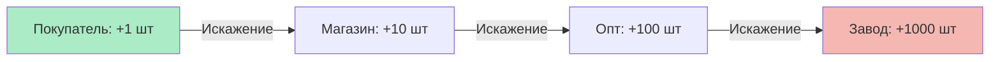

# 🐂 Week 5 - Day 4: Эффект Хлыста (Bullwhip Effect)

> **Цель**: Увидеть, как маленькое изменение спроса вызывает катастрофу на заводе.

## Суть эффекта

Представьте хлыст. Легкое движение запястьем (Покупатель) вызывает огромную амплитуду на конце хлыста (Завод).

1.  **Покупатель**: Купил на 1 пачку памперсов больше (случайно).
2.  **Магазин**: "Ого, спрос растет! Закажу-ка я 10 пачек про запас".
3.  **Дистрибьютор**: "Ого, магазин просит 10! Закажу у завода 100, чтобы фуру заполнить".
4.  **Завод**: "Спрос вырос на 100! Строим новый цех!"

**Итог**: Через месяц спрос вернулся в норму. У всех склады забиты. Завод увольняет людей.

## Причины

1.  **Прогнозы (Forecasting)**: Мы пытаемся угадать будущее, и ошибаемся.
2.  **Batching (Партии)**: Заказываем редко, но много (чтобы сэкономить на доставке).
3.  **Акции**: Искусственно раздуваем спрос в один день.

## Решение TOC?

Перестать прогнозировать!
Перестать проталкивать (Push).
Начать вытягивать (Pull).
Покупать только то, что **реально продано** вчера.

## 📝 Задание
Вспомните "Туалетную панику" в COVID-19.
Как Эффект Хлыста сработал там?
*   Люди (Потребители) купили чуть больше.
*   Магазины увидели пустые полки и удвоили заказы.
*   Заводы начали работать в 3 смены.
*   Итог: Сейчас у всех дома запас бумаги на год, продажи упали до нуля.

## Следующие шаги
- [[Week 5 - Day 5: Дилемма ритейлера: Держать много vs Держать мало]]
