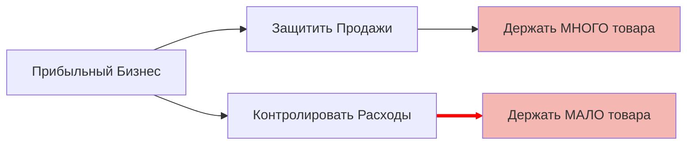

# 🌩 Week 5 - Day 5: Грозовая Туча (Конфликт)

> **Цель**: Решить основной конфликт ритейлера с помощью логики TOC.

## Conflict Cloud (Диаграмма Грозовая Туча)

В TOC любую проблему рисуют как конфликт двух потребностей.

*   **Цель А**: Быть прибыльным ритейлером.
*   **Условие B**: Чтобы защитить продажи... -> **Надо держать МНОГО товара** (чтобы клиент всегда нашел что хочет).
*   **Условие C**: Чтобы контролировать расходы... -> **Надо держать МАЛО товара** (чтобы не замораживать кэш и не списывать).

**Конфликт**: D и D' противоречат друг другу. Мы мечемся: то затарим склад (и списываем), то высушим (и теряем продажи).

## Прорыв (Injection)

Как разорвать конфликт? Найти неверное предположение (Assumption).
*Предположение*: "Единственный способ иметь товар на полке — это заказать его огромную кучу за полгода".

**Ложь!**
Можно иметь товар на полке, если **пополнять его часто и мелкими партиями**.
Тогда:
1.  Товара много (Ассортимент есть).
2.  Товара мало (Запас в штуках низкий).

Мы получаем "И то, и другое".

## 📝 Задание
Подумайте, как работают пекарни?
У них свежий хлеб утром. К вечеру пусто.
Они не пекут хлеб на месяц вперед. Они разорвали конфликт через частое производство (каждый день).
Как применить это к магазину одежды? (Zara делает именно это).

## Следующие шаги
- [[Week 5 - Day 6: Анализ P&L через призму TOC]]
