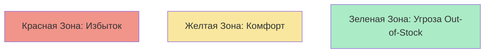

# 🚦 Week 6 - Day 1: DBM (Dynamic Buffer Management)

> **Цель**: Автопилот для вашего склада. Как заказывать товар без прогнозов?

## Буфер (Buffer)

В TOC мы не используем слово "Запас" (Stock). Мы говорим **Буфер**.
Буфер — это защита от неопределенности (Мерфи).
Его цель — защитить Проход (Throughput).

## Светофор DBM

Мы делим Буфер на 3 зоны:
*   **Зеленая зона (0-33%)**: Опасно мало товара! Мерфи близко!
*   **Желтая зона (33-66%)**: Норма.
*   **Красная зона (66-100%)**: Слишком много товара!

## Алгоритм DBM

Вместо того чтобы гадать "Сколько продадим?", мы смотрим "Где мы сейчас?".
1.  **Если мы долго в Зеленой зоне** (Товар улетает) -> **Увеличить Буфер на 33%**.
2.  **Если мы долго в Красной зоне** (Товар лежит) -> **Уменьшить Буфер на 33%**.
3.  **Если мы в Желтой** -> Ничего не менять.

Система сама адаптируется под реальный спрос! Если спрос вырос, буфер вырастет сам. Если упал — буфер сдуется. **Без участия человека.**

## 📝 Задание
Товар "Зонтик".
*   Буфер = 90 шт.
*   Зоны: Зеленая (0-30), Желтая (30-60), Красная (60-90).
*   Вчера продали 10 шт. Остаток стал 25 шт.

**Анализ**:
1.  25 шт — это Зеленая зона.
2.  Если мы просидим в Зеленой зоне еще пару дней, алгоритм скажет: "Спрос вырос! Новый Буфер = 120 шт".

## Следующие шаги
- [[Week 6 - Day 2: Пополнение по потребности (Pull Replenishment)]]
