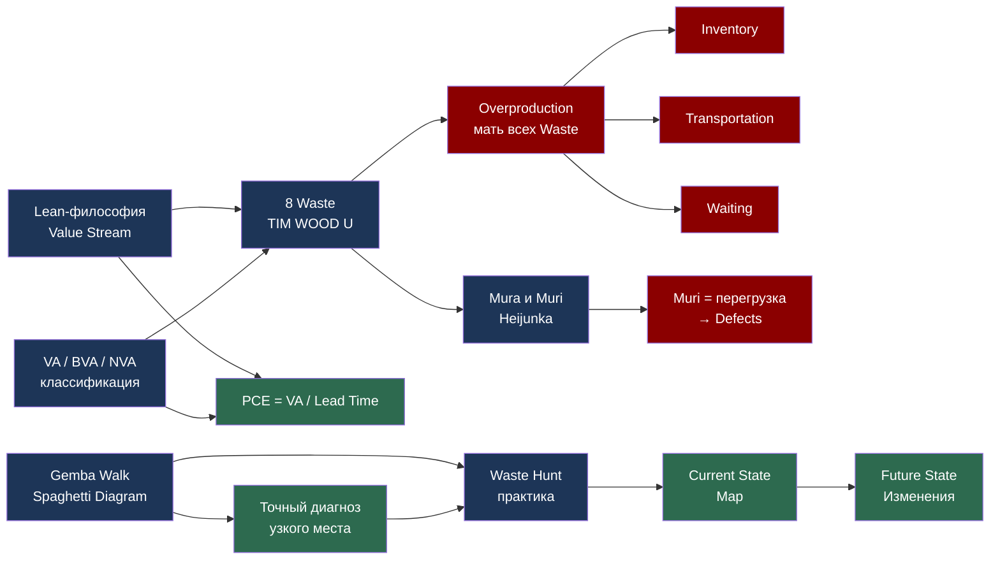

# День 7. Архитектура Потока — Итоговый Лонгрид Недели 1

> **Цель урока:** Увидеть, как концепции Недели 1 образуют единую систему мышления — через четыре реальные истории трансформации в разных индустриях, от послевоенного Нагоя до московского банка.
> **Компетенции:** Интеграция инструментов недели (Lean-философия, 8 видов Waste, Mura/Muri, VA/NVA, Gemba Walk, Waste Hunt) на реальных кейсах; понимание, как Current State диагностируется и трансформируется в Future State; пять ментальных моделей операционного детектива.
> **Время чтения:** ~110 минут.

---

## Оглавление

- [[#Часть 1. Итог Недели — Executive Summary и Карта Пути|Часть 1. Итог Недели — Executive Summary и Карта Пути]]
- [[#Часть 2. Введение — Неделя как детективное расследование|Часть 2. Введение — Неделя как детективное расследование]]
- [[#Часть 3. Кейс 1 — Toyota Production System. Рождение потока из бедности|Часть 3. Кейс 1 — Toyota Production System. Рождение потока из бедности]]
- [[#Часть 4. Кейс 2 — Amazon Fulfillment Center. Одиннадцать миль в никуда|Часть 4. Кейс 2 — Amazon Fulfillment Center. Одиннадцать миль в никуда]]
- [[#Часть 5. Кейс 3 — Больница Johns Hopkins. Когда Waiting убивает буквально|Часть 5. Кейс 3 — Больница Johns Hopkins. Когда Waiting убивает буквально]]
- [[#Часть 6. Кейс 4 — Банк «Правобережный». Четырнадцать дней за пять подписей|Часть 6. Кейс 4 — Банк «Правобережный». Четырнадцать дней за пять подписей]]
- [[#Часть 7. Карта связей — как Дни 1–6 образуют систему|Часть 7. Карта связей — как Дни 1–6 образуют систему]]
- [[#Часть 8. Пять ментальных моделей операционного детектива|Часть 8. Пять ментальных моделей операционного детектива]]
- [[#Часть 9. Самодиагностика — Квиз недели|Часть 9. Самодиагностика — Квиз недели]]
- [[#Часть 10. Вопросы для глубокой рефлексии|Часть 10. Вопросы для глубокой рефлексии]]
- [[#Часть 11. Пять типичных ошибок новичка|Часть 11. Пять типичных ошибок новичка]]
- [[#Часть 12. Библиотека — книги операционного детектива|Часть 12. Библиотека — книги операционного детектива]]
- [[#Часть 13. Кино и подкасты|Часть 13. Кино и подкасты]]
- [[#Часть 14. Тизер Недели 2 — Current State на бумаге|Часть 14. Тизер Недели 2 — Current State на бумаге]]

---

## Часть 1. Итог Недели — Executive Summary и Карта Пути

Неделя 1 была не набором отдельных уроков. Это было детективное расследование, которое разворачивалось по одной логике: сначала мы получили язык, потом словарь, потом научились слышать ритм процесса, научились классифицировать, наблюдать и, наконец, охотиться на потери в реальных данных. Каждый день был одной главой одного детектива — и сегодня мы читаем финал первого тома.

Прежде чем погрузиться в четыре большие истории, сделаем остановку и зафиксируем карту пути: что именно мы изучили и как это связано.

| День | Тема | Ключевой инструмент | Кейс | Главный урок |
|:---|:---|:---|:---|:---|
| [[Week 1 - Day 1 - Intro to Lean and VSM\|День 1]] | Lean-философия и Value Stream | PCE, Lead Time | Collins Manufacturing: PCE 2% → 18% | Большинство процессов тратят 95-98% времени впустую |
| [[Week 1 - Day 2 - The 8 Wastes\|День 2]] | 8 типов Waste — TIM WOOD U | TIM WOOD U классификатор | MedCore Pharma: $2.1M скрытых потерь в год | Потери невидимы без инструмента — но измеримы в деньгах |
| [[Week 1 - Day 3 - Mura and Muri\|День 3]] | Mura и Muri — неравномерность и перегрузка | Heijunka, Takt Time | Автозавод: пиковый спрос → перегрузка → брак | Mura порождает Muri — прежде чем устранять Muda, выровняй поток |
| [[Week 1 - Day 4 - VA vs NVA\|День 4]] | VA / BVA / NVA классификация | VA/NVA анализ операций | Фармацевтический завод: 87% операций — NVA | Клиент платит только за VA; всё остальное — расходы владельца |
| [[Week 1 - Day 5 - Gemba Walk\|День 5]] | Gemba Walk — наблюдение на месте | Spaghetti Diagram, 5 Why | ТехМета: 64 часа ожидания из 104 Lead Time | Данные с рабочего места важнее любого отчёта из кабинета |
| [[Week 1 - Day 6 - Practice Waste Hunt\|День 6]] | Практический Waste Hunt | TIM WOOD U + VA/NVA + Gemba | Офисный процесс согласования: PCE 0.09% | Lean применим везде — от завода до заявки на отпуск |

Шесть дней — шесть слоёв одной и той же системы мышления. Сегодня мы накладываем все слои друг на друга и смотрим, что получается.

Цифры этой недели заслуживают отдельного внимания. Collins Manufacturing: PCE вырос с 2% до 18% — в девять раз. MedCore Pharma: $2.1 миллиона скрытых потерь в год при выручке $45 миллионов — это 4,7% выручки, которые просто сгорали без следа. ТехМета: из 104 часов Lead Time 64 часа — чистое ожидание, 62% времени. Офисный процесс согласования: PCE 0,09% — один из самых низких показателей, которые вообще встречаются в реальных процессах. Эти цифры не случайные примеры. Они репрезентативны: большинство процессов мира — производственных, сервисных, офисных — имеют PCE от 1% до 20%. Это означает, что 80-99% времени любого процесса — это не ценность. Это либо ожидание, либо движение, либо переделка.

Понять это интеллектуально — легко. Увидеть это в своём процессе — требует инструментов, которые мы изучали на этой неделе. Применить это — требует смелости, потому что Lean всегда показывает неудобную правду.

%%IMAGE_PROMPT%%
Референсы: прикрепи visual_prompts.md как якорь стиля.
Стиль: Научная гравюра XIX века на состаренном пергаменте (#F5E6D3). Чёткие чернильные линии, штриховка. Акварельная тонировка: бирюзовый (#4C8C8F), красный (#A93226), золотой (#C9A84C). Шрифт с засечками. ВЕСЬ ТЕКСТ СТРОГО НА РУССКОМ. Без людей.
Содержание: Горизонтальная временная шкала «Неделя 1» с 6 точками — День 1 по День 6. Каждая точка: название темы + ключевой инструмент + одна ключевая цифра результата. Стрелки между точками показывают логическую связь. Цветовое кодирование: синий = концепция, красный = инструмент, зелёный = результат.
Формат: широкоформатный горизонтальный (16:9)
Заголовок: "Неделя 1: Архитектура Потока"
Подзаголовок: "От языка к действию — шесть шагов операционного детектива"
Подпись под изображением: "Каждый день недели — один слой системы мышления. Сегодня мы накладываем все слои и видим полную картину."
%%END_IMAGE_PROMPT%%

---

## Часть 2. Введение — Неделя как детективное расследование

Представьте: вы следователь. Вам дали дело — компания теряет деньги, но никто не понимает, где именно. Жалобы есть. Гипотезы есть. Конкретных улик — нет.

Именно так начинается любое Lean-расследование. И именно так построена наша Неделя 1.

В День 1 вы получили язык расследования. Не набор инструментов — именно язык. Потому что без языка вы не можете ни задать правильный вопрос, ни услышать правильный ответ. Value Stream — это не схема. Это способ видеть организацию глазами продукта или заказа клиента. PCE — это не формула. Это диагноз: какой процент времени существования в системе продукт действительно создаёт ценность? Когда вы увидели на Day 1, что Collins Manufacturing имела PCE 2% — это был первый удар по привычной картине мира: «мы работаем, значит всё нормально».

В День 2 вы получили словарь улик. Восемь видов Waste — это не академическая классификация. Это восемь паттернов, по которым потери прячутся в любом процессе мира. TIM WOOD U — аббревиатура, которую вы теперь видите в каждой операции автоматически. Ожидание? Это Waiting. Лишние движения? Motion. Горы незавершённых дел? Inventory. Перепроизводство — коварнейшая из потерь, потому что она выглядит как работа, но создаёт все остальные семь видов Waste.

В День 3 вы узнали, что у потерь есть корень, который глубже восьми видов Waste. Mura — неравномерность ритма — порождает Muri — перегрузку людей и машин. А Muri порождает Muda — сами потери. Детектив, который ищет только симптомы, никогда не поймает преступника. Нужно искать первопричину. И первопричина чаще всего — неравномерный поток, а не ленивые рабочие и не плохое оборудование.

В День 4 вы научились сортировать улики по категориям. Не все операции одинаково виноваты. VA — это то, за что клиент готов платить. BVA — то, что нужно бизнесу, но не добавляет ценности для клиента. NVA — чистые потери, которые нужно устранить немедленно. Этот инструмент меняет разговор: вместо «у нас мало людей» появляется вопрос «а чем именно заняты наши люди?»

В День 5 вы вышли из кабинета. Gemba Walk — это принципиальный разрыв с управлением по отчётам. Данные, которые вы видите в системе — это прошлое и усреднение. Данные, которые вы видите на месте — это реальность прямо сейчас. Spaghetti Diagram — самый честный документ, который можно создать на предприятии: красная линия, которая мечется по цеху, показывает движение продукта (или рабочего) без прикрас. Её нельзя приукрасить в PowerPoint.

В День 6 вы применили всё в связке. Waste Hunt — это уже не учебное упражнение, а навык. Вы брали реальный кейс, классифицировали операции, считали потери в деньгах, находили узкое место. Это был первый раз, когда вся система инструментов работала как единый механизм.

Есть одна вещь, которая объединяет все шесть дней: в каждом случае знание меняло способ видеть, а не просто добавляло термин в словарь. После Дня 2 вы начали видеть Waste там, где раньше видели «нормальную работу». После Дня 5 вы начали смотреть на процессы с вопросом «а что происходит между операциями?» — а не только «насколько эффективна каждая операция». Это принципиальный сдвиг. Lean — это не методология. Это способ видеть.

Сегодня, в День 7, мы смотрим на эти шесть дней через четыре большие истории. Каждая история — из разной индустрии. Каждая — про одно и то же: невидимые потери, наблюдение, диагноз и трансформацию. И в каждой вы узнаете инструменты, которые уже знаете.

> [!TIP] Вопрос для самодиагностики
> Какой из шести дней недели изменил вашу точку зрения сильнее всего? Где именно произошёл щелчок — «я вижу это в своём процессе»? Держите эту точку в голове — она и есть ваш личный рычаг изменений.

---

## Часть 3. Кейс 1 — Toyota Production System. Рождение потока из бедности

**Контекст.**

1950 год. Нагоя, Япония. Toyota Motor Company производит 2 685 автомобилей в год. Ford в тот же год — 7 000 автомобилей в день. Японская экономика разрушена войной. Иены нет. Кредитов нет. Огромных производственных площадей нет. Послевоенный договор ограничивает реструктуризацию. Эйдзи Тойода посещает завод River Rouge компании Ford в Детройте и возвращается в Японию с одним выводом: копировать масштаб невозможно. Денег нет. Места нет. Людей нет. Нужно что-то принципиально другое.

Тайити Оно, инженер без MBA, не стал читать американские учебники. Он пошёл в цех. И начал наблюдать.

**Симптомы — Current State 1950 года.**

То, что Оно увидел, было типичным массовым производством эпохи Форда: каждый цех работал с максимальной локальной эффективностью, абсолютно не заботясь о соседнем. Штамповочный пресс штамповал детали партиями по 10 000 штук — потому что переналадка занимала 8 часов, и экономически «выгоднее» было делать больше за один раз. Эти 10 000 деталей складывались на огромных стеллажах. Потом, через несколько недель, их забирали на сварку — но за это время часть деталей успевала деформироваться или покрыться ржавчиной. На конечной сборке выясняли, что 40% деталей имеют дефекты. Поэтому существовал огромный отдел контроля качества — более 200 человек, которые делали одно: сортировали брак от годного.

Цикл производства — от первой операции до готового автомобиля — занимал 26 дней. Из них реальная добавленная ценность (сварка, окраска, сборка) составляла, по оценкам, менее 2 дней. PCE был ниже 8%.

Разберём это через язык Недели 1:

**Waste анализ (связь с Днём 2 — TIM WOOD U):**

- **Overproduction** — штамповочный цех производил детали на несколько недель вперёд. Это порождало всё остальное.
- **Inventory** — стеллажи с десятками тысяч деталей между каждым переходом. Деньги, застывшие в металле.
- **Transportation** — детали перемещались по огромному заводу несколько раз: от пресса на склад, со склада в сварку, из сварки на склад, со склада на сборку.
- **Motion** — рабочие на сборке ходили за инструментами в общий ящик, искали нужную деталь в стеллаже.
- **Waiting** — сборочная линия регулярно останавливалась: не хватало детали, или нужная деталь оказалась бракованной.
- **Defects** — 40% брака на конечной сборке. 200+ человек в контроле качества. Это не контроль — это управление катастрофой после факта.
- **Overprocessing** — дублирование проверок. Каждый цех проверял входящие детали, потому что не доверял предыдущему.
- **Unutilized Talent** — рабочие, которые видели брак, не имели права останавливать линию. Знание — было. Полномочий — не было.

**Mura и Muri (связь с Днём 3):**

Неравномерность была встроена в систему. Штамповочный цех работал мощными рывками — 10 000 деталей, потом пауза на переналадку. Сварочный цех работал более равномерно. Сборка зависела от наличия деталей. Эта рассогласованность — классическая Mura — создавала постоянную Muri: то сборщики простаивали (нет деталей), то работали в авральном режиме (партия пришла, надо срочно освоить). Аварийный режим порождал ошибки. Ошибки — брак. Брак — снова аврал.

**VA/NVA классификация (связь с Днём 4):**

Оно провёл первичный анализ, который сегодня мы бы назвали VA/NVA:
- Сварка = VA (клиент платит за соединение деталей)
- Окраска = VA
- Итоговая сборка = VA
- Хранение деталей на складе = NVA (чистые потери)
- Транспортировка между цехами = NVA
- Контроль качества после факта = BVA в лучшем случае, NVA в реальности — потому что дефект уже создан

Итог: примерно 92% времени существования детали в системе — не-ценность.

**Gemba как метод диагностики (связь с Днём 5):**

Оно не сидел в кабинете с отчётами. Он ходил по цеху и рисовал кружки на полу — буквально очерчивал место, где должен стоять инженер и наблюдать. Он требовал не читать данные, а видеть реальность. Один из его знаменитых инструментов — стоять в кружке восемь часов и наблюдать один процесс. Это и есть первичный Gemba Walk: не обход цеха галопом, а глубокое наблюдение одной точки потока.

**Решение — Future State:**

Оно начал менять систему по одному принципу: поток, а не партии. Три ключевых решения:

Первое — Just-In-Time. Производить именно то, что нужно, именно тогда, когда нужно, именно в нужном количестве. Звучит просто. Реализовать — революционно. Это означало: никаких больших партий, никаких складов между операциями, синхронизация темпа производства с темпом потребления.

Второе — Kanban. Сигнальная система, которая управляет движением деталей по принципу вытягивания, а не выталкивания. Предыдущий цех производит деталь не потому, что может, а потому что следующий цех подал сигнал — нужна деталь. Это перевернуло логику массового производства с головы на ноги.

Третье — Jidoka. Право и обязанность каждого рабочего остановить линию при обнаружении дефекта. Это казалось безумием: остановить всё производство из-за одной детали? Но Оно понял: дефект, обнаруженный сразу, стоит ремонта одной детали. Дефект, обнаруженный на конечной сборке через 26 дней, стоит разборки готового автомобиля.

**Перелом.**

Переналадка пресса занимала 8 часов. Это была «физическая константа», которую никто не оспаривал. Оно задал вопрос: а почему 8 часов? Инженеры объяснили: нужно снять штамп (2 часа), поставить новый (2 часа), отрегулировать (4 часа). Оно разделил работу на внутреннюю (машина стоит) и внешнюю (можно делать пока машина работает). Подготовил стандартный инструмент. Внедрил стандартную процедуру. Через несколько итераций переналадка заняла 10 минут. Это стало основой метода SMED (Single-Minute Exchange of Die). Экономическое обоснование больших партий рухнуло.

**Результат — таблица Current State vs Future State:**

| Метрика | Current State (1950) | Future State (1965) | Изменение |
|:---|:---|:---|:---|
| Lead Time производства | 26 дней | 4 дня | -85% |
| Брак на конечной сборке | 40% | 6% | -85% |
| Численность отдела контроля качества | 200+ человек | ~30 человек | -85% |
| PCE | ~8% | ~18% | +125% |
| Переналадка пресса | 8 часов | 10 минут | -98% |
| WIP (деталей между операциями) | Тысячи | Десятки | -95% |

**Международный контекст: почему TPS не скопировали за 30 лет.**

Когда в 1973 году нефтяной кризис ударил по мировой автомобильной промышленности, Toyota оказалась единственным крупным автопроизводителем, который не только выжил, но и вырос. Остальные — GM, Ford, Chrysler — несли огромные убытки. Именно тогда западные менеджеры начали изучать Toyota. Они приезжали, смотрели и уезжали с одним выводом: «Мы это уже пробовали. У нас другая культура. У них иерархическое общество — поэтому работает». Это было неверное объяснение.

Истинная причина, по которой TPS было сложно скопировать — не культура. Это философия: Lean — это не набор инструментов, который внедряется сверху. Это способ мышления, который растёт снизу, от рабочего, который видит потери и имеет право и обязанность их устранять. Kanban можно скопировать за неделю. Jidoka — за месяц. Культуру, в которой оператор останавливает всё производство ради качества и получает за это не выговор, а похвалу — это строится годами.

**Урок.**

Toyota Production System — это не набор инструментов. Это следствие одного вопроса, который Тайити Оно задавал снова и снова: «Почему это происходит именно так?» И каждый раз, когда система отвечала «потому что так всегда было», Оно шёл в цех и проверял. Он никогда не принимал «так устроен мир» за правду без доказательства.

Пятьдесят лет спустя тот же вопрос задают в больницах, банках и IT-командах по всему миру. И каждый раз находят те же восемь видов Waste. Потому что потери не знают отрасли.

> [!NOTE] 1950–1965: Рождение Toyota Production System
> Доминирующая парадигма: массовое производство большими партиями = эффективность.
> Кризис: Toyota не может конкурировать с Ford по масштабу — денег, площади и людей нет.
> Решение: Тайити Оно создаёт систему потокового производства — JIT + Kanban + Jidoka.
> Влияние сегодня: каждый принцип VSM, который вы изучаете в этом курсе, восходит к этим пятнадцати годам экспериментов в Нагоя.

> [!TIP] Вопрос для самодиагностики
> В вашем процессе есть ли что-то, что делается «большими партиями» только потому, что так всегда делалось? Переналадка, согласование, отчёт — что стоит проверить на реальную необходимость объёма?

---

## Часть 4. Кейс 2 — Amazon Fulfillment Center. Одиннадцать миль в никуда

**Контекст.**

2013 год. Склад Amazon в Свансеа, Уэльс. Площадь — 93 000 квадратных метров, что сопоставимо с 13 футбольными полями. Один миллион SKU (уникальных товарных позиций). В предпраздничный сезон — 300 000 заказов в день. Здесь работают тысячи «пикеров» — людей, которые ходят по складу, собирают товары и доставляют их на упаковочную линию. Система работает. Заказы уходят вовремя. Выручка растёт. Со стороны всё выглядит как победа операционной эффективности.

Но в 2013 году журналист BBC Адам Лилли прошёл смену пикером на складе Amazon. Его репортаж изменил общественную дискуссию об условиях труда. Одна деталь в репортаже не была оценена по достоинству с операционной точки зрения: рабочие проходили пешком 11 миль (около 18 километров) за рабочую смену.

**Симптомы — что видели менеджеры.**

По отчётам производительность склада была приемлемой. Заказы выполнялись в срок. Throughput (пропускная способность) казался нормальным. KPI по ошибкам пикинга держались в допустимых границах. То, что рабочие проходили 11 миль за смену — не было явным операционным показателем. Это была «норма».

**Диагноз — VA/NVA анализ операций склада (связь с Днём 4).**

Давайте пройдём по типичной операции пикера и классифицируем каждый шаг:

| Операция | Тип | Описание |
|:---|:---|:---|
| Получение задания (сканирование терминала) | BVA | Нужно для системы, клиент не видит |
| Ходьба к полке A-47 | NVA | Motion Waste — перемещение без ценности |
| Поиск товара на полке | NVA/BVA | Если товар не там, где должен — чистые потери |
| Взятие товара (физически) | VA | Клиент заказал именно этот товар |
| Сканирование товара | BVA | Нужно для учёта |
| Ходьба к следующей полке | NVA | Motion Waste |
| Ходьба на упаковочную станцию | NVA | Transportation Waste |
| Упаковка | VA | Клиент ожидает упакованный товар |
| Ожидание ленты (если занята) | NVA | Waiting Waste |

Итог: из примерно 9 операций в цикле пикера — только 2 добавляют ценность. PCE по времени — порядка 15-20%. Но главная потеря не в проценте — а в том, что 11 миль в день — это физически неустойчивая нагрузка, которая ведёт к травмам, больничным, текучести кадров.

**Waste идентификация (связь с Днём 2 — TIM WOOD U):**

- **Motion** — доминирующий Waste. Пикеры проходят 18 км в смену. При 1000 пикерах на смене — суммарно 18 000 км в день. Это не преувеличение — это чистые потери рабочего времени и человеческого здоровья.
- **Transportation** — товары перемещаются на упаковочную станцию, потом в зону сортировки, потом на погрузку. Каждый метр — это время и деньги.
- **Waiting** — в пиковые часы упаковочные ленты перегружены. Пикеры ждут очереди с товаром в руках.
- **Inventory** — огромный склад сам по себе является формой Inventory Waste: каждый товар, лежащий на полке, — это замороженный капитал. Миллион SKU означает миллион позиций, по которым нужно управлять запасами.

**Mura в праздничный сезон (связь с Днём 3):**

Классическая Mura Amazon — праздничный пик. В обычное время склад обрабатывает 50 000 заказов в день. В Чёрную Пятницу — 300 000. Этот шестикратный всплеск — чистая неравномерность. Он порождает Muri: пикеры работают сверхурочно, оборудование перегружено, ошибки растут. В 2011-2012 годах Amazon нанимал тысячи временных рабочих на праздничный сезон и увольнял после — это было следствием неспособности сгладить Mura.

**Gemba Walk как метод раскрытия правды (связь с Днём 5):**

Вот ключевой вопрос: почему журналист BBC раскрыл операционную проблему раньше, чем менеджеры Amazon? Ответ прямо из урока про Gemba Walk: менеджеры управляли по данным. Данные показывали: заказы выполняются, KPI в норме. Никто не ходил 11 миль вместе с пикером.

Это классическая иллюзия, от которой предостерегает Gemba Walk: процесс кажется эффективным, если смотреть на агрегированные метрики. Он обнажает реальность только тогда, когда ты идёшь по цеху вместе с продуктом — или в данном случае, вместе с человеком, который этот продукт несёт.

**Решение — рандомный stow и роботы Kiva.**

Amazon знал о проблеме Motion Waste. Решение пришло с двух сторон.

Первая — алгоритмическая. Интуитивно казалось, что товары нужно расставлять по категориям: книги с книгами, электроника с электроникой. Но анализ показал: если хранить товары рандомно (случайный алгоритм размещения при приёмке), маршруты пикеров становятся короче, потому что алгоритм сборки заказа может оптимизировать ходьбу — пикер берёт товары по пути, а не идёт сначала в одну зону, потом в другую. Контринтуитивное решение: хаотичное хранение = более короткий маршрут.

Вторая — роботизация. В 2012 году Amazon приобрёл компанию Kiva Systems за $775 миллионов. Роботы Kiva не заменяют пикеров — они меняют логику движения. Вместо того чтобы пикер шёл к полке, полка едет к пикеру. Это радикальная трансформация: Motion Waste устраняется не через оптимизацию маршрута, а через переосмысление того, кто должен двигаться.

**Kaizen команды.**

Параллельно с технологическими решениями Amazon внедрил Kaizen-команды на складах — небольшие рабочие группы, которые собираются еженедельно и ищут улучшения в конкретных операциях. Это прямое применение принципа Gemba: люди, которые делают работу каждый день, видят потери лучше, чем менеджеры с данными.

**Результат.**

| Метрика | До роботов Kiva | После Kiva (2015) | Изменение |
|:---|:---|:---|:---|
| Средний маршрут пикера за смену | 11 миль (18 км) | 4-5 миль (6-8 км) | -40-55% |
| Throughput заказов/час на сотрудника | Базовый уровень | +50% к базовому | +50% |
| Площадь склада на единицу товара | Базовый уровень | -50% (хранение плотнее) | -50% |
| Время от заказа до упаковки | ~60-90 минут | ~15-30 минут | -50-75% |

**Дополнительный контекст: цена Motion Waste в цифрах.**

Давайте посчитаем, что означают 11 миль в рабочий день в деньгах. Средний пикер Amazon в 2013 году получал $11-12 в час. Смена — 10 часов. Скорость ходьбы — 3 мили в час. 11 миль ходьбы = примерно 3,5 часа движения без добавления ценности. Это $38-42 в смену на Motion Waste — только на одного человека. Умножьте на 1 000 пикеров в одном складе в пиковый сезон: $38 000 - $42 000 в день потерь только на Motion Waste в одном складе. По всем складам Amazon (более 100 в США в 2013 году) — цифра становится астрономической. Именно так Motion Waste в 11 миль превращается в обоснование инвестиции в Kiva Systems за $775 миллионов: срок окупаемости — несколько лет, а не десятилетий.

**Урок.**

История Amazon — это история о том, как Motion Waste может быть «невидимым» при управлении по KPI и «очевидным» при Gemba Walk. 11 миль в день — это не цифра из отчёта. Это реальность, которую можно увидеть только пройдя смену. И когда Amazon увидел эту реальность, решение оказалось контринтуитивным: не оптимизировать движение пикера, а убрать необходимость движения вообще.

> [!TIP] Вопрос для самодиагностики
> Сколько «миль» проходит ваш коллега или вы сами за рабочий день — в переносном смысле? Сколько переключений между системами, хождений за подписью, поиска информации по разным источникам? Посчитайте время только этих переходов — и вы увидите свой Motion Waste.

---

## Часть 5. Кейс 3 — Больница Johns Hopkins. Когда Waiting убивает буквально

**Контекст.**

2004 год. Балтимор, штат Мэриленд. Больница Johns Hopkins — один из ведущих медицинских центров мира, входит в тройку лучших больниц США по версии US News & World Report. Репутация безупречная. Исследования мирового уровня. Хирурги — звёзды в своих областях.

В том же 2004 году Journal of American Medical Association публикует исследование: медицинские ошибки являются третьей по частоте причиной смерти в США — после болезней сердца и онкологии. 98 000 человек ежегодно. Из них значительная часть — не ошибки диагностики или хирургии. Это системные сбои: неправильный препарат, пациент без информации, задержка операции из-за незаполненной формы.

Johns Hopkins принял вызов первым среди топовых клиник. Вместо того чтобы защищаться, клиника пригласила Lean-консультантов из производственного сектора — что было революционным решением в 2004 году.

**Waste анализ в операционном блоке.**

Первый шаг — построить Value Stream Map для пути пациента от поступления в операционную до завершения процедуры. То, что увидела команда, было знакомо любому специалисту по Lean — только вместо деталей здесь были люди.

**Waiting (главный Waste):**

Пациент поступал в операционную в 7:30 — запланированное время начала операции. Хирург появлялся в 8:15. Почему? Предыдущая операция задержалась. Почему задержалась? Не было нужных инструментов в стерилизованном состоянии. Почему не было инструментов? Не существовало стандартного набора инструментов для данного типа операции — каждый хирург формировал список индивидуально, иногда за несколько часов до операции. Пациент ждал в операционной 45 минут — не в палате, а именно в операционной, занимая дорогостоящее помещение.

Стоимость одной операционной в Johns Hopkins — около $2 000 в час. 45 минут ожидания = $1 500 выброшенных долларов. Умножьте на 12-15 операций в день, на 300 операционных дней в году — это $6-7 миллионов потерь только на одном типе задержки.

**Overprocessing (дублирование документов):**

Анестезиолог заполнял анамнез пациента. Хирург заполнял анамнез пациента. Медсестра заполняла анамнез пациента. Три разных формы, которые никогда не сравнивались автоматически. Если в одной форме была ошибка или противоречие — никто не знал, пока операция не заходила в проблему. Это классический Overprocessing: троекратная работа, которая не только не добавляет ценности, но создаёт риск.

**Motion медицинских сестёр:**

Медсестра за смену проходила 3-4 мили, большую часть — в поисках расходных материалов. Перчатки в одном шкафу. Шприцы в другом. Перевязочные материалы — в третьем. Пополнение запасов происходило хаотично. Стандартного места хранения не было. Каждый раз медсестра тратила 2-5 минут на поиск нужного расходника — это было нормой, которую никто не замечал, потому что это было «так устроено».

**5 Why анализ задержки операций (связь с Днём 5).**

Команда применила метод 5 Why — одну из техник, которую Оно ввёл в Toyota как стандартный инструмент анализа первопричины.

- Почему операция задерживается? — Хирург ждёт инструментов.
- Почему нет инструментов? — Стерилизация не завершена к нужному времени.
- Почему стерилизация не завершена? — Список инструментов передан слишком поздно.
- Почему список передан поздно? — Нет стандартного протокола — каждый хирург формирует список индивидуально.
- Почему нет стандартного протокола? — Никто не устанавливал стандарт; считалось, что хирург лучше знает.

Первопричина найдена: отсутствие стандартизации на входе в операционный процесс. Решение не требует новых людей или нового оборудования. Оно требует стандарта.

**VA/NVA в медицинском процессе (связь с Днём 4):**

| Операция | Тип | Примечание |
|:---|:---|:---|
| Хирургическое вмешательство | VA | Ради этого пациент и находится здесь |
| Анестезия | VA | Необходима для проведения операции |
| Ожидание хирурга (45 мин) | NVA | Пациент занимает операционную без ценности |
| Заполнение трёх форм анамнеза | Overprocessing/NVA | Дублирование без добавленной ценности |
| Поиск расходников медсестрой | NVA | Motion Waste в критической среде |
| Стерилизация инструментов | BVA | Обязательно, но не ценность для пациента |
| Проверка перед операцией (checklists) | BVA (но критично) | Требование безопасности |

**Решение — Future State.**

Команда предложила два структурных изменения.

Первое — стандартизированные наборы инструментов для каждого типа операции. Вместо индивидуальных списков — предварительно утверждённые наборы по типам процедур. Хирург может добавить специфические инструменты, но базовый набор стандартный. Это позволяет стерилизации планировать работу заранее, а не реагировать на запросы в последний момент.

Второе — pre-procedure checklist. Вдохновлённый авиационной индустрией, где чеклисты перед вылетом — стандарт с 1930-х годов. В медицине чеклист до операции казался оскорблением для хирурга-профессионала. Но данные говорили другое: в авиации чеклисты снизили количество катастроф по причине человеческой ошибки на 43% за 20 лет после их введения. Введение хирургического чеклиста в Johns Hopkins стало первым шагом к тому, что в 2008 году ВОЗ внедрит как глобальный стандарт — Surgical Safety Checklist.

Третье — реорганизация хранения расходников по принципу «5С» (японская система организации рабочего места): каждый материал имеет фиксированное место, обозначенное визуально. Медсестра не ищет — она берёт.

**Результат.**

| Метрика | Current State | Future State | Изменение |
|:---|:---|:---|:---|
| Среднее опоздание начала операции | 45 минут | 10-12 минут | -70-75% |
| Продуктивных операционных часов/день | 6.5 часов | 8.5 часов | +2 часа |
| Задержки из-за отсутствия инструментов | 3-4 раза/день | 0-1 раз/день | -60-75% |
| Motion медсестёр (поиск расходников) | 35 мин/смену | 8 мин/смену | -77% |

**Влияние на глобальный стандарт.**

История Johns Hopkins не закончилась внутри одной больницы. В 2007 году Всемирная Организация Здравоохранения запустила инициативу «Safe Surgery Saves Lives». В 2008 году был опубликован Surgical Safety Checklist ВОЗ — прямой потомок того, что началось с Lean-анализа операционного процесса в Johns Hopkins. Исследование, опубликованное в New England Journal of Medicine в 2009 году, показало: внедрение чеклиста в 8 больницах мира снизило послеоперационные осложнения на 36% и смертность на 47%. Три строки стандарта — «нет инструментов → нет стандарта → нет чеклиста» — превратились в инструмент, который ежегодно спасает десятки тысяч жизней. Это и есть масштаб, которого достигает Lean, когда применяется не как корпоративная программа эффективности, а как системное мышление.

**Урок.**

Johns Hopkins был одним из лучших медицинских учреждений мира — и при этом имел PCE операционного процесса ниже 70%. Это история о том, что репутация и эффективность процесса — разные вещи. Waste существует не потому что люди плохи или некомпетентны. Он существует потому что система не была спроектирована думая о потоке. И Lean не критикует хирургов — он задаёт один вопрос: «Как мы можем устроить систему так, чтобы отличные люди делали отличную работу без потерь?»

> [!WARNING] Распространённая ошибка
> В профессиональных сервисах (медицина, право, консалтинг) часто считают, что Lean неприменим — потому что «каждый случай уникальный». Кейс Johns Hopkins опровергает это: уникальной является сама операция. Но процесс подготовки, движения материалов, коммуникации — всегда имеет паттерны потерь, которые поддаются стандартизации.

> [!TIP] Вопрос для самодиагностики
> В вашем рабочем процессе есть ли операции, которые дублируются разными участниками? Документы, которые заполняются несколько раз разными людьми? Это классический Overprocessing — и решение обычно не требует новых технологий, только стандарта.

---

## Часть 6. Кейс 4 — Банк «Правобережный». Четырнадцать дней за пять подписей

**Контекст.**

2022 год. Москва. Банк «Правобережный» — региональный банк с активами 85 млрд рублей, сетью из 47 отделений в Центральном федеральном округе. Кредитный конвейер — основная доходная операция. Малый и средний бизнес, потребительские кредиты, ипотека. Конкуренция острая: Сбербанк, ВТБ и крупные финтех-игроки сократили время рассмотрения заявки до 2-3 дней. «Правобережный» держится на 14 днях. Клиенты уходят.

Председатель правления поставил задачу: снизить Lead Time кредитного конвейера до 5 дней. Было принято решение нанять Lean-консультантов.

**Value Stream Map кредитного процесса.**

Первым шагом консультанты построили Current State Map — пошаговую карту пути заявки от поступления до выдачи кредита:

1. Заявка поступает в отделение → регистрация (1 день)
2. Проверка кредитной истории в БКИ (Бюро кредитных историй) → ожидание ответа (3 дня)
3. Аналитик проверяет финансовые документы заявителя (1-2 дня)
4. Юридический отдел проверяет документы заёмщика (2-3 дня)
5. Кредитный комитет рассматривает заявку (1 день, заседает раз в неделю)
6. Подписание документов (5 подписей — клиент, менеджер, аналитик, юрист, руководитель отделения) (1 день)
7. Выдача кредита (1 день)

Итого: 10-12 рабочих дней = 14 календарных дней. VA-время (реальная аналитическая работа) — примерно 1,5-2 дня. PCE = 14% в лучшем случае.

**Waste идентификация по TIM WOOD U (связь с Днём 2):**

- **Waiting** — 3 дня на ответ из БКИ (шаг 2) — это самое длинное ожидание. Запрос отправлялся вручную, ответ приходил по факсу, потом сканировался, потом загружался в систему. Три отдельные операции, каждая из которых добавляла время.
- **Motion** — пять физических подписей. Клиент должен был прийти в отделение лично для каждого этапа подписания. Документы физически перемещались между кабинетами. В среднем — 3-4 визита клиента в банк.
- **Defects** — 30% заявок возвращались на доработку. Причина: неполный пакет документов при первичной подаче. Аналитик обнаруживал это только на шаге 3, через 4-5 дней после поступления заявки.
- **Overprocessing** — юридический отдел проверял документы, которые уже были проверены аналитиком. Разные форматы проверки без единого чеклиста привели к тому, что каждый отдел делал свою версию анализа.
- **Inventory** — на столе у каждого аналитика лежало в среднем 15-20 незавершённых заявок. WIP (Work in Progress) был огромным.
- **Unutilized Talent** — операционисты в отделениях ежедневно видели типичные ошибки в комплекте документов клиентов, но не имели полномочий и инструкций, чтобы предотвратить неполную подачу ещё до регистрации заявки.

**Muri — перегрузка аналитиков (связь с Днём 3):**

Рабочая норма аналитика — 25 заявок в день (по стандарту банка, разработанному в 2015 году). Фактически каждый аналитик обрабатывал 38-42 заявки в день — потому что объём рос, а штат не увеличивался. Это — классическая Muri: перегрузка выше проектной мощности.

Следствие перегрузки: аналитики начали «упрощать» анализ — не проверяли отдельные документы детально, пропускали второстепенные риски. Это порождало Defects: кредиты с повышенным риском одобрялись, дефолты росли. Muri создавала Muda категории «Defects» — и не в форме бумажного брака, а в форме реальных потерь банка.

**Gemba Walk — открытие узкого места (связь с Днём 5).**

Консультанты ожидали, что узким местом окажутся перегруженные кредитные аналитики — все данные указывали туда. Но Gemba Walk дал другой результат.

Команда провела два дня в банке, наблюдая физическое движение заявок. Они обнаружили, что аналитики, несмотря на нагрузку, в среднем завершали анализ за 1,5 дня. Заявки потом лежали в очереди к юридическому отделу — 2-3 дня. Юридический отдел состоял из двух юристов, которые обрабатывали заявки в порядке их физического поступления — стопкой бумаг на столе. Никакой системы приоритизации. Никакой прозрачности по срокам.

Это открытие противоречило всем предположениям руководства. До Gemba Walk директор по рискам был уверен: «Проблема в аналитиках, их мало». После Gemba Walk стало ясно: аналитики справляются. Узкое место — два юриста, которых никто не мониторил.

**Это прямое подтверждение урока Дня 5:** данные из системы показывали загрузку аналитиков. Реальная картина — на столах юристов — была невидима из кабинета директора по рискам.

**Решение — Future State.**

Первое: автоматизация запросов в БКИ. Интеграция с тремя основными бюро кредитных историй через API. Запрос уходит автоматически при регистрации заявки, ответ возвращается в систему без ручного участия. Ожидание: 3 дня → 4-6 часов.

Второе: электронные подписи. Переход на квалифицированную электронную подпись устранил необходимость физических визитов клиента. 3-4 визита → 1 визит (для идентификации личности при первичном обращении).

Третье: чеклист при приёме заявки. Операционисты в отделениях получили структурированный чеклист документов для каждого типа кредита. Неполная заявка не принимается к регистрации — клиенту объясняют, что нужно донести. Возврат на доработку: 30% → 8%.

Четвёртое: доска управления потоком для юридического отдела. Каждая заявка — видима на доске с датой поступления и дедлайном. Руководитель юридического отдела видит загрузку в реальном времени. При накоплении очереди — немедленный сигнал руководству.

**Результат.**

| Метрика | Current State (2022) | Future State (2023) | Изменение |
|:---|:---|:---|:---|
| Lead Time (календарные дни) | 14 дней | 5 дней | -64% |
| Ожидание ответа БКИ | 3 дня | 4-6 часов | -90% |
| Возврат на доработку (Defects) | 30% | 8% | -73% |
| Визиты клиента в банк | 3-4 визита | 1 визит | -67-75% |
| WIP (заявок на столах аналитиков) | 15-20 | 6-8 | -57-60% |
| Конверсия заявок в кредиты | 52% | 71% | +37% |

Последняя строка таблицы — самая важная. Рост конверсии произошёл не потому что банк стал одобрять больше рискованных кредитов. Он произошёл потому что 14-дневное ожидание уводило платёжеспособных клиентов в конкурирующие банки. Сократив Lead Time, банк удержал этих клиентов.

**Финансовый эффект трансформации.**

Помимо операционных метрик, трансформация принесла измеримый финансовый результат. Конверсия заявок в кредиты выросла с 52% до 71%. При среднем объёме 400 заявок в месяц это означает: дополнительно 76 кредитов в месяц, которые раньше уходили к конкурентам из-за длинного Lead Time. При среднем размере кредита 850 000 рублей и марже 3,5% — дополнительный доход около 2,25 млн рублей в месяц, или 27 млн рублей в год. Инвестиция в Lean-трансформацию (консультанты + интеграция API + обучение) составила около 3,8 млн рублей. Срок окупаемости — менее двух месяцев.

Это не уникальная история. Это типичная математика Lean-трансформации: инвестиция в устранение Waste окупается быстрее, чем инвестиция в расширение мощностей. Добавить двух аналитиков стоило бы банку 2-2,5 млн рублей в год — и не решило бы проблему, потому что узкое место было не там.

**Урок.**

Банк «Правобережный» — это история о том, как данные из систем могут скрывать реальное узкое место. Все данные указывали на перегруженных аналитиков. Gemba Walk показал двух юристов со стопкой бумаг. Это важнейший урок Недели 1: никогда не принимай решение об узком месте без наблюдения на месте.

Второй урок: Defects в сервисных процессах часто появляются на «входе» — когда клиент подаёт неполный пакет. Устранение Defects на входе дешевле, чем исправление ошибок на выходе. Инвестиция в чеклист для операционистов стоила нулевых затрат — и устранила 73% возвратов.

> [!TIP] Вопрос для самодиагностики
> Где в вашем процессе есть «стопка на столе» — работа, которую никто не видит и никто не мониторит? Два юриста банка не были ленивы. Они просто были невидимы для системы управления.

---

## Часть 7. Карта связей — как Дни 1–6 образуют систему

Шесть дней — шесть инструментов. Но они не существуют по отдельности. Посмотрим на систему связей.

| День | Тема | Ключевой инструмент | Кейс | Главный урок |
|:---|:---|:---|:---|:---|
| [[Week 1 - Day 1 - Intro to Lean and VSM\|День 1]] | Lean и Value Stream | PCE, Lead Time | Collins Manufacturing: PCE 2%→18% | Большинство времени — впустую; видеть систему целиком |
| [[Week 1 - Day 2 - The 8 Wastes\|День 2]] | 8 Waste — TIM WOOD U | Классификатор потерь | MedCore Pharma: $2.1M/год в потерях | Waste невидим без инструмента, но измерим в деньгах |
| [[Week 1 - Day 3 - Mura and Muri\|День 3]] | Mura и Muri | Heijunka, Takt Time | Автозавод: пик→аврал→брак | Устрани неравномерность прежде, чем бороться с потерями |
| [[Week 1 - Day 4 - VA vs NVA\|День 4]] | VA / BVA / NVA | VA/NVA анализ | Фарм. завод: 87% операций — NVA | Клиент платит только за VA; остальное — ваши расходы |
| [[Week 1 - Day 5 - Gemba Walk\|День 5]] | Gemba Walk | Spaghetti Diagram, 5 Why | ТехМета: бутылочное горло не там, где думали | Реальность видна только на месте, не в отчёте |
| [[Week 1 - Day 6 - Practice Waste Hunt\|День 6]] | Waste Hunt | TIM WOOD U + VA/NVA + Gemba | Офис: PCE 0.09%, Lead Time 6 дней | Lean применим везде, где есть процесс |

**Прежде чем перейти к связям, важно отметить: все четыре кейса сегодняшнего урока объединяет одна закономерность. В каждом случае реальное узкое место находилось не там, где его ожидали. Toyota думала, что проблема в масштабе — оказалось, в партиях. Amazon думал, что проблема в скорости людей — оказалось, в физике движения. Johns Hopkins думал, что проблема в профессионализме хирургов — оказалось, в отсутствии стандарта. Банк думал, что проблема в количестве аналитиков — оказалось, в двух юристах. Во всех четырёх случаях только Gemba Walk дал правильный диагноз. Данные показывали одно — реальность была другой.

Три ключевые связи в системе:**

**Связь 1: Overproduction → Inventory → Transportation → Waiting.** Это цепная реакция. Toyota 1950-х показала её в полную силу: производи больше, чем нужно — и ты автоматически создаёшь запасы, транспортировку и ожидание. Не нужно искать эти три Waste отдельно — ищи Overproduction и остальные придут вместе.

**Связь 2: Mura → Muri → Muda.** Кредитные аналитики банка «Правобережный» перерабатывали (Muri) потому что объём заявок рос неравномерно (Mura). Это порождало Defects (Muda). Решение начинается с верхнего уровня — с выравнивания потока, а не с ускорения работы аналитиков.

**Связь 3: Gemba Walk → точный диагноз → правильное решение.** Во всех четырёх кейсах сегодня решение противоречило интуиции менеджеров. Toyota казалась задачей масштаба — оказалась задачей потока. Amazon казался задачей скорости людей — оказался задачей физики движения. Банк казался задачей аналитиков — оказался задачей юристов. Только Gemba Walk давал правильный диагноз.

*Карта связей Недели 1: красные узлы — виды Waste, синие — инструменты, зелёные — метрики и результаты. Overproduction соединён с тремя другими Waste — потому что порождает их автоматически.*

Читая эту карту, обратите внимание на важное структурное свойство: все инструменты (синие узлы) ведут к метрикам и результатам (зелёные узлы), которые в свою очередь связаны с Current State и Future State. Это не случайно — это и есть логика VSM. Диагностика (Current State) определяет точку входа. Проектирование (Future State) определяет точку выхода. Всё, что находится между ними — это инструменты, которые помогают увидеть разрыв и сократить его. Ни один инструмент не существует сам по себе. Каждый служит переходу от «что есть» к «что должно быть».

%%IMAGE_PROMPT%%
Стиль: Научная гравюра XIX века на состаренном пергаменте (#F5E6D3). Чёткие чернильные линии, штриховка. Акварельная тонировка: бирюзовый (#4C8C8F), красный (#A93226), золотой (#C9A84C). Шрифт с засечками. ВЕСЬ ТЕКСТ СТРОГО НА РУССКОМ. Без людей.
Содержание: Матрица 4x4: строки — четыре кейса (Toyota, Amazon, Johns Hopkins, Банк). Столбцы — четыре концепции (8 Waste, Mura/Muri, VA/NVA, Gemba Walk). В каждой ячейке — краткая метрика или результат. Цветовое кодирование: красный = проблема до, зелёный = результат после.
Формат: широкоформатный горизонтальный (16:9)
Заголовок: "Матрица кейсов и концепций Недели 1"
Подпись: "Четыре индустрии — одни и те же инструменты. Потери не знают отрасли."
%%END_IMAGE_PROMPT%%

---

## Часть 8. Пять ментальных моделей операционного детектива

Инструменты запоминаются. Но ментальные модели — это то, что остаётся после того, как вы забыли аббревиатуры. Это способ видеть, который не требует шпаргалки.

**Модель 1. Рентген процесса.**

VSM — это не диаграмма для презентации. Это рентген. Рентген показывает то, что невозможно увидеть снаружи: где сломана кость, где опухоль, где аномалия. Current State Map показывает то, что невозможно увидеть в ежедневных отчётах: где замерзают деньги, где умирает время, где накапливается WIP. Хирург не оперирует без рентгена — не потому что он некомпетентен, а потому что без рентгена он слепой. Lean-менеджер не принимает решение без Current State Map — по той же причине.

Ключевой вывод: если вы не можете нарисовать Current State Map вашего процесса — вы управляете им вслепую. Неважно, сколько у вас метрик в дашборде.

Рентген также метафора ограничений. Рентгеновский снимок показывает не всё — он показывает плотные структуры: кости, металл, опухоли определённого типа. Другие проблемы требуют МРТ или УЗИ. Current State Map — то же самое: он показывает физический поток, Lead Time, WIP. Он не показывает культурные проблемы, мотивацию, неформальные коммуникации. Для этого нужны другие инструменты — интервью, наблюдение поведения команды. VSM — мощный инструмент, но не единственный.

**Модель 2. Река и камни.**

Представьте реку с высоким уровнем воды. На дне — камни: проблемы, сбои, узкие места. Высокий уровень воды — это запасы WIP. Они скрывают камни. Процесс течёт медленно, но течёт. Никто не спотыкается о камни — вода их прячет.

Lean предлагает снизить уровень воды — сократить WIP, уменьшить партии, ускорить поток. И тогда камни вылезают: то, что раньше было «нормальной работой», оказывается набором скрытых проблем. Это некомфортно. Это и есть цель.

Когда Toyota перешла на JIT и сократила WIP, завод первое время останавливался каждые 2-3 часа — обнажились проблемы качества, которые раньше маскировались запасами. Каждая остановка — это камень, который теперь можно убрать навсегда.

**Модель 3. Цепная реакция Overproduction.**

Overproduction называют «матерью всех Waste» не для красоты слога. Это механика. Когда производишь больше, чем нужно клиенту в данный момент — лишний продукт нужно где-то хранить (Inventory). Его нужно куда-то перевезти (Transportation). Следующий этап не готов его принять — и он ждёт (Waiting). В ожидании он может испортиться или устареть (Defects). Чтобы разобраться с этим хаосом, нужно нанять контролёров и координаторов (Motion + Unutilized Talent).

Один Waste порождает остальные семь. Поэтому первый вопрос на любом Gemba Walk — «Почему мы производим больше, чем нужно прямо сейчас?»

**Модель 4. Ритм сердца против аритмии.**

Takt Time — это не норматив скорости. Это ритм сердца процесса. Здоровое сердце бьётся равномерно. Аритмия — когда ритм сбивается: то слишком быстро, то слишком медленно. Аритмия убивает.

Mura — это аритмия потока. Завод, который то гонит план, то простаивает, — это сердце с аритмией. Оно работает, но с каждым сбоем изнашивается быстрее. Heijunka выравнивает ритм. JIT устанавливает его в соответствии с клиентским спросом.

Когда вы видите, что команда в конце месяца работает по 14 часов, а в начале — по 6 — это не «особенность бизнеса». Это аритмия, которая разрушает людей и качество одновременно.

**Модель 5. Детектив и следователь.**

Детектив работает с уликами на месте. Следователь — с показаниями и отчётами. Оба ищут правду, но один видит её напрямую, другой — через фильтр чужих слов.

Gemba Walk — это работа детектива, а не следователя. Вы идёте на место и видите своими глазами: где стоят детали, как движется человек, где накапливается очередь. Данные из системы — это показания свидетелей. Они полезны, но могут быть неточными, устаревшими или неполными.

Тайити Оно провёл больше времени в цеху, чем в кабинете. Журналист BBC раскрыл проблему Amazon именно потому, что работал как детектив — ходил с пикером, а не читал отчёты. Операционный директор, который управляет по дашбордам, никогда не увидит то, что видит тот, кто выходит на Gemba.

Детектив также применяет принцип Occam's Razor: простейшее объяснение, совместимое с уликами, — правильное. Lean-диагностика следует тому же принципу. Прежде чем строить сложную теорию про «системные противоречия в организации», спросите: а нет ли там просто двух юристов с неуправляемой очередью? Чаще всего первопричина проще, чем кажется — её просто не видели, потому что никто не выходил на Gemba.

%%IMAGE_PROMPT%%
Стиль: Научная гравюра XIX века на состаренном пергаменте (#F5E6D3). Чёткие чернильные линии, штриховка. Акварельная тонировка: бирюзовый (#4C8C8F), красный (#A93226), золотой (#C9A84C). Шрифт с засечками. ВЕСЬ ТЕКСТ СТРОГО НА РУССКОМ. Без людей.
Содержание: Пять ментальных моделей — пять отдельных миниатюрных иллюстраций в одной горизонтальной рамке. Каждая: название модели + символ. 1 — рентген-снимок процесса с выделенными узкими местами. 2 — река с камнями, торчащими из воды при разном уровне. 3 — цепная реакция Overproduction с семью стрелками к другим Waste. 4 — ЭКГ-кривая: ровная (Takt Time) vs аритмичная (Mura). 5 — детектив с лупой, осматривающий схему процесса.
Формат: широкоформатный горизонтальный (16:9)
Заголовок: "Пять ментальных моделей операционного детектива"
Подпись: "Инструменты забываются. Ментальные модели остаются — потому что они меняют способ видеть, а не просто знать."
%%END_IMAGE_PROMPT%%

---

## Часть 9. Самодиагностика — Квиз недели

Пять вопросов. Каждый проверяет не только знание термина, но понимание механики. Читайте вопрос, формулируйте ответ самостоятельно — только потом открывайте ответ.

---

> **Вопрос 1.** В Toyota 1950 года переналадка штамповочного пресса занимала 8 часов. Это заставляло делать партии по 10 000 деталей. Какие именно виды Waste порождала эта практика? Назовите минимум 4 и объясните механику каждого.

> **Ответ:** Большая партия (Overproduction) порождает цепочку автоматически. **Inventory**: 10 000 деталей нужно хранить — заняты площади, заморожены деньги, часть деталей деформируется или ржавеет за время хранения. **Transportation**: 10 000 деталей нужно физически перемещать с пресса на склад, со склада в сварку — это движение без добавленной ценности. **Waiting**: следующий процесс (сварка) получает детали большой партией и ждёт пока предыдущий (пресс) закончит — возникает неравномерный поток. **Defects**: детали, пролежавшие недели на складе, имеют более высокий процент брака — 40% на конечной сборке Toyota в 1950 году подтверждают это. Дополнительно: **Motion** — рабочие ищут нужную деталь в стеллажах; **Unutilized Talent** — никто не останавливал линию при обнаружении брака, хотя рабочие его видели.

---

> **Вопрос 2.** Менеджер говорит: «Нам нужно нанять ещё аналитиков — они перегружены, обрабатывают 40 заявок в день вместо нормы 25». Что бы вы спросили прежде, чем соглашаться с этим решением? Используйте концепции Недели 1.

> **Ответ:** Первый вопрос — Gemba Walk: «Вы наблюдали физическое движение заявок?» Именно так в банке «Правобережный» обнаружили, что узкое место — не аналитики, а юристы. Второй вопрос — Mura: «Нагрузка равномерна в течение месяца или есть пики?» Если в конце месяца приходит 70% заявок — проблема не в количестве людей, а в неравномерности потока. Третий вопрос — Defects: «30% возвратов на доработку — это какая часть нагрузки аналитиков?» Если треть работы — это переделка, то найм людей не решит проблему: он только умножит количество переделок. Четвёртый вопрос — VA/NVA: «Что конкретно занимает время аналитика?» Анализ документов — VA. Ожидание ответа из БКИ — NVA. Если 60% времени аналитика — это NVA-ожидание, найм людей ничего не даст.

---

> **Вопрос 3.** Amazon до внедрения роботов Kiva имел PCE пикинга примерно 15-20%. Составьте краткий VA/NVA анализ для операции пикера (минимум 6 операций) и объясните, почему PCE оказался именно в этом диапазоне.

> **Ответ:** Типичные операции пикера: (1) Получение задания — BVA, нужно системе, клиент не видит; (2) Ходьба к полке — NVA, Motion Waste; (3) Поиск товара на полке — NVA, особенно если товар не на месте; (4) Взятие товара — VA, именно за это платит клиент; (5) Сканирование — BVA; (6) Ходьба к следующей полке — NVA; (7) Ходьба на упаковочную станцию — NVA, Transportation Waste; (8) Ожидание ленты — NVA, Waiting. Из 8 операций: 1 VA, 2 BVA, 5 NVA. По времени: взятие товара занимает секунды, ходьба — минуты. Отсюда PCE 15-20%: реальная VA-операция крайне коротка относительно времени перемещения. Решение Kiva инвертирует эту логику — «полка едет к пикеру», устраняя главный источник NVA.

---

> **Вопрос 3.5 (дополнительный).** Process Cycle Efficiency (PCE) Amazon склада — около 15-20%. PCE Toyota в 1965 году — около 18%. Одинаковые цифры. Это означает, что Amazon такой же эффективный, как Toyota? Объясните, почему сравнение PCE без контекста может вводить в заблуждение.

> **Ответ:** PCE — это соотношение VA-времени к Lead Time. Одинаковый PCE не означает одинаковую эффективность в абсолютном выражении. Во-первых, контекст разный: PCE 18% для Toyota 1965 года — это результат 15 лет трансформации с уровня 8%. PCE 15-20% Amazon склада — это стартовая точка, с которой началось внедрение роботов. Во-вторых, сравнение имеет смысл только внутри одного типа процесса: PCE производственного завода не сопоставим с PCE склада, который сопоставим с PCE больницы. В-третьих, PCE не учитывает абсолютную ценность VA-операций. Toyota создавала автомобили с Lead Time 4 дня. Amazon обрабатывал заказы за 15-30 минут. Скорость и контекст принципиально разные. Правильный вопрос — не «чей PCE выше», а «как изменился PCE данного процесса за данный период и что именно изменилось».

---

**Вопрос 4.** В Johns Hopkins 5 Why анализ задержки операций привёл к выводу об отсутствии стандарта. Почему Gemba Walk был необходим для проведения 5 Why — нельзя ли было провести анализ без выхода на место?

> **Ответ:** Без Gemba Walk 5 Why даёт неправильные ответы — потому что вопросы задаются людям, а не процессу. Если спросить хирурга: «Почему операция задерживается?» — он скажет «инструментов нет». Если спросить руководителя стерилизации: «Почему инструменты не готовы?» — он скажет «поздно получаем список». Это правда — но неполная. Без наблюдения реального процесса вы не увидите, что хирург формирует список за 2 часа до операции потому что такой практики нет вообще — нет стандарта, нет протокола. Это видно только при наблюдении: что именно делает хирург накануне операции, когда и кому передаёт информацию. Gemba Walk даёт «картину преступления» — а 5 Why — это метод расследования этой картины. Без картины расследование идёт в произвольном направлении.

---

> **Вопрос 5.** Ментальная модель «Река и камни» говорит: снижение WIP обнажает проблемы. Почему тогда большинство компаний поддерживают высокий WIP? Это рациональное решение или когнитивная ловушка?

> **Ответ:** Это рациональная на вид, но ложная стратегия — классическая когнитивная ловушка «локальная оптимизация». Высокий WIP создаёт ощущение буфера: «если что-то сломается — у нас есть запас». Это логично для отдельного этапа. Но для системы целиком — это катастрофа: WIP замораживает деньги, прячет проблемы, увеличивает Lead Time и ухудшает качество. Канеман назвал бы это «доступностью»: проблема, которую мы только что пережили (нехватка деталей), кажется страшнее, чем абстрактный «Lead Time 26 дней». Поэтому менеджеры наращивают WIP как ответ на конкретную боль — и не замечают, как системная боль нарастает. Правильная стратегия — снижать WIP контролируемо, фиксировать обнажившиеся проблемы и устранять их один за другим. Это именно то, что делал Оно: не убирал WIP разом, а снижал постепенно, каждый раз останавливаясь и устраняя очередной «камень».

---

**Таблица оценки:**

| Результат | Уровень | Что делать дальше |
|:---|:---|:---|
| 1-2 правильных ответа | Новичок — знакомство с языком | Перечитайте Дни 1-3, потом вернитесь к квизу |
| 3-4 правильных ответа | Практик — система складывается | Перейдите к Неделе 2, периодически возвращайтесь к кейсам этого урока |
| 5 правильных ответов | Lean-детектив — видите механику | Неделя 2 будет для вас про детали, а не про основы |

> [!NOTE] Про «правильность» ответов
> Квиз проверяет понимание механики, а не знание терминов. Если вы правильно объяснили принцип, но использовали другие слова — это правильный ответ. Если вы воспроизвели термин, но не объяснили, почему именно так — это неполный ответ. Lean — это мышление, а не словарь. Цель квиза: проверить, можете ли вы объяснить механику потерь так, чтобы коллега без опыта в Lean понял суть.

---

## Часть 10. Вопросы для глубокой рефлексии

Эти вопросы не имеют правильных ответов. Они требуют честного взгляда на ваш конкретный контекст.

**Вопрос 1.** В кейсе Toyota Тайити Оно задавал один вопрос: «Почему это происходит именно так?» — и каждый раз получал ответ «потому что так всегда было». В вашей организации есть ли процессы или правила, которые существуют «потому что так всегда было»? Назовите один конкретный. Когда вы в последний раз задавали вопрос, почему именно так?

**Вопрос 2.** Amazon раскрыл проблему Motion Waste не через систему управления, а через репортаж журналиста, который прошёл смену пикером. В вашей профессиональной жизни — как часто вы «проходите смену» вместе с человеком, который делает работу? Когда последний раз вы наблюдали процесс от начала до конца своими глазами, а не через отчёт?

**Вопрос 3.** Johns Hopkins был одним из лучших медицинских учреждений мира — и при этом имел очевидные потери в операционных процессах. Какой это урок для вашей организации или команды? Если вы считаете, что «у нас всё хорошо» — что конкретно могло бы это опровергнуть? Какой Gemba Walk вы провели бы, чтобы проверить?

**Вопрос 4.** В банке «Правобережный» операционисты ежедневно видели типичные ошибки в документах клиентов, но не имели инструкций или полномочий, чтобы предотвратить неполную подачу. Это — пример Unutilized Talent. В вашей команде или организации: кто видит проблемы, но не имеет голоса или инструмента, чтобы их устранить? Что мешает дать им этот голос?

> [!TIP] Вопрос для самодиагностики после рефлексии
> Возьмите один из четырёх вопросов выше — тот, который вызвал наибольшее сопротивление или дискомфорт. Именно там ваш самый значимый потенциал улучшения. Дискомфорт при честном ответе — это сигнал, что вы прикоснулись к реальной проблеме, а не к безопасной теории.

---

## Часть 11. Пять типичных ошибок новичка

Эти ошибки не теоретические. Они возникают у каждого, кто впервые начинает применять Lean — и у многих, кто применяет его годами, не осознавая.

**Ошибка 1. Охота на симптом вместо первопричины.**

Новичок видит очередь на этапе B и спешит добавить ресурсы на этап B. Опытный Lean-практик спрашивает: «Почему очередь появляется именно здесь?» Чаще всего ответ — не в этапе B, а в этапе A, который создаёт нерегулярный поток. Добавление ресурсов на симптом не устраняет болезнь — оно делает симптом менее заметным, пока болезнь прогрессирует.

Как избежать: всегда начинайте с 5 Why. Не принимайте первую очевидную причину как единственную.

**Ошибка 2. Оптимизация части в ущерб целому.**

Каждый цех Toyota в 1950-х работал с максимальной локальной эффективностью — и вся система работала ужасно. Это закон Голдратта: оптимизация каждого элемента системы не равна оптимизации системы. Менеджер, который гордится тем, что его участок выполняет план на 120%, может быть главным источником потерь — если его перепроизводство создаёт WIP для всех остальных.

Как избежать: смотрите на поток от начала до конца — от заказа клиента до доставки. Метрика участка важна только в контексте метрики всего потока.

**Ошибка 3. Waste Hunt как разовое мероприятие.**

«Мы провели Kaizen Event в прошлом году. Lean у нас есть». Нет. Lean — это не событие. Это система непрерывного наблюдения и улучшения. Waste возвращается: изменяется спрос, добавляются новые операции, уходят ключевые люди — и старые паттерны потерь восстанавливаются. Gemba Walk должен быть еженедельной практикой, а не ежегодным аудитом.

Как избежать: включите регулярный Gemba Walk в рабочий ритм. Не раз в год — раз в неделю, даже 30 минут.

**Ошибка 4. Борьба с Waste без выравнивания потока.**

Многие начинают с устранения Muda (конкретных потерь), не трогая Mura (неравномерность). Это как залечивать порезы, не останавливая кровотечение. Пока поток неравномерен, Waste будет воспроизводиться. Аналитики банка работали с перегрузкой (Muri) потому что заявки приходили неравномерно (Mura). Нанять больше аналитиков в пиковые дни — это Muda-мышление. Выровнять входящий поток — это Mura-мышление.

Как избежать: перед Waste Hunt спросите — равномерен ли поток входа? Есть ли пики? Что создаёт неравномерность?

**Ошибка 5. Lean как инструмент давления на людей.**

Самая опасная ошибка. Lean обнажает проблемы — и некоторые менеджеры используют это как повод обвинить конкретных людей: «вот, видно что здесь работают медленно». Это полная противоположность Lean-философии. Тайити Оно говорил: нет плохих рабочих, есть плохие системы. Проблема всегда в системе, а не в человеке. Если медсестра тратит 35 минут в смену на поиск расходников — это не её ошибка. Это ошибка системы хранения.

Как избежать: каждый раз, когда Gemba Walk обнажает проблему, задавайте вопрос «как система позволяет этому происходить?», а не «кто виноват?».

> [!IMPORTANT] Принцип уважения к людям
> Lean — это не инструмент сокращения персонала. Toyota за 70 лет применения TPS не уволила ни одного сотрудника из-за Lean-улучшений. Людей, чья операция была автоматизирована или упразднена, переводили на другие участки или обучали новым навыкам. Этот принцип — Respect for People — стоит наравне с Continuous Improvement в философии Toyota. Lean без уважения к людям — это просто инструмент оптимизации, который разрушает культуру и доверие.

**Дополнительная ошибка, которую стоит знать: попытка применять все инструменты одновременно.**

Новичок, прочитав про 8 видов Waste, Mura, Muri, VA/NVA, Gemba Walk и Current State Map, пытается применить всё сразу в первый же день. Это приводит к параличу анализа: слишком много данных, слишком много категорий, слишком много направлений действий. Команда перегружена презентациями и схемами — но ничего не меняется.

Правильная последовательность: сначала Gemba Walk (наблюдение), потом VA/NVA анализ одного конкретного этапа, потом классификация найденных потерь по TIM WOOD U, потом — один конкретный эксперимент улучшения. Не революция — один эксперимент. Lean строится итерациями, а не трансформационными программами.

---

## Часть 12. Библиотека — книги операционного детектива

Пять книг, которые превратили Lean из инструментария в мышление. Расставлены по уровню готовности читателя.

**«Learning to See» — Mike Rother & John Shook**
Уровень: начинающий.
Это практическое руководство по построению Value Stream Map — книга с реальными примерами Current State и Future State Map. Написана в формате истории о менеджере, который учится видеть поток своего завода. Если вы хотите понять, как рисовать VSM шаг за шагом — начните здесь. Связь с неделей: прямая, это учебник по тому, что мы начинаем делать в Неделе 2.

**«The Toyota Way» — Jeffrey Liker**
Уровень: средний.
Liker потратил 20 лет, изучая Toyota. Книга раскрывает 14 принципов Toyota Production System — не как технические инструменты, а как философию управления. Ключевой тезис: Lean — это прежде всего культура непрерывного совершенствования (Kaizen), а инструменты — следствие культуры, а не наоборот. Связь с неделей: углубляет понимание контекста Части 3 (кейс Toyota).

**«The Goal» — Eliyahu Goldratt**
Уровень: средний.
Производственный детективный роман — единственный в своём роде. Голдратт объясняет Теорию Ограничений (TOC) через историю менеджера, который пытается спасти завод от закрытия. TOC дополняет Lean: если Lean устраняет Waste по всему потоку, TOC фокусирует внимание на одном узком месте, которое ограничивает всю систему. Главный вопрос книги: «Что мешает системе делать больше прямо сейчас?» Это вопрос, который задавали в каждом кейсе сегодняшнего урока.

**«Gemba Kaizen» — Masaaki Imai**
Уровень: продвинутый.
Imai — один из основателей концепции Kaizen на Западе. Эта книга о том, как организовать непрерывное совершенствование на рабочем месте — не как проект, а как ежедневную практику. Содержит сотни реальных примеров Kaizen Events из производства, медицины и сервиса. Связь с неделей: объясняет, почему Gemba Walk — это не разовый инструмент, а практика, которую нужно встроить в рабочий ритм.

**«Value Stream Mapping» — Karen Martin & Mike Osterling**
Уровень: продвинутый.
Самое полное практическое руководство по VSM для сервисных и офисных процессов. Если «Learning to See» — про производство, эта книга — про всё остальное: финансы, здравоохранение, IT, государственное управление. Включает примеры построения Current State и Future State Map для нематериальных потоков. Связь с неделей: прямой мостик к Неделям 2-4 курса.

> [!NOTE] Порядок чтения
> Рекомендуемый порядок: (1) «Learning to See» — параллельно с Неделей 2 курса, когда вы начинаете рисовать карты. (2) «The Goal» — в любое время: это художественная литература, читается за выходные. (3) «The Toyota Way» — после завершения курса, для углубления философии. (4) «Gemba Kaizen» — когда вы начинаете внедрять изменения в своей организации. (5) «Value Stream Mapping» — как справочник при работе с конкретными сервисными процессами.

---

## Часть 13. Кино и подкасты

**«Toyota: The Car That Changed the World» (документальный фильм, BBC)**
Прямая связь с кейсом Части 3. Документальный фильм BBC прослеживает историю Toyota от послевоенных руин до статуса крупнейшего автопроизводителя мира. Архивные материалы, интервью с участниками создания TPS. Смотреть после прочтения Части 3 — чтобы увидеть лица за цифрами.

**«American Factory» (документальный фильм Netflix, 2019)**
Производство: Oscar за лучший документальный фильм. Китайский производитель Fuyao открывает завод в Огайо на месте закрытого завода GM. Столкновение двух производственных культур: американской (индивидуализм, высокие зарплаты, профсоюзы) и китайской (дисциплина, скорость, коллективизм). Операционная Lean-перспектива: можно наблюдать Motion Waste, Waiting, проблемы стандартизации в реальном времени. Провокационный вопрос фильма: Lean — это инструмент эффективности или инструмент контроля?

**«The Defiant Ones» (документальный сериал Netflix, 2017)**
Не про производство — про операционную эффективность в музыкальном бизнесе. История партнёрства Dr. Dre и Джимми Айовина: как Beats Electronics превратилась из стартапа в $3 миллиарда (продажа Apple в 2014). Скрытый Lean-урок: цепочка поставок, стандартизация продукта, управление качеством в потребительской электронике.

**«Lean Blog Podcast» — Mark Graban**
Один из главных Lean-подкастов на английском. Graban — консультант и автор книги «Lean Hospitals» (применение Lean в здравоохранении, прямая связь с кейсом Johns Hopkins). Еженедельные интервью с практиками: Operations Manager, Chief Medical Officer, IT-директор. Конкретные кейсы, цифры, инсайты. Рекомендуемые эпизоды для начала: серия про Lean в healthcare.

**«The Knowledge Project» — Shane Parrish (выпуск с Джимом Вумеком)**
Джим Вумек — автор книги «Lean Thinking» и один из людей, который перевёл Toyota Production System для западного мира в 1990-х. Интервью в формате «как я думаю о сложных проблемах» — не про инструменты, а про ментальные модели. Прямая связь с Частью 8 этого урока.

**«How I Built This» — Guy Raz (выпуск с Jeff Bezos)**
Bezos рассказывает об операционной логике Amazon — как принимались решения о warehouse logistics, robotics, delivery. Контекст: кейс Amazon из Части 4 приобретает объём через голос человека, принявшего решение купить Kiva Systems за $775 миллионов.

**«Rework» — подкаст от Basecamp (37signals)**
Базовый: как маленькая команда строит программный продукт без перепроизводства. Кейс применения Lean-мышления в IT без использования слова «Lean». Полезен для тех, кто работает в IT или сервисных командах и ищет связь между концепциями Недели 1 и своим контекстом.

---

## Часть 14. Тизер Недели 2 — Current State на бумаге

Вы провели неделю, учась видеть. Теперь нужно научиться рисовать.

Неделя 2 — это переход от наблюдения к документированию. Если Неделя 1 была про «где прячутся потери», то Неделя 2 про «как точно зафиксировать то, что видишь, так, чтобы другие увидели это тоже».

Value Stream Map — это общий язык. Когда два человека смотрят на одну карту, они видят одно и то же: конкретные операции, конкретные Lead Time, конкретные WIP, конкретные Cycle Time. Невозможно спорить о том, «где на самом деле проблема», если перед вами Current State Map с реальными цифрами.

Что вас ждёт:

**День 1 Недели 2** — Символы VSM. Не как список иконок для запоминания, а как язык: почему каждый символ появился, какую операционную реальность он описывает. Process Box, Push Arrow, Pull Arrow, Inventory Triangle, Information Flow, Kaizen Burst — у каждого есть история и смысл.

**День 2** — Сбор данных для Current State. Что именно нужно измерять на Gemba Walk, если вы идёте строить карту: Cycle Time, Change-Over Time, Uptime, Number of Operators, WIP между этапами. Как записывать так, чтобы карта получилась точной, а не приблизительной.

**День 3** — Построение Current State Map шаг за шагом. От Supplier → Production Processes → Customer. Как расставить данные на карте. Как нарисовать Timeline Analysis — горизонтальную полосу под картой, которая показывает VA vs NVA время буквально по секундам.

**День 4** — Чтение Current State Map. Как найти узкое место, где WIP накапливается, где поток прерывается. Как Current State Map становится основой для разговора с командой.

**День 5** — Расчёт метрик: PCE по карте, Takt Time, соотношение VA/NVA. Как цифры на карте превращаются в конкретный диагноз.

Загадка для недели 2: у вас есть процесс с пятью этапами. Этапы 1, 2, 4, 5 работают со скоростью 60 единиц в час каждый. Этап 3 — 20 единиц в час. Какой будет пропускная способность всей системы — и что происходит с WIP перед этапом 3?

Ответ в День 1 Недели 2. Но если вы уже знаете ответ — значит, Неделя 1 сделала своё дело.

**Почему Current State Map меняет разговор в команде.**

До VSM разговор о проблемах в процессе выглядит так: «У нас задержки». — «Нет, у нас нормально». — «Аналитики перегружены». — «Нет, у нас просто сложные клиенты». Это разговор без общего языка и без общей картины реальности. Каждый защищает свою версию.

После Current State Map разговор меняется: все смотрят на одну карту. Вот этап A — Lead Time 3 дня, WIP 15 единиц. Вот этап B — Lead Time 1 день, WIP 2 единицы. Вот этап C — Lead Time 4 дня, WIP 28 единиц. Вопрос больше не «кто виноват» — вопрос «почему перед этапом C скапливается столько WIP и что именно там происходит». Это объективный разговор о системе, а не субъективный разговор о людях.

Именно поэтому Неделя 2 — не просто техническое умение рисовать схемы. Это создание общего языка для вашей команды.

> [!TIP] Тизер Дня 1 Недели 2
> Символ VSM — это не иконка. Это решение инженера, который столкнулся с конкретной операционной проблемой и придумал, как её обозначить на бумаге. Почему стрелка Push — это угроза, а стрелка Pull — это цель? Завтра — **VSM Symbols: язык карты потока**: разбор каждого символа через проблему, которую он решает. → [[value_stream_mapping/week_2/Week 2 - Day 1|День 1 Недели 2]]

%%IMAGE_PROMPT%%
Стиль: Научная гравюра XIX века на состаренном пергаменте (#F5E6D3). Чёткие чернильные линии, штриховка. Акварельная тонировка: бирюзовый (#4C8C8F), красный (#A93226), золотой (#C9A84C). Шрифт с засечками. ВЕСЬ ТЕКСТ СТРОГО НА РУССКОМ. Без людей.
Содержание: Сравнительная схема «До и После» — левая сторона Current State Map простого производственного процесса (4 этапа, стрелки Push, WIP-треугольники с цифрами между этапами, Timeline внизу с NVA-зонами закрашены красным). Правая сторона — Future State Map того же процесса (стрелки Pull, меньшие WIP, Timeline с большей долей VA-зон, окрашенных зелёным). Между картами — стрелка «Неделя 2».
Формат: широкоформатный горизонтальный (16:9)
Заголовок: "Current State → Future State: Путь Недели 2"
Подпись: "Current State Map — не диагноз неудачи. Это честная отправная точка для изменений."
%%END_IMAGE_PROMPT%%

---

Неделя 1 завершена. Вы получили язык, словарь, инструменты наблюдения и четыре истории из четырёх разных индустрий, которые доказывают: потери не знают отрасли. Toyota, Amazon, Johns Hopkins, банк — у всех одни и те же восемь паттернов, один и тот же метод диагностики, одна и та же логика трансформации.

В Неделе 2 вы возьмёте всё это и нарисуете на бумаге.

**Последнее слово Недели 1.**

Тайити Оно, уже будучи почётным председателем Toyota, однажды сказал: «Всё, что мы делали — это смотрели на временную шкалу от момента получения заказа клиента до момента получения наличных. И сокращали это время, устраняя потери».

Это одно предложение описывает всю философию VSM. Один вопрос: сколько времени проходит между «клиент хочет» и «клиент получил»? Всё, что находится между этими двумя точками — либо ценность, либо потери. Ничего третьего нет.

Эта простота обманчива. За ней — десятилетия наблюдений в цехах, больницах, офисах и на складах. За ней — тысячи Gemba Walk, миллионы стикеров на стенах, сотни A3-отчётов. Но принцип неизменен. И теперь он ваш.

Возьмите один процесс из вашей работы. Любой. Определите момент «клиент хочет» и момент «клиент получил». Посчитайте, сколько времени между ними. Затем посчитайте, сколько из этого времени — реальная ценность. Остаток — это ваш первый Waste Hunt. Неделя 2 научит вас рисовать это на бумаге так, чтобы другие тоже увидели.

До встречи в Неделе 2. Возьмите блокнот, карандаш и выйдите на Gemba.

---

← [[Week 1 - Day 6 - Practice Waste Hunt|День 6]] | [[value_stream_mapping/README|Оглавление]] | [[value_stream_mapping/week_2/Week 2 - Day 1|День 1 Недели 2]] →
